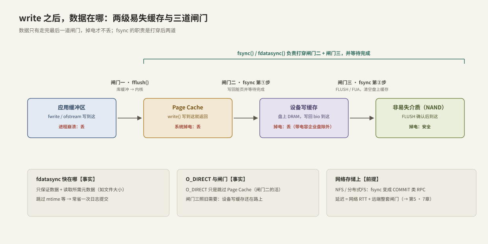
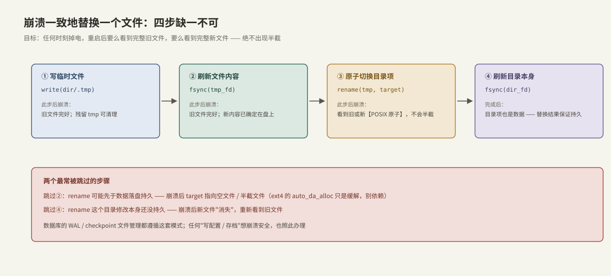

---
tags:
  - 高性能存储
  - Linux-IO路径
---
# fsync fdatasync 与持久化语义

> `write` 返回、甚至 `O_DIRECT` 写完，数据都可能在掉电后消失。持久化（durability）是一条要打穿**两级易失缓存、三道闸门**的完整链路，`fsync` 家族就是打穿它的工具——也是整个写路径上最贵、最诚实的等待点。

前置：[[1.2 Page Cache 命中与未命中]]（脏页与回写）、[[1.3 Buffered IO 与 O_DIRECT]]（两种写模式）。

---

## 1. 持久化到底指什么：数据的四站旅程

**定义【事实】**：一笔写入是"持久的"，当且仅当系统在任意时刻掉电重启后，仍能完整读回它。

对着下图数一数，`fwrite` 之后数据离"持久"还差几站：



| 站点 | 数据到达方式 | 掉电/崩溃后果 |
| --- | --- | --- |
| 应用缓冲区（stdio / ofstream 的库缓冲） | `fwrite`、`operator<<` | **进程崩溃就丢**（连内核都没进） |
| Page Cache（内核 DRAM） | `write()` 返回即到 | 进程崩溃不丢；**系统掉电丢** |
| 设备写缓存（盘上 DRAM） | 写回 bio 完成即到 | **掉电丢**（带掉电保护电容的企业盘除外——这是买企业盘的核心理由之一【取舍】） |
| 非易失介质（NAND/磁盘） | FLUSH 确认后 | 安全 |

三道闸门对应三个动作：

1. **闸门一 `fflush()` / `std::ofstream::flush()`**：库缓冲 → 内核。**【事实】C++ 工程师最常踩的坑：`flush()` 和 `std::endl` 只推进到这里**——数据变成内核脏页，离盘还差两站。
2. **闸门二 fsync 第①步**：把该文件的脏页写回设备并**等待完成**。
3. **闸门三 fsync 第②步**：向设备发 FLUSH 命令（内核层面是带 `REQ_PREFLUSH` 的请求），令其清空写缓存到介质，并等待确认。

**【事实】** `fsync` 的承诺覆盖闸门二 + 三；`fflush` 是应用自己的责任。`close()` **不隐含** fsync——关掉文件不等于数据落盘。

---

## 2. fsync 在内核里做什么，等待点在哪

`fsync(fd)` 的语义【事实】：把该文件的**数据脏页 + 元数据**（大小、块映射等，日志型文件系统里体现为一次 journal 提交）全部持久化，成功返回时保证已到介质。

**等待点分析**——fsync 是写路径上最"硬"的阻塞，延迟由三段叠加：

```text
fsync 延迟 ≈ 未写回脏页量 / 设备写带宽     ← 攒了多少债
           + 文件系统日志提交               ← ext4 journal 等
           + 设备 FLUSH                    ← 清空整个写缓存
```

- 攒的脏页越多，第一段越长——"平时全速写、定期 fsync"的模式会把延迟集中兑现成一根大毛刺;
- **【量级/硬件差异】** FLUSH 在消费级 SATA SSD 上可达毫秒级；企业级 NVMe 带电容，FLUSH 近乎免费。同一份代码在两种盘上的 fsync 延迟能差一个数量级——这是**前提**差异，不是代码差异；
- **【实现】** FUA（Force Unit Access）写可以让单个写请求直达介质、跳过全量 FLUSH，内核在合适时机自动使用。

因为 fsync 贵，就有了**攒一批事务共享一次 fsync** 的 group commit（[[6.2 Group Commit]]），以及 WAL 顺序追加把随机写变顺序写的设计（[[6.1 WAL 与 Crash Consistency]]）。

---

## 3. fdatasync：省掉的是哪部分

**【事实】** `fdatasync` 只保证**数据 + 检索数据所必需的元数据**。文件大小变化（append 场景）属于"必需"，会被刷；`mtime/atime` 这类不影响读回数据的元数据不刷——于是常能省掉一次日志提交。

| 调用 | 数据 | 大小等必需元数据 | mtime 等 | 相对成本 |
| --- | --- | --- | --- | --- |
| `fsync` | 刷 | 刷 | 刷 | 最贵 |
| `fdatasync` | 刷 | 刷 | 不刷 | 常显著更便宜 |

**实践结论**：WAL / 日志追加场景用 `fdatasync` 就足够且更快——这正是主流数据库的默认选择。

`O_SYNC` / `O_DSYNC` 打开标志则把对应语义附着到**每次 write** 上（write 返回即已持久化），省一次系统调用、换来每写都付全价【取舍】；数据库日志常用组合 `O_DIRECT | O_DSYNC`：绕过页缓存 + 每写直达介质。

---

## 4. 目录也是文件：崩溃一致的文件替换

最容易被忽略的一条【事实】：**创建、删除、rename 修改的是目录的内容**，目录项不刷盘，文件本身刷得再干净也可能"消失"。标准的崩溃一致替换流程：



1. `write(dir/.tmp)`——新内容写进同目录的临时文件（同目录保证 rename 不跨文件系统）；
2. `fsync(tmp_fd)`——新内容先落盘；
3. `rename(tmp, target)`——**【事实】POSIX 保证 rename 原子**：观察者要么看到旧文件要么看到新文件，绝无半截；
4. `fsync(dir_fd)`——把"目录项已切换"这件事本身持久化。

跳过第 2 步：rename 可能先于数据持久，崩溃后 target 指向空/半截文件（ext4 的 `auto_da_alloc` 启发式只是缓解，不是承诺）。跳过第 4 步：崩溃后 rename 被回滚，新文件"消失"。

---

## 5. fsync 失败了怎么办：fsyncgate

**【事实/历史】** 2018 年 PostgreSQL 社区发现：fsync 返回 `EIO` 后，Linux 会**清除该错误标志**，此时脏页可能已被标记干净但数据并没写成——重试 fsync 会"成功"，数据却丢了。内核 4.13+ 用 `errseq_t` 改进了错误上报（每个打开的 fd 都能看到一次错误），但根本结论不变：

> [!warning] 铁律
> **fsync 失败 = 该文件在盘上的状态未知。** 重试没有意义（脏页可能已丢），唯一安全的反应是把错误当致命：崩溃重启、从 WAL/副本重建。PostgreSQL 的最终修复就是 PANIC on fsync failure。详细展开见 [[6.3 fsyncgate 与 EIO 处理]]。

这也是 Modern C++ 封装里 fsync 必须抛异常（而不是返回 bool 让人忽略）的理由。

---

## 6. 网络文件系统上的 fsync

**【前提】** 换到 NFS / 分布式文件系统，闸门的物理位置变了：客户端的 write 通常只进本地缓存，`fsync` 触发 COMMIT 类 RPC，等待**远端**完成它那一整套"页缓存 → 设备缓存 → 介质"的流程。等待点从"本机介质延迟"变成：

```text
fsync 延迟 ≈ 网络 RTT + 远端写带宽 × 未提交量 + 远端 FLUSH
```

分布式系统还要再乘上副本因子（多数派确认）——这是第 5、7 章延迟分解的主题（[[5.4 延迟分解方法论]]）。单机笔记里先记住：**fsync 的语义不变，代价的构成变了**。

---

## 7. Modern C++：可靠落盘的两个原语

复用 1.1 的 `UniqueFd`/`open_file`，把本篇的规则固化成代码——同步失败一律抛异常，杜绝"忽略返回值"这一 fsyncgate 温床：

```cpp
#include <fcntl.h>
#include <unistd.h>

#include <cerrno>
#include <filesystem>
#include <span>
#include <system_error>

void sync_or_throw(int fd, const char* what) {
    if (::fdatasync(fd) != 0) {
        // 【事实】此后文件状态未知：调用方应视为致命错误
        throw std::system_error{errno, std::generic_category(), what};
    }
}

void write_all(int fd, std::span<const std::byte> data) {
    std::size_t off = 0;
    while (off < data.size()) {
        const ssize_t n = ::write(fd, data.data() + off, data.size() - off);
        if (n < 0) {
            if (errno == EINTR) continue;
            throw std::system_error{errno, std::generic_category(), "write"};
        }
        off += static_cast<std::size_t>(n);
    }
}
```

崩溃一致替换（第 4 节四步的直译）：

```cpp
// 原子地把 data 变成 target 的新内容：任意时刻掉电，target 要么旧要么新
void atomic_replace(const std::filesystem::path& target,
                    std::span<const std::byte> data) {
    const auto dir = target.parent_path();
    const auto tmp = target.string() + ".tmp";

    {   // ① 写临时文件 + ② 刷数据（O_EXCL：残留 tmp 时报错而非静默覆盖）
        int raw = ::open(tmp.c_str(),
                         O_WRONLY | O_CREAT | O_EXCL | O_CLOEXEC, 0644);
        if (raw < 0) throw std::system_error{errno, std::generic_category(), tmp};
        UniqueFd fd{raw};
        write_all(fd.get(), data);
        sync_or_throw(fd.get(), "fdatasync(tmp)");
    }   // RAII：rename 前确保 fd 已关闭

    // ③ 原子切换目录项
    if (::rename(tmp.c_str(), target.c_str()) != 0) {
        throw std::system_error{errno, std::generic_category(), "rename"};
    }

    // ④ 把目录项的变化也刷下去
    int draw = ::open(dir.c_str(), O_RDONLY | O_DIRECTORY | O_CLOEXEC);
    if (draw < 0) throw std::system_error{errno, std::generic_category(), dir.string()};
    UniqueFd dirfd{draw};
    if (::fsync(dirfd.get()) != 0) {
        throw std::system_error{errno, std::generic_category(), "fsync(dir)"};
    }
}
```

**关键点**：

- 临时文件与目标**同目录**：rename 不允许跨文件系统，且同目录才能靠一次目录 fsync 收尾；
- 内容用 `fdatasync` 足够（新文件大小属于必需元数据，会被刷）；目录用 `fsync`；
- 作用域块让 `UniqueFd` 在 rename 前析构——文件内容的生命周期管理与内存资源完全同构。

---

## 8. 动手验证

```bash
# 看应用到底有没有做持久化、在哪一步等待（-T 显示每次调用耗时）
strace -T -e trace=write,fsync,fdatasync -p <pid>

# 量化 fsync 的代价：同一块盘，每次写后是否 fdatasync
fio --name=nosync --filename=/data/f --rw=write --bs=4k --size=1G --fdatasync=0
fio --name=sync   --filename=/data/f --rw=write --bs=4k --size=1G --fdatasync=1

# 观察脏页水位随写入与 fsync 的涨落
watch -n1 'grep -E "Dirty|Writeback" /proc/meminfo'
```

预期：`fdatasync=1` 的 IOPS 相比 `fdatasync=0` 会断崖式下跌（每 4 KiB 都付一次闸门二+三的全价）；这个差距就是 group commit 要回收的空间。

---

## 9. 陷阱与误区

> [!warning] 常见错误
> 1. **`ofstream::flush()` / `fflush()` 当成落盘**：只过了闸门一，数据还在内核脏页里。
> 2. **`close()` 当成落盘**：close 不隐含 fsync。
> 3. **只 fsync 文件不 fsync 目录**：新建/rename 的文件崩溃后消失。
> 4. **fsync 失败后重试**：状态未知，重试返回的"成功"不可信——当致命错误处理。
> 5. **用消费级盘测出的 fsync 延迟推断线上企业盘**（或反过来）：FLUSH 成本差一个数量级，属于前提不同。
> 6. **平时不刷、攒到检查点一把 fsync**：延迟集中兑现成秒级毛刺；要么分摊、要么限制脏页水位。

---

## 10. 关键结论

| 结论 | 性质 |
| --- | --- |
| 持久化要打穿两级易失缓存：Page Cache 与设备写缓存 | 事实 |
| `flush()` 只到内核，`write` 返回只到页缓存，`close` 不隐含 fsync | 事实 |
| fsync = 写回脏页并等待 + 元数据/日志提交 + 设备 FLUSH | 事实 |
| WAL/追加场景 `fdatasync` 足够且更快；数据库日志常用 O_DIRECT+O_DSYNC | 事实 / 取舍 |
| rename 原子，但 rename 前刷内容、rename 后刷目录，四步缺一不可 | 事实 |
| fsync 失败 = 文件状态未知，必须视为致命错误（fsyncgate） | 事实 |
| fsync 延迟 = 脏页债 + 日志 + FLUSH；企业盘电容把 FLUSH 变便宜 | 量级 / 前提 |
| 网络存储上 fsync 语义不变，代价加上 RTT 与副本确认 | 前提 |

---

## 关联知识

- [[1.2 Page Cache 命中与未命中]] - 脏页从哪来、写回怎么触发
- [[1.3 Buffered IO 与 O_DIRECT]] - O_DIRECT 也逃不过闸门三
- [[6.1 WAL 与 Crash Consistency]] - 用顺序日志把持久化成本降到最低的工程范式
- [[6.2 Group Commit]] - 多事务分摊一次 fsync
- [[6.3 fsyncgate 与 EIO 处理]] - fsync 失败语义的完整事故分析
