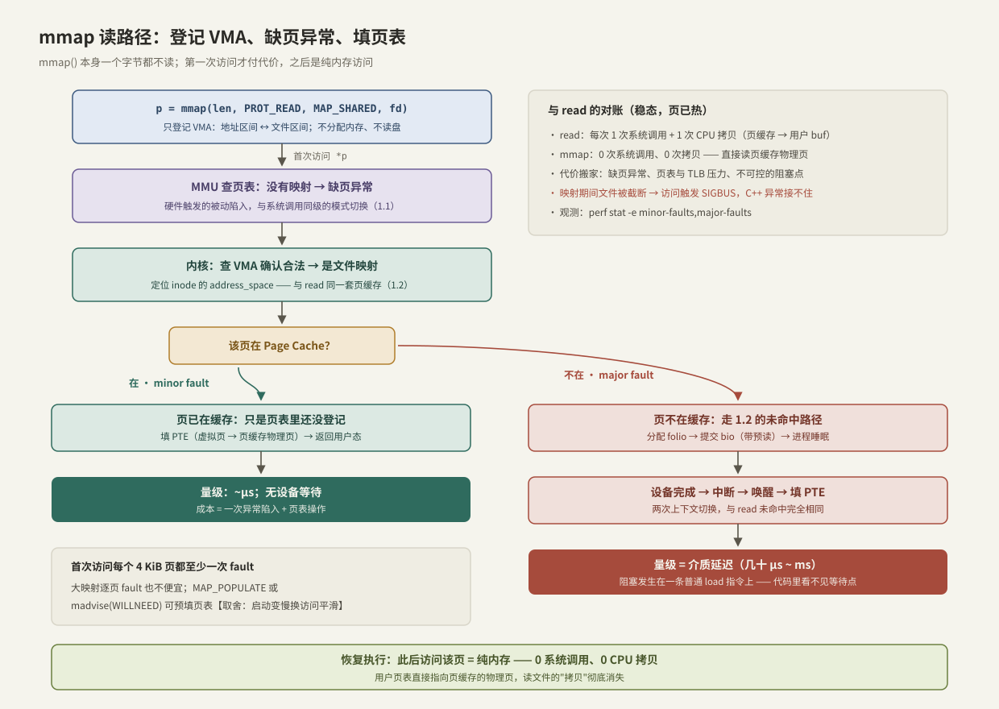

---
tags:
  - 高性能存储
  - Linux-IO路径
---
# mmap 读路径

> `mmap` 把文件映射进进程地址空间，"读文件"从此变成"读内存"：稳态下 0 系统调用、0 CPU 拷贝。代价是把开销搬到了看不见的地方——缺页异常、页表与 TLB，以及一个藏在普通 load 指令里的阻塞点。

前置：[[1.1 VFS 与系统调用路径]]（陷入与地址空间）、[[1.2 Page Cache 命中与未命中]]（mmap 与 read 共用的同一套页缓存）。

---

## 1. mmap 做了什么：只是登记

```cpp
void* p = ::mmap(nullptr, len, PROT_READ, MAP_SHARED, fd.get(), 0);
```

**【事实】** 这一步**一个字节都不读**。内核只是在进程的地址空间里登记一个 VMA（Virtual Memory Area）："虚拟地址区间 `[p, p+len)` 对应文件 `fd` 的 `[0, len)`"。不分配物理内存、不建页表项、不发 IO——纯粹的簿记，微秒级返回。

用多进程背景快速对齐概念：进程地址空间就是一张 VMA 列表（代码段、堆、栈本质上都是 VMA），`mmap` 只是往里加一条。`cat /proc/<pid>/maps` 能直接看到它。

真正的代价从第一次访问开始。

---

## 2. 首次访问：缺页异常路径



按图走一遍 `*p` 第一次执行时发生的事：

1. **[硬件]** CPU 执行 load，MMU 查页表——该虚拟页没有映射 → 触发**缺页异常**。这是一次**被动陷入**：和系统调用同级的模式切换（1.1），只是发起者是硬件而不是代码；
2. **[内核]** 缺页处理程序查 VMA：地址合法、是文件映射 → 定位到 inode 的 `address_space`——**与 read 完全同一套页缓存**；
3. 分岔（术语【事实】）：
   - **minor fault**：页已在 Page Cache（别的进程读过、预读读过），只需**填一条 PTE**（页表项：虚拟页 → 页缓存物理页）→ 返回。**等待点：无设备等待**，量级 ~μs；
   - **major fault**：页不在缓存 → 走 [[1.2 Page Cache 命中与未命中]] 的未命中路径（分配 folio → 提交 bio（带预读）→ **睡眠**→ 中断唤醒 → 填 PTE）。**等待点：介质延迟 + 两次上下文切换**，与 read 未命中完全相同；
4. **[硬件]** 恢复执行那条 load——这次页表命中，直接读到数据。

此后对该页的所有访问都是纯内存操作：**0 系统调用、0 CPU 拷贝**——用户页表直接指向页缓存的物理页，read 路径里那次 `copy_to_user` 彻底消失。

---

## 3. 与 read 对账：拷贝、系统调用、等待点

| 维度 | read | mmap |
| --- | --- | --- |
| 稳态每次访问 | 1 次系统调用 + 1 次 CPU 拷贝 | 0 + 0（纯内存） |
| 冷数据 | 未命中：睡眠等 folio | major fault：同样睡眠，成本相同 |
| 首次触碰热页 | 命中，仍付系统调用+拷贝 | minor fault（~μs），之后归零 |
| 阻塞点可见性 | **显式**：就在 `read()` 调用处 | **隐式**：任何一条访存指令都可能睡 ms 级 |
| 错误报告 | 返回 -1 + `errno`（如 EIO） | **SIGBUS 信号**，异常接不住 |
| 内存形态 | 数据在缓存和用户 buf 各一份 | 只有页缓存一份，多进程映射共享同一物理页 |

两条最重要的推论：

- **【事实】等待点隐形化是 mmap 最危险的性质**：对事件循环 / 低延迟线程，一条看似无辜的 `data[i]` 可能变成毫秒级 major fault。read 的阻塞至少写在函数名上，mmap 的阻塞藏在每一次解引用里。
- **【前提】** 换到网络文件系统上，major fault 的介质延迟变成网络 RTT + 远端全套读路径——隐形等待点被放大得更狠。

**预读依然工作【事实】**：major fault 走的是同一条 `filemap` 路径，readahead 照常生效；还可以用 `madvise` 主动声明访问模式（`MADV_SEQUENTIAL`/`MADV_RANDOM`/`MADV_WILLNEED`，与 fadvise 同族，[[1.6 readahead 与 posix_fadvise]]）。

---

## 4. 写与两种映射语义

本篇主讲读，写只需记两条【事实】：

- **`MAP_SHARED` 写**：直接把页缓存页改脏——与 `write()` 殊途同归，进入 [[1.2 Page Cache 命中与未命中]] 的脏页生命周期；持久化同样要走闸门（`msync(MS_SYNC)` ≈ 对映射区做 fsync，规则见 [[1.4 fsync fdatasync 与持久化语义]]）；
- **`MAP_PRIVATE` 写**：写时复制（COW）——首次写触发 fault，内核复制一份匿名页给本进程，**永不回写文件**。加载器映射可执行文件用的就是它。

---

## 5. 何时选 mmap【取舍】

**适合**：

1. **大文件随机点查**：省掉每次点查的系统调用 + 拷贝，索引/字典/列存元数据的典型形态；
2. **多进程共享只读数据**：N 个进程映射同一文件 = 一份物理内存 + 各自页表，天然共享（模型权重、只读词表）；
3. **把文件当内存数据结构**：直接在映射上跑二分/指针跳转，代码简洁（配合定长布局或偏移量索引）。

**不适合**：

1. **顺序流式处理**：read + 预读同样打满带宽，且阻塞点可控、错误可处理——mmap 在这里只赚了一点拷贝、赔上整页 fault 与 TLB 开销，还常常更慢；
2. **低延迟线程**：隐形 major fault 不可接受（除非配 `mlock`/`MAP_POPULATE` 预填，代价是启动变慢、内存钉死【取舍】）；
3. **文件会被并发截断/增长的场景**：SIGBUS 风险（见下节）；
4. 32 位环境的大文件（地址空间不够——现在少见但要知道边界）。

---

## 6. SIGBUS：mmap 特有的错误形态

**【事实】** read 遇到坏块/截断返回 `EIO`/短读，errno 可以体面处理；mmap 之后，**文件在映射期间被别人截断，访问被截掉的页会收到 SIGBUS 信号**——默认直接杀进程，C++ 的 try/catch 完全接不住（信号不是异常）。

工程上的处理选项，按推荐顺序：

1. **规避**：不映射会被并发截断的文件；自己的文件用"只追加 + rename 替换"（1.4 的模式）而非原地截断；
2. **协议约束**：映射前 `fstat` 固定长度，只访问 `[0, st_size)`；
3. 真要硬扛：`sigaction` 捕获 SIGBUS + `siglongjmp` 逃逸——复杂且易错，只在存储引擎这类不得不做的地方出现。

---

## 7. Modern C++：RAII 的只读映射

映射与 fd 一样是裸资源（忘记 `munmap` 就泄漏地址空间），同样用 RAII 收编。注意一个反直觉的点：**映射建立后就可以关掉 fd**——VMA 持有对文件的引用（1.1 的引用计数又一次出场）：

```cpp
#include <fcntl.h>
#include <sys/mman.h>
#include <sys/stat.h>
#include <unistd.h>

#include <cstddef>
#include <span>
#include <system_error>
#include <utility>

// 只读文件映射：构造即映射，析构即 munmap；仅移动
class MappedFile {
public:
    explicit MappedFile(const char* path) {
        UniqueFd fd = open_file(path);           // 1.1：O_RDONLY | O_CLOEXEC

        struct stat st{};
        if (::fstat(fd.get(), &st) != 0) {
            throw std::system_error{errno, std::generic_category(), "fstat"};
        }
        size_ = static_cast<std::size_t>(st.st_size);
        if (size_ == 0) return;                  // 空文件：不映射，view() 为空

        void* p = ::mmap(nullptr, size_, PROT_READ, MAP_SHARED, fd.get(), 0);
        if (p == MAP_FAILED) {
            throw std::system_error{errno, std::generic_category(), "mmap"};
        }
        addr_ = p;
    }   // fd 在此析构关闭：VMA 自己持有文件引用，映射依旧有效

    MappedFile(MappedFile&& o) noexcept
        : addr_{std::exchange(o.addr_, nullptr)},
          size_{std::exchange(o.size_, 0)} {}
    MappedFile& operator=(MappedFile&& o) noexcept {
        if (this != &o) {
            reset();
            addr_ = std::exchange(o.addr_, nullptr);
            size_ = std::exchange(o.size_, 0);
        }
        return *this;
    }
    MappedFile(const MappedFile&) = delete;
    MappedFile& operator=(const MappedFile&) = delete;
    ~MappedFile() { reset(); }

    std::span<const std::byte> view() const noexcept {
        return {static_cast<const std::byte*>(addr_), size_};
    }

    // 声明访问模式，指导内核预读策略（→ 1.6）
    void advise(int advice) {
        if (addr_ != nullptr && ::madvise(addr_, size_, advice) != 0) {
            throw std::system_error{errno, std::generic_category(), "madvise"};
        }
    }

private:
    void reset() noexcept {
        if (addr_ != nullptr) {
            ::munmap(addr_, size_);
            addr_ = nullptr;
            size_ = 0;
        }
    }

    void* addr_ = nullptr;
    std::size_t size_ = 0;
};
```

使用与观察：

```cpp
MappedFile mf{"/data/index.bin"};
mf.advise(MADV_RANDOM);                    // 点查负载：关掉顺序预读
const auto data = mf.view();
// 从此 data[i] 就是文件第 i 字节 —— 但记住：每个首次触碰的页都是一次 fault
```

**关键点**：

- 空文件必须特判：`mmap` 长度为 0 是 `EINVAL`；
- `view()` 返回 `std::span`：边界随对象走，杜绝越界指针算术；
- 映射生命周期与 fd 解耦是**事实**而非技巧——理解它靠的是 1.1 的引用计数模型。

---

## 8. 动手验证

```bash
# fault 计数直接印证本篇模型：第一遍大量 major，第二遍全是 minor/零
perf stat -e minor-faults,major-faults ./mmap_reader /data/bigfile
# 或
/usr/bin/time -v ./mmap_reader /data/bigfile 2>&1 | grep -i fault

# 对照：清掉缓存再跑，major fault 数 ≈ 文件页数 / 预读合并度
sync && echo 3 | sudo tee /proc/sys/vm/drop_caches
```

再配合 [[1.2 Page Cache 命中与未命中]] 的冷热读实验改成 mmap 版本，可以量出四种组合（read/mmap × 冷/热）的完整延迟矩阵——这就是 [[1.8 一次 read write 全路径图]] 要拼的最后一块。

---

## 9. 陷阱与误区

> [!warning] 常见错误
> 1. **"mmap 总比 read 快"**：顺序流式场景常常相反；快慢取决于 fault/TLB 成本与省掉的拷贝谁大。
> 2. **在低延迟线程里裸访问映射**：隐形 major fault 打爆尾延迟；要么预填（MAP_POPULATE/mlock），要么别用。
> 3. **映射被并发截断的文件**：SIGBUS 杀进程，异常接不住。
> 4. **以为 mmap 绕过了 Page Cache**：恰恰相反，它比 read 更贴着页缓存——绕过缓存的是 O_DIRECT（[[1.3 Buffered IO 与 O_DIRECT]]）。
> 5. **忘了 offset 必须页对齐**：`mmap` 的文件偏移参数须是页大小整数倍，映射中间段时用对齐偏移 + 内部修正。
> 6. **MAP_SHARED 写完不 msync 就当持久了**：脏页规则一视同仁（→ 1.4）。

---

## 10. 关键结论

| 结论 | 性质 |
| --- | --- |
| mmap 本身只登记 VMA，不读数据；代价全部延迟到首次访问 | 事实 |
| minor fault = 只补页表（~μs）；major fault = 完整设备 IO + 两次切换 | 事实 / 量级 |
| mmap 与 read 共用同一套 Page Cache；预读与 madvise 照常生效 | 事实 |
| 稳态 mmap：0 系统调用 0 拷贝；开销转移为 fault、页表、TLB | 事实 |
| 阻塞点从显式的 read() 变成任意一条访存指令——低延迟场景的隐患 | 事实 → 实践结论 |
| 错误形态从 errno 变成 SIGBUS，C++ 异常机制接不住 | 事实 |
| 随机点查、多进程共享只读数据选 mmap；顺序流式、低延迟线程选 read | 取舍 |
| 映射建立后 fd 可关闭：VMA 持有文件引用 | 事实 |

---

## 关联知识

- [[1.2 Page Cache 命中与未命中]] - major fault 走的正是那条未命中路径
- [[1.6 readahead 与 posix_fadvise]] - madvise/fadvise 这对声明式预读接口的全貌
- [[1.4 fsync fdatasync 与持久化语义]] - MAP_SHARED 写脏页的持久化规则
- [[1.8 一次 read write 全路径图]] - read/mmap/O_DIRECT 三条路径的总对账
