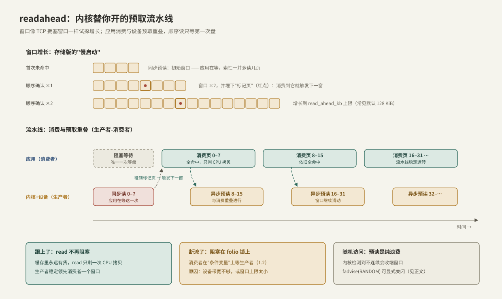

# readahead 与 posix_fadvise

> 顺序读大文件时 `read` 几乎从不阻塞，不是因为盘快，而是内核在背后开了一条**预取流水线**：你消费第 N 页时，设备正在搬第 N+8 页。readahead 是内核的启发式，`posix_fadvise` 是你给这条流水线下的显式指令。

前置：[[1.2 Page Cache 命中与未命中]]（未命中路径与 folio 锁）。

---

## 1. 为什么需要预读：把等待藏进重叠里

单次未命中的介质延迟无法消除（几十 μs 起），但顺序负载有一个可利用的事实：**下一步读什么是可预测的**。于是内核把"取数"提前发出，让设备搬运与应用消费**并行**——这就是经典的生产者-消费者流水线：

| 流水线角色 | 存储里的对应 | C++ 多线程里的对应 |
| --- | --- | --- |
| 生产者 | 内核 readahead + 设备 DMA | 后台预取线程 |
| 缓冲区 | Page Cache 中的预读窗口 | 有界队列 |
| 消费者 | 应用的 read 循环 | 工作线程 |
| 缓冲区空时 | 阻塞在 folio 锁上（1.2 的睡眠） | `condition_variable::wait` |
| 生产过量 | 缓存污染、挤掉热数据 | 队列吃光内存——都需要背压 |

**要多深的"在途"才能打满设备？** 这与 TCP 的带宽时延积（BDP）同构【网络层级的同一个定律】：

```text
在途数据量 = 带宽 × 延迟
示例：设备 2 GB/s、延迟 100 μs → 需要 ~200 KiB 在途才能喂饱
```

预读窗口就是存储版的"发送窗口"，`read_ahead_kb` 是它的上限（示例为量级计算，实际以实测为准）。

---

## 2. 机制：窗口增长与标记页



**【实现】** Linux 的做法（行为随版本微调，骨架稳定）：

1. **同步预读**：首次未命中时，应用反正要等这次 IO，内核索性把初始窗口一起读上来；
2. **顺序确认与窗口增长**：继续顺序命中，窗口按倍数增长，直到 `read_ahead_kb` 上限（常见默认 128 KiB，`/sys/block/<dev>/queue/read_ahead_kb` 可调）——像 TCP 慢启动一样"试探着放大在途量"；
3. **标记页（异步预读触发器）**：每个窗口里埋一页标记（`PG_readahead`）。应用消费到标记页时，内核**提前**发出下一窗口的 IO——流水线不断流，这正是双缓冲的"消费 A 时填充 B"；
4. **随机访问检测**：访问不连续时窗口收缩直至关闭——对随机负载，预读是纯浪费（读上来的页没人用，还占带宽和内存）。

**等待点视角**：预读跟上了，read 的等待点消失，只剩每次一次 CPU 拷贝；预读断流（设备带宽不够 / 窗口上限太小），应用重新阻塞在 folio 锁上——消费者等生产者。**拷贝视角**：预读不增加拷贝，DMA 直接进页缓存，拷贝仍只有 `copy_to_user` 那一次。

**【事实】** mmap 的 major fault 同样触发预读（[[1.5 mmap 读路径]]）；O_DIRECT 完全没有预读（[[1.3 Buffered IO 与 O_DIRECT]]）——绕过页缓存就绕过了流水线。

---

## 3. posix_fadvise：给内核递作战地图

启发式再好也只能"猜"，`posix_fadvise(fd, offset, len, advice)` 让你直接把访问模式告诉内核（`len = 0` 表示"从 offset 到文件尾"）：

| advice | 语义【事实】 | 典型场景 |
| --- | --- | --- |
| `POSIX_FADV_NORMAL` | 恢复默认启发式 | — |
| `POSIX_FADV_SEQUENTIAL` | 预读窗口加倍 | 顺序扫描大文件 |
| `POSIX_FADV_RANDOM` | 关闭预读 | 点查负载（B+ 树、索引文件） |
| `POSIX_FADV_WILLNEED` | 立即发起异步预读 | 预热马上要用的文件——`__builtin_prefetch` 的文件版 |
| `POSIX_FADV_DONTNEED` | 尝试丢弃区间内的 clean 页 | 流式处理防缓存污染；实验清缓存（1.2 用过） |
| `POSIX_FADV_NOREUSE` | 声明"只用一次"（**【实现】长期形同虚设，较新内核才有实效**） | 少依赖 |

`madvise` 是它的内存映射孪生（作用于 mmap 区间，1.5 已用过 `MADV_RANDOM`），语义一一对应。

**【取舍】** advice 是提示不是命令：WILLNEED 尽力而为、不保证读完；DONTNEED 只影响 clean 页。它们的价值在于替换掉内核的"猜"，把你已知的访问模式变成流水线参数。

---

## 4. Modern C++：顺序流式处理的完整姿势

大文件顺序处理的两板斧：进场先声明 `SEQUENTIAL`，边读边 `DONTNEED` 丢掉消费完的区间——吞吐拉满的同时不污染缓存（复用 1.1 的 `UniqueFd`/`open_file`）：

```cpp
#include <fcntl.h>
#include <unistd.h>

#include <cerrno>
#include <cstddef>
#include <span>
#include <system_error>
#include <vector>

void fadvise_or_throw(int fd, off_t off, off_t len, int advice) {
    // 【事实】posix_fadvise 直接返回错误码，不设 errno——与多数系统调用不同
    if (const int err = ::posix_fadvise(fd, off, len, advice); err != 0) {
        throw std::system_error{err, std::generic_category(), "posix_fadvise"};
    }
}

// 顺序流式消费整个文件：on_chunk 形如 void(std::span<const std::byte>)
template <typename Chunk>
void stream_file(const char* path, Chunk&& on_chunk) {
    UniqueFd fd = open_file(path);
    fadvise_or_throw(fd.get(), 0, 0, POSIX_FADV_SEQUENTIAL);   // 窗口加倍

    std::vector<std::byte> buf(1 << 20);        // 1 MiB 读块
    off_t pos = 0;                              // 已消费到的偏移
    off_t dropped = 0;                          // 已丢弃到的偏移
    while (true) {
        const ssize_t n = ::read(fd.get(), buf.data(), buf.size());
        if (n < 0) {
            if (errno == EINTR) continue;
            throw std::system_error{errno, std::generic_category(), "read"};
        }
        if (n == 0) break;                      // EOF
        on_chunk(std::span<const std::byte>{buf.data(),
                                            static_cast<std::size_t>(n)});
        pos += n;
        if (pos - dropped >= (32 << 20)) {      // 每消费 32 MiB
            // 丢掉已消费区间的缓存页：流式负载不会回头读
            fadvise_or_throw(fd.get(), dropped, pos - dropped,
                             POSIX_FADV_DONTNEED);
            dropped = pos;
        }
    }
}

// 预热下一个要处理的文件：异步提示，立即返回，不阻塞当前工作
void prefetch_file(const char* path) {
    UniqueFd fd = open_file(path);
    fadvise_or_throw(fd.get(), 0, 0, POSIX_FADV_WILLNEED);
}   // fd 关闭不影响已发出的预读：页缓存挂在 inode 上（1.1/1.2）
```

**关键点**：

- `DONTNEED` 按已消费区间分段丢弃，而不是最后一次性丢——缓存占用恒定在一个窗口大小；
- `prefetch_file` 是 WILLNEED 的流水线用法：处理文件 i 时预热文件 i+1，把"文件之间"的等待也重叠掉；
- fd 关闭后预读依然有效——页缓存属于 inode 不属于 fd，1.1 的对象模型再次解释了行为。

---

## 5. 动手验证

```bash
# 看当前窗口上限（KiB）
cat /sys/block/nvme0n1/queue/read_ahead_kb

# 实验：关掉预读，顺序读吞吐应声塌方；恢复后回升
echo 0   | sudo tee /sys/block/nvme0n1/queue/read_ahead_kb
fio --name=seq0 --filename=/data/big --rw=read --bs=128k --size=4G --direct=0
echo 128 | sudo tee /sys/block/nvme0n1/queue/read_ahead_kb
fio --name=seq1 --filename=/data/big --rw=read --bs=128k --size=4G --direct=0
# 每轮之间清缓存：sync && echo 3 | sudo tee /proc/sys/vm/drop_caches
```

预期：窗口为 0 时每次 read 都真等一次盘（流水线拆除，延迟串行叠加）；窗口正常时吞吐接近设备顺序带宽。这个对比是"重叠掩盖延迟"最直观的实证。

---

## 6. 陷阱与误区

> [!warning] 常见错误
> 1. **对顺序负载设了 RANDOM 忘记恢复**：预读关闭，顺序读退化成逐次等盘。advice 跟随打开的文件，作用域要想清楚。
> 2. **把 WILLNEED 当同步预载**：它只是发起异步预读并立即返回；要确认加载完成得自己读一遍或查 `mincore`。
> 3. **用 DONTNEED 清脏页**：无效——先 `fsync` 再 DONTNEED（1.2 实验的完整口诀）。
> 4. **给 O_DIRECT 文件调预读参数**：没有意义，O_DIRECT 不经过这条流水线（1.3）。
> 5. **NFS 上照搬本地窗口经验**：跨网络时 BDP = 网络带宽 × RTT，窗口要按网络参数重新估——同一个公式，另一组常数【前提】。

---

## 7. 关键结论

| 结论 | 性质 |
| --- | --- |
| 预读 = 内核维护的生产者-消费者流水线；窗口即"在途量"，上限 read_ahead_kb | 事实 / 实现 |
| 打满设备需要 在途量 = 带宽 × 延迟，与 TCP BDP 同一个定律 | 事实 |
| 标记页让下一窗提前起飞——消费与预取重叠，顺序读只等第一次盘 | 实现 |
| 预读跟上则 read 无等待点；断流则阻塞回 folio 锁（消费者等生产者） | 事实 |
| 随机负载预读是纯浪费：内核会收缩窗口，fadvise(RANDOM) 可直接关闭 | 事实 / 取舍 |
| 顺序流式标准姿势：SEQUENTIAL 进场 + 分段 DONTNEED 防污染 + WILLNEED 预热下一个 | 实践结论 |
| advice 是提示非命令；posix_fadvise 返回错误码而非设 errno | 事实 |

---

## 关联知识

- [[1.2 Page Cache 命中与未命中]] - 预读填充的就是那套页缓存；断流时睡的就是那把 folio 锁
- [[1.5 mmap 读路径]] - madvise 与 fadvise 的映射版对应
- [[1.7 块层与 blk-mq]] - 预读发出的 bio 在块层被合并成大请求
- [[1.3 Buffered IO 与 O_DIRECT]] - 放弃这条流水线的模式及其代价
