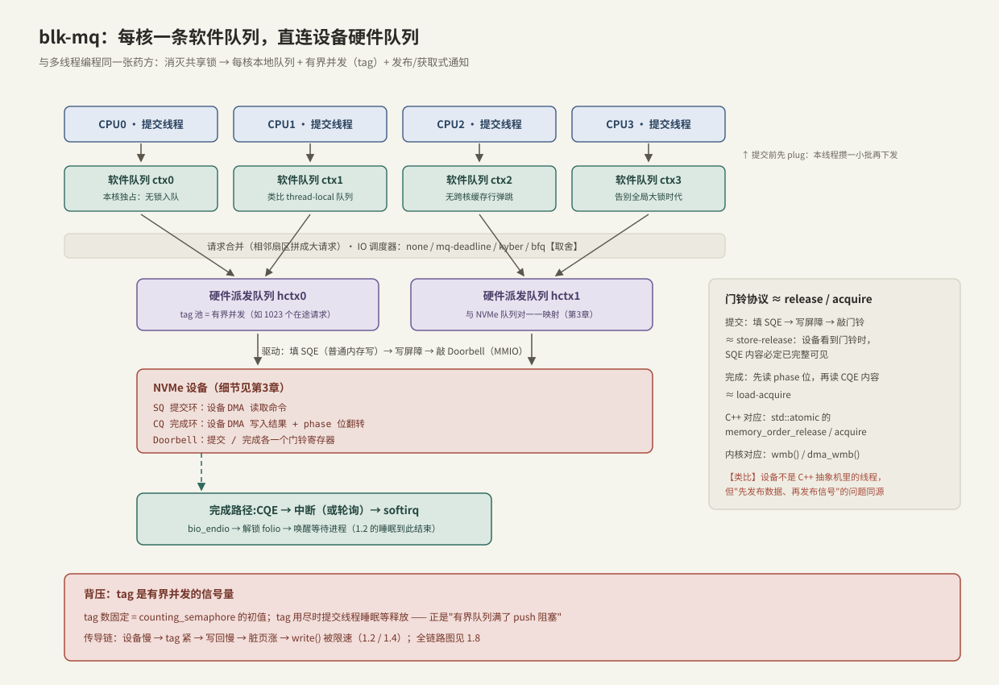
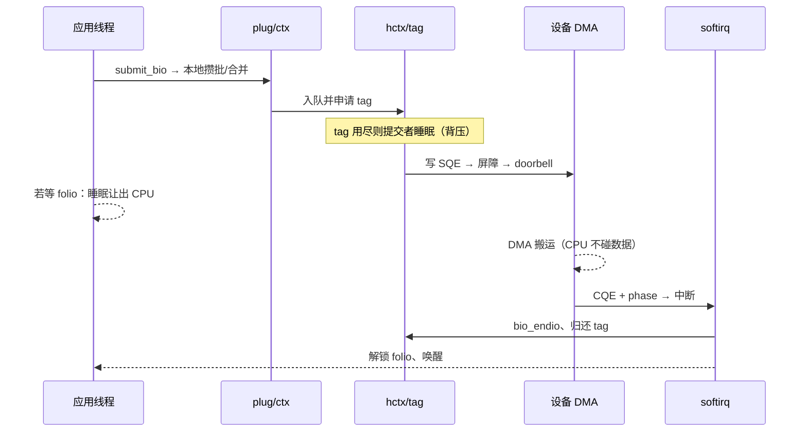

---
tags:
  - 高性能存储
  - Linux-IO路径
---
# 块层与 blk-mq

> 块层是文件系统与设备驱动之间的调度中枢：排队、合并、限流。它在多核时代的重构（blk-mq）用的是多线程工程师最熟悉的那张药方——**消灭共享锁、每核本地队列、有界并发、发布/获取式通知**。读懂它，等于把 C++ 并发课在内核里重修一遍。

前置：[[1.2 Page Cache 命中与未命中]]（bio 从哪里来）、[[1.3 Buffered IO 与 O_DIRECT]]（谁会直接打到块层）。

---

## 1. 块层在哪、管什么

文件系统把"读文件第 N 页"翻译成"读设备扇区 X..Y"后，产物是 **bio**——块层的基本工作单元【事实】：一个 bio 描述一次逻辑 IO（目标设备、起始扇区、长度、数据页列表）。块层的职责：

1. **排队**：多核并发提交的 bio 有序汇入设备；
2. **合并**：相邻扇区的小请求拼成大请求（顺序小写变大写，预读的多个页拼成一次传输）；
3. **调度**：决定谁先下发（公平性、防饿死、延迟目标）；
4. **限流与统计**：有界并发（tag）、iostat 的数据源。

本质问题是经典 MPMC：**多个生产者（所有 CPU 上的提交路径）对接有限并行度的消费者（设备）**。

---

## 2. 单队列之死：与全局锁队列同一个病

**【历史/取舍】** 老块层只有一条全局请求队列，一把自旋锁保护。HDD 时代无所谓——设备毫秒级，锁再热也不是瓶颈；NVMe 时代（百万 IOPS、几十核并发提交）这把锁成了整个存储栈的热点：缓存行在核间弹跳，加锁开销超过 IO 本身的软件成本。

这与 C++ 里"全局 `std::mutex` 保护的任务队列在高并发下崩溃"是**同一个病**，blk-mq（3.13 引入，5.0 起唯一实现）开的也是同一副药：

| blk-mq 的做法 | C++ 并发里的对应 | 消灭了什么 |
| --- | --- | --- |
| 每 CPU 一条软件队列（ctx） | thread-local / 分片队列 | 跨核锁争用与缓存行弹跳 |
| plug：提交前本线程攒批 | 本地 batch 后一次 flush | 频繁进出共享结构 |
| 硬件队列（hctx）+ 固定 tag 池 | `counting_semaphore` 限制在途任务 | 无界队列的失控排队 |
| 软硬队列 1:1 映射（NVMe 多队列） | 每线程绑定专属消费端 | 一切共享——理想形态 |
| doorbell 通知设备 | `atomic` store-release | 忙轮询或惊群 |
| 完成后唤醒 folio 等待者 | `condition_variable::notify` | —— |



---

## 3. 一个 bio 的一生

对照上图，从文件系统到设备再回来（等待点与队列逐一标注）：

1. **提交**：`submit_bio` 进入当前 CPU 的上下文；先进 **plug**——本线程的私有小批，攒几个再统一下发（**队列 #0**，无锁，纯本地）；
2. **合并**：下发时与已排队请求比对，扇区相邻则合并成大请求——预读窗口的 8 个页常在这里变成一次传输；
3. **软件队列 ctx**（**队列 #1**）：本核独占入队，无跨核争用；
4. **调度器**（可选）：none / mq-deadline / kyber / bfq 决定下发顺序（第 6 节）；
5. **硬件队列 hctx**（**队列 #2**）：先**申请 tag**——tag 池固定大小，代表设备允许的在途请求数。**等待点：tag 用尽时提交者睡眠**，这就是背压的产生点；
6. **驱动下发**：把请求写成 NVMe SQE（普通内存写）→ 内存屏障 → 写 doorbell 寄存器（MMIO）通知设备（**队列 #3**：设备 SQ，[[3.2 Queue Pair 与 Doorbell]]）；
7. **设备执行**：DMA 搬运数据（CPU 不参与）；
8. **完成**：设备写 CQE + 翻转 phase 位 → 中断（或轮询）→ softirq 里 `bio_endio` 回调链 → 归还 tag → 解锁 folio、唤醒等待进程（[[1.2 Page Cache 命中与未命中]] 的睡眠到此结束）。



**拷贝视角**：块层全程零拷贝——bio 携带的是页的引用，数据只被 DMA 碰一次。**等待点**：申请 tag（背压）与最终的 folio 锁（发起 IO 的进程），块层自身不睡。

---

## 4. 内存可见性：门铃协议 ≈ release / acquire

第 6、8 步藏着一个多线程工程师一眼就懂的问题：**驱动（CPU）和设备（DMA 引擎）是两个并发执行体，共享内存里的环形队列——谁保证设备看到的 SQE 是完整的？**

- **提交侧**：填 SQE 是普通内存写，可能被重排到 doorbell 写之后。所以必须"填完 SQE → **写屏障** → 敲 doorbell"——**≈ `store(memory_order_release)`**：门铃可见时，之前的所有写必定可见。内核用 `wmb()/dma_wmb()`；
- **完成侧**：设备写完 CQE 才翻转 phase 位；驱动先读 phase 位确认有新条目，再读 CQE 内容——**≈ `load(memory_order_acquire)`**。

**【类比，非等同】** 设备不是 C++ 抽象机里的线程，屏障用的是内核原语而非 `std::atomic`；但"**先发布数据、再发布信号，读者反向确认**"的问题与解法完全同源。这个协议不是性能优化而是正确性底线——没有屏障，设备可能 DMA 到写了一半的命令。

**为什么现在就要懂**：io_uring 把同样的环形队列暴露到用户态，liburing 内部做的正是这套 release/acquire（[[2.1 SQ CQ 模型]]）——在 1.7 看懂门铃，第 2 章就是旧知识。

---

## 5. 队列深度：利特尔法则的第二次出场

**【事实】** `在途请求数 L = 吞吐 λ × 单次延迟 W`（总纲的利特尔法则）。变形一下就是块层的核心账：

```text
吞吐 = iodepth / 延迟
示例：NVMe 随机读延迟 80 μs
  iodepth = 1  → 吞吐 = 1 / 80μs  = 12.5K IOPS   （设备能力的零头）
  iodepth = 32 → 吞吐 = 32 / 80μs = 400K IOPS    （开始接近设备并行度）
```

（示例为量级计算。）NVMe 内部是几十条通道/裸片的并行结构（第 3 章），**浅队列喂不饱它**——这就是 1.3 说"同步 O_DIRECT 小 IO 很惨"的定量版本。反方向【取舍】：队列过深，请求排队时间膨胀，p99 延迟上天——与线程池任务队列"堆积越深、单任务等待越久"完全同构。吞吐型负载加深、延迟型负载压浅，没有免费午餐。

---

## 6. IO 调度器【取舍】

| 调度器 | 策略 | 适用 |
| --- | --- | --- |
| `none` | 不调度，直通硬件队列 | NVMe 默认——设备内部已并行调度，软件再排序只添延迟 |
| `mq-deadline` | 读写各设截止期，防饿死 | SATA SSD / HDD、混合负载 |
| `kyber` | 按延迟目标自适应限流 | 想给读写各定延迟预算的场景 |
| `bfq` | 按进程公平分带宽 | 桌面交互（代价是吞吐） |

```bash
cat /sys/block/nvme0n1/queue/scheduler        # 查看：[none] mq-deadline kyber bfq
echo mq-deadline | sudo tee /sys/block/sda/queue/scheduler
```

判断标准与线程池选任务队列一样：**消费端自己够聪明（NVMe），生产端就别自作主张**；消费端简单（HDD 磁头），才值得在软件里精排。

---

## 7. 背压：tag 是有界并发的信号量

**【事实】** 每个硬件队列的 tag 数固定（设备队列深度决定）。tag 的行为与 `std::counting_semaphore` 逐条对应：申请 = `acquire()`（无 tag 则睡眠）、完成归还 = `release()`。它是整条背压链的中枢：

```text
设备慢 → CQE 回得慢 → tag 归还慢 → tag 池打满 → 提交者睡眠
       → 写回吞吐下降 → 脏页存量上涨 → write() 被限速（1.2/1.4）
```

**这就是"设备慢会让四层之上的应用线程睡着"的完整机制链**——每一环都是一个有界队列在满员时阻塞上游，与 C++ 里"有界队列 push 阻塞"传播背压的方式一模一样。全链路图在 [[1.8 一次 read write 全路径图]] 汇总。

用 C++ 把这个形状写出来（**心智模型，非内核代码**）：

```cpp
#include <atomic>
#include <semaphore>
#include <vector>

struct Request { /* 扇区、长度、完成回调…… */ };

// 硬件队列的形状：有界并发 + 发布/获取通知
class HardwareQueue {
public:
    explicit HardwareQueue(std::ptrdiff_t depth) : tags_{depth} {}

    void submit(Request r) {
        tags_.acquire();            // tag 用尽 → 阻塞在此：背压的产生点
        write_sqe(r);               // 填 SQE：普通内存写
        tail_.fetch_add(1, std::memory_order_release);  // 敲门铃：release 发布
    }

    void on_complete() {            // CQE 处理（中断/轮询侧调用）
        tags_.release();            // 归还 tag：唤醒等 tag 的提交者
    }

private:
    void write_sqe(const Request&) { /* ... */ }
    std::counting_semaphore<> tags_;
    std::atomic<uint32_t> tail_{0};
};

// 每线程先攒批再下发 = plug 的形状
thread_local std::vector<Request> plug_batch;
```

---

## 8. 观察：iostat 怎么读

```bash
iostat -x 1        # 关键列速查
```

| 列 | 含义 | 对应本篇概念 |
| --- | --- | --- |
| `r/s` `w/s` | 每秒完成的读/写请求 | 吞吐 λ |
| `rareq-sz` | 平均请求大小 | 合并效果（预读/顺序写 → 变大） |
| `aqu-sz` | 平均在途请求数 | iodepth 实况（利特尔法则的 L） |
| `r_await` `w_await` | 请求平均总延迟（含排队） | **排队 + 设备**，不是纯设备时间 |
| `%util` | 设备非空闲时间占比 | **【陷阱】多队列 NVMe 上 100% ≠ 饱和**——它只表示"始终有至少一个请求在途"，而设备可以并行几十个 |

`blktrace` 能把一个请求在块层的完整生命周期（入队 Q、合并 M、下发 D、完成 C）逐事件展开，延迟分段定位见 [[9.3 blktrace 与块层生命周期]]；指标体系详见 [[9.2 iostat 指标解读]]。

---

## 9. 陷阱与误区

> [!warning] 常见错误
> 1. **在 NVMe 上换调度器求提速**：多数场景 `none` 就是最优；先确认瓶颈真在调度。
> 2. **把 `%util` 100% 当设备饱和**：多队列设备要看 `aqu-sz` 与延迟的关系。
> 3. **把 `await` 当纯设备延迟**：它包含排队时间；队列越深 await 越虚高。
> 4. **无脑加大 `nr_requests`/iodepth**：吞吐涨到设备并行度就封顶，之后全是排队延迟（p99 变差）。
> 5. **忘了 plug/合并的存在**：微基准里逐个小 IO 的行为与真实批量负载完全不同。

---

## 10. 关键结论

| 结论 | 性质 |
| --- | --- |
| 块层职责：bio 的排队、合并、调度、限流；数据零拷贝，只传页引用 | 事实 |
| blk-mq = 每核软件队列 + 硬件队列 tag 池——与"消灭全局锁队列"的 C++ 药方同构 | 实现 / 类比 |
| doorbell 协议 = 先发布数据再发布信号 ≈ release/acquire；io_uring 用户态同款 | 事实 / 类比 |
| 吞吐 = iodepth / 延迟；浅队列喂不饱 NVMe，深队列膨胀 p99 | 事实 / 取舍 |
| tag 池 = counting_semaphore：背压的产生点，设备慢由此传导到应用 | 事实 |
| NVMe 默认 none 调度器通常正确；慢设备才值得软件精排 | 取舍 |
| %util 在多队列设备上失真；看 aqu-sz 与 await 的组合 | 实践结论 |

---

## 关联知识

- [[1.2 Page Cache 命中与未命中]] - bio 的来源与 folio 锁的最终唤醒
- [[1.6 readahead 与 posix_fadvise]] - 预读窗口在块层被合并成大请求
- [[3.2 Queue Pair 与 Doorbell]] - NVMe SQ/CQ 与门铃的设备端细节
- [[2.1 SQ CQ 模型]] - 同一套环形队列协议暴露到用户态
- [[9.2 iostat 指标解读]] / [[9.3 blktrace 与块层生命周期]] - 本篇概念的观测工具
