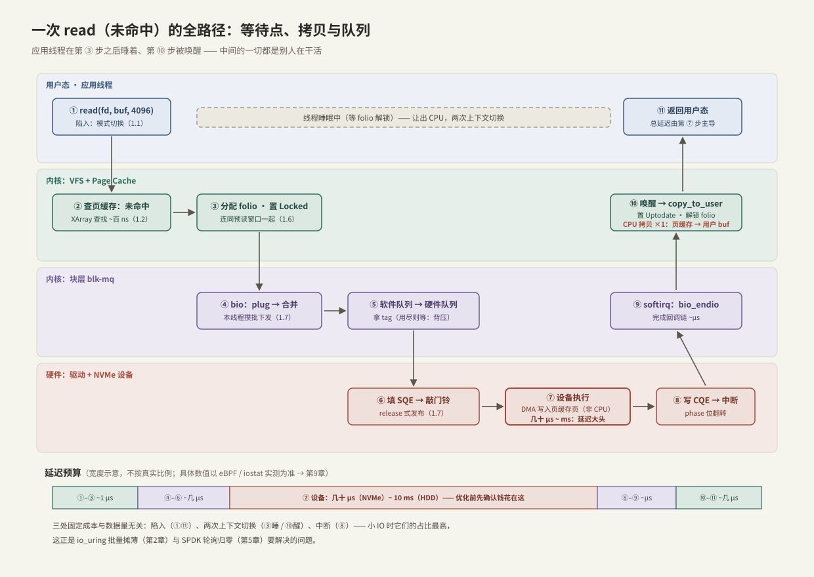
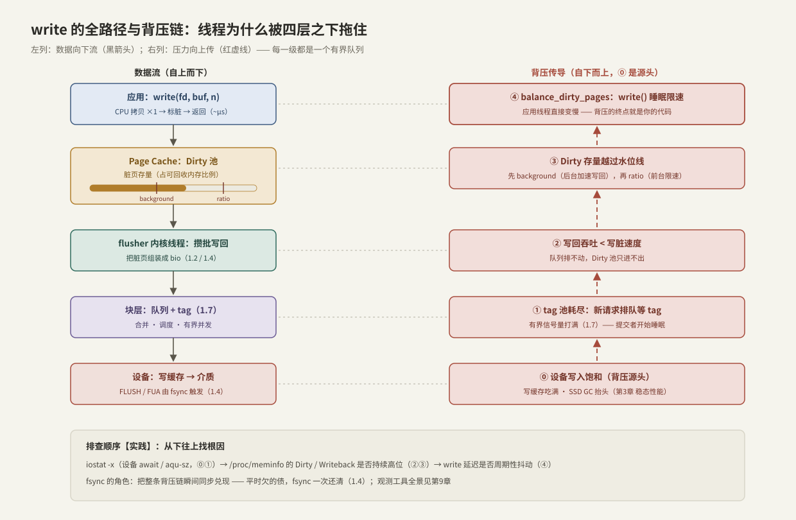

# 一次 read write 全路径图

> 本章收官：把 1.1–1.7 拼成两张完整地图。一次 read 未命中的 11 步、一次 write 的背压链——每一步的**等待点、拷贝、队列**全部就位。以后任何存储性能问题，先在这两张图上找到"钱花在哪一段"。

前置：本章全部（[[1.1 VFS 与系统调用路径]] 到 [[1.7 块层与 blk-mq]]）。

---

## 1. 为什么值得画这张图

总纲的方法论——画路径、数拷贝、数切换、看队列——需要一张底图。有了它：

- 性能优化不再靠猜：先测出延迟落在哪一段，再谈改哪里；
- 每种"加速技术"都能定位成**对图上某一段的修改**（O_DIRECT 删掉缓存段、io_uring 批量化两端、SPDK 删掉整个内核段）；
- 背压不再玄学：它就是图上的有界队列逐级向上传阻塞。

---

## 2. read（未命中）：11 步全路径



逐步对账（等待点 / 拷贝 / 队列三列就是全部要点）：

| 步 | 层 | 动作 | 等待点 | 拷贝 | 队列 |
| --- | --- | --- | --- | --- | --- |
| ① | 用户→内核 | `read()` 陷入，模式切换（1.1） | — | — | — |
| ② | VFS/页缓存 | XArray 查找：未命中（1.2） | — | — | — |
| ③ | 页缓存 | 分配 folio 置 Locked，含预读窗口（1.6） | — | — | — |
| ④ | 块层 | bio → plug → 合并（1.7） | — | — | plug 批 |
| ⑤ | 块层 | 软件队列 → 硬件队列 | **tag 用尽则睡（背压）** | — | ctx / tag 池 |
| ⑥ | 驱动 | 填 SQE → 屏障 → 敲门铃（release 式发布） | — | — | 设备 SQ |
| — | 用户态 | **应用线程睡眠**：等 folio 解锁，让出 CPU | **主等待点（上下文切换 #1）** | — | — |
| ⑦ | 设备 | 执行命令，**DMA 写入页缓存页** | 延迟大头：几十 μs~ms | DMA（非 CPU） | 设备内部并行 |
| ⑧ | 设备→驱动 | 写 CQE + phase 翻转 → 中断 | — | — | 设备 CQ |
| ⑨ | 块层 | softirq：`bio_endio` 回调、归还 tag | — | — | — |
| ⑩ | 页缓存 | 置 Uptodate、解锁、唤醒（切换 #2）→ `copy_to_user` | — | **CPU 拷贝 ×1** | — |
| ⑪ | 内核→用户 | 恢复现场返回 | — | — | — |

三个应该形成肌肉记忆的观察：

1. **应用线程只在两端干活**（①–③ 与 ⑩–⑪），中间一切都是内核线程、softirq 和设备在替你跑——这就是"阻塞 IO 不浪费 CPU，浪费的是本线程的延迟"；
2. **与数据量无关的固定成本**：一次陷入返回、两次上下文切换、一次中断。4 KiB 小 IO 时它们占比最高——io_uring 批量摊薄（第 2 章）、SPDK 轮询归零（第 5 章）都是冲着这几项去的；
3. **命中路径 = 只保留 ①②⑩⑪**：一条快路径微秒级，一条慢路径受介质支配，1.2 的两列图是本图的特例。

---

## 3. write：快路径 + 背压链



**前台快路径**（微秒级）：`write()` 陷入 → `copy_from_user`（**CPU 拷贝 ×1**）→ 标脏 → 返回。没有设备等待——债记在脏页池里。

**后台异步路径**：flusher 攒批 → bio → 块层（tag）→ 设备写缓存 → 介质。

**背压链**【事实】——右列自下而上，每级都是有界队列满员时阻塞上游：

```text
⓪ 设备写入饱和（写缓存吃满、SSD GC 抬头，第3章）
① tag 池耗尽：提交者排队（counting_semaphore 打满，1.7）
② 写回吞吐 < 写脏速度：Dirty 池只进不出
③ 越过 dirty_background_ratio（后台加速）→ 越过 dirty_ratio（前台受限）
④ balance_dirty_pages：write() 被内核强制睡眠限速 —— 背压终点是你的代码
```

与 C++ 的对应：这就是**有界队列的 `push` 满员阻塞**逐级传播——只不过队列有五层，而且"满"的判定各不相同（tag 计数、脏页比例、水位线）。两条工程推论：

- **write 突然变慢，根因常在四层之下**：先查设备（`iostat -x` 的 await/aqu-sz），再查 Dirty/Writeback 存量，最后才怀疑自己的代码；
- **fsync 是把整条链瞬间同步兑现**（1.4）：平时欠的债一次还清，所以它的延迟等于链上所有欠账之和。

---

## 4. 队列视角总表：整个栈是串联的有界队列

| 队列 | 容量参数 | 满了会怎样 | C++ 对应 |
| --- | --- | --- | --- |
| stdio/ofstream 库缓冲 | BUFSIZ 等 | flush 到内核（可能触发下面所有等待） | 应用层 buffer |
| 脏页池 | `dirty_background_ratio` / `dirty_ratio` | 后台加速 → 前台限速 | 高低水位背压 |
| plug 批 | 固定小批 | 自动 flush 下发 | 本地 batch |
| 软件队列 ctx | `nr_requests` | 提交等待 | 分片有界队列 |
| 硬件队列 tag 池 | 设备队列深度 | 提交者睡眠 | `counting_semaphore` |
| 设备内部 | 通道/裸片并行度 | 延迟上升（排队） | 线程池饱和 |
| （跨网络）发送窗口 | BDP | RTT 膨胀、限速 | 流控窗口 |

**【事实】** 任何一级的"满"都会把阻塞向上传，直到某个等待点落在你的线程上。性能调优的队列视角：**找到当前最先打满的那一级**，要么扩它的容量，要么降低进入它的速率——与调线程池完全同一套思维。

---

## 5. 三条变体：在同一张图上做删改

| 变体 | 对 read 图的修改 | 对 write 图的修改 | 详见 |
| --- | --- | --- | --- |
| O_DIRECT | 删掉②③⑩的缓存与拷贝：DMA 直达用户 buf；每次都走全路径 | 删掉脏页池与 flusher：同步等设备 | [[1.3 Buffered IO 与 O_DIRECT]] |
| mmap | ① 变成缺页异常（被动陷入）；⑩ 的拷贝消失（页表直指页缓存） | MAP_SHARED 写=直接标脏，其余同图 | [[1.5 mmap 读路径]] |
| io_uring | ①⑪ 批量化：一次陷入提交一批；睡眠变成收割 CQ | 同左 | [[2.1 SQ CQ 模型]] |

**核心不变量**：设备段（⑦）谁也删不掉——软件优化的天花板是介质延迟；要突破只能换介质或换拓扑（本地 → 远端并行，第 4–7 章）。

---

## 6. 延迟分解 runbook：自上而下二分

怀疑存储慢时，按图分段测量，每步把嫌疑范围砍半：

```bash
# 第 1 刀：总延迟多少，花在哪个系统调用上
strace -T -e trace=read,write,fsync -p <pid>

# 第 2 刀：是不是缓存问题（命中率崩了 → 查预读/缓存污染/内存压力）
sudo cachestat-bpfcc 1

# 第 3 刀：块层以下的延迟与队列（await 高 + aqu-sz 高 → 排队；await 高 + aqu-sz 低 → 设备）
iostat -x 1

# 第 4 刀：设备延迟分布（直方图看 p99 长尾）
sudo biolatency-bpfcc 1

# 写路径专用：背压是否已传到水位
grep -E 'Dirty|Writeback' /proc/meminfo
```

工具的完整用法与解读在第 9 章（[[9.1 fio Benchmark Matrix]]、[[9.2 iostat 指标解读]]、[[9.3 blktrace 与块层生命周期]]）；这里只需要记住**每把刀切在图的哪个位置**。

---

## 7. Modern C++：量出你自己的全路径

平均值会骗人（一次 major fault 抹平在均值里毫无痕迹），测延迟必须看分布。一个最小百分位工具：

```cpp
#include <fcntl.h>
#include <unistd.h>

#include <algorithm>
#include <chrono>
#include <cstddef>
#include <iostream>
#include <random>
#include <vector>

class LatencyRecorder {
public:
    void record(std::chrono::nanoseconds d) { ns_.push_back(d.count()); }

    // 实验工具级实现：排序取分位
    [[nodiscard]] double percentile_us(double p) {
        std::sort(ns_.begin(), ns_.end());
        const auto idx = static_cast<std::size_t>(p * (ns_.size() - 1));
        return static_cast<double>(ns_[idx]) / 1000.0;
    }

private:
    std::vector<long long> ns_;
};

// 随机 4 KiB 点查 n 次，输出延迟分布（复用 1.1 的 UniqueFd/open_file）
void probe_read_latency(const char* path, std::size_t file_pages, int n) {
    UniqueFd fd = open_file(path);
    std::vector<std::byte> buf(4096);
    std::mt19937_64 rng{12345};   // 固定种子：两次运行访问同一批页，冷热可对比
    std::uniform_int_distribution<std::size_t> pick{0, file_pages - 1};

    LatencyRecorder rec;
    for (int i = 0; i < n; ++i) {
        const off_t off = static_cast<off_t>(pick(rng)) * 4096;
        const auto t0 = std::chrono::steady_clock::now();
        if (::pread(fd.get(), buf.data(), buf.size(), off) < 0) break;
        rec.record(std::chrono::steady_clock::now() - t0);
    }
    std::cout << "p50=" << rec.percentile_us(0.50) << "us  "
              << "p99=" << rec.percentile_us(0.99) << "us  "
              << "p999=" << rec.percentile_us(0.999) << "us\n";
}
```

**读结果的方法**：冷缓存跑一遍（p50 就是未命中全路径 ≈ 设备延迟），紧接着再跑一遍（p50 塌到命中路径的微秒级；p99/p999 里残留的长尾就是零星未命中与背景干扰）——两次输出的差，就是你机器上这张全路径图的真实标尺。

---

## 8. 陷阱与误区

> [!warning] 常见错误
> 1. **用平均延迟做结论**：长尾全被抹平；永远报 p50/p99/p999。
> 2. **测试前不控制缓存状态**：冷热混跑，数据不可解释（控制手段见 1.2/1.6 的 fadvise）。
> 3. **把 fsync 的延迟算进 write**：两者在图上是不同的段（快路径 vs 全链兑现）。
> 4. **只测一次**：p99 需要样本量；波动大时先查背景负载（别人的写回风暴也在你的图上）。
> 5. **跳过分解直接换技术**：O_DIRECT/io_uring 各自只删图上特定的段——先确认瓶颈在那一段。

---

## 9. 关键结论（本章收束）

| 结论 | 性质 |
| --- | --- |
| read 未命中 = 11 步：应用线程只在两端工作，延迟大头永远是设备段 | 事实 |
| 固定成本三件套（陷入、两次切换、中断）与数据量无关，小 IO 占比最高 | 事实 / 量级 |
| buffered write 微秒返回是记账不是还债；债由 flusher 异步偿还 | 事实 |
| 背压 = 五级有界队列逐级向上阻塞，终点是 write() 被限速——机制同 C++ 有界队列 | 事实 / 类比 |
| 全栈是串联队列：调优 = 找到最先打满的那级，扩容或限流 | 方法论 |
| O_DIRECT/mmap/io_uring 只是对图的删改；设备段是软件优化的天花板 | 事实 / 取舍 |
| 延迟分解自上而下二分：strace → cachestat → iostat → biolatency | 方法论 |
| 测延迟必须看分布（p50/p99/p999），冷热各测一遍才有标尺 | 实践结论 |

---

## 关联知识

- [[1.1 VFS 与系统调用路径]] 至 [[1.7 块层与 blk-mq]] - 本图每一段的展开篇
- [[2.1 SQ CQ 模型]] - 对图上"两端固定成本"动刀的下一章
- [[9.1 fio Benchmark Matrix]] / [[9.2 iostat 指标解读]] / [[9.3 blktrace 与块层生命周期]] - 把这张图变成测量数据的工具链
