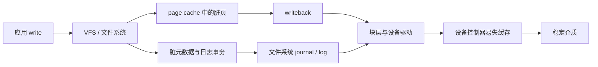
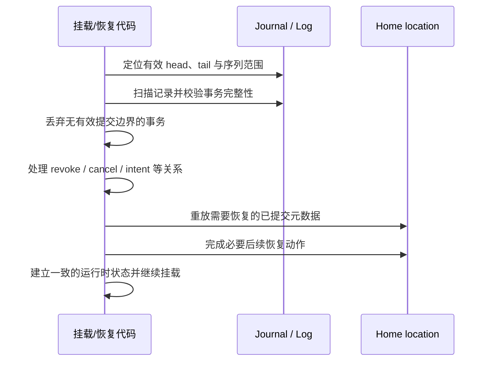

---
tags:
  - 高性能存储
  - Linux-IO路径
status: 已完成
---

# ext4/XFS 日志模式基本原理

> 文件系统日志首先解决的是**文件系统内部结构的崩溃一致性**：系统重启后，磁盘上的元数据仍能组成一个可挂载、可继续使用的文件系统。它不自动等价于“最近一次业务写入已经持久化”，更不等价于数据库事务。

## 学习目标

学完本节，应能回答：

- crash consistency、journal transaction 与 durability 分别是什么；
- 一次 `write()` 到稳定介质之间经过哪些层，文件系统日志负责哪一段；
- ext4 的三种 `data=` 模式究竟约束了什么；
- JBD2 的 descriptor、journaled block、revoke、commit 如何配合恢复；
- XFS 为什么也是写前日志，却不能套用 ext4 的 `data=` 模式；
- checkpoint、日志 tail、log force、`fsync()` 与设备缓存之间是什么关系；
- 为什么可靠替换文件通常需要 `write-temp → fsync(file) → rename → fsync(dir)`。

## 1. 先建立边界：一致性不等于持久性

### 1.1 四个基础术语

#### Crash consistency（崩溃一致性）

**崩溃一致性**描述系统在任意时刻突然掉电或内核崩溃后，重新启动所能观察到的磁盘状态是否满足既定不变量。

对文件系统而言，典型不变量包括：

- 一个已分配的数据块不能同时属于两个 inode；
- inode、空闲空间位图和引用计数不能互相矛盾；
- 目录项不能指向已经彻底释放的 inode；
- 一组必须共同生效的元数据更新不能只落下一半。

它允许恢复后的用户数据是“旧版本”或“新版本”，但应避免出现无法解释的内部混合状态。究竟允许看到哪些版本，还取决于文件系统语义、调用过的同步接口以及硬件是否兑现持久化命令。

#### Journal / write-ahead log（日志 / 写前日志）

日志是磁盘上的一块循环区域。文件系统在覆盖元数据的正式位置（home location）之前，先把本次修改的可重放信息写入日志；只有日志事务完整提交后，这些修改才有资格被恢复程序重放。

“写前”的关键顺序是：

1. 在覆盖被保护元数据的 home location 之前，恢复所需的信息必须形成可验证的日志记录；
2. 有效提交边界与完整性校验共同表明记录可供恢复；
3. 之后元数据可以异步写回 home location：ext4/JBD2 将这一阶段称为 checkpoint，XFS 则不要与更早的 CIL checkpoint 混淆。

#### Transaction（文件系统日志事务）

日志事务是文件系统为维护自身不变量而组织的一组更新。事务通常具有“恢复时整体可识别”的边界：恢复程序要么忽略未完整提交的事务，要么重放完整提交的事务。

> [!warning] 不要把文件系统事务当成业务事务
> 一次业务操作可能跨多个系统调用、多个文件，甚至跨多个文件系统事务。文件系统日志不会自动提供数据库式隔离，也不会替应用决定“订单文件和余额文件必须一起提交”。

#### Metadata 与 file data（元数据与文件数据）

| 类别 | 典型内容 | 作用 |
|---|---|---|
| 文件数据 | 应用写入文件的字节内容 | 表达业务 payload |
| inode 元数据 | 文件长度、权限、时间戳、数据块映射等 | 描述一个文件 |
| 分配元数据 | 空闲空间位图、extent/B-tree 等 | 描述空间归属 |
| 命名空间元数据 | 目录项、链接计数等 | 把名字映射到 inode |
| 日志自身元数据 | 事务头、序列号、校验信息等 | 让恢复程序识别日志 |

“只记录元数据”并不表示文件数据不写磁盘，而是表示文件数据通常直接写向其正式数据块，不先复制进日志。

### 1.2 三个不要混淆的目标

| 目标 | 核心问题 | 典型机制 |
|---|---|---|
| 文件系统可恢复 | 重启后内部结构是否自洽 | journal、校验、恢复重放 |
| 某次写入持久 | 断电后该版本是否仍在 | `fsync()` / `fdatasync()`、flush、FUA |
| 业务原子性 | 多个业务对象是否共同提交 | 应用 WAL、数据库事务、协议 |

日志可能已经保证“文件系统不会损坏”，但应用刚写的数据仍可能只在 page cache；反过来，应用也不能仅凭 `write()` 成功就推断数据已到稳定介质。

## 2. 端到端写入路径

一次普通缓冲写大致经过：



边界要点：

1. `write()` 返回通常只说明字节已被内核接受，并不说明已经越过 page cache。
2. 后台 writeback 可以把数据和元数据异步下发，但“已经下发”仍不必然等于“已经离开设备易失缓存”。
3. 文件系统用日志约束元数据更新顺序；块层和设备还必须正确执行 flush/FUA 等持久化协议。
4. RAID 控制器、虚拟机宿主机、网络块设备和磁盘固件都可能增加新的缓存边界。
5. 若某层错误地宣称 flush 已完成，文件系统再正确也无法构造真正的断电持久性。

因此，本节的讨论范围是：**ext4/XFS 如何组织文件系统更新，以及同步调用如何推动这些更新经过下层持久化边界**。

## 3. 为什么需要日志

假设扩展一个文件需要完成：

1. 从空闲空间结构中分配数据块；
2. 更新 inode 的块映射；
3. 更新 inode 的文件长度；
4. 写入文件数据。

若直接覆盖各自的正式位置，崩溃可能发生在任意两步之间。例如“空闲位图已占用，但 inode 尚未引用”会泄漏空间；反过来可能造成块被重复分配。传统全盘检查可以扫描并修复部分矛盾，但恢复时间与文件系统规模相关，而且未必能推断应用期待的版本。

日志将多个相关元数据修改绑定为一个可识别的事务，使恢复主要检查有限的日志区域，而不必依赖全盘推理。

## 4. 通用日志生命周期

### 4.1 共同阶段与术语边界

ext4/JBD2 与 XFS 都遵守“日志先于被保护元数据的 home-location 覆盖”的写前日志不变量，但二者的 **checkpoint 不是同一个概念**：

- **JBD2 checkpoint**：已提交事务中的元数据从 journal 写回 home location；完成后旧 journal 空间才可逐步回收。
- **XFS CIL checkpoint**：CIL 聚合的一批日志项被 push 并形成写入磁盘 log 的一组记录；它描述的是“写入日志”，不是 home-location writeback。
- **XFS home writeback**：日志 I/O 完成后，由 AIL 跟踪的元数据再写回 home location；完成后日志项移出 AIL，tail 才能推进。

因此，只适合抽象共同阶段，不应给两者套用同一组状态名：


通用恢复不变量是：恢复代码只能接受具有**有效提交边界且通过所需完整性校验**的日志事务或 checkpoint。日志的具体 I/O 排序方式则取决于实现与配置，不能仅凭图中箭头推导 JBD2 commit block 与 payload 的唯一物理完成顺序。

### 4.2 Head、tail 与循环日志

- **head**：下一批日志记录写入的位置；
- **tail**：仍可能被恢复依赖的最老日志位置；
- 日志是有限的循环空间，head 不能覆盖仍有效的旧记录；
- 只有当相关元数据完成 home writeback、不再依赖旧日志后，tail 才能安全推进。

日志压力不只由“写入日志多少”决定，也取决于最老修改何时能写回正式位置。某个长期无法完成 home writeback 的对象可能钉住 tail，导致日志空间紧张并迫使前台等待。

![[图片/SVG/8_1_9_1.svg|900]]

*图 4-1：循环日志的 head/tail、home location，以及 commit / home writeback / tail 推进三阶段。*

### 4.3 日志提交、home writeback 与 tail 推进

| 阶段 | 主要位置 | 主要意义 |
|---|---|---|
| 日志提交 | journal / log | 建立有效提交边界，使完整记录可供崩溃恢复 |
| home writeback | 元数据正式位置 | 正常路径逐步不再依赖旧日志记录 |
| tail 推进 | 循环日志可回收边界 | 允许复用确认不再需要的旧空间 |

`fsync()` 常常只需要推动与目标文件相关的数据和日志达到持久化点，不必等待所有元数据完成 home writeback。对 ext4，可把之后的 home writeback 称为 JBD2 checkpoint；对 XFS，不应称为 CIL checkpoint，因为 CIL checkpoint 是更早的“聚合并写入日志”阶段。

## 5. ext4：JBD2 与三种数据模式

ext4 通常借助 **JBD2（Journaling Block Device 2）** 管理日志事务。JBD2 主要提供块级日志机制，ext4 决定哪些元数据和文件数据需要加入事务。

### 5.1 JBD2 的核心记录

一个简化的已提交事务可理解为：

```text
[descriptor block]
[journaled metadata/data block ...]
[revoke block, optional]
[commit block]
```

| 结构 | 作用 |
|---|---|
| descriptor block | 描述随后日志 payload 对应哪些正式块，并携带事务标识、标签与校验相关信息 |
| journaled block | 元数据块；在 `data=journal` 下也可包含文件数据块 |
| commit block | 标志该事务日志记录完整；恢复时未见有效 commit 的事务不会按完整事务重放 |
| revoke block | 声明某些旧日志块映像不应再被重放，防止覆盖该块后来形成的新用途/新内容 |

每个事务有递增的序列标识。恢复程序借助序列、描述信息、有效 commit 与完整性校验识别可重放记录。常规同步提交路径通常先完成 descriptor、payload、revoke 等日志写入，再使 commit block 成为持久提交边界；启用 `journal_async_commit` 时，commit block 可与前述日志块异步写出，恢复安全依赖校验和确认整笔事务完整，而不是依赖“payload 必须先于 commit 完成”的单一物理顺序。该选项的可用性与约束应以实际内核和 ext4 文档为准。

![[图片/SVG/8_1_9_2.svg|900]]

*图 5-1：JBD2 日志事务的主要记录及其提交边界。*

### 5.2 为什么需要 revoke

设某个块曾作为文件 A 的元数据被记入旧事务，之后它被释放并重新用于别的对象。若恢复时无条件重放旧日志映像，就可能把旧内容覆盖到已经改变用途的块上。revoke 记录告诉恢复程序：对指定事务范围内的这些块，旧副本已经失效，不要重放。

### 5.3 `data=ordered`：只记元数据，但约束关联数据

`data=ordered` 的核心语义是：

- 文件系统元数据进入 JBD2；
- 普通文件数据通常直接写向正式数据块，不复制进日志；
- 对具有元数据可见性依赖、被 ext4 纳入当前 ordered 跟踪范围的文件数据，文件系统会在对应元数据事务提交前安排并等待其写出。

典型范围包括新分配块，以及 truncate、文件尾部清零等需要数据状态与元数据更新保持安全顺序的特殊路径。相反，已经映射的数据块被普通原地覆盖时，通常不会仅因为 inode 的其他元数据参加事务，就自动获得同样的 commit 前写回保证。具体边界仍取决于操作类型、数据页与事务的关联及目标内核的 ext4 写回实现。

“避免新暴露的文件范围指向未初始化块、泄露旧介质内容”是 ordered 设计的典型动机之一，但不是应用数据持久性承诺。该模式不保证所有脏数据按应用 `write()` 顺序持久化，更不替代 `fsync()`。

> [!info] 默认值说明
> `data=ordered` 是 ext4 的**常见默认模式**；实际系统必须以发行版内核、文件系统特性和挂载配置为准，不应仅凭经验假定。

### 5.4 `data=writeback`：元数据提交前不保证相关数据先写出

`data=writeback` 仍主要记录元数据，但取消 `ordered` 模式对文件数据与元数据提交之间的上述顺序约束。因此崩溃后，文件系统结构可以是一致的，而最近修改的文件范围可能看到旧数据或未按应用期待更新的内容。

它减少了顺序约束，但语义更弱。不能把“元数据日志已提交”解读为“相应文件内容已经持久”。

### 5.5 `data=journal`：文件数据也经过日志

`data=journal` 将元数据以及受日志管理的文件数据写入 journal，提交后再写回正式位置。它提供三种模式中最强的文件数据日志语义，但会带来额外写入和日志空间占用。按 Linux ext4 文档，该模式会禁用 delayed allocation，不支持对文件使用 `O_DIRECT`，并且不能与 DAX 挂载模式同时使用；具体报错、回退行为和选项组合仍应按目标内核版本与发行版文档核实。

即便如此，它仍不是跨文件业务事务：系统调用边界、事务归组、目录更新和应用协议仍需单独考虑。

### 5.6 三种模式对照

| ext4 模式 | 元数据是否进日志 | 普通文件数据是否进日志 | 元数据 commit 前的数据顺序约束 | 主要取舍 |
|---|---:|---:|---|---|
| `data=ordered` | 是 | 通常否 | 对与待提交元数据事务关联且需排序的数据提供 ordered 约束 | 常见折中、常见默认；需核实实际挂载配置 |
| `data=writeback` | 是 | 否 | 不提供 `ordered` 的保证 | 约束较少，但崩溃后文件内容语义更弱 |
| `data=journal` | 是 | 是 | 文件数据由日志事务覆盖 | 更强的数据日志语义；额外写入与日志压力；禁用 delayed allocation，不支持 `O_DIRECT`，不能与 DAX 同用 |

![[图片/SVG/8_1_9_3.svg|900]]

*图 5-2：ext4 三种数据日志模式的写入路径与顺序差异。*

> [!warning] 模式名不是持久化 API
> 三种模式描述文件系统如何组织日志和写入顺序，不表示一次普通 `write()` 返回后数据已经断电持久。需要持久化点时仍应使用 `fsync()` / `fdatasync()`，并确保下层设备正确支持持久化命令。

### 5.7 ext4 中一次事务的简化过程

1. 系统调用修改 page cache、inode 或目录，JBD2 的 running transaction 收集相应元数据 buffer；
2. 事务关闭后，新修改进入下一事务，旧事务准备提交；
3. 在 `data=ordered` 下，提交路径推动并等待与该事务关联、需要 ordered 约束的文件数据满足要求；
4. JBD2 写 descriptor、日志中的元数据块及可选 revoke；
5. 常规同步提交让上述日志内容满足顺序要求后持久化 commit block；若启用 `journal_async_commit`，commit block 可与前述块异步写出，并依靠事务校验和验证完整性；
6. 只有有效 commit 与所需完整性校验成立，事务才可作为 committed transaction 恢复；
7. 后台执行 JBD2 checkpoint，把元数据写回 home location；
8. 不再需要旧日志副本后推进 tail。

## 6. XFS：元数据写前日志、事务项与 LSN

XFS 同样使用写前日志，但其组织方式不能用 ext4 的 `data=ordered/writeback/journal` 三分法描述。**XFS 主要记录元数据事务，不提供 ext4 风格的 `data=` 挂载模式。**

### 6.1 事务与 log item

XFS 对一次高层元数据操作建立内存事务，并把不同对象的变化表示为 **log item（日志项）**，例如 inode、buffer、配额或意图类日志项。事务提交时，日志项被格式化为可写入 on-disk log 的记录。

重要思想是：

- 日志记录足以描述恢复所需的元数据变化；
- 对应元数据写回正式位置之前，相关日志记录必须先可靠进入 log；
- 恢复按事务边界与序列信息识别、重放已提交的更新。

### 6.2 CIL checkpoint sequence 与物理 LSN

现代 XFS 使用 **CIL（Committed Item List）** 聚合内存中已提交的事务日志项。这里“事务提交到 CIL”只表示日志项进入内存聚合阶段，**不表示已经写入磁盘日志，更不表示已经持久**。

每批 CIL 工作由逻辑上的 **checkpoint sequence** 标识。发生 CIL push 时，该批日志项才被格式化并写向 on-disk log，形成 **XFS CIL checkpoint**；相关 commit record 完成日志 I/O 后，这批 checkpoint 才达到可恢复的磁盘提交点。

**物理 LSN（Log Sequence Number）** 标识记录在磁盘循环日志中的位置。它与 CIL checkpoint sequence 有关联，但不是同一个编号，也不能在事务刚进入 CIL 时就把二者等同。CIL push 将记录装入内存日志缓冲区并取得物理日志位置时，可分配 checkpoint 的 `start_lsn`、`commit_lsn`；这时记录尚未必持久。后续日志 I/O 以及必要的 flush/FUA 完成，才确认相应 LSN 达到稳定存储。LSN 用于日志顺序、AIL 跟踪和 tail 管理；`fsync()` 需要识别包含目标修改的 checkpoint，推动其 CIL push，并同步等待该 checkpoint 达到所需持久化点。

> [!note] XFS checkpoint 的专用含义
> XFS CIL checkpoint 是“CIL 聚合后写入日志”的阶段，不是元数据写回 home location。后者由 AIL 之后的 writeback 路径完成。

### 6.3 AIL、home writeback 与 tail 推进

**AIL（Active Item List）** 追踪日志 I/O 已完成、但对应元数据修改尚未全部写回 home location 的日志项，并按 LSN 管理其先后关系。

XFS 的简化完整路径是：

1. 文件系统事务提交，日志项进入内存 CIL；
2. CIL push 聚合日志项，形成 XFS CIL checkpoint，并为磁盘日志 I/O 建立位置；
3. checkpoint 的日志记录与 commit record 完成 I/O，成为可恢复记录，相关项进入 AIL 管理；
4. 元数据随后写回 home location；
5. home writeback 完成后，日志项可从 AIL 移除；
6. 最老仍活跃项不再依赖旧记录时，tail 推进并释放日志空间。

因此，XFS 也可能因最老元数据长期未完成 home writeback 而出现 tail 被钉住的现象。

![[图片/SVG/8_1_9_4.svg|900]]

*图 6-1：XFS 从内存 CIL、日志 checkpoint、AIL 到 home writeback 与 tail 推进的路径。*

### 6.4 Intent / done 项

某些 XFS 元数据操作规模较大，不能安全地绑在一个不可分割的短事务里完成。XFS 可通过 **intent item** 先记录“某项操作必须完成”，再用后续事务执行，并通过对应的 **done item** 表示该意图已经处理。

崩溃恢复时，未完成的持久 intent 可以被重新驱动。这是一种把复杂操作拆成多个可控事务，同时仍保留恢复线索的方式；它不是应用可见的通用事务接口。

### 6.5 XFS 恢复的概念过程

XFS 挂载恢复会定位有效日志 head/tail，扫描日志记录、校验事务边界，并重放已提交的元数据更新。实现中恢复可能采用多遍扫描，并处理取消记录、intent/done 等关系。恢复完成后，文件系统元数据回到可继续运行的一致状态。

文件数据通常不作为普通 payload 写入 XFS 元数据日志。数据持久性仍依赖数据 writeback、`fsync()` / `fdatasync()` 与下层设备协议。

## 7. ext4 与 XFS：相同思想，不同实现

| 维度 | ext4 + JBD2 | XFS |
|---|---|---|
| 主要日志对象 | 块级元数据映像；`data=journal` 可含文件数据 | 格式化的元数据事务项/区域 |
| 数据模式 | `ordered`、`writeback`、`journal` | 不使用 ext4 的 `data=` 模式分类 |
| 提交识别 | descriptor、payload、有效 commit、序列与校验 | CIL checkpoint 的日志记录、commit record、checkpoint sequence、物理 LSN 与校验 |
| 防止过时重放 | JBD2 revoke | XFS 的取消/事务恢复机制及日志项语义 |
| home writeback 跟踪 | JBD2 checkpoint 队列等 | AIL；不是 CIL checkpoint |
| 大型跨事务操作 | 由 ext4/JBD2 具体机制组织 | intent/done 项是重要机制 |
| 共同原则 | 均以写前日志保护文件系统元数据一致性；commit 与 home-location 写回分离；日志空间需靠后续写回回收 |

## 8. 崩溃恢复：恢复程序到底做什么

### 8.1 恢复时序



恢复是 **redo** 思路：把已提交事务的目标状态再次写到正式位置。重复写同一恢复结果应当安全，因而即使第一次恢复过程中再次崩溃，下一次仍可继续识别和重放。

### 8.2 崩溃点状态表

以下是教学化模型；具体可见结果还受文件系统版本、操作类型和同步调用影响。

| 崩溃点 | 日志状态 | home location 状态 | 恢复后的典型处理 |
|---|---|---|---|
| 事务仍在内存中；XFS 项可能只在 CIL | 无可恢复的磁盘提交 | 旧状态为主 | 没有可重放事务；最近修改可丢失 |
| 日志记录不完整或完整性校验失败 | 没有可接受的完整提交 | 可能仍旧或有较早写回 | 不把该记录作为完整事务/checkpoint 重放 |
| 已有日志块，但无有效提交边界 | 不能证明已提交 | 可能旧 | 忽略未提交记录 |
| 有效提交边界与完整性校验成立，尚未 home writeback | 已提交、可恢复 | 仍可能是旧状态 | 从日志重放到 home location |
| home writeback 进行到一半 | 已提交日志仍受保护 | 新旧位置混合 | 重放完整更新，使目标元数据一致 |
| home writeback 完成，tail 尚未推进 | 日志仍存在但已不再必要 | 新状态 | 随后解除依赖并回收日志 |
| tail 已安全推进 | 旧空间可复用 | 新状态 | 不再依赖被回收日志 |

> [!warning] “commit 块发出”不等于“commit 已持久”
> 如果 commit 仍停留在设备易失缓存，而数据/元数据的实际落盘顺序又与文件系统假设不同，掉电后可能无法兑现上述状态机。因此需要 flush、FUA/barrier 语义与可信硬件共同建立顺序。

## 9. `fsync()`、`fdatasync()` 与 log force

### 9.1 `fsync(file)`

对普通文件调用 `fsync()`，目标是把该文件的脏数据以及恢复这些数据所必需的相关元数据同步到下层，并等待同步过程中发现的错误。对日志文件系统而言，它可能触发或等待：

- 文件脏数据 writeback；
- 关联日志事务提交；
- 必要的日志强制写出（log force）；
- 设备缓存持久化命令完成。

它通常不要求整个文件系统的所有脏数据都同步，也不必等待所有元数据完成 home writeback（在 ext4/JBD2 中即不必等待全部 checkpoint；在 XFS 中不要把 home writeback 称为 CIL checkpoint）。

### 9.2 `fdatasync(file)`

`fdatasync()` 与 `fsync()` 类似，但可省略不影响后续数据读取所必需的部分元数据，例如某些时间戳。文件长度、块映射等影响文件内容可读取性的元数据仍必须同步。

具体是否比 `fsync()` 更便宜取决于文件系统、内核版本和本次修改，不能假定总有明显差异。更多接口语义见 [[1.4 fsync fdatasync 与持久化语义]]。

### 9.3 Log force

**log force** 有两个必须区分的语义层次：

- **异步 force**：触发或推动待处理日志工作，例如发起 JBD2 transaction commit 或 XFS CIL push，但调用者不等待目标日志 I/O 达到持久化点；
- **同步 force**：推动日志工作，并等待指定 transaction 或 XFS checkpoint 达到文件系统承诺的稳定存储点；这不仅包括日志 I/O 完成，还包括设备缓存场景下所需的 flush/FUA 等持久化步骤。

`fsync()` 为兑现持久化承诺，需要的是相应的**同步等待语义**，而不是只把写入排入队列。ext4/JBD2 的同步路径可推动并等待目标 transaction commit；XFS 则识别包含目标修改的 CIL checkpoint，触发 push，并同步等待其 commit record 及必要的 flush/FUA 完成。

这里还要区分“编号分配”和“已经持久”：事务刚进入内存 CIL 时只有逻辑 checkpoint sequence；CIL push 将记录装入内存日志缓冲区并取得物理日志位置时，便可分配 `start_lsn`、`commit_lsn` 等物理 LSN；后续日志 I/O 与必要的缓存持久化操作完成，才证明这些 LSN 所标识的记录已经稳定。

log force 不等于把所有元数据写回 home location：只要所需文件数据与可恢复日志均已满足同步要求，后续 JBD2 checkpoint 或 XFS 的 AIL/home-writeback 路径仍可异步进行。

### 9.4 文件同步不自动同步父目录

文件内容/元数据与“目录中存在这个名字”是不同持久化对象。`fsync(file)` 不应被当作父目录项已经持久化的通用保证。创建、删除、链接或重命名后，需要在协议要求名字持久时同步相应目录。参见 [[1.10 文件数据 inode 与目录项持久化]] 与 [[1.11 rename link unlink 崩溃语义]]。

## 10. flush、FUA、barrier 与设备易失缓存

### 10.1 三个概念

| 概念 | 简化含义 |
|---|---|
| cache flush | 要求设备把此前已接受、仍在易失缓存中的相关写入推进到非易失介质 |
| FUA（Force Unit Access） | 要求特定写入在完成前到达非易失存储，而不是只停在易失写缓存 |
| write barrier / ordering | 文件系统与块层建立“前一组写必须先稳定，后一关键写才能被视为提交”的顺序；Linux 具体实现会组合 flush/FUA 等机制 |

常规同步 JBD2 提交通常通过 flush/FUA 等机制，使 descriptor、payload 等先满足顺序要求，再使 commit block 成为持久提交边界；但这不是所有配置下无条件的物理顺序。启用 `journal_async_commit` 时，commit block 可与前述日志块异步写出，恢复通过校验和拒绝不完整事务。更通用的语义前提是：**只有有效提交边界与完整性校验共同成立，恢复程序才接受该事务**；同时，在覆盖受保护元数据的 home location 前，所需日志记录必须已可靠。

### 10.2 哪些情况会破坏假设

- 设备宣称支持 flush，却提前返回；
- RAID 卡启用 write-back cache，但电池/电容保护失效；
- 虚拟化层未把 guest flush 正确传到宿主机；
- 运维为了性能禁用了 barrier，而底层又存在易失写缓存；
- 设备掉线或介质错误导致部分写入失败。

> [!danger] 日志不是对不诚实硬件的魔法修复
> 文件系统一致性证明依赖下层兑现写入顺序和持久化语义。关闭保护机制前，必须有明确的端到端非易失性依据，而不是只看基准测试吞吐。

## 11. Writeback error：同步调用也可能失败

后台 writeback 发生在原始 `write()` 返回之后，因此空间耗尽、设备 I/O 错误、远端块设备故障等错误可能延迟出现。Linux 会记录写回错误，并在后续 `fsync()`、`fdatasync()`、`close()` 或相关写操作上报告；具体报告位置和次数受内核接口语义影响。

应用规则：

1. 检查 `write()`，并正确处理短写与 `EINTR`；
2. 检查 `fsync()` / `fdatasync()` 返回值；
3. 检查 `close()` 返回值，但不能用 `close()` 代替显式同步；
4. `fsync()` 失败后，不得宣称事务已持久；应记录错误并进入可恢复/只读/重试策略；
5. 不要在错误后盲目重复覆盖原文件，因为失败原因可能是介质损坏或空间耗尽。

`close()` 成功也不是通用的断电持久化承诺；可靠协议应在仍持有 fd 时显式同步并处理结果。

## 12. 应用层原子替换协议

更新配置、快照或小型状态文件时，常见协议是：

```text
write temporary file
→ fsync(temporary file)
→ rename(temporary, target)
→ fsync(parent directory)
```

### 12.1 每一步解决什么问题

1. **在同一目录或同一文件系统创建临时文件**  
   避免原文件被原地截断后只剩半份内容；同时保证后续 `rename()` 可使用同一文件系统内的原子命名空间替换语义。

2. **写完并 `fsync(temp)`**  
   先使临时文件内容及读取所需元数据达到持久化要求。否则先持久化 `rename()`，崩溃后目标名字可能指向内容尚未稳定的新 inode。

3. **`rename(temp, target)`**  
   在同一文件系统、满足接口前提时，目录命名空间切换对并发观察者是原子的：通常看到旧名字对应旧文件或新文件，不应看到应用执行的逐字节覆盖过程。

4. **`fsync(parent_dir)`**  
   持久化目录项变更，使“目标名字现在指向新 inode”跨崩溃保存。若源目录和目标目录不同，稳健协议需考虑同步两个受影响目录。

### 12.2 这个协议的边界

- 它不提供多个目标文件共同提交；需要应用 WAL/manifest/数据库事务，见 [[6.1 WAL 与 Crash Consistency]]；
- 它不提供并发读写隔离，读者仍需版本号、锁或不可变对象协议；
- `rename()` 跨文件系统会失败，不能依赖其原子替换语义；
- 临时文件名、权限、所有权、扩展属性等也属于协议设计的一部分；
- `fsync(dir)` 成功仍依赖文件系统与设备正确实现持久化链路；
- 网络文件系统、用户态文件系统和特殊存储的语义可能不同，必须查对应实现文档并实测；
- 崩溃后可能遗留未 rename 的临时文件，应设计可识别、可清理的命名规则；
- 若覆盖原目标，是否还需保存旧版本、处理硬链接或同步额外目录，取决于业务恢复模型。

## 13. Modern C++：RAII 文件描述符与最小替换示例

下面示例展示最小协议骨架：用 RAII 管理 fd，循环处理短写，检查同步和关闭错误。为便于教学，示例要求目标与临时文件位于当前目录，且不处理权限复制、并发更新与崩溃后临时文件清理等生产细节。

```cpp
#include <cerrno>
#include <cstring>
#include <fcntl.h>
#include <stdexcept>
#include <string>
#include <string_view>
#include <system_error>
#include <unistd.h>
#include <utility>

class UniqueFd {
public:
    explicit UniqueFd(int fd = -1) noexcept : fd_(fd) {}

    ~UniqueFd() {
        if (fd_ >= 0) {
            ::close(fd_); // 析构中不能抛异常；关键 close 错误应由显式 close_checked() 处理
        }
    }

    UniqueFd(const UniqueFd&) = delete;
    UniqueFd& operator=(const UniqueFd&) = delete;

    UniqueFd(UniqueFd&& other) noexcept
        : fd_(std::exchange(other.fd_, -1)) {}

    UniqueFd& operator=(UniqueFd&& other) noexcept {
        if (this != &other) {
            if (fd_ >= 0) {
                ::close(fd_);
            }
            fd_ = std::exchange(other.fd_, -1);
        }
        return *this;
    }

    [[nodiscard]] int get() const noexcept { return fd_; }

    void close_checked() {
        const int fd = std::exchange(fd_, -1);
        if (fd >= 0 && ::close(fd) == -1) {
            throw std::system_error(errno, std::generic_category(), "close");
        }
    }

private:
    int fd_;
};

[[noreturn]] void throw_errno(std::string_view operation) {
    throw std::system_error(errno, std::generic_category(), std::string{operation});
}

void write_all(int fd, std::string_view bytes) {
    std::size_t offset = 0;
    while (offset < bytes.size()) {
        const auto* data = bytes.data() + offset;
        const std::size_t remaining = bytes.size() - offset;
        const ssize_t written = ::write(fd, data, remaining);

        if (written > 0) {
            offset += static_cast<std::size_t>(written);
            continue;
        }
        if (written == -1 && errno == EINTR) {
            continue;
        }
        if (written == 0) {
            throw std::runtime_error("write returned zero before completion");
        }
        throw_errno("write");
    }
}

void replace_file_atomically(std::string_view content) {
    constexpr std::string_view temp_name = "config.tmp";
    constexpr std::string_view target_name = "config.txt";

    UniqueFd file{::open(temp_name.data(),
                         O_WRONLY | O_CREAT | O_TRUNC | O_CLOEXEC,
                         0644)};
    if (file.get() == -1) {
        throw_errno("open temporary file");
    }

    write_all(file.get(), content);
    if (::fsync(file.get()) == -1) {
        throw_errno("fsync temporary file");
    }
    file.close_checked();

    if (::rename(temp_name.data(), target_name.data()) == -1) {
        throw_errno("rename");
    }

    UniqueFd directory{::open(".", O_RDONLY | O_DIRECTORY | O_CLOEXEC)};
    if (directory.get() == -1) {
        throw_errno("open parent directory");
    }
    if (::fsync(directory.get()) == -1) {
        throw_errno("fsync parent directory");
    }
    directory.close_checked();
}

int main() {
    try {
        replace_file_atomically("version=2\n");
        return 0;
    } catch (const std::exception& error) {
        const std::string message = std::string{"replace failed: "} + error.what() + "\n";
        ::write(STDERR_FILENO, message.data(), message.size());
        return 1;
    }
}
```

> [!note] 示例为何显式关闭临时文件
> `fsync()` 是主要持久化点；随后显式检查 `close()` 可以捕获可能延迟报告的错误。若 `close_checked()` 抛出，RAII 对象已先放弃该 fd，避免因 fd 编号被内核复用而误关其他资源。

生产代码还应考虑：使用不可预测且防冲突的临时文件、`openat()`/`renameat()` 降低路径竞态、保留权限与所有权、清理遗留文件，以及定义同步失败后的恢复策略。

## 14. 安全的实践检查命令

以下命令只读取状态或执行正常同步，不包含卸载、掉电、强制崩溃、写块设备等破坏性操作。

### 14.1 确认目标路径实际使用的文件系统

```bash
findmnt -T /path/to/target -o TARGET,SOURCE,FSTYPE,OPTIONS
```

重点查看：

- `FSTYPE` 是 `ext4`、`xfs` 还是其他文件系统；
- ext4 是否显式出现 `data=ordered`、`data=writeback` 或 `data=journal`；
- 是否存在影响持久化假设的挂载选项。

若输出未显式显示 ext4 `data=`，不要仅据此武断推断；结合发行版文档、内核配置与实际挂载行为核实“常见默认”。

### 14.2 查看挂载信息与内核消息

```bash
findmnt --real --output TARGET,SOURCE,FSTYPE,OPTIONS
```

```bash
journalctl -k --no-pager | grep -Ei 'ext4|jbd2|xfs|I/O error|writeback|flush'
```

第二条用于查找文件系统恢复、日志或 I/O 错误线索；读取系统日志可能需要相应权限。

### 14.3 查看文件和目录 inode

```bash
stat /path/to/target
```

```bash
stat /path/to/parent-directory
```

这有助于区分“文件对象的同步”与“父目录命名空间的同步”。

### 14.4 查看安全的文件系统元信息

对 ext4 块设备，可只读查看超级块信息：

```bash
sudo tune2fs -l /dev/DEVICE
```

对 XFS 挂载点，可查询几何与特性：

```bash
xfs_info /mount/point
```

将 `/dev/DEVICE` 和 `/mount/point` 替换为确认无误的实际对象。不要在不理解后果时使用修改型参数。

## 15. 验证实验思路

真正的 crash-consistency 验证需要可控故障注入环境。优先使用一次性虚拟机、测试镜像或专用测试机；不要在保存重要数据的主机上模拟掉电。

### 实验一：证明 `write()` 返回不等于应用协议完成

- 在临时测试目录循环生成带版本号和内容校验和的文件；
- A 组只写文件，B 组执行 `fsync(file)`，C 组执行完整的临时文件替换协议；
- 记录每一步完成标记到独立的测试控制通道；
- 由虚拟机管理器在不同阶段终止测试虚拟机，再启动并检查：文件是否存在、版本号是否为旧或新、校验和是否完整；
- 不要只做一次；按“崩溃点”分类收集结果，而不是宣称固定概率或固定量级。

控制变量：同一内核、同一文件系统、同一挂载配置、同一虚拟磁盘缓存策略。

### 实验二：区分文件内容与目录项持久化

- 创建新临时文件并写入带校验的 payload；
- 分别在 `fsync(file)` 前、之后、`rename()` 后、`fsync(dir)` 后设置可观测检查点；
- 在测试虚拟机中注入崩溃；
- 恢复后分别检查临时名、目标名和文件内容；
- 将结果与 [[1.10 文件数据 inode 与目录项持久化]] 中的对象边界对应。

### 实验三：比较 ext4 数据模式的语义路径

- 仅在独立测试镜像中分别配置 ext4 的三种 `data=` 模式；
- 使用相同工作负载，记录 `write()`、`fsync()` 延迟分布和块层事件；
- 在相同逻辑崩溃点检查文件内容与文件系统恢复结果；
- 结论应限定到测试内核、设备模型、挂载参数与工作负载，不外推固定性能倍数。

### 实验四：观察日志提交与 home writeback 分离

- 在测试环境运行持续的小文件元数据更新；
- 使用发行版提供的 tracing/perf/BPF 工具观察文件系统 tracepoint；
- 对 ext4，对比 `fsync()` 前后的 JBD2 commit 与后续 JBD2 checkpoint/home writeback；
- 对 XFS，分别观察事务进入 CIL、CIL push 形成 checkpoint、日志 I/O 完成、AIL 跟踪以及后续 home writeback；
- 验证“同步返回可以依赖已提交日志，而 home-location writeback 可稍后发生”，同时避免混用两种 checkpoint。

tracepoint 名称随内核和文件系统版本变化，应先安全列出本机可用事件，不要照抄不存在的事件名。

### 实验五：验证错误处理而非只测成功路径

- 使用受控测试设备或故障注入框架模拟 writeback 错误、空间耗尽等情况；
- 检查程序是否同时处理短写、`fsync()` 失败和 `close()` 失败；
- 验证应用不会在同步失败后发布“提交成功”状态；
- 故障注入只在隔离环境按对应工具文档进行，本笔记不提供可能破坏宿主机的命令。

## 16. 典型故障案例

### 案例一：只 `rename()`，重启后新文件名存在但内容不可靠

**错误协议：** 写临时文件后立即 `rename()`，未先 `fsync(temp)`。

**原因：** 命名空间更新与文件数据 writeback 是不同路径。重命名原子性只约束并发可见的名字切换，不自动保证临时文件 payload 已越过持久化边界。

**修复：** `fsync(temp)` 成功后再 `rename()`，随后 `fsync(parent_dir)`。

### 案例二：同步了文件，却在崩溃后丢失新名字

**错误协议：** 新建文件并 `fsync(file)`，但未同步父目录。

**原因：** 文件内容和 inode 可以持久，而创建/重命名产生的目录项仍可能未持久。

**修复：** 对需要跨崩溃保存的目录项变更同步父目录。

### 案例三：把 ext4 `data=ordered` 当成业务 WAL

**错误认知：** 认为 ordered 模式会按程序的多次 `write()` 顺序提交多个文件。

**原因：** ordered 约束服务于文件系统数据块与元数据暴露之间的安全顺序，不提供跨文件业务原子性、隔离或提交记录。

**修复：** 设计应用级 WAL/manifest，明确记录格式、校验、提交点和恢复状态机。

### 案例四：硬件写缓存不兑现 flush

**现象：** 日常重启测试正常，真实掉电后却出现日志提交标记与 payload 顺序不一致或最近同步数据丢失。

**原因：** 软件栈依赖的持久化顺序没有被控制器、虚拟化层或设备真实执行。

**修复方向：** 审核整条缓存链路、设备能力和掉电保护；在隔离环境做真实故障验证；不要通过关闭 barrier 掩盖问题。

### 案例五：忽略 `fsync()` 错误仍发布成功

**现象：** 后台 writeback 已发生 I/O 错误，但应用只检查早先的 `write()`，随后更新状态为“已保存”。

**原因：** 缓冲写错误可以延迟到同步阶段报告。

**修复：** 将 `fsync()` 成功作为发布提交状态的必要条件；失败时保留恢复线索并停止覆盖可信旧版本。

## 17. 常见误区

> [!warning] 误区 1：有日志就不会丢数据
> 日志主要保证文件系统内部可恢复；未同步的最近写入仍可能丢失。

> [!warning] 误区 2：`rename()` 原子，所以替换一定持久
> 原子可见性与断电持久性是两个维度。还需要先同步新文件，再同步目录项。

> [!warning] 误区 3：`fsync(file)` 会同步整个目录树
> 文件 fd 与目录 fd 表示不同对象。命名空间变化需要单独考虑相关目录。

> [!warning] 误区 4：XFS 也有 ext4 的 `data=ordered`
> XFS 主要采用元数据日志与自己的事务项/LSN/CIL/AIL 机制，不能套用 ext4 `data=` 模式。

> [!warning] 误区 5：所有文件系统的 checkpoint 都表示 home writeback
> JBD2 checkpoint 是已提交元数据写回 home location；XFS CIL checkpoint 则是 CIL 聚合后写入磁盘日志。XFS 的 home writeback 发生在日志 I/O 完成、项目进入 AIL 管理之后。两者都只有在旧日志不再被 home 状态依赖时才能最终推进 tail。

> [!warning] 误区 6：`fsync()` 成功后无需考虑任何边界
> 它仍依赖文件系统实现、设备 flush/FUA、控制器掉电保护以及跨目录/跨文件的应用协议。

## 18. 关键结论

1. **日志解决的是可恢复顺序。** 在覆盖元数据 home location 前建立具有有效提交边界、通过完整性校验的可恢复日志；home writeback 可以随后发生。
2. **不要混用 checkpoint。** JBD2 checkpoint 是 home writeback；XFS CIL checkpoint 是 CIL push 后写入日志，之后才是 AIL 跟踪与 home writeback。tail 只有在旧日志不再被依赖后才能推进。
3. **ext4 三种 `data=` 模式只属于 ext4 语境。** `data=ordered` 对与待提交事务关联且需排序的数据施加约束，且是需按发行版与挂载配置核实的常见默认；`writeback` 放松该顺序；`journal` 让文件数据也经过日志，并禁用 delayed allocation、不支持 `O_DIRECT`、不能与 DAX 同用。
4. **JBD2 的 descriptor/payload/commit/revoke 共同建立可识别、可重放且不会错误重放过时块的事务。** 常规同步提交与 `journal_async_commit` 的物理 I/O 顺序不同，通用恢复判断是有效 commit 加完整性校验。
5. **XFS 主要记录元数据。** 事务项先进入内存 CIL；CIL push 形成带 checkpoint sequence 的日志 checkpoint，日志 I/O 完成后才进入 AIL/home-writeback 阶段。checkpoint sequence 与物理 LSN 相关但不是同一标识。
6. **`fsync()` / `fdatasync()` 是应用请求持久化的接口，不是日志模式的别名。** 它们还必须依赖 flush/FUA/barrier 与可信设备缓存。
7. **同步错误必须处理。** `write()` 成功不能覆盖之后的 writeback error；`fsync()` 失败时不能报告提交成功。
8. **可靠单文件替换的基本协议是：** 同文件系统写临时文件，`fsync(file)`，原子 `rename()`，再 `fsync(dir)`。
9. **文件系统日志不提供业务事务。** 多文件一致性、隔离、提交记录与恢复决策仍由应用 WAL 或数据库负责。

## 关联笔记

- [[1.4 fsync fdatasync 与持久化语义]]：同步接口与返回语义
- [[1.10 文件数据 inode 与目录项持久化]]：区分数据、inode 和目录项的持久化边界
- [[1.11 rename link unlink 崩溃语义]]：命名空间操作的原子性与崩溃语义
- [[6.1 WAL 与 Crash Consistency]]：从文件系统日志过渡到应用级写前日志
