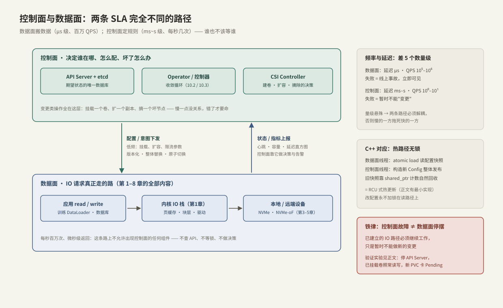

---
tags:
  - 高性能存储/控制面
---
# 数据面与控制面分工

> 数据面搬数据，控制面决定"谁在哪、怎么配、坏了怎么办"。前九章全部在讲数据面；本章讲它的"管理层"。分工的本质只有一句话：**两条路径的延迟与频率差 5 个数量级，谁也不该等谁**。

前置：[[1.8 一次 read write 全路径图]]（数据面长什么样）。本章不需要 Kubernetes 基础，10.2 会从零建立。

---

## 1. 概念定义

- **数据面（data plane）**：IO 请求实际经过的路径——应用 → 内核栈 → 设备/网络 → 介质。第 1–8 章的所有内容都在这条路上。
- **控制面（control plane）**：不碰用户数据本身，负责**配置、编排、监控、故障处理**——建卷/删卷、扩容、副本摆放、坏盘摘除、限流参数下发。

**【事实】** 这对概念源自网络设备：路由器的转发面用专用硬件按转发表逐包转发（ns 级），控制面跑 BGP/OSPF 算路由表（秒级收敛）——转发表算好之后，转发不依赖控制协议在线。存储系统照搬了这个架构，SDN 则把它推向极致（集中控制器 + 哑转发器）。

用多线程的话说：**数据面是热路径上的工作线程，控制面是改配置的管理线程**——热路径无锁，冷路径才允许复杂逻辑。

---

## 2. 为什么必须分离



| 维度 | 数据面 | 控制面 |
| --- | --- | --- |
| 延迟要求 | μs 级（p99 敏感） | ms~s 级可接受 |
| 频率 | 10⁵–10⁶ QPS | 每秒几次、常常几分钟一次 |
| 失败后果 | 线上事故，立刻可见 | 暂时不能"变更"，存量不受影响 |
| 正确性要求 | 快比全能重要 | 错一个决策可能毁数据，宁慢勿错 |

**【事实/设计铁律】** 可用性解耦：**控制面故障 ≠ 数据面停摆**。已建立的 IO 路径（已挂载的卷、已建立的连接）必须继续工作，失去的只是"做新变更"的能力。反过来讲，任何把控制面组件放进 IO 热路径的设计（每次读写都查一次元数据服务、每个请求都过一次中心调度器）都会把 5 个数量级的差距直接转嫁给业务延迟——这正是 [[7.2 元数据路径瓶颈]] 的主题。

**【取舍】** 分离的代价是**状态同步**：控制面看到的世界永远滞后于数据面的真实状态（心跳有间隔、上报有延迟），所以控制面的一切决策都要容忍陈旧信息——这决定了 10.2 的"收敛循环"形态，而不是"精确指令"形态。

---

## 3. 存储系统里的分工实例

| 操作 | 属于哪个面 | 原因 |
| --- | --- | --- |
| 读写一个已挂载的卷 | 数据面 | 每秒百万次，μs 级 |
| 创建 / 删除 / 扩容卷 | 控制面 | 低频，需要全局决策（放哪个节点、剩多少配额） |
| 副本重建的**决策**（哪块盘坏了、往哪补） | 控制面 | 全局视角 + 宁慢勿错 |
| 副本重建的**数据搬运** | 数据面 | 大带宽拷贝，走 IO 路径 |
| 拓扑感知调度（NUMA / 机架） | 控制面 | 见 [[10.5 拓扑亲和与 NUMA]] |
| 心跳与健康检查 | 控制面（消费数据面的上报） | 见 [[10.6 健康检查与故障摘除]] |

**【事实】** Kubernetes 的 CSI（Container Storage Interface）把这个分工直接写进了标准：**CSI Controller 插件**（跑在任意节点，管建卷/删卷/挂载决策）与 **CSI Node 插件**（跑在每个节点上，执行本机 mount/格式化，之后让开——IO 不再经过它）。插件退出不影响已挂载卷的读写，就是第 2 节铁律的落实。

---

## 4. 两个面之间的接口：下发与上报

两条通道，方向相反、机制不同：

1. **配置/意图下发**（控制面 → 数据面）：低频、要求原子。工程惯例是**版本化 + 整体替换**——永远发布一份完整的新配置并附版本号，而不是打增量补丁；数据面在安全点原子切换。原因：增量补丁在乱序/丢失时会让两边状态永久分叉，整体替换则天然幂等（收到旧版本直接丢弃）。
2. **状态/指标上报**（数据面 → 控制面）：心跳、容量、延迟直方图。控制面拿它做决策与告警。**【前提】** 上报永远是过去时——所有基于它的决策都要按"信息可能已过期"设计（比如摘除节点前再确认一次）。

---

## 5. Modern C++：进程内的同一分工

这个架构在单进程里就有最小版本：数据面线程高频读配置，控制面线程偶尔改配置。正确做法与 K8s 同构——**不可变对象 + 原子整体替换**（RCU 风格，C++20 `std::atomic<std::shared_ptr>`）：

```cpp
#include <atomic>
#include <memory>
#include <string>
#include <vector>

struct Config {                        // 不可变：发布之后永不原地修改
    int replica_count = 3;
    int io_limit_mbps = 0;             // 0 = 不限速
    std::vector<std::string> nodes;
};

class ConfigStore {
public:
    // 数据面（热路径）：一次 acquire load，无锁、无等待
    std::shared_ptr<const Config> snapshot() const noexcept {
        return cfg_.load(std::memory_order_acquire);
    }

    // 控制面（冷路径）：构造完整新版本，原子整体替换
    void publish(Config next) {
        cfg_.store(std::make_shared<const Config>(std::move(next)),
                   std::memory_order_release);
    }   // 旧版本在最后一个持有快照的读者放手后自动销毁

private:
    std::atomic<std::shared_ptr<const Config>> cfg_{
        std::make_shared<const Config>()};
};
```

**关键点**：

- 数据面每个请求开头 `snapshot()` 一次，整个请求期间视图一致——不会读到"改了一半"的配置；
- `publish` 不打断任何读者；旧配置由 `shared_ptr` 引用计数自然回收——这是 RCU"宽限期"的引用计数实现；
- release/acquire 保证读者看到的新配置内容完整（与 [[1.7 块层与 blk-mq]] 的门铃协议同一纪律）；
- K8s 的对象下发本质相同：整体替换 + resourceVersion 版本号（10.3 展开），只是把这套纪律搬到了集群尺度。

---

## 6. 指标含义与常见误读

| 指标 | 含义 | 常见误读 |
| --- | --- | --- |
| API 请求延迟（控制面） | 变更操作的响应速度 | **≠ 存储慢**。挂载慢是控制面问题，IO 慢是数据面问题，两回事 |
| etcd WAL fsync 延迟 | 控制面数据库的持久化延迟 | 控制面卡顿的头号硬件原因——etcd 每笔写都 fsync（[[1.4 fsync fdatasync 与持久化语义]] 的知识直接可用：查设备 FLUSH 延迟） |
| 心跳丢失计数 | 数据面节点失联 | 网络抖动也会触发；单次丢失 ≠ 节点死亡（10.6） |
| 控制面 QPS | 变更频率 | 很低是**常态**不是故障；突然飙高才要警惕（控制循环风暴，10.2） |
| PV 创建耗时 | 建卷端到端时间 | 不要把它算进"IO 延迟"报表——它发生在使用之前 |

---

## 7. 故障定位：先分清是哪个面

| 症状 | 面 | 第一步查什么 |
| --- | --- | --- |
| 现有业务 IO 正常，新卷挂不上 / PVC 卡 Pending | 控制面 | API Server / CSI Controller / 配额与 StorageClass |
| kubectl 一切正常，业务 p99 飙升 | 数据面 | 按 [[1.8 一次 read write 全路径图]] 的 runbook 分段测 |
| 两者都异常 | 共享依赖 | 网络分区、或 etcd 所在盘的 IO（控制面踩了数据面的坑） |
| 变更"下发成功"但不生效 | 接口 | 版本没切换：查数据面实际加载的配置版本号 |

**方法论**：症状出现时先问"**存量受影响吗**"。只有增量（新建/变更）出问题 → 控制面；存量出问题 → 数据面或共享依赖。

---

## 8. 可复现实验：控制面宕机，数据面无感

用 kind（本地 Docker 里跑 K8s）验证第 2 节铁律，全程单机可复现：

```bash
# 1. 一个控制面节点 + 一个工作节点的集群
cat <<EOF > kind-config.yaml
kind: Cluster
apiVersion: kind.x-k8s.io/v1alpha4
nodes:
  - role: control-plane
  - role: worker
EOF
kind create cluster --name cp-lab --config kind-config.yaml

# 2. 在 worker 上跑一个每秒计数的 Pod（模拟持续的数据面工作）
kubectl run pinger --image=busybox \
  --overrides='{"spec":{"nodeName":"cp-lab-worker"}}' \
  -- sh -c 'i=0; while true; do i=$((i+1)); echo $i > /tmp/count; sleep 1; done'
kubectl wait --for=condition=Ready pod/pinger
kubectl exec pinger -- cat /tmp/count          # 记下当前计数

# 3. 把整个控制面"拔电"30 秒
docker pause cp-lab-control-plane
kubectl get pods                               # 管理操作全部超时失败 ←控制面死了
docker exec cp-lab-worker crictl ps            # 但 worker 上容器照常 Running
sleep 30 && docker unpause cp-lab-control-plane

# 4. 验证：计数在"宕机"期间一直在涨 —— 数据面从未停
kubectl exec pinger -- cat /tmp/count
kind delete cluster --name cp-lab              # 清理
```

**【前提】** 只暂停 30 秒是有意的：kubelet 长时间失联后，控制面恢复时会把节点标记 NotReady 并可能按容忍策略驱逐 Pod（默认容忍约 5 分钟）——"数据面独立"指的是**故障窗口内存量不受影响**，不是"控制面永远可以不在"。

---

## 9. 关键结论

| 结论 | 性质 |
| --- | --- |
| 数据面搬数据（μs、百万 QPS），控制面做变更（ms~s、低频）——源自网络设备的转发面/控制面分工 | 事实 |
| 铁律：控制面故障只冻结"变更"，不得影响已建立的 IO 路径（CSI 的 Controller/Node 分工即标准化落实） | 事实 / 设计 |
| 任何进入 IO 热路径的控制面组件都会把数量级差距转嫁成业务延迟 | 事实 → 实践结论 |
| 分离的代价：控制面永远看到过期状态 → 决策必须容忍陈旧（收敛循环的由来，10.2） | 取舍 |
| 配置下发用"版本化 + 整体替换 + 原子切换"，不用增量补丁 | 实践结论 |
| 进程内同款：atomic<shared_ptr<const Config>>，热路径一次 acquire load | 实践结论 |
| 排障先问"存量受影响吗"：只有增量出问题 → 控制面；存量出问题 → 数据面 | 方法论 |
| etcd 的 fsync 延迟是控制面性能的隐形地基——用第 1 章的知识去查它 | 事实 |

---

## 关联知识

- [[10.2 Kubernetes Operator 模型]] - 控制面如何用"收敛循环"消化陈旧信息
- [[10.6 健康检查与故障摘除]] - 状态上报通道的完整设计
- [[7.2 元数据路径瓶颈]] - 控制面组件混入热路径的经典事故现场
- [[9.7 SLO 与性能回归]] - 两个面各自该定什么 SLO
