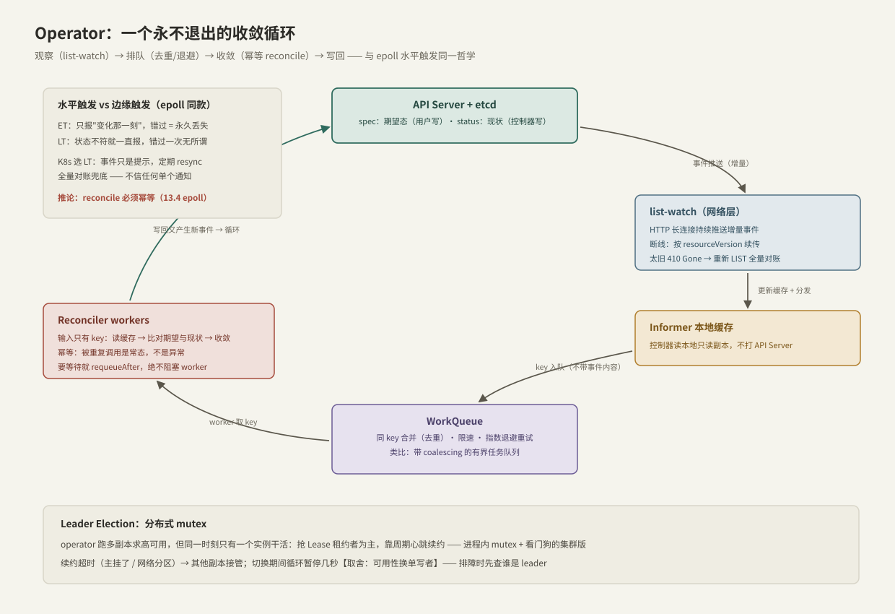

---
tags:
  - 高性能存储/控制面
---
# Kubernetes Operator 模型

> Operator = 把运维专家的 runbook 写成一个**永不退出的收敛循环**。它的全部机制——水平触发、幂等、去重队列、乐观并发——你在 C++ 服务端编程里都见过，只是这次跑在集群尺度上。

前置：[[10.1 数据面与控制面分工]]。不需要 K8s 经验，本篇自带最小速览。

---

## 1. Kubernetes 三十秒速览（前提知识）

**【事实】** 理解 Operator 只需要四句话：

1. 集群 = 一堆节点 + 一个 **API Server**（唯一入口），后面是 **etcd**（存放一切对象的数据库）；
2. 一切皆对象：Pod（一组容器）、Deployment（期望的副本描述）、PVC（存储卷申请）……每个对象分两半：**spec（期望态，用户写）**与 **status（现状，控制器写）**；
3. 交互是**声明式**的：你不说"启动一个进程"（命令式），你说"我要 3 个副本"（期望），然后由系统想办法达成；
4. 达成的方式：一群**控制器**，每个都是死循环——"看看现状，和期望差在哪，动一步，再看"。

Operator 没有引入任何新机制：它只是**用户自己写的控制器**，管理**用户自己定义的对象类型**（CRD，[[10.3 CRD 与 Reconcile]]），把领域运维知识（"存储集群扩容要先迁移数据再摘节点"）编码成循环。存储领域的著名例子是管理 Ceph 集群的 Rook。

---

## 2. 核心设计：水平触发，与 epoll 同一哲学

对多线程/网络工程师，这是全篇最重要的一节。回忆 [[13.4 epoll模型]] 的两种通知模式：

- **边缘触发（ET）**：只在"变化那一刻"通知一次，错过 = 永久丢失——所以 ET 代码必须一次读干净，紧张兮兮；
- **水平触发（LT）**：只要状态满足就持续报告，错过一次无所谓，下次还有。

**【事实/设计选择】** K8s 全面选择了水平触发的世界观：

- 事件（watch 通知）只是"该看一眼了"的**提示**，不携带权威信息；
- 控制器定期 **resync**：即使没有任何事件，也把所有对象全量重新对账一遍——不信任任何单个通知；
- **推论：reconcile 必须幂等**。同一个对象会因为重试、resync、多事件合并而被反复处理，处理十次和一次的结果必须相同。

这个选择的动机与 epoll LT 相同【取舍】：**牺牲一点重复劳动，换取"丢通知不丢正确性"**——在不可靠网络上，这几乎是唯一理性的选择。

---

## 3. 机制拆解：从 watch 到 reconcile



### 3.1 list-watch：网络层怎么"持续观察"

控制器不轮询。**【事实】** 它先 `LIST` 一次拿全量快照（带一个 `resourceVersion` 版本号），然后发起 `WATCH`——一个**长连接的 HTTP GET**，服务端把之后的每个变更事件作为一段 JSON 持续写进响应流（HTTP/1.1 chunked 或 HTTP/2 流）。这是"服务端推送"的最朴素实现，与 SSE 同族。

断线是常态，恢复协议体现 LT 哲学：

- 重连时带上最后处理过的 `resourceVersion`，从那里**续传**；
- 版本太旧（etcd 已把历史压实）→ 服务端回 **410 Gone** → 客户端重新 LIST 全量对账——错过多少都能兜底。

### 3.2 Informer：本地只读缓存

watch 到的对象存进本地缓存（indexer），控制器读缓存而不打 API Server——**"每消费者一份本地只读副本 + 增量失效"**，你在多线程里为减少共享争用做过一样的事。代价【取舍】：读到的可能滞后几十毫秒，但第 2 节已经决定了"容忍陈旧、靠循环收敛"。

### 3.3 WorkQueue：带合并的任务队列

事件不直接触发处理，先进工作队列。它有三个多线程工程师秒懂的特性【实现】：

1. **同 key 合并（去重）**：一个对象连续变更 10 次，队列里只有一个 key——处理时反正要读最新状态，中间版本无意义（coalescing）；
2. **指数退避**：reconcile 失败的 key 延迟重入队，越失败越慢，防止坏对象打爆循环；
3. **限速**：全局令牌桶，防止事件风暴变成 API 风暴。

### 3.4 Reconciler：收敛函数

worker 从队列取出 key（只有 `namespace/name`，**不带事件内容**——强迫你全量对账而不是相信事件），执行：读期望态 → 读现状 → 算差距 → 向目标推进一步 → 需要等待就 `requeueAfter` 而非阻塞。完整合约在 [[10.3 CRD 与 Reconcile]]。

### 3.5 Leader Election：分布式 mutex

operator 跑多副本求高可用，但同一时刻只能一个实例干活（两个副本同时创建子资源 = 灾难）。**【事实】** 方案是租约（Lease 对象）：抢到者为主，周期心跳续约；续约超时（主挂/网络分区）→ 其他副本接管。这就是"进程内 mutex + 看门狗"的集群版，切换窗口内循环暂停几秒【取舍：可用性换单写者】。

---

## 4. 可复现实验：亲眼看一次收敛

```bash
# 环境：kind 单机集群
kind create cluster --name op-lab

# 1. 声明期望：3 个副本
kubectl create deployment web --image=nginx --replicas=3
kubectl get pods -l app=web          # 3 个 Running

# 2. 制造"现状偏离期望"：手动杀掉一个
kubectl get pods -l app=web -w &     # 后台持续观察
kubectl delete pod $(kubectl get pods -l app=web -o name | head -1)
# 观察：Terminating 的同时，新 Pod 几乎立即被创建 —— 这就是 reconcile 在补差

# 3. 看裸 watch 协议长什么样（HTTP 长连接逐行推 JSON 事件）
kubectl proxy &
curl -sN "http://127.0.0.1:8001/api/v1/namespaces/default/pods?watch=1" | head -3

# 4. spec 与 status 的两半结构
kubectl get deployment web -o yaml | grep -A3 -E '^spec:|^status:'

kind delete cluster --name op-lab    # 清理
```

第 2 步是全篇的眼见为实：你删 Pod 这个"事件"没有任何人显式处理——Deployment 控制器只是又一轮对账时发现"期望 3 现状 2"，于是补一个。

---

## 5. Modern C++：控制循环的最小形状

把 3.3/3.4 的骨架写成 ~40 行 C++（**心智模型，非生产代码**）——去重队列 + 幂等 worker：

```cpp
#include <condition_variable>
#include <deque>
#include <mutex>
#include <stop_token>
#include <string>
#include <thread>
#include <unordered_set>

// K8s workqueue 的最小形状：同 key 合并——事件再多，队中只占一席
class DedupQueue {
public:
    void add(std::string key) {
        {
            std::scoped_lock lk{m_};
            if (!pending_.insert(key).second) return;   // 已在队中：合并
            q_.push_back(std::move(key));
        }
        cv_.notify_one();
    }

    std::string take(std::stop_token st) {              // 空串 = 收到停止请求
        std::unique_lock lk{m_};
        cv_.wait(lk, st, [&] { return !q_.empty(); });
        if (q_.empty()) return {};
        std::string key = std::move(q_.front());
        q_.pop_front();
        pending_.erase(key);
        return key;
    }

private:
    std::mutex m_;
    std::condition_variable_any cv_;
    std::deque<std::string> q_;
    std::unordered_set<std::string> pending_;
};

bool reconcile(const std::string& key);   // 幂等：读期望与现状，推进一步

// 控制循环：输入只有 key；失败重新入队（真实实现还要指数退避）
void run_worker(DedupQueue& queue, std::stop_token st) {
    while (!st.stop_requested()) {
        const std::string key = queue.take(st);
        if (key.empty()) break;
        if (!reconcile(key)) queue.add(key);
    }
}
// 用法：std::jthread w{run_worker, std::ref(queue)};  析构自动请求停止并 join
```

**关键点**：

- `pending_` 集合实现同 key 合并——与内核 plug 攒批（1.7）、事件循环的事件合并同一思想；
- `condition_variable_any::wait(lk, st, pred)` 是 C++20 的可取消等待，配合 `jthread` 的 RAII 停止语义；
- `reconcile` 返回 bool 决定是否重排队——真实系统在这里加退避与限速。

---

## 6. 指标含义与常见误读

| 指标 | 含义 | 常见误读 |
| --- | --- | --- |
| workqueue depth | 队列积压 | **短暂尖峰是常态**（resync 全量入队）；持续增长才是消费跟不上 |
| workqueue retries | 退避重试次数 | 少量重试是机制在工作（冲突、依赖未就绪）；同一 key 无限重试才是 bug |
| reconcile duration | 单轮对账耗时 | 慢 ≠ 集群慢——可能是循环里做了阻塞调用（违反 3.4 纪律） |
| watch 断连次数 | 长连接稳定性 | 偶发断连无害（自动续传）；频繁断连查网络/API Server 压力 |
| controller CPU 低 | —— | **不代表健康**：可能卡在客户端 API 限流（QPS/Burst 配置）上，看似空闲实则排队 |

---

## 7. 故障定位

控制器"不干活"的排查链，从外向内：

1. **对象有事件吗**：`kubectl describe <对象>` 看 Events——控制器的动作和报错通常在这里留痕；
2. **控制器活着吗、谁是主**：`kubectl -n <ns> get lease` 看 leader 是哪个副本，再看该副本日志（选主切换期间循环暂停属正常）；
3. **watch 建立了吗**：日志里找 relist/410；频繁 relist 说明事件风暴或版本压实过快；
4. **权限够吗**：RBAC 缺权限时控制器通常报 `forbidden`——`kubectl auth can-i --as=system:serviceaccount:<ns>:<sa> update <resource>`；
5. **热循环风暴**：workqueue adds 速率异常高 → 常见原因是 reconcile 自己写出的变更又触发自己（写回前先比对，无差不写）。

---

## 8. 关键结论

| 结论 | 性质 |
| --- | --- |
| K8s = 声明式对象（spec/status）+ 一群控制循环；Operator 只是用户自写的控制器 | 事实 |
| 全系统选水平触发：事件只是提示，resync 全量对账兜底 → reconcile 必须幂等 | 事实 / 设计选择 |
| watch = HTTP 长连接推送 + resourceVersion 续传 + 410 全量重来——LT 哲学的网络实现 | 事实 |
| Informer 本地缓存换低 API 压力，代价是读到旧数据——靠循环收敛消化 | 取舍 |
| WorkQueue 三件套：同 key 合并、指数退避、限速——与 C++ 任务队列同构 | 实现 / 类比 |
| Leader election = 租约版分布式 mutex；切换窗口循环暂停 | 事实 / 取舍 |
| CPU 低不等于控制器健康：先查队列深度与客户端限流 | 实践结论 |
| 热循环风暴的头号来源：自己的写回触发自己——写前比对 | 实践结论 |

---

## 关联知识

- [[10.1 数据面与控制面分工]] - 控制面为什么必须容忍陈旧信息
- [[10.3 CRD 与 Reconcile]] - 自定义类型与收敛函数的完整合约
- [[10.4 StorageBenchmark Operator]] - 用本篇模型实做一个存储基准测试 Operator
- [[13.4 epoll模型]] - 水平触发与边缘触发的原始出处
- [[13.6 Reactor模式与EventLoop]] - "循环 + 队列 + 不阻塞"纪律的单机版
