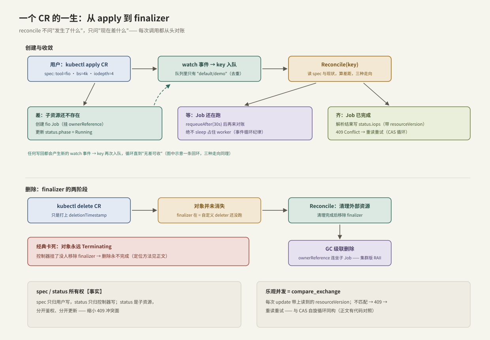

---
tags:
  - 高性能存储/控制面
---
# CRD 与 Reconcile

> CRD 给集群的 API 注册一个新类型，Reconcile 是围绕这个类型的收敛函数。合在一起，就是"把运维知识写成**类型 + 幂等函数**"。本篇用一个贯穿例子 `StorageBenchmark`（声明一次 fio 测试）走完全流程——它就是 [[10.4 StorageBenchmark Operator]] 的地基。

前置：[[10.2 Kubernetes Operator 模型]]（控制循环、水平触发、WorkQueue）。

---

## 1. CRD：向 API Server 注册新类型

**【事实】** CRD（CustomResourceDefinition）本身也是一个 K8s 对象。apply 它之后，API Server 立刻多出一种可以 CRUD 的资源类型：存储进 etcd、可被 watch、按 OpenAPI schema 校验字段——**不需要写一行服务端代码**。此后的自定义对象实例叫 CR（Custom Resource）。

用 C++ 的话说：CRD 是"向框架注册类型 + 校验器"，CR 是该类型的实例；而控制器（10.2）是这个类型的行为。

两半结构的**所有权规则**【事实/惯例】：

- `spec`：期望态，**只归用户写**；
- `status`：现状，**只归控制器写**——并且声明成"子资源"（subresource），与 spec 分开鉴权、分开更新，缩小并发冲突面（第 4 节）。

---

## 2. 最小可复现：注册并使用一个 CRD

不需要任何控制器，先让类型活起来。两个文件：

```yaml
# crd.yaml —— 注册类型 StorageBenchmark
apiVersion: apiextensions.k8s.io/v1
kind: CustomResourceDefinition
metadata:
  name: storagebenchmarks.lab.example.com   # 必须等于 <plural>.<group>
spec:
  group: lab.example.com
  scope: Namespaced
  names:
    kind: StorageBenchmark
    plural: storagebenchmarks
    singular: storagebenchmark
    shortNames: [sbench]
  versions:
    - name: v1alpha1
      served: true
      storage: true
      subresources:
        status: {}                          # status 独立成子资源
      schema:
        openAPIV3Schema:
          type: object
          properties:
            spec:
              type: object
              required: [tool]
              properties:
                tool:    {type: string, enum: [fio]}
                bs:      {type: string,  default: "4k"}
                iodepth: {type: integer, minimum: 1, default: 1}
                runtime: {type: string,  default: "30s"}
            status:
              type: object
              properties:
                phase: {type: string}
                iops:  {type: integer}
```

```yaml
# demo.yaml —— 一个 CR 实例：声明"我要一次这样的基准测试"
apiVersion: lab.example.com/v1alpha1
kind: StorageBenchmark
metadata:
  name: demo
spec:
  tool: fio
  bs: 4k
  iodepth: 8
  runtime: 60s
```

```bash
kubectl apply -f crd.yaml
kubectl apply -f demo.yaml
kubectl get sbench                    # 短名生效，像内置资源一样列出
kubectl explain sbench.spec           # schema 即文档
kubectl apply -f - <<'EOF'           # 校验在工作：iodepth 违反 minimum 会被拒绝
apiVersion: lab.example.com/v1alpha1
kind: StorageBenchmark
metadata: {name: bad}
spec: {tool: fio, iodepth: 0}
EOF
```

spec 字段的取值设计直接来自 [[9.1 fio Benchmark Matrix]]——CRD 的本质就是把实验参数表升格为集群里的一等公民。

---

## 3. Reconcile 合约

**【事实】** controller-runtime 世界里，收敛函数的四条纪律：

1. **输入只有 key**（`namespace/name`），没有事件内容——强迫你"别问发生了什么，去看现在差什么"（水平触发的落实，10.2）；
2. **必须幂等**：resync、重试、事件合并都会导致重复调用——创建子资源前先查存在性，写 status 前先比对；
3. **不阻塞**：要等外部条件就返回 `requeueAfter`，把 worker 还给队列——与事件循环"不做阻塞 IO"同一纪律（[[13.6 Reactor模式与EventLoop]]）；
4. **错误即重排队**：返回错误 → 指数退避重试；不可恢复的错误写进 status 让人看见，而不是无限重试。

---

## 4. 乐观并发：resourceVersion 就是 compare_exchange

**【事实】** 每个对象带一个 `resourceVersion`（etcd 修订号）。更新时必须带上你读到的版本：版本没变 → 写入成功并生成新版本；已被别人改过 → **409 Conflict**，你必须重读再试。没有锁、没有临界区——这就是乐观并发。

C++ 工程师的翻译：**这是集群版的 CAS 自旋**，逐行同构：

```cpp
#include <atomic>

std::atomic<int> counter{0};

void increment() {
    int cur = counter.load(std::memory_order_relaxed);   // GET：读值 + 版本
    while (!counter.compare_exchange_weak(               // UPDATE 带版本
               cur, cur + 1,
               std::memory_order_acq_rel)) {
        // 失败 = 409 Conflict：cur 已被自动刷新成最新值 = "重读"
        // 下一轮基于新值重算 —— 与 reconcile 的重试完全同构
    }
}
```

| K8s | C++ CAS |
| --- | --- |
| `GET`（拿到 resourceVersion） | `load` |
| 基于读到的对象计算新状态 | 计算 `cur + 1` |
| `UPDATE` 带 resourceVersion | `compare_exchange` |
| 409 Conflict → 重读重试 | CAS 失败 → 用刷新值重试 |

**【实现】** status 拆成子资源正是为了缩小冲突面：用户改 spec、控制器写 status，各自 CAS 各自的部分，互不制造 409。

---

## 5. 一个 CR 的一生



**创建与收敛**：apply CR → watch 事件 → key 入队 → `Reconcile(key)` 读 spec 与现状做差，三种走向——

- **差**（子资源不存在）：创建 fio Job（挂 `ownerReference` 指向 CR）+ 写 `status.phase=Running`；
- **等**（Job 还在跑）：`requeueAfter(30s)`，不占 worker；
- **齐**（Job 完成）：解析结果，CAS 式写 `status.iops`。

任何写回又产生新事件、再次入队——循环直到无差可收。

**删除：finalizer 的两阶段**【事实】——这是 RAII 思维在集群的直接投影：

1. `kubectl delete` 只是给对象打上 `deletionTimestamp`——**对象并未消失**，因为 finalizer 列表非空（= 自定义 deleter 还没执行）；
2. 控制器看到 deletionTimestamp，执行清理（删外部资源、注销注册），完成后**移除 finalizer**；
3. finalizer 清空，API Server 才真正删除对象；`ownerReference` 让 GC 级联删除子资源（Job 随 CR 消失）——**父亡子亡，集群版作用域所有权**。

---

## 6. 可复现实验：手动扮演控制器一轮

没有控制器也能体验完整协议（`--subresource` 需要 kubectl ≥ 1.24）：

```bash
# 1. 扮演控制器：更新 status 子资源
kubectl patch sbench demo --subresource=status --type=merge \
  -p '{"status":{"phase":"Running"}}'
kubectl get sbench demo -o jsonpath='{.status.phase}{"\n"}'

# 2. 制造一次 409：用过期的 resourceVersion 提交
kubectl get sbench demo -o yaml > stale.yaml        # 拿到旧版本快照
kubectl patch sbench demo --type=merge -p '{"spec":{"iodepth":16}}'   # "别人"先改了
kubectl replace -f stale.yaml                       # → Error: Conflict —— CAS 失败现场

# 3. 观察 finalizer 卡死是什么样子（手动加一个没人负责的 finalizer）
kubectl patch sbench demo --type=merge \
  -p '{"metadata":{"finalizers":["lab.example.com/never-removed"]}}'
kubectl delete sbench demo --wait=false
kubectl get sbench demo -o jsonpath='{.metadata.deletionTimestamp}{"\n"}'   # 有时间戳但对象还在
# 解除卡死：移除 finalizer（真实环境要先确认清理已完成再动手！）
kubectl patch sbench demo --type=merge -p '{"metadata":{"finalizers":[]}}'
```

第 2 步的报错信息值得逐字读一遍——`the object has been modified; please apply your changes to the latest version and try again`，这就是 409 的人话版，也是 CAS 失败的标准语义。

---

## 7. 指标含义与常见误读

| 指标 | 含义 | 常见误读 |
| --- | --- | --- |
| 409 冲突率 | 乐观并发的重试频率 | **409 不是 bug**，是机制在工作；持续高冲突才要查（多个写者抢同一对象/同一字段） |
| reconcile_total{result} | 成功/失败轮次 | 失败会退避自愈；只有同一对象持续失败才需人工介入 |
| status 落后于 spec | 收敛尚未完成 | **最终一致是常态**：不同步 ≠ 故障，持续不同步才是 |
| Events | 控制器动作留痕 | 它不是审计日志：会聚合、会过期（默认约 1 小时）——排障要趁早看 |
| CR 数量 | 该类型的实例规模 | 每个 CR 都占 etcd 空间与 watch 开销：CRD 不是时序数据库，别拿 CR 存高频数据 |

---

## 8. 故障定位

| 症状 | 高概率原因 | 定位命令 |
| --- | --- | --- |
| CR 建了没反应 | 控制器没跑 / 没 watch 这个类型 / RBAC 缺权限 | `kubectl describe sbench demo` 看 Events；控制器日志；`kubectl auth can-i` |
| 对象永远 Terminating | finalizer 没人移除（控制器挂了/清理失败） | `kubectl get -o jsonpath='{.metadata.finalizers}'`——第 6 节实验的真实版 |
| status 不更新 | 子资源权限缺失，或写回死于 409 循环 | 控制器日志 grep Conflict/forbidden |
| apply 被拒绝 | schema 校验不通过 | 读报错里的字段路径；`kubectl explain` 对照 |
| 控制器疯狂空转 | 写回没有比对，无差也写 → 自触发风暴 | workqueue adds 速率；日志里同一 key 高频出现（10.2 §7） |

---

## 9. C++ 视角小结

这一整套机制，是把并发编程纪律搬到分布式尺度的系统工程：

| K8s 机制 | C++ 对应 | 共同要点 |
| --- | --- | --- |
| CRD + schema | 类型定义 + 校验器 | 非法状态不允许被表达 |
| reconcile | 幂等收敛函数 | 可重入、可重试 |
| resourceVersion / 409 | `compare_exchange` 循环 | 无锁写，冲突即重读 |
| ownerReference 级联 GC | 作用域所有权 | 父亡子亡 |
| finalizer | 自定义 deleter | 析构必须完成清理才释放 |
| requeueAfter | 事件循环不阻塞 | worker 是共享资源 |

---

## 10. 关键结论

| 结论 | 性质 |
| --- | --- |
| CRD = 给 API Server 注册新类型（存储、watch、schema 校验全免费），CR 是实例 | 事实 |
| spec 归用户、status 归控制器；status 子资源化以缩小冲突面 | 事实 / 惯例 |
| reconcile 四纪律：只给 key、必须幂等、不阻塞、错误退避重试 | 事实 |
| resourceVersion + 409 = 集群版 CAS：冲突即重读重试，无锁 | 事实 / 类比 |
| 删除是两阶段：deletionTimestamp 标记 → finalizer 清理 → GC 级联——RAII 的集群投影 | 事实 |
| Terminating 卡死 = finalizer 无人移除，控制器故障的标志性症状 | 实践结论 |
| 409 与 status 暂时落后都是机制常态，持续发生才是故障 | 实践结论 |
| CR 是控制面对象：别拿它存高频数据 | 实践结论 |

---

## 关联知识

- [[10.2 Kubernetes Operator 模型]] - 承载 reconcile 的循环、队列与选主
- [[10.4 StorageBenchmark Operator]] - 把本篇的 CRD 配上真正的控制器
- [[9.1 fio Benchmark Matrix]] - spec 参数设计的来源
- [[13.6 Reactor模式与EventLoop]] - "不阻塞 worker"纪律的单机出处
