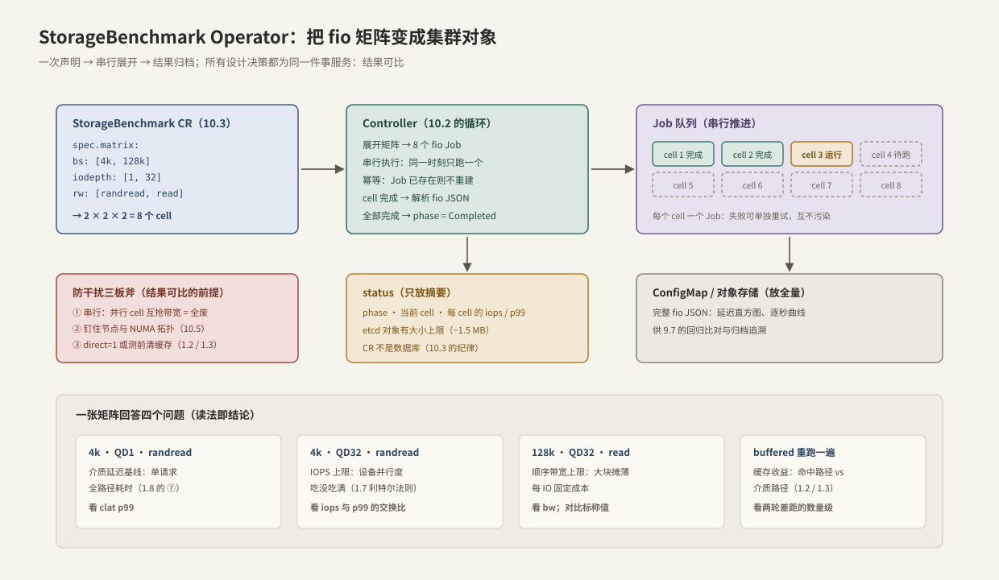

# StorageBenchmark Operator

> 把 [[9.1 fio Benchmark Matrix]] 的实验矩阵升格为集群对象：一次声明、串行展开、结果归档、可比可回归。本篇是 [[10.3 CRD 与 Reconcile]] 那个 CRD 的"配上大脑"——同时也是后面两篇的**贯穿工作负载**：10.5 决定它放在哪，10.6 讲它把节点打满之后发生什么。

前置：[[10.2 Kubernetes Operator 模型]]、[[10.3 CRD 与 Reconcile]]。

---

## 1. 为什么要把基准测试做成 Operator

手工跑 fio 的结果几乎必然不可比【事实，也是每个做过测试的人的血泪】：

- 缓存状态没控制（这轮命中上轮的页缓存，[[1.2 Page Cache 命中与未命中]]）；
- 参数漂移（上周 `iodepth=32`，这周忘了写成默认 1）；
- 节点漂移（这轮调度到了另一台机器、另一个 NUMA 节点）；
- 邻居干扰（同机的其他负载在抢盘）。

Operator 化的目标就一句话：**让"环境与参数"成为被版本控制的声明，让结果天然可比**——benchmark as code。

---

## 2. 架构与设计决策



流程：CR 声明参数矩阵 → 控制器展开为 N 个 cell → **串行**逐个跑 fio Job → 解析 JSON → 摘要写 `status`、全量存 ConfigMap/对象存储。

三个决策各有明确理由【取舍】：

| 决策 | 选择 | 理由 |
| --- | --- | --- |
| 每 cell 一个 Job，还是一个 Job 跑全矩阵 | 每 cell 一个 | 失败可单独重试、结果互不污染；控制器天然逐 cell 推进 |
| cell 并行还是串行 | **串行** | 并行 cell 互抢盘带宽与队列 → 每个结果都是"被干扰下的数字"= 全废 |
| 结果放哪 | 摘要进 status，全量另存 | etcd 对象有大小上限（约 1.5 MB），CR 不是数据库（10.3 的纪律）；完整延迟直方图很大 |

**测量有效性的前置条件**（防干扰三板斧）：

1. **串行**（上表）；
2. **钉住位置**：`nodeName` 固定节点 + Guaranteed QoS 独占 CPU，NUMA 对齐交给 [[10.5 拓扑亲和与 NUMA]]；
3. **控制缓存**：`direct=1`（[[1.3 Buffered IO 与 O_DIRECT]]）测介质，或测前清缓存；`ramp_time` 跳过预热段，`time_based` 固定时长。

控制器创建的 Job 长这样（可以先不写控制器、手工 apply 复现单个 cell）：

```yaml
apiVersion: batch/v1
kind: Job
metadata:
  name: sbench-demo-cell3        # 控制器会补 ownerReference：父删子删（10.3）
spec:
  backoffLimit: 0                # 失败不自动重跑：失败的测量没有意义
  activeDeadlineSeconds: 300     # 超时兜底：Job 永不悬挂
  template:
    spec:
      restartPolicy: Never
      nodeName: node-a           # 钉住节点：结果可比的前提
      containers:
        - name: fio
          image: nixery.dev/shell/fio   # 任一带 fio 的镜像均可
          command: ["fio"]
          args: ["--name=cell", "--filename=/data/testfile", "--size=4G",
                 "--rw=randread", "--bs=4k", "--iodepth=32", "--direct=1",
                 "--runtime=60", "--ramp_time=10", "--time_based",
                 "--output-format=json"]
          resources:             # requests = limits：Guaranteed QoS（10.5 的前提）
            requests: {cpu: "4", memory: 2Gi}
            limits:   {cpu: "4", memory: 2Gi}
          volumeMounts: [{name: data, mountPath: /data}]
      volumes:
        - name: data
          persistentVolumeClaim: {claimName: bench-pvc}
```

Reconcile 状态机沿用 10.3 的三走向：无 Job → 建；Job 在跑 → `requeueAfter`；Job 完成 → 解析结果、推进到下一个 cell；全部完成 → `phase=Completed`。

---

## 3. 用真实问题读矩阵："这块盘撑得起训练数据加载吗"

设需求为：DataLoader 需要 **~1.5 GB/s 顺序读 + 随机小读 p99 < 1 ms**。矩阵 `bs=[4k,128k] × iodepth=[1,32] × rw=[randread,read]` 的读法（对应 SVG 底部四卡）：

1. **4k · QD1 · randread → 介质延迟基线**：这就是 [[1.8 一次 read write 全路径图]] 第⑦步的裸值。p99 若已 > 1 ms，直接出局，别的都不用看；
2. **4k · QD32 · randread → IOPS 上限**：看吞吐随 iodepth 的增长在哪封顶（设备并行度），以及封顶时 p99 涨到多少——**吞吐是用排队买来的**；
3. **128k · QD32 · read → 顺序带宽上限**：对照 1.5 GB/s 需求与设备标称值；
4. **buffered 重跑一遍 → 缓存收益**：与 direct 轮的差距就是页缓存在这台机器上值多少（数据集远大于内存时这个收益会缩水——正对应训练场景）。

---

## 4. 四种资源的因果关系（benchmark 是最好的教具）

跑矩阵时同步观察 CPU/内存/网络，因果链全部现形【事实/量级，方向确定、数值以实测为准】：

| 你调的旋钮 | 直接效果 | 连锁反应 |
| --- | --- | --- |
| iodepth ↑ | 吞吐 ↑，直到设备并行度饱和 | 之后只有排队：p99 随队列线性涨（[[1.7 块层与 blk-mq]] 利特尔法则）——**吞吐与尾延迟的交换比**，是容量规划的核心数字 |
| bs ↑ | 带宽 ↑、IOPS ↓ | 每 IO 固定成本（陷入/中断/块层）被摊薄 → **每 GB 的 CPU 成本下降**；小 bs 高 IOPS 时 CPU 可能先于盘饱和 |
| direct=0（buffered） | 命中后不碰盘 | 瓶颈从设备转移到 **CPU 拷贝与内存带宽**（1.2/1.3）：CPU 单核打满、内存带宽计数器飙升，而 iostat 显示设备闲 |
| 换网络存储（NVMe-oF/NFS） | 延迟 += RTT | 吞吐上限变成 min(设备, 网络带宽, BDP/RTT)（[[1.6 readahead 与 posix_fadvise]] 的 BDP 公式）；p99 加上网络抖动项 |

> [!warning] 测量者饱和 ≠ 被测者饱和
> fio 单个 job 的提交线程 CPU 打满时，数字封顶封的是 fio 自己。判别法：加 `numjobs=4` 吞吐还涨 → 之前是测量者饱和。报告里必须写清 numjobs 与 CPU 占用，否则"设备上限"可能只是"单线程上限"。

---

## 5. Modern C++：回归门（消费矩阵结果的一端）

Operator 生态本身多用 Go；C++ 工程师最常做的是**消费结果**——把两轮矩阵对比、超阈值就拦 CI（配合 [[9.7 SLO 与性能回归]]）：

```cpp
#include <optional>
#include <string>
#include <vector>

struct CellResult {
    std::string cell;      // 如 "4k-qd32-randread"
    double iops = 0;
    double p99_us = 0;
};

// 回归门：基线 vs 本轮，越阈值即报违例——供 CI 判定是否拦截
class RegressionGate {
public:
    RegressionGate(double iops_drop_pct, double p99_rise_pct)
        : iops_drop_{iops_drop_pct}, p99_rise_{p99_rise_pct} {}

    struct Violation {
        std::string cell;
        std::string reason;
    };

    [[nodiscard]] std::vector<Violation>
    check(const std::vector<CellResult>& baseline,
          const std::vector<CellResult>& current) const {
        std::vector<Violation> out;
        for (const auto& base : baseline) {
            const auto cur = find(current, base.cell);
            if (!cur) {
                out.push_back({base.cell, "本轮缺少该 cell（矩阵不完整）"});
                continue;
            }
            if (cur->iops < base.iops * (1.0 - iops_drop_ / 100.0)) {
                out.push_back({base.cell, "iops 跌幅超阈值"});
            }
            if (cur->p99_us > base.p99_us * (1.0 + p99_rise_ / 100.0)) {
                out.push_back({base.cell, "p99 涨幅超阈值"});
            }
        }
        return out;
    }

private:
    static std::optional<CellResult> find(const std::vector<CellResult>& v,
                                          const std::string& cell) {
        for (const auto& r : v) {
            if (r.cell == cell) return r;
        }
        return std::nullopt;
    }

    double iops_drop_;
    double p99_rise_;
};
```

**关键点**：p99 用相对阈值而非绝对值（不同盘基线不同）；"cell 缺失"也是违例——矩阵不完整的比对没有意义；两个阈值分开配置，因为吞吐回归与尾延迟回归的容忍度通常不同。

---

## 6. 指标含义与常见误读

fio JSON 里最重要的三个延迟字段，正好对应 [[1.8 一次 read write 全路径图]] 的分段：

| 字段 | 含义 | 对应全路径 |
| --- | --- | --- |
| `slat`（submission latency） | 提交延迟：从发起到进入设备队列 | ①–⑥（系统调用 + 块层） |
| `clat`（completion latency） | 完成延迟：提交后到完成 | ⑦–⑩（设备 + 完成路径） |
| `lat` | 总延迟 = slat + clat | 全程 |

常见误读：

1. **只看平均**：报告只认 `clat` 的 p99/p999（1.8 §8 的教训）；
2. **首轮当结果**：没有 ramp_time 的首轮混着预热与缓存建立；
3. **buffered 高分当设备能力**：那是内存的成绩（第 4 节）；
4. **numjobs 相加的 iops 当单流能力**：聚合吞吐上去了，单流延迟分布完全不同；
5. **`%util` 100% 当饱和**：多队列设备上无效（[[1.7 块层与 blk-mq]] §8）。

---

## 7. 故障定位：benchmark Job 的典型死法

| 症状 | 高概率原因 | 查什么 |
| --- | --- | --- |
| Job 卡 Pending | 资源不够 / nodeName 或亲和不可满足（10.5） | `kubectl describe pod` 的 Events |
| OOMKilled | buffered 模式 + 大 size：fio 自身缓冲与页缓存压力 | 改 direct=1 或提高 memory limit |
| 结果异常**低** | 邻居干扰、cgroup CPU 限流、CPU 降频 | 同节点其他负载；`throttled_time`（cgroup）；实测时独占节点 |
| 结果异常**高** | 没加 direct=1，命中缓存 | 对照 `Cached` 变化（1.2）；重跑 direct 轮 |
| 同参数两轮差距大 | 位置漂移：不同节点/NUMA/中断分布 | 下一篇 [[10.5 拓扑亲和与 NUMA]] 全篇 |

---

## 8. 关键结论

| 结论 | 性质 |
| --- | --- |
| benchmark as code：参数、位置、缓存状态全部声明化，结果才可比 | 方法论 |
| cell 必须串行：并行互抢带宽 = 每个结果都不可信 | 事实 → 设计 |
| status 只放摘要，全量另存——etcd 有对象大小上限 | 事实 / 设计 |
| 吞吐是用排队买的：iodepth-吞吐-p99 交换比是矩阵最值钱的输出 | 事实 |
| buffered 轮测的是内存与拷贝，direct 轮测的才是介质 | 事实 |
| 测量者饱和 ≠ 被测者饱和：报告必须附 numjobs 与 CPU 占用 | 实践结论 |
| slat/clat 对应全路径的"软件段/设备段"——fio 自带延迟分解 | 事实 |
| 回归判定用相对阈值 + p99，缺 cell 也是违例 | 实践结论 |

---

## 关联知识

- [[10.3 CRD 与 Reconcile]] - 本 Operator 的类型与收敛函数底座
- [[9.1 fio Benchmark Matrix]] - 矩阵参数设计的完整方法论
- [[9.7 SLO 与性能回归]] - 回归门的阈值从哪来
- [[10.5 拓扑亲和与 NUMA]] - "同参数两轮差距大"的头号元凶
- [[1.3 Buffered IO 与 O_DIRECT]] - direct=1 到底测的是什么
