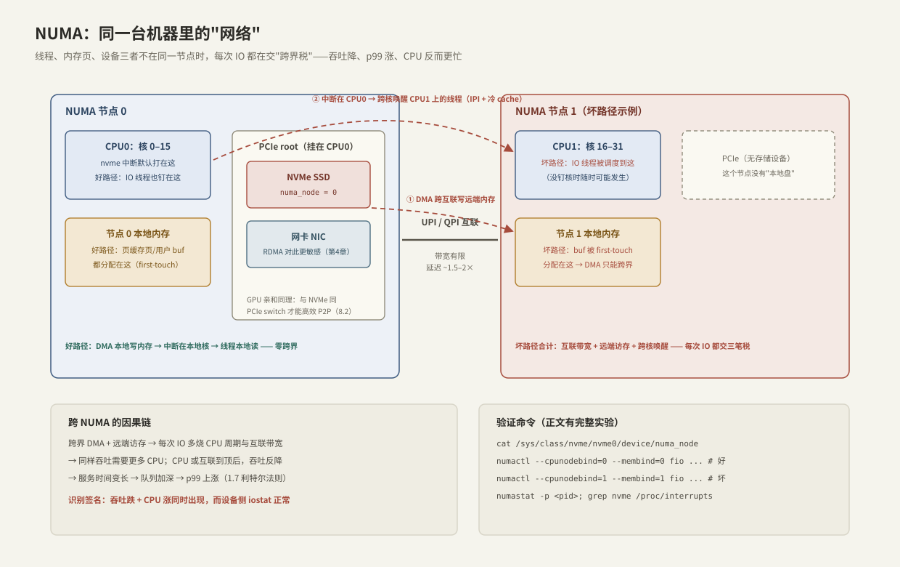

---
tags:
  - 高性能存储/控制面
---
# 拓扑亲和与 NUMA

> 同一台机器内部也有"网络"：跨 NUMA 节点的内存访问要走 CPU 间互联，跨 PCIe 拓扑的 DMA 同理。线程、内存页、设备三者放错相对位置，同一块盘能测出两种成绩——[[10.4 StorageBenchmark Operator]] 里"同参数两轮差距大"的头号元凶就是它。

前置：[[1.2 Page Cache 命中与未命中]]（页从哪来）、[[10.4 StorageBenchmark Operator]]（本篇的实验载体）。

---

## 1. NUMA 是什么

**【事实】** 多路服务器上，每颗 CPU（socket）自带内存控制器与本地内存，CPU 之间用点对点互联（Intel UPI / AMD Infinity Fabric）相连。于是内存访问分两种：

- **本地访问**：走自己的内存控制器；
- **远端访问**：跨互联到另一颗 CPU 的内存——**延迟约 1.5–2 倍【量级】，且互联带宽远小于本地内存带宽的总和**。

这就是 NUMA（Non-Uniform Memory Access）：内存还是那个内存，"从哪访问"决定了快慢。查看拓扑：

```bash
lscpu | grep NUMA                 # 几个节点、各含哪些核
numactl --hardware                # 各节点内存量 + 节点间距离矩阵
lstopo-no-graphics                # 完整拓扑树：核、缓存、PCIe 设备挂载点
```

---

## 2. 存储为什么在乎：设备也有"户口"

**【事实】** NVMe 盘和网卡挂在**某一颗 CPU 的 PCIe 通道**上（`cat /sys/class/nvme/nvme0/device/numa_node` 直接告诉你户口），中断也默认路由到该节点的核。于是一次 IO 涉及三个"位置"：**发起 IO 的线程、数据缓冲区（或页缓存页）、设备**。



三者同节点（好路径）：DMA 本地写内存 → 中断本地核处理 → 线程本地读——零跨界。三者错位（坏路径，图中示例）每次 IO 交三笔税：

1. **DMA 跨互联**：设备在节点 0、缓冲区页在节点 1 → 每次数据搬运都占用互联带宽；
2. **远端访存**：线程随后读写这些页 → 每次访问延迟 ×1.5–2；
3. **跨核唤醒**：中断打在节点 0 的核，要用 IPI 唤醒睡在节点 1 的线程 → 调度延迟 + 迁移过去的 cache 全冷。

### 因果链：四种资源如何联动【本篇核心】

```text
跨界 DMA + 远端访存
  → 每次 IO 多烧 CPU 周期（等远端内存）+ 消耗互联带宽（隐形的共享资源）
  → 同样吞吐需要更多 CPU；当 CPU 或互联先于设备到顶 → 吞吐反而下降
  → 每个请求服务时间变长 → 队列加深 → p99 上涨（1.7 利特尔法则）
```

**识别签名**：**吞吐跌 + CPU 涨同时出现，而 iostat 显示设备不忙**——设备没问题，钱花在了搬运上。这与"设备饱和"（吞吐平、await 涨、设备 %util/队列深）的形态完全不同，是排障时第一个要区分的岔路。

**【事实】** 越快的路径对拓扑越敏感：本地 NVMe（几十 μs）被跨界税吃掉一截还能看；RDMA 网卡（几 μs 级，第 4 章）和 GPU P2P（[[8.2 GDS 与 cuFile]]：GPU 与 NVMe 必须同 PCIe switch 才高效）对错位几乎零容忍。设备端 PCIe 细节在 [[3.8 PCIe 拓扑与 NUMA]]。

---

## 3. 可复现实验：量出跨界税

用 10.4 的矩阵在同一台双路机器上跑两轮，唯一变量是位置（假设盘在节点 0）：

```bash
cat /sys/class/nvme/nvme0/device/numa_node        # 确认盘的户口，假设 = 0

# 轮 A：三者同节点（好路径）
numactl --cpunodebind=0 --membind=0 \
  fio --name=local --filename=/dev/nvme0n1 --rw=randread --bs=4k \
      --iodepth=32 --direct=1 --runtime=60 --time_based --output-format=json

# 轮 B：线程与内存钉到节点 1（坏路径，仅差一个数字）
numactl --cpunodebind=1 --membind=1 \
  fio --name=remote --filename=/dev/nvme0n1 --rw=randread --bs=4k \
      --iodepth=32 --direct=1 --runtime=60 --time_based --output-format=json

# 旁证观察
numastat -p <fio_pid>            # numa_miss / 其他节点分配量
grep nvme /proc/interrupts       # 中断都打在哪些核
mpstat -P ALL 5                  # 哪个节点的核在烧
```

**读结果**：对比两轮的 iops、clat p99、以及"每千 IOPS 的 CPU 占用"。差距量级视机型与负载常见 10–30%【量级，以实测为准】；p99 的相对涨幅通常大于吞吐的相对跌幅——尾延迟对跨界税更敏感。

> [!warning] 顺带检查中断
> `irqbalance` 可能把 nvme 中断挪来挪去，造成结果周期性波动。基准测试期间要么停掉它，要么手动绑定中断亲和（`/proc/irq/<n>/smp_affinity_list`）——又一个"结果不可比"的隐形变量。

---

## 4. K8s 怎么表达拓扑（控制面落地）

调度器默认只看"节点有没有足够 CPU/内存"，**不看 NUMA**。要拿到对齐保证【事实/实现】：

- **CPU Manager（static 策略）**：Guaranteed QoS（requests = limits 且为整数核）的 Pod 独占物理核，不再被调度器挪来挪去——这就是 10.4 Job 里 `requests=limits` 的原因；
- **Topology Manager（single-numa-node 策略）**：kubelet 在准入时对齐三样东西——独占 CPU、内存、设备（device plugin 上报设备的 numa_node）——保证都来自同一节点，做不到就拒绝 Pod；
- **粗粒度兜底**：nodeSelector/affinity 只能选对"机器"，机器内的对齐必须靠上面两个 kubelet 特性。

**【取舍】** 对齐提高性能与可预测性，代价是**装箱率下降**：整核独占 + 单节点约束造成资源碎片（节点 0 还剩 3 核、节点 1 剩 2 核，一个要 4 核对齐的 Pod 进不来）。延迟敏感的存储数据面值得付这个代价，批处理负载通常不值得。

验证 Pod 实际拿到的核：

```bash
kubectl exec <pod> -- taskset -pc 1        # 看 PID 1 的 CPU 亲和列表
kubectl exec <pod> -- cat /sys/fs/cgroup/cpuset.cpus.effective
```

---

## 5. Modern C++：钉核与 first-touch

应用侧要配合：**线程钉在设备同节点的核上，缓冲区由该线程亲手首次触碰**。复用 1.3 的 `AlignedBuffer`：

```cpp
#include <pthread.h>

#include <cstddef>
#include <span>
#include <system_error>

// 把当前线程钉在指定 CPU 上：消除"被调度到远端节点"这个随机变量
void pin_this_thread(int cpu) {
    cpu_set_t set;
    CPU_ZERO(&set);
    CPU_SET(cpu, &set);
    if (const int err = ::pthread_setaffinity_np(::pthread_self(),
                                                 sizeof(set), &set);
        err != 0) {
        throw std::system_error{err, std::generic_category(), "setaffinity"};
    }
}

// 【事实】first-touch：物理页在"第一次写它的线程"所在节点分配
// 所以缓冲区必须由将要使用它的（已钉核的）线程亲手触碰
void first_touch(std::span<std::byte> buf) {
    constexpr std::size_t kPage = 4096;
    for (std::size_t i = 0; i < buf.size(); i += kPage) {
        buf[i] = std::byte{0};
    }
}

// IO 线程的正确开场
void io_worker(int cpu_on_device_node, std::size_t buf_bytes) {
    pin_this_thread(cpu_on_device_node);              // ① 先钉核
    AlignedBuffer buf = make_aligned_buffer(buf_bytes); // ② 只拿到虚拟地址（1.3）
    first_touch({buf.get(), buf_bytes});              // ③ 物理页在本节点落地
    // ④ 之后的 O_DIRECT DMA 与访存全程本地
}
```

**关键点与经典事故**：

- `aligned_alloc/malloc/mmap` 只给虚拟地址，物理页在**首次写入**时才分配、且分配在写入线程所在节点——这就是 first-touch 策略【事实】；
- **经典事故**：主线程构造好 `std::vector`（构造时清零 = 主线程完成了 first-touch），再把它交给钉在另一节点的工作线程——buffer 的户口落在了主线程的节点上，工作线程终身交远端访存税。修法：**谁用谁初始化**；
- 钉核后别忘了中断（第 3 节）与设备户口三者对齐，缺一角就漏税。

---

## 6. 指标含义与常见误读

| 指标 | 含义 | 常见误读 |
| --- | --- | --- |
| `numastat` 的 numa_miss / numa_foreign | 页分配落到了非首选节点 | 数值增长快 = 内存压力下跨节点分配，不一定是代码错位——结合 membind 实验区分 |
| 每千 IOPS 的 CPU 占用 | 搬运效率 | 只看 CPU% 不看吞吐会漏掉"CPU 涨吞吐跌"的签名 |
| `/proc/interrupts` 中断分布 | 完成路径落点 | 中断均匀 ≠ 正确：应该集中在设备同节点的核 |
| iostat await 正常但应用慢 | 设备无辜 | 慢在拷贝/访存路径——查 NUMA，别冤枉盘 |
| "加线程提吞吐" | —— | 跨节点加线程可能反降：多出来的线程全在交税，还抢互联带宽 |

---

## 7. 故障定位

| 症状 | 高概率原因 | 动作 |
| --- | --- | --- |
| 同配置两台节点/两轮结果差一截 | 盘户口不同 / Pod 没对齐 | 对比 `numa_node`、`cpuset.cpus.effective` |
| p99 周期性尖刺 | irqbalance 迁移中断 / 线程被调度迁移 | 绑中断；钉核；看 `migrations`（`perf stat`） |
| 吞吐随机好坏（同一台机器） | 没钉核，调度器把线程扔来扔去 | CPU Manager static 或应用内钉核 |
| CPU 涨吞吐跌，设备闲 | 跨界税（本篇签名） | membind 实验确认；对齐三要素 |

---

## 8. 关键结论

| 结论 | 性质 |
| --- | --- |
| NUMA = 机器内的网络：远端访存延迟 ~1.5–2×，互联带宽是隐形共享资源 | 事实 / 量级 |
| 一次 IO 有三个位置要素：线程、内存页、设备——错位一角就交税 | 事实 |
| 跨界税签名：吞吐跌 + CPU 涨 + 设备闲——与设备饱和形态完全不同 | 实践结论 |
| first-touch：物理页落在首次写入线程的节点 → 谁用谁初始化；"主线程建 buffer 交给工作线程"是经典事故 | 事实 → 实践结论 |
| K8s 对齐三件套：Guaranteed QoS + CPU Manager static + Topology Manager single-numa-node | 实现 |
| 对齐换装箱率：延迟敏感数据面值得，批处理不值得 | 取舍 |
| 越快的路径越敏感：NVMe < RDMA < GPU P2P 的容忍度递减 | 事实 |
| 基准测试必须钉死：核、内存节点、中断——否则 10.4 的"可比"不成立 | 实践结论 |

---

## 关联知识

- [[10.4 StorageBenchmark Operator]] - 本篇实验的载体与"结果漂移"的动机
- [[3.8 PCIe 拓扑与 NUMA]] - 设备端视角的完整 PCIe 细节
- [[8.2 GDS 与 cuFile]] - GPU 与 NVMe 的 PCIe switch 亲和：零容忍档
- [[1.2 Page Cache 命中与未命中]] - 页缓存页的分配同样受 first-touch 支配
