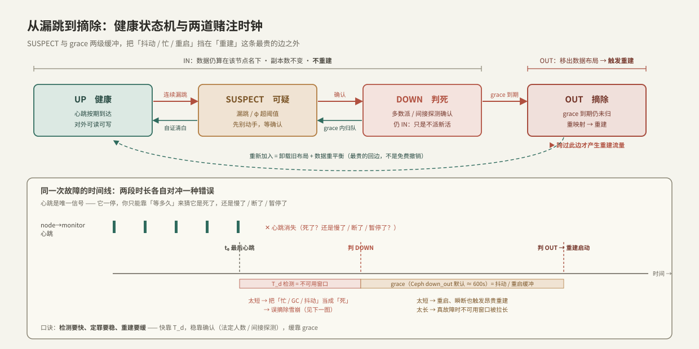
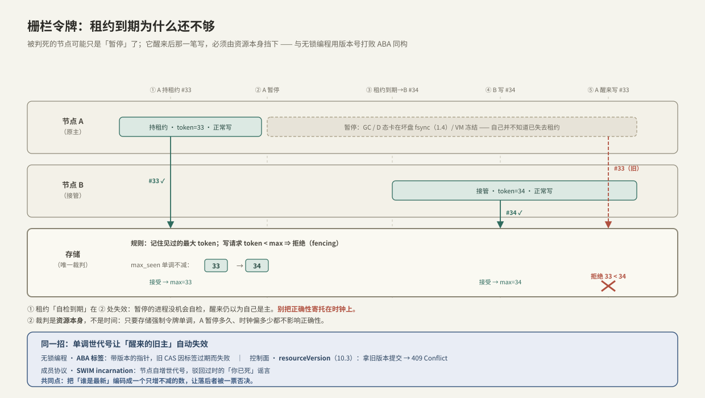
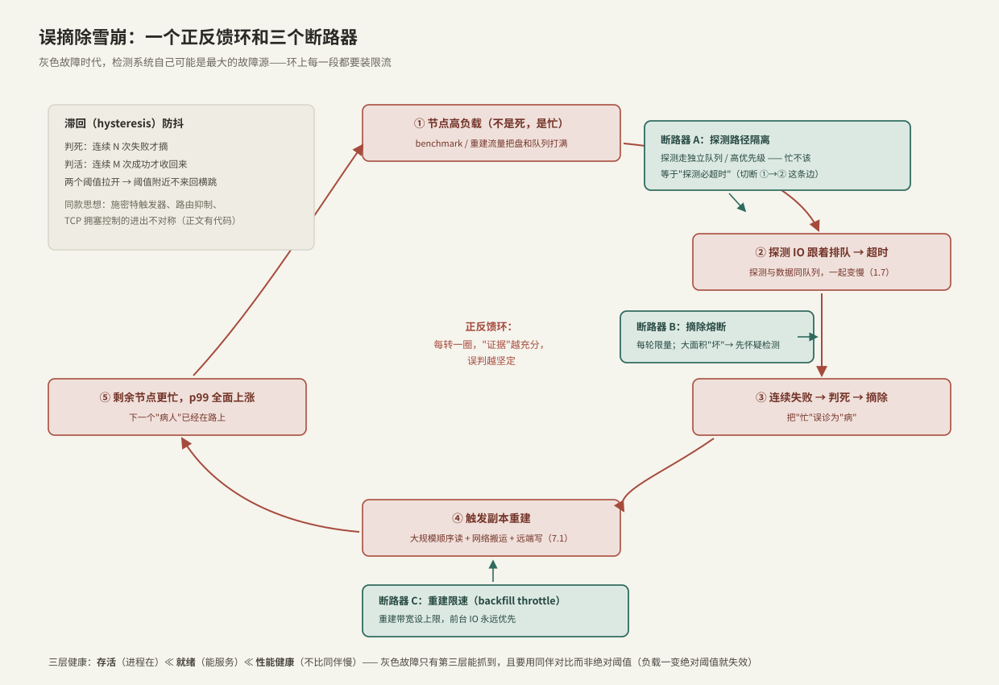

---
tags:
  - 高性能存储/控制面
---
# 健康检查与故障摘除

> 把一个节点从集群里「摘掉」是一个**赌注**：你赌它真的死了。可是异步网络里，「死了」和「慢了 / 断连了 / 暂停了」根本无法区分——摘错了要赔数据，摘晚了要赔可用性。本篇讲这个赌注怎么下、怎么分级对冲、以及万一赌错了靠什么兜底。它是 [[10.1 数据面与控制面分工]] 里「状态上报通道」的完整展开，也是控制面这一章的收尾。

前置：[[10.1 数据面与控制面分工]]（上报永远是过去时）、[[10.2 Kubernetes Operator 模型]]（租约 / 选主）、[[7.1 副本 vs EC]]（摘除之后要重建的对象）。

---

## 1. 两个动作，别当成一个：检查产生怀疑，摘除是定罪

先把两个词拆开，它们的正确性要求差一个数量级：

- **健康检查（health check）**：一个**持续的判断过程**——「这个成员现在能不能用」。它的产物是一个信号，可能错。
- **故障摘除（eviction / fault removal）**：一个**有后果的决策动作**——把成员踢出数据布局、触发副本重建。它昂贵、难回退。

**【边界】** 中间必须隔着一步**确认**：检查只产生「怀疑」，摘除是「定罪」。一步到位（漏一次心跳就摘）是所有故障放大事故的起点（第 7 节）。

**【边界】** 健康检查 ≠ 监控告警。告警是给**人**看的、可以聚合可以延迟；健康检查是给**自动化决策**用的、机器可读、要求低延迟低误报。两者数据源可以共享，语义完全不同。

**三层健康，越往下越难测**【事实，Kubernetes 探针词汇】：

| 层次 | 问的问题 | K8s 探针 | 失败后果 |
| --- | --- | --- | --- |
| 存活（liveness） | 进程还在吗 | livenessProbe | 重启容器 |
| 就绪（readiness） | 现在能服务吗 | readinessProbe | 摘出 Service endpoints（不重启，不给流量） |
| 性能健康 | 是不是明显比同伴慢 | 无内建，需自建 | 降权 / 摘除 |

**关键区分**：**活着 ≠ 能服务 ≠ 服务得好**。心跳线程活蹦乱跳，数据路径可能已经死了——这就是第 7 节的灰色故障，也是三层里只有最后一层能抓到的那类。

---

## 2. 根本困难：漏一次心跳，到底意味着什么

**心跳（heartbeat）** 是最基础的机制：成员周期性发一个「我还在」的信号，监测方按期收。方向有两种——**推**（节点主动上报，最常见）与**拉**（监测方主动探测）。心跳一旦按期停下，问题来了：

**【事实】异步网络里，你无法区分「慢」和「死」。** 一次漏跳，可能是：进程崩了、进程在忙（长 GC、长 `fsync`）、网络丢包、网络分区、对端被 `SIGSTOP` 暂停、虚机被冻结迁移。这些在监测方看来**完全一样**：就是「该来的没来」。你手里只有一个信息——**已经等了多久**——和一个动作——**要不要现在就下结论**。任何结论都是一个基于超时的赌注。

> C++ 工程师的同款问题：线程池里一个 worker 迟迟不认领任务，它是**死锁了**，还是**在憋一个大活**？你没有可靠办法直接问它，只能靠一个看门狗计数器 + 一个超时阈值去猜。分布式失败检测就是这个问题放大到网络尺度——而网络比进程内更不可靠。

**为什么 TCP 帮不上忙**【事实，触及 OS / 网络层】——这是存储 / 网络工程师最容易误信的一点：

1. **TCP keepalive 太慢**：Linux `tcp_keepalive_time` 默认 **7200 秒（2 小时）**才开始探测。等它报错，业务早就挂穿了。可以调小（`TCP_KEEPIDLE/INTVL/CNT`），但**应用层心跳**才是正解，因为——
2. **内核活着 ≠ 应用活着**：TCP 协议栈跑在**内核**里。如果对端**应用**卡死（比如线程陷在坏盘的 `fsync` 上进了 **D 态**不可中断睡眠，见 [[1.4 fsync fdatasync 与持久化语义]]），但内核没事，那么内核照常回 ACK、照常应答 keepalive 探测——**TCP 层报告「连接健康」，而应用一个请求都没处理**。所以心跳必须是**应用层**的，最好还要**亲手走一遍真实工作路径**（第 7 节）。
3. **半开连接**：对端整机消失时，TCP 连接进入半开状态，你不写就发现不了；一写才会在重传超时后报错。读则可能永久阻塞。

**结论**：心跳、超时、这个赌注，是**绕不过去**的——不是工程偷懒，是异步网络的本质约束决定的。

---

## 3. 失败检测器：把「赌」形式化

学术界把这件事抽象成**失败检测器（failure detector）**，两个属性彼此拉扯【事实，Chandra–Toueg 1996】：

- **完整性（completeness）**：真死的成员，**最终**会被怀疑。（超时机制天然满足：死了就不发心跳，早晚超时。）
- **准确性（accuracy）**：没死的成员，**不该**被怀疑。（这才是难的：一个慢节点看起来就像死节点。）

**【事实/不可能性】** 纯异步系统里，**不存在**既完整又准确的「完美检测器」。这与 FLP 不可能性同源——你只能实现「**最终完美**」（◇P）：允许一时错判（把慢节点误疑），但错误**最终会自我纠正**（节点回应了就撤销怀疑）。**没有银弹，只有把误差调到可接受**。

超时阈值就是这个误差的旋钮，两头都是坑：

| 阈值 | 偏向的错误 | 代价 |
| --- | --- | --- |
| 太短 | **误报**（false positive，把活的判死） | 无谓摘除 → 副本重建风暴（第 7 节） |
| 太长 | **漏报**（false negative，真死了慢慢才发现） | 数据不可用窗口拉长、请求打在死节点上超时 |

**φ 累积检测器（phi accrual）**【实现，Cassandra / Akka 采用】：与其用一个硬阈值输出「生 / 死」，不如输出一个**连续的怀疑度 φ**，随「距上次心跳的时长」平滑上升：

$$
\varphi(t) = -\log_{10}\bigl(P_{later}(t - t_{last})\bigr)
$$

其中 `P_later(Δ)` 是「按历史到达间隔分布，一个心跳比 Δ 还晚才到」的概率。含义：φ = 8 意味着「此刻判死的误报概率约 10⁻⁸」。两个好处——**自适应**（网络抖、间隔分布变宽，φ 就涨得慢，自动宽容）；**把阈值选择权交给上层**（要快的场景取小 φ，要稳的取大 φ，如 Cassandra `phi_convict_threshold` 默认 8）。它没有消除赌注，只是把赌注**标了刻度**。

---

## 4. 端到端路径：从漏跳到摘除到重建

把上面的赌注串成一条状态机 + 时间线。这是本篇的骨架：



**状态跃迁**（每一步都是一个赌注，逐级加码）：

1. **UP → SUSPECT**：连续漏跳 / φ 超阈值。**先怀疑，别动手**——给瞬时抖动一个自证的机会（`SUSPECT → UP` 的回边：心跳恢复，或节点自证清白）。
2. **SUSPECT → DOWN**：**确认**。单个监测方说了不算（它自己的网卡 / 网段可能才是坏的那个），要**法定人数（quorum）多数派**或**间接探测**背书（第 5 节）。
3. **DOWN → OUT**：**grace 宽限期到期仍未归**。这是最关键的一道闸。

**【本篇核心区分】DOWN ≠ OUT。** DOWN 只是「暂时不派新活给它」，数据仍**算在它名下**（still `IN`），副本数不变，**不重建**。只有跨过 `DOWN → OUT` 这条边，才把它**移出数据布局**、触发副本重建。为什么要多这一级：**重启一台机器、拔插一次网线**都会让节点 DOWN 十几秒，但你绝不想为此把它几 TB 的数据全网重建一遍。grace 就是「抖动 / 重启缓冲」——以 Ceph 为例，`mon_osd_down_out_interval` **默认 600 秒**（10 分钟）才把 down 的 OSD 标记 out【实现/默认值，随版本变】。

**两道时钟，各对冲一种错误**（见图下半时间线）：

- **T_d（检测时间）= 不可用窗口**：从最后一次心跳到判 DOWN。越短越早发现真故障，也越容易把「忙 / GC / 抖动」误判为「死」。
- **T_g（grace）= 抖动 / 重启缓冲**：从 DOWN 到 OUT。越短越省不可用时间，也越容易为一次重启付出全量重建；越长越安全，真故障时降级运行的窗口也越久。

口诀：**检测要快、定罪要稳、重建要缓**——快靠 T_d，稳靠确认，缓靠 grace。

**【取舍】不可逆性决定了保守方向。** `OUT → UP`（重新加入）不是免费撤销：要卸载旧布局、把数据重平衡回来，是整条链上最贵的回边。因为定罪的代价远大于多疑的代价，所以工程上普遍**宁可慢一点摘、也不要错摘**——这条不对称性贯穿全篇。

---

## 5. 谁来监测：中心式 vs Gossip / SWIM

第 4 节的「确认」需要机制支撑，而机制选择又受**规模**约束：

**中心式**：所有节点向一个监测方（如 Ceph 的 monitor）上报心跳。简单、视图一致，但三个问题——监测方负载 **O(N)**、它是**单点**、且**它自己的网络问题会污染对全体的判断**（监测方所在网段抖一下，它会觉得「全世界都死了」）。规模不大时够用，靠 monitor 自身多副本 + 选主（[[10.2 Kubernetes Operator 模型]]）缓解单点。

**Gossip / SWIM**【事实，SWIM 2002，Serf / Consul / memberlist 采用】：去中心，每个节点负载 **O(1)**，无单点，天然带「确认」：

1. **直接探测**：每周期随机挑一个 peer 发 ping；收到 ack 就算活。
2. **间接探测（ping-req）**：ping 超时不立刻判死，而是**再随机挑 k 个 peer，托它们去 ping 目标**。这一步**排除了探测方自己的网络故障**——如果 k 个第三方也都 ping 不通，才更可能是目标真的坏了。这正是第 4 节「确认」的分布式实现。
3. **怀疑与传播**：判定为 SUSPECT / DEAD 的消息**搭便车**在 ping/ack 上**流言式（epidemic）扩散**，约 O(log N) 轮传遍全网。
4. **自证（refute）**：被误传「已死」的节点，广播一条更高 **incarnation（世代号）** 的「我还活着」把谣言压下去。这个单调世代号，就是第 6 节栅栏令牌的近亲。

**【取舍】** SWIM 用「最终一致的成员视图」换来了「扩展性 + 无单点 + 自带旁证」，代价是任一时刻各节点看到的成员表可能短暂不一致——又一次「容忍陈旧、靠传播收敛」（[[10.1 数据面与控制面分工]] 的主题）。

---

## 6. 裂脑与栅栏：万一摘错了，靠什么兜底

第 3 节说过误报无法根除。那么**总有一天你会摘掉一个其实还活着的节点**（它只是被网络分区隔开了）。噩梦场景：

> 判 A 死 → 把 A 的数据在别处重建 → 分区愈合，A 回来了，它**不知道自己被摘过**，继续对外写 → 现在同一份数据有两个写者、两个版本 → **数据分叉 / 丢失**。这就是**裂脑（split-brain）**。

**根治手段是栅栏（fencing）：被判死的成员，必须从机制上被阻止继续动作。** 强弱几档：



- **租约自栅栏（lease self-fencing）**：节点持一个带 TTL 的租约，到期没续上就**自觉停手**。**【前提】** 这依赖两件不牢靠的事：时钟误差有界、且进程**没有被暂停过头**。可 GC / D 态 / 虚机冻结恰恰能让它「睡过」到期点——**醒来时它仍以为自己持租约**，于是照写不误。租约单独用**不够**。
- **栅栏令牌（fencing token）**【事实，见 DDIA】：租约服务每次授权都发一个**单调递增**的令牌号；客户端**每一笔写都带上它**；**资源端（存储）记住见过的最大令牌，拒绝任何更小的**。于是那个「睡过头醒来的旧主」拿着过期令牌 33 去写，存储早已见过接管者的令牌 34 → **直接拒绝**。关键在于：**裁判是资源本身，不是时钟**——只要存储强制单调，旧主暂停多久、时钟偏多少都不影响正确性。
- **STONITH / 存储级栅栏**：直接物理隔离——断电、切网、用 SCSI-3 Persistent Reservations 撤销旧主对 LUN 的访问权。HA 集群（Pacemaker）的标准做法，最粗暴也最确定。

> [!important] 栅栏令牌 = 无锁编程里打败 ABA 的那个标签
> 单调世代号让「一个暂停后醒来、以为世界没变的旧行动者」自动失效——这个模式你在别处见过多次：
> - **无锁编程**：带版本的指针（tagged pointer），旧 CAS 因标签过期而失败，正是防 ABA；
> - **控制面**：`resourceVersion`，拿旧版本提交得 **409 Conflict**（[[10.3 CRD 与 Reconcile]]，那里详解「集群版 CAS」）；
> - **成员协议**：SWIM 的 incarnation（第 5 节）。
>
> 共同点：**把「谁是最新」编码成一个只增不减的数，让落后者被一票否决。** 认出这个同构，栅栏就不再是新知识。

---

## 7. 灰色故障：最难抓的一类，也是雪崩的火种

前面假设故障是「利落地死」（fail-stop）。现实里最难缠的是**灰色故障（gray failure）/ 慢速故障（fail-slow）**：

**【事实】** 节点**通过了健康检查**（心跳线程好好的），但**数据路径已坏或极慢**——盘在吐 EIO（[[6.3 fsyncgate 与 EIO 处理]]）、尾延迟炸了、SMART 告警、或 `fsync` 卡在坏盘上几十秒。**存活探针说它活着，客户端却在超时。** 差异化观察是签名：**节点自认健康，使用它的人却看它很慢**。

**根因是探针探错了东西**：一个只 `tcpSocket` 探端口是否打开的探针，和 TCP keepalive 一样只验到内核（第 2 节）；要抓灰色故障，探针必须**亲手走一遍真实数据路径**（读写一小块、带自己的超时），并且**用同伴对比而非绝对阈值**判定——因为负载一变，绝对延迟阈值立刻失效，而「比同伴慢 5 倍」在任何负载下都成立。

**为什么灰色故障最危险：它是误摘除雪崩的火种。** 一旦检测系统把「忙 / 慢」误判为「死」，就可能踏进一个**正反馈环**——这也是本章反复强调「控制面别进热路径、决策要容忍陈旧」的终极理由：



环是这样转起来的：**节点忙（不是死）→ 探测 IO 与数据挤同一队列一起变慢 → 判死摘除 → 触发副本重建 → 剩余节点更忙 → 下一个「病人」已在路上**。每转一圈「证据」越充分，误判越坚定——这就是**亚稳态故障（metastable failure）**：触发因素（一次误摘）撤掉后，系统靠自我强化的重建负载**继续**留在故障态，不主动断环就出不来。

**三个断路器 + 一道滞回**（对应上图，也对应 Ceph 的具体参数）：

| 断路器 | 切断哪条边 | Ceph 对应【默认值随版本变】 |
| --- | --- | --- |
| A 探测路径隔离 | 忙 → 探测超时 | 心跳走 OSD 间独立连接，不与数据 IO 抢同一队列 |
| B 摘除熔断（fuse） | 判死 → 摘除 | `mon_osd_min_in_ratio`≈0.75：大面积「坏」时**拒绝**继续摘，先怀疑检测本身 |
| C 重建限速（throttle） | 重建 → 拖垮剩余节点 | `osd_max_backfills`≈1：限并发重建，前台 IO 永远优先 |

**滞回（hysteresis）防抖**：判死要连续 N 次失败，判活要连续 M 次成功，两个阈值拉开，节点就不会在临界点反复横跳（flapping）。同款思想遍布工程：施密特触发器、路由抑制、TCP 拥塞控制进出速率的不对称。下一节给它代码。

**一个可复现的灰色故障观察**（单机，用 `tc netem` 把一个健康端点「调慢」）：

```bash
# 给回环注入 200ms 单向延迟：端口在、进程活，但"服务得好"这层已破
sudo tc qdisc add dev lo root netem delay 200ms
# 观察：只探端口的检查仍报健康；走真实往返 + 绝对阈值的检查开始 flap
# 换成"与同伴中位数对比"的判定，才稳定识别出这个节点被拖慢
sudo tc qdisc del dev lo root netem            # 清理
```

---

## 8. Modern C++：滞回检测器 + 栅栏令牌

把第 4、6、7 节的两个核心机制落成可读的骨架（**心智模型，非生产代码**）。

**其一，带滞回的成员健康判定**——看门狗线程与上报线程共用，`SUSPECT` 先于 `DOWN`，判死 / 判活阈值不对称：

```cpp
#include <chrono>
#include <mutex>

using Clock = std::chrono::steady_clock;

enum class Health { Up, Suspect, Down };   // 注意：Down ≠ Out，Out 是另一层的决策

// 单个成员的健康判定：超时 + 滞回。线程安全。
class MemberHealth {
public:
    MemberHealth(std::chrono::milliseconds timeout,
                 int fail_to_down = 3, int ok_to_up = 2)
        : timeout_{timeout}, fail_to_down_{fail_to_down}, ok_to_up_{ok_to_up} {}

    // 上报线程：收到一次心跳
    void on_heartbeat() {
        std::scoped_lock lk{m_};
        last_beat_ = Clock::now();
        fail_streak_ = 0;
        if (++ok_streak_ >= ok_to_up_) state_ = Health::Up;    // 连续 M 次成功才收回
    }

    // 看门狗线程：周期性调用，判断是否超时（返回值仅供上层决定是否上报 DOWN）
    Health tick() {
        std::scoped_lock lk{m_};
        if (Clock::now() - last_beat_ > timeout_) {
            ok_streak_ = 0;
            if (state_ == Health::Up) state_ = Health::Suspect;   // 先怀疑，别定罪
            if (++fail_streak_ >= fail_to_down_) state_ = Health::Down;  // 连续 N 次才判死
        }
        return state_;
    }

private:
    std::mutex m_;
    std::chrono::milliseconds timeout_;
    int fail_to_down_, ok_to_up_;
    int fail_streak_ = 0, ok_streak_ = 0;
    Clock::time_point last_beat_ = Clock::now();
    Health state_ = Health::Up;
};
```

要点：`fail_to_down_ > ok_to_up_` 的不对称就是滞回；`tick()` 返回 `Down` **不等于**摘除——真正的 `OUT` 还要叠加 grace 计时与法定人数确认（第 4、5 节），这层刻意不在类里做，以免把「检查」和「定罪」耦合成一步。

**其二，栅栏令牌**——存储端做唯一裁判，与集群版 CAS 逐行同构：

```cpp
#include <atomic>
#include <cstdint>
#include <stdexcept>

// 存储侧：唯一裁判。只认单调令牌，落后者一票否决。
class FencedResource {
public:
    // 只有 token >= 见过的最大值才放行 —— 抬水位的过程就是一个 CAS 循环
    void write(std::uint64_t token, int payload) {
        std::uint64_t seen = max_token_.load(std::memory_order_acquire);
        do {
            if (token < seen)                        // 旧主醒来的那一笔：挡在门外
                throw std::runtime_error{"fenced: stale token"};
        } while (!max_token_.compare_exchange_weak(
                     seen, token, std::memory_order_acq_rel));
        apply(payload);                              // 通过栅栏，才真正落盘
    }

private:
    void apply(int /*payload*/) { /* 真正的持久化写 */ }
    std::atomic<std::uint64_t> max_token_{0};
};

// 客户端：拿租约的同时拿到本次栅栏令牌，每笔写都带上它
class LeaseHandle {
public:
    LeaseHandle(FencedResource& res, std::uint64_t token) : res_{res}, token_{token} {}
    void write(int payload) { res_.write(token_, payload); }   // 令牌随每笔写下发

private:
    FencedResource& res_;
    const std::uint64_t token_;   // 世代号：由租约服务单调发放，本次租约内不变
};
```

要点：正确性**不**依赖客户端自觉——`LeaseHandle` 就算持了过期令牌，`FencedResource::write` 也会把它挡下。这正是第 6 节「裁判是资源本身，不是时钟」的代码化；`compare_exchange` 循环与 [[10.3 CRD 与 Reconcile]] 的 `resourceVersion` 重试是同一个骨架，只是一个在进程内、一个跨集群。

---

## 9. 指标含义与常见误读

| 指标 | 含义 | 常见误读 |
| --- | --- | --- |
| 节点 flap 率（UP/DOWN 抖动次数） | 判定在临界点反复横跳 | flap ≠ 节点坏——多半是超时太紧 / 没滞回 / 网络抖动，先调阈值再怀疑硬件 |
| MTTD（平均检测时间） | 从故障到判死的时长 | 只压 MTTD 会推高误报——它和「误摘率」是同一旋钮的两端，要一起看 |
| 心跳丢失计数 | 上报中断次数 | 单次丢失 ≠ 死亡（[[10.1 数据面与控制面分工]] 已述）；看的是连续丢失 |
| 「节点 down 但数据仍可读」 | 副本在兜底 | 是**副本在起作用**，不是「没坏」——别因为读得到就撤掉告警 |
| 摘除后重建吞吐飙升 | 正在重平衡 | 若同时多个节点被摘 + 重建打满带宽 → 雪崩签名（第 7 节），先熔断摘除 |
| 心跳 RTT p99 vs 超时阈值 | 检测的余量 | 阈值只比 p99 高一点点 = 一次正常尾延迟就误报；留足余量 |

---

## 10. 故障定位

| 症状 | 高概率原因 | 动作 |
| --- | --- | --- |
| 节点频繁 flap（UP/DOWN 抖动） | 超时太紧 / GC / 网络抖动 / 无滞回 | 拉大超时与滞回阈值；查 `perf` 的 GC / 迁移；查网段抖动 |
| 真死了很久才摘 | 超时太松 / 探针只探控制路径 | 调紧 T_d；让探针走真实数据路径（第 7 节） |
| 摘除后重建风暴打爆集群 | 无重建限速 / grace 太短 / 摘除无熔断 | 上三个断路器（第 7 节）；`osd_max_backfills`、`down_out_interval` |
| 摘了又活过来、数据出现分叉 | 没有栅栏（裂脑） | 上栅栏令牌 / STONITH；查旧主是否曾被暂停过头（第 6 节） |
| 健康检查全过，客户端却报错 / 变慢 | 灰色故障，检查没探数据路径 | 换端到端探针 + 同伴对比阈值；查盘 EIO / SMART / 尾延迟 |
| 监测方一报「全体都死了」 | 监测方自己的网络坏了 | 别信单点判断；看 quorum / 间接探测是否背书（第 5 节） |

---

## 11. 关键结论

| 结论 | 性质 |
| --- | --- |
| 健康检查产生「怀疑」，故障摘除是「定罪」——中间必须隔一步确认，一步到位是雪崩起点 | 边界 / 设计 |
| 异步网络无法区分「慢」与「死」；任何判定都是基于超时的赌注，无法根除误报 | 事实 |
| TCP keepalive 太慢（默认 2h）；内核活着 ≠ 应用活着——心跳必须应用层且走真实路径 | 事实 |
| 完美失败检测器在异步系统里不存在，只能做到「最终完美」：一时错判、最终自纠 | 事实 |
| 超时是唯一旋钮：太短赔误报（重建风暴），太长赔漏报（不可用窗口）；φ 累积把赌注标了刻度 | 取舍 |
| DOWN ≠ OUT：DOWN 仍 IN 不重建，只有 OUT 才触发重建；grace 是抖动 / 重启缓冲 | 事实 / 本篇核心 |
| 定罪代价 ≫ 多疑代价 → 宁可慢摘不可错摘（OUT→UP 是最贵回边） | 取舍 |
| 单点监测会被自身网络污染；用法定人数 / 间接探测（SWIM）背书；Gossip 换来 O(1) 与无单点 | 事实 / 取舍 |
| 误报无法根除 → 必须有栅栏；租约自栅栏靠时钟不够，栅栏令牌让资源本身当裁判 | 事实 |
| 栅栏令牌 = ABA 标签 = resourceVersion = SWIM incarnation：单调世代号让「醒来的旧主」失效 | 类比 / 本篇核心 |
| 灰色故障（活着但慢）最难抓、是雪崩火种；要端到端探针 + 同伴对比，别用绝对阈值 | 实践结论 |
| 误摘除雪崩是亚稳态故障：断三个断路器（探测隔离 / 摘除熔断 / 重建限速）+ 滞回防抖 | 实践结论 |

---

## 关联知识

- [[10.1 数据面与控制面分工]] - 本篇是「状态上报通道」的完整展开；控制面故障不得停摆数据面
- [[10.2 Kubernetes Operator 模型]] - 租约 / 选主、workqueue 限速，是摘除决策的承载与限流
- [[10.3 CRD 与 Reconcile]] - `resourceVersion` 版本号即栅栏令牌的集群版（409 = 一票否决）
- [[7.1 副本 vs EC]] - 摘除跨过 OUT 后触发的重建对象；重建成本决定 grace 该多长
- [[6.3 fsyncgate 与 EIO 处理]] - 灰色故障的典型现场：盘吐 EIO、`fsync` 卡死
- [[5.5 Multipath 与故障切换]] - 数据面同款问题的另一侧：路径级故障的快速切换
- [[1.4 fsync fdatasync 与持久化语义]] - D 态卡死 fsync：内核活着而应用假死的根源
- [[9.7 SLO 与性能回归]] - 检测时间 / 误摘率各自该定什么 SLO
