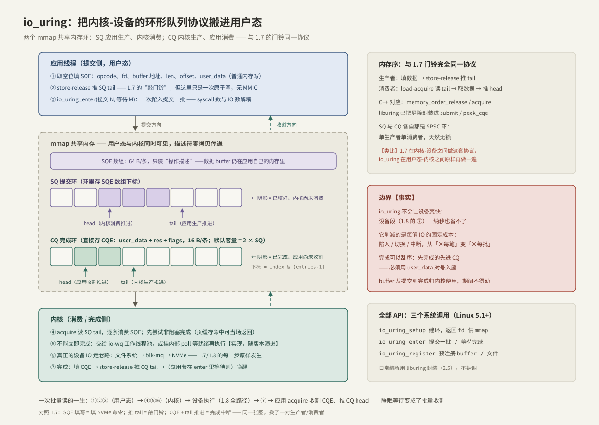

# SQ CQ 模型

> io_uring 把 1.7 里内核与设备之间的那套**环形队列 + 门铃协议**，原样搬到了用户态与内核之间：两个 mmap 共享内存环，批量提交、批量收割，把「每笔 IO 一次系统调用」变成「每批一次」。在 1.7 看懂了门铃，这一章只是旧协议搬了新家——换了一对生产者/消费者。

前置：[[1.8 一次 read write 全路径图]]（固定成本三件套：陷入、切换、中断）、[[1.7 块层与 blk-mq]]（环形队列与 release/acquire 门铃）。

---

## 1. 为什么需要它：同步路径的三堵墙

1.8 已经把账算清：一次 read 的固定成本是**一次陷入返回、两次上下文切换、一次中断**，与数据量无关，小 IO 时占比最高。想把 NVMe 喂饱，同步模型撞上三堵墙：

1. **阻塞**【事实】：同步 `pread` 每线程同时只有 1 个请求在途。1.7 的利特尔法则算过——QD=1 时几十微秒延迟的设备只能跑出一成不到的吞吐，几十路并行的 NVMe 大部分时间在空转；
2. **旧方案 Linux AIO 残废**【事实】：`io_submit` 只对 O_DIRECT 真正异步、提交路径每笔仍是一次系统调用、某些路径还会退化成同步执行——数据库之外几乎没人用得动；
3. **固定成本不摊薄**：就算开 32 个线程凑出 QD=32，三件套成本也是 ×32，还搭进去 32 个线程的栈与调度开销。

**io_uring 的回答**【事实】：Linux 5.1（2019，Jens Axboe）引入。核心动作只有一个——**让用户态和内核共享两个环形队列，描述符在共享内存里传递，系统调用只负责「通知」而不负责「搬运」**，于是 syscall 数与 IO 数解耦。

---

## 2. 全景：两个环、一块共享内存、三个系统调用

| 系统调用 | 职责 | 频率 |
| --- | --- | --- |
| `io_uring_setup` | 建环，返回一个 fd 供 mmap | 一次性 |
| `io_uring_enter` | 提交一批 / 等待完成（可同时做） | 每批一次（SQPOLL 下可为零，[[2.4 polling 与 registered buffers]]） |
| `io_uring_register` | 预注册 buffer / 文件等资源 | 一次性 |

`setup` 之后应用把三段区域 mmap 进自己的地址空间：**SQ 环、CQ 环、SQE 数组**（5.4 起 `IORING_FEAT_SINGLE_MMAP` 允许前两者合并成一次 mmap）。从此用户态和内核看着同一块内存说话：



**边界先立住**【事实】：io_uring 不会让设备变快——1.8 全路径图上的设备段一纳秒也省不了，文件系统、blk-mq、NVMe 驱动每一步照旧发生。它删改的只有两端：**①⑪ 的陷入被批量化，中段的「睡眠等待」变成「批量收割」**。指望它降低单笔裸延迟是用错了工具（低 QD 下它与同步路径延迟几乎相同）。

---

## 3. 关键数据结构

### 3.1 SQE：64 字节的操作描述

**SQE（Submission Queue Entry）只装描述，不装数据**——数据 buffer 仍在应用自己的内存里，SQE 里只有它的地址：

| 字段 | 含义 |
| --- | --- |
| `opcode` | 做什么：`READ` / `WRITE` / `FSYNC` / `RECV` / `ACCEPT` / `TIMEOUT`…… |
| `fd` | 对哪个文件/套接字做 |
| `addr` / `len` | 数据 buffer 的地址与长度 |
| `off` | 文件内偏移 |
| `user_data` | 64 位透传值：完成时原样带回，用来「对号入座」 |
| `flags` | 行为修饰：如 `IOSQE_IO_LINK`（串成依赖链）、`IOSQE_FIXED_FILE` |

### 3.2 CQE：16 字节的完成回执

```text
struct io_uring_cqe {
    __u64 user_data;   // 提交时塞的值，原样带回
    __s32 res;         // 结果：负值 = -errno；非负 = 字节数（read/write）
    __u32 flags;
};
```

**【事实】** `res` 是唯一的错误通道：异步世界里没有 errno 变量可查，**每个 CQE 的 res 都必须检查**（负值转成错误，非负还要防短读）。

### 3.3 环本身：head、tail、mask

两个环都是标准的**单生产者单消费者（SPSC）环形队列**——与多线程课上手写的无锁 ring buffer 同一形状：

- `head`：消费者推进；`tail`：生产者推进；空 = `head == tail`；
- 容量为 2 的幂，下标 = `index & (entries - 1)`；
- **一层间接**【实现】：SQ 环里存的不是 SQE 本身而是 **SQE 数组的下标**（允许应用按自己的方式管理 SQE 槽位）；CQE 只有 16 字节，CQ 环里直接存条目。

---

## 4. 谁生产、谁消费：门铃协议搬进用户态

| 环 | 生产者（推 tail） | 消费者（推 head） | 内容 |
| --- | --- | --- | --- |
| SQ | **应用**：填 SQE → store-release 推 tail | 内核：acquire 读 tail → 消费 | 待办单 |
| CQ | 内核：填 CQE → store-release 推 tail | **应用**：acquire 读 tail → 收割 → 推 head | 回执单 |

这正是 1.7 门铃协议的用户态复刻——**先发布数据、再发布信号，读者反向确认**：

- 应用填 SQE 是普通内存写，可能被重排；所以必须「填完 → release 推 tail」，内核看到新 tail 时 SQE 必定完整可见——≈ `store(memory_order_release)`；
- 应用收割时先 acquire 读 CQ tail 确认有新条目，再读 CQE 内容——≈ `load(memory_order_acquire)`。

**【事实】** 每个环各自只有一个生产者、一个消费者，天然无锁；liburing 已把这些屏障封装进 `io_uring_submit` / `io_uring_peek_cqe`，日常编程不用手写（但要知道它们在，[[2.5 liburing 基础用法]]）。区别只在：1.7 的门铃是 MMIO 写设备寄存器，这里的「门铃」是共享内存里的一次原子写，必要时再用 `io_uring_enter` 通知内核。

---

## 5. 端到端：一次批量读的一生

以「一次提交 8 个随机读」为例，对照上图：

1. **取空位**：应用从 SQE 数组拿 8 个空槽（`io_uring_get_sqe`，SQ 满则返回空——先提交腾位）；
2. **填单**：逐个填 opcode=READ、fd、buffer 地址、len、offset、user_data（全是普通内存写，零系统调用）；
3. **发布**：store-release 把 SQ tail 一次推进 8——「敲门铃」；
4. **陷入一次**：`io_uring_enter(提交 8, 等待 1)`——固定成本三件套从 ×8 变 ×1；
5. **内核消费**：acquire 读 tail，逐条取 SQE；**先尝试非阻塞完成**（页缓存命中可当场出结果）；
6. **异步执行**【实现】：不能立即完成的操作，交给内核的 io-wq 工作线程池，或挂内部 poll 等就绪再执行（细节随版本演进，无需记死）；真正的设备 IO 走 1.8 的老路：文件系统 → blk-mq → NVMe；
7. **完成**：每笔完成时内核填 CQE、store-release 推 CQ tail；若应用在 `enter` 里等待则唤醒；
8. **收割**：应用 acquire 读 CQ tail，把新 CQE 一口气读完（检查每个 res、按 user_data 对号），推 CQ head 归还槽位。

**与 1.8 对账**：11 步里被删改的只有两端——①⑪ 批量化、主等待点从「睡到 folio 解锁」变成「收割 CQ（可睡可轮询）」；②–⑩ 原样保留。

---

## 6. 状态与容量边界

| 状态 | 触发 | 后果与对策 |
| --- | --- | --- |
| SQ 满 | 填单快过提交 | `get_sqe` 拿不到空位；先 `submit` 腾位——SQ 只是提交暂存批，不是在途上限（[[2.3 iodepth 与提交完成路径]]） |
| CQ 满 | 收割慢过完成 | **overflow**：5.5 起内核把溢出 CQE 暂存在内部链表并置 `IORING_SQ_CQ_OVERFLOW` 标志，下次 enter 时补投递；5.5 之前直接丢弃计数。**纪律：及时收割** |
| 完成乱序 | 天然如此【事实】 | 先完成的先进 CQ，与提交顺序无关——一切关联靠 user_data；需要顺序就用 `IOSQE_IO_LINK` 显式串链 |

**【事实】** CQ 默认容量是 SQ 的 2 倍，正是为「在途 + 已完成未收割」留的缓冲。

---

## 7. Modern C++：用 RAII 包住环的生命周期

环持有 mmap 区域和 fd，生命周期必须确定——与 1.1 的 `UniqueFd` 同一纪律。日常编程用 liburing（裸系统调用的屏障与 mmap 细节它都封装好了）：

```cpp
#include <liburing.h>

#include <cstddef>
#include <span>
#include <stdexcept>
#include <system_error>
#include <vector>

// RAII：建环/销毁绑定对象生命周期；环不可复制（独占 mmap 与 fd）
class IoUring {
public:
    explicit IoUring(unsigned entries) {
        if (const int rc = ::io_uring_queue_init(entries, &ring_, 0); rc < 0)
            throw std::system_error{-rc, std::system_category(), "io_uring_queue_init"};
    }
    IoUring(const IoUring&) = delete;
    IoUring& operator=(const IoUring&) = delete;
    ~IoUring() { ::io_uring_queue_exit(&ring_); }

    io_uring* get() noexcept { return &ring_; }

private:
    io_uring ring_{};
};

// 一次批量读：提交 N 笔，收割 N 笔（buf 需容纳 N 个 4 KiB 分片，
// 且从提交到最后一个 CQE 收到之前必须保持存活——所有权已交给内核）
void batched_read(IoUring& uring, int fd, std::span<std::byte> buf,
                  const std::vector<off_t>& offsets) {
    for (std::size_t i = 0; i < offsets.size(); ++i) {
        io_uring_sqe* sqe = ::io_uring_get_sqe(uring.get());   // ① 取空位
        if (sqe == nullptr) throw std::runtime_error{"SQ 满：先 submit 腾位"};
        ::io_uring_prep_read(sqe, fd, buf.data() + i * 4096, 4096, offsets[i]);
        ::io_uring_sqe_set_data64(sqe, i);                     // ② user_data 对号
    }
    if (const int n = ::io_uring_submit(uring.get()); n < 0)   // ③ 推 tail + enter
        throw std::system_error{-n, std::system_category(), "io_uring_submit"};

    for (std::size_t done = 0; done < offsets.size(); ++done) {
        io_uring_cqe* cqe = nullptr;
        if (const int rc = ::io_uring_wait_cqe(uring.get(), &cqe); rc < 0)
            throw std::system_error{-rc, std::system_category(), "wait_cqe"};
        if (cqe->res < 0)                                      // ④ res 必查：负值 = -errno
            throw std::system_error{-cqe->res, std::system_category(), "read"};
        const auto idx = ::io_uring_cqe_get_data64(cqe);
        // ... 消费第 idx 个分片（cqe->res 是实际字节数，可能短读）
        ::io_uring_cqe_seen(uring.get(), cqe);                 // ⑤ 推 CQ head 归还槽位
    }
}
```

完整用法（超时、链式请求、multishot）在 [[2.5 liburing 基础用法]]；这里只需看清五步与第 5 节路径一一对应。

---

## 8. 陷阱与误区

> [!warning] 常见错误
> 1. **把 io_uring 当「更快的磁盘」**：它削减的是每笔 IO 的固定成本，设备段原封不动——低 QD 小并发下与同步路径几乎无差别，收益要靠深度与批量兑现（[[2.3 iodepth 与提交完成路径]]）。
> 2. **不检查 `cqe->res`**：异步世界没有 errno；负值是 -errno，read/write 非负还可能短读。漏查 = 静默丢错误。
> 3. **假设完成有序**：CQE 顺序与提交顺序无关；对号只能靠 user_data，要求顺序用 `IOSQE_IO_LINK`。
> 4. **提交后动 buffer**：从 SQE 提交到对应 CQE 收到之前，buffer 归内核使用——提前释放/复用是 use-after-free 级别的错误（栈上 buffer 尤其危险）。
> 5. **收割不及时**：CQ 打满进 overflow 慢路径；完成驱动的循环里「收割」永远优先于「提交」。

---

## 9. 关键结论

| 结论 | 性质 |
| --- | --- |
| io_uring = 两个 mmap 共享内存环 + 批量 enter：syscall 数与 IO 数解耦 | 事实 |
| SQ 应用生产内核消费，CQ 反之；各自 SPSC，release/acquire 发布——1.7 门铃的用户态复刻 | 事实 / 类比 |
| SQE 只传描述不传数据；CQE 的 res 是唯一错误通道，必检 | 事实 |
| 完成天然乱序，user_data 对号；顺序需求用 LINK 显式表达 | 事实 |
| 设备段省不掉：io_uring 削的是固定成本，收益靠深度与批量兑现 | 事实 / 取舍 |
| buffer 从提交到完成归内核，生命周期纪律与 RAII 同源 | 实践结论 |

---

## 关联知识

- [[1.7 块层与 blk-mq]] - 同一套环形队列 + 门铃协议的内核-设备版本
- [[1.8 一次 read write 全路径图]] - io_uring 在全路径图上删改的正是两端固定成本
- [[2.2 io_uring 与 epoll 对比]] - 完成通知与就绪通知的分野
- [[2.3 iodepth 与提交完成路径]] - 深度如何穿过这两个环落到设备
- [[2.5 liburing 基础用法]] - 本篇 API 的工程化用法
- [[3.2 Queue Pair 与 Doorbell]] - 协议的最底层出处：NVMe SQ/CQ
