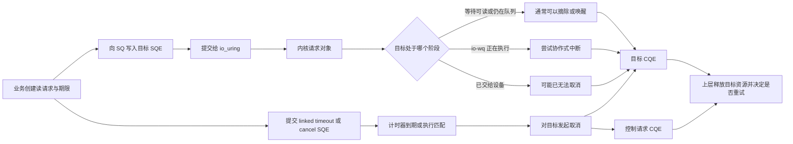
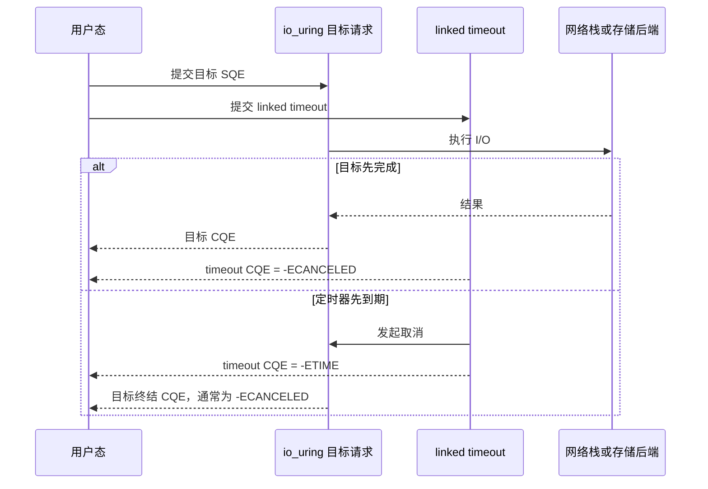
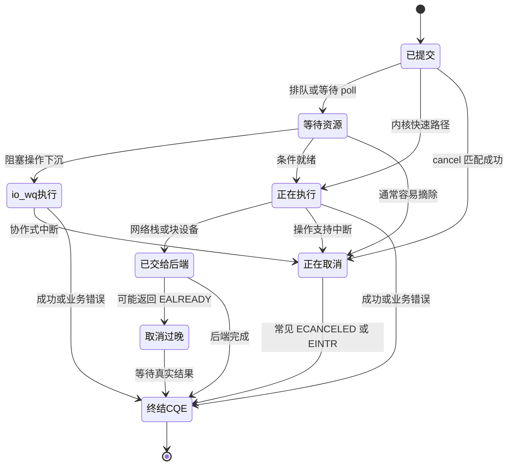

---
tags:
  - 高性能存储
  - io_uring
status: 已完成
---

# Timeout 与 Cancellation

> 超时是上层对“等到什么时候”的判断，取消是向内核提出“如果还来得及，请停止”的请求。两者都不能撤销已经发生的网络发送、磁盘写入或设备执行。

## 1. 先建立概念和边界

### 1.1 为什么异步 I/O 仍然需要超时

同步调用很容易表达超时：线程最多阻塞 100 ms，时间到了就返回。异步 I/O 不让提交线程一直等，因此“100 ms 后怎么办”必须成为另一项可被内核处理、可通过 CQE 观察的事件。

先区分三个名词：

- **超时（timeout）**：允许等待的时间长度，例如“从现在起最多等 100 ms”。
- **截止时间（deadline）**：允许等待到的绝对时刻，例如“单调时钟到达 350 s 时结束等待”。
- **取消（cancellation）**：请求内核停止某项尚未终结的操作。它是一次请求，不是强制终止指令。

超时到达只说明时间条件满足。若希望同时终止目标 I/O，还需要链接超时或显式取消。

### 1.2 四种机制不能混为一谈

| 机制 | 限制谁的等待 | 是否自动取消目标 I/O | 典型用途 |
|---|---|---:|---|
| `io_uring_wait_cqe_timeout()` 等等待侧超时 | 调用线程 | 否 | 事件循环定期醒来做维护工作 |
| `IORING_OP_TIMEOUT` | ring 中的一项定时请求 | 否 | 把定时事件放进 CQ |
| `IORING_OP_LINK_TIMEOUT` | 与它链接的请求或请求链 | 是，超时后发起取消 | 给一次读、连接或一段链设置时限 |
| `IORING_OP_ASYNC_CANCEL` | 被匹配到的未完成请求 | 是，但只保证尝试 | 用户撤销任务、连接关闭、进程退出前收尾 |

等待侧超时尤其容易被误解。`io_uring_wait_cqe_timeout()` 返回 `-ETIME` 时，只能推出“这次等待没有及时拿到 CQE”，不能推出先前提交的 I/O 已经停止。

> [!important] 一条判断原则
> 只有看到目标请求自己的终结 CQE，才可以结束该请求的生命周期并释放它使用的缓冲区、文件对象和上下文。取消请求的 CQE 不能代替目标 CQE。

### 1.3 取消不保证什么

取消不是事务回滚，也不是线程的强制终止：

- 已经复制到 TCP 发送缓冲区的字节不会因取消而“撤回”。
- 已经交给块设备的写请求可能继续执行。
- 已经完成的目标无法再取消，此时常见结果是 `-ENOENT`。
- 后端已经进入难以中断的阶段时，取消可能返回 `-EALREADY`。
- 关闭普通文件描述符不会自动取消仍引用该文件的 io_uring 请求；内核请求持有自己的文件引用。

这些边界决定了上层不能把“超时”直接翻译为“操作没有发生”。

## 2. 端到端路径

下面以“给一次读取设置 100 ms 时限”为例。目标读取和控制请求是两条独立的内核请求，它们最终各自通过 CQE 报告结果。



这条路径跨过三类边界：

1. **用户态边界**：业务把超时策略编码为 SQE，`user_data` 用来关联上下文。
2. **内核边界**：io_uring 查找目标请求，处理请求状态、计时器、轮询等待和 io-wq 工作项。
3. **设备或协议边界**：请求一旦进入网络栈、文件系统或块设备，能否中止取决于具体操作和当前阶段。

【事实】io_uring 可以控制请求的提交、匹配和完成通知，但不能让硬件支持本来不存在的回滚语义。

【前提】本文所说的“取消成功”指内核成功找到了请求并启动或完成了取消流程，不代表外部世界没有观察到任何副作用。

## 3. 独立 timeout SQE

### 3.1 基本语义

`io_uring_prep_timeout()` 准备一个 `IORING_OP_TIMEOUT`：

```cpp
__kernel_timespec timeout{
    .tv_sec = 0,
    .tv_nsec = 100'000'000,
};

io_uring_sqe* sqe = io_uring_get_sqe(&ring);
io_uring_prep_timeout(sqe, &timeout, 0, 0);
sqe->user_data = timer_id;
```

这里的 `count == 0` 表示只等待时间到期。常见完成结果如下：

| timeout CQE 的 `res` | 含义 |
|---:|---|
| `-ETIME` | 时间到期 |
| `0` | 设置了非零 `count`，在到期前已经观察到指定数量的 CQE |
| `-ECANCELED` | 定时器被移除或因链接关系而取消 |

独立 timeout 的作用是向 CQ 投递一个定时事件。它不会扫描并取消 ring 中的其他请求。

### 3.2 相对时间、绝对时间和时钟

默认使用 `CLOCK_MONOTONIC`，时间值默认是相对时长。加入 `IORING_TIMEOUT_ABS` 后，时间值改为绝对截止时间。

| 时钟 | 特性 | 合适场景 |
|---|---|---|
| `CLOCK_MONOTONIC` | 不受系统墙上时间校准影响，不计休眠时间 | 大多数请求时限 |
| `CLOCK_BOOTTIME` | 与单调时钟相似，但计算系统休眠时间 | 笔记本休眠期间也要到期的任务 |
| `CLOCK_REALTIME` | 表示墙上时间，可能被管理员或时间同步调整 | 与日历时刻绑定的截止时间 |

【取舍】相对超时写起来短，但请求在多个队列和重试阶段流转时，容易每一层都重新获得一份完整预算。端到端时限更适合使用同一个绝对 deadline，每一层只计算剩余时间。

### 3.3 `count` 不是“重试次数”

`count` 表示该 timeout 在到期前等待多少个 CQE 被投递到同一个完成队列。它适合让批处理循环表达“等够 N 个完成，或者时间到”。它与目标请求的完成次数、读写字节数和重试次数无关。

### 3.4 更新或移除定时器

`io_uring_prep_timeout_update()` 和 `io_uring_prep_timeout_remove()` 通过原 timeout SQE 的 `user_data` 查找定时器。控制请求仍会产生自己的 CQE，原定时器也会产生终结 CQE。

| 控制请求 `res` | 含义 |
|---:|---|
| `0` | 成功更新或移除 |
| `-ENOENT` | 没找到，常见原因是原定时器已经完成 |
| `-EALREADY` | 计时器已进入到期处理，来不及更新或移除 |
| `-EINVAL` | 标志或参数不受支持 |

更新和移除同样存在竞态，因此不能因控制 CQE 到达就忽略原 timeout 的 CQE。

## 4. linked timeout：给目标请求设置时限

### 4.1 结构和放置位置

linked timeout 必须紧跟在受保护请求之后，前一个请求带 `IOSQE_IO_LINK`：

```cpp
io_uring_sqe* read_sqe = io_uring_get_sqe(&ring);
io_uring_prep_read(read_sqe, fd, buffer.data(), buffer.size(), offset);
read_sqe->flags |= IOSQE_IO_LINK;
read_sqe->user_data = read_id;

io_uring_sqe* timeout_sqe = io_uring_get_sqe(&ring);
io_uring_prep_link_timeout(timeout_sqe, &timeout, 0);
timeout_sqe->user_data = timeout_id;
```

若保护的是一整条 linked chain，应把 linked timeout 放在这段链的最后。链接规则详见 [[2.9 Linked Operations]]。

### 4.2 两条正常路径



“通常”很重要。目标可能与计时器几乎同时完成，也可能已经进入不能及时取消的阶段。因此应用要按实际 CQE 处理，不能只按理想时序推断。

### 4.3 结果组合

| 目标 CQE | timeout CQE | 可作出的判断 |
|---:|---:|---|
| 成功或业务错误 | `-ECANCELED` | 目标先终结，计时器不再需要 |
| `-ECANCELED` 或 `-EINTR` | `-ETIME` | 时限先到，目标被中止 |
| 成功 | `-ETIME` | 边界竞态，时间到期与目标完成接近；副作用可能已经发生 |
| 其他错误 | `-ECANCELED` 或其他值 | 目标自身失败，按两条 CQE 分别解释 |

`IORING_TIMEOUT_ETIME_SUCCESS` 只改变 linked timeout 在链中的“是否算失败”判断，方便控制后续链接请求是否继续。它不把 timeout CQE 的 `res` 从 `-ETIME` 改成 `0`。

## 5. 显式 async cancel

### 5.1 默认按 `user_data` 匹配

最清晰的方式是给每个目标分配唯一的 64 位 ID，再用 `io_uring_prep_cancel64()` 取消：

```cpp
constexpr std::uint64_t request_id = 0x1001;
constexpr std::uint64_t cancel_id = 0x2001;

target_sqe->user_data = request_id;

io_uring_sqe* cancel_sqe = io_uring_get_sqe(&ring);
io_uring_prep_cancel64(cancel_sqe, request_id, 0);
cancel_sqe->user_data = cancel_id;
```

如果多个活跃请求复用同一个 `user_data`，默认只取消第一个匹配项。除非明确使用 `IORING_ASYNC_CANCEL_ALL`，否则复用 ID 会让结果难以解释。

### 5.2 其他匹配维度

新内核和新版 liburing 还支持按普通文件描述符、固定文件槽、操作码或任意请求匹配。相关标志包括 `IORING_ASYNC_CANCEL_FD`、`IORING_ASYNC_CANCEL_FD_FIXED`、`IORING_ASYNC_CANCEL_OP`、`IORING_ASYNC_CANCEL_ANY` 和 `IORING_ASYNC_CANCEL_ALL`。

【事实】这些标志是在不同内核版本中逐步加入的。部署前应结合 [[2.12 内核版本功能边界]] 做运行时能力检测，不能只看编译机头文件。

【取舍】按 `user_data` 取消最精确，也最容易维护资源所有权；按 fd 批量取消适合连接整体关闭，但会把同一 fd 上互不相关的请求一起纳入匹配。

### 5.3 cancel CQE 只报告“取消请求”的结果

| cancel CQE 的 `res` | 含义 | 后续动作 |
|---:|---|---|
| `0` | 成功取消一个匹配请求 | 继续等待目标终结 CQE |
| 正数 | 使用批量匹配时取消的请求数 | 继续逐个回收目标 CQE |
| `-ENOENT` | 没有匹配项，目标常已完成或 ID 错误 | 检查并等待目标 CQE |
| `-EALREADY` | 找到了目标，但它已进入难以取消的阶段 | 必须等待目标自然完成 |
| `-EINVAL` | 参数或标志不受支持 | 检查版本和调用方式 |

内核在处理 cancel SQE 时完成匹配和取消动作，但在异步编程模型中，cancel 请求与目标请求仍是两项独立操作。两条 CQE 的入队顺序不应被当作接口保证。

## 6. 请求状态变化与取消窗口

下面的状态图是便于推理的抽象模型，不是内核结构体字段的逐项映射。



SVG待定

取消窗口与后端有关：

- **等待 poll 的 socket I/O**：通常还没有搬运数据，较容易取消。
- **仍在 io-wq 队列中的工作**：工作项尚未开始时较容易摘除；工作线程已开始后取决于操作是否检查取消状态。参见 [[2.8 io-wq 与阻塞操作退化路径]]。
- **已经启动的直接磁盘 I/O**：设备请求可能已提交，通常比尚未就绪的网络 I/O 更难取消。
- **正在生成 CQE**：取消可能找不到目标或得到 `-EALREADY`，应用仍须回收目标 CQE。

## 7. 关键数据结构

### 7.1 用户态可见结构

| 数据 | 作用 | 生命周期要求 |
|---|---|---|
| `io_uring_sqe` | 描述目标、timeout 或 cancel 请求 | 提交后 SQE 槽可复用 |
| `__kernel_timespec` | 保存相对超时或绝对 deadline | 老内核可能要求保持到提交完成；按兼容性要求管理 |
| `user_data` | 把 CQE 关联回请求上下文，也是常用取消键 | 活跃请求之间应唯一 |
| `io_uring_cqe::res` | 目标结果或控制请求结果 | 必须结合 SQE 类型解释 |
| `io_uring_cqe::flags` | multishot 等附加状态 | `IORING_CQE_F_MORE` 决定是否还有后续 CQE |

`res == -ECANCELED` 只说明该请求以取消错误终结。它没有提供事务回滚证明。

### 7.2 内核中的概念对象

从当前 Linux 实现看，内核会维护请求对象、可取消请求的查找结构、timeout 列表、linked timeout 关系以及保护这些状态的锁。取消大致包含三步：

1. 按 `user_data`、fd 或其他条件查找请求。
2. 根据请求当前所在的队列或后端调用相应取消路径。
3. 为 cancel 请求和目标请求分别生成完成结果。

【实现边界】这些内部结构不是 UAPI，内核版本可以调整其布局和算法。应用应依赖 SQE/CQE 契约，不应依赖某个版本的锁、链表或哈希表细节。

## 8. Modern C++ 与 RAII 示例

下面用一个保持打开但不写入数据的非阻塞管道制造“读操作一直等待”。linked timeout 到期后，程序回收读请求和定时器两条 CQE。

```cpp
#include <liburing.h>

#include <array>
#include <cerrno>
#include <cstdint>
#include <iostream>
#include <optional>
#include <stdexcept>
#include <system_error>
#include <unistd.h>
#include <fcntl.h>

class UniqueFd {
public:
    UniqueFd() = default;
    explicit UniqueFd(int fd) noexcept : fd_(fd) {}

    ~UniqueFd() {
        reset();
    }

    UniqueFd(const UniqueFd&) = delete;
    UniqueFd& operator=(const UniqueFd&) = delete;

    UniqueFd(UniqueFd&& other) noexcept
        : fd_(other.release()) {}

    UniqueFd& operator=(UniqueFd&& other) noexcept {
        if (this != &other) {
            reset(other.release());
        }
        return *this;
    }

    [[nodiscard]] int get() const noexcept { return fd_; }

private:
    int release() noexcept {
        const int old = fd_;
        fd_ = -1;
        return old;
    }

    void reset(int new_fd = -1) noexcept {
        if (fd_ >= 0) {
            ::close(fd_);
        }
        fd_ = new_fd;
    }

    int fd_{-1};
};

class Pipe {
public:
    Pipe() {
        std::array<int, 2> fds{};
        if (::pipe2(fds.data(), O_CLOEXEC | O_NONBLOCK) < 0) {
            throw std::system_error(errno, std::generic_category(), "pipe2");
        }
        read_end_ = UniqueFd{fds[0]};
        write_end_ = UniqueFd{fds[1]};
    }

    [[nodiscard]] int read_end() const noexcept { return read_end_.get(); }

private:
    UniqueFd read_end_;
    UniqueFd write_end_;  // 保持打开且不写入，read 不会因 EOF 立即完成
};

class Ring {
public:
    explicit Ring(unsigned entries) {
        const int rc = io_uring_queue_init(entries, &ring_, 0);
        if (rc < 0) {
            throw std::system_error(-rc, std::generic_category(),
                                    "io_uring_queue_init");
        }
    }

    ~Ring() {
        io_uring_queue_exit(&ring_);
    }

    Ring(const Ring&) = delete;
    Ring& operator=(const Ring&) = delete;

    io_uring* get() noexcept { return &ring_; }

private:
    io_uring ring_{};
};

class SeenCqe {
public:
    SeenCqe(io_uring* ring, io_uring_cqe* cqe) noexcept
        : ring_(ring), cqe_(cqe) {}

    ~SeenCqe() {
        io_uring_cqe_seen(ring_, cqe_);
    }

    SeenCqe(const SeenCqe&) = delete;
    SeenCqe& operator=(const SeenCqe&) = delete;

private:
    io_uring* ring_;
    io_uring_cqe* cqe_;
};

struct OperationContext {
    std::uint64_t value{};
    __kernel_timespec timeout{
        .tv_sec = 0,
        .tv_nsec = 200'000'000,
    };
};

constexpr std::uint64_t kReadId = 0x1001;
constexpr std::uint64_t kTimeoutId = 0x1002;

void run(Ring& owner, const Pipe& pipe, OperationContext& context) {
    io_uring* ring = owner.get();

    io_uring_sqe* read_sqe = io_uring_get_sqe(ring);
    io_uring_sqe* timeout_sqe = io_uring_get_sqe(ring);
    if (read_sqe == nullptr || timeout_sqe == nullptr) {
        throw std::runtime_error("SQ capacity is insufficient");
    }

    io_uring_prep_read(read_sqe, pipe.read_end(), &context.value,
                       sizeof(context.value), 0);
    read_sqe->flags |= IOSQE_IO_LINK;
    read_sqe->user_data = kReadId;

    io_uring_prep_link_timeout(timeout_sqe, &context.timeout, 0);
    timeout_sqe->user_data = kTimeoutId;

    const int submitted = io_uring_submit(ring);
    if (submitted != 2) {
        if (submitted < 0) {
            throw std::system_error(-submitted, std::generic_category(),
                                    "io_uring_submit");
        }
        throw std::runtime_error("partial submission");
    }

    std::optional<int> read_result;
    std::optional<int> timeout_result;

    for (int i = 0; i < 2; ++i) {
        io_uring_cqe* cqe = nullptr;
        const int rc = io_uring_wait_cqe(ring, &cqe);
        if (rc < 0) {
            throw std::system_error(-rc, std::generic_category(),
                                    "io_uring_wait_cqe");
        }

        SeenCqe seen{ring, cqe};
        if (cqe->user_data == kReadId) {
            read_result = cqe->res;
        } else if (cqe->user_data == kTimeoutId) {
            timeout_result = cqe->res;
        } else {
            throw std::runtime_error("unexpected user_data");
        }
    }

    std::cout << "read res = " << *read_result
              << ", timeout res = " << *timeout_result << '\n';
}

int main() try {
    // 声明顺序保证异常路径中 Ring 先析构，context 最后析构。
    OperationContext context;
    Pipe pipe;
    Ring ring{8};
    run(ring, pipe, context);
} catch (const std::exception& ex) {
    std::cerr << ex.what() << '\n';
    return 1;
}
```

Linux 上可用下列命令编译：

```bash
g++ -std=c++20 -Wall -Wextra -Wpedantic linked_timeout.cpp -luring -o linked_timeout
./linked_timeout
```

常见输出是读请求 `-ECANCELED`，timeout 请求 `-ETIME`。具体负数对应的符号名称应使用 `strerror(-res)` 或错误码表解释，不要把负数常量写死成跨平台结论。

这个例子有两个值得保留的 RAII 约束：

- `SeenCqe` 确保每条已取得的 CQE 都调用 `io_uring_cqe_seen()`。
- `OperationContext` 比 `Ring` 先构造、后析构，使缓冲区和 `__kernel_timespec` 在 ring 清理期间仍然有效。

## 9. 两条 CQE 决定资源生命周期

考虑显式取消读取：

```text
目标请求 T  ----> 最终产生 T 的 CQE
取消请求 C  ----> 最终产生 C 的 CQE
```

应用通常需要维护下面的上下文，而不是只保存一个“已取消”布尔值：

```cpp
enum class RequestState {
    active,
    cancel_requested,
    terminal,
};

struct RequestContext {
    std::uint64_t target_id;
    std::optional<std::uint64_t> cancel_id;
    RequestState state{RequestState::active};
    std::vector<std::byte> buffer;
    bool target_cqe_seen{false};
    bool cancel_cqe_seen{false};
};
```

处理原则：

1. 提交 cancel 后把状态改为 `cancel_requested`，但不释放目标资源。
2. cancel CQE 只记录取消尝试的结果。
3. 目标终结 CQE 到达后，才能把状态改为 `terminal`。
4. 处理并标记 CQE 后，再回收上下文和缓冲区。

对于 multishot 请求，最终目标 CQE 通常是 `-ECANCELED`，并且不再带 `IORING_CQE_F_MORE`。只要 `F_MORE` 仍存在，就不能释放长期请求的上下文。参见 [[2.11 Multishot 与 Provided Buffer Ring]]。

## 10. 网络、文件系统与硬件边界

### 10.1 网络 I/O

- `recv` 在等待数据时取消，通常不会消费未来才到达的字节；字节仍留在 socket 接收路径中，后续读取可以取得。
- `send` 成功写入部分字节后再超时，已进入协议栈的字节可能继续发送。应用必须记录实际完成字节数。
- TCP 是字节流，没有“撤销一条消息”的语义。若业务消息可能部分发送，协议层需要长度字段、请求 ID 和幂等处理。

### 10.2 缓冲文件 I/O

普通文件读写可能命中页缓存，也可能因缺页、回写或文件系统操作进入 io-wq。取消是否及时取决于请求当时处在哪个阶段。

### 10.3 直接 I/O 与块设备

直接 I/O 常绕过页缓存的数据复制路径，但请求仍会进入文件系统和块层。设备命令已经发出后，内核未必能把它撤回。即使用户态先收到超时，也必须保持 DMA 相关缓冲区有效，直到目标 CQE 终结。

### 10.4 写入与持久化不是同一件事

写请求成功通常只说明相应写入阶段完成，不等于数据已经断电持久化；这还取决于 `fsync`、设备缓存和文件系统语义。反过来，`fsync` 等待超时也不能证明数据没有落盘。超时表达的是观测边界，不是持久性证明。

## 11. 重试策略必须继承原 deadline

错误做法是每次重试都重新设置 100 ms：

```text
排队 80 ms + 第一次尝试 100 ms + 第二次尝试 100 ms + ...
```

这会让一次业务请求远超原预算。更合适的做法是：

```cpp
using Clock = std::chrono::steady_clock;

const auto deadline = Clock::now() + std::chrono::milliseconds{100};

while (can_retry()) {
    const auto now = Clock::now();
    if (now >= deadline) {
        break;
    }

    const auto remaining = deadline - now;
    submit_attempt_with_timeout(remaining);
}
```

是否重试还取决于副作用：

| 操作 | 超时后直接重试的风险 | 上层措施 |
|---|---|---|
| 只读查询 | 可能重复占用资源 | 继承 deadline，限制次数 |
| TCP 发送 | 可能重复发送部分消息 | 消息 ID、长度、接收端去重 |
| 文件追加 | 可能重复追加 | 幂等日志格式或事务记录 |
| 覆盖写固定区域 | 可能出现新旧操作竞态 | 序列号、版本校验、等待原请求终结 |

## 12. 关闭与停机顺序

`io_uring_queue_exit()` 会尝试取消 ring 中尚未完成的请求，但生产程序通常仍应显式收尾，以便处理结果并释放业务资源：

1. 停止接受新请求。
2. 给长期或 multishot 请求提交 cancel。
3. 继续消费 CQ，直到所有目标请求都得到终结 CQE。
4. 归还 provided buffer、固定缓冲区和业务上下文。
5. 最后销毁 ring。

若事件循环已经停掉，可以评估同步取消接口 `io_uring_register_sync_cancel()`。它会阻塞调用线程，适合停机或异常清理，不适合放进高吞吐事件循环的常规热路径。

## 13. 故障案例：看到 cancel 成功就释放缓冲区

### 13.1 错误过程

1. 请求 T 使用 `buffer` 做异步读取。
2. 应用提交取消请求 C。
3. C 的 CQE 返回 `0`。
4. 应用立即销毁 `buffer`。
5. T 的取消完成路径随后才访问请求上下文或结束 DMA 映射。

结果可能是 use-after-free、内存破坏，或者在压力下偶发崩溃。

### 13.2 根因

应用把“取消请求成功”误当成“目标请求的所有内核引用都已消失”。真正控制资源释放的是目标终结 CQE。

### 13.3 修复

- 目标上下文以请求状态机或引用计数管理。
- cancel CQE 与目标 CQE 分开记账。
- 只在目标终结且 CQE 已处理后释放缓冲区。
- 固定缓冲区、provided buffer 和普通用户缓冲区遵守同一条生命周期原则。

## 14. 可复现实验

### 14.1 linked timeout 边界实验

固定 timeout 为 100 ms，另一个线程延迟后向管道写 1 字节：

| 写入延迟 | 常见结果 | 观察重点 |
|---:|---|---|
| 50 ms | 读成功，timeout `-ECANCELED` | 正常完成路径 |
| 250 ms | 读 `-ECANCELED`，timeout `-ETIME` | 超时取消路径 |
| 95 至 105 ms 随机抖动 | 两种组合都可能出现 | 不要假设 CQE 顺序 |

每轮记录两个 `user_data`、两个 `res` 和完成时间，不要只打印 timeout 结果。

### 14.2 显式取消竞态实验

1. 提交一个等待管道数据的 read。
2. 分别在 0 ms、1 ms、10 ms 后提交 `io_uring_prep_cancel64()`。
3. 同时改变写线程的延迟。
4. 统计 cancel 的 `0`、`-ENOENT`、`-EALREADY`，再与目标 CQE 配对。

实验应验证的是语义组合，而不是追求某一个固定顺序。

## 15. 观测与排障

至少记录以下字段：

- 业务请求 ID、目标 `user_data`、cancel/timeout `user_data`。
- 提交时刻、绝对 deadline、实际完成时刻。
- 目标 CQE 的 `res` 与 `flags`。
- cancel 或 timeout CQE 的 `res`。
- 操作类型、fd 或固定文件槽、请求字节数和实际完成字节数。
- 是否经过 io-wq，是否为 direct I/O，是否是 multishot。

排障时先问三件事：

1. 超时的是线程等待、定时器，还是目标 I/O？
2. 当前日志记录的是控制请求 CQE，还是目标请求 CQE？
3. 目标是否可能已经产生网络、文件系统或设备副作用？

## 16. 常见误区

### 16.1 “wait 超时，所以 I/O 已取消”

错误。等待函数只限制调用线程等待 CQE 的时间。

### 16.2 “cancel 返回 0，可以立刻复用缓冲区”

错误。继续等待目标终结 CQE。

### 16.3 “关闭 fd 会取消旧请求”

错误。io_uring 请求可能持有文件引用；fd 数字还可能被进程复用为另一个文件。

### 16.4 “超时写一定没有写入”

错误。超时与设备写入、页缓存修改、TCP 发送都可能发生竞态。

### 16.5 “`user_data` 只是日志字段，可以重复”

错误。它既是完成关联键，也是最常用的取消匹配键。活跃请求复用会引入歧义。

### 16.6 “只处理 linked timeout 的 CQE 就够了”

错误。目标与 timeout 都有自己的 CQE，两者都必须消费。

## 17. 实践结论

1. 先确定需要的是等待侧超时、独立定时事件、linked timeout，还是显式取消。
2. timeout 到期是策略事件，cancel 是尽力而为的控制请求；二者都不是回滚。
3. 每个活跃目标使用唯一 `user_data`，控制 CQE和目标 CQE 分开关联。
4. 缓冲区和请求上下文至少存活到目标终结 CQE 被处理。
5. 对写入和发送，超时后先判断可能发生的副作用，再决定是否重试。
6. 跨队列和重试传递同一个绝对 deadline，避免时间预算被逐层重置。
7. 停机时先停止提交，再取消长期请求并排空 CQ，最后销毁 ring。
8. 所有取消能力都受操作类型、执行阶段、内核版本和后端支持限制。

## 18. 关联笔记

- [[2.1 SQ CQ 模型]]：理解 SQE、CQE 与 `user_data`。
- [[2.5 liburing 基础用法]]：提交和回收 CQE 的基本接口。
- [[2.8 io-wq 与阻塞操作退化路径]]：理解取消处于排队与执行阶段的差别。
- [[2.9 Linked Operations]]：理解 linked timeout 所依赖的链式语义。
- [[2.11 Multishot 与 Provided Buffer Ring]]：理解长期请求取消后的最终 CQE。
- [[2.12 内核版本功能边界]]：处理不同内核版本的取消标志。

## 19. 参考资料

- [liburing: io_uring_prep_timeout(3)](https://man7.org/linux/man-pages/man3/io_uring_prep_timeout.3.html)
- [liburing: io_uring_prep_link_timeout(3)](https://man7.org/linux/man-pages/man3/io_uring_prep_link_timeout.3.html)
- [liburing: io_uring_prep_timeout_remove(3)](https://man7.org/linux/man-pages/man3/io_uring_prep_timeout_remove.3.html)
- [liburing: io_uring_prep_cancel64(3)](https://man7.org/linux/man-pages/man3/io_uring_prep_cancel64.3.html)
- [io_uring cancellation overview](https://man7.org/linux/man-pages/man7/io_uring_cancelation.7.html)
- [Linux kernel: io_uring/timeout.c](https://github.com/torvalds/linux/blob/master/io_uring/timeout.c)
- [Linux kernel: io_uring/cancel.c](https://github.com/torvalds/linux/blob/master/io_uring/cancel.c)
