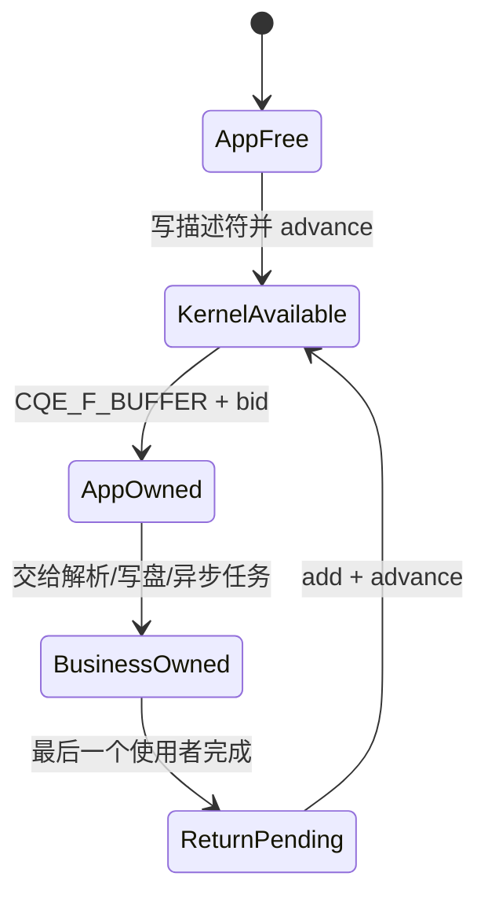

---
tags:
  - 高性能存储
  - io_uring
  - Linux网络编程
status: 已完成
---

# Multishot 与 Provided Buffer Ring

> **Multishot 减少“完成一次就重提一次”的 SQE 流量，Provided Buffer Ring（pbuf ring）减少“每次接收前先指定一块 buffer”的管理成本。两者组合后，一份长期存活的接收请求可以连续产生多个 CQE，每个 CQE再告诉应用本次实际使用了哪块 buffer。**

前置：[[2.1 SQ CQ 模型]]、[[2.4 polling 与 registered buffers]]；版本与能力探测见 [[2.12 内核版本功能边界]]。

---

## 1. 先把五个术语分清

### 1.1 Multishot

**Multishot（多次完成请求）**是“一次提交一个 SQE，该请求在存活期间产生多个 CQE”。典型操作是：

- `multishot accept`：同一个 accept 请求连续接收多个新连接；
- `multishot recv`：同一个 recv 请求连续接收多批数据。

它不是“提交了多个并行请求”。内核仍跟踪的是**一个长期请求**，只是它能多次报告完成。某个 CQE 是否意味着请求还活着，必须检查：

```cpp
const bool request_still_active = (cqe->flags & IORING_CQE_F_MORE) != 0;
```

- 有 `IORING_CQE_F_MORE`：当前 CQE 之后，请求仍可能继续产生 CQE；
- 没有 `IORING_CQE_F_MORE`：这是该请求的最后一个 CQE，之后要继续服务就必须重新提交。

> [!warning] 不能仅凭 `cqe->res`
> `res > 0`、`res == 0` 或 `res < 0`描述的是**本次完成结果**，不等价于请求生命周期。请求是否仍活跃只看 `IORING_CQE_F_MORE`。即使某类操作通常在错误后终止，也不要把这种经验写成生命周期协议。

### 1.2 Provided buffer

**Provided buffer（提供缓冲区）**是应用预先交给内核管理、供 buffer selection 操作按需挑选的用户态内存。提交接收 SQE 时，应用不绑定某一块具体 buffer，而是设置 `IOSQE_BUFFER_SELECT` 并给出 buffer group；内核等到真正有数据时再从组中取一块。

它解决的是：若同时挂着大量接收请求，不必提前为每个在途请求独占一块可能长期闲置的内存。

### 1.3 Buffer group、`bgid` 与 `bid`

- **buffer group**：可供同一类请求选择的一组 buffer；
- **`bgid`（buffer group ID）**：组编号，写入 SQE 的 `buf_group`；
- **`bid`（buffer ID）**：组内 buffer 的编号，由应用分配，用来把 CQE 映射回自己的内存对象。

`bgid` 选择“去哪个池拿”，`bid` 回答“本次拿了池里的哪一块”。`bid` 不应直接当成任意数组下标，除非应用明确保证它处于数组范围且映射规则一致。

### 1.4 Provided buffers 与 pbuf ring

二者不是互斥概念，而是“语义”与“供给机制”的关系：

| 机制 | 应用怎样把 buffer 交给内核 | 归还成本 | 特点 |
| --- | --- | --- | --- |
| 旧式 provided buffers | 提交 `IORING_OP_PROVIDE_BUFFERS`，移除用 `IORING_OP_REMOVE_BUFFERS` | 归还通常需要再提交 SQE | 兼容较早内核，控制路径也经过 SQ/CQ |
| Provided Buffer Ring（pbuf ring） | 注册一块共享描述符环，应用写描述符并推进 tail | 稳态归还不需要 SQE/syscall | 更适合高频接收，但要严格遵守环约束和内存顺序 |

pbuf ring 装的是 `io_uring_buf` 描述符；描述符指向的数据区仍是应用内存。内核取走一个描述符后，该 buffer 暂时离开可用池，直到应用把它重新放回 ring。

### 1.5 与 registered/fixed buffer 的区别

| 维度 | Provided buffer / pbuf ring | Registered/fixed buffer |
| --- | --- | --- |
| 主要问题 | 接收时由内核从池中选择哪一块 | 预先注册页，减少每笔映射/pin 等簿记 |
| SQE 是否指定具体 buffer | 不指定地址；给 `bgid` | 指定地址/注册表索引，例如 `read_fixed` |
| 完成时如何识别 | CQE 携带 `bid` | 应用提交时已经知道 buffer |
| 典型场景 | socket 接收、消息大小/到达时间未知 | O_DIRECT、稳定复用的存储 IO 区域 |
| 是否天然零拷贝 | **不是** | **也不是“注册即零拷贝”** |

> [!important] 两个禁止等号
> **pbuf ring ≠ fixed buffers，pbuf ring ≠ 零拷贝。** 常规 `recv` 仍会把数据从内核网络栈复制到被选中的用户 buffer；pbuf ring 优化的是选择、供给和回收协议。

---

## 2. 端到端路径：应用 → SQE → 数据就绪 → CQE → 归还

以 `multishot recv + pbuf ring` 为主线：

1. **应用建池**：分配 N 块数据内存，为每块指定 `bid`；注册 `bgid` 对应的 pbuf ring，把 N 个描述符写入 ring，再发布 tail。
2. **应用填 SQE**：准备一个 multishot recv SQE，设置 `IOSQE_BUFFER_SELECT`，并令 `sqe->buf_group = bgid`。multishot recv 使用 buffer selection 时不把某块实际数据地址绑死在 SQE 上。
3. **提交 SQE**：内核消费 SQE并保留这个长期请求。此时不是 N 个并行 recv，只是一个可多次完成的请求。
4. **等待数据/就绪**：socket 尚无数据时请求等待；数据到达并满足该操作的完成条件后，内核才需要一块接收 buffer。对 multishot poll，完成表示被监视 fd 出现相应 readiness；不要把 regular file 的“通常总是 ready”与 socket readiness 混为一谈。
5. **内核选 buffer**：内核从 `bgid` 对应的可用 ring 中消费一个描述符，把数据写入它指向的内存。
6. **内核发布 CQE**：`cqe->res` 给出本次字节数或负错误码；若选择了 provided buffer，flags 含 `IORING_CQE_F_BUFFER`，其中高位编码 `bid`；若长期请求仍活跃，还含 `IORING_CQE_F_MORE`。
7. **应用消费**：应用先保存 `res/flags/user_data`，再推进 CQ head。根据 `bid` 找到 buffer，只把 `res` 指定的有效字节交给解析、校验或业务层。
8. **业务释放所有权**：只有当日志、协议解析、异步任务、DMA/写盘等所有使用者都不再访问该内存后，buffer 才可回收。
9. **归还 ring**：应用把同一地址、长度与 `bid` 重新写入 pbuf ring 的空槽，最后以发布语义推进 tail。内核之后才能再次选择它。

其中 SQE 和 CQE 管的是**请求与完成**，pbuf ring 管的是**空闲 buffer 所有权**。三个环不能混成一个概念。

![[图片/SVG/8_2_11_1.svg|900]]

*图 2-1：SQ / CQ / pbuf 三环与 multishot recv 端到端路径；`F_MORE`、`F_BUFFER` 与 `res` 相互独立。*

---

## 3. CQE 必须怎样解码

```cpp
const unsigned flags = cqe->flags;
const bool has_buffer = (flags & IORING_CQE_F_BUFFER) != 0;
const bool more = (flags & IORING_CQE_F_MORE) != 0;

if (has_buffer) {
    const unsigned bid = flags >> IORING_CQE_BUFFER_SHIFT;
    // 使用 bid 找回对应 buffer；检查范围后再访问。
}
```

关键规则：

1. **先检查 `IORING_CQE_F_BUFFER`，再解码 `bid`**；没有该标志时，高位不能解释为 buffer ID。
2. buffer ID 的编码位置由 `IORING_CQE_BUFFER_SHIFT` 定义，不要手写魔数；当前 UAPI 中常见定义为 16，但代码应使用宏。
3. `IORING_CQE_F_BUFFER` 回答“本 CQE 获得了一块 buffer”；`IORING_CQE_F_MORE` 回答“请求是否继续存活”，两者相互独立。
4. `cqe->res < 0` 是 `-errno`，例如 `-ENOBUFS`；liburing 不会自动替你设置 `errno`。
5. 若 flags 表明本次确实分配了 buffer，无论业务成功与否，都必须沿统一所有权路径处理并最终归还，不能因错误分支漏掉。

### 3.1 Buffer 耗尽

当 `bgid` 中没有可选 buffer 时，buffer-selection 操作的典型结果是 `cqe->res == -ENOBUFS`。但**具体操作是否终止 multishot、是否存在继续/重启相关能力，以及行为在哪个内核版本可用，必须按 opcode 和运行内核核实**。稳妥处理是：

1. 记录 starvation 计数与当时“业务持有 buffer 数”；
2. 检查 `IORING_CQE_F_MORE`，不要猜请求是否还活着；
3. 立即归还已完成业务的 buffer；
4. 若没有 `F_MORE`，补提接收请求；
5. 持续耗尽时增加池容量、缩短业务持有时间，或引入背压，而不是无限扩池。

---

## 4. pbuf ring 的关键数据结构与约束

概念化结构如下；真实字段以系统 `<linux/io_uring.h>` 和 liburing 为准：

```cpp
struct io_uring_buf {
    __u64 addr;
    __u32 len;
    __u16 bid;
    __u16 resv;
};

struct io_uring_buf_ring {
    union {
        struct {
            __u64 resv1;
            __u32 resv2;
            __u16 resv3;
            __u16 tail;
        };
        struct io_uring_buf bufs[0];
    };
};
```

liburing 常用接口：

```cpp
io_uring_buf_ring* io_uring_setup_buf_ring(
    io_uring* ring, unsigned entries, int bgid,
    unsigned flags, int* ret);

void io_uring_buf_ring_add(
    io_uring_buf_ring* br, void* addr, unsigned len,
    unsigned bid, int mask, int buf_offset);

void io_uring_buf_ring_advance(io_uring_buf_ring* br, int count);
```

约束与含义：

- `entries` 必须满足内核/liburing 对 buffer ring 的约束；常规 pbuf ring 使用**大于 0 的 2 的幂**，这样 `mask = entries - 1` 才能安全做环绕。
- `entries`、`mask` 与实际注册内存大小必须一致，不能用 SQ/CQ 的 mask 代替 pbuf ring mask。
- `buf_offset` 是相对当前 tail 的槽位偏移。批量添加 N 个描述符时使用 `0..N-1`，全部写完后一次 `advance(N)`。
- `bgid` 必须与接收 SQE 的 `buf_group` 一致；同一 ring 实例内不要重复注册同一 `bgid`。
- `bid` 是应用定义的 16 位标识。最简单的实现令 `bid ∈ [0, entries)`，并以它索引固定大小的 buffer 数组。
- buffer 的地址和长度在内核可能选择它期间必须有效；描述符所在 ring 内存也必须活到解注册完成。

### 4.1 内存顺序：为什么要“先写描述符，后推进 tail”

pbuf ring 是内核与用户态共享的生产者—消费者结构：

```text
应用：写 addr/len/bid → release 发布 tail
内核：acquire 观察 tail → 读取描述符 → 消费 buffer
```

若先推进 tail 再写描述符，内核可能看到“新 buffer 已到货”，却读到旧地址或半写入长度。应优先使用 `io_uring_buf_ring_add()` 与 `io_uring_buf_ring_advance()`，不要自行用普通赋值重写发布协议。

CQ 同理：内核先写 CQE 内容，再发布 CQ tail；liburing 的 `io_uring_wait_cqe()`/`io_uring_peek_cqe()`封装了观察顺序。应用必须在 `io_uring_cqe_seen()` 之前复制仍需读取的 CQE 字段。

> [!warning] “用了原子类型”不等于并发协议正确
> release/acquire 只保证发布顺序，不自动解决多个应用线程争抢同一个槽位、重复归还同一 `bid` 或同时推进 CQ head。逻辑所有权仍需单独设计。

![[图片/SVG/8_2_11_2.svg|900]]

*图 4-1：pbuf ring 描述符环与数据区布局；正确/错误的 release-acquire 发布顺序。*

---

## 5. 所有权状态机

每块数据 buffer 任一时刻只能处于一个主要状态：



![[图片/SVG/8_2_11_3.svg|900]]

*图 5-1：buffer 所有权状态机、三条不变量，以及单 CQ owner + lease + MPSC 归还模型。*

三条不变量：

1. **已发布给内核的 buffer，应用不得同时写入。**
2. **收到 `bid` 不等于可以立刻归还；必须等业务不再使用。** 若业务异步化，应移动一个带归还回调的 RAII handle，而不是传裸指针后马上回收。
3. **每次内核交付只能归还一次。** 重复归还同一 buffer 会让内核未来可能把同一地址同时交给两次接收，造成静默数据覆盖。

一种适合工程实现的抽象是 `BufferLease{pool, bid, span}`：它不可复制、可以移动，析构时把 buffer 放入待归还队列；真正向 pbuf ring 发布由单一 ring-owner 线程批量完成。这样“最后使用者结束”和“共享环单生产者”可以同时满足。

---

## 6. 多消费者与内存生命周期

### 6.1 推荐模型：单 CQ 消费者 + 业务线程池

- 一个 event-loop 线程独占 CQ head、pbuf ring tail 与请求状态；
- 它把 `BufferLease` 移交给业务线程；
- 业务结束后把 `bid` 投递回 event-loop 的 MPSC 回收队列；
- event-loop 批量执行 `buf_ring_add + advance`。

这符合 [[3.Linux/13. IO复用/13.6 Reactor模式与EventLoop|Reactor 与 EventLoop]] 的“一个 loop 管一组 IO 状态”思路，也最容易证明不会重复消费 CQE或重复归还。

### 6.2 若必须多线程消费

需要显式解决：

- 谁原子地认领 CQE、谁推进 CQ head；
- 谁独占或同步 pbuf ring 的生产位置；
- `bid → buffer` 映射是否在所有线程中稳定；
- teardown 如何等待所有业务 lease 释放；
- request `user_data` 指向的上下文是否仍存活。

最简单的正确方案通常是给 CQ 消费与归还路径加锁，或退回单 owner 模型。不要假设“共享内存环”天然就是 MPMC 队列。

### 6.3 生命周期边界

数据区、pbuf ring 描述符内存、`io_uring` 实例和 `user_data` 上下文必须覆盖所有可能的 CQE与业务引用。安全析构顺序是：

1. 停止接收新业务任务；
2. 对长期请求提交 cancel，并收割到其**无 `F_MORE` 的终态 CQE**；
3. 等待所有 `BufferLease`/业务任务归还或明确放弃；
4. 解注册并释放 pbuf ring；
5. 关闭连接 fd；
6. 最后 `io_uring_queue_exit()`。

关闭 fd 不能替代完整的 cancel + drain 协议：异步请求持有的文件引用、已经排队的 CQE以及用户态上下文生命周期都需要处理。进程退出可以让内核最终清理资源，但这不是服务热重启或对象析构可依赖的工程协议。

---

## 7. Multishot 操作边界与取舍

### 7.1 常见能力

- **multishot accept**：一个 SQE连续产出多个已连接 fd；每个 `res >= 0` 都是一个新 fd，应用必须接管并最终关闭。某次完成无 `F_MORE` 后再重提。
- **multishot recv**：一个 SQE连续产出多批接收数据，通常与 provided buffers 配合；连接关闭、错误、取消或能力边界都可能令请求终止。
- **recvmsg、poll 等**：部分新内核/新 liburing 支持相应 multishot 变体或附加语义，但 opcode、flags、返回元数据和终止条件并不完全相同。本篇只建立共同模型，不把 recv 的规则外推给它们。

multishot accept 与 pbuf ring 解决不同问题：前者交付的是新 fd，不选择数据 buffer；新连接上的接收请求才会使用 buffer group。

### 7.2 版本信息要保守

主线能力大致出现在：multishot poll 较早进入 5.x；multishot accept 与 ring-mapped provided buffer ring 在 5.19 前后可用；multishot recv 在 6.0 前后进入。后续内核仍在补充 multishot recvmsg、增量 buffer、错误后的继续行为等能力。

**发行版回移补丁、liburing 头文件与正在运行的内核可能不一致。** 因此这些版本号只用于建立时间线，不能代替探测。生产代码应按 [[2.12 内核版本功能边界]] 的方法执行 opcode probe、注册/提交试运行，并为 `-EINVAL`、`-EOPNOTSUPP` 等准备 one-shot/旧式 provided-buffer 降级路径。

### 7.3 买到什么、付出什么

| 方案 | 收益 | 成本/限制 |
| --- | --- | --- |
| one-shot recv | 状态机直观、兼容广 | 每次完成后都需获取并提交新 SQE |
| multishot recv | 降低 SQE 数和提交压力 | 长期请求的取消、终态和 `F_MORE` 状态更复杂 |
| 旧式 provide buffers | 兼容较早内核 | 供给/归还占用 SQE/CQE，稳态控制流量大 |
| pbuf ring | 用户态批量归还，少 SQE、少 syscall | 共享环约束、并发所有权和 teardown 更难 |

CQE 不会因为 multishot 消失：每次实际完成仍需要一个 CQE。multishot 优化的是**请求提交侧**，pbuf ring 优化的是**buffer 供给侧**。

![[图片/SVG/8_2_11_4.svg|900]]

*图 7-1：one-shot vs multishot 的 SQE/CQE 流量对照，以及 provide_buffers vs pbuf ring 控制路径与实验指标。*

---

## 8. Modern C++ 最小示例：multishot recv + pbuf ring

示例用普通阻塞 `accept()` 建立一个 loopback TCP 连接，把主题集中在接收路径。要求 Linux、支持相应能力的内核，以及带 `io_uring_setup_buf_ring()`/`io_uring_prep_recv_multishot()` 的 liburing 开发包。

```cpp
#include <liburing.h>

#include <arpa/inet.h>
#include <netinet/in.h>
#include <sys/socket.h>
#include <unistd.h>

#include <array>
#include <cerrno>
#include <cstddef>
#include <cstdint>
#include <iostream>
#include <stdexcept>
#include <string>
#include <system_error>

namespace {
constexpr unsigned kQueueDepth = 64;
constexpr unsigned kEntries = 64;       // 必须是 2 的幂
constexpr unsigned kBufferSize = 4096;
constexpr int kBufferGroup = 7;
constexpr std::uint16_t kPort = 9090;

[[noreturn]] void throw_errno(const char* what) {
    throw std::system_error{errno, std::generic_category(), what};
}

class Fd {
public:
    explicit Fd(int fd = -1) noexcept : fd_{fd} {}
    ~Fd() { if (fd_ >= 0) ::close(fd_); }
    Fd(const Fd&) = delete;
    Fd& operator=(const Fd&) = delete;
    Fd(Fd&& other) noexcept : fd_{other.release()} {}
    Fd& operator=(Fd&& other) noexcept {
        if (this != &other) {
            if (fd_ >= 0) ::close(fd_);
            fd_ = other.release();
        }
        return *this;
    }
    [[nodiscard]] int get() const noexcept { return fd_; }
    [[nodiscard]] int release() noexcept {
        const int value = fd_;
        fd_ = -1;
        return value;
    }
private:
    int fd_;
};

class Ring {
public:
    Ring() {
        const int rc = ::io_uring_queue_init(kQueueDepth, &ring_, 0);
        if (rc < 0) throw std::system_error{-rc, std::generic_category(), "queue_init"};
    }
    ~Ring() { ::io_uring_queue_exit(&ring_); }
    Ring(const Ring&) = delete;
    Ring& operator=(const Ring&) = delete;
    [[nodiscard]] io_uring* get() noexcept { return &ring_; }
private:
    io_uring ring_{};
};

class ProvidedBufferRing {
public:
    explicit ProvidedBufferRing(io_uring* ring) : ring_{ring} {
        int rc = 0;
        br_ = ::io_uring_setup_buf_ring(ring_, kEntries, kBufferGroup, 0, &rc);
        if (br_ == nullptr) {
            const int error = rc < 0 ? -rc : ENOMEM;
            throw std::system_error{error, std::generic_category(), "setup_buf_ring"};
        }

        for (unsigned bid = 0; bid < kEntries; ++bid) {
            ::io_uring_buf_ring_add(br_, buffers_[bid].data(), kBufferSize,
                                    static_cast<unsigned short>(bid), mask(), bid);
        }
        ::io_uring_buf_ring_advance(br_, kEntries); // 写完全部描述符后一次发布
    }

    ~ProvidedBufferRing() {
        if (br_ != nullptr) {
            (void)::io_uring_free_buf_ring(ring_, br_, kEntries, kBufferGroup);
        }
    }

    ProvidedBufferRing(const ProvidedBufferRing&) = delete;
    ProvidedBufferRing& operator=(const ProvidedBufferRing&) = delete;

    [[nodiscard]] std::byte* data(unsigned bid) {
        if (bid >= kEntries) throw std::out_of_range{"invalid bid"};
        return buffers_[bid].data();
    }

    void give_back(unsigned bid) {
        if (bid >= kEntries) throw std::out_of_range{"invalid bid"};
        ::io_uring_buf_ring_add(br_, buffers_[bid].data(), kBufferSize,
                                static_cast<unsigned short>(bid), mask(), 0);
        ::io_uring_buf_ring_advance(br_, 1);
    }

private:
    static constexpr int mask() noexcept { return static_cast<int>(kEntries - 1); }

    io_uring* ring_; // Ring 必须比本对象活得久
    io_uring_buf_ring* br_{};
    std::array<std::array<std::byte, kBufferSize>, kEntries> buffers_{};
};

Fd make_listener() {
    Fd fd{::socket(AF_INET, SOCK_STREAM | SOCK_CLOEXEC, 0)};
    if (fd.get() < 0) throw_errno("socket");

    int one = 1;
    if (::setsockopt(fd.get(), SOL_SOCKET, SO_REUSEADDR, &one, sizeof(one)) < 0)
        throw_errno("setsockopt");

    sockaddr_in address{};
    address.sin_family = AF_INET;
    address.sin_port = htons(kPort);
    address.sin_addr.s_addr = htonl(INADDR_LOOPBACK);
    if (::bind(fd.get(), reinterpret_cast<const sockaddr*>(&address), sizeof(address)) < 0)
        throw_errno("bind");
    if (::listen(fd.get(), 16) < 0) throw_errno("listen");
    return fd;
}

void submit_multishot_recv(io_uring* ring, int fd) {
    io_uring_sqe* sqe = ::io_uring_get_sqe(ring);
    if (sqe == nullptr) throw std::runtime_error{"SQ full"};

    ::io_uring_prep_recv_multishot(sqe, fd, nullptr, 0, 0);
    sqe->flags |= IOSQE_BUFFER_SELECT;
    sqe->buf_group = kBufferGroup;
    ::io_uring_sqe_set_data64(sqe, 1);

    const int rc = ::io_uring_submit(ring);
    if (rc < 0) throw std::system_error{-rc, std::generic_category(), "submit"};
}
} // namespace

int main() try {
    Fd listener = make_listener();
    std::cout << "listening on 127.0.0.1:" << kPort << '\n';

    Fd client{::accept4(listener.get(), nullptr, nullptr, SOCK_CLOEXEC)};
    if (client.get() < 0) throw_errno("accept4");

    Ring ring;                       // 先构造、后析构
    ProvidedBufferRing pool{ring.get()}; // 先析构 pool，再析构 ring
    submit_multishot_recv(ring.get(), client.get());

    bool active = true;
    while (active) {
        io_uring_cqe* cqe = nullptr;
        const int wait_rc = ::io_uring_wait_cqe(ring.get(), &cqe);
        if (wait_rc < 0)
            throw std::system_error{-wait_rc, std::generic_category(), "wait_cqe"};

        const int result = cqe->res;
        const unsigned flags = cqe->flags;
        ::io_uring_cqe_seen(ring.get(), cqe); // 已先复制 CQE 字段

        const bool more = (flags & IORING_CQE_F_MORE) != 0;
        const bool has_buffer = (flags & IORING_CQE_F_BUFFER) != 0;

        if (has_buffer) {
            const unsigned bid = flags >> IORING_CQE_BUFFER_SHIFT;
            if (result > 0) {
                const auto* text = reinterpret_cast<const char*>(pool.data(bid));
                std::cout.write(text, result); // 同步消费完成后才归还
                std::cout.flush();
            }
            pool.give_back(bid);
        }

        if (result == 0) {
            std::cout << "\npeer closed\n";
        } else if (result < 0) {
            std::cerr << "recv CQE: " << std::generic_category().message(-result)
                      << " (" << result << ")\n";
        } else if (!has_buffer) {
            throw std::runtime_error{"successful recv CQE has no selected buffer"};
        }

        active = more;
    }
} catch (const std::exception& error) {
    std::cerr << "fatal: " << error.what() << '\n';
    return 1;
}
```

### 8.1 编译与运行

Debian/Ubuntu 示例：

```bash
sudo apt install g++ liburing-dev netcat-openbsd
g++ -std=c++20 -O2 -Wall -Wextra -Wpedantic \
    multishot_recv.cpp -luring -o multishot_recv
./multishot_recv
```

另开终端作为 loopback 客户端：

```bash
printf 'hello io_uring\nsecond message\n' | nc -N 127.0.0.1 9090
```

若本机 `nc` 不支持 `-N`，使用：

```bash
printf 'hello io_uring\nsecond message\n' | nc -q 0 127.0.0.1 9090
```

预期服务端打印两行数据，随后报告 peer closed。若编译期找不到 helper，是 liburing 头文件太旧；若注册或提交返回 `EINVAL`/`EOPNOTSUPP`，优先检查运行内核能力，按 [[2.12 内核版本功能边界]] 做探测，而不是把错误归因于网络。

> [!note] 示例边界
> 示例是“可编译核心路径”，不是完整生产服务器：它使用单连接、同步消费，因此没有展示 cancel、信号退出、异步业务 lease 和 multishot accept。生产代码必须补齐 §5～§6 的所有权与 teardown 协议。

---

## 9. 对照实验设计

### 9.1 实验 A：one-shot recv vs multishot recv

保持 socket 数、消息分布、buffer 机制、CQ batch、CPU 亲和性和内核版本不变，只替换接收请求模式：

- A1：每个 CQE 后提交新的 one-shot recv；
- A2：一份 multishot recv，只有无 `F_MORE` 后才重提。

预期主要变化是 SQE 数、提交批次与提交侧 CPU，而不是 CQE 数。

### 9.2 实验 B：旧式 provide_buffers vs pbuf ring

保持 recv 模式与 buffer 数量/大小不变：

- B1：通过 `IORING_OP_PROVIDE_BUFFERS` 供给/归还；
- B2：通过已注册 pbuf ring 的 `add + advance` 归还。

记录旧式供给操作额外产生的 SQE/CQE与 enter 次数，比较稳态 CPU 和尾延迟。

### 9.3 指标必须先定义

| 指标 | 定义/采集方式 |
| --- | --- |
| SQE/业务消息 | 测试期间所有提交 SQE 数 ÷ 成功处理消息数；accept、cancel、provide-buffer 控制 SQE应单列 |
| CQE/业务消息 | 所有消费 CQE 数 ÷ 成功消息数；数据 CQE与控制 CQE分列 |
| syscall/业务消息 | `strace -f -c` 或 `perf trace` 统计 `io_uring_enter/register` 等，再除以消息数 |
| buffer starvation | `-ENOBUFS` CQE 数；同时记录池大小、峰值在外 buffer 数与最长持有时间 |
| P99 | 从数据可读/客户端发送时间到业务完成的端到端延迟；固定时钟与采样口径 |
| CPU/IO | 进程 CPU 时间或 cycles ÷ 成功消息/字节；同时报告吞吐，避免“少做事所以 CPU 低” |

运行建议：预热后至少采多轮；固定 CPU 频率策略和亲和性；报告内核、liburing、网卡/loopback、消息大小、连接数、batch 与池容量。只报平均值会掩盖 starvation 和重提造成的尾部尖峰。

---

## 10. 常见误读与故障定位

> [!warning] 常见误读
> 1. **“multishot 就是多个并行请求”**：错。它是一份长期请求产生多次完成；需要并行度时仍要按 opcode 语义设计多请求/多连接。
> 2. **“`res > 0` 所以请求还活着”**：错。只看 `IORING_CQE_F_MORE`。
> 3. **“没有 `F_MORE` 就是本次 IO 失败”**：错。它只表示请求终止；最后一次完成仍可能成功。
> 4. **“flags 右移就一定是 `bid`”**：错。先检查 `IORING_CQE_F_BUFFER`，再按 `IORING_CQE_BUFFER_SHIFT` 解码。
> 5. **“pbuf ring 已经 pin 页/零拷贝”**：错。它是 buffer selection 与回收结构，不等同 fixed registration 或零拷贝协议。
> 6. **“收到 CQE就能立即归还 buffer”**：错。异步业务仍持有指针时归还会造成数据被下一次 recv 覆盖。
> 7. **“用了 liburing helper 就能多生产者并发归还”**：错。helper 提供单次操作和内存顺序，不替你分配多个线程的槽位所有权。

### 10.1 症状 → 排查路径

| 症状 | 优先排查 |
| --- | --- |
| `-ENOBUFS` | 是否忘归还；业务持有是否过久；池是否小于峰值并发；`bgid` 是否填错；随后 CQE还有无 `F_MORE` |
| `-EINVAL` / `-EOPNOTSUPP` | 内核是否支持 opcode/注册方式；liburing 头与运行内核是否错配；entries 是否为合法 2 的幂；SQE 的 `buf_group`、buffer-select 与 multishot 参数是否正确 |
| 数据偶发被覆盖 | 是否在异步业务完成前归还；同一 `bid` 是否重复发布；多消费者是否无同步 |
| 永远收不到更多 CQE | 上一个 CQE 是否已无 `F_MORE` 却未重提；连接是否关闭；请求是否被 cancel；CQ 是否持续被收割 |
| teardown 卡住 | 是否还等着不会再来的 CQE；cancel 是否已提交/收割；业务 lease 是否泄漏；是否先释放了 `user_data` 上下文 |
| 内存持续增长 | buffer 是否只借不还；错误分支是否漏回收；是否用扩池掩盖消费者跟不上 |
| 性能无收益 | 消息/连接数是否太少；提交本来已批量化；瓶颈是否在业务拷贝、协议解析或锁，而非 SQE/供给路径 |

调试时为每个长期请求记录：`request_id`、提交次数、CQE次数、最后 flags、是否 active；为每个 `bid` 记录状态与最后一次状态迁移。发现重复归还或“KernelAvailable 时仍被业务访问”应立即终止测试，而不是继续采性能数据。

---

## 11. 关键结论

| 关键结论 | 性质 |
| --- | --- |
| Multishot 是一个请求产生多个 CQE，不是多个并行请求 | 语义事实 |
| `IORING_CQE_F_MORE` 是请求是否仍活跃的唯一直接完成标志，不能由 `res` 推断 | 正确性规则 |
| 先检查 `IORING_CQE_F_BUFFER`，再用 `IORING_CQE_BUFFER_SHIFT` 解码 `bid` | 正确性规则 |
| `bgid` 选池，`bid` 标识池内 buffer；pbuf ring entries 与 mask 必须匹配且满足约束 | 接口规则 |
| pbuf ring 是 provided-buffer 的高效供给机制，不是 fixed buffer，也不天然零拷贝 | 概念边界 |
| buffer 必须在最后一个业务使用者结束后才归还 | 生命周期规则 |
| 单 CQ owner + RAII lease + MPSC 回收队列比无锁 MPMC 更容易做对 | 工程建议 |
| buffer 耗尽常表现为 `-ENOBUFS`，但是否继续必须结合 opcode、版本和 `F_MORE` 核实 | 版本边界 |
| cancel 后要 drain 终态 CQE；解注册和释放内存必须晚于请求与业务引用结束 | teardown 规则 |
| 优化是否成立应分别比较 SQE/CQE、syscall、starvation、P99 与 CPU/IO | 实验规则 |

---

## 12. 自查

- [x] 定义 multishot、provided buffer、buffer group、`bgid`、`bid` 与 fixed buffer 的区别
- [x] 走通 SQE、数据就绪、内核选 buffer、CQE、消费和归还的端到端路径
- [x] 区分 `IORING_CQE_F_MORE` 与 `IORING_CQE_F_BUFFER`
- [x] 使用 `IORING_CQE_BUFFER_SHIFT` 解码，不写魔数
- [x] 说明 pbuf ring 约束、内存顺序、所有权状态机和多消费者边界
- [x] 覆盖 starvation、cancel、close、drain、解注册与内存生命周期
- [x] 示例遵守 RAII，无 `new/delete`、`NULL` 或 C 风格数组
- [x] 给出编译、运行、loopback 客户端和降级定位方法
- [x] 给出 one-shot/multishot 与 provide_buffers/pbuf ring 两组对照实验
- [x] 版本表述保守，并指向 [[2.12 内核版本功能边界]] 做能力探测

## 关联知识

- [[2.1 SQ CQ 模型]] - SQE/CQE 生命周期与 CQ 消费协议
- [[2.4 polling 与 registered buffers]] - fixed buffers 与 provided buffers 的边界
- [[2.5 liburing 基础用法]] - SQE准备、提交和 CQE收割
- [[2.6 io_uring 延迟吞吐实验]] - 基准测试方法
- [[2.12 内核版本功能边界]] - opcode、注册方式与运行时能力探测
- [[3.Linux/13. IO复用/13.6 Reactor模式与EventLoop|Reactor模式与 EventLoop]] - 单 owner 事件循环与跨线程回收

## 参考

- Linux kernel documentation: `io_uring` provided buffers / buffer ring
- `io_uring_prep_recv_multishot(3)`、`io_uring_prep_multishot_accept(3)`
- `io_uring_register_buf_ring(3)`、`io_uring_buf_ring_add(3)`、`io_uring_buf_ring_advance(3)`
- Linux UAPI：`include/uapi/linux/io_uring.h`
