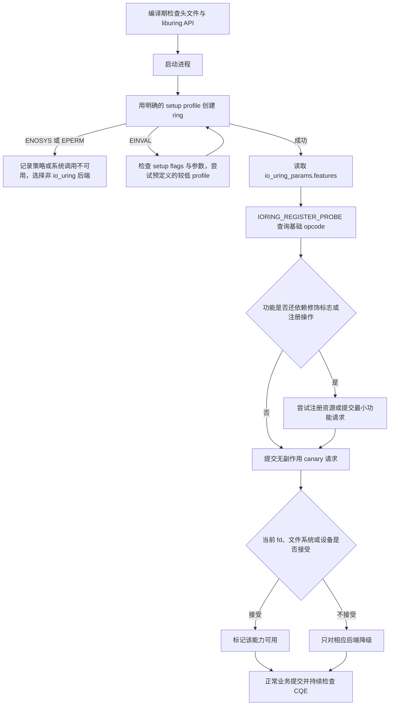
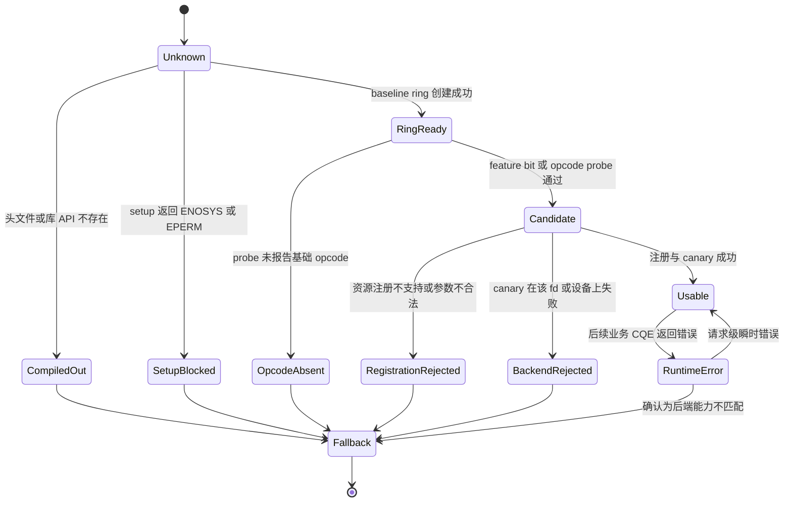

---
tags:
  - 高性能存储
  - io_uring
status: 已完成
---

# 内核版本功能边界

> 内核版本号只能说明某项能力“有可能存在”。生产程序应根据运行内核返回的 feature bits、opcode probe、注册结果和实际文件或 socket 的完成结果决定是否启用。

## 1. 概念和边界

### 1.1 为什么同一个二进制会得到不同结果

io_uring 由三部分共同决定：

1. **liburing 与头文件**：用户态库提供建环、填 SQE、提交和解析 CQE 的辅助函数。
2. **运行中的 Linux 内核**：真正解释 SQE、管理请求并执行 I/O。
3. **具体后端**：文件系统、块设备、网络协议、socket 类型和安全策略。

编译机安装了新版 liburing，只能说明程序能写出某种 SQE。运行机器的内核是否认识该操作、某个修饰标志是否可用、目标设备是否支持 polling，仍要在运行时判断。

举个例子：新版头文件里存在 `IORING_RECV_MULTISHOT`，程序也能成功创建 ring，但这不能证明 multishot recv 可用。还要确认：

- 内核支持 `IORING_OP_RECV`；
- 运行内核理解 multishot 修饰语义；
- 请求设置了 provided buffer；
- 目标 fd 是合适的 socket；
- buffer ring 注册成功；
- 安全策略没有禁止相关系统调用或注册操作。

### 1.2 四个容易混淆的“版本”

| 名称 | 它回答的问题 | 获取方式 |
|---|---|---|
| 编译期头文件版本 | 源码能否引用某个宏、结构或 helper | 构建系统、`IO_URING_VERSION_*`、预处理条件 |
| 运行时 liburing 版本 | 动态链接器实际加载了哪个 liburing | `io_uring_major_version()`、`io_uring_minor_version()` |
| 内核 release 字符串 | 这个内核自称哪个发行版本 | `uname()` 或 `/proc/sys/kernel/osrelease` |
| 运行时能力 | 这个进程在当前环境中能否使用某个功能 | setup、feature bits、probe、注册与 canary 请求 |

这四个值可能不同。新版 liburing 可以运行在旧内核上；发行版也可能把新功能或修复回移到较旧的 release 字符串中。

### 1.3 本文中的“支持”分三层

- **opcode 支持**：内核 probe 报告某个基础操作码存在，例如 `IORING_OP_RECV`。
- **功能组合支持**：基础 opcode 与特定标志、ring 模式或注册方式能一起使用，例如 multishot recv 加 pbuf ring。
- **后端可用**：该组合对当前文件、socket、文件系统或设备成功执行。

> [!important] probe 的边界
> `io_uring_opcode_supported()` 只能回答基础 opcode 是否存在。它不能证明该 opcode 的所有后续标志都存在，也不能证明当前 fd 或设备接受该操作。

### 1.4 版本门槛与能力探测的分工

版本号适合：

- 阅读上游文档时定位功能大致从何时出现；
- 定义测试矩阵，例如覆盖 5.15 LTS、6.1 LTS 和当前生产内核；
- 日志与故障报告。

版本号不适合：

- 单独决定是否启用某个 SQE 标志；
- 推断发行版有没有回移补丁；
- 推断容器、seccomp 或 sysctl 是否允许建 ring；
- 推断某个文件系统或设备是否支持 IOPOLL、direct I/O 或某种命令。

## 2. 端到端能力判定路径

程序启动时先建立一份能力快照，再据此选择 io_uring 快路径或同步、epoll、线程池等降级路径。



路径中的每一层排除一种不同问题：

1. 编译失败说明用户态开发包不够新。
2. setup 失败说明系统调用、策略、资源或 ring 配置有问题。
3. feature bit 缺失说明某项 ring 级契约不存在。
4. opcode probe 缺失说明基础 SQE 操作不存在。
5. 注册或 canary 失败说明修饰能力、资源或后端条件不满足。
6. 业务 CQE 失败说明某次请求的参数、状态或后端条件有问题。

【事实】这些判断发生在用户态到内核的控制路径上。它们不会改变 NVMe、文件系统或网络设备本身的能力。

【取舍】启动时多做几次无副作用探测，会增加少量初始化工作，但能把“不支持”提前变成明确的后端选择，而不是在业务流量中突然退出。

## 3. 主线内核的代表性里程碑

下表记录主线 Linux 首次提供相关能力的版本，用于理解演进顺序。它不是生产环境的唯一判断依据。

| 主线版本 | 代表性能力 | 运行时证据 |
|---:|---|---|
| 5.1 | io_uring 基础接口、文件与 buffer 注册 | `io_uring_setup()` 能否成功 |
| 5.4 | `IORING_FEAT_SINGLE_MMAP`、`IORING_OP_TIMEOUT` | `params.features`、opcode probe |
| 5.5 | `NODROP`、`SUBMIT_STABLE`、linked timeout、async cancel | feature bits 与 opcode probe |
| 5.6 | `IORING_REGISTER_PROBE`、当前文件位置读写语义 | probe 注册是否成功、`RW_CUR_POS` |
| 5.7 | `IORING_FEAT_FAST_POLL` | `params.features` |
| 5.10 | disabled ring 与 restrictions | setup、register 返回值 |
| 5.11 | SQPOLL 使用普通 fd、`IORING_FEAT_EXT_ARG` | `SQPOLL_NONFIXED`、`EXT_ARG` |
| 5.13 | 注册资源 tags；较新 SQPOLL 权限模型 | `IORING_FEAT_RSRC_TAGS`、setup 结果 |
| 5.17 | `IOSQE_CQE_SKIP_SUCCESS` | `IORING_FEAT_CQE_SKIP` |
| 5.18 | `IORING_SETUP_SUBMIT_ALL`、注册 ring fd | setup/register 返回值 |
| 5.19 | COOP task work、multishot accept、pbuf ring、扩展 async cancel 匹配 | setup、注册试探、功能请求 |
| 6.0 | `SINGLE_ISSUER`、multishot recv、同步取消、固定 fd 取消 | setup、注册、功能请求 |
| 6.1 | `DEFER_TASKRUN` | setup 成功；还要求 `SINGLE_ISSUER` |
| 6.3 | 使用已注册 ring fd 调用 register | `IORING_FEAT_REG_REG_RING` |
| 6.7 | multishot read | 基础 `READ` probe 加功能请求 |
| 6.9 | ring 级 NAPI busy poll 注册 | register 返回值与网络环境 |
| 6.10 | send/recv bundle | feature bit 或功能请求，取决于头文件与内核 |
| 6.12 | pbuf ring 增量消费 | pbuf 注册 flags 与 CQE flags |
| 6.13 | ring resize 等新注册操作 | register 返回值 |
| 6.15 | query 接口与受约束的网络零拷贝接收能力 | `IORING_REGISTER_QUERY` 与专用注册结果 |

版本表只选了本章关联较强的节点。io_uring 还有文件操作、消息传递、futex、设备 passthrough 等能力，不应把这张表当成完整 UAPI 清单。

### 3.1 为什么发行版内核不能只看版本号

发行版内核经常同时具备以下特征：

- release 字符串停留在某个长期维护分支；
- 安全修复和部分功能从新主线回移；
- 某些实验能力被关闭或附加策略限制；
- 容器看到宿主机内核，但用户态 liburing 来自容器镜像。

因此 `uname -r` 应写进诊断日志，但不应成为唯一的 `if` 条件。

### 3.2 “首次出现”不等于“适合生产”

接口第一次进入主线后，仍可能经历错误修复、语义补充和性能调整。生产基线需要同时考虑：

- 目标发行版对该内核的维护周期；
- 业务需要的特定修复是否已合入；
- liburing 测试是否覆盖对应组合；
- 文件系统、驱动和硬件是否进入测试矩阵。

【取舍】把最低版本提高到较新的 LTS 能减少兼容分支，但会缩小部署范围。支持较旧内核则需要维护更多 profile、测试和降级路径。

## 4. 五层能力证据

### 4.1 第一层：编译期头文件和 liburing

编译期检查解决的是“源码是否知道这个名字”。它不能查询运行内核。

```cpp
#if defined(IORING_SETUP_DEFER_TASKRUN) && \
    defined(IORING_SETUP_SINGLE_ISSUER)
constexpr bool kCanCompileDeferTaskrun = true;
#else
constexpr bool kCanCompileDeferTaskrun = false;

```

liburing 还提供 `IO_URING_VERSION_MAJOR`、`IO_URING_VERSION_MINOR` 和版本检查接口，用来区分编译时与动态加载时的库版本。

若二进制直接引用新版共享库符号，而运行机器只有旧版 `.so`，动态加载器可能在 `main()` 之前失败。此时内核降级代码没有执行机会。工程上可选择统一打包 liburing、使用满足基线的旧 API，或明确管理动态符号兼容性。

### 4.2 第二层：setup 和环境策略

`io_uring_queue_init_params()` 把 `io_uring_params.flags` 传给 `io_uring_setup()`，并在成功后带回 `features` 和环布局。

setup 常见失败应分类处理：

| 返回值 | 常见含义 | 是否能直接断言“内核太旧” |
|---:|---|---:|
| `-ENOSYS` | 系统调用不存在，或安全策略伪装成不存在 | 否 |
| `-EPERM` | sysctl、seccomp、权限或某种 setup 模式被禁止 | 否 |
| `-EINVAL` | flag 不支持、组合不合法、保留字段未清零或参数错误 | 否 |
| `-ENOMEM` | ring 或锁页资源不足 | 否 |
| `-EMFILE` / `-ENFILE` | 进程或系统 fd 资源达到限制 | 否 |

`/proc/sys/kernel/io_uring_disabled` 的常见值为：

- `0`：允许创建 ring；
- `1`：普通进程受限，具备 `CAP_SYS_ADMIN` 或属于配置的 io_uring group 才能创建；
- `2`：禁止所有进程创建新 ring。

已有 ring 在 sysctl 改变后仍可继续使用，所以探测结果应与 ring 实例绑定，不要假设它永久代表整台机器。

### 4.3 第三层：`io_uring_params.features`

`features` 是内核在 setup 成功后返回的 ring 级能力位。常见例子：

| feature bit | 它证明什么 | 它不证明什么 |
|---|---|---|
| `IORING_FEAT_SINGLE_MMAP` | SQ/CQ ring 可共享一段 mmap | 某个 SQE opcode 可用 |
| `IORING_FEAT_NODROP` | CQ 满时具备内核暂存完成项的契约 | 应用可以不及时收割 CQ |
| `IORING_FEAT_SUBMIT_STABLE` | SQE 被消费后，部分提交参数不必保持到完成 | read/write 数据 buffer 可以提前释放 |
| `IORING_FEAT_FAST_POLL` | 内核可用内部 poll 驱动就绪 | 所有 fd 都支持 poll，也不证明不会进入 io-wq |
| `IORING_FEAT_SQPOLL_NONFIXED` | SQPOLL 可使用普通 fd | SQPOLL 对该业务一定更快 |
| `IORING_FEAT_CQE_SKIP` | 支持 `IOSQE_CQE_SKIP_SUCCESS` | 错误请求也没有 CQE |

feature bits 是正向承诺：只在相应 bit 存在时使用它所描述的契约。

### 4.4 第四层：opcode probe

Linux 5.6 起可以用 `IORING_REGISTER_PROBE` 查询基础 opcode。liburing 的 `io_uring_get_probe_ring()` 返回 `io_uring_probe`，随后用 `io_uring_opcode_supported()` 判断。

```cpp
io_uring_probe* raw = io_uring_get_probe_ring(&ring);
if (raw == nullptr) {
    throw std::runtime_error{"io_uring probe failed"};
}

const bool has_accept =
    io_uring_opcode_supported(raw, IORING_OP_ACCEPT) != 0;
io_uring_free_probe(raw);
```

probe 只列 opcode。multishot accept 仍使用 `IORING_OP_ACCEPT`，multishot recv 仍使用 `IORING_OP_RECV`。所以 `ACCEPT` 或 `RECV` 出现在 probe 中，不等于 multishot 变体可用。

### 4.5 第五层：注册试探和 canary 请求

下面这些能力不能只靠基础 opcode probe 判断：

- provided buffer ring；
- multishot 修饰；
- async cancel 的新增匹配 flags；
- setup flags 的组合；
- IOPOLL 对某个文件系统和块设备是否可用；
- direct I/O 的对齐、文件系统和设备限制；
- NAPI busy poll、设备 passthrough 和零拷贝网络能力。

最可靠的证据是用合法的最小参数执行一次注册或无副作用请求，并检查同步返回值与 CQE。

canary 测试应使用 `NOP`、`pipe`、`socketpair`、临时文件或专用测试设备，不能用生产数据验证一个可能带副作用的写操作。

## 5. 关键数据结构

### 5.1 `io_uring_params`

```cpp
struct io_uring_params {
    __u32 sq_entries;
    __u32 cq_entries;
    __u32 flags;       // 用户请求的 setup flags
    __u32 sq_thread_cpu;
    __u32 sq_thread_idle;
    __u32 features;    // setup 成功后由内核填写
    __u32 wq_fd;
    __u32 resv[3];
    // 后面还有 SQ/CQ mmap offset
};
```

调用前必须整体清零，再设置需要的输入字段。保留字段非零会导致 `-EINVAL`。

### 5.2 `io_uring_probe` 与 `io_uring_probe_op`

概念化结构如下：

```cpp
struct io_uring_probe_op {
    __u8 op;
    __u8 resv;
    __u16 flags;  // IO_URING_OP_SUPPORTED
    __u32 resv2;
};

struct io_uring_probe {
    __u8 last_op;
    __u8 ops_len;
    __u16 resv;
    __u32 resv2[3];
    io_uring_probe_op ops[];
};
```

`last_op` 不是“所有小于它的 opcode 都支持”。每个候选 opcode 仍要检查对应条目的 `IO_URING_OP_SUPPORTED`。

### 5.3 应用自己的 capability key

应用不应只保存 `bool has_recv`。一个可执行能力至少包含：

```cpp
enum class SupportState {
    unknown,
    unavailable,
    candidate,
    usable,
};

struct CapabilityKey {
    std::uint8_t opcode;
    std::uint32_t modifiers;
    std::uint32_t setup_flags;
    std::string backend_kind;  // socket、regular file、block device 等
    std::string backend_name;  // 文件系统或设备类别
};

struct CapabilityRecord {
    CapabilityKey key;
    SupportState state{SupportState::unknown};
    int last_error{};
    std::string evidence;      // feature bit、probe、register 或 canary
};
```

例如“支持 `IORING_OP_READ`”和“某个 O_DIRECT 文件可使用 IOPOLL”是两条不同记录。后者还依赖文件系统、设备和打开方式。

## 6. 能力状态变化

状态机描述的是一项具体的“opcode + 修饰符 + setup profile + 后端”能力，而不是整台机器的总开关。



SVG待定

`-ENOMEM`、`-EAGAIN` 等资源压力错误不能直接把能力永久标记为 unsupported。`-EINVAL` 也需要检查参数，因为它既可能表示“不支持”，也可能表示应用填错了 SQE。

## 7. Modern C++：RAII 建环、降级 profile 与 opcode probe

下面的示例先尝试单提交线程的 `DEFER_TASKRUN` profile。旧头文件不参与编译，旧内核返回 `-EINVAL` 时退到 `COOP_TASKRUN`，再退到 baseline。每个 profile 都是事先验证过的合法组合，不是看到失败就随机删除一个 flag。

```cpp
#include <liburing.h>

#include <cstdint>
#include <iostream>
#include <memory>
#include <stdexcept>
#include <string_view>
#include <system_error>
#include <utility>
#include <vector>

class Ring final {
public:
    static std::unique_ptr<Ring> try_create(
        unsigned entries, unsigned flags, int& error) {
        auto result = std::unique_ptr<Ring>{new Ring};

        io_uring_params params{};
        params.flags = flags;
        error = io_uring_queue_init_params(entries, &result->ring_, &params);
        if (error < 0) {
            return nullptr;
        }

        result->ready_ = true;
        result->params_ = params;
        return result;
    }

    ~Ring() {
        if (ready_) {
            io_uring_queue_exit(&ring_);
        }
    }

    Ring(const Ring&) = delete;
    Ring& operator=(const Ring&) = delete;

    [[nodiscard]] io_uring* get() noexcept { return &ring_; }
    [[nodiscard]] const io_uring_params& params() const noexcept {
        return params_;
    }

private:
    Ring() = default;

    io_uring ring_{};
    io_uring_params params_{};
    bool ready_{false};
};

struct SetupProfile {
    std::string_view name;
    unsigned flags;
};

struct ChosenRing {
    std::unique_ptr<Ring> ring;
    std::string_view profile;
};

ChosenRing create_best_ring(unsigned entries) {
    std::vector<SetupProfile> profiles;

#if defined(IORING_SETUP_DEFER_TASKRUN) && \
    defined(IORING_SETUP_SINGLE_ISSUER)
    profiles.push_back({
        "single-issuer + defer-taskrun",
        IORING_SETUP_SINGLE_ISSUER | IORING_SETUP_DEFER_TASKRUN,
    });


#if defined(IORING_SETUP_COOP_TASKRUN)
    profiles.push_back({"coop-taskrun", IORING_SETUP_COOP_TASKRUN});


    profiles.push_back({"baseline", 0});

    int last_error = -EINVAL;
    for (const SetupProfile& profile : profiles) {
        int error = 0;
        if (auto ring = Ring::try_create(entries, profile.flags, error)) {
            return {std::move(ring), profile.name};
        }

        last_error = error;
        if (error != -EINVAL) {
            throw std::system_error{
                -error, std::generic_category(), "io_uring setup"};
        }
    }

    throw std::system_error{
        -last_error, std::generic_category(), "no valid setup profile"};
}

class OpcodeProbe final {
public:
    explicit OpcodeProbe(Ring& ring)
        : probe_{io_uring_get_probe_ring(ring.get()),
                 &io_uring_free_probe} {
        if (!probe_) {
            throw std::runtime_error{"io_uring_get_probe_ring failed"};
        }
    }

    [[nodiscard]] bool supports(int opcode) const noexcept {
        return io_uring_opcode_supported(probe_.get(), opcode) != 0;
    }

private:
    using ProbePtr = std::unique_ptr<
        io_uring_probe, decltype(&io_uring_free_probe)>;
    ProbePtr probe_;
};

int main() try {
    ChosenRing selected = create_best_ring(64);
    OpcodeProbe probe{*selected.ring};

    const std::uint32_t features = selected.ring->params().features;
    const bool fast_poll = (features & IORING_FEAT_FAST_POLL) != 0;

    std::cout << "profile=" << selected.profile << '\n'
              << "FAST_POLL=" << fast_poll << '\n'
              << "READ=" << probe.supports(IORING_OP_READ) << '\n'
              << "ACCEPT=" << probe.supports(IORING_OP_ACCEPT) << '\n'
              << "RECV=" << probe.supports(IORING_OP_RECV) << '\n'
              << "ASYNC_CANCEL="
              << probe.supports(IORING_OP_ASYNC_CANCEL) << '\n';
} catch (const std::exception& ex) {
    std::cerr << ex.what() << '\n';
    return 1;
}
```

Linux 上可用下列命令编译：

```bash
g++ -std=c++20 -Wall -Wextra -Wpedantic capability_probe.cpp \
    -luring -o capability_probe
./capability_probe
```

代码仍没有断言 multishot recv 或 pbuf ring 可用。这两项需要额外的注册和功能 canary。该缺口是有意保留的，它反映 opcode probe 的真实边界。

> [!warning] `SINGLE_ISSUER` 是执行契约
> 使用该 profile 后，只能由指定提交线程提交请求。其他任务提交会得到 `-EEXIST`。能力探测成功不代表应用的线程模型自动满足这个约束。

## 8. setup profile 与降级策略

### 8.1 使用明确的 profile

建议把 ring 配置写成少数经过测试的 profile：

| profile | setup flags | 适用条件 | 降级方向 |
|---|---|---|---|
| baseline | `0` | 中断驱动、最宽兼容范围 | epoll 或线程池 |
| single issuer | `SINGLE_ISSUER` | 一个线程负责提交 | baseline |
| deferred task work | `SINGLE_ISSUER + DEFER_TASKRUN` | 每线程一个 ring，循环定期进入内核 | single issuer 或 baseline |
| SQPOLL | `SQPOLL` 及可选 CPU affinity | 提交频繁且愿意消耗轮询 CPU | baseline |
| IOPOLL | `IOPOLL` | 文件系统、direct I/O 与设备均支持 polling | 普通 io_uring 或同步 direct I/O |

不要在失败后逐位删除未知 flags。若原组合本来就非法，这种做法会把程序错误伪装成兼容性降级。

### 8.2 降级应保持上层语义

后端切换不应改变业务观察到的契约：

- 超时仍使用同一个绝对 deadline；
- 取消仍等待目标请求终结；
- 短读、短写和部分发送仍由上层处理；
- 完成回调仍在约定线程执行；
- 缓冲区所有权仍在完成后归还。

例如 multishot recv 不可用时，可以退到 oneshot recv，每次终结后补提。若 pbuf ring 不可用，可以退到旧式 provided buffers，或让每个 oneshot 请求持有自己的 buffer。详细所有权见 [[2.11 Multishot 与 Provided Buffer Ring]]。

### 8.3 缓存粒度

下面这些能力可以按进程或 ring 缓存：

- setup profile；
- `params.features`；
- opcode probe；
- ring 级注册能力。

下面这些能力应按后端类别缓存，不能全局化：

- 某文件系统上的 IOPOLL；
- 某设备上的 direct I/O 对齐和命令支持；
- 某 socket 类型上的操作组合；
- 需要网卡队列、权限和 NAPI 配置的网络能力。

## 9. 错误分类和状态处理

### 9.1 同步返回值与 CQE 错误不是一个位置

| 阶段 | 错误出现在哪里 | 示例 |
|---|---|---|
| 建 ring | `io_uring_queue_init_params()` 返回值 | `-EPERM`、`-EINVAL` |
| 注册资源 | register/helper 的同步返回值 | pbuf ring 注册 `-EINVAL` |
| 提交 SQE | `io_uring_submit()` 返回值或对应 CQE | ring fd、SQ 状态错误 |
| 执行请求 | `cqe->res` | `-EOPNOTSUPP`、`-EINVAL`、`-EBADF` |

异步请求失败时不要读取线程局部 `errno`。io_uring 把负 errno 直接写入 `cqe->res`。

### 9.2 哪些错误不能直接变成永久降级

- `-ENOMEM`：内存或锁页预算不足，属于资源状态。
- `-EAGAIN`：当前条件暂不满足，可能需要重试或背压。
- `-EBUSY`：资源正被使用，先检查生命周期。
- `-EINVAL`：既可能是不支持，也可能是 flag 组合、对齐或保留字段错误。
- `-EOPNOTSUPP`：通常更接近后端不支持，但仍应记录 opcode、fd 类型和参数。

永久降级需要可复现证据，例如同一合法 canary 在该后端稳定返回不支持错误，或 feature/probe 明确缺失。

## 10. 内核、文件系统和硬件边界

### 10.1 IOPOLL

建 ring 时接受 `IORING_SETUP_IOPOLL`，只说明内核接受该 ring 模式。真正的存储请求还要求：

- 文件以合适的 direct I/O 模式打开；
- 文件系统支持 polling 路径；
- 块设备及驱动支持 polling；
- buffer、长度和 offset 满足 direct I/O 对齐。

任一条件失败都可能让请求无法执行。参见 [[2.7 SQPOLL 与 IOPOLL]]。

### 10.2 FAST_POLL 与 io-wq

`IORING_FEAT_FAST_POLL` 表示内核具有内部 poll 机制，不表示所有文件都可 poll。普通文件、特殊设备和某些文件系统操作仍可能同步完成或进入 io-wq。参见 [[2.8 io-wq 与阻塞操作退化路径]]。

### 10.3 网络扩展

multishot、buffer selection、bundle 和 NAPI 注册分属不同能力层。基础 `RECV` probe 通过后，仍需确认：

- 对应修饰 flag 被运行内核接受；
- provided buffer 注册成功；
- socket 类型与协议允许该操作；
- 需要设备队列和权限的能力已正确配置。

### 10.4 设备 passthrough

`IORING_OP_URING_CMD` 只是设备专用命令的承载 opcode。probe 报告它存在，不代表每个驱动都实现相同命令，也不代表当前进程具备操作设备的权限。命令结构、CQE 大小和设备能力需要按子系统继续查询。

## 11. 故障案例

### 11.1 只按 `uname` 启用 multishot recv

错误逻辑：

```cpp
if (kernel_version >= Version{6, 0}) {
    enable_multishot_recv();
}
```

失败原因可能包括：

1. 容器的头文件和 liburing helper 太旧，程序根本无法构建。
2. 宿主策略禁止 io_uring，setup 返回 `-EPERM`。
3. `RECV` opcode 存在，但请求缺少 provided buffer 或填错 multishot 参数。
4. pbuf ring 注册失败。
5. 目标 fd 不是支持该操作的 socket。

修复路径：

1. 构建阶段检查头文件和 liburing API。
2. setup 成功后记录 feature bits。
3. probe `IORING_OP_RECV`。
4. 注册小型测试 buffer ring。
5. 对 `socketpair` 提交一次 multishot recv canary。
6. 失败时退到 oneshot recv，并记录失败发生在哪一层。

### 11.2 把 `-EINVAL` 全部当成旧内核

若 SQE 的保留字段未清零、flag 组合非法或 direct I/O 未对齐，同样会得到 `-EINVAL`。直接降级会掩盖代码错误。

修复方法是先保证 canary 参数固定且合法，再把错误与 feature/probe 证据交叉判断。开发和测试环境应把无法解释的 `-EINVAL` 视为失败，而不是静默降级。

## 12. 测试矩阵与可复现实验

### 12.1 同一二进制跨内核运行

选择至少三个实际部署内核，用同一个二进制运行能力探针。每次记录：

- `uname -r`；
- 编译期和运行时 liburing 版本；
- 各 setup profile 的返回值；
- `params.features` 原始十六进制值；
- 关键 opcode probe 结果；
- pbuf、固定文件、固定 buffer 等注册结果；
- pipe、socketpair 和临时文件 canary 的 CQE；
- 最终选择的后端与降级原因。

预期现象是：版本号与能力大体随时间增加，但发行版回移、容器策略和后端差异会让个别行不按版本号排列。

### 12.2 同一内核改变策略

在隔离测试机或测试容器中改变 seccomp 配置、权限或 `io_uring_disabled`，观察 setup 错误如何变化。不要在共享生产主机修改 sysctl。

这个实验说明“同一内核版本”并不等于“同一进程可用能力”。

### 12.3 同一 ring 更换后端

用同一个 IOPOLL ring 分别测试：

- 支持 direct I/O 和 polling 的块设备文件；
- 不支持相应路径的文件系统或 fd；
- 故意不对齐的 buffer 与 offset。

记录 setup 成功与实际请求失败的差别，以验证 ring 级能力不能代替后端能力。

## 13. 观测与部署清单

启动日志建议只输出一次完整能力快照，业务请求只记录异常：

```text
kernel_release=6.x.y-vendor
liburing_build=2.x
liburing_runtime=2.x
setup_profile=single-issuer+defer-taskrun
setup_features=0x...
op_read=1 op_recv=1 op_accept=1 op_async_cancel=1
pbuf_ring=1 recv_multishot=1 iopoll_regular_file=0
fallback_reason=iopoll_backend_rejected
```

部署前确认：

- CI 使用的头文件和生产镜像一致；
- 动态库版本满足二进制依赖；
- 目标发行版和容器策略允许 io_uring；
- 最低支持内核进入持续测试；
- 快路径和降级路径使用同一组语义测试；
- 资源压力错误不会污染永久 capability cache；
- 未识别的错误会告警，不会静默改变数据语义。

## 14. 常见误区

### 14.1 “内核大于某版本就一定支持”

忽略了发行版回移、安全策略、liburing 和后端限制。版本只做线索。

### 14.2 “probe 有 opcode，所以所有 flags 都能用”

probe 粒度是基础 opcode。multishot、bundle、取消匹配方式等还需单独验证。

### 14.3 “头文件有宏，所以运行内核支持”

头文件属于构建环境，SQE 由运行内核解释。

### 14.4 “setup 成功，所以 IOPOLL 能访问所有文件”

IOPOLL 还依赖 direct I/O、文件系统、块设备、驱动和对齐。

### 14.5 “降级就是把 flag 去掉再试”

随意删除 flag 会掩盖非法组合。使用少量明确 profile，并保持上层语义不变。

### 14.6 “一次探测结果可以全局缓存”

ring 级能力可随 ring 缓存，文件系统、设备和 socket 能力要按后端类别记录。

## 15. 实践结论

1. 把版本号当文档索引和测试维度，不把它当运行时 capability API。
2. 按编译期、setup、feature bits、opcode probe、注册/canary 和业务 CQE 六层收集证据。
3. `params.features` 描述 ring 级契约；opcode probe 描述基础操作；二者不能互相替代。
4. multishot、pbuf、IOPOLL、NAPI 和设备命令需要组合级或后端级验证。
5. 只为已验证的合法 setup profile 设计降级，不随机删除失败 flag。
6. `-EINVAL` 先排除参数错误；资源压力错误不写入永久 unsupported 缓存。
7. 降级后仍保持 deadline、取消、短读写、线程归属和 buffer 生命周期语义。
8. 记录原始 feature bits、probe、注册结果和后端信息，才能复现发行版与容器差异。

## 16. 关联笔记

- [[2.1 SQ CQ 模型]]：`io_uring_params`、SQE 与 CQE 的基础模型。
- [[2.4 polling 与 registered buffers]]：固定资源与 polling 的前提。
- [[2.5 liburing 基础用法]]：建环、提交和 CQE 回收接口。
- [[2.7 SQPOLL 与 IOPOLL]]：ring flag 与存储后端能力的边界。
- [[2.8 io-wq 与阻塞操作退化路径]]：FAST_POLL 不覆盖所有 fd 的原因。
- [[2.9 Linked Operations]]：linked file 与 linked timeout 的版本语义。
- [[2.10 Timeout 与 Cancellation]]：取消 flags 和超时能力的版本差异。
- [[2.11 Multishot 与 Provided Buffer Ring]]：组合能力探测的典型场景。

## 17. 参考资料

- [Linux: io_uring_setup(2)](https://man7.org/linux/man-pages/man2/io_uring_setup.2.html)
- [Linux: io_uring_register(2)](https://man7.org/linux/man-pages/man2/io_uring_register.2.html)
- [liburing: io_uring_queue_init_params(3)](https://man7.org/linux/man-pages/man3/io_uring_queue_init_params.3.html)
- [liburing: io_uring_get_probe_ring(3)](https://man7.org/linux/man-pages/man3/io_uring_get_probe_ring.3.html)
- [liburing: io_uring_opcode_supported(3)](https://man7.org/linux/man-pages/man3/io_uring_opcode_supported.3.html)
- [liburing: io_uring_check_version(3)](https://man7.org/linux/man-pages/man3/io_uring_check_version.3.html)
- [liburing: multishot accept](https://man7.org/linux/man-pages/man3/io_uring_prep_multishot_accept.3.html)
- [liburing: multishot recv](https://man7.org/linux/man-pages/man3/io_uring_prep_recv_multishot.3.html)
- [liburing: provided buffer ring](https://man7.org/linux/man-pages/man3/io_uring_setup_buf_ring.3.html)
- [Linux kernel: io_uring_disabled](https://docs.kernel.org/admin-guide/sysctl/kernel.html#io-uring-disabled)
- [liburing upstream README](https://github.com/axboe/liburing#kernel-version-dependency)
