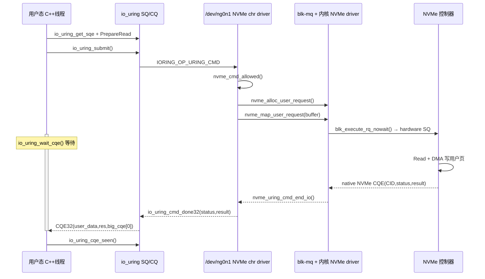
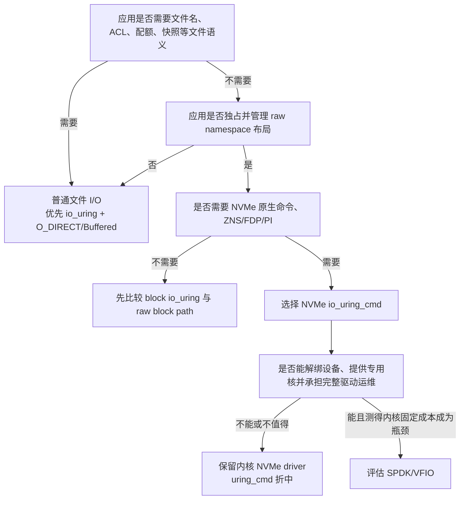

---
tags:
  - 高性能存储
  - io_uring
  - NVMe
  - Linux
  - Passthrough
aliases:
  - io_uring Passthrough
  - NVMe Passthru
  - NVMe uring_cmd
  - uring_cmd
阅读次数: 0
---

# 2.13 io_uring Passthrough（NVMe Passthru）：原理与实战

[[2.1 SQ CQ 模型]] 已经解释了用户态与内核如何通过共享环批量提交 I/O，[[3.1 NVMe 命令模型]] 又解释了控制器如何消费 64 B NVMe 命令并写回 16 B 完成项。本篇把这两层队列接起来：用户态不再只提交 `READ/WRITE + 文件偏移`，而是通过 `IORING_OP_URING_CMD` 向 NVMe generic character device（通常为 `/dev/ngXnY`）提交设备专用命令描述。

> [!danger] 先纠正三个容易被宣传口径带偏的结论
> 1. **上游 Linux 的 NVMe `uring_cmd` 没有绕过整个块层。** 它绕过每笔 I/O 的文件系统、Page Cache、文件偏移到块地址的映射，以及普通 block-device `read/write` 入口；但 NVMe 驱动仍会分配 `blk-mq` request、映射用户页，并通过 `blk_execute_rq_nowait()` 下发。
> 2. **用户态没有把一份“原封不动的 64 B 硬件 SQE”直接塞进控制器队列。** 用户态填写的是 72 B `nvme_uring_cmd`；内核校验后再构造真正的 64 B `struct nvme_command`，分配硬件 CID，并生成 PRP/SGL。
> 3. **它也不是“SPDK 性能 + 文件系统权限”。** 它保留的是设备节点权限、内核 NVMe 驱动、DMA 映射和命令校验；文件级 ACL、配额、路径名、Page Cache 与挂载语义已经不在数据路径中。

> [!abstract] 本篇版本口径
> - **基线**：Linux 5.19 首次进入主线的 NVMe `uring_cmd` 接口；
> - **更新**：同时说明截至 2026-08-30 的上游实现变化；
> - **示例**：Linux-only、C++20、liburing，仅读取 `/dev/ngXnY`；
> - **安全边界**：不演示 Write、Format、Sanitize、Namespace 管理等破坏性命令。

---

## 1. 关键结论：它到底省了哪一段

| 问题 | 精确结论 |
|---|---|
| 接口是什么 | `IORING_OP_URING_CMD` 是 io_uring 的 **fd-specific command transport**；NVMe 驱动用 `NVME_URING_CMD_IO` 等 `cmd_op` 解释命令 |
| 每笔 I/O 绕过什么 | VFS 文件数据路径、文件系统块映射、Page Cache、普通 `read/write` 翻译、generic block-device 文件 I/O 入口 |
| 仍经过什么 | io_uring、NVMe character-device `uring_cmd`、权限/命令校验、用户页映射、`blk-mq` request、内核 NVMe 驱动、硬件队列 |
| 为什么可能更快 | 命令内联在共享 SQE 中、可批量提交、减少通用路径翻译、可复用 fixed buffer/file，并能直接表达 NVMe 特性 |
| 为什么不等于 SPDK | SPDK 解绑内核 NVMe 驱动，用户态直接 mmap BAR、维护 qpair、写 doorbell、轮询硬件 CQ；`uring_cmd` 仍由内核持有控制器 |
| 谁适合使用 | fio、设备测试工具、独占 raw namespace 的存储引擎、ZNS/FDP/PI 等需要原生命令的系统 |
| 谁不适合使用 | 只想更快读写普通文件、依赖文件系统一致性/配额/快照/共享挂载的应用 |

`Passthrough` 的本质不是“少一个函数”，而是**改变接口的抽象层级**：

```text
普通文件 I/O：给内核「文件 + offset + length」
NVMe uring_cmd：给内核「NVMe opcode + NSID + CDW10–15 + 用户 buffer」
SPDK：应用自己管理「控制器 + qpair + CID + PRP/SGL + doorbell」
```

---

## 2. 三条数据路径：Block I/O、NVMe uring_cmd 与 SPDK

![[图片/SVG/8_2_2_13_1.svg|1340]]

这张图的阅读重点不是“框少就是快”，而是**谁拥有地址翻译、命令校验、队列和故障恢复**。

| 维度 | 传统 Block I/O | io_uring NVMe Passthrough | SPDK NVMe Driver |
|---|---|---|---|
| 用户接口 | 文件或块设备上的 `read/write`、`IORING_OP_READ/WRITE` | `/dev/ngXnY` 上的 `IORING_OP_URING_CMD` | `spdk_nvme_ns_cmd_*()` |
| 地址语义 | 文件 offset 或 block-device byte offset | NSID + SLBA + NLB | NSID + SLBA + NLB |
| 文件系统语义 | 可保留 | 无 | 无，除非应用自行实现 |
| Page Cache | buffered I/O 可用；`O_DIRECT` 绕过 | 不参与 | 不参与 |
| `blk-mq` | 经过 | **仍经过 request/map/execute** | 不经过 |
| NVMe 驱动 | 内核驱动 | 内核驱动 | 用户态 SPDK 驱动 |
| 控制器所有权 | 内核 | 内核 | SPDK 进程，设备通常从内核解绑 |
| 完成方式 | IRQ 或 IOPOLL | io_uring CQE；新版可结合 IOPOLL | 用户态轮询 NVMe CQ phase bit |
| 隔离手段 | 文件权限、挂载、块设备权限、内核校验 | 设备节点权限、命令校验、DMA API/IOMMU | VFIO/IOMMU + 进程独占策略 |
| 运维复杂度 | 最低 | 中等 | 最高 |

性能只能写成**待验证的顺序假设**：对高 IOPS、小块、raw-device 工作负载，软件路径开销常见趋势是：

```text
SPDK ≤ NVMe uring_cmd ≤ 普通内核 Block I/O
```

这不是协议保证。`O_DIRECT + io_uring + fixed buffer + IOPOLL` 已经很接近设备，队列深度、NUMA、CPU 频率、IRQ 亲和性和 SSD 固件都可能让差距缩小，甚至改变局部结果。比较方法见 [[2.3 iodepth 与提交完成路径]] 与 [[2.7 SQPOLL 与 IOPOLL]]。

---

## 3. 上游实现真相：它仍然进入 `blk-mq`

以当前上游 NVMe host driver 为例，一条 namespace read 的主路径可以压缩为：

```text
用户态：填 SQE128 + nvme_uring_cmd
  ↓ io_uring_submit()
IORING_OP_URING_CMD
  ↓ file_operations::uring_cmd
nvme_ns_chr_uring_cmd()
  ↓
nvme_uring_cmd_io()
  ├─ nvme_cmd_allowed()             权限与 Command Effects 校验
  ├─ nvme_alloc_user_request()      分配 blk-mq request
  ├─ nvme_map_user_request()        pin/map 用户页，形成 bio/iter
  └─ blk_execute_rq_nowait()        异步进入 NVMe 驱动
       ↓
内核 NVMe driver 填硬件 CID / PRP 或 SGL / SQE
       ↓ DMA + doorbell
NVMe controller
       ↓ 硬件 CQE
nvme_uring_cmd_end_io()
  ↓ io_uring_cmd_done32()
用户态 io_uring CQE32
```

因此，准确说法是：

> **`uring_cmd` 绕过通用文件/块设备 I/O 抽象，但复用了内核的 request、DMA 映射、NVMe 驱动与完成基础设施。**

这正是它与 [[5.6 SPDK 用户态驱动]] 及 [[5.7 内核态 vs 用户态路径]] 的分界。SPDK 会把设备从 `nvme` 驱动解绑到 VFIO/UIO，自己管理硬件 qpair；`uring_cmd` 则让内核继续持有设备，只把“要执行哪条命令”的表达能力上移给用户态。

### 3.1 为什么保留 `blk-mq` 不一定是坏事

保留 request infrastructure 会带来可测量的固定开销，但也保留了一批很难由应用重写的能力：

- 统一的用户页 pin/map/unmap 与 DMA API；
- request 超时、控制器 reset、错误恢复与设备热拔插协作；
- 复用 [[1.7 块层与 blk-mq]] 的 request/tag 基础设施、namespace 生命周期与内核路径选择；但 passthrough request 通常不能假定拥有普通 I/O 的透明 multipath failover；
- LSM、设备节点、capability 与命令效果校验；
- 不要求应用独占 PCI BAR、hugepage、专用轮询核。

`uring_cmd` 的目标不是把内核删掉，而是找到**“设备专用表达能力”与“内核资源治理”之间的折中点**。

### 3.2 三种票据不能混用

| 票据 | 所在层 | 谁分配 | 用途 |
|---|---|---|---|
| `sqe->user_data` | io_uring | 应用 | 用户态把 CQE 对回自己的请求对象 |
| request tag / NVMe `CID` | blk-mq + NVMe hardware queue | 内核驱动 | 硬件 CQE 对回内核 request |
| `NSID` | NVMe 协议 | 控制器配置 | 选择 namespace，不是请求 ID |

完成链是：

```text
硬件 CQE.CID → 内核 request → io_uring request → CQE.user_data → 应用上下文
```

应用不能把 `user_data` 当成硬件 CID，也不能自己在 `nvme_uring_cmd` 中填写物理 PRP 地址或 CID。

---

## 4. 四种 Entry：两个 SQ/CQ 层不能画成同一对队列

![[图片/SVG/8_2_2_13_2.svg|1340]]

### 4.1 原生 NVMe 协议：64 B SQE + 16 B CQE

[[3.1 NVMe 命令模型]] 中的硬件协议保持不变：

- NVMe Submission Queue Entry：**64 B**；
- NVMe Completion Queue Entry：**16 B**；
- SQ/CQ 通常位于 host memory；
- 控制器经 DMA 获取命令和数据描述，并写回完成；
- doorbell 发布 tail/head；phase bit 用于识别新完成。

命令本身只描述 opcode、NSID、CDW 与数据指针结构，真正的数据通过 DMA 访问 [[3.9 PRP 与 SGL]] 所描述的主机内存。

### 4.2 io_uring 默认也是 64 B / 16 B，但 passthrough 不能只用默认槽位

UAPI 中：

```cpp
static_assert(sizeof(io_uring_sqe) == 64);
static_assert(sizeof(io_uring_cqe) == 16);
static_assert(sizeof(nvme_uring_cmd) == 72);
```

72 B 的 `nvme_uring_cmd` 放不进普通 SQE 剩余字段，因此 NVMe passthrough ring 要求：

```text
IORING_SETUP_SQE128  → 每个 submission slot 为 128 B
IORING_SETUP_CQE32   → 每个 completion slot 为 32 B
```

这里有一个容易误读的细节：`sizeof(io_uring_sqe)` 仍然是 64 B；`SQE128` 是 ring 为每个槽预留两个标准 SQE 的空间。`sqe->cmd` 从基础 SQE 的 byte 48 开始，所以可连续使用：

```text
基础 SQE 尾部 16 B + 扩展 64 B = 80 B command payload
```

`nvme_uring_cmd` 占其中 72 B。内核读取这份用户描述后，再构造真正的 64 B `struct nvme_command`。

### 4.3 CQE32 为什么需要 32 B

普通 CQE 的 16 B 包含：

```text
user_data: 8 B
res:       4 B
flags:     4 B
```

NVMe 驱动除 status 外还会向 UAPI 暴露一个 64-bit result 槽。`CQE32` 再提供 16 B extra area，驱动把该 result 放入第一段 extra；许多常规 NVM 命令只定义硬件 CQE 的 DW0，不能把 64-bit 槽误解为每条命令都具有 64-bit 有效返回值：

```cpp
const int status = cqe->res;
const std::uint64_t result = cqe->big_cqe[0];
```

> [!important] `cqe->res` 不是完成字节数
> 对普通 `IORING_OP_READ`，`res` 常表示读取字节数；对 NVMe `uring_cmd`：
>
> - `res == 0`：NVMe 命令成功；
> - `res < 0`：Linux transport/permission/mapping/error path，值为负 errno；
> - `res > 0`：NVMe status，需拆出 SCT/SC；
> - 实际 transfer length 来自提交时的 `data_len`，不是 CQE 返回值。

---

## 5. `nvme_uring_cmd`：用户态到底填写什么

UAPI 结构可以按四组字段理解：

| 字段组 | 典型字段 | 谁最终负责 |
|---|---|---|
| 命令身份 | `opcode`、`nsid` | 用户选择；内核校验 namespace 与命令权限 |
| Command Dwords | `cdw2`、`cdw3`、`cdw10`～`cdw15` | 用户按 NVMe spec 编码；内核转为 little-endian native command |
| 数据描述 | `addr`、`data_len`、`metadata`、`metadata_len` | 用户给虚拟地址；内核 pin/map，并生成 PRP/SGL |
| 执行策略 | `timeout_ms` | 用户可覆盖默认 command timeout；不是端到端事务 deadline |

以 NVM Read 为例：

```text
opcode = 0x02
nsid   = NVME_IOCTL_ID 查询得到的 namespace ID
cdw10  = SLBA[31:0]
cdw11  = SLBA[63:32]
cdw12[15:0] = NLB = block_count - 1
addr/data_len = 用户接收 buffer
```

`NLB` 是 **zero-based**：读 1 个逻辑块要写 `0`，读 8 个块写 `7`。这类 off-by-one 错误不会被 C++ 类型系统拦住，必须在 builder 中集中封装。

### 5.1 用户态没有填写 PRP1/PRP2

内核会把 `addr` 指向的用户虚拟页 pin 住，建立 request/bio，再由 NVMe driver 按 DMA 映射结果生成 PRP 或 SGL。这样做有两层意义：

1. 应用不需要、也不应该知道物理地址；
2. 内核可以保证设备只 DMA 到经过映射的页，而不是信任任意用户提供的“物理指针”。

这也是 `uring_cmd` 仍然比 SPDK 更容易接入普通 Linux 运维体系的核心原因之一。

---

## 6. 完成语义、持久化语义与 buffer 生命周期

### 6.1 Read/Write command complete 不等于同一件事

- Read 成功：控制器已把请求数据 DMA 到提交的用户 buffer；
- Write 成功：命令已按 NVMe 语义完成，但是否跨掉电持久化取决于 volatile write cache、FUA 和 Flush；
- Flush/FUA 的边界见 [[3.11 NVMe Flush 与 FUA]]，不能因为接口更“底层”就省略崩溃一致性设计。

### 6.2 buffer 的所有权窗口

```text
填 cmd->addr
→ SQE 发布
→ 内核 pin/map 用户页
→ 控制器 DMA
→ 内核 unmap/unpin
→ CQE32 发布
→ 应用消费 CQE
```

从提交到 CQE 到达之前，应用必须保证：

- buffer 地址稳定，不能 `free`、缩容或移动；
- Read buffer 不能被并发写；Write buffer 不能被并发修改；
- command context 与 `user_data` 指向的状态对象仍然存在；
- timeout/cancel 请求发出后，也不能提前释放，必须等最终完成路径确认资源不再被引用。

与 [[2.10 Timeout 与 Cancellation]] 一样，**“调用者不想等了”不等于“设备和内核已停止引用内存”**。

---

## 7. C++20 只读实战：从 `/dev/ng0n1` 读取原始 LBA

> [!warning] 实验前的安全边界
> - 示例只打开 `O_RDONLY`，只发 NVMe Read；
> - `/dev/ngXnY` 是 raw namespace，不认识分区、文件和目录；
> - 不要把示例改成 Write 后指向装有数据或已挂载的 namespace；
> - 上游 Linux 5.19 基线要求 `CAP_SYS_ADMIN`；新版是否允许普通用户取决于命令效果表、fd 打开模式、设备节点权限及发行版 backport，版本检查见 [[2.12 内核版本功能边界]]。

### 7.1 环境检查

```bash
uname -r
ls -l /dev/ng* /dev/nvme*n* 2>/dev/null

# 查询逻辑块大小；实际设备可能是 512 B 或 4096 B
sudo nvme id-ns /dev/nvme0n1 -H
sudo blockdev --getss /dev/nvme0n1

# fio 是否编译进 passthrough engine
fio --enghelp=io_uring_cmd
```

若只有 `/dev/nvme0n1` 而没有 `/dev/ng0n1`，不要把 block device 路径硬塞给 `io_uring_cmd`。先检查内核 NVMe generic character device、udev 和发行版配置。

下面所有代码块连续拼成同一个 `nvme_uring_read.cpp`。代码将资源所有权放进 RAII 类型，原因不是“写得现代”，而是 ring、fd 与 DMA buffer 的销毁顺序直接决定是否出现 use-after-free。

### 7.2 头文件、常量与参数解析

```cpp
// Linux-only, C++20. Requires Linux >= 5.19 and liburing.
#include <liburing.h>
#include <linux/nvme_ioctl.h>
#include <fcntl.h>
#include <sys/ioctl.h>
#include <unistd.h>

#include <charconv>
#include <cerrno>
#include <cstddef>
#include <cstdint>
#include <cstdlib>
#include <cstring>
#include <iomanip>
#include <iostream>
#include <limits>
#include <memory>
#include <span>
#include <stdexcept>
#include <string>
#include <string_view>
#include <system_error>

namespace {
constexpr std::uint8_t kNvmeReadOpcode = 0x02;
constexpr std::size_t kDmaAlignment = 4096;
constexpr std::uint64_t kToken = 0x4E564D4552454144ULL;
```

4096 B 对齐是保守的实验配置：它让用户页映射与常见 LBA 尺寸更容易满足要求，但真正的 transfer geometry 仍必须依据 namespace Identify 数据，而不是把“4K SSD”当作固定事实。生产代码还应从 Identify Controller/Namespace 校验 `NSZE`、`MDTS`（或对应最大传输限制）和 metadata/PI 能力；本例只演示单条只读命令，不实现完整 Identify 解析器。

```cpp
[[noreturn]] void ThrowErrno(std::string_view op) {
    throw std::system_error(errno, std::generic_category(),
                            std::string(op));
}

std::uint64_t ParseU64(std::string_view text,
                       std::string_view field) {
    std::uint64_t value = 0;
    const auto [ptr, ec] = std::from_chars(
        text.data(), text.data() + text.size(), value);
    if (ec != std::errc{} || ptr != text.data() + text.size()) {
        throw std::invalid_argument("invalid " + std::string(field));
    }
    return value;
}
```

参数解析拒绝半截数字和溢出，避免错误 LBA 被静默截断。raw-device 工具中，“宽松解析”不是易用性，而是数据破坏入口。

### 7.3 用 RAII 固定关闭顺序

```cpp
class UniqueFd {
public:
    explicit UniqueFd(int fd) : fd_(fd) {
        if (fd_ < 0) ThrowErrno("open");
    }
    ~UniqueFd() { if (fd_ >= 0) ::close(fd_); }

    UniqueFd(const UniqueFd&) = delete;
    UniqueFd& operator=(const UniqueFd&) = delete;
    [[nodiscard]] int get() const noexcept { return fd_; }

private:
    int fd_;
};

class Uring {
public:
    explicit Uring(unsigned depth) {
        io_uring_params params{};
        params.flags = IORING_SETUP_SQE128 |
                       IORING_SETUP_CQE32;
        const int rc = io_uring_queue_init_params(
            depth, &ring_, &params);
        if (rc < 0) {
            throw std::system_error(
                -rc, std::generic_category(), "queue_init");
        }
        initialized_ = true;
    }
```

不能用普通 `io_uring_queue_init()`：NVMe passthrough 必须在 setup 时请求 expanded SQE/CQE。ring 的 flag 是 ring-wide contract，不是单个 SQE 的临时选项。

```cpp
    ~Uring() {
        if (initialized_) io_uring_queue_exit(&ring_);
    }

    Uring(const Uring&) = delete;
    Uring& operator=(const Uring&) = delete;
    [[nodiscard]] io_uring* get() noexcept { return &ring_; }

private:
    io_uring ring_{};
    bool initialized_{false};
};

struct FreeDeleter {
    void operator()(std::byte* ptr) const noexcept {
        std::free(ptr);
    }
};
```

析构顺序由 `main` 中对象的声明逆序决定：先销毁 buffer，再销毁 ring，再关闭 fd 的前提是所有 CQE 已经收割；生产环境关闭时应先停止新提交、完成/取消并 drain，再释放 buffer 和 ring。

### 7.4 DMA buffer 不允许被 `vector` 扩容搬家

```cpp
class AlignedBuffer {
public:
    explicit AlignedBuffer(std::size_t bytes) : size_(bytes) {
        void* raw = nullptr;
        const int rc = ::posix_memalign(
            &raw, kDmaAlignment, bytes);
        if (rc != 0) {
            throw std::system_error(
                rc, std::generic_category(), "posix_memalign");
        }
        data_.reset(static_cast<std::byte*>(raw));
        std::memset(data_.get(), 0, size_);
    }

    [[nodiscard]] std::span<std::byte> span() noexcept {
        return {data_.get(), size_};
    }

private:
    std::unique_ptr<std::byte, FreeDeleter> data_;
    std::size_t size_;
};
```

`std::span` 只表达借用范围，不转移所有权。真正拥有内存的是 `AlignedBuffer`，它必须活到 CQE 消费之后。

### 7.5 构造 Read command

```cpp
void PrepareRead(io_uring_sqe& sqe,
                 int fd,
                 std::uint32_t nsid,
                 std::uint64_t slba,
                 std::uint32_t blocks,
                 std::span<std::byte> buffer) {
    if (blocks == 0 || blocks > 65536) {
        throw std::invalid_argument("blocks out of range");
    }
    if (buffer.size() >
        std::numeric_limits<std::uint32_t>::max()) {
        throw std::invalid_argument("buffer too large");
    }

    io_uring_prep_uring_cmd(
        &sqe, static_cast<int>(NVME_URING_CMD_IO), fd);
    sqe.user_data = kToken;

    auto* cmd = reinterpret_cast<nvme_uring_cmd*>(sqe.cmd);
    std::memset(cmd, 0, sizeof(*cmd));
    cmd->opcode = kNvmeReadOpcode;
    cmd->nsid = nsid;
```

liburing helper 的 `cmd_op` 参数类型是 `int`，而 `NVME_URING_CMD_IO` 使用 ioctl-style bit pattern；显式转换只是满足 C++ 编译器，进入 SQE 后仍按 `u32 cmd_op` 解释。

```cpp
    cmd->addr = reinterpret_cast<std::uintptr_t>(
        buffer.data());
    cmd->data_len = static_cast<std::uint32_t>(
        buffer.size());
    cmd->cdw10 = static_cast<std::uint32_t>(slba);
    cmd->cdw11 = static_cast<std::uint32_t>(slba >> 32U);
    cmd->cdw12 = blocks - 1U;  // NLB is zero-based.
}
```

这里故意不填写 `command_id`、PRP1 或 PRP2：这些属于内核 NVMe driver 与硬件队列，不属于 `nvme_uring_cmd` UAPI。

### 7.6 提交并按三类结果解码 CQE

```cpp
std::uint64_t SubmitAndWait(io_uring& ring) {
    const int submitted = io_uring_submit(&ring);
    if (submitted < 0) {
        throw std::system_error(
            -submitted, std::generic_category(), "submit");
    }
    if (submitted != 1) {
        throw std::runtime_error("partial submission");
    }

    io_uring_cqe* cqe = nullptr;
    int rc = 0;
    do {
        rc = io_uring_wait_cqe(&ring, &cqe);
    } while (rc == -EINTR);
    if (rc < 0) {
        throw std::system_error(
            -rc, std::generic_category(), "wait_cqe");
    }
```

`io_uring_submit()` 可能只提交部分 SQE；单请求示例要求返回 1。多请求程序不能假定“一次 submit 全吃完”，而要维护已发布数量与 backpressure。

```cpp
    const std::uint64_t token = cqe->user_data;
    const int status = cqe->res;
    const std::uint64_t result = cqe->big_cqe[0];
    io_uring_cqe_seen(&ring, cqe);

    if (token != kToken) {
        throw std::runtime_error("unexpected completion token");
    }
    if (status < 0) {
        throw std::system_error(
            -status, std::generic_category(), "transport error");
    }
    if (status > 0) {
        const unsigned sc =
            static_cast<unsigned>(status) & 0xffU;
        const unsigned sct =
            (static_cast<unsigned>(status) >> 8U) & 0x7U;
        throw std::runtime_error(
            "NVMe status SCT=" + std::to_string(sct) +
            ", SC=" + std::to_string(sc));
    }
    return result;
}
```

先复制 CQE 字段，再调用 `io_uring_cqe_seen()` 归还槽位；归还之后继续解引用 `cqe` 是生命周期错误。

### 7.7 `main`：查询 NSID，确保 transfer geometry 不溢出

```cpp
}  // namespace

int main(int argc, char* argv[]) {
    try {
        if (argc != 5) {
            std::cerr << "usage: " << argv[0]
                      << " /dev/ng0n1 <slba> <lba_bytes>"
                         " <block_count>\n";
            return 2;
        }

        const auto slba = ParseU64(argv[2], "slba");
        const auto lba_bytes = ParseU64(argv[3], "lba_bytes");
        const auto blocks64 = ParseU64(argv[4], "block_count");
        if (lba_bytes == 0 || blocks64 == 0 ||
            blocks64 > 65536 ||
            lba_bytes > std::numeric_limits<std::size_t>::max() /
                        blocks64) {
            throw std::invalid_argument("invalid geometry");
        }
```

这里的 `lba_bytes` 必须来自 Identify Namespace 或 `blockdev --getss`。把 512 B namespace 当成 4 KiB，会使 `data_len` 与 NLB 的含义不一致。

```cpp
        const auto blocks =
            static_cast<std::uint32_t>(blocks64);
        const auto bytes64 = lba_bytes * blocks64;
        if (bytes64 > std::numeric_limits<std::uint32_t>::max() ||
            bytes64 > std::numeric_limits<std::size_t>::max()) {
            throw std::invalid_argument("transfer too large");
        }
        const auto bytes = static_cast<std::size_t>(bytes64);

        UniqueFd fd(::open(argv[1], O_RDONLY | O_CLOEXEC));
        const int id = ::ioctl(fd.get(), NVME_IOCTL_ID);
        if (id < 0) ThrowErrno("NVME_IOCTL_ID");
        const auto nsid = static_cast<std::uint32_t>(id);

        Uring ring(8);
        AlignedBuffer buffer(bytes);
        io_uring_sqe* sqe = io_uring_get_sqe(ring.get());
        if (sqe == nullptr) {
            throw std::runtime_error("SQ is full");
        }
```

`NVME_IOCTL_ID` 只用于查询当前 character namespace 的 NSID，不是在热路径同步提交 I/O。生产实现还应验证 `slba + blocks` 不越过 namespace capacity，并把单次传输限制在控制器允许的最大值内。

```cpp
        PrepareRead(*sqe, fd.get(), nsid, slba,
                    blocks, buffer.span());
        const std::uint64_t result =
            SubmitAndWait(*ring.get());

        std::cout << "read completed: nsid=" << nsid
                  << ", slba=" << slba
                  << ", bytes=" << bytes
                  << ", result=0x" << std::hex << result << '\n';
        return 0;
    } catch (const std::exception& ex) {
        std::cerr << "error: " << ex.what() << '\n';
        return 1;
    }
}
```

编译与只读运行：

```bash
g++ -std=c++20 -O2 -Wall -Wextra -Wpedantic \
    nvme_uring_read.cpp -luring -o nvme_uring_read

# 第三个参数必须替换成该 namespace 的真实 LBA size
sudo ./nvme_uring_read /dev/ng0n1 0 4096 1
```



这张时序图揭示了代码中看不见的两次翻译：用户命令先变成内核 request，再变成 hardware SQE；返回时 hardware CQE 又被翻译成 io_uring CQE32。

---

## 8. fio `io_uring_cmd` 实战：先做只读 A/B

fio 是最明确的直接采用者，因为它的职责就是控制 I/O opcode、LBA、队列深度、FUA、PI、ZNS/FDP 等设备语义，并测量每个完成。当前 fio 将该引擎命名为 `io_uring_cmd`，默认 `cmd_type=nvme`，目标使用 `/dev/ngXnY`。

### 8.1 Passthrough 只读 job

```ini
[global]
ioengine=io_uring_cmd
cmd_type=nvme
filename=/dev/ng0n1
rw=randread
bs=4k
iodepth=32
fixedbufs=1
registerfiles=1
time_based=1
runtime=30
ramp_time=5
group_reporting=1

[pt-randread]
```

运行前确认 `bs` 是 namespace LBA size 的整数倍。`fixedbufs=1` 让 fio 预先注册 buffer，减少逐 I/O 导入和映射成本；它不是“控制器直接持有任意用户指针”，其边界见 [[2.4 polling 与 registered buffers]]。

### 8.2 与普通 block `io_uring` 对照

```bash
# 基线：普通 block-device path
sudo fio --name=block \
  --filename=/dev/nvme0n1 --ioengine=io_uring \
  --direct=1 --rw=randread --bs=4k --iodepth=32 \
  --fixedbufs=1 --registerfiles=1 --runtime=30 \
  --time_based=1 --group_reporting=1

# Passthrough：NVMe generic character device
sudo fio --name=pt \
  --filename=/dev/ng0n1 --ioengine=io_uring_cmd \
  --cmd_type=nvme --rw=randread --bs=4k --iodepth=32 \
  --fixedbufs=1 --registerfiles=1 --runtime=30 \
  --time_based=1 --group_reporting=1
```

要做公平对照，必须统一：

- 同一 namespace、同一数据范围和读写比例；
- 相同 `bs`、`iodepth`、batch 参数和 fixed-buffer 策略；
- 相同 CPU affinity、IRQ affinity、NUMA node 与电源模式；
- 相同预热、运行时长、温度与 SSD 稳态；
- 同时记录 IOPS、BW、p50/p99/p99.9、CPU%、cycles/I/O、IRQ/s 与 context switches。

`hipri=1` 会尝试 IOPOLL。Linux 5.19 的 NVMe uring_cmd 基线明确不支持 IOPOLL；较新内核已经加入 polled request 路径，但仍需驱动、设备和发行版实际支持。不能只看到 `uname -r` 就假定可用，应把 `-EOPNOTSUPP` 当作正常 capability probe 结果。

---

## 9. 性能结果应该怎样解读

### 9.1 2022 patchset 的历史原型数据

最初 patchset 给出过 512 B random read、单 job、自定义 fio 的 KIOPS 对比：

| QD | block io_uring | passthrough | block poll | passthrough poll |
|---:|---:|---:|---:|---:|
| 8 | 538 | 589 | 831 | 902 |
| 64 | 967 | 1131 | 1351 | 1378 |
| 256 | 1043 | 1230 | 1376 | 1429 |

> [!warning] 这些数字不是产品承诺
> 它们来自 2022 年 patchset、特定硬件、512 B randread 和定制 fio，只能证明“该原型在该环境值得继续做”，不能推导为所有 SSD、4 KiB、混合读写或当前内核都快同样比例。

表中还能看出一个重要现象：当 block path 自己已经使用 polling 时，passthrough 的边际增益可能明显缩小。这说明优化必须按阶段归因，不能把“更底层”当作自动胜利。

### 9.2 它能省掉的 CPU 工作

- 每笔 I/O 不再查文件页、extent、Page Cache 或文件 offset；
- 不走普通 block-device `read_iter/write_iter` 翻译；
- command inline 在 SQE 扩展区，避免 ioctl-style command structure 的额外同步往返；
- SQ/CQ 可以批量 amortize `io_uring_enter()`；
- fixed files/buffers 可减少 fd lookup、refcount 和逐 I/O page mapping。

### 9.3 它省不掉的工作

- io_uring request 管理；
- NVMe command allowlist 与 namespace 校验；
- `blk-mq` request/tag；
- 用户页 pin/map/unmap（未使用 fixed buffer 时尤其明显）；
- NVMe driver 构造 PRP/SGL、doorbell 与 completion；
- SSD media/FTL 延迟。

因此测试应同时看 **cycles/I/O** 与设备延迟。只看 IOPS，可能把更深队列造成的并发提升误写成软件路径变快。

---

## 10. 为什么 fio 直接采用，而 RocksDB 不能被当成现成案例

### 10.1 fio 与 passthrough 天然匹配

fio 本来就要表达设备级实验变量：

- Read / Write / Compare / Write Zeroes / Zone Append；
- FUA、PI、metadata、ZNS、FDP；
- fixed buffers、SQPOLL、IOPOLL、batch submit/reap；
- 直接读取 NVMe status code/type。

因此 `io_uring_cmd` 能让 fio 在保留内核驱动的同时，绕开文件语义，精确控制原生命令。

### 10.2 RocksDB 官方异步 I/O 不等于 NVMe uring_cmd

RocksDB 官方的异步 I/O设计是：在 Iterator/MultiGet 中通过 `FSRandomAccessFile::ReadAsync`、MultiRead 与 C++ coroutine 并行读取 **SST 文件**，用重叠 I/O 隐藏介质延迟。这个描述仍处于文件系统 API 层，不能据此声称 RocksDB 已采用 NVMe `uring_cmd`。

对 RocksDB 这类文件型 LSM engine，直接改成 raw passthrough 意味着它必须额外接管：

```text
文件名/extent → LBA 映射
空间分配与回收
WAL 与 manifest 布局
原子更新与崩溃恢复
Flush/FUA 顺序
坏块/介质错误处理
多实例隔离、配额与运维工具
```

这已经不是“换一个 I/O engine”，而是在 RocksDB 下面重写一层文件系统或 raw-device allocator。更合理的表述是：

> **RocksDB 在拥抱异步文件 I/O；fio 在直接拥抱 NVMe uring_cmd。只有本来就拥有 raw namespace 布局的存储引擎，才可能自然采用 passthrough。**

适合继续研究的场景包括 ZNS-aware engine、FDP placement、KV SSD、用户态块分配器以及独占本地 NVMe 的日志/缓存系统。

---

## 11. 权限与多租户：保留了什么，又失去了什么

### 11.1 Linux 5.19 基线

Linux 5.19 的 NVMe `uring_cmd` 路径：

- 要求 `SQE128 + CQE32`；
- 通过 `/dev/ngXnY` namespace character device；
- 对 passthrough command 做 NSID/字段检查；
- 基线直接要求 `CAP_SYS_ADMIN`；
- 尚不支持 NVMe uring_cmd IOPOLL。

### 11.2 当前上游实现

较新上游内核已经扩展（部署时仍应回到 [[2.12 内核版本功能边界]] 做运行时探测）：

- 根据 NVMe Command Effects Log、是否以写模式打开、partition/vendor/fabrics 等条件判断命令是否允许；
- 支持 fixed-buffer import；
- 增加 `REQ_POLLED` 与 NVMe uring_cmd iopoll 路径；
- 使用 CQE32 extra 返回 64-bit command-specific result。

发行版可能 backport 一部分而不是全部，所以项目必须运行时探测，不能把“主线版本号”当成完整 feature matrix。

### 11.3 为什么它不是文件级多租户

打开 `/dev/ng0n1` 后，命令面对的是整个 namespace 的 LBA 空间：

- 没有文件路径和 inode ACL；
- 没有文件系统 quota；
- 不知道哪些 LBA 属于哪个进程或租户；
- 同一 namespace 上的多个 raw writer 必须自行协调布局与持久化顺序。

要做多租户，应优先提供独立 namespace、虚拟功能/虚拟设备、受控代理服务或上层逻辑卷，而不是把同一 raw namespace fd 分给彼此不信任的进程。

---

## 12. 失败路径与关闭顺序

| 失败点 | 常见表现 | 正确动作 |
|---|---|---|
| ring 未启用 SQE128/CQE32 | `-EOPNOTSUPP` / `-EINVAL` | setup 时声明 ring-wide flags |
| fd 不是支持 `uring_cmd` 的设备 | `-EOPNOTSUPP` / `-ENOTTY` | 使用 `/dev/ngXnY`，探测 file operation |
| 权限不足或命令被拒绝 | `-EACCES` | 检查 capability、node ACL、open mode 与 command effects |
| SQ 无空槽 | `io_uring_get_sqe()==nullptr` | submit/drain 或向上游施加背压 |
| 用户页映射失败 | `-EFAULT` / `-ENOMEM` | 保证范围有效，限制 pinned memory，考虑 fixed buffer |
| NVMe 命令失败 | `cqe->res > 0` | 解码 SCT/SC，记录 opcode/NSID/SLBA/NLB |
| 控制器 reset/热拔插 | pending 批量失败 | 失败全部相关请求，等待终结 CQE，再重建设备上下文 |
| cancel 与 completion 竞态 | 晚到 CQE | 状态机只完成一次；CQE 前不得释放 buffer |

安全关闭顺序：

```text
停止接收新请求
→ 标记连接/engine closing
→ 尝试取消可取消请求
→ 持续 drain CQ，处理成功/失败/late completion
→ 释放每个 in-flight context 与 buffer
→ io_uring_queue_exit
→ close /dev/ngXnY
```

不能先 `close(fd)`/销毁 ring/释放 buffer，再等待“取消自然生效”。

---

## 13. 选型决策



这张图强调：先问**抽象与所有权**，最后才问“哪个更快”。一旦选择 raw namespace，失去的文件系统能力必须由别处补齐。

---

## 14. 实现检查表

- [ ] 明确写出绕过的是文件/通用 block I/O 路径，不声称绕过全部 `blk-mq`；
- [ ] 区分 io_uring SQE/CQE 与 native NVMe SQE/CQE；
- [ ] ring 使用 `IORING_SETUP_SQE128 | IORING_SETUP_CQE32`；
- [ ] 目标是 `/dev/ngXnY`，不是把 `/dev/nvmeXnY` 生硬代入；
- [ ] NSID 由设备查询，不硬编码；
- [ ] SLBA/NLB 按 namespace LBA size 计算，NLB 使用 zero-based 编码；
- [ ] 用户只传虚拟 buffer，PRP/SGL/CID 由内核驱动生成；
- [ ] `user_data` 只做应用关联，不与硬件 CID 混用；
- [ ] 区分 `res < 0`、`res == 0` 与 `res > 0`；
- [ ] buffer/context 活到最终 CQE，取消后不提前释放；
- [ ] Write path 明确 FUA/Flush 与崩溃一致性；
- [ ] 对照实验固定 NUMA、CPU、QD、bs、polling、buffer registration 与稳态；
- [ ] 记录 p99/p99.9、CPU cycles/I/O，而不只记录平均 IOPS；
- [ ] 生产部署不把 raw namespace 访问误当成文件级多租户隔离。

---

## 15. 面试口述

### 15.1 `io_uring_cmd` 是否绕过 Linux block layer？

不能笼统说“全部绕过”。它绕过文件系统、Page Cache、普通 block-device read/write 翻译，让应用表达 NVMe command；但上游 NVMe host driver 仍分配和映射 `blk-mq` request，并通过 `blk_execute_rq_nowait()` 提交。SPDK 才是设备解绑后由用户态直接维护 qpair/doorbell 的完整内核块栈旁路。

### 15.2 为什么是 SQE128/CQE32，而不是 64/16？

64/16 是 native NVMe queue entry 的尺寸，也是普通 io_uring SQE/CQE 的基础尺寸；但 NVMe UAPI 描述 `nvme_uring_cmd` 有 72 B，普通 SQE 没有足够 command payload，因此 ring 将 submission slot 扩为 128 B，提供 80 B `sqe->cmd`；CQE 扩为 32 B，用 extra area 返回 64-bit NVMe result。

### 15.3 它相对 SPDK 的价值是什么？

它保留内核对 NVMe controller、DMA mapping、reset/error recovery 和命令权限的治理，不必解绑设备、映射 BAR、管理 hugepage 或独占轮询核；代价是仍有 io_uring、blk-mq request 和内核 driver 的固定开销。它是“设备原生命令能力”和“内核治理”之间的折中，不是无条件替代 SPDK。

---

## 参考资料

### 项目 Sources

- SSDFans 等，《深入浅出 SSD：固态存储核心技术、原理与实战》，第 2 版，第 9 章“NVMe 介绍”：NVMe 命令、SQ/CQ、Doorbell、PRP/SGL；项目中的 EPUB 版相应原理位于第 6 章。
- Andrew S. Tanenbaum, Herbert Bos, *Modern Operating Systems*, 4th ed., Chapter 5：I/O software layers、device driver 与 DMA 的稳定基础模型。
- Brendan Gregg, *Systems Performance: Enterprise and the Cloud*, 2nd ed., Chapters 1–2、9、12：延迟分布、磁盘性能方法与 benchmark 解释边界。
- Scott Meyers, *Effective Modern C++*, 1st ed., Items 18–22：资源所有权与 RAII；本篇 C++ 示例据此管理 fd、ring 与 DMA buffer 生命周期。

### 官方规范与实现（访问日期：2026-08-30）

- Linux kernel UAPI：`include/uapi/linux/io_uring.h`，`IORING_OP_URING_CMD`、`IORING_SETUP_SQE128`、`IORING_SETUP_CQE32`。
- Linux kernel NVMe UAPI：`include/uapi/linux/nvme_ioctl.h`，`struct nvme_uring_cmd`、`NVME_URING_CMD_*`。
- Linux kernel NVMe host driver：`drivers/nvme/host/ioctl.c`，v5.19 与当前主线实现。
- liburing manual：`io_uring_prep_uring_cmd(3)`；liburing `test/io_uring_passthrough.c`。
- fio documentation：`ioengine=io_uring_cmd`、`cmd_type=nvme`、fixed buffers、IOPOLL 与 FDP/PI 选项。
- SPDK Documentation：*User Space Drivers*；*Submitting I/O to an NVMe Device*。
- RocksDB Blog：*Asynchronous IO in RocksDB*，2022-10-07。
- NVM Express Specifications：NVMe Base / NVM Command Set 对 command dword、status、FUA/Flush 的定义。

### 官方链接

- https://github.com/torvalds/linux/blob/v5.19/include/uapi/linux/io_uring.h
- https://github.com/torvalds/linux/blob/v5.19/include/uapi/linux/nvme_ioctl.h
- https://github.com/torvalds/linux/blob/v5.19/drivers/nvme/host/ioctl.c
- https://github.com/torvalds/linux/blob/master/drivers/nvme/host/ioctl.c
- https://github.com/axboe/liburing/blob/master/man/io_uring_prep_uring_cmd.3
- https://github.com/axboe/liburing/blob/master/test/io_uring_passthrough.c
- https://fio.readthedocs.io/en/latest/fio_doc.html
- https://spdk.io/doc/userspace.html
- https://spdk.io/doc/nvme_spec.html
- https://rocksdb.org/blog/2022/10/07/asynchronous-io-in-rocksdb.html
- https://nvmexpress.org/specifications/
