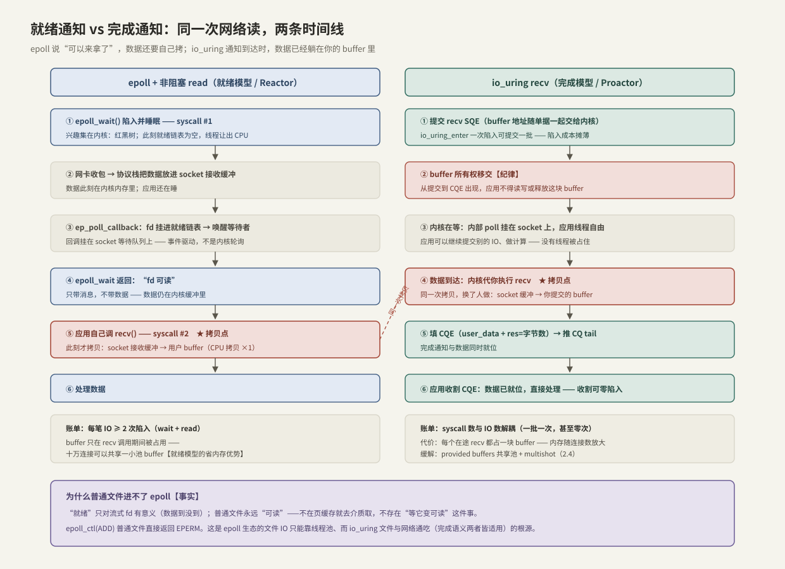

# io_uring 与 epoll 对比

> 一句话的分野：**epoll 说「可以来拿了」，io_uring 说「已经放进你手里了」**。前者是就绪通知（readiness），后者是完成通知（completion）——通知语义不同，决定了数据拷贝的时机、buffer 的生命周期、每笔 IO 的系统调用数，以及两者各自守住的地盘。

前置：[[2.1 SQ CQ 模型]]、[[13.4 epoll模型]]（epoll 本体）、[[13.6 Reactor模式与EventLoop]]（就绪模型的工程形态）。

---

## 1. 两种通知语义

**【事实】** 两个模型回答的是不同的问题：

- **就绪通知**：「这个 fd 上现在做 IO 不会阻塞了」——内核只报信，IO 本身（以及那次拷贝）还得应用自己做；
- **完成通知**：「你要的 IO 已经做完了」——通知到达时，数据已经在应用提交的 buffer 里（或已写出）。

同一次网络读，两条时间线摆在一起看：



**关键观察**：两条路径的**拷贝次数相同**（socket 接收缓冲 → 用户 buffer，各一次）——io_uring 不省拷贝，省的是**陷入次数**和「等待与执行之间的那次交接」。真正省拷贝的是 registered buffers / 零拷贝发送这类特性（[[2.4 polling 与 registered buffers]]）。

---

## 2. epoll 在内核里如何工作

复习 [[13.4 epoll模型]] 的机制，换成本专题的视角：

1. **兴趣集常驻内核**【实现】：`epoll_ctl` 把 fd 挂进红黑树，同时在该 fd 的等待队列上注册回调 `ep_poll_callback`；
2. **事件驱动，不是轮询**：协议栈收到数据 → 唤醒 socket 等待队列 → 回调把该 fd 挂进**就绪链表** → 唤醒 `epoll_wait`。这就是 epoll 对海量 fd 伸缩的原因——代价与「活跃 fd 数」而非「注册 fd 数」成正比；
3. **返回的只是消息**：`epoll_wait` 带回「哪些 fd 就绪」，数据仍在内核缓冲里，应用要再发一次 `read`/`recv` 把它拷出来——**每笔数据 ≥ 2 次陷入**。

### 为什么普通文件进不了 epoll

**【事实】** `epoll_ctl(ADD)` 一个普通文件会直接返回 `EPERM`。原因在语义：「就绪」只对流式 fd 有意义（对端数据到没到、缓冲有没有空位）；普通文件永远「可读」——数据不在页缓存就去介质取（[[1.2 Page Cache 命中与未命中]]），不存在「等它变可读」这件事。**等待在文件 IO 里是「取数据的过程」，不是「取数据前的状态」**——就绪模型对此无话可说。

推论：epoll 生态里磁盘 IO 只能丢给线程池同步做（muduo 也是这个做法）；而完成语义天然覆盖「过程」，所以 io_uring 文件与网络通吃。

---

## 3. io_uring 如何覆盖两个世界

**【实现】** io_uring 把「等就绪 + 做 IO」整体搬进内核，对外只暴露完成：

- **普通文件**：先试非阻塞完成（页缓存命中当场返回）；未命中则由 io-wq 工作线程走 1.8 的老路，或（较新内核、部分文件系统）用异步回调等页就绪——应用线程全程不被占用；
- **socket**：内核把内部 poll 挂在 socket 上，数据到达时**由内核代做 recv**（那次拷贝换了人做），随 CQE 一起交货。

本质：**epoll 把内核当传达室，io_uring 把内核当代办处**。

---

## 4. 逐维对比

| 维度 | epoll + 非阻塞 IO | io_uring |
| --- | --- | --- |
| 通知语义 | 就绪（可以做了） | 完成（已经做完） |
| 覆盖对象 | 网络/管道/eventfd 等流式 fd；普通文件 EPERM | 文件 + 网络统一，opcode 还含 fsync/accept/timeout…… |
| 每笔 IO 陷入 | ≥ 2（wait + read） | 摊薄到每批 1 次；SQPOLL + 忙收割可到 0 |
| 拷贝发生地 | 应用的第二次调用里 | 内核代做，随完成交货（次数不变） |
| buffer 生命周期 | 仅 read 调用期间 | 提交 → 完成 全程占用（所有权移交） |
| 编程模型 | Reactor（事件分发 + 回调） | Proactor（完成驱动） |
| 引入版本 | 2.6（2003） | 5.1（2019），特性随版本快速演进 |
| 生态 | 极成熟（muduo/nginx/redis……） | 渗透中（liburing、各语言 runtime） |

---

## 5. buffer 生命周期：被低估的代价【取舍】

第 4 节表里最不起眼、工程上最要命的一行：

- **epoll**：buffer 现借现还——十万连接可以共享一小池 buffer，因为任一时刻真正在 read 的连接只有几个；
- **io_uring**：每个在途 recv 都要**预挂一块独占 buffer**。十万连接每个挂 4 KiB，就是 400 MB 内存押在「可能永远不来的数据」上——这是海量低频连接场景下 io_uring 对 epoll 最大的劣势。

缓解手段（方向：把「每连接一块」变回「共享一池」）：**provided buffers**（提交时不指定 buffer，完成时内核从预注册池里挑一块告诉你用了哪块；5.19 起有更快的 ring-mapped 变体）与 **multishot recv/accept**（一次提交、多次完成，省掉重复提交）。细节归 [[2.4 polling 与 registered buffers]]。

---

## 6. 选型

**【取舍】** 面试高频题「为什么不全上 io_uring」的答案是分场景：

| 场景 | 选择 | 理由 |
| --- | --- | --- |
| 存储高 QD（本专题主场） | io_uring 无争议 | epoll 根本管不了普通文件；同步模型发不出并发（[[2.3 iodepth 与提交完成路径]]） |
| 海量连接、低频交互 | epoll 仍是主流 | 就绪模型省内存（第 5 节）、Reactor 生态成熟、团队心智现成 |
| 高吞吐网络后端/代理 | io_uring 渐进渗透 | 批量陷入 + multishot 有实测收益，值得灰度验证 |
| 受限部署环境 | 先查平台策略 | io_uring 曾是内核漏洞高发区，部分容器平台用 seccomp 默认禁用【事实】 |

**演进线的正确画法**：select → poll → epoll 解决的是「**监视 N 个 fd** 的伸缩性」（同一维度内的改良，[[13.5 串讲]]）；io_uring 解决的是另一个维度——「**每笔 IO 的固定成本与文件异步**」。它不是第四代 epoll，两者是正交问题的各自最优解，甚至可以组合（io_uring 里有 `IORING_OP_POLL_ADD`，epoll 的 fd 也能被 io_uring 监视）。

---

## 7. Modern C++：同一件事的两种骨架

同一个「收一段数据交给连接对象」，两种模型的形状（`Connection` 略去，重点看注释行）：

```cpp
// epoll：就绪后自己做 IO —— 每笔数据两次陷入
std::array<epoll_event, 64> evs;
const int n = ::epoll_wait(epfd, evs.data(), static_cast<int>(evs.size()), -1); // 陷入①
for (int i = 0; i < n; ++i) {
    auto& conn = *static_cast<Connection*>(evs[i].data.ptr);
    std::array<std::byte, 4096> buf;                          // buffer 现借现还（栈上即可）
    const ssize_t got = ::recv(conn.fd(), buf.data(), buf.size(), 0);  // 陷入②：此刻才拷贝
    if (got > 0) conn.on_data(std::span{buf.data(), static_cast<std::size_t>(got)});
}
```

```cpp
// io_uring：把「等就绪 + 做 IO」整体委托内核 —— 收割时数据已就位
io_uring_sqe* sqe = ::io_uring_get_sqe(&ring);
::io_uring_prep_recv(sqe, conn.fd(), conn.buf().data(), conn.buf().size(), 0);
::io_uring_sqe_set_data(sqe, &conn);          // 完成时对号入座
::io_uring_submit(&ring);                     // 一次陷入可携带一批提交

io_uring_cqe* cqe = nullptr;
::io_uring_wait_cqe(&ring, &cqe);
auto& done = *static_cast<Connection*>(::io_uring_cqe_get_data(cqe));
if (cqe->res > 0)                             // 数据早已在 done.buf() 里
    done.on_data(std::span{done.buf().data(), static_cast<std::size_t>(cqe->res)});
::io_uring_cqe_seen(&ring, cqe);
```

两处结构性差异：**buffer 的家**（栈上临时借用 vs 常驻 `Connection` 对象、在途期间不可动）；**控制流**（「事件→自己动手」vs「委托→验收回执」）。后者正是 Proactor：连接对象的生命周期管理因此更严格——在途 IO 未完成前对象不能析构，RAII 上要多想一层（对照 [[13.8 连接对象生命周期与RAII]]）。

---

## 8. 陷阱与误区

> [!warning] 常见错误
> 1. **「io_uring 一定比 epoll 快」**：低频小并发下两者陷入成本都可忽略，差距近零；io_uring 的收益要高 IOPS/高并发才兑现，而生态与调试成本是真实支出。
> 2. **拿 epoll 的习惯管 buffer**：epoll 下栈上临时 buffer 天经地义；io_uring 下同样写法是 use-after-return——在途 buffer 必须活到 CQE 出现。
> 3. **在 io_uring 里给 buffered 文件「等就绪」**：普通文件没有就绪可言，提交 poll 毫无意义；文件 IO 直接提交 read/write 即可。
> 4. **忽略部署环境**：目标平台可能 seccomp 禁用 io_uring；上线前先验证，别到灰度才发现 `ENOSYS`。
> 5. **把两者当竞争对手二选一**：同一进程里网络走 epoll、磁盘走 io_uring 是完全合理的过渡架构。

---

## 9. 关键结论

| 结论 | 性质 |
| --- | --- |
| epoll = 就绪通知（报信），io_uring = 完成通知（代办）——分野的根源 | 事实 |
| 两者拷贝次数相同；io_uring 省的是陷入与交接，不是拷贝 | 事实 |
| 普通文件无「就绪」语义（epoll_ctl 返回 EPERM）：epoll 管不了磁盘，io_uring 通吃 | 事实 |
| buffer 生命周期：epoll 现借现还，io_uring 提交到完成全程押住——海量连接下是内存账 | 事实 / 取舍 |
| select→poll→epoll 与 io_uring 解决的是正交问题；不是第四代 epoll | 观点（有依据） |
| 选型：存储高 QD 用 io_uring；海量低频连接 epoll 仍是正解；可混用 | 取舍 / 实践结论 |

---

## 关联知识

- [[2.1 SQ CQ 模型]] - io_uring 一侧的机制底座
- [[13.4 epoll模型]] / [[13.5 串讲]] - 就绪模型一侧的机制与演进线
- [[13.6 Reactor模式与EventLoop]] / [[13.8 连接对象生命周期与RAII]] - Reactor 工程形态与对象生命周期纪律
- [[2.4 polling 与 registered buffers]] - provided buffers / multishot：补齐 io_uring 网络短板的特性
- [[1.2 Page Cache 命中与未命中]] - 「文件为什么永远就绪」的存储侧解释
