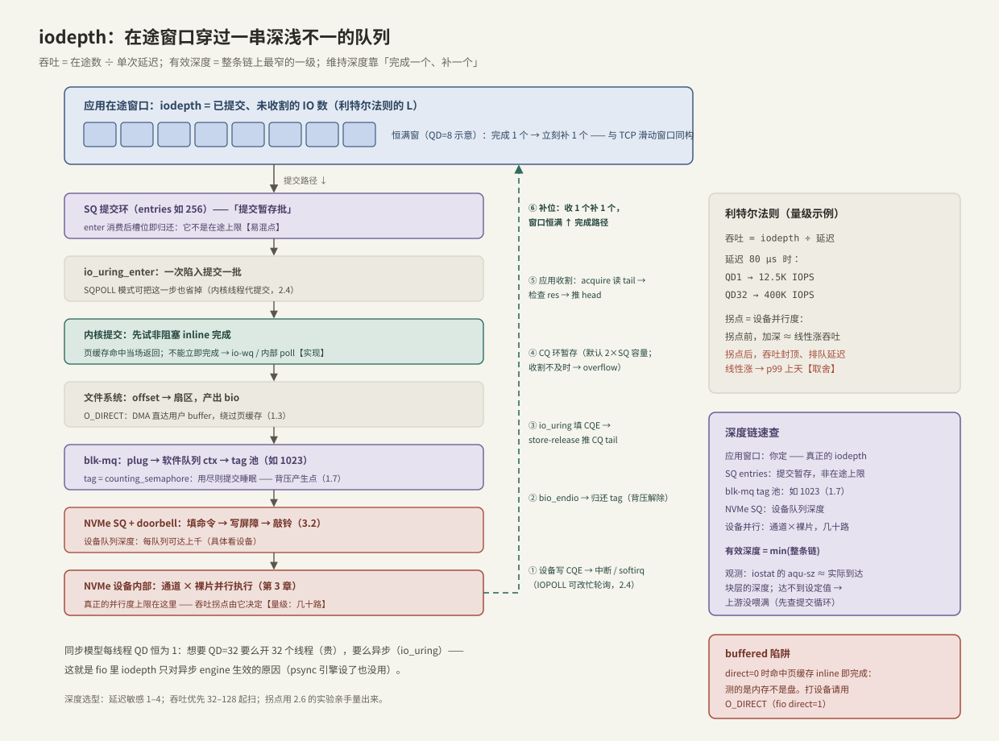

# iodepth 与提交完成路径

> iodepth 是存储性能的第一旋钮：**吞吐 = 在途数 ÷ 单次延迟**（利特尔法则，总纲和 1.7 各出场过一次，这是第三次）。但「在途数」不是设一个数字就有——它要由应用亲手维持，并穿过一串深浅不一的队列才落到设备。本篇把提交与完成两条路径逐段走通，回答「我设的 iodepth 到底落到了哪里」。

前置：[[2.1 SQ CQ 模型]]（两个环）、[[1.7 块层与 blk-mq]]（tag 池与背压）、[[1.8 一次 read write 全路径图]]（老路的每一步）。

---

## 1. iodepth 是什么，由谁维持

**【事实】** iodepth（队列深度，QD）= 某一时刻**已提交、尚未收割**的 IO 数——利特尔法则 `L = λ × W` 里的 L。

关键在「由谁维持」：

- **同步模型每线程 QD 恒为 1**：`pread` 返回前线程动弹不得。想要 QD=32，要么开 32 个线程（栈、调度、切换全要付费），要么换异步接口；
- **io_uring 里 QD 是应用自己记的账**：内核不替你维持窗口——提交多少、收回多少、何时补位，全在应用的循环里。这也是 fio 里 **iodepth 参数只对异步 engine（io_uring/libaio）生效**的原因【事实】：psync 引擎设了也没用，每 job 恒为 1。

---

## 2. 定量：深度-吞吐-延迟的三角

**【量级】** 沿用 1.7 的例子，NVMe 随机读延迟 80 μs：

```text
吞吐 = iodepth / 延迟
  QD1  → 1  / 80μs = 12.5K IOPS   （设备能力的零头）
  QD32 → 32 / 80μs = 400K IOPS    （接近设备并行度）
```

曲线形状只有三段【事实/取舍】：

1. **线性区**：拐点之前，加深 ≈ 线性涨吞吐——设备并行通道还没喂满，排队几乎不存在；
2. **拐点**：= 设备内部并行度（通道 × 裸片，几十路量级，第 3 章）；
3. **平台区**：拐点之后吞吐封顶，**多出来的深度全变成排队时间**——延迟随深度线性涨，p99 先崩。与线程池「任务堆积越深、单任务等待越久」完全同构。

选深度就是在这条曲线上选立足点：延迟敏感站线性区左端（QD 1–4），吞吐优先站拐点附近（QD 32–128 起扫）；拐点位置用 [[2.6 io_uring 延迟吞吐实验]] 亲手量出来，不背别人的数。

---

## 3. 提交路径：一个 SQE 落到设备的完整级联



对照左列自上而下（以 O_DIRECT 随机读为例）：

1. **应用在途窗口**：你的循环决定的真正 iodepth；
2. **SQ 提交环**：填 SQE → 推 tail。**易混点**【实现】：SQ entries 是「提交暂存批」的容量——enter 消费后槽位立刻归还，**它不是在途上限**（在途 IO 记录在内核里，不占 SQ 槽位）；实际在途数应留意别冲垮 CQ 容量（默认 2×SQ，[[2.1 SQ CQ 模型]] 第 6 节）；
3. **io_uring_enter**：一次陷入提交一批（SQPOLL 模式由内核线程代提交，连这次也省掉，[[2.4 polling 与 registered buffers]]）；
4. **内核提交**：先试非阻塞 inline 完成；不能立即完成 → io-wq / 内部 poll【实现】；
5. **文件系统**：offset 翻译成扇区，产出 bio（O_DIRECT 直达块层，DMA 目标就是用户 buffer，[[1.3 Buffered IO 与 O_DIRECT]]）;
6. **blk-mq**：plug → 软件队列 → **申请 tag**——tag 池（如 1023）是 `counting_semaphore`，用尽则提交睡眠，背压产生点（[[1.7 块层与 blk-mq]]）；
7. **NVMe SQ + doorbell**：填命令 → 写屏障 → 敲铃（[[3.2 Queue Pair 与 Doorbell]]）；
8. **设备内部**：通道 × 裸片并行执行——**吞吐拐点由这一级决定**。

**buffered 的岔路**【事实】：`direct=0` 时命中页缓存的读在第 4 步 inline 即完成，根本不下块层——你扫出来的「iodepth 曲线」测的是内存带宽不是盘。**打设备必须 O_DIRECT**（fio `direct=1`），这也是 [[9.1 fio Benchmark Matrix]] 的默认纪律。

---

## 4. 完成路径：CQE 逆流而上

对照图中右列自下而上：

1. **设备写 CQE** 到 NVMe CQ + phase 翻转 → 中断（IOPOLL 模式改为忙轮询设备 CQ，[[2.4 polling 与 registered buffers]]）；
2. **softirq**：`bio_endio` 回调链、归还 tag——1.7 的背压在此解除；
3. **io_uring 填 CQE**：res = 字节数或 -errno → store-release 推 CQ tail；
4. **CQ 环暂存**：完成先攒在环里，等应用来收——这就是异步的「解耦点」：完成不打断应用，应用按自己的节奏收割；
5. **应用收割**：acquire 读 tail → 逐条检查 res → 推 head。等待方式二选一【取舍】：`enter(GETEVENTS, min_complete=N)` 睡等（省 CPU）或纯用户态 peek 轮询（零陷入、低延迟、烧核）。

**批量效应**：完成同样是批的——一次唤醒往往能收走多个 CQE，中断/陷入成本在完成侧也被摊薄。

---

## 5. 深度链：你设的数字落在哪一级

从应用到介质，每一级都有自己的「深度」，**有效深度 = 整条链上最窄的一级**【事实】：

| 级 | 容量 | 角色 |
| --- | --- | --- |
| 应用在途窗口 | 你定（fio iodepth） | **真正的 QD 来源** |
| SQ entries | 建环参数（如 256） | 提交暂存批，非在途上限 |
| CQ entries | 默认 2×SQ | 完成暂存，收割不及时会 overflow |
| blk-mq tag 池 | 设备队列深度（如 1023） | 有界并发信号量，背压点 |
| NVMe SQ | 每队列可达上千 | 设备侧待办 |
| 设备内部并行 | 通道×裸片，几十路 | **吞吐拐点所在** |

两条工程推论：

- **把 iodepth 设到超过设备并行度太多没有意义**：多出的部分在 tag 池和设备 SQ 里排队，吞吐不变、p99 变差；
- **观测达成深度看 `iostat -x` 的 `aqu-sz`**（1.7 第 8 节）：它 ≈ 实际到达块层的在途数。设了 QD=32 而 aqu-sz 只有 3，说明**上游没喂满**——先查自己的提交循环（最常见：补位不及时），再怀疑设备。

---

## 6. 维持深度：完成驱动的补位循环

深度不是「设一次就在」的参数，而是**靠循环结构维持的不变量**。两种写法天差地别【取舍】：

- **batch-wait（错误示范）**：提交 32 个 → 等 32 个全完 → 再提交 32 个。窗口从 32 锯齿状衰减到 0 再跳回，平均深度只有一半左右，且末尾长尾期间设备空转；
- **恒满窗（正确）**：初始灌满 32 个，之后**每收 1 个 CQE 立刻补提交 1 个**——窗口恒为 32，与 TCP 滑动窗口同构。

```cpp
#include <liburing.h>

#include <algorithm>
#include <cstddef>
#include <cstdint>
#include <random>
#include <system_error>
#include <vector>

// 恒满窗随机读：初始灌满 depth 个，之后收 1 补 1（IoUring 见 2.1）
// 示例走 buffered 简化；打真实设备需 O_DIRECT + 对齐 buffer（对齐要求见 1.3）
void fixed_depth_random_read(IoUring& uring, int fd, unsigned depth,
                             std::size_t file_pages, int total) {
    std::vector<std::vector<std::byte>> bufs(depth, std::vector<std::byte>(4096));
    std::mt19937_64 rng{12345};
    std::uniform_int_distribution<std::size_t> pick{0, file_pages - 1};

    auto submit_one = [&](std::uint64_t slot) {           // slot = buffer 编号
        io_uring_sqe* sqe = ::io_uring_get_sqe(uring.get());
        const off_t off = static_cast<off_t>(pick(rng)) * 4096;
        ::io_uring_prep_read(sqe, fd, bufs[slot].data(), bufs[slot].size(), off);
        ::io_uring_sqe_set_data64(sqe, slot);
    };

    const unsigned window = std::min<unsigned>(depth, static_cast<unsigned>(total));
    for (std::uint64_t s = 0; s < window; ++s) submit_one(s);   // ① 灌满窗口
    ::io_uring_submit(uring.get());

    int submitted = static_cast<int>(window);
    for (int done = 0; done < total; ++done) {
        io_uring_cqe* cqe = nullptr;
        if (const int rc = ::io_uring_wait_cqe(uring.get(), &cqe); rc < 0)
            throw std::system_error{-rc, std::system_category(), "wait_cqe"};
        if (cqe->res < 0)
            throw std::system_error{-cqe->res, std::system_category(), "read"};
        const auto slot = ::io_uring_cqe_get_data64(cqe);       // ② 完成一个
        ::io_uring_cqe_seen(uring.get(), cqe);
        if (submitted < total) {                                // ③ 立刻补位：
            submit_one(slot);                                   //    复用刚空出的 buffer
            ::io_uring_submit(uring.get());
            ++submitted;
        }
    }
}
```

结构要点：**buffer 池大小 = 窗口大小**（在途 IO 各占一块，天然无争用）；**收割优先于提交**（防 CQ overflow）；`submit_one(slot)` 复用刚完成的槽位——所有权从内核收回后立刻再交出去。

---

## 7. 怎么选 iodepth【取舍】

| 负载 | 起点 | 理由 |
| --- | --- | --- |
| 延迟敏感（在线服务尾延迟） | QD 1–4 | 站线性区左端，杜绝排队延迟 |
| 吞吐优先（扫描/备份/训练数据读取） | QD 32–128 扫描找拐点 | 喂饱设备并行度为止 |
| 多线程 | 每线程独立环，`总深度 = numjobs × iodepth` | 环是 SPSC 的，跨线程共享一个环得加锁——违背设计初衷 |

配套纪律：加深之后**必须同时看 p99**（吞吐涨 5% 换 p99 翻倍通常是亏的，[[9.5 p99 毛刺定位]]）；扫描方法与完整矩阵在 [[9.1 fio Benchmark Matrix]] 与 [[2.6 io_uring 延迟吞吐实验]]。

---

## 8. 陷阱与误区

> [!warning] 常见错误
> 1. **buffered 模式扫 iodepth**：页缓存命中 inline 即完成，测的是内存不是盘——`direct=1` 是深度实验的前提。
> 2. **把 SQ entries 当在途上限**（或反过来用它「限流」）：SQ 只是提交暂存批；窗口是应用记的账，限流靠自己的计数器。
> 3. **batch-wait 写法**：提交一批等全完，平均深度腰斩、设备周期性空转——收 1 补 1 才是恒满窗。
> 4. **iodepth 无脑拉满**：拐点之后只添排队；p99 换吞吐是取舍不是免费午餐。
> 5. **不验证达成深度**：设了 ≠ 达到了；`aqu-sz` 远低于设定值时，瓶颈在你的提交循环，不在设备。

---

## 9. 关键结论

| 结论 | 性质 |
| --- | --- |
| iodepth = 已提交未收割的在途数；异步接口下由应用的循环维持，不是设一次就有的参数 | 事实 |
| 吞吐 = iodepth ÷ 延迟；拐点 = 设备并行度；拐点后加深只涨 p99 | 事实 / 取舍 |
| SQ entries 是提交暂存批容量，不是在途上限；在途账在应用手里 | 事实（易混点） |
| 有效深度 = 深度链最窄一级；达成情况用 aqu-sz 验证 | 事实 / 实践结论 |
| 恒满窗（收 1 补 1）优于 batch-wait；buffer 池 = 窗口大小 | 实践结论 |
| 深度实验必须 O_DIRECT；加深必须同时看 p99 | 实践结论 |

---

## 关联知识

- [[2.1 SQ CQ 模型]] - 窗口穿过的头两级：SQ 与 CQ
- [[1.7 块层与 blk-mq]] - tag 池：深度链上的背压点
- [[1.3 Buffered IO 与 O_DIRECT]] - buffered 岔路与 O_DIRECT 对齐要求
- [[3.2 Queue Pair 与 Doorbell]] - 深度链的最后两级：NVMe SQ 与设备并行
- [[2.6 io_uring 延迟吞吐实验]] - 亲手扫出你机器的拐点
- [[9.1 fio Benchmark Matrix]] / [[9.5 p99 毛刺定位]] - 深度实验的工具与验收标准
