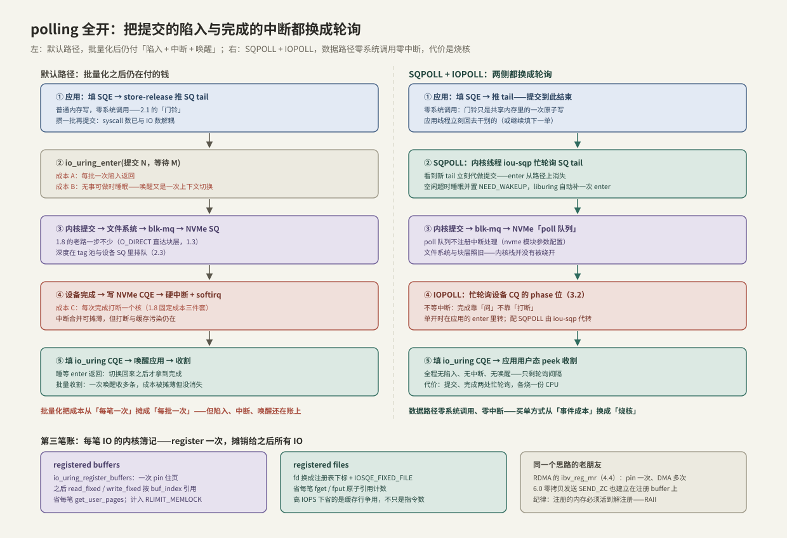

---
tags:
  - 高性能存储/io_uring
---
# polling 与 registered buffers

> 2.1 把「每笔 IO 一次系统调用」压成「每批一次」，但高 IOPS 路径上还剩三笔与数据量无关的账：**提交侧那次 `io_uring_enter`、完成侧的中断与唤醒、每笔 IO 重复的内核簿记**（pin 页、fd 引用计数）。本篇的三组开关对着三笔账各拧一刀：SQPOLL 让提交零陷入，IOPOLL 让完成零中断，registered buffers/files 把每笔簿记摊销成一次注册——全开之后数据路径可以一次系统调用都没有，买单方式从「事件成本」换成「烧核」。

前置：[[2.1 SQ CQ 模型]]（两个环与 enter 的角色）、[[2.3 iodepth 与提交完成路径]]（提交/完成两条路径）、[[1.8 一次 read write 全路径图]]（固定成本三件套：陷入、切换、中断）。

---

## 1. 批量化之后，还剩哪三笔账

**【事实】** 默认玩法已经把 syscall 数与 IO 数解耦，但对照 1.8 的固定成本清单，路径上仍有三处「与数据量无关」的支出：

| # | 成本 | 发生在哪 | 对应开关 |
| --- | --- | --- | --- |
| A | 每批一次 `io_uring_enter` 陷入 + 睡等唤醒的上下文切换 | 提交侧 | SQPOLL |
| B | 每次完成一次硬中断 + softirq + 唤醒切换 | 完成侧 | IOPOLL |
| C | 每笔 IO 的内核簿记：`get_user_pages` pin 页、`fget/fput` 引用计数 | 每笔提交内部 | registered buffers / files |

**【量级】** 三笔账都是微秒/亚微秒级每次。设备延迟几十 μs、QD 不高时它们淹没在噪声里；但 4 KiB 随机读冲到几十万、上百万 IOPS 时，每笔省 1–2 μs 就是省出整颗核。**这是一组「削峰值成本」的开关，不是日常默认**——普通负载开了只多烧电【取舍】。

---

## 2. SQPOLL：提交侧连最后一次陷入也省掉

### 2.1 机制

**【事实】** `IORING_SETUP_SQPOLL` 建环后，内核为这个环配一个专职轮询线程（名字形如 `iou-sqp-<pid>`，`top` 里挂在你的进程下）：

1. 应用照常填 SQE、store-release 推 SQ tail——**到此提交已经完成**，不再需要调 enter；
2. `iou-sqp` 线程忙轮询 SQ tail，看到新条目立刻消费提交——SQ 环的消费者从「enter 的调用路径」换成了这个常驻内核线程；
3. 空闲超过 `sq_thread_idle` 毫秒后线程睡眠，并在 SQ ring flags 里置 `IORING_SQ_NEED_WAKEUP`；应用推完 tail 后检查该标志，需要时补一次 `io_uring_enter(IORING_ENTER_SQ_WAKEUP)` 把它叫醒。**liburing 的 `io_uring_submit` 已封装这个判断**（[[2.5 liburing 基础用法]]），裸用 syscall 才需要自己写。

**门槛随版本放宽**【事实】：5.1 引入时要求 `CAP_SYS_ADMIN` 且文件必须走 registered files；5.11 起普通 fd 可用、`CAP_SYS_NICE` 即可；5.13 起无需任何特权。

### 2.2 取舍

- **买到**：提交路径零系统调用；新 SQE 被发现的延迟从「下次 enter」缩到轮询间隔（亚微秒级）；
- **付出**：一颗核接近 100% 忙转（`sq_thread_idle` 的睡眠只在负载完全断流时兑现）。用 `sq_thread_cpu` + `IORING_SETUP_SQ_AFF` 把它钉在专用核上，别和业务线程抢；
- 多个环可以共享同一个轮询线程（`IORING_SETUP_ATTACH_WQ`），多环场景不必一环烧一核【实现】。

---

## 3. IOPOLL：完成侧不睡、不等中断

### 3.1 机制

**【事实】** `IORING_SETUP_IOPOLL` 把完成的发现方式从「设备发中断」换成「内核忙轮询设备 CQ 的 phase 位」（[[3.2 Queue Pair 与 Doorbell]]）：

- 请求下发到 blk-mq 的 **poll 队列**——一类不注册中断处理函数的硬件队列，需要 NVMe 驱动预先配出来（`nvme.poll_queues=N` 模块参数）【实现】；
- 轮询发生在哪：单开 IOPOLL 时，在应用自己的 `io_uring_enter(GETEVENTS)` 里转——「睡等」换成「内核态忙转」；与 SQPOLL 同开时由 `iou-sqp` 代转，应用纯用户态 peek 收割，形成零陷入零中断的闭环（§6 的图）；
- **前提**：文件必须 `O_DIRECT` 打开（buffered 路径完成在页缓存层，没有「设备 CQ」可轮，[[1.3 Buffered IO 与 O_DIRECT]]），且该环只能提交可轮询的 opcode（read/write 族；socket 一律不行），违反返回 `-EINVAL`【事实】。

### 3.2 为什么删中断值得【取舍】

中断的隐性成本：打断正在跑的核（现场保存恢复 + 缓存/TLB 污染）、softirq 调度、唤醒切换，外加睡等期间核进低功耗状态后的唤醒延迟——合计几 μs 且**抖动大**。设备越快占比越高：对几十 μs 的盘是零头，对几 μs 级的顶级 NVMe 是延迟的两位数百分比。IOPOLL 把这一段换成确定性的轮询循环，所以典型收益是**平均延迟小降、p99 明显变稳**。内核另有 hybrid polling（先睡预期完成时长的一部分再开始轮）作为「纯烧核」与「纯中断」之间的折中【实现·随版本演进】。

---

## 4. registered buffers / files：把每笔簿记摊成一次注册

### 4.1 每笔 IO 内核在重复做什么

**【事实】** 一笔 O_DIRECT 读的隐藏流程里有两件「每笔都做、每笔都一样」的事：

1. 按 fd 找到 file 对象并 `fget` 加引用（完成时 `fput`）——原子操作，高 IOPS 多核下大家争同一条缓存行；
2. `get_user_pages`：查页表、pin 住用户 buffer 对应的物理页、构造 bio_vec（完成时解 pin）——DMA 的前提是页不许换出、物理地址已知。

典型的可摊销成本：既然每次结果一样，就该只做一次。

### 4.2 注册 = 预付

| 注册什么 | 调用 | 之后怎么用 | 省掉什么 |
| --- | --- | --- | --- |
| buffer | `io_uring_register_buffers`（iovec 数组） | `prep_read_fixed` / `prep_write_fixed` + `buf_index` | 每笔 pin/解 pin 与地址翻译 |
| 文件 | `io_uring_register_files`（fd 数组） | SQE 置 `IOSQE_FIXED_FILE`，fd 字段填注册表下标 | 每笔 `fget/fput` |

三条边界：

- 注册的内存被 pin 在物理内存里，计入 `RLIMIT_MEMLOCK`——注册返回 `-ENOMEM` 时先查 `ulimit -l`【事实】；
- buffer 生命周期纪律再升一级：2.1 是「活到对应 CQE」，注册后是「活到解注册/环销毁」——正是 RAII 的用武之地（§8）；
- **同款思路的老朋友**：RDMA 的 `ibv_reg_mr`（[[4.4 内存注册与零拷贝]]）——pin 一次、DMA 多次，「注册换速度」是高性能 IO 的通用模式；6.0 的零拷贝发送（`SEND_ZC`）也建立在注册 buffer 之上【事实】。

---

## 5. 网络侧的两个亲戚：provided buffers 与 multishot

[[2.2 io_uring 与 epoll 对比]] 第 5 节留的口子在这里收。这两个特性解决的是网络场景的两笔账：「每个在途 recv 押一块独占 buffer 太贵」与「每次完成都要重新提交太勤」【事实】：

- **provided buffers**：提交 recv 时不指定 buffer（`IOSQE_BUFFER_SELECT`），完成时内核从预注册的 buffer 池里挑一块，CQE flags 里带回「用了哪块」——「每在途一块押金」变回「共享一池」。5.19 起的 buffer ring（`io_uring_register_buf_ring`）把池本身也做成无锁环形队列，归还 buffer 零系统调用；
- **multishot**：accept（5.19 起）与 recv（6.0 起）支持一次提交、多次完成——每个 CQE 置 `IORING_CQE_F_MORE` 表示「后面还有」，直到出错或被取消。「完成一次、重提一次」的循环也被省掉。

存储主线用不到它们，但要认得出：**与 registered buffers 是同一动机（摊销每笔成本）在网络语境下的变体**。

---

## 6. 全开之后：一笔读的端到端路径



对照右列走一遍：应用填 SQE、推 tail（①）→ `iou-sqp` 发现新单代做提交（②）→ 文件系统、blk-mq 照旧，落到不挂中断的 poll 队列（③）→ 完成靠轮询设备 CQ 的 phase 位发现（④）→ 填 io_uring CQE，应用用户态 peek 直接收割（⑤）。**稳态下整条数据路径没有一次系统调用、没有一次中断、没有一次唤醒**。

**边界【取舍】**：这套「全开」≈ **半个 SPDK**——事件成本清零了，但每笔 IO 仍穿过文件系统、块层、NVMe 驱动的内核代码；[[5.6 SPDK 用户态驱动]] 连这一段也删掉（驱动搬进用户态），代价是放弃文件系统、页缓存与内核的多租户仲裁（[[5.7 内核态 vs 用户态路径]]）。io_uring polling 是「留在内核生态里所能到达的最远处」。

---

## 7. 组合矩阵：谁该开什么【取舍】

| 场景 | 建议组合 | 理由 |
| --- | --- | --- |
| 存储引擎核心 IO 线程（延迟敏感、可独占核） | SQPOLL + IOPOLL + registered 全开 | 买尾延迟与单核 IOPS 上限；专用机上烧核是合理支出 |
| 高吞吐但 CPU 紧张 | 只开 registered buffers/files | 省每笔簿记、不烧核，收益无条件 |
| 普通业务负载 | 全不开 | 批量 enter 已够；polling 只多烧电 |
| 共享/多租户机器 | 慎开 SQPOLL | 一颗核常年 100%，吓坏监控、挤压邻居 |

**【量级】** io_uring 作者的 `t/io_uring` 压测（2021–2022，5.16+ 内核 + 顶级 NVMe）把 4 KiB 随机读推到**单核千万级 IOPS**，靠的正是 SQPOLL + IOPOLL + registered 全开加批量收割——每笔 IO 的 CPU 成本被压到亚微秒。具体数字随内核与硬件变，量级可作上限参照。

---

## 8. Modern C++：开关落到代码

三个开关都是「建环/注册期一次性动作」，天然适合用构造函数固化：

```cpp
#include <liburing.h>

#include <cstddef>
#include <cstdlib>
#include <memory>
#include <new>
#include <span>
#include <system_error>
#include <vector>

// 带 params 的建环：在 2.1 IoUring 的基础上打开 SQPOLL
class PolledRing {
public:
    PolledRing(unsigned entries, unsigned idle_ms) {
        io_uring_params p{};
        p.flags = IORING_SETUP_SQPOLL;   // 内核线程代提交（§2）
        p.sq_thread_idle = idle_ms;      // 空闲多久后睡眠、置 NEED_WAKEUP
        if (const int rc = ::io_uring_queue_init_params(entries, &ring_, &p); rc < 0)
            throw std::system_error{-rc, std::system_category(), "queue_init_params"};
    }
    PolledRing(const PolledRing&) = delete;
    PolledRing& operator=(const PolledRing&) = delete;
    ~PolledRing() { ::io_uring_queue_exit(&ring_); }
    io_uring* get() noexcept { return &ring_; }

private:
    io_uring ring_{};
};

// O_DIRECT 对齐 buffer 池：分配一次、注册一次，析构时解注册
class RegisteredBuffers {
public:
    // size 需为 4096 的倍数（aligned_alloc 的要求，也是 O_DIRECT 的对齐要求，1.3）
    RegisteredBuffers(io_uring* ring, std::size_t count, std::size_t size) : ring_{ring} {
        std::vector<iovec> iov(count);
        for (std::size_t i = 0; i < count; ++i) {
            void* p = std::aligned_alloc(4096, size);
            if (p == nullptr) throw std::bad_alloc{};
            bufs_.emplace_back(static_cast<std::byte*>(p));
            iov[i] = {.iov_base = p, .iov_len = size};
        }
        if (const int rc = ::io_uring_register_buffers(ring_, iov.data(),
                                                       static_cast<unsigned>(iov.size())); rc < 0)
            throw std::system_error{-rc, std::system_category(),
                                    "register_buffers（-ENOMEM 先查 RLIMIT_MEMLOCK）"};
    }
    RegisteredBuffers(const RegisteredBuffers&) = delete;
    RegisteredBuffers& operator=(const RegisteredBuffers&) = delete;
    ~RegisteredBuffers() { ::io_uring_unregister_buffers(ring_); }

    std::span<std::byte> at(std::size_t i, std::size_t size) noexcept {
        return {bufs_[i].get(), size};
    }

private:
    struct Free { void operator()(std::byte* p) const noexcept { std::free(p); } };
    io_uring* ring_;
    std::vector<std::unique_ptr<std::byte, Free>> bufs_;
};

// 一笔 fixed read：fd 与 buffer 都用「注册版」——两个下标替代两次每笔簿记
void submit_fixed_read(io_uring* ring, int file_index, std::span<std::byte> buf,
                       unsigned buf_index, off_t off) {
    io_uring_sqe* sqe = ::io_uring_get_sqe(ring);   // 满则返回 nullptr，处理见 2.1
    ::io_uring_prep_read_fixed(sqe, file_index, buf.data(), buf.size(), off, buf_index);
    sqe->flags |= IOSQE_FIXED_FILE;                 // fd 字段解释为注册表下标
    ::io_uring_sqe_set_data64(sqe, buf_index);
    ::io_uring_submit(ring);   // SQPOLL 下通常零陷入：只在 NEED_WAKEUP 时补一次 enter
}
```

**关键点**：

- `PolledRing` 把 SQPOLL 的配置固化在构造期——环的「运行模式」不该在运行中漂移；
- `RegisteredBuffers` 的析构顺序有讲究：它持有环指针，必须**先于环销毁**（组合进同一对象时按成员声明顺序倒序析构即可保证）。环销毁其实会连带解注册，但显式配对让依赖看得见；
- `prep_read_fixed` 里 buffer 地址仍要传——内核用 `buf_index` 找到注册记录做校验与翻译，地址必须落在该注册区间内【实现】。

---

## 9. 陷阱与误区

> [!warning] 常见错误
> 1. **裸 syscall 用 SQPOLL 却不管 `NEED_WAKEUP`**：idle 睡眠后没人消费 SQ，环「停摆」，提交石沉大海。liburing 用户不会踩，但要知道是它替你判断的。
> 2. **IOPOLL 环里混入 buffered fd 或 socket**：返回 `-EINVAL`。IOPOLL 是 O_DIRECT 存储 IO 专用开关，不是通用加速键。
> 3. **把 polling 当吞吐开关**：平台区吞吐由设备并行度决定（[[2.3 iodepth 与提交完成路径]]），polling 买的是延迟与每笔 CPU 成本；浅 QD 下延迟降会带着 IOPS 同比例涨，别把账记错科目。
> 4. **注册 buffer 后当普通内存管理**：提前释放是 use-after-free；注册量超 `RLIMIT_MEMLOCK` 注册直接失败；忘记解注册则页一直被 pin 着。
> 5. **共享机器上默认开 SQPOLL**：常驻 100% 的核会触发误报警、挤压邻居配额——先确认这颗核是你的。
> 6. **不做基准就全开**：每个开关都有代价，收益必须在自己的机器上量出来（[[2.6 io_uring 延迟吞吐实验]]）。

---

## 10. 关键结论

| 结论 | 性质 |
| --- | --- |
| 批量化后还剩三笔固定成本：enter 陷入、完成中断、每笔簿记——三组开关各对一笔 | 事实 |
| SQPOLL：内核线程代提交，提交零陷入；idle 睡眠靠 NEED_WAKEUP 协议衔接 | 事实 |
| IOPOLL：轮询设备 CQ 替代中断，O_DIRECT 专用；买的是平均小降、p99 变稳 | 事实 / 取舍 |
| registered buffers/files = pin 一次、用 N 次；与 RDMA 内存注册同一模式 | 事实 |
| provided buffers / multishot 是同一摊销思路的网络变体 | 事实 |
| polling 全开 ≈ 半个 SPDK：事件成本清零，内核栈还在 | 观点（有依据） |
| 开关按场景选、收益按实验验：烧核换延迟只在专用核上划算 | 取舍 / 实践结论 |

---

## 关联知识

- [[2.1 SQ CQ 模型]] - 默认路径与 NEED_WAKEUP 所在的环协议
- [[2.3 iodepth 与提交完成路径]] - 提交/完成两条路径：开关分别改了哪一段
- [[1.8 一次 read write 全路径图]] - 三笔固定成本的出处
- [[1.3 Buffered IO 与 O_DIRECT]] - IOPOLL 与 registered buffers 的 O_DIRECT 前提
- [[3.2 Queue Pair 与 Doorbell]] - IOPOLL 轮询的对象：设备 CQ 与 phase 位
- [[4.4 内存注册与零拷贝]] - registered buffers 的 RDMA 同款
- [[5.6 SPDK 用户态驱动]] / [[5.7 内核态 vs 用户态路径]] - 「全开」之后的下一站
- [[2.5 liburing 基础用法]] - 这些开关在 liburing 里的落点
- [[2.6 io_uring 延迟吞吐实验]] - 用数据验证每个开关的收益
