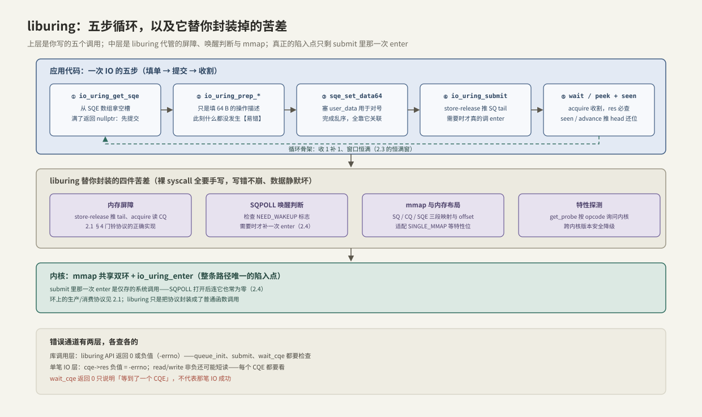

---
tags:
  - 高性能存储
  - io_uring
---
# liburing 基础用法

> 2.1 讲机制、2.4 讲开关，这一篇回到手上：liburing 是 io_uring 作者 Jens Axboe 维护的官方用户态库，把三段 mmap、内存屏障、SQPOLL 唤醒判断这些「协议细节」封装成十几个函数。日常与 io_uring 打交道，liburing 覆盖绝大多数场景——本篇按「建环 → 五步循环 → 收割姿势 → 依赖链 → 特性探测」给出一份工程手册，每个函数都能对回 2.1 里环上的那个动作。

前置：[[2.1 SQ CQ 模型]]（协议本体——liburing 每个函数都在操作那两个环）、[[2.4 polling 与 registered buffers]]（params 里那些开关的含义）。

---

## 1. 为什么用 liburing，而不是裸系统调用

**【事实】** 裸用三个系统调用要自己做的事：`io_uring_setup` 之后按内核返回的 offset 手动 mmap 三段区域、按 head/tail/mask 手写环操作、在正确的位置插入 acquire/release 屏障、SQPOLL 下自己判断 `NEED_WAKEUP`。这些全是「写错不崩溃、数据静默坏」的雷区——屏障漏一个，问题只在高并发下偶现。

liburing 的价值就是把雷区收编【事实】：

- 与内核同仓演进（作者同一人），新 opcode 的封装函数与内核特性同步发布；
- 安装即用：`apt install liburing-dev`（或对应发行版包），头文件 `<liburing.h>`，链接 `-luring`；
- **两层版本面要分清**【易混】：内核版本决定「有没有这个能力」，liburing 版本决定「有没有封装函数」。函数能编译通过 ≠ 运行的内核支持（运行时探测见 §7）。

---

## 2. 建环与销毁

### 2.1 io_uring_queue_init

```cpp
io_uring ring;
if (const int rc = ::io_uring_queue_init(256, &ring, 0); rc < 0)
    throw std::system_error{-rc, std::system_category(), "queue_init"};
// ... 使用 ...
::io_uring_queue_exit(&ring);   // munmap + close，与 init 严格配对
```

**关键点**：

- `entries` 是 SQ 容量，内核圆整到 2 的幂；CQ 默认 2 倍（[[2.1 SQ CQ 模型]] 第 6 节），想单独指定用 `IORING_SETUP_CQSIZE`；
- 返回值是 liburing 的通用约定：**0 成功，负值 = -errno**——没有全局 errno 可看；
- 生命周期用 RAII 包住（2.1 的 `IoUring` 类就是对这一对函数的封装）。

### 2.2 io_uring_queue_init_params：开开关、读特性

[[2.4 polling 与 registered buffers]] 里的开关都从这里进：

```cpp
io_uring_params p{};
p.flags = IORING_SETUP_SQPOLL;          // 见 2.4；不开任何 flag 就是默认模式
p.sq_thread_idle = 2000;
if (const int rc = ::io_uring_queue_init_params(256, &ring, &p); rc < 0)
    throw std::system_error{-rc, std::system_category(), "queue_init_params"};
if (p.features & IORING_FEAT_NODROP) { /* 内核会暂存 CQ 溢出，收割压力可放宽一档 */ }
```

`params` 是双向的【事实】：进去的是你要的 flags，**回来的 `features` 位图是内核的自我介绍**（`SINGLE_MMAP`、`NODROP`、`SUBMIT_STABLE`……）——按位判断，别按内核版本号猜。

---

## 3. 五步核心循环



每一步对应 2.1 里环上的一个动作：

| 步 | 函数 | 它在环上做了什么 |
| --- | --- | --- |
| ① | `io_uring_get_sqe` | 按 head/tail 从 SQE 数组拿空槽；**满了返回 `nullptr`**，先 submit 腾位 |
| ② | `io_uring_prep_read` 等 | 只是往 64 字节的 SQE 里填字段——**普通内存写，此刻什么都没发生** |
| ③ | `io_uring_sqe_set_data64` | 填 `user_data`：完成乱序，全靠它对号入座 |
| ④ | `io_uring_submit` | store-release 推 SQ tail；再判断要不要真的调 `enter`（SQPOLL 下查 `NEED_WAKEUP`） |
| ⑤ | `io_uring_wait_cqe` / `peek` + `cqe_seen` | acquire 读 CQ 收割；`seen` 推 head 归还槽位 |

两个最容易建立错的心智模型【易错】：

- **prep ≠ 提交**：②③ 只是填表格，④ 才发布。prep 完忘了 submit，程序会在 ⑤ 永远等下去；
- **submit ≠ 每次陷入**：liburing 只在「有新条目且需要通知内核」时才调 enter——攒批的收益是它替你兑现的。

最小可运行的完整循环（批量读 + 恒满窗）已在 [[2.1 SQ CQ 模型]] §7 和 [[2.3 iodepth 与提交完成路径]] §6 给出，不重复；本篇补的是循环之外的姿势。

---

## 4. prep 家族速查

**【事实】** SQE 的 `opcode` 决定「做什么」，每个 opcode 配一个 `io_uring_prep_*`。按类记，不按条背：

| 类别 | 常用 prep | 备注 |
| --- | --- | --- |
| 文件读写 | `read` / `write` / `readv` / `writev` / `read_fixed` / `write_fixed` | 非向量版 5.6 起；`*_fixed` 配 registered buffers（[[2.4 polling 与 registered buffers]]） |
| 持久化 | `fsync`（可带 `IORING_FSYNC_DATASYNC`）/ `sync_file_range` | 语义对齐 [[1.4 fsync fdatasync 与持久化语义]] |
| 文件生命周期 | `openat` / `close` / `statx` / `fallocate` | 连 open/close 都能异步化（5.6 起） |
| 网络 | `accept` / `connect` / `send` / `recv` / `sendmsg` / `recvmsg` / `shutdown` | multishot 变体见 2.4 §5 |
| 控制 | `nop` / `timeout` / `link_timeout` / `poll_add` / `cancel` | `nop` 是压测环本身开销的标尺 |

**门面统一是 io_uring 的卖点**【事实】：一切「能等的事」都变成一种 SQE，一个循环收割所有类型的完成——这是 [[2.2 io_uring 与 epoll 对比]] 里「文件网络通吃」的工程形态。

---

## 5. 收割的几种姿势【取舍】

| 函数 | 行为 | 用在哪 |
| --- | --- | --- |
| `io_uring_wait_cqe` | 睡等 1 个 | 最简单；每条各一次屏障开销 |
| `io_uring_peek_cqe` | 不睡，没有就返回 `-EAGAIN` | 忙轮询收割（2.4 的零陷入闭环） |
| `io_uring_wait_cqe_timeout` | 睡等带超时 | 事件循环要定期干别的事 |
| `io_uring_wait_cqes` | 睡等至少 N 个 | 攒批处理，减少唤醒次数 |
| `io_uring_submit_and_wait` | 提交 + 等待合并成一次 enter | 恒满窗循环的最省写法 |
| `io_uring_for_each_cqe` + `cq_advance` | 遍历当前所有完成，一次性还位 | **批量收割首选**：N 条完成只付一次屏障 |

批量收割的形状：

```cpp
// 一次屏障收走 CQ 里当前所有完成；返回收了几条
unsigned reap_all(io_uring* ring) {
    io_uring_cqe* cqe = nullptr;
    unsigned head = 0, count = 0;
    io_uring_for_each_cqe(ring, head, cqe) {      // 宏：只读遍历，不动 head
        const auto id = ::io_uring_cqe_get_data64(cqe);
        if (cqe->res < 0) on_error(id, -cqe->res);   // 每条的 res 都要查
        else              on_done(id, cqe->res);
        ++count;
    }
    ::io_uring_cq_advance(ring, count);           // 一次推 head，归还 count 个槽位
    return count;
}
```

**关键点**：`for_each_cqe` 遍历期间 CQE 仍属于环，处理完才 `cq_advance`；比逐条 `cqe_seen` 少 N−1 次屏障——高 IOPS 收割循环的标准写法。

---

## 6. 依赖链：IOSQE_IO_LINK 与超时

**【事实】** 完成天然乱序（[[2.1 SQ CQ 模型]] 第 6 节），想要「A 完成后才执行 B」不必回到同步等待——`IOSQE_IO_LINK` 把相邻 SQE 串成链：链内严格按序执行；**前项失败（含短读短写），后项以 `-ECANCELED` 完成**。

最有存储味的用法——write 与 fsync 串链，这正是 WAL 提交的形状（[[6.1 WAL 与 Crash Consistency]]）：

```cpp
#include <liburing.h>

#include <cstddef>
#include <span>
#include <system_error>

// 追加一条记录并持久化：一次 submit、两个 CQE
// 链语义保证 fsync 在 write 之后执行；write 失败则 fsync 返 -ECANCELED
void append_durable(io_uring* ring, int fd, std::span<const std::byte> record, off_t off) {
    io_uring_sqe* w = ::io_uring_get_sqe(ring);   // 示例假定 SQ 有空位（nullptr 处理见 2.1）
    ::io_uring_prep_write(w, fd, record.data(), record.size(), off);
    ::io_uring_sqe_set_data64(w, 1);
    w->flags |= IOSQE_IO_LINK;                    // 与下一条串成链

    io_uring_sqe* f = ::io_uring_get_sqe(ring);
    ::io_uring_prep_fsync(f, fd, IORING_FSYNC_DATASYNC);   // = fdatasync 语义（1.4）
    ::io_uring_sqe_set_data64(f, 2);

    if (const int n = ::io_uring_submit(ring); n < 0)
        throw std::system_error{-n, std::system_category(), "submit"};

    for (int i = 0; i < 2; ++i) {                 // 两个 CQE 都要收、都要查
        io_uring_cqe* cqe = nullptr;
        if (const int rc = ::io_uring_wait_cqe(ring, &cqe); rc < 0)
            throw std::system_error{-rc, std::system_category(), "wait_cqe"};
        if (cqe->res < 0)
            throw std::system_error{-cqe->res, std::system_category(),
                                    ::io_uring_cqe_get_data64(cqe) == 1 ? "write" : "fsync"};
        ::io_uring_cqe_seen(ring, cqe);
    }
}
```

**关键点**：

- 链只在**同一次提交批内**通过相邻 SQE 表达：`LINK` 标志作用于「本条与下一条」；
- 短写也断链【易错】：write 的 `res` 小于请求长度算失败处理，别只判负值；
- `prep_link_timeout` 可以挂在链上任意一项后面，给该项加超时——异步世界的「带 deadline 的 IO」；
- 另有 `IOSQE_IO_DRAIN`（等之前所有 SQE 完成后才执行本条），代价大，偶用于 barrier 语义【实现】。

---

## 7. 特性探测：跨内核版本活下来

io_uring 特性随版本快速演进，**上线机器的内核 ≠ 开发机器的内核**。运行时探测是纪律【实践】：

```cpp
io_uring_probe* probe = ::io_uring_get_probe();   // 询问当前内核
const bool has_openat = probe != nullptr &&
                        ::io_uring_opcode_supported(probe, IORING_OP_OPENAT);
::io_uring_free_probe(probe);
// 不支持则降级：回退同步 open，或换实现路径
```

配合 §2 的 `params.features` 位图，两层探测覆盖「opcode 有没有」与「行为特性有没有」。常用里程碑（记趋势不背表）【事实】：

| 内核 | 里程碑 |
| --- | --- |
| 5.1 | io_uring 诞生：读写、fsync、SQPOLL/IOPOLL、registered buffers/files |
| 5.4 / 5.5 | SQ/CQ 合并 mmap；CQ 溢出暂存（`NODROP`） |
| 5.6 | 非向量 read/write、openat/close/statx、probe 探测 |
| 5.11–5.13 | SQPOLL 松绑：普通 fd 可用、逐步免特权（[[2.4 polling 与 registered buffers]]） |
| 5.19 | buffer ring、multishot accept |
| 6.0 | multishot recv、零拷贝发送 SEND_ZC |

---

## 8. 陷阱与误区

> [!warning] 常见错误
> 1. **prep 完忘 submit**：SQE 填得再好也只是共享内存里的字节——没人推 tail，内核永远看不见。
> 2. **不处理 `get_sqe` 返回 `nullptr`**：SQ 满时直接解引用就是空指针崩溃；正确动作是先 submit 腾位。
> 3. **忘 `cqe_seen` / `cq_advance`**：CQ head 不前进，槽位永远不归还，环很快「满」进 overflow 慢路径。
> 4. **只查一层错误通道**：`wait_cqe` 返回 0 只说明等到了 CQE，那笔 IO 成不成功在 `cqe->res`；反过来 res 正常也不能掩盖 submit 返回的负值——两层各查各的。
> 5. **`user_data` 塞栈上对象的指针**：CQE 回来时栈帧早没了——use-after-return。塞堆对象指针或数组下标。
> 6. **每条 IO 一次 submit**：语义没错，但把批量优势全丢了——先攒后提，或用 `submit_and_wait`。
> 7. **拿编译通过当支持**：liburing 有函数 ≠ 内核有实现，跨环境部署必须运行时探测（§7）。

---

## 9. 关键结论

| 结论 | 性质 |
| --- | --- |
| liburing 封装的是屏障、mmap、唤醒判断——协议细节里全部「静默坏」的雷区 | 事实 |
| 五步循环：get_sqe → prep → set_data → submit → wait/peek + seen，一一对应环上动作 | 事实 |
| prep 只填表、submit 才发布；submit 也不必然陷入——批量收益由 liburing 兑现 | 事实（易错点） |
| 批量收割用 for_each_cqe + cq_advance：N 条完成一次屏障 | 实践结论 |
| 顺序需求用 IOSQE_IO_LINK 显式表达；前项失败（含短读写）后项 -ECANCELED | 事实 |
| 错误通道两层：API 返回值与 cqe->res，各查各的 | 事实 |
| 内核与 liburing 是两层版本面；跨环境靠 probe + features 运行时探测 | 实践结论 |

---

## 关联知识

- [[2.1 SQ CQ 模型]] - 每个 API 背后的环协议与最小完整示例
- [[2.3 iodepth 与提交完成路径]] - 恒满窗循环：这些 API 的组合形态
- [[2.4 polling 与 registered buffers]] - params 开关与 fixed 系 API 的动机
- [[1.4 fsync fdatasync 与持久化语义]] - prep_fsync 的语义出处
- [[6.1 WAL 与 Crash Consistency]] - write→fsync 链的真实业务形状
- [[2.6 io_uring 延迟吞吐实验]] - 用这套 API 写自己的压测
