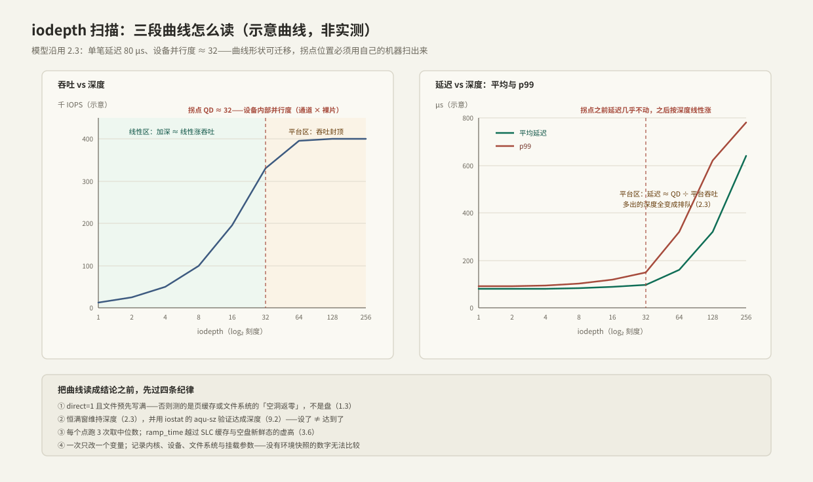

---
tags:
  - 高性能存储/io_uring
---
# io_uring 延迟吞吐实验

> 前五篇留下了三组可检验的断言：批量摊薄固定成本（2.1）、吞吐 = 深度 ÷ 延迟且拐点 = 设备并行度（2.3）、polling 买的是延迟不是平台吞吐（2.4）。这一篇把它们放上试验台：用 fio 的 io_uring 引擎扫 iodepth、逐个开关 polling，画出**自己机器**的三段曲线，再用 iostat / biolatency 交叉验证。原则只有一条：**本篇所有数字都是示意，用来对照曲线形状；结论必须出自自己的机器**。

前置：[[2.3 iodepth 与提交完成路径]]（要验证的理论）、[[2.4 polling 与 registered buffers]]（要验证的开关）、[[1.3 Buffered IO 与 O_DIRECT]]（`direct=1` 的原因）。

---

## 1. 实验设计：三个假设、一组变量

先把「要证明什么」写下来，再动 fio——反过来做就成了跑分：

| 假设 | 出处 | 预期观测 |
| --- | --- | --- |
| H1：深度换吞吐，先线性后封顶，拐点 ≈ 设备并行度 | [[2.3 iodepth 与提交完成路径]] | IOPS-QD 曲线三段形状；拐点后 IOPS 平、延迟线性涨 |
| H2：平台区加深只买排队，p99 先崩 | 同上 | QD 翻倍、IOPS 不动、p99 翻倍以上 |
| H3：polling 降低每笔延迟与抖动，不抬高平台 | [[2.4 polling 与 registered buffers]] | 浅 QD 平均/p99 下降（IOPS 随之同比例涨）；平台区 IOPS 不变 |

变量控制【实践】：

- **自变量**：`iodepth ∈ {1, 2, 4, …, 256}`；开关组合（基线 / SQPOLL / IOPOLL / registered）；
- **不变量**：`bs=4k`、`randread`、`direct=1`、同一块盘、同一颗核（`cpus_allowed` 钉死）；
- **观测量**：IOPS、clat 平均 / p99 / p99.9、CPU 利用率、`aqu-sz`。

**【取舍】闭环与开环**：fio 的恒满窗是**闭环**——完成一个才发下一个，测的是「设备在该并发下的能力上限」；真实业务是**开环**——请求按自己的节奏到达，排队可以无界增长。想模拟业务到达率下的尾延迟，用 `rate_iops` 固定发射速率再看延迟分布（这也是「coordinated omission」问题的实务解法：闭环会在设备变慢时自动少发请求，把最坏延迟藏起来）。

---

## 2. 环境准备：让曲线只反映你想测的东西

每一条都对应一种「曲线畸形」【实践】：

1. **`direct=1` + 文件预先写满**：buffered 命中页缓存测的是内存；fallocate 出来的未写 extent，文件系统直接返零、根本不打盘【事实】。先做一遍顺序写：

    ```bash
    fio --name=fill --filename=testfile --size=8G --rw=write --bs=1M --direct=1
    ```

2. **盘进入稳定状态**：空盘/刚 TRIM 过的盘会给出「新鲜态虚高」，SLC 缓存耗尽后掉速（[[3.6 空盘与稳态性能]]）——`ramp_time` 只能挡小的，正式测前先预热；
3. **CPU 定频**：`performance` governor、钉核；否则降频/迁核的抖动会被误读成存储抖动；
4. **IOPOLL 的前提先落实**：NVMe 驱动要配出 poll 队列（`nvme.poll_queues=N` 模块参数），否则 `hipri=1` 直接报错或退化【实现】；
5. **环境快照**：`uname -r`、设备型号与固件、文件系统与挂载参数、liburing/fio 版本——没有快照的数字既不能复现也不能比较。

---

## 3. fio 作业：基线与开关组

基线扫描脚本（一组 QD 一个 json，jq 摘关键数）：

```bash
#!/usr/bin/env bash
set -euo pipefail
for qd in 1 2 4 8 16 32 64 128 256; do
  fio --name=sweep --ioengine=io_uring --direct=1 --rw=randread --bs=4k \
      --filename=testfile --size=8G --iodepth="$qd" \
      --time_based --runtime=30 --ramp_time=5 --cpus_allowed=2 \
      --output-format=json > "qd${qd}.json"
  iops=$(jq '.jobs[0].read.iops' "qd${qd}.json")
  p99=$(jq '.jobs[0].read.clat_ns.percentile."99.000000"' "qd${qd}.json")
  printf 'QD=%-4s IOPS=%.0f  p99=%.0f us\n' "$qd" "$iops" "$(echo "$p99 / 1000" | bc -l)"
done
```

开关组在同一命令上叠参数，**一次只加一个**【实践】：

| 验证对象 | 追加参数 | 对应 2.4 的开关 |
| --- | --- | --- |
| SQPOLL | `--sqthread_poll=1 --sqthread_poll_cpu=3` | `IORING_SETUP_SQPOLL`（注意老内核需特权） |
| IOPOLL | `--hipri=1` | `IORING_SETUP_IOPOLL`（需 poll 队列 + O_DIRECT） |
| registered | `--registerfiles=1 --fixedbufs=1` | registered files / buffers |

每点 3 次取中位数；`numjobs` 先保持 1——多 job 是第二阶段变量（每 job 独立环，总深度 = numjobs × iodepth，[[2.3 iodepth 与提交完成路径]] §7）。

---

## 4. 读数：三段曲线与两条延迟线



示意数据（沿用 2.3 的 80 μs 设备模型，**你的表格要自己填**）：

| iodepth | IOPS（示意） | 平均延迟 | p99 | 这一行在说什么 |
| --- | --- | --- | --- | --- |
| 1 | 12.5K | 80 μs | ~90 μs | 线性区起点：延迟 ≈ 裸设备延迟 |
| 4 | 50K | 80 μs | ~102 μs | 线性区：吞吐 ×4、延迟不动——白赚 |
| 16 | 195K | 88 μs | ~118 μs | 接近拐点：轻微排队出现 |
| 32 | 330K | 97 μs | ~150 μs | 拐点附近：并行度将满 |
| 64 | 400K | 160 μs | ~320 μs | 平台区：吞吐封顶，延迟 = QD ÷ 吞吐 |
| 128 | 400K | 320 μs | ~620 μs | 纯排队：p99 崩了，吞吐一点没涨 |

三条读法：

1. **拐点即答案**：H1 的验证就是找到 IOPS 停涨的 QD——那就是这块盘对这个负载的有效并行度，选深度的依据（[[2.3 iodepth 与提交完成路径]] §7）；
2. **达成深度先验证再下结论**：`iostat -x` 的 `aqu-sz` ≈ 实际到达块层的在途数（[[9.2 iostat 指标解读]]）。设了 QD=64 而 `aqu-sz` 只有 8，瓶颈在提交侧——最常见是发射线程 CPU 打满（看 fio 的 usr/sys），该加 `numjobs` 而不是怀疑设备；
3. **polling 的对照怎么读**：看浅 QD（1–4）的平均与 p99——闭环下延迟降会带着 IOPS 同比例涨，这是 H3 的「买延迟」在吞吐上的投影；平台区 IOPS 应当不变（由设备决定），若变了说明基线时 CPU 才是瓶颈，polling 顺带抬了单核上限【事实/预期】。

---

## 5. 自己写压测：把 2.3 的恒满窗加上计时

fio 之外再手写一遍的价值：确认「fio 说的」与「自己代码测的」一致，顺便拿到一个可嵌进业务的延迟采样骨架。在 [[2.3 iodepth 与提交完成路径]] §6 的恒满窗上只加两样东西——**每槽位的下发时刻**与**完成时的差值采样**：

```cpp
#include <liburing.h>

#include <algorithm>
#include <chrono>
#include <cstddef>
#include <cstdint>
#include <random>
#include <span>
#include <system_error>
#include <vector>

using Clock = std::chrono::steady_clock;

// 全量采样 + 排序取分位：实验规模（百万级样本）下最简单可靠的做法
struct LatencyRecorder {
    std::vector<std::uint64_t> samples_us;
    void add(Clock::time_point t0) {
        samples_us.push_back(static_cast<std::uint64_t>(
            std::chrono::duration_cast<std::chrono::microseconds>(Clock::now() - t0).count()));
    }
    std::uint64_t percentile(double p) {
        std::sort(samples_us.begin(), samples_us.end());
        return samples_us[static_cast<std::size_t>(p * (samples_us.size() - 1))];
    }
};

// 恒满窗随机读 + 计时；fd 需 O_DIRECT 打开，pool 为 4 KiB 对齐的 depth 块
// （对齐 buffer 的 RAII 分配见 2.4 的 RegisteredBuffers）
LatencyRecorder timed_random_read(IoUring& uring, int fd, std::span<std::byte> pool,
                                  unsigned depth, std::size_t file_pages, int total) {
    std::vector<Clock::time_point> issued(depth);       // 每个槽位的下发时刻
    std::mt19937_64 rng{12345};
    std::uniform_int_distribution<std::size_t> pick{0, file_pages - 1};
    LatencyRecorder rec;
    rec.samples_us.reserve(static_cast<std::size_t>(total));

    auto submit_one = [&](std::uint64_t slot) {
        io_uring_sqe* sqe = ::io_uring_get_sqe(uring.get());
        ::io_uring_prep_read(sqe, fd, pool.data() + slot * 4096, 4096,
                             static_cast<off_t>(pick(rng)) * 4096);
        ::io_uring_sqe_set_data64(sqe, slot);
        issued[slot] = Clock::now();                    // ① 记下发时刻
    };

    const auto t_begin = Clock::now();
    for (std::uint64_t s = 0; s < depth; ++s) submit_one(s);
    ::io_uring_submit(uring.get());

    int submitted = static_cast<int>(depth);
    for (int done = 0; done < total; ++done) {
        io_uring_cqe* cqe = nullptr;
        if (const int rc = ::io_uring_wait_cqe(uring.get(), &cqe); rc < 0)
            throw std::system_error{-rc, std::system_category(), "wait_cqe"};
        if (cqe->res < 0)
            throw std::system_error{-cqe->res, std::system_category(), "read"};
        const auto slot = ::io_uring_cqe_get_data64(cqe);
        rec.add(issued[slot]);                          // ② 完成时刻 − 下发时刻 = 单笔延迟
        ::io_uring_cqe_seen(uring.get(), cqe);
        if (submitted < total) { submit_one(slot); ::io_uring_submit(uring.get()); ++submitted; }
    }
    const double secs = std::chrono::duration<double>(Clock::now() - t_begin).count();
    // 一行结果：IOPS ≈ total / secs，配 rec.percentile(0.50 / 0.99)
    (void)secs;
    return rec;
}
```

**关键点**：

- 时刻记在 **prep 之后、submit 之前**：测出来的是「下发到收割」的全程延迟，与 fio 的 clat 口径接近；`steady_clock` 单调不回拨，一次取时约几十纳秒【量级】，相对 μs 级 IO 可忽略；
- **p99 要有样本量支撑**：1 万笔里 p99 只有 100 个样本、p99.9 只有 10 个——想让尾分位稳定，`total` 至少百万级【实践】；
- 收 1 补 1 的 `submit` 每次一笔，深 QD 下可攒批（`submit` 前多补几笔）换更低的每笔开销——这本身就是 H1 的一个小实验。

---

## 6. 交叉验证：同一笔延迟，三个观测点

单一数据源的结论不算数。同一批 IO，从三个高度各测一次【实践】：

| 观测点 | 工具 | 覆盖范围 |
| --- | --- | --- |
| 应用视角 | fio clat / §5 的采样 | 下发 → 收割全程（含环、调度、收割延迟） |
| 块层视角 | `iostat -x` 的 `r_await`、`aqu-sz`（[[9.2 iostat 指标解读]]） | 请求进入块层 → 完成 |
| 块层直方图 | `biolatency`（[[9.4 eBPF biolatency biosnoop]]） | 同上，但给出完整分布而非均值 |

读差值：**应用延迟 − 块层延迟 ≈ io_uring 环 + 提交/收割 + 调度的开销**——polling 系开关削的正是这一段，开关前后这个差值应当肉眼可见地缩小；块层延迟与设备标称延迟的差 ≈ 块层排队（深 QD 时的大头）。把延迟按层分解定位瓶颈的通用方法论在 [[5.4 延迟分解方法论]]。

---

## 7. 曲线异常速查

形状不对时先查实验，再怀疑机器【实践】：

| 症状 | 大概率原因 |
| --- | --- |
| 全程平坦、延迟极低 | buffered 污染或文件没写满——测的是内存/返零路径（§2） |
| 一直线性、看不到拐点 | 提交侧 CPU 先到顶（单 job 打满一颗核），设备没被喂饱——加 `numjobs` |
| 平台区锯齿/周期性掉速 | SLC 缓存耗尽、GC 启动（[[3.5 GC 写放大与 Over-Provisioning]]、[[3.6 空盘与稳态性能]]） |
| p99 毛刺无规律 | 降频、迁核、邻居负载——先钉核定频再复测（[[9.5 p99 毛刺定位]]） |
| 开关组反而变慢 | 前提没满足：hipri 没有 poll 队列、SQPOLL 线程与业务抢核（[[2.4 polling 与 registered buffers]]） |

---

## 8. 陷阱与误区

> [!warning] 常见错误
> 1. **buffered 模式扫深度**：页缓存命中 inline 完成，曲线测的是内存带宽——`direct=1` 是本实验的第一前提。
> 2. **文件是 fallocate 出来的**：未写 extent 读到的是文件系统直接返回的零，盘根本没转——预填一遍再测。
> 3. **拿新鲜盘的数字当稳态**：SLC 缓存与空盘态给的是「开业酬宾价」，跑长了才是真实价格。
> 4. **单 job CPU 瓶颈当成设备拐点**：IOPS 停涨 ≠ 设备饱和，先看 fio 的 CPU 占用与 `aqu-sz`。
> 5. **一次改两个变量**：`hipri` 和 `sqthread_poll` 一起开，谁的功劳说不清——矩阵一格一格填。
> 6. **只看均值不看 p99**：平台区均值涨得温和、p99 崩得剧烈；上线决策看尾分位（[[9.5 p99 毛刺定位]]）。
> 7. **拿别人的拐点当自己的**：拐点由设备、内核、文件系统共同决定——本篇示意数字也不例外。

---

## 9. 关键结论

| 结论 | 性质 |
| --- | --- |
| 实验先写假设与变量表，再跑命令；一次只改一个变量 | 实践结论 |
| 三段曲线：线性区白赚吞吐、拐点 = 设备并行度、平台区只买排队——与 2.3 理论对账 | 事实 / 验证目标 |
| polling 在浅 QD 买延迟（闭环下 IOPS 同比例涨），不改变平台高度 | 事实 / 预期 |
| `direct=1`、文件写满、稳态、定频钉核——四个前提缺一个曲线就是假的 | 实践结论 |
| 达成深度用 aqu-sz 验证；应用延迟 − 块层延迟 = 环侧开销，polling 的收益在这段 | 实践结论 |
| 闭环测能力、开环测排队；尾分位要样本量与 rate_iops 开环对照 | 取舍 |
| 一切数字机器相关：示意表只提供形状，结论必须自测 | 实践结论 |

---

## 关联知识

- [[2.3 iodepth 与提交完成路径]] - 本实验要验证的深度-吞吐-延迟三角
- [[2.4 polling 与 registered buffers]] - 开关组的机制与前提
- [[1.3 Buffered IO 与 O_DIRECT]] - direct=1 的原因与对齐要求
- [[3.6 空盘与稳态性能]] / [[3.5 GC 写放大与 Over-Provisioning]] - 盘侧「测不准」的来源
- [[9.1 fio Benchmark Matrix]] - 从单实验扩展成系统化基准矩阵
- [[9.2 iostat 指标解读]] / [[9.4 eBPF biolatency biosnoop]] - 交叉验证的两个观测点
- [[9.5 p99 毛刺定位]] - 尾延迟异常的定位方法
- [[5.4 延迟分解方法论]] - 按层拆延迟的通用框架
