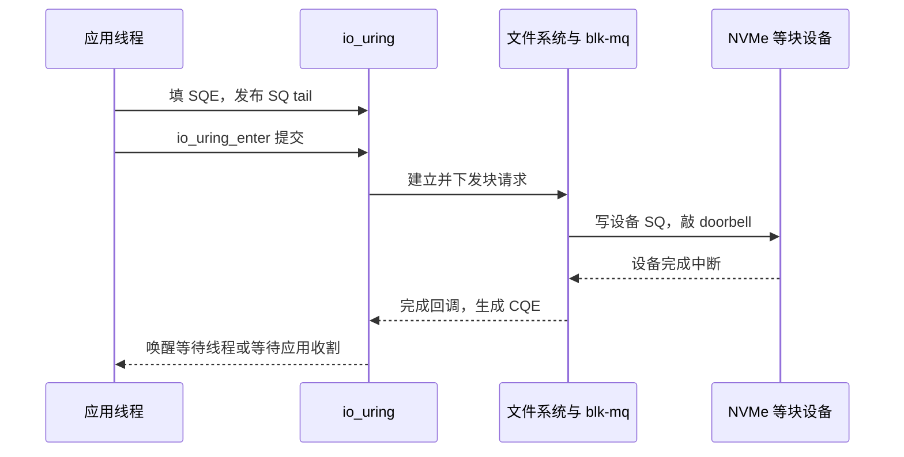
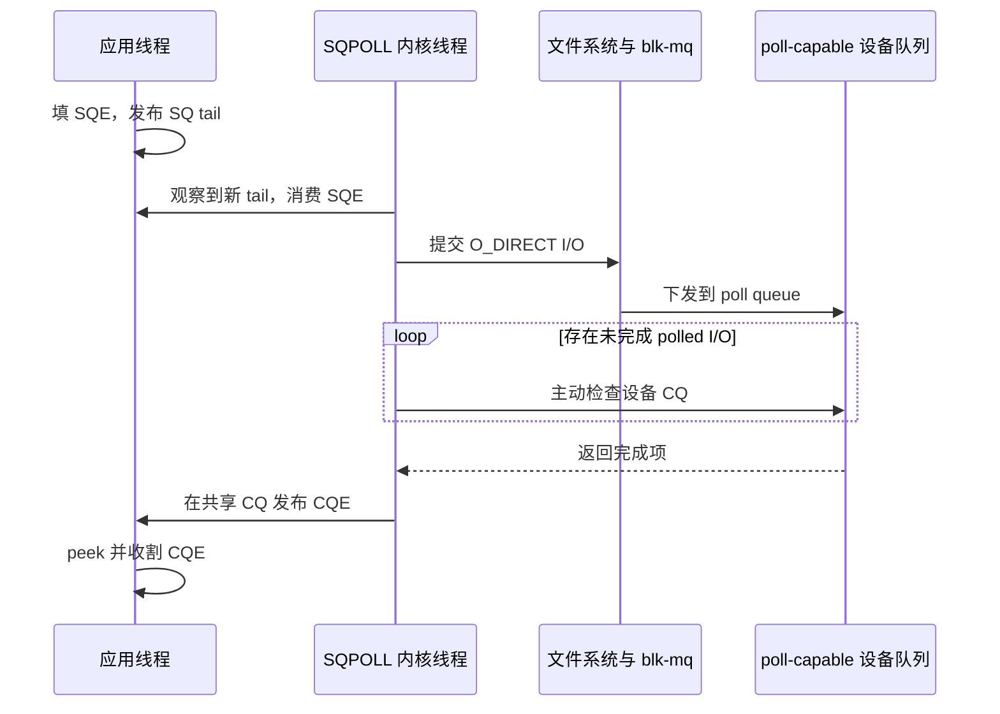

---
tags:
  - 高性能存储/io_uring
status: 已完成
---

# SQPOLL 与 IOPOLL

> SQPOLL 轮询“有没有新的 SQE”，省掉提交侧系统调用；IOPOLL 轮询“设备请求完成没有”，省掉完成侧设备中断。两者修改的是端到端路径的不同位置。

前置：[[2.1 SQ CQ 模型]]（共享环和提交/完成协议）、[[2.3 iodepth 与提交完成路径]]（请求如何落到设备）、[[0.6 Interrupt Busy Polling 与 Context Switch]]（中断、睡眠与忙轮询的成本）。

---

## 1. 概念、目标与讨论边界

### 1.1 两种轮询分别看什么

io_uring 有两个共享队列：

- **SQ（Submission Queue，提交队列）**：应用把“要执行什么 I/O”写成 SQE 放进这里；
- **CQ（Completion Queue，完成队列）**：内核把“完成了多少字节或发生了什么错误”写成 CQE 放进这里。

默认模式下，应用通常调用 `io_uring_enter()` 通知内核消费 SQ；设备完成 I/O 后通常通过中断通知 CPU。两个轮询选项分别替换一个通知动作：

| 模式 | 轮询对象 | 谁在轮询 | 替换的事件 | 不会省掉什么 |
|---|---|---|---|---|
| SQPOLL | io_uring 的 SQ tail | 专用内核线程 | 应用提交时的 `io_uring_enter()` | 文件系统、块层、设备执行和默认设备完成中断 |
| IOPOLL | 块设备的完成状态 | 调用线程或 SQPOLL 线程在内核中轮询 | 该批可轮询存储 I/O 的设备完成中断 | 首次提交系统调用、文件系统与块层执行 |

一句话区分：

```text
SQPOLL：谁来发现“有新任务”
IOPOLL：谁来发现“任务已完成”
```

### 1.2 本文的范围

本文讨论 Linux io_uring 访问本地块存储的路径，重点是普通文件或块设备上的 direct read/write。以下机制只说明边界，不在本文展开：

- registered buffers/files 解决每笔资源查找和页固定成本，见 [[2.4 polling 与 registered buffers]]；
- io-wq 处理可能阻塞或需要异步工作线程的路径，见 [[2.8 io-wq 与阻塞操作退化路径]]；
- 网络 socket 的 NAPI busy poll 与 IOPOLL 不是同一功能，见本文第 11 节；
- 各内核与发行版的特性差异见 [[2.12 内核版本功能边界]]。

> [!info] 事实、前提与取舍
> - **【事实】**：UAPI、系统调用或内核路径规定的行为。
> - **【前提】**：文件系统、设备、驱动、内核版本和 CPU 配置必须满足的条件。
> - **【取舍】**：以专用 CPU、功耗或部署复杂度换取更少的事件开销和更稳定的尾延迟。

## 2. 默认路径作为对照组

先看没有开启任何 polling flag 时，一笔 O_DIRECT 读经历什么：



这条路径有两个事件成本：

1. **提交事件**：应用进入内核，内核才知道 SQ 中有新工作；
2. **完成事件**：设备发 IRQ，CPU 处理中断和后续完成回调。

io_uring 的普通批量提交已经能让多个 SQE 共享一次系统调用。SQPOLL 继续删除这次提交调用；IOPOLL 则修改另一端的完成发现方式。设备执行 NAND 读取、DMA 传输、文件系统映射和 blk-mq 排队仍然存在。

## 3. SQPOLL：由内核线程消费提交队列

### 3.1 创建与运行

创建 ring 时设置 `IORING_SETUP_SQPOLL`，内核会建立 SQ polling thread。该线程持续检查 SQ tail：

1. 应用取得 SQE 槽位并填好操作参数；
2. liburing 用正确的 release 语义发布 SQ tail；
3. SQPOLL 线程看到 tail 变化，读取 SQE 并进入正常 io_uring 提交路径；
4. 请求继续经过文件系统、块层和驱动；
5. 内核消费 SQE 后推进 SQ head，应用可以复用该 SQE 槽位。


【事实】稳态提交不再要求应用调用 `io_uring_enter()`。liburing 的 `io_uring_submit()` 仍应被调用，因为它负责发布用户态已经准备好的 SQE，并在 SQPOLL 线程睡眠时执行唤醒协议。不能因为“零提交系统调用”就跳过 liburing 的提交函数。

### 3.2 `sq_thread_idle` 与 `IORING_SQ_NEED_WAKEUP`

SQPOLL 线程不能在低负载时永久空转。`io_uring_params::sq_thread_idle` 指定它在没有新提交时继续轮询多长时间，单位是毫秒。空闲超过该时间后，线程准备睡眠，并在 SQ ring flags 中设置 `IORING_SQ_NEED_WAKEUP`。

应用发布新 tail 后必须按以下逻辑处理：

```text
发布 SQE 和 SQ tail
    → 以规定的内存顺序读取 SQ flags
    → NEED_WAKEUP 未置位：SQPOLL 线程仍在运行，无需 syscall
    → NEED_WAKEUP 已置位：io_uring_enter(..., IORING_ENTER_SQ_WAKEUP)
```

【事实】检查顺序不能调换。应用必须先发布 SQ tail，再检查 `NEED_WAKEUP`；两者之间需要与内核协议匹配的内存屏障。否则应用可能认为线程醒着，内核线程却已睡下，SQE 会停在环中无人消费。

liburing 已实现这套屏障与唤醒判断。手写裸 `mmap` / syscall 接口时才需要自己处理共享内存顺序，但也更容易写出丢唤醒错误。

### 3.3 SQPOLL 只改变提交侧

启用 SQPOLL 后，默认存储完成路径仍可以使用设备中断：

```text
应用发布 SQE
    → SQPOLL 线程代为提交
    → 设备执行
    → 设备中断
    → 内核生成 CQE
```

应用收割 CQE 有三种常见方式：

- 直接 `io_uring_peek_cqe()`，没有完成时继续做业务或在用户态忙等；
- `io_uring_wait_cqe()`，需要等待时仍可能进入内核睡眠；
- 注册 eventfd，把 CQ 通知接入其他事件循环。

所以 SQPOLL 的准确结论是“提交侧可以没有系统调用”，不是“整个 I/O 没有系统调用和中断”。只有持续在用户态检查 CQ，且 SQPOLL 线程没有进入睡眠，应用路径才可能在一段稳态区间内不执行系统调用。

### 3.4 CPU 亲和性

设置 `IORING_SETUP_SQ_AFF` 后，`io_uring_params::sq_thread_cpu` 指定 SQPOLL 线程使用的 CPU。只填写 `sq_thread_cpu` 而不设置 `SQ_AFF` 没有这项约束。

【取舍】把 SQPOLL 线程放到专用 CPU 可以减少迁核和与业务线程争抢执行时间，但要同时检查：

- 该 CPU 是否在进程或容器的 cpuset 中；
- 是否与高负载业务线程或其他 poller 共用同一个物理核的 SMT sibling；
- CPU 所在 NUMA node 与 NVMe、中断和内存位置是否合适；
- cgroup CPU quota 是否会周期性限制 poller。

CPU 编号不是跨机器可复制的调优参数。拓扑不同，同一个编号可能从靠近设备的独立物理核变成繁忙核的超线程。

## 4. IOPOLL：主动查询块设备完成状态

### 4.1 它轮询的不是 io_uring CQ

`IORING_SETUP_IOPOLL` 的名字容易让人误以为“应用反复看 io_uring CQ”。真正的关键动作发生在内核和块设备之间：内核调用文件系统与块层的 poll 路径，驱动检查设备 completion queue 是否出现新完成项。

对 NVMe 来说，可把过程理解为：

```text
io_uring 跟踪已发出的 polled request
    → blk-mq 找到对应 poll hardware context
    → NVMe 驱动读取 poll queue 的 CQE 与 phase
    → 驱动完成 request，块层回调
    → io_uring 发布用户可见 CQE
```

设备仍通过 DMA 写数据和设备 CQE。变化在通知方式：内核主动读完成队列，不依赖这批 polled I/O 的异步设备 IRQ。

### 4.2 单独启用 IOPOLL 时谁在烧 CPU

只有 `IORING_SETUP_IOPOLL` 时，没有额外的完成轮询线程替应用工作。应用提交请求后，需要通过 `io_uring_enter(..., IORING_ENTER_GETEVENTS)` 进入内核；当前调用线程在内核中运行 IOPOLL，直到收集到要求数量的完成、被信号打断或调度条件要求让出 CPU。

liburing 会识别这种 ring。调用 `io_uring_wait_cqe()` 等等待接口时，它会进入内核推动 IOPOLL；只在用户态无限调用 `io_uring_peek_cqe()`，可能一直看不到尚未由内核 poll 路径收割的设备完成。

【事实】这解释了一个看似矛盾的现象：IOPOLL 删除了设备完成中断，却没有删除 `io_uring_enter()`。它把“被中断唤醒”换成“调用线程在内核中主动检查”。

### 4.3 文件系统、文件与设备前提

存储 read/write 使用 IOPOLL 时需要一条完整的能力链：

```text
文件以 O_DIRECT 打开
    ∧ 文件系统 direct-I/O poll 路径支持
    ∧ 中间块设备正确传播 poll
    ∧ 块驱动提供 poll queue / poll 回调
    ∧ 硬件队列能够在无中断模式下完成请求
```

【前提】只满足其中一项不够。NVMe 支持多队列，不代表当前驱动已经分配 polling queue；文件用 `O_DIRECT` 打开，也不代表 dm、RAID、虚拟磁盘或远端块路径一定支持 IOPOLL。

对 NVMe PCI 驱动，`poll_queues` 参数决定预留多少 poll queue。该参数在控制器队列建立时生效。修改驱动参数、重新加载模块或重新绑定设备会影响正在使用该设备的文件系统，不能在生产挂载盘上为了测试随意操作。

### 4.4 IOPOLL ring 的操作边界

IOPOLL ring 不是普通 ring 加一个“优先完成”提示。多数不能走 IOPOLL 的 opcode 不允许混入该 ring。稳定做法是：

- 用独立 IOPOLL ring 处理支持轮询的 direct storage read/write；
- socket、buffered I/O、目录操作和普通控制操作放在普通 ring；
- 每个 CQE 都检查 `res`，能力不匹配时常见错误包括 `-EINVAL` 或 `-EOPNOTSUPP`，具体由内核版本和失败层决定；
- 启动时用实际目标文件做小请求探测，不能只凭 ring 创建成功判断整条路径可用。

允许的 opcode 集合随内核演进。需要兼容多个发行版时，应以目标内核 UAPI、liburing man page 和运行时探测为准，不把当前开发版列表硬编码进业务逻辑。

### 4.5 Hybrid IOPOLL

Linux 6.13 加入 `IORING_SETUP_HYBRID_IOPOLL`。它必须与 `IORING_SETUP_IOPOLL` 一起使用，设备支持条件也相同。

严格 IOPOLL 会尽快进入轮询。Hybrid IOPOLL 先等待一段由内核路径估算的时间，再开始主动 poll，目标是少做“设备还不可能完成时”的空循环。

| 模式 | 完成发现方式 | CPU 与延迟取舍 |
|---|---|---|
| 中断 | 线程可睡眠，设备完成后触发 IRQ | CPU 消耗低；包含中断、调度和唤醒抖动 |
| Hybrid IOPOLL | 先短暂等待，再轮询 | 少烧一部分空转 CPU；仍要求 poll 能力 |
| 严格 IOPOLL | 尽早持续轮询 | 完成发现更直接；CPU 占用最高 |

【版本前提】旧内核或旧 liburing 头文件没有该 flag。程序应把它当可选能力，创建失败时回退到严格 IOPOLL 或中断模式，并记录实际选择。

## 5. 两个开关同时开启

设置 `IORING_SETUP_SQPOLL | IORING_SETUP_IOPOLL` 后，SQPOLL 内核线程承担两类工作：

1. 看 SQ tail，消费并提交新 SQE；
2. 对 ring 中已发出的 IOPOLL 请求执行完成侧 polling。

当前内核专门为这个组合避免应用再次进入内核做 completion polling；liburing 也只在“IOPOLL 开、SQPOLL 关”时标记 CQ 等待必须进入内核。



【事实】稳态下可以做到提交无 syscall、完成无设备 IRQ、应用通过共享 CQ 收割。但“无 syscall”有条件：

- SQPOLL 线程没有因空闲睡眠，否则需要一次 wakeup syscall；
- 应用不调用会睡眠的 CQ wait 接口；
- 没有混入需要 io-wq 或其他系统调用交互的路径；
- 设备、文件系统和驱动确实使用 IOPOLL，没有回退到其他模式。

【取舍】组合模式把系统调用、中断与唤醒成本换成一个持续运行的内核线程。它适合有专用 CPU、请求持续、设备延迟低且尾延迟预算严格的场景；低负载服务会在大部分时间轮询空队列。

## 6. 四种模式对照

| ring flags | 提交由谁推动 | 存储完成由谁发现 | 稳态设备 IRQ | 主要占用的轮询 CPU |
|---|---|---|---:|---|
| 无 polling | 应用 `io_uring_enter()` | 设备 IRQ 与完成回调 | 有 | 无持续 poller |
| SQPOLL | SQPOLL 内核线程 | 设备 IRQ 与完成回调 | 有 | SQPOLL 线程 |
| IOPOLL | 应用先提交，再在 `enter(GETEVENTS)` 中轮询 | 应用线程在内核中 poll | 无对应 polled I/O IRQ | 等待完成的应用线程 |
| SQPOLL + IOPOLL | SQPOLL 内核线程 | SQPOLL 内核线程 poll | 无对应 polled I/O IRQ | SQPOLL 线程 |

选择时先问瓶颈在哪：

- 提交线程的 syscall / sys CPU 已成为瓶颈，完成中断不是问题：评估 SQPOLL；
- 设备很快，完成中断和唤醒造成可测的尾延迟：评估 IOPOLL；
- 两端事件成本都可见，并且有一颗可长期占用的 CPU：评估组合模式；
- I/O 稀疏、机器 CPU 紧张、设备本身延迟高：保留默认中断模式通常更合适。

## 7. 关键数据结构

### 7.1 稳定的用户态接口

| 结构或字段 | 作用 | 与本篇的关系 |
|---|---|---|
| `io_uring_params::flags` | 创建 ring 时选择行为 | 设置 `IORING_SETUP_SQPOLL`、`IORING_SETUP_IOPOLL`、`IORING_SETUP_SQ_AFF`、`IORING_SETUP_HYBRID_IOPOLL` |
| `sq_thread_cpu` | SQPOLL 线程的目标 CPU | 只有同时设置 `IORING_SETUP_SQ_AFF` 才用于绑定 |
| `sq_thread_idle` | SQPOLL 无工作后继续轮询的时间 | 决定空转窗口与进入 `NEED_WAKEUP` 的时机 |
| `io_sqring_offsets::flags` | SQ 共享状态字段的 mmap 偏移 | 用户态由此访问 `IORING_SQ_NEED_WAKEUP` 等状态 |
| `IORING_SQ_NEED_WAKEUP` | SQPOLL 线程已睡或将睡，需要唤醒 | 发布 tail 后检查，必要时 `IORING_ENTER_SQ_WAKEUP` |
| `io_uring_sqe` | 用户提交的操作描述 | SQPOLL 线程异步消费，SQE 及其指针参数要满足生命周期要求 |
| `io_uring_cqe` | 内核发布的完成结果 | `res` 为负时保存 `-errno`；任何模式都必须检查 |

### 7.2 内核内部结构

以下名称属于实现细节，不是稳定 UAPI：

| 内核对象 | 角色 |
|---|---|
| `struct io_ring_ctx` | 保存 ring 配置、SQ/CQ 状态、完成队列与 IOPOLL 跟踪列表 |
| `struct io_kiocb` | io_uring 对单个请求的内核表示，关联文件、结果和 poll 状态 |
| `iopoll_list` | 跟踪已经发出、需要主动查询完成的 IOPOLL 请求 |
| `struct kiocb` 与 `IOCB_HIPRI` | 把 direct-I/O polling 意图传入文件系统 I/O 路径 |
| `struct bio` / `struct request` | 块层请求，最终映射到支持 polling 的 blk-mq hardware context |
| NVMe poll queue 的 CQ head / phase | 驱动判断设备是否产生新完成项的状态 |

数据结构之间的关系是：SQE 被复制和校验后形成 io_uring request；read/write 路径再建立 `kiocb` 和块请求；驱动完成 `request` 后，io_uring request 才能转成 CQE。SQPOLL 改变“谁建立 request”，IOPOLL 改变“谁推进 request 到完成”。

## 8. 状态变化与所有权

SQPOLL 线程至少经历以下状态：

1. **Active**：持续检查 SQ，并提交新请求；
2. **Idle polling**：SQ 暂时为空，但尚未超过 `sq_thread_idle`；
3. **Sleeping / NEED_WAKEUP**：线程睡眠，共享 SQ flags 要求应用显式唤醒；
4. **Waking**：应用执行 `IORING_ENTER_SQ_WAKEUP`，线程重新进入 Active。

IOPOLL 请求则依次经历：

1. SQE 已发布；
2. 内核已复制、校验并提交 direct I/O；
3. 请求进入 `iopoll_list`，设备 I/O 在途；
4. 设备已经完成，但尚未被 CPU poll 路径发现；
5. 驱动 poll 发现设备 CQE，块请求与 io_uring request 完成；
6. io_uring CQE 已发布；
7. 应用收割 CQE，buffer 所有权返回应用。

![[图片/SVG/8_2_7_1.svg|900]]

*图 8-1：上半 SQPOLL 线程 Active→Idle→NEED_WAKEUP→Waking；中段 IOPOLL 请求七阶段（设备完成 ≠ 用户可见）；底部 SQE 参数与 I/O buffer 所有权边界。*

> [!warning] SQPOLL 下的参数生命周期
> 内核线程异步消费 SQE。指向用户内存的提交参数不能在内核复制前失效；I/O buffer 则必须一直有效到对应 CQE 被收割。旧内核的提交稳定性边界还可通过 `IORING_FEAT_SUBMIT_STABLE` 判断。使用 liburing 不能取消这些所有权规则，RAII 对象必须覆盖整个在途区间。

## 9. CPU、调度与 NUMA 取舍

### 9.1 轮询减少事件，增加主动执行时间

默认中断路径让 CPU 在 I/O 未完成时运行别的任务或进入低功耗状态。轮询路径让 CPU 反复读取共享状态或设备队列。两种成本不能只看单笔延迟：

| 指标 | 中断模式 | polling 模式 |
|---|---|---|
| 空闲 CPU | 可调度给其他线程 | poller 持续占用一部分或一整颗核 |
| 完成发现延迟 | 包含 IRQ、softirq、唤醒和调度 | 取决于 poll 循环何时看到完成 |
| 低负载能效 | 较好 | 容易空转；Hybrid 或 idle 睡眠可缓解 |
| 高 IOPS 稳定性 | 中断合并与调度可能带来抖动 | 可减少完成通知抖动，但仍受设备和队列影响 |

【取舍】polling 不是“用更多 CPU 换更多设备带宽”的必然公式。设备已经达到介质吞吐上限时，轮询不会增加 NAND 通道数量；它只可能消除软件瓶颈或缩短完成被发现的时间。

### 9.2 线程放置

SQPOLL 与 IOPOLL 同开时，poller 同时访问用户共享环、内核请求状态和设备 CQ。合适的 CPU 放置通常需要结合：

- 应用线程写 SQ tail 的 CPU；
- NVMe PCIe 设备所在 NUMA node；
- buffer 所在内存 node；
- 其他普通队列的 IRQ affinity；
- SMT、cpuset 和 cgroup quota。

不存在适用于所有机器的固定绑核方案。实践顺序是先保留默认调度，记录迁核与 CPU 占用，再测试专用物理核和 NUMA 对齐，最后比较 p50、p99、IOPS、每 I/O CPU 时间与整机功耗。

## 10. 文件系统、块层和设备的端到端边界

### 10.1 `O_DIRECT` 只是第一道门槛

对 IOPOLL read/write，`O_DIRECT` 避免请求在 page cache 命中并直接结束，建立了走块层 direct-I/O 的机会。后面仍有三道能力判断：

1. 文件系统的 direct-I/O 实现是否提供 poll；
2. dm、md、虚拟块设备等堆叠层是否传播 poll；
3. 最终驱动和设备是否存在可用 poll queue。

某一层不支持时，不能假定内核会静默变回完全等价的中断路径。IOPOLL ring 对操作集合有约束，失败应从 CQE `res` 返回并由应用处理。

### 10.2 NVMe poll queue 与普通 IRQ queue

NVMe 驱动可以为不同 blk-mq hardware context 分配不同类型的 I/O queue。普通 queue 关联中断向量；poll queue 标记为 polled，由调用方主动检查 CQ head 和 phase。

这不表示整块 NVMe 从此关闭中断：

- 管理命令仍有自己的完成路径；
- 普通 read/write queue 仍可使用 IRQ；
- 其他进程未使用 IOPOLL 的请求仍走普通队列；
- 系统里的网卡、定时器和其他设备中断不受影响。

所以验证 IOPOLL 不能只看系统总中断数，要识别目标 NVMe queue 对应的中断计数和实际块层路径。

## 11. 网络与远程存储边界

### 11.1 SQPOLL 可以提交 socket 操作

SQPOLL 只关心 SQ 中是否有新 SQE，因此它也能减少 socket send、recv、accept 等操作的提交系统调用。后续完成仍遵循网络栈路径：

```text
SQPOLL 提交 socket SQE
    → socket / TCP / IP
    → qdisc 与网卡驱动，或等待接收数据
    → NIC IRQ / NAPI 或网络 busy poll
    → io_uring CQE
```

是否适合要看提交系统调用是不是网络服务的瓶颈。若主要时间花在协议处理、包拷贝、拥塞控制或业务逻辑，单独开启 SQPOLL 只会增加一个轮询线程。

### 11.2 IOPOLL 不是 socket busy poll

`IORING_SETUP_IOPOLL` 面向可轮询的存储 I/O，不能把 socket recv/send 当成 NVMe block poll 放进同一个 ring。网络侧有自己的 busy-poll 机制，例如 socket busy poll、NAPI busy poll 和 io_uring 的 NAPI 注册能力；它们轮询的是网卡接收队列与 NAPI 状态，不是 blk-mq request。

| 机制 | 轮询对象 | 所在子系统 |
|---|---|---|
| IOPOLL | 块设备完成队列 | 文件系统 / blk-mq / 存储驱动 |
| NAPI busy poll | NIC RX queue / NAPI instance | 网络驱动与网络栈 |
| 用户态 peek CQ | io_uring CQ tail | 用户态与 io_uring 共享内存 |

三者可以出现在同一个应用中，但不能互相替代。

### 11.3 NVMe-oF 与其他远程块设备

NVMe-oF、iSCSI 和 NBD 在本地呈现块设备，底层却还经过网络。能否使用 IOPOLL 取决于整条远程块路径和 transport 实现，不应从“设备名以 nvme 开头”推断。

以 NVMe/TCP 为例，即使上层块请求支持某种 polling，报文仍经过 TCP/IP、NIC 与远端 target；本地块 poll 不能自动消除网卡 IRQ、网络 RTT 和远端设备完成延迟。RDMA transport 也有自己的 completion queue 与 polling 模型，和 io_uring IOPOLL 的 UAPI 不是同一个队列。远程路径见 [[5.1 NVMe-oF 架构]]。

## 12. Modern C++：用 RAII 封装 ring、fd 与 CQE

下面的示例把模式选择、ring 生命周期、direct-I/O fd、对齐 buffer 和 CQE 归还分别封装。代码假定目标文件系统与设备支持 4 KiB 对齐的 direct read；生产代码应使用 `statx(STATX_DIOALIGN)` 或目标文件系统文档获取实际对齐要求。

```cpp
#include <liburing.h>

#include <fcntl.h>
#include <unistd.h>

#include <cerrno>
#include <cstddef>
#include <cstdlib>
#include <filesystem>
#include <memory>
#include <optional>
#include <span>
#include <stdexcept>
#include <system_error>
#include <utility>

struct RingOptions {
    unsigned entries = 64;
    bool sqpoll = false;
    bool iopoll = false;
    bool hybrid_iopoll = false;
    unsigned sq_thread_idle_ms = 0;
    std::optional<unsigned> sq_thread_cpu;
};

class IoUring {
public:
    explicit IoUring(const RingOptions& options) {
        if (options.hybrid_iopoll && !options.iopoll) {
            throw std::invalid_argument{
                "hybrid_iopoll requires iopoll"};
        }
        if (options.sq_thread_cpu.has_value() && !options.sqpoll) {
            throw std::invalid_argument{
                "sq_thread_cpu requires sqpoll"};
        }

        io_uring_params params{};
        if (options.sqpoll) {
            params.flags |= IORING_SETUP_SQPOLL;
            params.sq_thread_idle = options.sq_thread_idle_ms;
        }
        if (options.iopoll) {
            params.flags |= IORING_SETUP_IOPOLL;
        }
        if (options.hybrid_iopoll) {
#ifdef IORING_SETUP_HYBRID_IOPOLL
            params.flags |= IORING_SETUP_HYBRID_IOPOLL;
#else
            throw std::runtime_error{
                "liburing headers do not define HYBRID_IOPOLL"};

        }
        if (options.sq_thread_cpu.has_value()) {
            params.flags |= IORING_SETUP_SQ_AFF;
            params.sq_thread_cpu = *options.sq_thread_cpu;
        }

        const int rc = ::io_uring_queue_init_params(
            options.entries, &ring_, &params);
        if (rc < 0) {
            throw std::system_error{
                -rc, std::system_category(), "io_uring_queue_init_params"};
        }
        initialized_ = true;
    }

    ~IoUring() {
        if (initialized_) {
            ::io_uring_queue_exit(&ring_);
        }
    }

    IoUring(const IoUring&) = delete;
    IoUring& operator=(const IoUring&) = delete;
    IoUring(IoUring&&) = delete;
    IoUring& operator=(IoUring&&) = delete;

    [[nodiscard]] io_uring* get() noexcept { return &ring_; }

private:
    io_uring ring_{};
    bool initialized_ = false;
};

class UniqueFd {
public:
    explicit UniqueFd(int fd = -1) noexcept : fd_(fd) {}
    ~UniqueFd() {
        if (fd_ >= 0) {
            ::close(fd_);
        }
    }

    UniqueFd(const UniqueFd&) = delete;
    UniqueFd& operator=(const UniqueFd&) = delete;
    UniqueFd(UniqueFd&& other) noexcept
        : fd_(std::exchange(other.fd_, -1)) {}

    [[nodiscard]] int get() const noexcept { return fd_; }

private:
    int fd_;
};

UniqueFd open_direct_readonly(const std::filesystem::path& path) {
    const int fd = ::open(path.c_str(), O_RDONLY | O_DIRECT | O_CLOEXEC);
    if (fd < 0) {
        throw std::system_error{
            errno, std::generic_category(), "open O_DIRECT"};
    }
    return UniqueFd{fd};
}

struct FreeDeleter {
    void operator()(std::byte* p) const noexcept { std::free(p); }
};

class AlignedBuffer {
public:
    AlignedBuffer(std::size_t size, std::size_t alignment)
        : size_(size) {
        void* raw = nullptr;
        const int rc = ::posix_memalign(&raw, alignment, size);
        if (rc != 0) {
            throw std::system_error{
                rc, std::generic_category(), "posix_memalign"};
        }
        data_.reset(static_cast<std::byte*>(raw));
    }

    [[nodiscard]] std::span<std::byte> bytes() noexcept {
        return {data_.get(), size_};
    }

private:
    std::unique_ptr<std::byte, FreeDeleter> data_;
    std::size_t size_;
};

class CqeGuard {
public:
    CqeGuard(io_uring* ring, io_uring_cqe* cqe) noexcept
        : ring_(ring), cqe_(cqe) {}
    ~CqeGuard() { ::io_uring_cqe_seen(ring_, cqe_); }

    CqeGuard(const CqeGuard&) = delete;
    CqeGuard& operator=(const CqeGuard&) = delete;

private:
    io_uring* ring_;
    io_uring_cqe* cqe_;
};

void direct_read_once(IoUring& ring,
                      int fd,
                      std::span<std::byte> buffer,
                      off_t offset) {
    io_uring_sqe* sqe = ::io_uring_get_sqe(ring.get());
    if (sqe == nullptr) {
        throw std::runtime_error{"submission queue is full"};
    }

    ::io_uring_prep_read(
        sqe, fd, buffer.data(), buffer.size(), offset);
    ::io_uring_sqe_set_data64(sqe, 1);

    const int submitted = ::io_uring_submit(ring.get());
    if (submitted < 0) {
        throw std::system_error{
            -submitted, std::system_category(), "io_uring_submit"};
    }

    io_uring_cqe* cqe = nullptr;
    const int rc = ::io_uring_wait_cqe(ring.get(), &cqe);
    if (rc < 0) {
        throw std::system_error{
            -rc, std::system_category(), "io_uring_wait_cqe"};
    }
    CqeGuard seen{ring.get(), cqe};

    if (cqe->res < 0) {
        throw std::system_error{
            -cqe->res, std::system_category(), "direct read CQE"};
    }
    if (static_cast<std::size_t>(cqe->res) != buffer.size()) {
        throw std::runtime_error{"short direct read"};
    }
}
```

使用示意：

```cpp
int main() {
    RingOptions options{
        .entries = 64,
        .sqpoll = true,
        .iopoll = true,
        .hybrid_iopoll = false,
        .sq_thread_idle_ms = 100,
        .sq_thread_cpu = 3,
    };

    IoUring ring{options};
    UniqueFd fd = open_direct_readonly("testfile");
    AlignedBuffer buffer{4096, 4096};
    direct_read_once(ring, fd.get(), buffer.bytes(), 0);
}
```

这段代码有四个边界：

1. `io_uring_submit()` 不能省。SQPOLL 下它通常只发布 tail，但需要时会执行 wakeup syscall；
2. `io_uring_wait_cqe()` 不能替换成无限 `peek` 后就假设 IOPOLL 会自行推进；单独 IOPOLL 需要进入内核 poll；
3. `AlignedBuffer` 活到 CQE 收割之后，DMA 期间不会释放；
4. 示例中的 `100 ms`、CPU 3 和 4 KiB 对齐只用于展示字段，不是部署默认值。

编译要求 Linux、liburing 开发头文件和支持 C++20 的编译器：

```bash
g++ -std=c++20 -Wall -Wextra -Wpedantic sqpoll_iopoll.cpp -luring
```

## 13. 能力检查与观测

### 13.1 记录软件和设备边界

```bash
uname -r
fio --version
pkg-config --modversion liburing
findmnt -T /path/to/testfile -o TARGET,SOURCE,FSTYPE,OPTIONS
lsblk -s -o NAME,TYPE,PKNAME,MOUNTPOINTS
```

这些信息用于回答四个问题：内核是否支持目标 flag、liburing 是否暴露对应定义、文件实际落在哪个文件系统、目标块设备下面是否还有 dm/RAID/虚拟化层。

### 13.2 检查 NVMe poll queue 配置

```bash
cat /sys/module/nvme/parameters/poll_queues
```

如果文件不存在，可能是驱动形态、内核配置或设备类型不同；不能据此自动写入某个值。若输出为 `0`，当前 NVMe 控制器通常没有为新建队列预留 polled I/O queue，`hipri` 实验不具备预期前提。

> [!danger] 不要在生产盘上重载 NVMe 驱动
> `poll_queues` 在控制器队列建立时发挥作用。卸载驱动、重新绑定 PCI 设备或重启会中断块设备访问。应在测试机、一次性虚拟机或维护窗口按发行版文档配置。

### 13.3 观察 SQPOLL 线程

```bash
ps -eLo pid,tid,psr,pcpu,comm | grep -E 'iou-sqp|COMMAND'
```

重点看：线程实际运行在哪个 CPU、连续负载时的 CPU 占用、空闲超过 `sq_thread_idle` 后是否下降。容器内看不到宿主机内核线程时，需要在宿主机或对应监控边界观察。

### 13.4 观察设备中断变化

```bash
grep -i nvme /proc/interrupts
```

在同一工作负载时长内分别记录基线和 IOPOLL 组。只比较目标设备相关向量；系统总中断还包含网卡、时钟和其他设备。IOPOLL 只应减少进入 poll queue 的那部分 I/O 对普通完成中断的依赖。

## 14. 对照实验

### 14.1 fio 四格矩阵

在专用测试文件或空闲测试盘上运行。文件要预先写满，`direct=1`，其余变量保持一致：

```bash
# A：默认模式
fio --name=base --filename=/mnt/test/testfile --ioengine=io_uring \
    --rw=randread --bs=4k --direct=1 --iodepth=32 \
    --time_based --runtime=30

# B：只开 SQPOLL
fio --name=sqpoll --filename=/mnt/test/testfile --ioengine=io_uring \
    --rw=randread --bs=4k --direct=1 --iodepth=32 \
    --sqthread_poll=1 --sqthread_poll_cpu=3 \
    --time_based --runtime=30

# C：只开 IOPOLL
fio --name=iopoll --filename=/mnt/test/testfile --ioengine=io_uring \
    --rw=randread --bs=4k --direct=1 --iodepth=32 --hipri=1 \
    --time_based --runtime=30

# D：SQPOLL + IOPOLL
fio --name=both --filename=/mnt/test/testfile --ioengine=io_uring \
    --rw=randread --bs=4k --direct=1 --iodepth=32 --hipri=1 \
    --sqthread_poll=1 --sqthread_poll_cpu=3 \
    --time_based --runtime=30
```

记录以下数据：

| 指标 | 用来判断什么 |
|---|---|
| IOPS | 默认路径是否先被单核提交/完成开销限制 |
| clat p50 / p99 / p99.9 | polling 是否减少完成发现与唤醒抖动 |
| fio user / system CPU | 成本从 syscall/IRQ 转移到哪个执行上下文 |
| SQPOLL 线程 CPU | 是否占用预期的专用核，空闲策略是否有效 |
| NVMe IRQ 增量 | IOPOLL 请求是否避开普通完成中断 |
| `iostat -x` 的 `aqu-sz` | 四组是否达到相同块层深度 |

不能只看 IOPS。D 组比 A 组 p99 更低但多占一颗核，这是明确的资源交换；D 组 IOPS 没变也不代表功能无效，因为设备可能已经在 A 组达到介质上限。

### 14.2 控制变量

- 同一内核、liburing、fio、文件系统、挂载参数和设备固件；
- 同一个预填充测试文件，避免 page cache 和未写 extent；
- 同一 iodepth、block size、读写比例和测试时长；
- 分别记录业务线程与 SQPOLL 线程的 CPU affinity；
- 每组重复运行，报告分布或中位数，不挑最好一次；
- 避免与生产数据共用随机写测试，写负载会改变 SSD GC 和磨损状态。

完整实验方法见 [[2.6 io_uring 延迟吞吐实验]]。

## 15. 典型失败与定位

### 15.1 ring 创建失败

常见现象是 `io_uring_queue_init_params()` 返回 `-EINVAL`、`-EPERM` 或资源错误。检查顺序：

1. 目标内核是否认识该 setup flag；
2. 旧内核是否对 SQPOLL 有权限或 fixed file 要求；
3. `SQ_AFF` 是否与 SQPOLL 同时设置，CPU 是否在允许集合内；
4. Hybrid IOPOLL 是否同时设置 IOPOLL；
5. 容器 seccomp、LSM 或 `kernel.io_uring_disabled` 是否限制 io_uring。

### 15.2 ring 创建成功，但 CQE 报错

这通常说明 ring 级能力存在，具体操作路径不满足：

- fd 没有用 `O_DIRECT` 打开；
- offset、长度或 buffer 地址不满足 direct-I/O 对齐；
- 文件系统、堆叠设备或驱动不支持 poll；
- IOPOLL ring 混入不允许的 opcode；
- 请求落入不能按当前模式执行的退化路径。

定位时先打印每个 `cqe->res` 对应的错误文本，再缩减为单文件、单 opcode、单请求。不要用“没有 CQE”概括所有失败。

### 15.3 SQE 停在 SQ 中

如果只在低负载或长时间空闲后出现，优先检查 `IORING_SQ_NEED_WAKEUP` 协议。裸接口最容易漏掉发布 tail 后的 flag 检查；liburing 用户则检查是否绕过了 `io_uring_submit()`，或错误地直接改动 ring 指针。

### 15.4 开启 polling 后延迟更差

可能原因包括：

- SQPOLL 线程与应用线程争同一 CPU 或 SMT sibling；
- cpuset / CPU quota 周期性限流 poller；
- 设备延迟高，严格 IOPOLL 长时间空转却没有缩短完成时间；
- 实际路径不支持 IOPOLL，实验组并非预期路径；
- 单 job 的提交方式或收割方式改变，导致 iodepth 不一致；
- 测试文件命中 page cache，基线和实验组测的不是同一种 I/O。

## 16. 常见误区

> [!warning] 开 SQPOLL 后整条路径没有中断
> SQPOLL 只轮询 io_uring SQ。未开启 IOPOLL 时，块设备仍可用普通完成中断。

> [!warning] IOPOLL 就是在用户态不停看 CQ
> 设备完成必须先由内核块层和驱动 poll 路径收割。单独 IOPOLL 时，应用要进入内核推动这一步。

> [!warning] `O_DIRECT` 成功就说明 IOPOLL 可用
> `O_DIRECT` 只绕过 page cache。文件系统、堆叠块层、驱动和硬件还要逐层支持 poll。

> [!warning] IOPOLL ring 可以同时跑文件和 socket
> IOPOLL 的主要对象是可轮询存储操作，多数非 polled opcode 被限制。socket busy poll 属于网络子系统。

> [!warning] CPU 100% 表示设备达到满吞吐
> 轮询空队列也能占满 CPU。要同时看 IOPS、块层深度、设备利用率和 CQE 速率。

> [!warning] SQPOLL 下不用调用 `io_uring_submit()`
> liburing 仍需要该调用来发布 SQE，并在 `NEED_WAKEUP` 时唤醒内核线程。通常省掉的是它内部的 syscall，不是用户态 API 步骤。

> [!warning] polling 一定降低 p99
> CPU 争用、NUMA 跨节点、cgroup 限流或设备自身 GC 都能覆盖轮询节省的事件开销。结论必须来自目标机器的对照实验。

## 17. 工程实践结论

### 17.1 选择顺序

1. 先用普通 io_uring 做批量提交和恒定 iodepth；
2. 确认瓶颈位于提交 syscall、设备完成通知或两者之一；
3. 单独打开一个 flag，保持设备负载和 CPU affinity 不变；
4. 验证 SQPOLL 线程、poll queue、CQE 错误和 IRQ 变化；
5. 同时看延迟分位、IOPS、每 I/O CPU 时间与专用核成本；
6. 不满足收益门槛时回退默认模式，保留运行时配置开关。

### 17.2 适用与不适用场景

| 场景 | 建议起点 | 原因 |
|---|---|---|
| 持续高 IOPS，本地低延迟 NVMe，有专用 CPU | 分别测试 SQPOLL、IOPOLL、组合 | 两端事件成本都可能进入预算 |
| 低 QD 在线服务，重视 p99 且设备支持 poll | 先测试 IOPOLL / Hybrid IOPOLL | 完成发现延迟比提交批量更可能可见 |
| 高吞吐顺序扫描，设备带宽已满 | 默认模式先行 | polling 不增加介质带宽 |
| 突发稀疏 I/O | 默认中断或较短 SQPOLL idle | 长时间空轮询浪费 CPU |
| CPU 配额严格的容器或共享主机 | 默认模式 | poller 会与业务和邻居竞争配额 |
| socket 服务 | 普通 ring，单独评估 SQPOLL 和网络 busy poll | IOPOLL 不是 socket completion poll |
| 远程块存储 | 先验证 transport 与全路径能力 | 本地设备名不能证明远端路径支持 IOPOLL |

## 18. 关键结论

| 结论 | 性质 |
|---|---|
| SQPOLL 轮询 io_uring SQ，由内核线程代替应用提交 syscall | 事实 |
| SQPOLL 空闲后用 `IORING_SQ_NEED_WAKEUP` 协议重新衔接应用与内核线程 | 事实 |
| IOPOLL 轮询块设备完成路径，替代对应 polled I/O 的设备完成中断 | 事实 |
| 单独 IOPOLL 仍需应用通过 `io_uring_enter(GETEVENTS)` 进入内核推动 completion polling | 事实 |
| SQPOLL 与 IOPOLL 同开时，SQPOLL 线程同时推进提交与设备完成 polling | 事实 / 实现 |
| IOPOLL read/write 依赖 O_DIRECT、文件系统、堆叠块层、驱动和硬件的完整能力链 | 前提 |
| Hybrid IOPOLL 自 Linux 6.13 提供“先等待、后轮询”的 CPU/延迟折中 | 事实 / 版本前提 |
| SQPOLL 可用于 socket 提交，但 IOPOLL 不是 NAPI 或 socket busy poll | 事实 / 边界 |
| polling 不改变介质本身的并行度和带宽上限，只减少软件事件或完成发现成本 | 事实 |
| 专用 CPU、亲和性、NUMA、cgroup 与 SMT 会决定 polling 的实际收益 | 前提 / 取舍 |
| 正确选择依赖四格对照实验，并同时评估 p99、IOPS、CPU 与 IRQ | 实践结论 |

## 19. 关联笔记

- [[2.1 SQ CQ 模型]]：SQ/CQ、共享内存和发布顺序
- [[2.3 iodepth 与提交完成路径]]：请求从应用窗口到设备 queue 的完整路径
- [[2.4 polling 与 registered buffers]]：polling 与资源注册的三条优化轴
- [[2.6 io_uring 延迟吞吐实验]]：四格矩阵的实验基础
- [[2.8 io-wq 与阻塞操作退化路径]]：不能 inline 或可能阻塞时的执行上下文
- [[2.12 内核版本功能边界]]：setup flag、权限与发行版差异
- [[0.6 Interrupt Busy Polling 与 Context Switch]]：中断、busy poll 和上下文切换
- [[1.3 Buffered IO 与 O_DIRECT]]：IOPOLL 的 direct-I/O 前提与对齐
- [[1.7 块层与 blk-mq]]：poll hardware context、request 与设备队列
- [[3.2 Queue Pair 与 Doorbell]]：NVMe SQ/CQ、phase 与 doorbell
- [[5.1 NVMe-oF 架构]]：网络 transport 带来的额外完成边界

## 20. 参考资料

- [Linux man-pages: io_uring_setup(2)](https://man7.org/linux/man-pages/man2/io_uring_setup.2.html)
- [Linux man-pages: io_uring_sqpoll(7)](https://man7.org/linux/man-pages/man7/io_uring_sqpoll.7.html)
- [Linux man-pages: io_uring_setup_flags(7)](https://man7.org/linux/man-pages/man7/io_uring_setup_flags.7.html)
- [Linux UAPI: include/uapi/linux/io_uring.h](https://github.com/torvalds/linux/blob/master/include/uapi/linux/io_uring.h)
- [Linux io_uring implementation](https://github.com/torvalds/linux/blob/master/io_uring/io_uring.c)
- [Linux NVMe PCI driver poll queue implementation](https://github.com/torvalds/linux/blob/master/drivers/nvme/host/pci.c)
- [liburing setup implementation](https://github.com/axboe/liburing/blob/master/src/setup.c)
