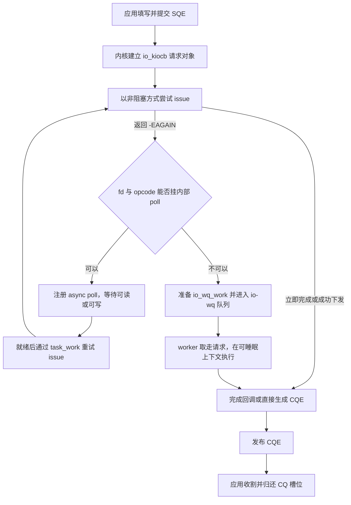
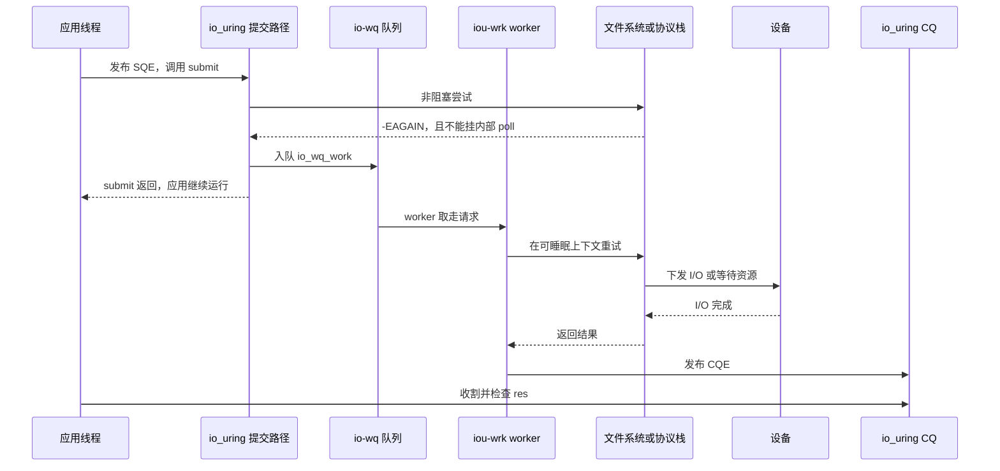
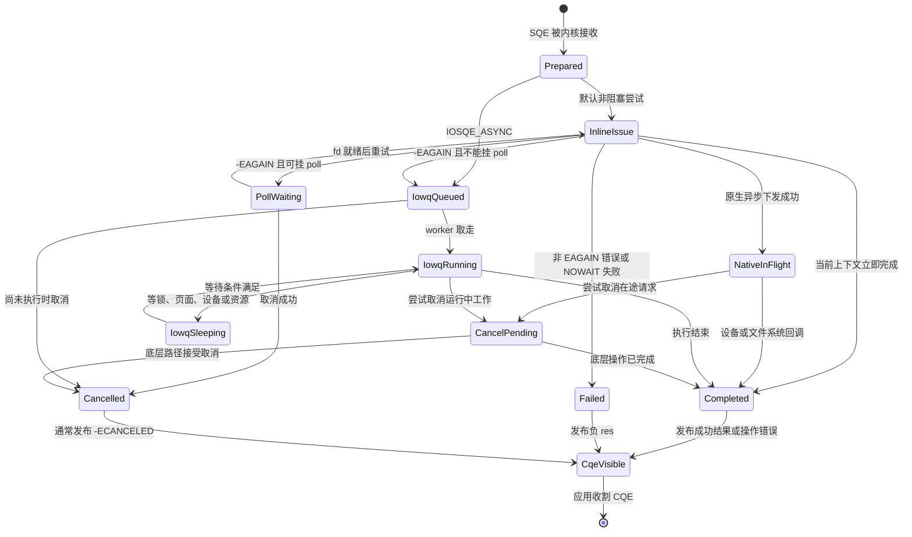

---
tags:
  - 高性能存储
  - io_uring
status: 已完成
---

# io-wq 与阻塞操作退化路径

> io_uring 提供的是异步接口，不承诺每个内核实现都不阻塞。提交请求后，内核先尝试用非阻塞方式执行；如果请求暂时做不了，内核会优先等待 fd 就绪，实在没有合适的异步路径时才交给 io-wq worker。应用线程仍可继续工作，但排队、线程调度和阻塞没有消失，只是从应用线程移到了内核 worker。

前置：[[2.1 SQ CQ 模型]]、[[2.3 iodepth 与提交完成路径]]、[[1.8 一次 read write 全路径图]]。

## 1. 概念与讨论边界

### 1.1 io-wq 是什么

**io-wq** 是 io_uring 使用的异步 worker 后端。它接收不能在当前提交上下文中安全完成的请求，选择或创建 worker 线程，让 worker 代替应用线程执行可能睡眠的内核路径。

可以把它类比为应用中的线程池，但要保留三个区别：

1. 它由内核管理，worker 会按负载动态创建和回收；
2. 请求执行时仍要遵守原文件、文件系统、凭据和取消规则；
3. 它不是通用 Linux `workqueue` 的另一个名字，而是 io_uring 自己的 worker 机制。

当前内核源码把 worker 的线程名设置成 `iou-wrk-<pid>`。名称属于实现细节，排障脚本应先查看目标内核的实际线程名，不能把字符串当稳定 ABI。

### 1.2 什么叫“阻塞操作”

这里的阻塞不是“函数调用耗时较长”的同义词。它指执行路径需要等待某个条件，当前执行线程会进入睡眠或无法继续，例如：

- buffered read 页缓存未命中，要等文件系统把页面读入；
- `fsync` 要等脏数据和持久化屏障完成；
- `openat`、`statx` 或 `fallocate` 要等目录项、元数据锁或存储访问；
- 管道或某些字符设备没有数据，且无法用 io_uring 的内部 poll 路径处理；
- 文件系统或块层资源暂时不足，请求无法以 NOWAIT 方式下发。

设备 I/O 本身有几十微秒延迟，不代表提交线程一定阻塞。原生异步 direct I/O 可以在当前上下文完成“下发”，设备稍后通过完成回调结束请求，期间没有通用 worker 一直等设备。

### 1.3 “退化”相对于什么

本文把理想路径定义为：请求在提交上下文中完成非阻塞下发，后续由 poll、设备中断或异步回调推进，不需要通用 worker 代执行。

所谓退化，是请求从这条路径转入 io-wq：

- 【事实】对应用仍是异步的，提交线程不必同步等到 I/O 完成；
- 【事实】内核多了一次工作排队和 worker 调度；
- 【可能结果】worker 真正进入阻塞，worker 上限又被用满时，后续请求在 io-wq 队列等待；
- 【取舍】吞吐可能仍比同步单线程高，但 p99 会包含 io-wq 排队和调度抖动。

所以“退化到 io-wq”不等于“退化成同步 API”。准确说法是：**异步接口通过线程代执行兼容了阻塞实现**。

### 1.4 本文不讨论什么

- SQPOLL 轮询 SQ、IOPOLL 轮询设备完成，见 [[2.7 SQPOLL 与 IOPOLL]]；
- io_uring 的 SQ/CQ 内存协议，见 [[2.1 SQ CQ 模型]]；
- linked request 的依赖顺序，见 [[2.9 Linked Operations]]；
- 各内核版本的 opcode 和 flag 支持范围，见 [[2.12 内核版本功能边界]]。

## 2. 端到端决策路径

io_uring 并不会看到一个 `READ` 就直接创建 worker。稳定的心智模型是“先试，再分流”：



图中的 `-EAGAIN` 表示“这次非阻塞尝试现在做不了”。它可能来自没有数据、资源暂不可用或具体文件系统拒绝 NOWAIT 路径。只有 `RWF_NOWAIT` 等语义明确要求“不等待”时，`-EAGAIN` 才直接成为应用可见结果；普通请求会继续走内部 poll 或 io-wq。

### 2.1 快路径：当前上下文直接完成

页缓存命中的小读、`NOP` 和部分无需等待的控制操作，可能在提交路径内完成。内核直接填 CQE，不需要 worker，也没有设备 I/O。

这条路径延迟最低，但不能据此推断下一次相同 opcode 仍走快路径。相同 `READ` 换一个 offset，页缓存命中状态就可能改变。

### 2.2 原生异步路径：下发后等待回调

支持异步 direct I/O 的文件系统可以把请求下发到块层，然后返回“已经在途”。设备完成后，块层和文件系统的回调继续向上，最终发布 io_uring CQE。

```text
提交线程：建立请求 → 文件系统 direct I/O → blk-mq → 返回，不等设备
设备侧：                            DMA → 中断/轮询 → end_io
完成侧：                                              → io_uring CQE
```

【事实】一个深度为 64 的原生异步 I/O 流，不要求 64 个 io-wq worker。worker 数量与 iodepth 不是同一个指标。

### 2.3 内部 poll 路径：等待“就绪”再重试

socket、管道等 fd 常有 `poll` 能力。以 `recv` 为例：

1. io_uring 先按非阻塞语义尝试接收；
2. 当前没有数据，返回 `-EAGAIN`；
3. 内核把 async poll 挂到 socket 等待队列；
4. 网卡收包，经驱动和协议栈把 socket 标为可读；
5. io_uring 安排 task work，重新执行 `recv`；
6. 数据复制到用户 buffer，发布 CQE。

这条路径与 epoll 都依赖 socket 等待队列，但通知层次不同。epoll 把“可读”交给应用，应用再调用 `recv`；io_uring 在内核中重试 `recv`，应用看到的是完成。详细对比见 [[2.2 io_uring 与 epoll 对比]]。

### 2.4 io-wq 路径：让 worker 进入可睡眠上下文

如果请求返回 `-EAGAIN`，又不能通过内部 poll 等待，内核会准备 `io_wq_work` 并入队。worker 随后执行同一个 opcode，此时不再要求整条路径保持非阻塞，可以睡眠等待锁、页面、元数据或设备。



## 3. 同一个 opcode 为什么会走不同路径

opcode 只说明“做什么”，不能单独决定“由谁执行”。还要看 fd 类型、打开标志、文件系统、缓存状态、资源状态和内核版本。

| 请求 | 常见路径 | 改变路径的条件 |
|---|---|---|
| buffered regular-file read | 缓存命中时 inline；未命中时可能进入 io-wq | 页缓存状态、文件系统 NOWAIT 支持、内存回收 |
| `O_DIRECT` regular-file read/write | 支持时直接异步下发 | 文件系统 direct-I/O 实现、对齐、块分配、锁和块层资源 |
| socket `recv` / `send` | 非阻塞尝试，`-EAGAIN` 后内部 poll | fd 是否可 poll、socket 状态、是否强制异步 |
| pipe / 字符设备 I/O | 内部 poll 或 unbounded io-wq | 具体 `file_operations` 是否实现 poll 与 NOWAIT |
| `fsync` | 常需要可睡眠上下文，可能进入 io-wq | 脏数据量、日志提交、设备 flush 延迟 |
| `openat` / `statx` / `fallocate` | 可能进入 io-wq | 目录项缓存、元数据锁、网络文件系统、空间分配 |

> [!warning] 不要维护“某 opcode 必进 io-wq”的静态表
> 内核实现和文件系统能力会变化。即使 opcode 相同，缓存命中与未命中也能走两条完全不同的路径。运行时 tracepoint 比背版本表可靠。

### 3.1 buffered I/O 的两面

buffered read 命中页缓存时，数据已经在内存中，内核只需复制到用户 buffer。这通常能在提交路径完成。

页缓存未命中时，文件系统要建立页面、下发设备 I/O，并等页面进入可用状态。若该路径不能以 NOWAIT 方式异步下发，io-wq worker 会走一次与同步 `pread` 相近的内部路径。差别在等待者：同步模型阻塞应用线程，io-wq 模型阻塞内核 worker。

因此 buffered I/O 压测很容易出现双峰分布：命中请求走 inline 快路径，未命中请求承担 io-wq 排队和设备延迟。只看平均值会把两类请求混在一起。

### 3.2 direct I/O 也不是“永不进 io-wq”

`O_DIRECT` 绕过页缓存，但文件系统仍可能处理：

- 文件偏移到物理块的映射；
- 未分配 extent 的写入；
- 与 truncate、hole punch 或其他写操作的锁冲突；
- 用户页固定与 DMA 映射；
- blk-mq tag 或驱动资源不足。

文件系统能异步下发时，不需要 worker 等设备；碰到只能在可睡眠上下文处理的分支时，仍可能 offload。`O_DIRECT` 是减少阻塞来源的前提之一，不是“不使用 io-wq”的合同。它的语义与对齐要求见 [[1.3 Buffered IO 与 O_DIRECT]]。

### 3.3 网络路径通常先用内部 poll

不能立即完成的 socket I/O 不应默认变成“一连接一个 worker”。当前 io_uring 会优先挂内部 poll，等 socket 可读或可写后重试。这正是 `IORING_FEAT_FAST_POLL` 所描述的能力方向。

但以下情况仍要谨慎：

- fd 没有合适的 poll 实现；
- opcode 与 fd 组合不支持内部 poll；
- 使用 `IOSQE_ASYNC` 强制从 worker 路径开始；
- 自定义字符设备或旧内核实现只提供阻塞接口。

【网络层边界】io-wq 不替代 NAPI、TCP 重传、拥塞控制或 socket 缓冲。它只决定哪条内核执行上下文负责调用文件操作。网络拥塞导致的长等待仍发生在协议栈和对端路径。

## 4. io-wq 的 worker 模型

### 4.1 worker 不是预先固定的一组线程

io-wq 会先唤醒空闲 worker。没有空闲 worker且尚未达到上限时，内核再创建 worker。worker 阻塞后，如果队列仍有工作，io-wq 可以继续补 worker；空闲 worker 会被回收。

【实现边界】当前主线源码使用空闲超时回收 worker，但超时数值不是 UAPI，业务逻辑不能依赖它。

### 4.2 bounded 与 unbounded

io-wq 把工作分为两类：

| 类别 | 直白定义 | 常见对象 | 默认上限 |
|---|---|---|---|
| bounded | 内核预期执行时间有界的工作 | 常规文件系统读写等 | `min(SQ entries, 4 × online CPUs)` |
| unbounded | 可能无限期等待的工作 | socket、pipe 和其他非普通文件路径 | 受 `RLIMIT_NPROC` 等任务限制约束 |

这里的 unbounded 不是“线程不绑 CPU”，bounded 也不是“保证在固定微秒内完成”。它们是 worker 资源核算类别。故障磁盘、卡住的网络文件系统和锁争用仍能让所谓 bounded 工作拖很久。

用户态接口使用两个元素的数组表示上限：

```text
values[0] = bounded worker 最大数
values[1] = unbounded worker 最大数
```

上限是天花板，不是预创建线程数。把 bounded 上限设为 64，不表示内核会常驻 64 个 worker。

### 4.3 worker 睡眠如何触发扩容

worker 执行阻塞路径时可能被调度出去。io-wq 的调度钩子会更新“正在运行的 worker”计数；如果没有可运行 worker而队列仍有工作，它会唤醒空闲 worker或创建新 worker，直到对应类别达到上限。

这个设计解决的是线程池中的经典问题：某个 worker 等磁盘时，不能让整个队列停住。但它也引入两种压力：

- 上限太低：请求在 io-wq 队列排队，p99 上升；
- 上限太高：大量 worker 带来线程栈、调度、缓存失效和 cgroup CPU 争用。

## 5. 关键数据结构

下面分成稳定 UAPI 与内核实现。应用只应依赖 UAPI；内核结构用于理解 trace 和性能现象。

### 5.1 用户态可见字段

| 字段或接口 | 作用 |
|---|---|
| `io_uring_sqe::flags` | `IOSQE_ASYNC` 可跳过首次 inline 非阻塞尝试 |
| `io_uring_sqe::rw_flags` | read/write 可携带 `RWF_NOWAIT` 等标志 |
| `io_uring_cqe::res` | 最终结果；负值是 `-errno` |
| `IORING_REGISTER_IOWQ_MAX_WORKERS` | 查询或设置两类 worker 上限 |
| `IORING_REGISTER_IOWQ_AFF` | 设置 io-wq worker 可运行的 CPU mask |
| `IORING_SETUP_ATTACH_WQ` | 创建 ring 时显式共享已有 ring 的异步 worker 后端 |
| `IORING_REGISTER_PERSONALITY` | 注册一组凭据，让 SQE 选择执行身份 |

### 5.2 `io_kiocb`：请求的内核对象

每个 SQE 进入内核后都会对应一个请求对象。当前源码中的 `struct io_kiocb` 包含：

- `ctx`：所属 ring 上下文；
- `tctx`：提交任务的 io_uring 上下文；
- `file`：目标文件对象；
- `cqe`：将来发布给用户的结果字段；
- `creds`：异步执行时要使用的凭据；
- `work`：进入 io-wq 时使用的 `io_wq_work`；
- `async_data`、poll 状态、引用计数和链式请求信息。

请求进入 worker 后不能依赖提交线程当时的栈变量。用户 buffer、路径参数和上下文对象必须满足对应 opcode 的生命周期规则。

### 5.3 `io_wq_work`：排队条目

`io_wq_work` 很小，核心是链表节点和 flags。当前内部 flag 包括：

- `IO_WQ_WORK_CANCEL`：请求被标记取消；
- `IO_WQ_WORK_HASHED`：按某个 hash key 串行；
- `IO_WQ_WORK_UNBOUND`：计入 unbounded worker 类别；
- `IO_WQ_WORK_CONCURRENT`：允许为强制异步工作积极创建并发 worker。

这些名称和位值是内核内部实现，不是用户态 ABI。应用不能复制定义后直接操纵它们。

### 5.4 `io_wq` 与 worker 账户

当前 `struct io_wq` 维护两组账户，每组包含：

```text
acct[bounded / unbounded]
    ├── work_list       待执行工作
    ├── nr_workers      已创建 worker 数
    ├── nr_running      当前可运行 worker 数
    ├── max_workers     worker 上限
    ├── free_list       空闲 worker
    └── workers_lock    worker 列表保护
```

此外还有 CPU mask、hash 串行状态和所属 task。当前主线把 `io_wq` 挂在 `io_uring_task` 上，说明 worker 资源与提交任务有关，不应简单理解成“每个 ring 永远有一个完全私有线程池”。版本演进和 `ATTACH_WQ` 又会改变共享关系。需要强隔离时，应在目标内核上验证实际所有权，必要时使用独立提交任务或进程。

### 5.5 hashed work 与隐含串行

某些普通文件操作需要按 inode 串行，内核会对 work 设置 hash。同一 hash key 上的请求不能并行执行，即使还有空闲 worker。

典型原因是保持文件位置、写入或元数据操作的正确顺序。当前源码对支持并行 direct write 的文件系统留有绕过条件，但这仍是实现判断。

【实践结论】看到 worker 数足够但吞吐上不去时，还要检查请求是否集中在同一个普通文件、是否被 hash 串行。增加 worker 上限不能解除正确性所需的串行约束。

## 6. 请求状态变化



![[图片/SVG/8_2_8_1.svg|900]]

*图 6-1：四条路径（inline / 原生异步 / 内部 poll / io-wq）；请求状态机主路径与取消汇合；worker 全睡时 work_list 排队形成 p99 毛刺。*

状态图有三个需要单独说明的边界：

1. `Completed` 表示内核请求结束，不表示数据已经被应用处理；应用还要收割 CQE；
2. 运行中的 worker 请求不一定能立刻取消。取消接口能找到它，不等于底层文件系统或设备能中止已经开始的操作；
3. CQE 的 `res` 才是最终事实。超时请求、取消请求和原请求可能各自产生 CQE，必须按 `user_data` 对号。

## 7. io-wq 如何形成排队和 p99 毛刺

### 7.1 多出来的延迟项

原生异步请求的粗略延迟可以写成：

```text
T_native = T_submit + T_fs/block/device + T_complete
```

进入 io-wq 后，多了两项：

```text
T_iowq = T_submit
       + T_iowq_queue
       + T_worker_schedule
       + T_blocking_operation
       + T_complete
```

这不是精确计时公式，而是定位清单。`T_iowq_queue` 取决于 worker 上限和前序工作，`T_worker_schedule` 受 CPU 负载、cpuset、cgroup quota 和 NUMA 放置影响，`T_blocking_operation` 才是文件系统或设备本身的等待。

### 7.2 worker 上限形成新的有界队列

假设 bounded worker 上限是 4，前四个请求都卡在慢速网络文件系统：

```text
worker 0..3：全部睡眠
io-wq work_list：第 5、6、7... 个请求排队
应用：仍可继续提交
CQ：长时间没有相应完成
```

如果应用只看“submit 很快”，会误判系统仍有余量。真正的背压已经出现在 io-wq 队列，只是应用没有设置自己的在途上限。

因此 [[2.3 iodepth 与提交完成路径]] 的恒满窗纪律仍然适用：应用必须限制“已提交未完成”数量，不能用 SQ 还有空槽作为继续提交的唯一依据。

### 7.3 头部阻塞不只来自 worker 数

以下机制都能让后来的快请求等前面的慢请求：

- bounded 或 unbounded worker 已达到上限；
- 同一 inode 上的 hashed work 被串行；
- linked request 明确建立依赖；
- 文件系统内部锁、日志事务或块层 tag 已满；
- cgroup CPU quota 让可运行 worker 周期性停顿。

排障时要问“排在哪一级”，而不是看到 `iou-wrk` 就把根因写成“线程池太小”。

## 8. 与同步 I/O、epoll 和原生异步 I/O 对比

| 模型 | 谁等待 | 是否需要通用 worker | 通知语义 | 主要代价 |
|---|---|---|---|---|
| 同步 `pread` | 应用线程 | 不需要 | 调用返回即完成 | 应用线程被占住，QD 依赖线程数 |
| epoll + 非阻塞 socket | 应用在 `epoll_wait` 睡眠，数据到达后自己 `recv` | 不需要 | 就绪 | 每次就绪后还要执行 I/O |
| io_uring 内部 poll | fd 等待队列保存请求，应用可做别的事 | 通常不需要 | 完成 | buffer 在途生命周期更长 |
| io_uring 原生异步 direct I/O | 设备与回调推进 | 不需要一请求一 worker | 完成 | 依赖文件系统和设备异步能力 |
| io_uring + io-wq | 内核 worker 可能睡眠 | 需要 | 完成 | work 排队、线程调度和 worker 资源 |

io-wq 的价值是兼容性：同一个 CQ 可以接收真正异步请求和线程代执行请求。代价是路径不再均匀。一个事件循环里混合两类请求时，单看 io_uring API 调用无法判断内部用了哪条路径。

## 9. `IOSQE_ASYNC` 与 `RWF_NOWAIT`

### 9.1 `IOSQE_ASYNC`：主动跳到 worker 路径

默认策略会先在提交上下文做一次非阻塞尝试。设置 `IOSQE_ASYNC` 后，请求直接 offload，不做第一次 inline 尝试：

```cpp
io_uring_sqe* sqe = ::io_uring_get_sqe(&ring);
::io_uring_prep_read(sqe, fd, buffer, length, offset);
sqe->flags |= IOSQE_ASYNC;
```

适用前提：测量已经证明该类请求几乎每次都会阻塞，第一次尝试只增加重复工作；同时需要让多个请求更早重叠。

不适合的情况：页缓存命中率高、操作经常 inline 完成，或者 worker 已是瓶颈。强制异步会把本来能直接完成的请求送进调度队列。

对可 poll 的 socket 操作，当前实现即使从 worker 路径开始，也会尽量使用非阻塞尝试和内部 poll，避免让 worker 长期卡在一个 socket 上。`IOSQE_ASYNC` 的稳定语义是“跳过首次 inline issue”，不应把它理解成“保证 worker 阻塞执行”。

### 9.2 `RWF_NOWAIT`：宁可返回 `-EAGAIN` 也不 offload

read/write 的 `RWF_NOWAIT` 表示只做不会阻塞的工作。当前无法完成时，CQE 返回 `-EAGAIN`，应用决定稍后重试、换路径或降级：

```cpp
io_uring_sqe* sqe = ::io_uring_get_sqe(&ring);
::io_uring_prep_read(sqe, fd, buffer, length, offset);
sqe->rw_flags |= RWF_NOWAIT;
```

【取舍】这能让延迟敏感事件循环避免意外进入 io-wq，但把复杂性推回应用：

- 文件系统和操作类型可能不支持 NOWAIT；
- `-EAGAIN` 是预期分支，不是可以忽略的错误；
- 重试必须限速，否则会形成用户态忙循环；
- 最终仍要有允许等待的慢路径，否则冷数据永远读不到。

## 10. worker 上限、CPU 亲和性与共享

### 10.1 查询和设置 worker 上限

liburing 提供 `io_uring_register_iowq_max_workers()`：

```cpp
std::array<unsigned, 2> values{0, 0};
int rc = ::io_uring_register_iowq_max_workers(&ring, values.data());
// values 现在是 bounded、unbounded 的当前上限

std::array<unsigned, 2> requested{8, 32};
rc = ::io_uring_register_iowq_max_workers(&ring, requested.data());
// 成功后 requested 被改写为设置前的旧值
```

设置后如果需要确认结果，再用 `{0, 0}` 查询。不要把调用后数组里的值误认为新上限。

【取舍】上限调整没有通用答案：

- 先记录默认值和实际 worker 峰值；
- worker 已满且 work 排队时，增加上限才可能有用；
- 根因是同 inode 串行、设备饱和或 CPU quota 时，增加上限只会放大争用；
- 调低 unbounded 上限可以控制线程增长，但必须配合应用级超时和在途限制。

### 10.2 CPU 亲和性

`IORING_REGISTER_IOWQ_AFF` 设置 worker 可运行 CPU mask。它适合隔离延迟敏感 worker，或把 worker 放在靠近目标设备和内存的 NUMA node。

前提是同时检查：

- 进程和容器 cpuset 是否允许这些 CPU；
- 是否与 SQPOLL、网络软中断或业务热点线程争同一物理核；
- cgroup CPU quota 是否小于实际需要；
- 内存与设备的 NUMA 距离。

亲和性不会让阻塞操作变成原生异步，只改变 worker 被调度到哪里。

### 10.3 多个 ring 的共享与隔离

`IORING_SETUP_ATTACH_WQ` 允许新 ring 显式共享已有 ring 的异步 worker 后端，可减少多 ring 应用的线程资源。

共享也会扩大故障域：一个 ring 的慢阻塞工作可能占用共享 worker，影响另一个 ring。反过来，仅创建两个 ring 也不一定获得完整隔离，因为当前实现的 io-wq 与提交 task 有关联。

需要隔离控制面慢操作与数据面请求时，可靠做法是：

1. 使用独立提交 task 或进程；
2. 分别设置在途上限、超时和 worker 预算；
3. 用 trace 验证两类请求是否仍共享 worker；
4. 不要在要求隔离的 ring 上使用 `ATTACH_WQ`。

## 11. 执行身份、顺序与取消

### 11.1 凭据不会因为换了 worker 而丢失

请求进入 io-wq 前，内核会保存执行所需凭据；worker issue 时临时切换到该请求的凭据，执行后恢复。SQE 也能通过 registered personality 选择预先注册的身份。

【安全边界】worker 不是绕过权限检查的后门。文件访问、LSM 和审计仍基于请求的有效凭据。多租户程序不要把不同权限请求共用同一个无类型 `user_data` 上下文，完成处理仍要核对租户和操作类型。

### 11.2 完成顺序仍然不保证

不同 worker 可以并发执行，原生异步请求也可能先于早提交的 io-wq 请求完成。需要顺序时使用 [[2.9 Linked Operations]] 的 LINK 语义，不能依赖提交先后。

hashed work 会为部分文件操作提供内部串行，但这是正确性实现，不是应用可见的通用排序合同。

### 11.3 取消不是强制终止线程

尚在 io-wq 队列中的 work 通常更容易取消。worker 已经执行底层操作时，内核只能请求取消；底层实现不接受取消时，请求可能继续运行到自然结束。

应用必须处理竞态：

```text
取消请求成功提交
    ├── 原请求先完成：原 CQE 是正常结果，取消 CQE 说明未取消到
    └── 取消先命中：原请求通常以 -ECANCELED 完成
```

超时和取消的完整语义见 [[2.10 Timeout 与 Cancellation]]。

## 12. Modern C++：RAII 探测程序

下面的程序完成四件事：

1. RAII 管理 ring、fd、对齐 buffer 和 CQE 归还；
2. 查询当前 bounded/unbounded worker 上限；
3. 提交一批 `O_DIRECT` 读；
4. 可选 `--force-async`，把同一批请求加上 `IOSQE_ASYNC` 做对照。

程序测到的是提交到 CQE 的端到端延迟，不能单独分离 io-wq 排队时间。是否真正进入 io-wq，要结合第 13 节 tracepoint。

```cpp
#include <liburing.h>

#include <fcntl.h>
#include <sys/stat.h>
#include <unistd.h>

#include <array>
#include <chrono>
#include <cstddef>
#include <cstdlib>
#include <iostream>
#include <memory>
#include <stdexcept>
#include <string_view>
#include <system_error>
#include <vector>

class UniqueFd {
public:
    explicit UniqueFd(int fd = -1) noexcept : fd_{fd} {}
    ~UniqueFd() {
        if (fd_ >= 0) {
            ::close(fd_);
        }
    }

    UniqueFd(const UniqueFd&) = delete;
    UniqueFd& operator=(const UniqueFd&) = delete;

    UniqueFd(UniqueFd&& other) noexcept : fd_{other.release()} {}
    UniqueFd& operator=(UniqueFd&& other) noexcept {
        if (this != &other) {
            if (fd_ >= 0) {
                ::close(fd_);
            }
            fd_ = other.release();
        }
        return *this;
    }

    [[nodiscard]] int get() const noexcept { return fd_; }

private:
    [[nodiscard]] int release() noexcept {
        const int old = fd_;
        fd_ = -1;
        return old;
    }

    int fd_;
};

class Ring {
public:
    explicit Ring(unsigned entries) {
        const int rc = ::io_uring_queue_init(entries, &ring_, 0);
        if (rc < 0) {
            throw std::system_error{-rc, std::system_category(),
                                    "io_uring_queue_init"};
        }
    }

    ~Ring() { ::io_uring_queue_exit(&ring_); }

    Ring(const Ring&) = delete;
    Ring& operator=(const Ring&) = delete;

    [[nodiscard]] io_uring* get() noexcept { return &ring_; }

    [[nodiscard]] std::array<unsigned, 2> worker_limits() {
        std::array<unsigned, 2> values{0, 0};
        const int rc =
            ::io_uring_register_iowq_max_workers(&ring_, values.data());
        if (rc < 0) {
            throw std::system_error{-rc, std::system_category(),
                                    "query io-wq worker limits"};
        }
        return values;
    }

    void set_worker_limits(unsigned bounded, unsigned unbounded) {
        std::array<unsigned, 2> requested{bounded, unbounded};
        const int rc =
            ::io_uring_register_iowq_max_workers(&ring_, requested.data());
        if (rc < 0) {
            throw std::system_error{-rc, std::system_category(),
                                    "set io-wq worker limits"};
        }
    }

private:
    io_uring ring_{};
};

class AlignedBuffer {
public:
    AlignedBuffer(std::size_t size, std::size_t alignment) : size_{size} {
        const int rc = ::posix_memalign(&data_, alignment, size);
        if (rc != 0) {
            throw std::system_error{rc, std::generic_category(),
                                    "posix_memalign"};
        }
    }

    ~AlignedBuffer() { ::free(data_); }

    AlignedBuffer(const AlignedBuffer&) = delete;
    AlignedBuffer& operator=(const AlignedBuffer&) = delete;

    [[nodiscard]] void* data() noexcept { return data_; }
    [[nodiscard]] std::size_t size() const noexcept { return size_; }

private:
    void* data_ = nullptr;
    std::size_t size_ = 0;
};

class CqeLease {
public:
    CqeLease(io_uring* ring, io_uring_cqe* cqe) noexcept
        : ring_{ring}, cqe_{cqe} {}

    ~CqeLease() { ::io_uring_cqe_seen(ring_, cqe_); }

    CqeLease(const CqeLease&) = delete;
    CqeLease& operator=(const CqeLease&) = delete;

    [[nodiscard]] const io_uring_cqe& get() const noexcept { return *cqe_; }

private:
    io_uring* ring_;
    io_uring_cqe* cqe_;
};

struct Request {
    static constexpr std::size_t kBlockSize = 4096;

    explicit Request(off_t file_offset)
        : buffer{kBlockSize, kBlockSize}, offset{file_offset} {}

    AlignedBuffer buffer;
    off_t offset;
    std::chrono::steady_clock::time_point submitted_at;
};

[[nodiscard]] UniqueFd open_direct_readonly(const char* path) {
    const int fd = ::open(path, O_RDONLY | O_DIRECT | O_CLOEXEC);
    if (fd < 0) {
        throw std::system_error{errno, std::generic_category(), path};
    }
    return UniqueFd{fd};
}

int main(int argc, char** argv) {
    try {
        if (argc < 2 || argc > 3) {
            std::cerr << "usage: " << argv[0]
                      << " <aligned-test-file> [--force-async]\n";
            return 2;
        }

        const bool force_async =
            argc == 3 && std::string_view{argv[2]} == "--force-async";
        if (argc == 3 && !force_async) {
            throw std::invalid_argument{"unknown option"};
        }

        constexpr unsigned kDepth = 8;
        Ring ring{16};
        UniqueFd fd = open_direct_readonly(argv[1]);

        struct stat st {};
        if (::fstat(fd.get(), &st) < 0) {
            throw std::system_error{errno, std::generic_category(), "fstat"};
        }
        const auto blocks = static_cast<std::size_t>(st.st_size) /
                            Request::kBlockSize;
        if (blocks < kDepth) {
            throw std::runtime_error{"test file must contain at least 8 blocks"};
        }

        const auto limits = ring.worker_limits();
        std::cout << "io-wq limits: bounded=" << limits[0]
                  << " unbounded=" << limits[1] << '\n';

        std::vector<std::unique_ptr<Request>> requests;
        requests.reserve(kDepth);

        for (unsigned i = 0; i < kDepth; ++i) {
            auto request = std::make_unique<Request>(
                static_cast<off_t>(i * Request::kBlockSize));
            io_uring_sqe* sqe = ::io_uring_get_sqe(ring.get());
            if (sqe == nullptr) {
                throw std::runtime_error{"SQ has no free entry"};
            }

            ::io_uring_prep_read(sqe, fd.get(), request->buffer.data(),
                                 request->buffer.size(), request->offset);
            if (force_async) {
                sqe->flags |= IOSQE_ASYNC;
            }
            ::io_uring_sqe_set_data(sqe, request.get());
            request->submitted_at = std::chrono::steady_clock::now();
            requests.push_back(std::move(request));
        }

        unsigned submitted = 0;
        while (submitted < kDepth) {
            const int rc = ::io_uring_submit(ring.get());
            if (rc < 0) {
                throw std::system_error{-rc, std::system_category(),
                                        "io_uring_submit"};
            }
            if (rc == 0) {
                throw std::runtime_error{"submit made no progress"};
            }
            submitted += static_cast<unsigned>(rc);
        }

        for (unsigned done = 0; done < kDepth; ++done) {
            io_uring_cqe* raw_cqe = nullptr;
            const int rc = ::io_uring_wait_cqe(ring.get(), &raw_cqe);
            if (rc < 0) {
                throw std::system_error{-rc, std::system_category(),
                                        "io_uring_wait_cqe"};
            }

            CqeLease cqe{ring.get(), raw_cqe};
            auto* request = static_cast<Request*>(
                ::io_uring_cqe_get_data(raw_cqe));
            if (cqe.get().res < 0) {
                throw std::system_error{-cqe.get().res, std::system_category(),
                                        "read CQE"};
            }

            const auto latency = std::chrono::duration_cast<
                std::chrono::microseconds>(
                std::chrono::steady_clock::now() - request->submitted_at);
            std::cout << "offset=" << request->offset
                      << " bytes=" << cqe.get().res
                      << " latency_us=" << latency.count() << '\n';
        }
    } catch (const std::exception& error) {
        std::cerr << error.what() << '\n';
        return 1;
    }
}
```

编译和运行：

```bash
g++ -std=c++20 -O2 -Wall -Wextra -Wpedantic iowq_probe.cpp -luring -o iowq_probe
./iowq_probe /mnt/test/aligned-file
./iowq_probe /mnt/test/aligned-file --force-async
```

两次运行的文件、CPU 绑定、缓存状态和后台负载必须一致。`--force-async` 只建立“默认决策与强制 offload”的对照，不能证明默认运行一定完全绕过 io-wq。

## 13. 如何观测 io-wq 退化

### 13.1 先看 worker 是否出现

```bash
pid=<目标进程PID>
ps -L -p "$pid" -o pid,tid,psr,stat,wchan:28,comm
```

当前内核常显示 `iou-wrk-<pid>`。重点不是只数线程，还要看：

- `STAT` 是否长期处于睡眠；
- `WCHAN` 落在文件系统锁、页等待、块层还是网络等待；
- worker 是否持续增加并接近设置上限；
- worker 所在 CPU 是否被 cgroup quota 或其他线程挤压。

查看每个 task 的名字：

```bash
for task in /proc/<PID>/task/*; do
    printf '%s ' "${task##*/}"
    cat "$task/comm"
done
```

### 13.2 用 io_uring tracepoint 证明请求被 offload

目标内核的 tracepoint 可能随版本变化，先列出实际事件：

```bash
sudo trace-cmd list -e 'io_uring:*'
```

当前主线包含这些关键事件：

```bash
sudo trace-cmd record \
    -e io_uring:io_uring_submit_req \
    -e io_uring:io_uring_queue_async_work \
    -e io_uring:io_uring_poll_arm \
    -e io_uring:io_uring_complete \
    -- ./iowq_probe /mnt/test/aligned-file --force-async

trace-cmd report
```

解释方式：

| 事件 | 能证明什么 | 不能证明什么 |
|---|---|---|
| `submit_req` | 请求进入提交处理 | 是否进入 io-wq |
| `poll_arm` | 请求挂了内部 poll | 后续一定不会再 offload |
| `queue_async_work` | 请求确实进入异步 worker 队列 | worker 何时开始执行 |
| `complete` | CQE 即将发布及最终 `res` | 中间时间具体花在哪一级 |

用 bpftrace 按 opcode 和 hashed 标志计数：

```bash
sudo bpftrace -e '
tracepoint:io_uring:io_uring_queue_async_work
{
    @[args->opcode, args->hashed] = count();
}'
```

opcode 是数值。映射名称时使用目标系统的 `<linux/io_uring.h>` 或相同版本内核源码，不能拿另一台机器的枚举表硬套。

### 13.3 看调度而不是只看 IOPS

```bash
sudo perf sched record -p <PID> -- sleep 10
sudo perf sched timehist -p <PID>

pidstat -wt -p <PID> 1
```

关注 worker 的 runnable 等待、上下文切换和周期性停顿。若 `queue_async_work` 数量上升而设备 `await` 没变，p99 增量可能在 io-wq 排队或 CPU 调度；若 worker 长期睡在块层或文件系统等待，继续向下用 [[9.3 blktrace 与块层生命周期]] 和 [[9.4 eBPF biolatency biosnoop]] 分层。

### 13.4 观测的限制

稳定 tracepoint 能证明“进入 io-wq”，但不直接提供完整的“入队到 worker 开始”直方图。精确分段通常需要：

- 用 `user_data` 关联 submit、queue 和 complete 事件；
- 加 `sched_switch` / `sched_wakeup` 观察 worker 调度；
- 在固定内核版本上使用 BPF kprobe 或 fentry 追踪 worker 函数。

后两种依赖内核符号和实现，升级后必须重新验证 attach 点。

## 14. 对照实验

### 14.1 实验目标

回答三个问题：

1. 默认 direct I/O 有多少请求进入 io-wq；
2. 强制 `IOSQE_ASYNC` 后，吞吐、p50、p99 和上下文切换如何变化；
3. buffered 冷读发生时，io-wq worker 和尾延迟是否同步增加。

### 14.2 fio 对照

fio 的 `force_async=N` 表示每 N 个请求设置一次强制异步。`force_async=1` 表示每个请求都设置。

```bash
# A：默认 direct I/O 路径
fio --name=direct-native \
    --filename=/mnt/test/fio.data \
    --ioengine=io_uring --rw=randread --bs=4k \
    --direct=1 --iodepth=32 --time_based=1 --runtime=30 \
    --group_reporting

# B：相同工作负载，每个 SQE 强制 IOSQE_ASYNC
fio --name=direct-force-async \
    --filename=/mnt/test/fio.data \
    --ioengine=io_uring --rw=randread --bs=4k \
    --direct=1 --iodepth=32 --force_async=1 \
    --time_based=1 --runtime=30 --group_reporting

# C：buffered 随机读，用于观察缓存未命中与 worker 路径
fio --name=buffered \
    --filename=/mnt/test/fio.data \
    --ioengine=io_uring --rw=randread --bs=4k \
    --direct=0 --iodepth=32 --invalidate=1 \
    --time_based=1 --runtime=30 --group_reporting
```

`invalidate=1` 不保证所有文件系统和所有时刻都得到完全冷缓存。buffered 对照应在可丢弃测试机上进行，并让数据集大于可用内存；不要在生产机通过全局 drop_caches 制造冷缓存。

### 14.3 必须同时记录的指标

| 层 | 指标 |
|---|---|
| 应用 | IOPS、带宽、p50、p99、p999、实际 iodepth 分布 |
| io_uring | `queue_async_work`、`poll_arm`、CQE 错误分布 |
| worker | 数量峰值、上下文切换、runnable 时间、WCHAN |
| 文件系统与块层 | cache miss、块层 Q→D 与 D→C 时间 |
| 设备 | `iostat -x` 的 `aqu-sz`、`await`，设备 p99 |

只有 B 比 A 多出 `queue_async_work` 且尾延迟同步变化，才能把差异归因到强制 offload。设备负载、CPU 频率和缓存状态不同，结论就失去因果性。

## 15. 故障案例：慢元数据操作拖累读请求

### 15.1 现象

一个进程用同一提交 task 处理两类操作：

- 数据面：大量延迟敏感的小读；
- 控制面：周期性 `fsync`、`fallocate` 和目录元数据操作。

高峰期表现为：submit 延迟仍低，CQE 一段时间不回来，p99 周期性升高，`iou-wrk` 数量触顶。

### 15.2 机制链

```text
慢 fsync / 元数据锁
    → bounded worker 睡眠
    → worker 达到上限
    → 后续需要 io-wq 的读在 work_list 排队
    → CQE 延迟增加
    → 应用恒满窗继续补请求
    → 在途内存与尾延迟一起上升
```

如果这些操作集中在同一 inode，hashed work 还可能进一步串行。此时单纯把 worker 上限从 4 改到 64，可能把瓶颈从 io-wq 队列推到文件系统锁或设备队列，p99 不一定改善。

### 15.3 证据与修复顺序

1. tracepoint 证明慢请求与受影响读都进入 `queue_async_work`；
2. WCHAN 或文件系统 trace 证明 worker 在元数据、日志或设备等待；
3. 检查 worker 上限、hashed 标志和应用在途数；
4. 把控制面操作交给独立提交 task 或进程，并设置单独并发预算；
5. 给 `fsync` 等慢操作设置业务超时和节流；
6. 再测 p99，确认毛刺消失而不是被移到设备层。

完整的尾延迟定位方法见 [[9.5 p99 毛刺定位]]。

## 16. 常见误区

> [!warning] 常见错误
> 1. **“用了 io_uring 就没有线程池”**：不能原生异步执行的路径仍要 io-wq 代做。
> 2. **“每个在途 I/O 都占一个 worker”**：原生异步 direct I/O 下发后由设备和回调推进，iodepth 可以远大于 worker 数。
> 3. **“socket 没数据就进 io-wq 阻塞”**：可 poll 的 socket 通常先挂内部 poll，不是一连接一 worker。
> 4. **“`O_DIRECT` 保证绕过 io-wq”**：它绕过页缓存，不绕过文件系统锁、块映射和资源等待。
> 5. **“`IOSQE_ASYNC` 更异步，所以更快”**：它跳过 inline 尝试并增加排队调度，缓存命中负载常会变慢。
> 6. **“worker 多就提高上限”**：先分清 worker 是忙、睡眠、hash 串行还是被 CPU quota 限制。
> 7. **“两个 ring 自动隔离 worker”**：worker 与提交 task、ring 配置和内核版本都有关；必须用 trace 验证。
> 8. **“取消成功提交就能立即停掉 worker”**：运行中的底层操作可能无法中止，最终以 CQE 为准。
> 9. **“submit 很快说明没有排队”**：排队可能已经转移到 io-wq、文件系统、blk-mq 或设备。

## 17. 最佳实践与工程结论

### 17.1 设计顺序

1. 先按 opcode、fd 类型和缓存语义分类请求；
2. 用 `queue_async_work` tracepoint 测出实际 offload 比例；
3. 把原生异步数据面与长阻塞控制面分开；
4. 在应用层设置在途上限，不能让 io-wq 成为第一道背压；
5. 再调整 worker 上限和 CPU mask；
6. 用 p50、p99、p999 和调度数据验证，不只看平均 IOPS。

### 17.2 减少意外 offload

- 存储数据面在语义允许时使用对齐的 `O_DIRECT`，并验证目标文件系统的异步 direct-I/O 能力；
- 网络 fd 使用非阻塞语义，让内部 poll 有机会接管等待；
- 延迟敏感读可评估 `RWF_NOWAIT`，把 `-EAGAIN` 交给受控慢路径；
- 避免在热路径混入 `openat`、`statx`、`fallocate`、大范围 buffered miss 和同步持久化；
- `IOSQE_ASYNC` 只在 trace 和对照实验说明有收益时启用。

### 17.3 不能消除 offload 时

- 为 bounded 与 unbounded 工作分别设并发预算；
- 限制已提交未完成请求数，向上游传递背压；
- 长操作设置超时，但接受取消不一定立即生效；
- 用独立提交 task 或进程隔离故障域；
- 监控 worker 数量、队列 offload 率、上下文切换与 p99；
- 保留同步线程池作为旧内核或不支持 opcode 的显式回退时，要让回退可观测，不能静默切换。

## 18. 关键结论

| 结论 | 性质 |
|---|---|
| io_uring 先尝试非阻塞 issue；`-EAGAIN` 后优先内部 poll，不能 poll 才进入 io-wq | 当前内核机制 |
| io-wq 保持应用侧异步，但增加 work 排队、worker 调度和可能的线程睡眠 | 事实 |
| opcode 不能单独决定路径；fd 类型、缓存、文件系统、资源和版本共同决定 | 事实 |
| bounded/unbounded 是 worker 核算类别，不是硬实时保证，也不是 CPU 绑定术语 | 事实 |
| iodepth 不等于 worker 数；原生异步请求不需要一请求一 worker | 事实 |
| `IOSQE_ASYNC` 跳过首次 inline 尝试，适合“几乎必阻塞”且经过测量的请求 | 事实 / 取舍 |
| `RWF_NOWAIT` 用 `-EAGAIN` 换取不进入等待路径，应用必须实现受控重试或慢路径 | 事实 / 取舍 |
| worker 上限过低形成排队，过高放大线程和 CPU 争用；调参前先查 hash、锁和设备瓶颈 | 实践结论 |
| `queue_async_work` tracepoint 是判断实际 offload 的直接证据 | 实践结论 |
| 控制面慢操作与数据面请求应隔离提交上下文和并发预算，不能只分两个 ring 就假定隔离 | 实践结论 |

## 19. 关联笔记

- [[2.1 SQ CQ 模型]] - SQE、CQE 与请求生命周期的基础
- [[2.2 io_uring 与 epoll 对比]] - 内部 poll 与 epoll 就绪通知的差别
- [[2.3 iodepth 与提交完成路径]] - 应用在途窗口与背压
- [[2.7 SQPOLL 与 IOPOLL]] - 两类 polling 与 io-wq 的边界
- [[2.9 Linked Operations]] - 显式顺序与链式失败
- [[2.10 Timeout 与 Cancellation]] - 运行中请求的超时取消竞态
- [[2.12 内核版本功能边界]] - worker 控制接口和实现演进
- [[1.3 Buffered IO 与 O_DIRECT]] - buffered miss 与 direct-I/O 前提
- [[9.5 p99 毛刺定位]] - io-wq 排队在尾延迟分层中的位置

## 20. 参考资料

- [io_uring_sqe_set_flags(3)](https://man7.org/linux/man-pages/man3/io_uring_sqe_set_flags.3.html) - `IOSQE_ASYNC` 的稳定语义
- [io_uring_register_iowq_max_workers(3)](https://man7.org/linux/man-pages/man3/io_uring_register_iowq_max_workers.3.html) - bounded/unbounded worker 与默认上限
- [io_uring_register(2)](https://man7.org/linux/man-pages/man2/io_uring_register.2.html) - worker 上限和 CPU affinity 注册接口
- [io_uring_setup(2)](https://man7.org/linux/man-pages/man2/io_uring_setup.2.html) - `IORING_SETUP_ATTACH_WQ`
- [Linux `io_uring/io_uring.c`](https://github.com/torvalds/linux/blob/master/io_uring/io_uring.c) - 非阻塞尝试、async poll 与 io-wq 分流
- [Linux `io_uring/io-wq.c`](https://github.com/torvalds/linux/blob/master/io_uring/io-wq.c) - worker 创建、调度、回收与两类账户
- [Linux `io_uring/opdef.c`](https://github.com/torvalds/linux/blob/master/io_uring/opdef.c) - opcode 的 poll、hash 和 unbounded 属性
- [Linux io_uring tracepoints](https://github.com/torvalds/linux/blob/master/include/trace/events/io_uring.h) - `queue_async_work`、`poll_arm` 与 `complete`
- [fio HOWTO](https://github.com/axboe/fio/blob/master/HOWTO.rst) - `force_async` 与 io_uring 实验参数
