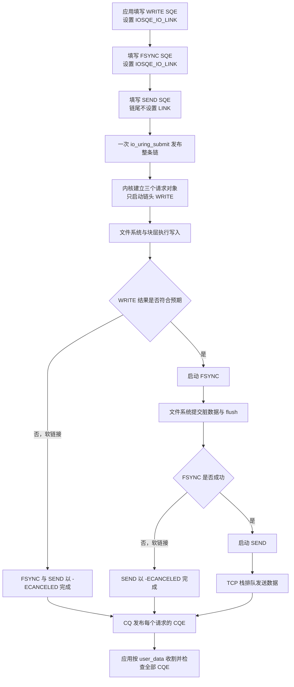
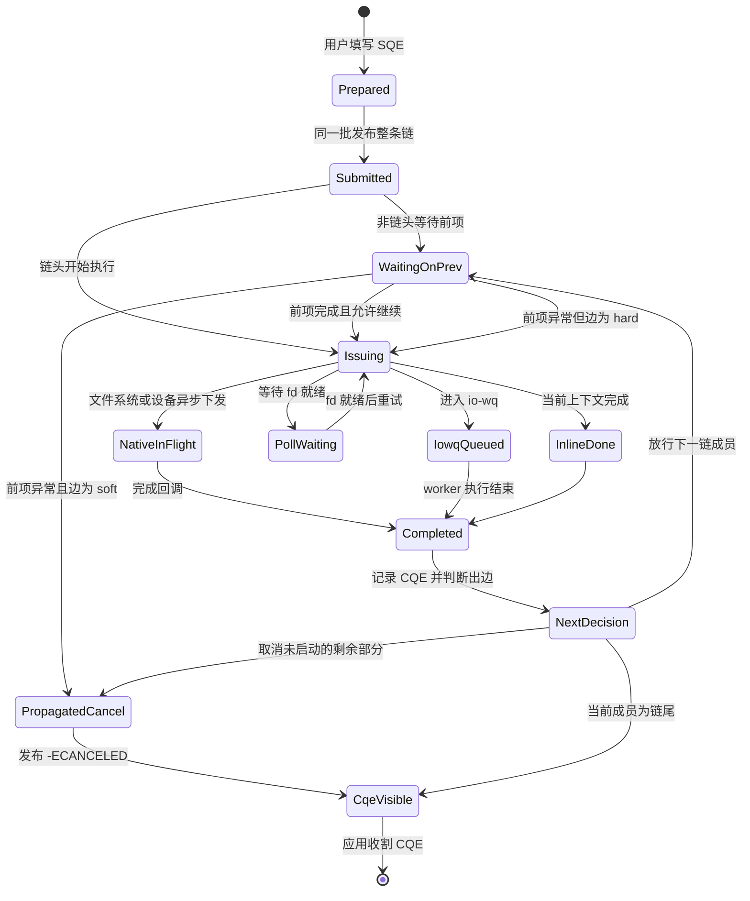

---
tags:
  - 高性能存储
status: 已完成
---

# Linked Operations

> Linked Operations 把相邻 SQE 组成一条依赖链。内核只在前一项完成后启动后一项，因此应用可以一次提交 `write → fsync`、`connect → send` 等有先后关系的操作。它表达的是执行顺序和失败传播，不提供事务的原子性、回滚、隔离或持久性。

前置：[[2.1 SQ CQ 模型]]、[[2.5 liburing 基础用法]]、[[2.8 io-wq 与阻塞操作退化路径]]。

## 1. 概念与边界

### 1.1 为什么独立 SQE 不保证顺序

普通 SQE 彼此独立。应用先填写 A，再填写 B，只能说明 A 在 SQ 中排在 B 前面，不能推出 A 一定先完成。内核可能让两项并行执行，也可能把一项交给 io-wq，另一项走页缓存或设备异步路径。完成顺序由实际执行路径决定。

假设程序需要执行：

```text
写数据块 → 刷新文件 → 发送“写入完成”响应
```

如果三项独立提交，`fsync` 可能在写操作完成前开始，响应也可能先于持久化结果返回。应用通常要在收到 A 的 CQE 后准备 B，再收到 B 的 CQE 后准备 C。这是一个用户态状态机，每个阶段都可能增加一次提交和一次唤醒。

Linked Operations 允许应用提前准备整条链：

```text
A --依赖--> B --依赖--> C
```

内核先执行 A。A 完成后，内核根据 A 到 B 之间的链接类型决定启动 B 还是取消剩余部分。

### 1.2 一条链提供什么

一条普通链提供三项语义：

1. **链内依赖顺序**：后一项在前一项完成后才启动；
2. **软链接失败传播**：前项出现错误或非预期结果时，尚未启动的后项以 `-ECANCELED` 完成；
3. **一次批量提交**：整条链在同一提交边界内交给内核，不必逐项回到用户态决定下一步。

不同链之间仍可并行。链外的普通 SQE 也不会因为某条链存在而自动等待。

### 1.3 它不是存储事务

数据库事务常用 ACID 描述，其中原子性表示“全部成功或全部不发生”。Linked Operations 不具备这个性质。

例如 `write → fsync` 中，`write` 已经修改页缓存，随后 `fsync` 失败：

- 内核不会撤销已经完成的 `write`；
- 其他线程或进程仍可能观察到新数据；
- 崩溃后数据能否保留，取决于文件系统、设备缓存和持久化屏障；
- 链只把两个请求按顺序执行，并把每一步结果放进各自 CQE。

> [!warning] 链式取消不是回滚
> `-ECANCELED` 只表示某个后续请求没有继续执行。它不撤销链中已经完成的文件、网络或设备操作。需要崩溃一致性时，仍要设计 WAL、写临时文件后原子重命名或其他恢复协议，见 [[6.1 WAL 与 Crash Consistency]]。

### 1.4 本文讨论范围

本文讨论：

- `IOSQE_IO_LINK` 与 `IOSQE_IO_HARDLINK`；
- 链的提交边界、失败传播和 CQE 处理；
- `open → read → close` 中 fd 依赖的处理；
- 链与 io-wq、文件系统、块层及网络栈的关系；
- linked timeout 的位置和结果组合。

通用取消竞态与 timeout opcode 的完整参数见 [[2.10 Timeout 与 Cancellation]]；不同内核版本的支持范围见 [[2.12 内核版本功能边界]]。

## 2. 端到端执行路径

下面以 `write → fsync → send` 为例。`write` 和 `fsync` 操作同一文件，`send` 把处理结果发给已连接的 socket。



这条路径可分成四层：

1. **用户态表达层**：SQE 的顺序、`flags` 和 `user_data` 定义链；
2. **io_uring 调度层**：内核保存依赖，只放行当前可执行的链成员；
3. **操作实现层**：放行后的请求进入 VFS、文件系统、io-wq、网络协议栈或其他 opcode 对应路径；
4. **硬件层**：块 I/O 继续经过 blk-mq、驱动、DMA 和存储设备；网络 I/O 继续经过 TCP/IP、网卡队列和对端。

【事实】链接只改变第 2 层的放行顺序。它不会跳过页缓存、文件系统日志、块层队列、TCP 握手、拥塞控制或设备缓存。

以 `connect → send` 为例，`send` 会等 `connect` 完成后才启动。这里的“connect 完成”仍由 TCP 状态机决定，通常要经过 SYN、SYN-ACK、ACK。链接没有合并网络报文，也没有消除往返时延。

## 3. 链按相邻 SQE 和边建立

### 3.1 两种链接标志

| SQE 标志 | 直白含义 | 前项完成结果异常时 | 常见用途 |
|---|---|---|---|
| `IOSQE_IO_LINK` | 本项与下一项建立软链接 | 不启动后续链，剩余请求返回 `-ECANCELED` | 后项只有在前项成功时才有意义 |
| `IOSQE_IO_HARDLINK` | 本项与下一项建立硬链接 | 仍尝试启动下一项 | 清理、审计、必须执行的收尾操作 |

`IOSQE_IO_HARDLINK` 已包含 LINK 语义，不需要同时再设置 `IOSQE_IO_LINK`。

### 3.2 标志描述的是“本项到下一项”

链的链接类型属于边，不属于整个链：

```text
A --soft--> B --hard--> C
```

对应写法是：

```cpp
sqe_a->flags |= IOSQE_IO_LINK;      // A 到 B 是软链接
sqe_b->flags |= IOSQE_IO_HARDLINK;  // B 到 C 是硬链接
// C 是链尾，不设置 LINK
```

如果 A 失败，B 和 C 都不执行；如果 B 失败，C 仍执行。这个组合适合“打开成功后读取，读取无论成功与否都关闭”的资源生命周期。

### 3.3 提交边界是链边界

链必须满足以下规则：

1. 链成员在 SQ 中连续排列；
2. 整条链放在同一次提交中；
3. 除链尾外，每项都设置 soft link 或 hard link；
4. 第一个没有链接标志的 SQE 结束当前链；
5. 提交边界不会延续链。提交批的最后一个 SQE 即使设置 LINK，也不能与下一次提交的第一个 SQE 建链。

【实践结论】准备好整条链后再调用一次 `io_uring_submit`。如果 SQ 剩余槽位放不下整条链，应先提交其他请求并腾出空间，不要把一条链拆成两批。

链长受一次提交时可用 SQE 数量限制。很长的链还会占用更多在途请求对象和 CQ 容量，工程上应保持短小。

### 3.4 多线程提交要保护相邻关系

链依赖 SQE 的物理相邻顺序。如果线程 A 准备链头后，线程 B 在同一个 ring 插入一个 SQE，线程 A 原本设计的下一项就不再相邻。

共享 ring 时至少选择一种纪律：

- 由单一提交线程负责构造和发布链；
- 用互斥量覆盖“取得全部 SQE、填写整条链、提交”这一段；
- 每个执行线程使用独立 ring，再在更高层汇总完成事件。

只给 `io_uring_get_sqe` 加锁不够。锁必须覆盖整条链的构造，否则其他生产者仍能插入中间位置。

### 3.5 与 `IOSQE_IO_DRAIN` 的区别

| 机制 | 等待范围 | 对后续请求的影响 | 适用场景 |
|---|---|---|---|
| LINK / HARDLINK | 只约束同一条链中的相邻成员 | 链外请求可并行 | 局部依赖路径 |
| `IOSQE_IO_DRAIN` | 等待本 ring 中更早提交的请求完成 | DRAIN 完成前，后来的请求也不能启动 | ring 级屏障 |

`IOSQE_IO_DRAIN` 会扩大串行范围。只需表达 A 依赖 B 时使用 LINK，不要用 DRAIN 把无关请求一起挡住。

## 4. 失败传播与 CQE 语义

### 4.1 软链接如何断链

假设链为 `A --soft--> B --soft--> C`：

| A 的结果 | A 的 CQE | B 的 CQE | C 的 CQE | 实际执行 |
|---|---:|---:|---:|---|
| 成功且结果符合预期 | A 的正常结果 | B 的实际结果 | 取决于 B | 继续放行 |
| `-EIO`、`-EBADF` 等错误 | 原始负错误码 | `-ECANCELED` | `-ECANCELED` | B、C 不启动 |
| read/write 短 I/O | 实际字节数 | `-ECANCELED` | `-ECANCELED` | B、C 不启动 |

io_uring 不只把负数当成断链条件。对 read/write 一类有预期长度的请求，短读和短写也是“非预期结果”，会切断软链接。

例子：程序要求读 4096 字节，文件在当前位置到 EOF 只剩 1000 字节。read 的 CQE 为 `1000`，它不是系统调用错误，但软链接后的 write 仍会被取消。应用必须同时检查：

```cpp
if (cqe->res < 0) {
    // 操作错误，-cqe->res 是 errno 值
} else if (static_cast<std::size_t>(cqe->res) != requested) {
    // 短 I/O，需要根据业务决定重试、接受 EOF 或终止
}
```

### 4.2 硬链接只忽略完成结果

硬链接表示“即使前项完成结果异常，也继续下一项”。它不能修复前项，也不会把错误改成成功。

还有一条边界：如果内核连父请求都无法正确提交或准备，硬链接仍可能被切断。HARDLINK 保证的是对已正确提交请求的完成结果保持链接，不是对无效 SQE 和提交故障的兜底。

### 4.3 每个请求仍有自己的 CQE

断链后，应用仍要收割整条链对应的 CQE：

- 真正失败的请求保留原始错误或短 I/O 结果；
- 因前项失败而未启动的请求通常返回 `-ECANCELED`；
- hard link 后真正执行的请求报告自己的实际结果；
- linked timeout 还有单独的 timeout CQE。

不要在看到第一个错误后停止收割。未收割的 CQE 会占用 CQ 槽位，也会让链上下文和 buffer 的回收时机变得含糊。

链成员的 CQE 按链内完成顺序发布，但同一 ring 中其他链和独立请求的 CQE 可以插入其间。工程代码仍应使用 `user_data` 标识请求，不要用“第几个收割到”推断操作类型。

### 4.4 找根因而不是统计一串取消

如果观测到：

```text
OPEN:  -ENOENT
READ:  -ECANCELED
CLOSE: -ECANCELED
```

根因是 OPEN 的 `-ENOENT`。READ 和 CLOSE 是传播结果，不是三个独立故障。日志应记录链 ID、步骤 ID、每步 `res` 和请求参数摘要，并把第一个非传播错误标为根因。

## 5. 请求状态变化



SVG待定

这张状态图区分了两类状态：

- `WaitingOnPrev`、`NextDecision` 和 `PropagatedCancel` 属于链接调度；
- `NativeInFlight`、`PollWaiting` 和 `IowqQueued` 属于单个请求的实际执行路径。

【事实】LINK 不会强制所有请求走同一种后端。链中第一个请求可能走 io-wq，第二个命中页缓存，第三个进入块设备异步路径。顺序由链接层控制，执行后端由 opcode、fd 类型、缓存状态、文件系统和内核版本决定。

## 6. 关键数据结构

### 6.1 用户态可依赖的 UAPI

| 数据或字段 | 作用 | 生命周期要求 |
|---|---|---|
| `io_uring_sqe::flags` | 保存 LINK、HARDLINK、FIXED_FILE 等标志 | 提交前保持 SQE 内容完整 |
| `io_uring_sqe::user_data` | 给链和步骤分配稳定 ID | CQE 返回时原样带回 |
| `io_uring_sqe::fd` | 普通 fd，或设置 FIXED_FILE 后的 direct descriptor 索引 | 对应文件对象必须在请求执行时有效 |
| `io_uring_cqe::res` | 当前请求的结果 | 每个 CQE 都检查 |
| `io_uring_cqe::flags` | multishot、buffer selection 等附加信息 | 按 opcode 解释 |
| `io_uring_params::features` | 返回内核能力，例如 `IORING_FEAT_LINKED_FILE` | 建 ring 后保存并探测 |

`user_data` 可以编码“链 ID + 步骤 ID”，也可以保存指向堆上上下文的指针。若保存指针，对象必须活到该请求的 CQE 被收割，不能指向已经离开作用域的栈对象。

### 6.2 内核中的请求链

【实现说明】每个 SQE 进入内核后对应一个 `struct io_kiocb` 请求对象。当前内核使用请求标志表示 soft link、hard link 和 linked timeout，并通过请求间的 `link` 关系保存后继。提交阶段先组装链，执行阶段只放行链头；当前成员完成后，完成路径决定调度后继还是把剩余请求标记为取消。

这些结构名和字段属于内核实现，不是 UAPI。应用只能依赖 SQE 标志、CQE 结果和 feature bits，不能复制内核结构布局。

### 6.3 链会延长资源生命周期

链减少了用户态阶段切换，但不会减少资源存活时间。资源至少要活到最后一个使用它的请求完成：

- `read → write` 共用 buffer 时，收到 read CQE 后也不能立即复用 buffer，因为 write 仍在使用；
- 路径字符串和 `timespec` 至少要满足目标内核的提交稳定性要求；
- direct descriptor 的注册表要活到 close 或 ring 销毁；
- 链上下文要等全部 CQE 收割后再释放。

RAII 对象应拥有 ring、文件表、buffer 和链上下文。不要让 SQE 保存裸指针却把实际对象交给临时局部变量管理。

## 7. `open → read → close` 的 fd 依赖

### 7.1 普通 `openat` 不能直接把 fd 传给已准备的 read

普通 `IORING_OP_OPENAT` 把新 fd 放在 open 的 CQE `res` 中。应用在提交整条链之前还不知道这个数字，因此无法正确填写下一条 read SQE 的 `fd`。

下面的思路不可行：

```cpp
io_uring_prep_openat(open_sqe, AT_FDCWD, path, O_RDONLY, 0);
open_sqe->flags |= IOSQE_IO_LINK;

io_uring_prep_read(read_sqe, /* open 的返回值尚未知 */, buffer, size, 0);
```

LINK 只传递控制依赖，不会把前一项的 CQE `res` 自动写入下一项的 `fd` 字段。

### 7.2 使用已知 direct descriptor 槽位

io_uring 的 registered file table 可以提供 ring 私有的 direct descriptor。应用先注册一个空槽位，例如索引 0，然后：

1. `openat_direct` 把新文件安装到已知槽位 0；
2. read SQE 提前填写 `fd = 0`，并设置 `IOSQE_FIXED_FILE`；
3. `close_direct` 从槽位 0 移除并关闭文件。

这条链依赖 `IORING_FEAT_LINKED_FILE`。该 feature 表示内核会把后继请求的文件查找推迟到它真正开始执行时，因此 read 能看到前一个 open 安装的 direct descriptor。没有这个 feature 时应降级为用户态状态机，先收割 open CQE，再提交 read。

> [!warning] 两个容易写错的细节
> - 使用 `IORING_FILE_INDEX_ALLOC` 时，实际分配的槽位只在 open CQE 中返回，后续 SQE 仍无法提前知道索引。整链提交应选一个预先保留的固定槽位。
> - `io_uring_prep_close_direct` 虽然关闭 direct descriptor，但它的 SQE 不能设置 `IOSQE_FIXED_FILE`，否则会返回 `-EBADF`。

## 8. Modern C++：RAII 管理 `open → read → close`

下面的程序使用一项 soft link 和一项 hard link：

```text
OPEN --soft--> READ --hard--> CLOSE
```

- OPEN 失败时不执行 READ，槽位没有安装文件，因此 CLOSE 也无需执行；
- READ 失败或短读时仍执行 CLOSE，保证 direct descriptor 槽位被回收；
- ring 析构时释放注册文件表，作为异常路径的最终资源兜底。

```cpp
#include <liburing.h>

#include <fcntl.h>

#include <array>
#include <cstddef>
#include <cstdint>
#include <iostream>
#include <stdexcept>
#include <string>
#include <system_error>

class Ring {
public:
    explicit Ring(unsigned entries) {
        io_uring_params params{};
        const int rc = ::io_uring_queue_init_params(entries, &ring_, &params);
        if (rc < 0) {
            throw std::system_error{-rc, std::system_category(),
                                    "io_uring_queue_init_params"};
        }
        initialized_ = true;

        if ((params.features & IORING_FEAT_LINKED_FILE) == 0) {
            cleanup();
            throw std::runtime_error{
                "kernel lacks IORING_FEAT_LINKED_FILE; use a user-space state machine"};
        }

        // 注册一个空槽。openat_direct 成功后把文件安装到索引 0。
        const std::array<int, 1> empty_slot{-1};
        const int register_rc =
            ::io_uring_register_files(&ring_, empty_slot.data(), empty_slot.size());
        if (register_rc < 0) {
            cleanup();
            throw std::system_error{-register_rc, std::system_category(),
                                    "io_uring_register_files"};
        }
    }

    ~Ring() { cleanup(); }

    Ring(const Ring&) = delete;
    Ring& operator=(const Ring&) = delete;
    Ring(Ring&&) = delete;
    Ring& operator=(Ring&&) = delete;

    [[nodiscard]] io_uring* get() noexcept { return &ring_; }

    [[nodiscard]] io_uring_sqe* next_sqe() {
        io_uring_sqe* sqe = ::io_uring_get_sqe(&ring_);
        if (sqe == nullptr) {
            throw std::runtime_error{"SQ 没有足够槽位容纳整条链"};
        }
        return sqe;
    }

private:
    void cleanup() noexcept {
        if (initialized_) {
            ::io_uring_queue_exit(&ring_);
            initialized_ = false;
        }
    }

    io_uring ring_{};
    bool initialized_{false};
};

class CqeView {
public:
    explicit CqeView(io_uring* ring) : ring_{ring} {
        const int rc = ::io_uring_wait_cqe(ring_, &cqe_);
        if (rc < 0) {
            throw std::system_error{-rc, std::system_category(),
                                    "io_uring_wait_cqe"};
        }
    }

    ~CqeView() {
        if (cqe_ != nullptr) {
            ::io_uring_cqe_seen(ring_, cqe_);
        }
    }

    CqeView(const CqeView&) = delete;
    CqeView& operator=(const CqeView&) = delete;

    [[nodiscard]] int result() const noexcept { return cqe_->res; }
    [[nodiscard]] std::uint64_t user_data() const noexcept {
        return ::io_uring_cqe_get_data64(cqe_);
    }

private:
    io_uring* ring_;
    io_uring_cqe* cqe_{nullptr};
};

enum class Step : std::uint64_t {
    Open = 1,
    Read = 2,
    Close = 3,
};

struct Results {
    int open{};
    int read{};
    int close{};
};

[[nodiscard]] Results open_read_close(Ring& ring, const std::string& path) {
    constexpr unsigned kFileSlot = 0;
    std::array<std::byte, 4096> buffer{};

    io_uring_sqe* open_sqe = ring.next_sqe();
    ::io_uring_prep_openat_direct(open_sqe, AT_FDCWD, path.c_str(),
                                  O_RDONLY | O_CLOEXEC, 0, kFileSlot);
    open_sqe->flags |= IOSQE_IO_LINK;
    ::io_uring_sqe_set_data64(open_sqe,
                              static_cast<std::uint64_t>(Step::Open));

    io_uring_sqe* read_sqe = ring.next_sqe();
    ::io_uring_prep_read(read_sqe, kFileSlot, buffer.data(), buffer.size(), 0);
    read_sqe->flags |= IOSQE_FIXED_FILE | IOSQE_IO_HARDLINK;
    ::io_uring_sqe_set_data64(read_sqe,
                              static_cast<std::uint64_t>(Step::Read));

    io_uring_sqe* close_sqe = ring.next_sqe();
    ::io_uring_prep_close_direct(close_sqe, kFileSlot);
    // close_direct 不能设置 IOSQE_FIXED_FILE，且链尾不设置 LINK。
    ::io_uring_sqe_set_data64(close_sqe,
                              static_cast<std::uint64_t>(Step::Close));

    const int submitted = ::io_uring_submit(ring.get());
    if (submitted < 0) {
        throw std::system_error{-submitted, std::system_category(),
                                "io_uring_submit"};
    }
    if (submitted != 3) {
        throw std::runtime_error{"整条链未在同一提交边界内发布"};
    }

    Results results{};
    for (int i = 0; i < 3; ++i) {
        CqeView cqe{ring.get()};
        switch (static_cast<Step>(cqe.user_data())) {
        case Step::Open:
            results.open = cqe.result();
            break;
        case Step::Read:
            results.read = cqe.result();
            break;
        case Step::Close:
            results.close = cqe.result();
            break;
        default:
            throw std::runtime_error{"unknown user_data"};
        }
    }

    // buffer 到 READ CQE 收到后才离开作用域；三个 CQE 已全部归还。
    return results;
}

void print_result(const char* name, int result) {
    if (result < 0) {
        std::cerr << name << ": "
                  << std::error_code{-result, std::system_category()}.message()
                  << '\n';
    } else {
        std::cout << name << ": " << result << '\n';
    }
}

int main(int argc, char** argv) try {
    if (argc != 2) {
        std::cerr << "usage: linked_open_read_close <file>\n";
        return 2;
    }

    Ring ring{8};
    const Results results = open_read_close(ring, argv[1]);
    print_result("open", results.open);
    print_result("read", results.read);
    print_result("close", results.close);
    return results.open < 0 || results.read < 0 || results.close < 0;
} catch (const std::exception& error) {
    std::cerr << error.what() << '\n';
    return 1;
}
```

在支持 io_uring 和对应 liburing API 的 Linux 环境编译：

```bash
g++ -std=c++20 -O2 -Wall -Wextra -pedantic \
    linked_open_read_close.cpp -luring -o linked_open_read_close
./linked_open_read_close ./test.data
```

代码中的 RAII 边界有三层：

- `Ring` 管理 ring fd、mmap 区域和 registered file table；
- `CqeView` 保证异常发生时仍调用 `io_uring_cqe_seen`；
- `buffer` 的作用域覆盖 read 请求完成，避免内核访问已经释放的内存。

示例把短读作为可打印结果返回。真实调用方还要把 `results.read` 与请求长度比较，再决定接受 EOF、继续补读还是报告数据不完整。

> [!note] 关于示例的版本前提
> 示例运行时检查 `IORING_FEAT_LINKED_FILE`，但编译仍要求 liburing 头文件包含 direct descriptor 相关 helper。编译期 API 与运行时内核能力是两个版本面，部署策略见 [[2.12 内核版本功能边界]]。

## 9. Linked timeout

Linked timeout 是链中的特殊监视请求。它不是普通的“前项结束后再睡一段时间”，而是在受保护操作执行期间计时。

最小形状：

```cpp
__kernel_timespec timeout{.tv_sec = 1, .tv_nsec = 0};

io_uring_sqe* operation = ::io_uring_get_sqe(ring);
::io_uring_prep_read(operation, fd, buffer, length, offset);
operation->flags |= IOSQE_IO_LINK;

io_uring_sqe* timer = ::io_uring_get_sqe(ring);
::io_uring_prep_link_timeout(timer, &timeout, 0);
```

结果要成对解释：

| 竞态结果 | 原操作 CQE | timeout CQE |
|---|---|---|
| 原操作先完成 | 原操作实际结果 | 通常为 `-ECANCELED` |
| timeout 先到期并成功取消 | 通常为 `-ECANCELED`，具体结果受底层取消能力和竞态影响 | `-ETIME` |
| timeout 到期时目标已经结束 | 原操作实际结果 | 可能为 `-ENOENT` |

如果要给一段多操作链设置共同 deadline，把 linked timeout 放在要保护的最后一个操作之后，并让前面的操作保持链接。timeout 到期后，内核尝试取消仍未完成的部分。已经完成的写入、发送或元数据修改不会回滚。

【实现取舍】timeout 只能发起取消，不能保证已经进入设备、文件系统或网络协议栈的工作立即停下。应用必须继续等待并收割原请求与 timeout 请求的所有 CQE。完整竞态见 [[2.10 Timeout 与 Cancellation]]。

## 10. 与用户态状态机的取舍

| 维度 | Linked Operations | 用户态状态机 |
|---|---|---|
| 下一步参数 | 提交前已经知道 | 可根据上一步 CQE 或数据动态生成 |
| 提交次数 | 整链通常一次 | 每个阶段可能再次提交 |
| 内核并行度 | 链内强制串行，多条链可并行 | 应用决定何时展开并行 |
| 失败分支 | soft/hard 两类固定传播 | 可按错误码、短 I/O、业务状态选择不同分支 |
| 重试 | 不适合在固定链中表达动态重试 | 可退避、限次、切换 fd 或降级路径 |
| 可观测性 | 需要给每步编码并收齐 CQE | 状态显式，但代码量更多 |
| 资源清理 | hard link 可表达固定收尾 | RAII 和显式状态能处理复杂清理 |

适合用链的前提：

- 依赖关系在提交前已经确定；
- 后一项的参数不依赖前一项动态返回值，或可通过已知 direct descriptor 等机制解决；
- 失败策略能用“终止剩余部分”或“继续下一项”表达；
- 链较短，且能同时运行多条独立链维持并发度。

以下情况保留用户态状态机：

- 读取协议头后才能决定下一次读取长度；
- 根据 `-EAGAIN`、`-ENOSPC`、短读或校验结果选择不同分支；
- 需要带退避的重试、故障转移或跨设备补偿；
- 一个阶段会动态生成数量不定的后续请求；
- 资源和业务事务跨越多个 ring、进程或远端服务。

## 11. 性能与实现取舍

### 11.1 链减少的是阶段往返

把 A、B、C 分三次提交时，粗略路径为：

```text
submit A → 收到 A CQE → 用户态判断 → submit B
         → 收到 B CQE → 用户态判断 → submit C
```

整链提交把中间两次用户态决策留在内核：

```text
submit A+B+C → 内核依次放行 → 批量收割 CQE
```

可能减少的成本包括系统调用、线程唤醒、事件循环调度和用户态状态对象切换。设备服务时间、文件系统日志时间、TCP 往返和 DMA 时间没有减少。

### 11.2 串行会降低单链并发度

链内同一时刻通常只有当前成员可执行。把互不依赖的 32 个读请求串成一条链，会把设备队列深度从 32 压到接近 1，NVMe 并行能力无法展开。

正确形状通常是“多条短链并行”：

```text
链 1：read A → verify A
链 2：read B → verify B
链 3：read C → verify C
...
```

不要为了少写用户态状态机而把整个请求批次串成一条长链。iodepth 与设备利用率的关系见 [[2.3 iodepth 与提交完成路径]]。

### 11.3 链与 io-wq

如果链头进入 io-wq 并阻塞，后继请求会停在链接等待状态。增加设备 iodepth 或 SQ 容量不能绕过这个依赖。需要检查：

- 链头是否在 io-wq work list 排队；
- 同一 inode 是否触发 hashed work 串行；
- 文件系统锁、网络文件系统或元数据操作是否拖慢链头；
- 多条链是否共享同一组 bounded worker。

详细退化路径与 trace 方法见 [[2.8 io-wq 与阻塞操作退化路径]]。

## 12. 故障案例与常见错误

### 12.1 故障案例：read 失败后 close 被软链接取消

错误链：

```text
OPEN --soft--> READ --soft--> CLOSE
```

现象：

1. OPEN 成功，把文件安装到 direct descriptor 槽位；
2. READ 因介质错误返回 `-EIO`；
3. READ 到 CLOSE 是软链接，因此 CLOSE 返回 `-ECANCELED`，没有执行；
4. 槽位仍持有文件，重复故障会耗尽 registered file table 的空槽。

修复：把 READ 到 CLOSE 改为 hard link，同时继续检查 CLOSE 自己的 CQE。

```text
OPEN --soft--> READ --hard--> CLOSE
```

如果清理动作本身依赖更多条件，或必须根据错误码选择不同清理方式，应回到用户态状态机。HARDLINK 只能表达“继续执行下一项”。

### 12.2 常见错误清单

> [!warning] 排查顺序
> 1. **把链当事务**：前项已经完成的副作用不会因后项失败而撤销。
> 2. **把链拆成多次 submit**：提交边界会终止链。
> 3. **只检查负数**：短读和短写也能切断 soft link。
> 4. **失败后少收 CQE**：被传播取消的请求也有 CQE，必须归还 CQ 槽位。
> 5. **清理动作使用 soft link**：前项失败后 close、unlink 或审计请求可能根本不执行。
> 6. **假设普通 open 的 fd 会自动传递**：LINK 不传值；使用 direct descriptor 或分阶段提交。
> 7. **多线程插入 SQE**：另一生产者破坏链成员的相邻顺序。
> 8. **把独立 I/O 串成一条链**：链内串行会降低 iodepth 和设备利用率。
> 9. **提前复用 buffer**：后继请求仍可能持有同一内存。
> 10. **日志只写 `-ECANCELED`**：应沿链向前找到最早的原始错误或短 I/O。

## 13. 对照实验

### 13.1 语义实验：soft 与 hard 的失败传播

用三个 SQE 构造可重复实验：

```text
READ(fd = -1) → NOP → NOP
```

控制变量只改第一条边：

| 实验 | 第一条边 | 预期 READ | 预期第二项 NOP | 预期第三项 NOP |
|---|---|---:|---:|---:|
| A | soft | `-EBADF` | `-ECANCELED` | `-ECANCELED` |
| B | hard | `-EBADF` | `0` | 取决于第二条边和 NOP 结果，通常为 `0` |

再做一组短读实验：创建 1 字节文件，提交 4096 字节 read，后接 soft-linked NOP。read 的 CQE 应是 `1`，NOP 应为 `-ECANCELED`。这组实验能证明“非负结果不等于链语义上的成功”。

记录每个 SQE 的独立 `user_data`，并收齐全部 CQE。不要只打印完成顺序。

### 13.2 路径实验：用户态状态机与整链提交

对比两种实现：

- A：`write → wait CQE → fsync → wait CQE`；
- B：soft-linked `write → fsync`，一次提交后收割两个 CQE。

固定以下变量：

- 同一文件系统、同一文件和相同写入偏移；
- 相同写入大小、总操作数和并发链数量；
- 相同 buffered 或 `O_DIRECT` 模式；
- 相同 CPU 亲和性、设备与挂载参数；
- 明确是否每次都要求真实持久化，不能用 page-cache 命中替代 fsync。

同时记录：

```bash
strace -c -e io_uring_enter ./state_machine_test
strace -c -e io_uring_enter ./linked_test
perf stat -e context-switches,cpu-migrations ./linked_test
```

还应记录 p50、p95、p99 延迟、IOPS、链并发数、设备队列深度和 io-wq worker 活动。实验结论应写成“减少了多少次 enter、唤醒或上下文切换”，不能只写“linked 更快”。

### 13.3 结果解释边界

- 如果 fsync 或设备时间占主导，少两次提交不一定改变端到端延迟；
- 如果每条链都串行且并发链数量不足，设备利用率可能下降；
- 页缓存命中会掩盖实际存储路径，应区分缓存实验与设备实验；
- `strace` 会改变时序，只用它数系统调用，不把其延迟直接当生产数据；
- 发行版回移补丁可能改变行为，运行时 feature 探测比只看版本号可靠。

## 14. 调试与可观测性

为每条链保留以下字段：

```text
chain_id
step_id
opcode
requested_length
fd 或 fixed-file index
submit_timestamp
completion_timestamp
cqe.res
cqe.flags
```

推荐的排查顺序：

1. 按 `chain_id` 聚合全部 CQE，确认没有漏收；
2. 按步骤顺序寻找第一个原始负错误码或短 I/O；
3. 把后续 `-ECANCELED` 标为传播结果；
4. 检查失败边是 soft 还是 hard；
5. 检查整条链是否在同一提交边界，链尾标志是否正确；
6. 若链头耗时高，继续定位 inline、poll、io-wq、文件系统、块层或网络层；
7. 用目标内核的 io_uring tracepoint 验证请求实际走向，不能只从 opcode 推断。

`user_data` 可按位编码：

```cpp
constexpr std::uint64_t make_user_data(std::uint32_t chain_id,
                                       std::uint32_t step_id) noexcept {
    return (static_cast<std::uint64_t>(chain_id) << 32) | step_id;
}
```

这种编码不持有指针，适合跨线程收割和离线日志分析。需要关联复杂上下文时，再用稳定对象池保存 `chain_id → context` 映射。

## 15. 实践结论

| 结论 | 性质 |
|---|---|
| LINK 根据相邻 SQE 建立局部依赖，链成员必须在同一提交边界 | 事实 |
| soft link 遇到错误或短 I/O 会取消未启动的剩余部分 | 事实 |
| hard link 忽略已提交请求的完成结果，但不掩盖错误，也不保证无效父请求仍可续链 | 事实 |
| 标志描述“本项到下一项”的边，因此一条链可以混合 soft 与 hard | 事实 |
| 每个链成员都有自己的 CQE，传播取消也必须收割 | 事实 |
| LINK 只传递执行依赖，不自动传递 open 返回的普通 fd | 事实 |
| 已知 direct descriptor 槽位配合 `IORING_FEAT_LINKED_FILE` 可表达 `open → read → close` | 前提明确的实现方案 |
| 链不是事务，不能回滚已完成的写入、发送或元数据修改 | 事实 |
| 链减少阶段往返，但强制链内串行；高吞吐通常依赖多条短链并行 | 实现取舍 |
| 动态分支、重试、补偿和未知后继参数仍应放在用户态状态机 | 实践结论 |

## 16. 关联笔记

- [[2.1 SQ CQ 模型]] - SQE、CQE、`user_data` 与完成乱序的基础
- [[2.3 iodepth 与提交完成路径]] - 链内串行与多链并发如何影响设备队列深度
- [[2.5 liburing 基础用法]] - get、prep、submit、wait、seen 的 API 用法
- [[2.8 io-wq 与阻塞操作退化路径]] - 链成员进入 inline、poll 或 worker 的条件
- [[2.10 Timeout 与 Cancellation]] - linked timeout、显式取消和完成竞态
- [[2.12 内核版本功能边界]] - feature bit、opcode probe 与降级策略
- [[1.4 fsync fdatasync 与持久化语义]] - `write → fsync` 能保证什么
- [[6.1 WAL 与 Crash Consistency]] - 链不能替代的事务恢复和崩溃一致性

## 17. 参考资料

- [io_uring_enter(2): IOSQE_IO_LINK 与 IOSQE_IO_HARDLINK](https://man7.org/linux/man-pages/man2/io_uring_enter.2.html)
- [io_uring_linked_requests(7)](https://man7.org/linux/man-pages/man7/io_uring_linked_requests.7.html)
- [io_uring_prep_link_timeout(3)](https://man7.org/linux/man-pages/man3/io_uring_prep_link_timeout.3.html)
- [io_uring_prep_open_direct(3)](https://man7.org/linux/man-pages/man3/io_uring_prep_open_direct.3.html)
- [io_uring_prep_close_direct(3)](https://man7.org/linux/man-pages/man3/io_uring_prep_close_direct.3.html)
- [io_uring_setup(2): IORING_FEAT_LINKED_FILE](https://man7.org/linux/man-pages/man2/io_uring_setup.2.html)
- [Linux 内核 io_uring 实现](https://github.com/torvalds/linux/blob/master/io_uring/io_uring.c)
