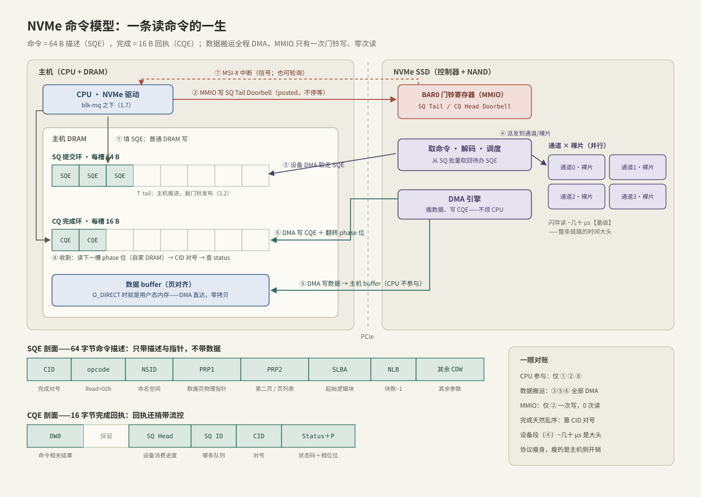

---
tags:
  - 高性能存储/NVMe与SSD
---
# NVMe 命令模型

> NVMe 不是"更快的 SATA"，而是一套为并行介质重新设计的**主机-设备通信协议**：一切交互都是「64 字节命令 + 16 字节回执」的异步消息传递。第 1、2 章一路遇到的队列、门铃、乱序完成，原型全在这里——1.7 的驱动下发、2.1 的 SQ/CQ，都是这套模型向上的投影。

前置：[[1.7 块层与 blk-mq]]（bio 怎么走到设备门口）、[[2.1 SQ CQ 模型]]（同一协议形状的用户态版本，先读哪个都行）。

---

## 1. NVMe 是协议，不是介质

**【事实】** NVMe（NVM Express）是主机与非易失存储之间的命令协议，跑在 PCIe 上（第 5 章的 NVMe-oF 把同一协议搬到网络，[[5.1 NVMe-oF 架构]]）。SSD 快是介质的事；NVMe 管的是"怎么跟它说话才不拖后腿"。

为什么要推倒重来——旧协议 AHCI/SATA 的账【事实/历史】：

| 维度 | AHCI（为 HDD 设计） | NVMe（为 NAND 设计） |
| --- | --- | --- |
| 队列 | 1 条，深度 32 | 最多 64 Ki 条，每条深度最多 64 Ki |
| 提交/完成 | 多次读写 MMIO 寄存器 | 命令与回执全走 DRAM + DMA |
| 中断 | 单一中断 | 每队列独立 MSI-X 向量 |
| 多核 | 所有核抢一条队列（锁） | 每核独享队列，无锁 |

HDD 毫秒级，协议再笨也不是瓶颈；NAND SSD 内部是**通道 × 裸片**的并行结构、单笔延迟几十微秒【量级】，旧协议的每一条都成了瓶颈。这与 1.7 里"全局锁队列在多核下崩溃"是同一个故事的设备版。

**心智转换（本章最重要的一步）**：同步 `pread` 的心智模型是"函数调用——打电话等回话"；NVMe 的心智模型是**异步消息传递**——把任务描述投进队列，凭票（CID）取结果。上层的同步 API 是内核在这套异步协议上"演"出来的：进程睡眠，等 CQE 到来再被唤醒（[[1.8 一次 read write 全路径图]]）。对 C++ 工程师：这就是"往线程池投任务 + `std::future` 收结果"，只是消费者不是线程而是设备。

---

## 2. 一切皆命令：SQE 与 CQE

命令三要素：**做什么**（opcode）、**对哪里**（NSID + 起始逻辑块 SLBA + 块数 NLB）、**数据放哪**（PRP 指针）。

### 2.1 SQE：64 字节的命令描述

| 字段 | 含义 |
| --- | --- |
| `CID` | Command Identifier：完成时对号入座的票据 |
| `opcode` | 做什么：NVM 命令集里 Read=02h、Write=01h、Flush=00h |
| `NSID` | 对哪个命名空间（namespace ≈ 设备上的逻辑分区） |
| `PRP1` / `PRP2` | 数据页的**物理地址指针**；长度超过两页时 PRP2 指向页列表（PRP List） |
| `SLBA` / `NLB` | 起始逻辑块与块数（NLB 是 0 基：0 表示 1 块） |

**【事实】命令不带数据，只带指针**。数据由设备 DMA 引擎直接读写主机内存，CPU 不搬运一个字节。PRP（Physical Region Page）以内存页为单位、LBA 以块（512 B / 4 KiB）为单位——**O_DIRECT 的对齐要求就是从这里来的**（[[1.3 Buffered IO 与 O_DIRECT]]）：不对齐的 buffer 没法直接填进 PRP。

### 2.2 CQE：16 字节的完成回执

| 字段 | 含义 |
| --- | --- |
| `CID` + `SQ ID` | 哪条队列的哪个命令完成了——对号凭据 |
| `SQ Head Pointer` | **捎带的流控信息**：设备消费 SQ 到哪了（主机判断 SQ 满不满靠它） |
| `Status` | 状态码：成功 / 介质错误 / 无效字段…… |
| `Phase (P)` | 相位位：主机不读设备寄存器就能发现新回执的机关（[[3.2 Queue Pair 与 Doorbell]]） |

**【事实】完成天然乱序**：设备内部几十路并行执行，先做完的先回，CQE 顺序与提交顺序无关——一切关联靠 CID。io_uring 的 `user_data` 对号（[[2.1 SQ CQ 模型]]）就是同一形状在上层的延续：**"乱序 + 票据"这个形状从设备一路保持到应用**。

---

## 3. 一条读命令的一生



对照图中编号（以 O_DIRECT 随机读为例，上游路径见 [[1.7 块层与 blk-mq]] 第 3 节）：

1. **填 SQE**：驱动把 bio 翻译成 64 B 命令写进 SQ 环——普通 DRAM 写，纳秒级；
2. **敲门铃**：写屏障后 MMIO 写 SQ Tail Doorbell——**整条提交路径唯一一次 MMIO，且是 posted 写（发出即走，不等设备回应）**；
3. **设备取命令**：控制器 DMA 从 SQ 环取走 SQE；
4. **执行**：解码、派发到内部通道/裸片，闪存读——~几十 μs【量级】，整条链路的时间大头；
5. **DMA 写数据**：设备把数据直接写进 PRP 指向的主机 buffer（O_DIRECT 时就是用户态内存——全程零拷贝），CPU 不参与；
6. **DMA 写 CQE**：16 B 回执写进 CQ 环，相位位翻转；
7. **通知**：MSI-X 中断（或被轮询发现，[[2.4 polling 与 registered buffers]]）；
8. **收割**：驱动读 CQ（读的是自家 DRAM）、按 CID 对号、检查 Status、归还 tag、`bio_endio` 一路向上唤醒。

**对账**：CPU 只在 ①②⑧ 出场；数据搬运 ③⑤⑥ 全部 DMA；MMIO 只有 ② 一次写、零次读。

**时间账【量级】**：软件两端（①②⑧ 加上内核路径）合计 ~1–2 μs，设备段（④）几十 μs——单笔看软件占比不大，但 IOPS 上百万时每 1 μs 软件开销都要乘以一百万倍，这正是第 2 章（io_uring 摊薄陷入）与第 5 章（SPDK 干脆搬进用户态）拼命省固定成本的原因。

---

## 4. 这套模型为什么延迟低：四条设计原则

1. **主机永远不读设备**【事实】：提交 = DRAM 写 + 一次 posted MMIO 写；完成发现 = 读自家 DRAM（相位位）。一次 MMIO 读要跨 PCIe 往返，~1 μs 量级且 CPU 全程停等【量级】——协议从头到尾没有一处要求主机在热路径做 MMIO 读。C++ 对应：热路径避免同步远程读，把"对方的状态"设计成对方主动推给你；
2. **数据零拷贝**：命令带指针不带数据，DMA 直达目的地。C++ 对应：传 `std::span` 不传值；
3. **完成解耦**：CQE 攒在环里，主机按自己的节奏收割——中断、中断合并、纯轮询任选【取舍】。C++ 对应：完成队列把生产者（设备）和消费者（驱动）的节奏解耦，正是并发编程里用队列隔离快慢双方的动机；
4. **并行原生**：多队列多深度，协议里没有任何全局串行点。深度与吞吐的定量关系（利特尔法则）在 [[2.3 iodepth 与提交完成路径]] 已算过账——协议保证"加深"这个杠杆真的存在。

---

## 5. C++ 对照表

| NVMe 概念 | C++ 并发对应 | 备注 |
| --- | --- | --- |
| SQE | 任务描述对象（参数 + buffer 指针） | 只描述，不装数据 |
| CID | future 的票据 / in-flight map 的 key | 有限票池 = 有界并发 |
| SQ / CQ | 一对 SPSC 有界环形队列 | [[3.2 Queue Pair 与 Doorbell]] |
| DMA 引擎 | 另一个并发执行体 | 不是 C++ 线程；可见性靠内核屏障 + PCIe 排序 |
| 乱序完成 | 线程池任务完成顺序不定 | 关联全靠票据 |
| CQE 的 Status | 每任务独立的错误通道 | 异步世界没有全局 errno |

---

## 6. Modern C++：命令即消息的最小心智模型

把"命令表 + 票据 + 完成兑现"的形状写出来（**心智模型，非驱动代码**——内核实际用回调链 `bio_endio`，这里用 promise/future 只为把所有权与同步点写明白）：

```cpp
#include <array>
#include <cstddef>
#include <cstdint>
#include <future>
#include <optional>
#include <span>

enum class Status : std::uint16_t { kOk = 0, kMediaError = 1 };

struct ReadCmd {                        // ≈ SQE：只有描述与指针，没有数据
    std::uint64_t slba;                 // 起始逻辑块
    std::uint32_t nlb;                  // 块数
    std::span<std::byte> buf;           // 数据落点（≈ PRP：借出所有权，不拷贝）
};

// 命令表：CID → promise。容量 = 队列深度，票据用尽即背压
template <std::size_t Depth>
class CommandTable {
public:
    // 提交：占一个 CID，命令进 SQ，返回凭票取结果的 future
    std::future<Status> submit(const ReadCmd& cmd) {
        const std::uint16_t cid = alloc_cid();   // 无空票 = 在途已满，先收割
        slots_[cid].emplace();
        push_sqe(cid, cmd);                      // 填 SQE + 敲门铃（3.2）
        return slots_[cid]->get_future();
    }

    // 完成路径（中断/轮询侧调用）：CQE 到达，CID 对号，兑现 promise
    void on_cqe(std::uint16_t cid, Status st) {
        slots_[cid]->set_value(st);              // ≈ CQE + 中断唤醒等待者
        slots_[cid].reset();                     // 归还 CID：背压在此解除
    }

private:
    std::uint16_t alloc_cid();                   // 从空闲票池取号
    void push_sqe(std::uint16_t cid, const ReadCmd& cmd);
    std::array<std::optional<std::promise<Status>>, Depth> slots_;
};
```

三条纪律，与真协议逐条对应：

- **`buf` 从提交到完成归设备**：期间释放或复用是 use-after-free——与 io_uring 的 buffer 纪律（[[2.1 SQ CQ 模型]] 第 8 节）同源，根子都在这里：DMA 引擎正在写它；
- **CID 池是有界并发的信号量**：票发完就得等回执——1.7 的 tag 池是它在块层的软件镜像；
- **每个完成都要查 Status**：异步世界里错误跟着回执走，不查即静默丢错。

---

## 7. 陷阱与误区

> [!warning] 常见错误
> 1. **把 NVMe 当"快版 SATA"**：差别在协议模型（多队列、无 MMIO 读、异步消息），不只是介质速度——理解错这一层，后面 SPDK/NVMe-oF 的设计动机都会看不懂。
> 2. **假设完成有序**：设备并行执行，先完成先回；顺序依赖必须在上层自己表达（io_uring 用 `IOSQE_IO_LINK`，存储引擎用 WAL 序，[[6.1 WAL 与 Crash Consistency]]）。
> 3. **以为命令里装数据**：SQE 只有 64 B，装的是指针；搬数据的是 DMA——这也是"CPU 占用与 IO 大小基本无关"的原因。
> 4. **忽视对齐**：PRP 按页、LBA 按块——O_DIRECT 报 `EINVAL` 的最终出处就在协议这层。
> 5. **用同步心智读性能数据**：单笔延迟里软件占比小 ≠ 软件开销不重要；高 IOPS 下固定成本按百万倍放大（第 2、5 章的全部动机）。

---

## 8. 关键结论

| 结论 | 性质 |
| --- | --- |
| NVMe 是主机-设备命令协议：64 B SQE + 16 B CQE 的异步消息传递 | 事实 |
| 命令只带描述与指针，数据全程 DMA、零拷贝 | 事实 |
| 提交 = DRAM 写 + 一次 posted MMIO 写；完成发现 = 读自家 DRAM；热路径 0 次 MMIO 读 | 事实 |
| 完成天然乱序，CID 对号；"乱序 + 票据"形状从设备一路保持到 io_uring | 事实 |
| 设备段几十 μs 是单笔大头；软件固定成本在高 IOPS 下按倍数放大 | 量级 / 取舍 |
| 同步 API 是内核在异步协议上演出来的；对齐要求的最终出处是 PRP/LBA | 事实 |

---

## 关联知识

- [[3.2 Queue Pair 与 Doorbell]] - 命令怎么递出去、回执怎么收回来：队列力学与可见性
- [[3.3 Admin Queue 与 IO Queue]] - 命令分两类：管理与 IO 的控制面/数据面分工
- [[3.4 SSD FTL 与地址映射]] - opcode 落到介质之后：逻辑块到物理页的翻译
- [[2.1 SQ CQ 模型]] - 同一协议形状的用户态复刻
- [[1.3 Buffered IO 与 O_DIRECT]] - 对齐要求的协议出处
- [[5.1 NVMe-oF 架构]] - 同一命令模型跑到网络上
