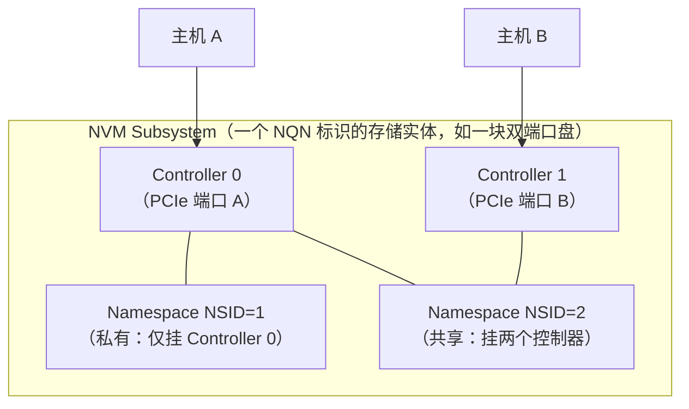

---
tags:
  - 高性能存储
status: 已完成
---

# NVMe Namespace

> 一块物理 SSD 在协议层可以切成多个互相独立的"逻辑盘"，每个有自己的 LBA 空间、扇区格式甚至容量配额——这就是 namespace。关键在切分发生在**设备端**（控制器和 FTL 在管账），与主机端的分区/LVM（内核在管账）形成一组镜像对照。NVMe-oF 的导出单元、云盘多租户的边界、Linux 原生 multipath 的聚合对象，都建立在它上面。

前置：[[3.1 NVMe 命令模型]]（每条 IO 命令都带 NSID 字段）、[[3.3 Admin Queue 与 IO Queue]]（管理 namespace 的命令走 Admin 队列）。

---

## 1. 名词与最小例子

**【事实】** Namespace = 控制器管理下的一段非易失容量，格式化成从 LBA 0 到 N−1 连续编址的逻辑块集合，由 **NSID**（Namespace ID，从 1 起编号）标识。应用与文件系统读写的对象从来不是"整块 SSD"，而是某个 namespace。

Linux 设备名里三层结构一目了然：

| 设备文件 | 是什么 | 谁在管 |
| --- | --- | --- |
| `/dev/nvme0` | 控制器（字符设备）：Admin 命令入口 | NVMe 协议 |
| `/dev/nvme0n1` | 控制器 0 下 NSID=1 的 namespace（块设备）：IO 入口 | NVMe 协议 |
| `/dev/nvme0n1p1` | 该 namespace 上的第 1 个分区 | 主机软件（GPT 分区表） |

消费级 SSD 出厂几乎都只有 1 个 namespace，占满整盘容量——所以日常感觉不到它的存在，`nvme0n1` 就"是"那块盘。企业与云上它才开始干活：切多个、动态建删、挂给不同控制器。

一分钟看清自己的盘（详见 [[3.7 nvme-cli 实操]]）：

```bash
nvme list                        # 每行一个 namespace（不是一块盘）
nvme id-ctrl /dev/nvme0 | grep ^nn    # nn = 该控制器支持的 namespace 数
nvme list-ns /dev/nvme0          # 活动的 NSID 列表
nvme id-ns /dev/nvme0n1 -H       # 单个 namespace 的几何：容量、LBA 格式
```

---

## 2. 层级：Subsystem ⊃ Controller ⊃ Namespace

NVMe 的完整对象模型有三层，平时被"一盘一控一空间"的常见形态遮住了【事实】：



- **Subsystem**：一个存储实体，由 NQN（NVMe Qualified Name）全局命名——本地盘上感知不到，NVMe-oF 上是连接目标（[[5.1 NVMe-oF 架构]]）；
- **Controller**：命令的受理者，队列的属主。双端口企业盘一块盘就有两个控制器；
- **Namespace**：容量的切分单元。**attach 给哪个控制器，哪个控制器就能看到它**——同一 namespace 挂给多个控制器即"共享 namespace"。

**共享 namespace 是 multipath 的地基**【实现】：同一 namespace 经两条路径（两个控制器）到达同一主机时，Linux 原生 NVMe multipath 按"subsystem + namespace 身份"把它们聚合成一个块设备。身份靠谁认？不是 NSID——是 namespace 携带的全局唯一标识 **NGUID / EUI64 / UUID**【事实】。NSID 只在控制器范围内有意义，跨路径、跨重启对号都要用全局 ID（`ls /dev/disk/by-id/nvme-*` 看到的就是它们）。故障切换的行为见 [[5.5 Multipath 与故障切换]]。

---

## 3. 与分区/LVM 的对照：切分发生在哪一侧

同样是"把一块盘切成几块用"，namespace 与分区的差别全在**切分执行者**上：

| 维度 | 分区 / LVM（主机侧切分） | Namespace（设备侧切分） | 性质 |
| --- | --- | --- | --- |
| 谁维护边界 | 内核读 GPT/元数据后自行换算偏移 | 控制器固件；每个 namespace 独立 LBA 空间 | 事实 |
| 设备知情吗 | 不知情——设备只见整盘 LBA | 知情——FTL 按 namespace 记账（[[3.4 SSD FTL 与地址映射]]） | 事实 |
| LBA 格式（512e/4Kn） | 整盘一种，分区只能继承 | **每个 namespace 可独立选格式** | 事实 |
| 格式化/安全擦除粒度 | 只能整盘 | 可按单个 namespace `nvme format` | 事实 |
| 容量伸缩 | 分区表改起来牵连相邻分区 | 建删自如，容量回到公共池 | 事实 |
| 跨主机暴露 | 不可能——分区是本机概念 | 可 attach 不同控制器/经 NVMe-oF 导出给不同主机 | 事实 |
| 性能隔离 | 无 | **同样无**（见下） | 事实 |

最后一行是本篇最重要的反直觉结论：

**【事实】队列属于控制器，不属于 namespace**。3.3 建立的每核一对 IO 队列，被该控制器下**所有** namespace 共用；NSID 只是命令里的一个字段，不是独立的通道。再往下，FTL、NAND 通道、写缓存、GC 也全是共享的——一个 namespace 上的写洪峰照样抬高另一个 namespace 的 p99（[[3.5 GC 写放大与 Over-Provisioning]] 的噪声邻居问题，切 namespace 切不掉）。

**【取舍】** 真要隔离：协议提供可选的 NVM Set / Endurance Group（把 namespace 绑到独立的介质分组，市面支持少）；工程上更常见的答案是**直接分盘**，或在上层做限流（[[6.16 Rate Limiter 与后台任务隔离]]）。选 namespace 切分时，买到的是管理边界（格式、擦除、导出、配额），不是性能边界——预期摆对，方案才不会错。

---

## 4. 数据路径上 NSID 在哪：一次读的流转

把 namespace 放回端到端路径，看它在每层的形态（完整路径见 [[1.8 一次 read write 全路径图]]）：

1. **应用**：`open("/dev/nvme0n1")` 拿 fd——名字里已经绑定了（控制器, NSID）；
2. **内核块层**：每个 namespace 是一个独立的 `gendisk` + 请求队列，但**同一控制器的所有 namespace 共享一套 blk-mq tag 池与硬件队列**【实现】——背压在控制器级合流，这是第 3 节"无性能隔离"在软件层的镜像；
3. **驱动填 SQE**：NSID 写进命令的 Dword 1（[[3.1 NVMe 命令模型]] 的"对哪里"三要素之一），SLBA 是 **namespace 内**的逻辑块号——不需要像分区那样加偏移换算，两个 namespace 的 LBA 0 是两个独立地址空间的起点；
4. **设备**：控制器校验 NSID 合法且已 attach，FTL 用（NSID, LBA）查映射到物理页；
5. **等待点与拷贝**：namespace 这层**不新增任何等待点或拷贝**——它是命名与记账机制，不是数据通道。但共享的队列、FTL、GC 让"别的 namespace 的负载"成为你延迟分布的一部分【实践】。

NVMe-oF 上同一条路只是把第 3 步的命令投进网络传输：Target 把本地 namespace（或文件、LVM 卷）包进 subsystem 导出，Host 连上后照样看到 `/dev/nvmeXnY`，同一套命令模型、同一个 NSID 字段【事实】。谁能连哪个 subsystem、看到哪些 namespace，由 Target 按 Host NQN 做访问控制——导出与多租户的细节在 [[5.17 Subsystem 与 Namespace]] 展开，本篇的层级图就是它的本地地基。

---

## 5. 容量三元组与 thin provisioning

`nvme id-ns` 里三个容量字段，关系值得记【事实】：

| 字段 | 含义 | 类比 |
| --- | --- | --- |
| NSZE（Size） | LBA 空间大小——应用可寻址的上限 | 虚拟内存的地址空间 |
| NCAP（Capacity） | 允许它占用的介质配额 | 物理内存配额 |
| NUSE（Utilization） | 当前实际占用 | RSS |

三者相等 = 厚分配（常见默认）。**NCAP < NSZE 即 thin provisioning**：地址空间先给足，介质用多少记多少——云盘"买 1 TiB 先只占实际写入量"的协议层原型。代价与虚拟内存超卖同构【取舍】：所有 namespace 的 NCAP 总和可以超过物理容量，一旦整体写满，后续写返回 Capacity Exceeded 错误——**地址空间的承诺不等于介质的承诺**，监控 NUSE 是运维义务。

---

## 6. 管理操作：建、挂、删

Namespace 管理走 Admin 队列，两步式是最容易踩的点【事实】：**Namespace Management（create）只是划出容量，Namespace Attachment（attach）之后控制器才能看到它**——类比先 `malloc` 后"把指针交给使用者"：

```bash
# 验收期动作，非在线操作。数据相关命令一律先确认目标盘。
nvme create-ns /dev/nvme0 --nsze=<块数> --ncap=<块数> --flbas=1   # 划容量，返回新 NSID；flbas 选 LBA 格式（如 4Kn）
nvme attach-ns /dev/nvme0 --namespace-id=2 --controllers=<ctrl-id> # 挂给控制器，此后主机可见
nvme ns-rescan /dev/nvme0                                          # 让内核重扫，生成 /dev/nvme0n2
nvme detach-ns /dev/nvme0 --namespace-id=2 --controllers=<ctrl-id> # 反向：先卸
nvme delete-ns /dev/nvme0 --namespace-id=2                         # 再删，容量归还公共池；数据全毁
```

> [!danger] 两个运维事故形态
> 1. **detach/delete 在用的 namespace**：主机视角是块设备突然消失——挂载中的文件系统立刻 IO error，等价于热拔盘。先 umount、摘流量，再动 namespace。
> 2. **用 `nvme0n2` 这类名字写自动化脚本**：设备名由内核枚举顺序决定，重启、rescan、multipath 聚合后都可能变。脚本与 fstab 一律用 `/dev/disk/by-id/`（NGUID/UUID）——名字会漂，全局 ID 不会【实践】。

---

## 7. Modern C++：问一个 fd "你是哪个 namespace"

内核给 NVMe 块设备留了一个最小 ioctl：`NVME_IOCTL_ID` 返回该设备对应的 NSID。用它写一个能跑的最小程序，同时练一遍 fd 的 RAII（风格同 [[1.12 Flush FUA Barrier 与设备易失缓存]] 的 `UniqueFd`）：

```cpp
#include <fcntl.h>
#include <sys/ioctl.h>
#include <unistd.h>
#include <linux/nvme_ioctl.h>

#include <cerrno>
#include <print>
#include <system_error>
#include <utility>

class UniqueFd {
public:
    explicit UniqueFd(int fd = -1) noexcept : fd_(fd) {}
    ~UniqueFd() { if (fd_ >= 0) ::close(fd_); }

    UniqueFd(const UniqueFd&) = delete;
    UniqueFd& operator=(const UniqueFd&) = delete;
    UniqueFd(UniqueFd&& o) noexcept : fd_(std::exchange(o.fd_, -1)) {}
    UniqueFd& operator=(UniqueFd&& o) noexcept {
        if (this != &o) { if (fd_ >= 0) ::close(fd_); fd_ = std::exchange(o.fd_, -1); }
        return *this;
    }
    [[nodiscard]] int get() const noexcept { return fd_; }

private:
    int fd_;
};

int main(int argc, char** argv) {
    const char* dev = argc > 1 ? argv[1] : "/dev/nvme0n1";
    UniqueFd fd{::open(dev, O_RDONLY)};       // 只读打开就够：只发管理查询
    if (fd.get() < 0) {
        throw std::system_error{errno, std::generic_category(), "open"};
    }
    const int nsid = ::ioctl(fd.get(), NVME_IOCTL_ID);
    if (nsid < 0) {
        throw std::system_error{errno, std::generic_category(),
                                "NVME_IOCTL_ID（不是 NVMe namespace 设备？）"};
    }
    std::println("{} -> NSID {}", dev, nsid);
    return 0;
}
```

```bash
g++ -std=c++23 -Wall -Wextra -o nsid nsid.cpp && ./nsid /dev/nvme0n1
```

**关键点**：这个 NSID 是内核从设备信息里查出来的，不是应用声明的——普通 IO 路径上应用永远碰不到 NSID 字段，**内核替你填、设备替你查**，这正是"namespace 是内核与设备之间的契约"的直接体现。对分区设备（`nvme0n1p1`）调用会失败：分区是主机概念，协议层查无此物——一行代码验证了第 3 节的对照表。

---

## 8. 陷阱与误区

> [!warning] 常见错误
> 1. **把 namespace 当"设备上的分区"**：切分执行者不同（控制器 vs 内核）、能力不同（独立 LBA 格式、按 namespace 擦除、跨主机 attach）——第 3 节的表是这两个词的分界线。
> 2. **以为多 namespace 自带性能隔离**：队列、FTL、写缓存、GC 全共享；namespace 给的是管理边界，不是 QoS。
> 3. **拿 NSID 当稳定身份**：NSID 是控制器范围的编号；跨路径、跨重启的身份认 NGUID/UUID，挂载与脚本走 `by-id`。
> 4. **把 NSZE 当可用容量**：thin namespace 的地址空间是承诺，介质消耗看 NUSE；超卖池写满时是运行时错误，不是挂载时错误。
> 5. **create 完找不到设备**：忘了 attach + rescan——两步式设计就是为了支持"划好容量、挂给别的控制器"。
> 6. **共享 namespace = 可以两台主机同时挂 ext4**：共享给的是**访问路径**，不是并发一致性；普通文件系统不为多写者设计，双挂即损坏。要么单写者 + 故障切换（multipath 的用法），要么上集群文件系统/上层协调【事实】。

---

## 9. 关键结论

| 结论 | 性质 |
| --- | --- |
| Namespace 是控制器下独立编址的逻辑容量单元，NSID 标识；IO 命令三要素里"对哪里"的第一半 | 事实 |
| 对象模型三层：Subsystem ⊃ Controller ⊃ Namespace；共享 namespace + 全局 ID（NGUID/UUID）是 multipath 的地基 | 事实 |
| 与分区的本质差别是切分执行者：设备侧 vs 主机侧；由此带来独立格式、按空间擦除、跨主机 attach | 事实 |
| 队列属于控制器：namespace 之间无性能隔离，FTL/GC 噪声照传；隔离要靠 NVM Set、分盘或上层限流 | 事实 / 取舍 |
| NSZE/NCAP/NUSE 三元组支撑 thin provisioning——地址承诺与介质承诺分离，超卖需监控 | 事实 / 取舍 |
| create 与 attach 分两步；在用 namespace 的 detach/delete 等价热拔盘 | 事实 / 实践 |
| Namespace 层不新增等待点与拷贝——它是命名与记账，不是数据通道 | 事实 |

---

## 关联知识

- [[3.1 NVMe 命令模型]] - NSID 字段在命令里的位置与语义
- [[3.3 Admin Queue 与 IO Queue]] - namespace 管理命令走的控制面
- [[3.4 SSD FTL 与地址映射]] - （NSID, LBA）→ 物理页的翻译层
- [[3.7 nvme-cli 实操]] - id-ns / create-ns / attach-ns 的实操上下文
- [[5.17 Subsystem 与 Namespace]] - 同一模型在 NVMe-oF 上的导出与访问控制
- [[5.5 Multipath 与故障切换]] - 共享 namespace 的路径聚合与切换
- [[3.5 GC 写放大与 Over-Provisioning]] - 共享 FTL 下的噪声邻居来源

## 参考

- NVM Express Base Specification：Namespace、NSID、Identify Namespace（NSZE/NCAP/NUSE）、Namespace Management/Attachment、NGUID/EUI64
- Linux 内核文档与源码：`drivers/nvme/host/core.c`（namespace 扫描与 multipath 聚合）
