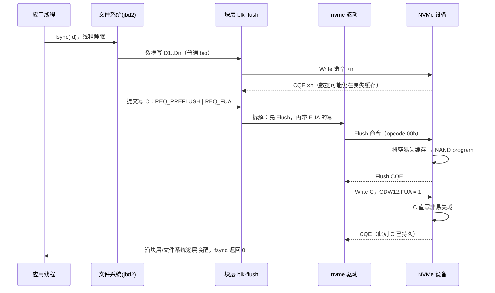

---
tags:
  - 高性能存储
status: 已完成
---

# NVMe Flush 与 FUA

> [[1.12 Flush FUA Barrier 与设备易失缓存]] 讲了内核如何用 `REQ_PREFLUSH` / `REQ_FUA` 表达持久化要求；本篇走到这条线的设备端：这两个标志到了 NVMe 层各自变成什么——一条独立的 Flush 命令、Write 命令里的一个 FUA 位——设备凭什么能力兑现它们（VWC 与 PLP），以及兑现的代价从设备内部哪里来。读完这两篇，`fsync()` 的每一微秒都能对上账。

前置：[[1.12 Flush FUA Barrier 与设备易失缓存]]（块层语义，本篇的上游）、[[3.1 NVMe 命令模型]]（命令格式与 opcode）。

---

## 1. 设备端的两个原语

### 1.1 Flush 命令：清算此前的债

**【事实】** Flush 是 NVM 命令集的 opcode 00h——排在 Write（01h）、Read（02h）前面，地位可见一斑。语义：**此命令完成时，所有在它被提交之前已经完成的写命令的数据（含元数据），都已进入非易失域**。按 namespace 生效（NSID 指定；控制器支持时 NSID=0xFFFFFFFF 广播到全部 namespace）。

措辞里藏着一个上层必须配合的点：约束对象是"**已完成**的写"，不是"已提交的写"。一条还在设备内部执行的在途写不在本次 Flush 的清算范围里——所以文件系统必须**先等数据写的 CQE 回来，再发 Flush**（1.12 第 7 节那张时序图里"普通写完成 → 才发提交写"的顺序，协议依据就在这里）【事实】。

"非易失域"沿用 1.12 的定义：设备承诺掉电后仍能保住数据的范围——可以是 NAND，也可以是带掉电保护（PLP）的控制器缓存。

### 1.2 FUA 位：只管当前这一条

**【事实】** FUA（Force Unit Access）不是独立命令，是 Read/Write 命令 CDW12 里的一个位：

- **Write + FUA**：数据进入非易失域之后，才允许返回 CQE——"这一条写，完成即持久"；
- **Read + FUA**：先把该 LBA 范围仍在易失缓存里的数据落盘，再从介质读——校验"盘上到底是什么"的场景用，日常路径极少见。

两者分工与 1.12 的表完全对齐，这里是它的协议出处：

| 原语 | 约束对象 | 一句话 |
| --- | --- | --- |
| Flush 命令 | 此前**已完成**的所有写 | 清算过去 |
| FUA 位 | 当前这一条命令 | 约束现在 |

FUA 不排序、不清算别人：先写 D（普通写）、再写 C（FUA），C 的完成只证明 C 持久，D 可能还躺在缓存里——所以日志提交写在块层被标成 `PREFLUSH + FUA` 两个语义的组合，缺一不可（[[1.12 Flush FUA Barrier 与设备易失缓存]] 第 6.2 节）。

---

## 2. VWC：设备有没有易失写缓存，内核信谁

这两个原语并非永远必要。设备通过两个接口自报家门【事实】：

- **Identify Controller 的 VWC 字段**：设备**有没有**易失写缓存；
- **Get/Set Features FID 06h（Volatile Write Cache）**：缓存当前**开没开**（可查可设）。

内核据此决定整条 fsync 路径的形态【实现】：nvme 驱动按 VWC 向块层声明 write cache / FUA 能力；**设备申报无易失缓存时，`REQ_PREFLUSH` 在块层直接消解，一条 Flush 命令都不会发**——1.12 第 8.2 节"fsync 不等于固定的一条 Flush"在 NVMe 层的具体机制。

```bash
nvme id-ctrl /dev/nvme0 -H | grep -i 'volatile write cache'   # 有没有
nvme get-feature /dev/nvme0 -f 0x06 -H                        # 开没开
cat /sys/block/nvme0n1/queue/write_cache                      # 内核信了什么
cat /sys/block/nvme0n1/queue/fua                              # FUA 是否可用
```

**PLP 企业盘的关键一手**【事实/前提】：带完整掉电保护的盘把受保护缓存算进非易失域，因此常直接申报"无 VWC"——于是内核不发 Flush、FUA 形同免费，`fsync` 路径里整段"等缓存排空"消失。**企业盘同步写快消费盘几个数量级，主要原因是这里，不是 NAND 更快**。前提照抄 1.12：PLP 是否可信要看规格与健康监测，不是软件能推断的属性。

---

## 3. 从 fsync 到 NVMe 命令：端到端对账

一次 `fsync()` 走完全程（文件系统与块层的细节在 [[1.4 fsync fdatasync 与持久化语义]] 与 [[1.12 Flush FUA Barrier 与设备易失缓存]]，此处站在设备门口看进来）：



**等待点对账**（拷贝：本篇两个原语都是控制语义，不新增任何数据拷贝）：

| 等待点 | 等什么 | 量级【量级】 |
| --- | --- | --- |
| ① 数据写完成 | 脏页写回 + 设备接收 | 几十 μs 级/条（缓存吸收时接近纯传输） |
| ② Flush 完成 | **排空当时欠的全部缓存债**：更早写入的剩余服务 + program 时间 | 从近零（无债/有 PLP）到 ms 级（债多、消费盘）——没有固定数 |
| ③ FUA 写完成 | 当前这条直达介质：NAND program 是硬成本 | 百 μs 级 program vs 缓存写 μs 级 |

三条工程推论：

- **Flush 的延迟是别人的债**：缓存按设备共享，同盘其他进程攒的脏数据也在你的 Flush 里清算——fsync 尾延迟与"邻居"负载相关的协议层原因（[[1.12 Flush FUA Barrier 与设备易失缓存]] 第 4.3 节）；
- **频繁小写 + 每写 fsync 是最坏组合**【取舍】：写缓存的本意是把小写攒成整页 program（[[3.4 SSD FTL 与地址映射]]）；每次 Flush/FUA 都强行打断攒批——无 PLP 消费盘上同步随机小写的 IOPS 比非同步低一到几个数量级。解药是把持久化边界摊薄：group commit（[[6.2 Group Commit]]）、批量写后一次 `fdatasync`；
- **NVMe-oF 上语义原样过网**【事实】：Flush/FUA 是普通命令，随传输走到 Target，由 Target 后端的设备兑现——网络 ACK、本地完成都不等于远端持久（1.12 第 11.2 节）；同步延迟再加一层 RTT 与远端 Flush。Target 侧的路径见 [[5.20 TCP Transport 数据路径]]。

---

## 4. 实验：把语义摸到手

**A. 查能力（只读，随时可做）**：第 2 节的四条命令。对照两块盘（消费/企业）看 VWC 与 `write_cache` 的差异，第 2 节的结论立刻具象。

**B. 手动发一条 Flush 并计时（对照实验）**：

```bash
# 空闲时
time nvme flush /dev/nvme0n1 -n 1
# 制造缓存债后立刻测：先跑几秒 buffered 大写
fio --name=debt --filename=/dev/nvme0n1 --rw=write --bs=1M \
    --size=2G --direct=0 --runtime=5 --time_based &&
time nvme flush /dev/nvme0n1 -n 1
```

预期不是固定毫秒数，而是**形状**：空闲 Flush 接近零，欠债后的 Flush 随债务增长；有 PLP 的盘两者都接近零——"Flush 延迟 = 缓存债务"模型的直接验证。（`fio` 直写块设备会毁数据，只在测试盘上做。）

**C. 观察内核到底发了什么**：`blktrace` 里找 `FWS`（flush+write+sync）类标记，确认 fsync 路径上 PREFLUSH/FUA 请求真实存在、以及无 VWC 盘上它们的消失（[[9.3 blktrace 与块层生命周期]]）。

---

## 5. Modern C++：亲手向设备递一条 Flush

生产代码的持久化入口永远是 `fsync/fdatasync`（RAII 与错误处理的完整示例在 [[1.12 Flush FUA Barrier 与设备易失缓存]] 第 12 节，不重复）。但教学上值得用 NVMe passthrough 亲手发一条 Flush——摸到协议层，也顺便验证一个容易记错的边界：

```cpp
#include <fcntl.h>
#include <sys/ioctl.h>
#include <unistd.h>
#include <linux/nvme_ioctl.h>

#include <cerrno>
#include <chrono>
#include <cstring>
#include <print>
#include <system_error>
#include <utility>

class UniqueFd {
public:
    explicit UniqueFd(int fd = -1) noexcept : fd_(fd) {}
    ~UniqueFd() { if (fd_ >= 0) ::close(fd_); }

    UniqueFd(const UniqueFd&) = delete;
    UniqueFd& operator=(const UniqueFd&) = delete;
    UniqueFd(UniqueFd&& o) noexcept : fd_(std::exchange(o.fd_, -1)) {}
    UniqueFd& operator=(UniqueFd&& o) noexcept {
        if (this != &o) { if (fd_ >= 0) ::close(fd_); fd_ = std::exchange(o.fd_, -1); }
        return *this;
    }
    [[nodiscard]] int get() const noexcept { return fd_; }

private:
    int fd_;
};

// 教学用途：直接向 namespace 发 NVMe Flush（opcode 00h）。需要 root。
int main(int argc, char** argv) {
    const char* dev = argc > 1 ? argv[1] : "/dev/nvme0n1";
    UniqueFd fd{::open(dev, O_RDWR)};
    if (fd.get() < 0) {
        throw std::system_error{errno, std::generic_category(), "open"};
    }

    const int nsid = ::ioctl(fd.get(), NVME_IOCTL_ID);   // 让内核告诉我们 NSID
    if (nsid < 0) {
        throw std::system_error{errno, std::generic_category(), "NVME_IOCTL_ID"};
    }

    nvme_passthru_cmd cmd{};                 // 值初始化：其余字段全零
    cmd.opcode = 0x00;                       // NVM 命令集：Flush
    cmd.nsid   = static_cast<__u32>(nsid);

    const auto t0 = std::chrono::steady_clock::now();
    if (::ioctl(fd.get(), NVME_IOCTL_IO_CMD, &cmd) < 0) {
        throw std::system_error{errno, std::generic_category(), "flush"};
    }
    const auto us = std::chrono::duration_cast<std::chrono::microseconds>(
                        std::chrono::steady_clock::now() - t0).count();
    std::println("NVMe Flush on {} (nsid {}): {} us", dev, nsid, us);
    return 0;
}
```

```bash
g++ -std=c++23 -Wall -Wextra -o nvme_flush nvme_flush.cpp && sudo ./nvme_flush /dev/nvme0n1
```

**关键点**：

- 这条 Flush 走 `ioctl(NVME_IOCTL_IO_CMD)`，由内核原样投进 IO 队列——它**只管设备易失缓存**。此前用 buffered `write()` 写的数据还躺在 page cache 里，根本没到设备，这条 Flush 管不着——亲手复现 1.12 的"Flush 不处理 page cache"结论；
- 也因此它**不是 fsync 的替代品**：应用要的是"从我的 buffer 到非易失域"的整链条，那是 `fdatasync` 的职责，文件系统会把该发的 Flush/FUA 都发对；
- `nvme_passthru_cmd` 用值初始化清零再填字段——passthrough 结构里残留的脏字段会变成非法命令，设备回 Invalid Field。

---

## 6. 陷阱与误区

> [!warning] 常见错误
> 1. **fsync 慢先怪盘**：第一步先查 VWC 与 `queue/write_cache`——虚拟化栈把缓存模式配错、内核认知与设备真实状态不符，比"盘慢"常见得多。
> 2. **以为 FUA 能顺带保证之前的写**：FUA 只管自己这一条；"先前数据稳定"要靠 Flush/PREFLUSH——提交写必须两者组合。
> 3. **以为发过 Flush 数据就安全**：Flush 的辖区从设备缓存开始；page cache 里的脏页、还没等到 CQE 的在途写都不在清算范围。
> 4. **用 Set Features 06h 关掉写缓存图"安全"**：等价于全程 write-through，每条写都吃 program 延迟；语义没多买到什么（正确的 Flush/FUA 已经足够），性能付全价【取舍】。
> 5. **以为 PLP 盘不用 fsync**：PLP 只是把设备缓存纳入非易失域；page cache 仍在内核 DRAM 里。fsync 一次都不能省——只是变便宜了。
> 6. **用 O_DIRECT 代替 FUA**：O_DIRECT 绕过 page cache，不绕过设备易失缓存（1.12 的误区表）；direct 写完成 ≠ 持久。
> 7. **NVMe-oF 上把本地完成当远端持久**：Flush/FUA 要走到 Target 后端设备才算数；断链与 failover 时只能信协议完成状态与上层副本协议。

---

## 7. 关键结论

| 结论 | 性质 |
| --- | --- |
| Flush（opcode 00h）清算此前**已完成**的写；FUA 是 Read/Write CDW12 的一个位，只约束当前命令 | 事实 |
| "已完成"而非"已提交"：上层必须先等数据写 CQE 再发 Flush——1.12 时序的协议依据 | 事实 |
| VWC 申报有无易失缓存；无 VWC（含 PLP 盘）时内核在块层消解 PREFLUSH，一条 Flush 都不发 | 事实 / 实现 |
| 企业盘同步写快在 PLP 让 Flush 变零成本，不在 NAND 更快 | 事实 / 前提 |
| Flush 延迟 = 当时的缓存债务（含邻居的）；FUA 写吃 NAND program 硬成本 | 量级 |
| 每写一次 fsync 打断设备攒批，无 PLP 盘上同步小写 IOPS 掉数量级；解药是摊薄持久化边界 | 取舍 |
| Flush/FUA 不新增数据拷贝；NVMe-oF 上原样过网，由 Target 后端兑现——网络 ACK ≠ 远端持久 | 事实 |
| 手发的 NVMe Flush 管不到 page cache——它不是 fsync 的替代品 | 事实 |

---

## 关联知识

- [[1.12 Flush FUA Barrier 与设备易失缓存]] - 块层语义与端到端路径：本篇的上游全景
- [[1.4 fsync fdatasync 与持久化语义]] - 应用侧入口与错误语义
- [[3.1 NVMe 命令模型]] - opcode、CDW 字段与命令的一生
- [[3.4 SSD FTL 与地址映射]] - 写缓存攒批与 program 成本的介质背景
- [[6.1 WAL 与 Crash Consistency]] - 这套原语支撑的应用级恢复协议
- [[6.2 Group Commit]] - 摊薄 Flush 成本的经典工程手段
- [[3.7 nvme-cli 实操]] - id-ctrl / get-feature / flush 的实操上下文

## 参考

- NVM Express Base Specification / NVM Command Set Specification：Flush 命令、Write 命令 FUA 位、Identify Controller VWC、Get/Set Features（Volatile Write Cache）
- Linux 内核文档：Explicit volatile write back cache control（`Documentation/block/writeback_cache_control.rst`）
