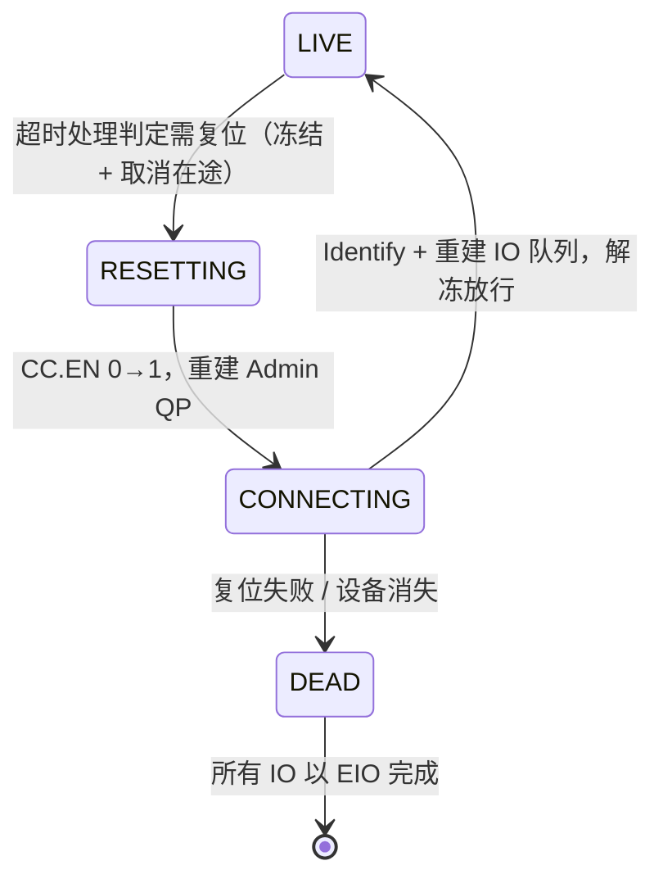

---
tags:
  - 高性能存储
status: 已完成
---

# Command Timeout 与 Controller Reset

> [[3.1 NVMe 命令模型]] 把 NVMe 定义成异步消息传递：投 64 字节命令，凭 CID 等 16 字节回执。整个第 3 章到目前为止都默认回执会来——本篇处理它**不来**的情况。这是分布式系统的经典问题在单机 PCIe 上的翻版：请求-响应协议必须配超时；而超时之后能做的事，是一部代价逐级放大的升级阶梯，最顶层的 Controller Reset 是 stop-the-world——**一条命令的故障，由整块盘的所有 IO 共同支付**。对 C++ 工程师，这一篇处处是熟悉的形状：`future::wait_for`、协作式取消、原子状态机、写者独占前的 drain。

前置：[[3.1 NVMe 命令模型]]（命令与回执）、[[3.3 Admin Queue 与 IO Queue]]（自举序列——复位就是重跑它）。

---

## 1. 问题：回执不来，主机知道什么？

先建立一个贯穿全篇的前提【前提】：**主机对设备内部一无所知**。它只看得到自己的两份账——发出去的命令（占着 blk-mq 的 tag）、收回来的 CQE。回执迟迟不来，可能是：

- 命令真的很慢（设备内部 GC、温控降速，[[3.5 GC 写放大与 Over-Provisioning]]）；
- 固件 bug：命令被弄丢了，永远不会有回执；
- PCIe 链路出错，CQE 或中断丢在半路;
- 设备整个挂了。

这四种情况对主机**不可区分**——它能做的只有设一个期限，到期后单方面认定"出事了"。C++ 对应：

```cpp
auto fut = pool.submit(task);
if (fut.wait_for(30s) == std::future_status::timeout) {
    // 走到这里只说明"30 秒内没等到"——task 可能仍在执行、
    // 可能已丢失。接下来做什么，就是本篇的主题。
}
```

**【类比，非等同】** `wait_for` 超时后你无法杀死一个正在执行的任务（`std::jthread` 的取消是协作式的，卡死的任务不响应 `stop_token`）——硬件同理：**你不能从一个不响应的设备里"拔出"一条命令**，只能请求它放弃（Abort），或者掀桌子重来（Reset）。

### 1.1 谁在计时

**【实现】** 计时者不是设备，是主机块层：blk-mq 为每个在途 request 维护超时（`blk_mq_timeout_work`），到期回调驱动的超时处理函数。NVMe 的默认期限是模块参数，**可调、不是协议规定**：

```bash
cat /sys/module/nvme_core/parameters/io_timeout      # IO 命令，默认 30 秒
cat /sys/module/nvme_core/parameters/admin_timeout   # Admin 命令，默认 60 秒
```

30 秒对"几十 μs 完成"的设备像是天文数字——故意的。期限是**误杀率与故障发现速度的取舍**【取舍】：设太短，把 GC 中的慢命令误判成死命令，触发的恢复动作比慢本身昂贵得多（见第 4 节）；设太长，真故障要干等半分钟才开始恢复。默认值偏保守，宁可慢发现、不可乱复位。

---

## 2. 升级阶梯：Abort，然后 Reset

超时到期后，恢复动作按代价从小到大排成阶梯：

![[图片/SVG/8_3_13_1.svg|900]]

### 2.1 第一级：Abort——"请你放弃"

**【事实】** Abort 是 admin 命令（opcode 08h），参数是目标命令的 SQ ID + CID，语义是**请求**设备放弃那条命令。规范明说这是 best effort：设备可以已经完成了它、找不到它、或者干脆不理；在途 Abort 的数量还受 Identify Controller 的 ACL（Abort Command Limit）约束。

为什么这么弱【设计】：命令可能正处于"数据已写一半进 NAND"的状态，强行中止反而制造不一致；而真正卡死的场景里，设备连 Abort 命令本身都可能不处理——**能响应 Abort 的设备多半不需要 Abort**。这和协作式取消的困境一模一样：`request_stop()` 只对活着且检查 `stop_token` 的任务有效。

**【实现】** Linux nvme 驱动在超时处理里对 PCIe 盘先尝试一次 Abort（还在 LIVE 状态且条件允许时），Abort 也无果或条件不满足，就直接升级到 Reset。实践里 Abort 的角色更接近"给日志留个记号"，真正的恢复主力是下一级。

### 2.2 第二级：Controller Reset——"掀桌子重来"

**【事实】** Controller Reset 的核心动作是把控制器配置寄存器 `CC.EN` 清零再置一，等待 `CSTS.RDY` 跟随翻转——这会**清空设备侧所有队列状态与在途命令**。之后主机要做的，就是把 [[3.3 Admin Queue 与 IO Queue]] 第 2 节的自举序列**原样重跑一遍**：寄存器直配 Admin QP → `Identify` → `Set Features` 协商队列数 → 逐对重建 IO 队列 → 重新挂回 blk-mq。

复位不是"轻轻一按"，是把初始化成本在运行时重付一次【量级】：整个过程秒级，期间这块盘对上层完全静止。

---

## 3. 状态机：并发世界里的恢复入口

复位过程本身也要面对并发：30 秒超时到期时，往往**不止一条**命令超时——多个超时处理可能同时触发恢复。谁来执行？执行到一半又有人触发怎么办？

**【实现】** Linux nvme 用一个显式状态机管理控制器生命周期，核心状态：



状态迁移是**原子的、带合法性检查的**：只有 `LIVE → RESETTING` 这一条边存在，第二个想触发复位的执行流会发现状态已是 RESETTING，直接返回——恢复入口天然幂等、天然单赢家。

**C++ 对应**（形状完全相同的代码你可能写过——连接对象的重连逻辑）：

```cpp
enum class CtrlState { kLive, kResetting, kConnecting, kDead };

class Controller {
public:
    // 多个超时回调并发调用也只会有一个赢家真正执行恢复
    void maybe_reset() {
        auto expected = CtrlState::kLive;
        if (!state_.compare_exchange_strong(expected, CtrlState::kResetting)) {
            return;  // 已有人在复位（或已 DEAD）：什么都不做
        }
        schedule_reset_work();  // 真正的恢复放到专门的工作线程，不在超时上下文里做
    }

private:
    std::atomic<CtrlState> state_{CtrlState::kLive};
    void schedule_reset_work();
};
```

**关键点**：

- `compare_exchange_strong` 承担了"检查 + 迁移"的原子性——先 `load` 再 `store` 的写法在两个超时并发到期时会双双通过检查，恢复被执行两次；
- 真正的恢复工作**不在触发者的上下文里做**（内核同样把 reset 丢给专门的 workqueue）：超时回调运行在受限上下文，而复位要睡眠、要等寄存器、要发 admin 命令。

---

## 4. 背压：复位是 stop-the-world

这是本篇对"存储延迟"最重要的一节。复位期间在途命令都要作废重来，但**新的提交还在源源不断到来**——必须先把门关上。

**【实现】** blk-mq 提供队列冻结（freeze）：复位开始时冻结所有队列——新 IO 在入口处**阻塞**（不是报错，是排队等待）；已在途的 IO 全部取消、标记重试；复位完成后解冻，积压的与重试的一起放行。

**【类比，非等同】** 这就是"写者独占前 drain 所有读者"的模式：freeze ≈ 拿 `std::shared_mutex` 的写锁——新读者（提交者）在门口排队，等在途读者（在途 IO）全部退出，写者（复位流程）独占期间世界静止。内核实际用 percpu refcount 实现（热路径上提交者只做每 CPU 计数递增，几乎零成本——又是"贵的操作滚去慢路径"），但独占语义相同。

### 4.1 延迟账

把整条时间线加起来【量级】：

| 阶段 | 时长 | 期间上层看到什么 |
| --- | --- | --- |
| 命令 X 卡住 → 超时到期 | 默认 30 s | X 的调用者干等；其他 IO 正常 |
| Abort → Reset → 队列重建 | 秒级 | **全盘 IO 阻塞**（冻结窗口） |
| 解冻放行 | 短暂 | 积压涌入，排队尖峰后恢复 |

三个值得内化的推论：

- **无声是最危险的**：整个过程中（走到 DEAD 之前）上层收不到任何错误——只有一部分 IO"无限慢"。靠应用报错发现故障为时已晚，监控必须盯内核日志的 timeout/reset 记录（[[9.2 iostat 指标解读]] 里 await 的异常尖峰、dmesg）；
- **尾延迟的形状**：一次复位在 p99.99 上留下 30+ 秒的尖峰，还会向上级联——上层 RPC 超时、重试、副本切换全被牵动（[[9.5 p99 毛刺定位]] 的"重试放大"）；
- **写的语义悬空**【前提】：被取消的写命令，数据可能已落盘也可能没有——主机无法知道。块层把它们重新排队执行，正确性依赖"重复执行同一条写是安全的"（同一 LBA 写同一数据幂等）；对有序性有要求的上层（日志提交），依赖 [[1.4 fsync fdatasync 与持久化语义]] 的错误上报契约。

---

## 5. 对上层可见的错误

不是每次超时都走到应用报错，中间有多级缓冲【实现】：

1. **驱动重试**：被取消的命令默认最多重试 `nvme_core.max_retries`（默认 5）次；
2. **DNR 位**【事实】：CQE 状态字段里的 Do Not Retry 位——设备明确说"这条命令重试也没用"（如介质错误），驱动跳过重试直接上报；
3. **最终失败**：bio 以 `-EIO` 完成 → 文件系统视挂载选项而定（ext4 默认 `errors=remount-ro`：元数据 IO 错误时转只读自保）→ 应用在 `read`/`write`/`fsync` 上收到 EIO；
4. **DEAD**：复位本身也失败（设备从总线上消失、RDY 不再翻转），控制器进入 DEAD，所有在途与后续 IO 立即 EIO——这块盘从系统里"社会性死亡"，等待热插拔或人工干预。

```bash
# 复现与观察（测试盘上做）：
sudo nvme reset /dev/nvme0            # 手动触发控制器复位
dmesg -w | grep -i nvme               # 观察 resetting / RDY / 队列重建日志
iostat -x 1                           # 复位窗口内 await 与 aqu-sz 的尖峰
```

配合 fio 压测同时手动 reset，可以在 p99.99 上直接看到冻结窗口的形状——这是 [[9.6 故障注入矩阵]] 里成本最低的设备侧故障注入。

---

## 6. 对照：NVMe-oF 的"超时"难在哪

本地 PCIe 盘的超时处理有个隐含的好条件【前提】：**设备就在那里**——寄存器读得到，RDY 翻不翻转看得见，复位大概率能把它救回来。换成 NVMe-oF（第 5 章），同样的"回执不来"背后多了一种解释：**网络断了**。

- 主机区分不了"Target 死了"和"到 Target 的路断了"——经典的分布式不可区分性，恢复动作从"复位设备"变成"重连 + 依赖 Keep Alive 探活"；
- 对应的期限参数也换了一套：KATO（Keep Alive Timeout）与 Controller Loss Timeout，语义与取舍见 [[5.21 Controller Loss Timeout]]、[[5.22 网络故障与 Target 故障差异]]；
- 多路径场景下，超时还承担"触发路径切换"的角色（[[5.5 Multipath 与故障切换]]）。

一句话对齐：**本篇的阶梯是"单机版"，第 5 章把同一部阶梯搬进有网络分区的世界**。

---

## 7. 陷阱与误区

> [!warning] 常见错误
> 1. **把 30 s 当协议规定**：它是 Linux 模块参数的默认值。改之前想清楚第 1.1 节的取舍——尤其云盘/虚拟化环境，后端抖动远比本地盘频繁，调小超时 = 主动制造 reset 风暴。
> 2. **以为 Abort 能精确杀掉一条命令**：best effort，设备可拒绝、可忽略；真正兜底的是 Reset。设计上层重试逻辑时不要假设"取消一定成功"。
> 3. **以为超时的写一定没写进去**：在途写被取消时落盘状态不确定。依赖"没写入"做决策（比如认为可以安全改写别的数据）是数据损坏的配方。
> 4. **只监控应用层错误**：冻结窗口不报错。等 EIO 出现时已经历了超时 + 复位 + 重试的全过程；告警要接内核日志与 await 尖峰。
> 5. **复位风暴当成孤立事件处理**：同一块盘反复 timeout→reset，通常是介质临终或固件缺陷的信号——该走 [[10.6 健康检查与故障摘除]] 的摘除流程，而不是一次次等它自愈（配合 [[3.14 AER 异步事件]] 的健康事件提前发现）。
> 6. **在超时回调里做重活**：内核把 reset 丢进 workqueue 是有理由的；自己写异步框架时，超时回调同样只该做状态迁移与调度，不做阻塞恢复。

---

## 8. 关键结论

| 结论 | 性质 |
| --- | --- |
| 超时是主机单方面的判断：慢、丢、链路错、设备死四种情况对主机不可区分 | 事实 / 前提 |
| 计时在主机块层（blk-mq 每请求定时器）；30 s / 60 s 是 Linux 默认参数，非协议规定 | 实现 |
| Abort 是 best effort 的协作式取消——能响应 Abort 的设备多半不需要 Abort | 事实 / 设计 |
| Controller Reset = 运行时重跑自举序列：CC.EN 翻转 + 重建全部队列，秒级 | 事实 / 量级 |
| 恢复入口靠原子状态机保证单赢家与幂等 ≈ compare_exchange 迁移 + 工作线程执行 | 实现 / 类比 |
| 复位期间队列冻结：新 IO 排队不报错，在途 IO 取消重试——写是否已落盘不确定 | 实现 / 前提 |
| 一条命令的故障由全盘 IO 共同支付：p99.99 上 30+ 秒尖峰，且全程无声 | 量级 |
| 超时参数是误杀率与发现速度的取舍：误杀的代价是 stop-the-world，比慢更糟 | 取舍 |
| NVMe-oF 把同一部阶梯搬进网络世界：复位换成重连，新增 KATO/CLT 一套期限 | 事实 |

---

## 关联知识

- [[3.1 NVMe 命令模型]] - 异步消息传递模型：超时是它缺失的另一半
- [[3.3 Admin Queue 与 IO Queue]] - 自举序列——Reset 重跑的正是它
- [[3.14 AER 异步事件]] - 设备主动上报健康劣化：在超时发生前拿到预警
- [[1.4 fsync fdatasync 与持久化语义]] - IO 错误如何沿 fsync 契约上报应用
- [[5.21 Controller Loss Timeout]] - NVMe-oF 版的期限体系
- [[5.22 网络故障与 Target 故障差异]] - 网络分区下的不可区分性
- [[9.5 p99 毛刺定位]] - 复位窗口在尾延迟上的形状与归因
- [[9.6 故障注入矩阵]] - `nvme reset` 作为最低成本的设备侧故障注入
- [[10.6 健康检查与故障摘除]] - 反复复位的盘该走的摘除流程

## 参考

- NVM Express Base Specification：Abort 命令、Controller Configuration（CC）/ Controller Status（CSTS）寄存器、Shutdown 与 Reset 语义
- Linux 内核源码：`drivers/nvme/host/pci.c`（`nvme_timeout`、reset work）、`block/blk-mq.c`（请求超时与队列冻结）
