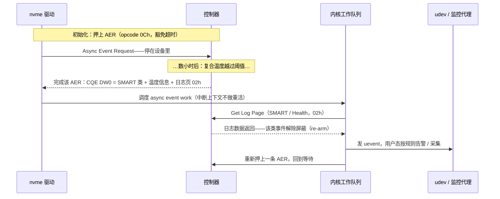

---
tags:
  - 高性能存储
status: 已完成
---

# AER 异步事件

> [[3.13 Command Timeout 与 Controller Reset]] 是主机主动问"你还活着吗"；本篇反过来：**设备想主动说话**——温度过线了、备用块快用完了、namespace 变了——怎么把话递给主机？麻烦在于 NVMe 的世界观里一切都是"主机发命令、设备回执"（[[3.1 NVMe 命令模型]]），设备没有主动信道。协议的解法是网络工程师的老朋友**长轮询（long polling）**：主机预先押几条**永不超时**的命令在 Admin 队列里，设备想说话时就"完成"其中一条。这套机制叫 AER（Asynchronous Event Request，异步事件请求），它是健康监控与故障摘除（[[10.6 健康检查与故障摘除]]）的设备侧入口。

前置：[[3.3 Admin Queue 与 IO Queue]]（admin 命令通道）、[[3.13 Command Timeout 与 Controller Reset]]（超时机制——AER 恰好是它的豁免者）。

---

## 1. 问题：请求-响应协议里，被动方怎么主动说话

先把问题抽象出来，你在网络编程里见过它：HTTP 服务器想主动推送消息给客户端，但 HTTP 是请求-响应协议——客户端不问，服务器没法说。经典解法是**长轮询**：客户端发一个请求，服务器**故意不回**，攥在手里；等真有消息了才响应；客户端处理完立刻再发一个，保持始终有请求"押"在服务器那里。

**【事实】** AER 就是这套模式的 NVMe 版：

- AER 是一条 admin 命令（opcode 0Ch），**不带数据、不带参数**，唯一作用是"押在设备那里"；
- 设备平时不完成它；某类事件发生时，完成一条在押的 AER，把事件摘要写进 CQE；
- 主机处理完后**重新押上一条**，回到等待。

C++ 对应【类比，非等同】：向线程池提交 N 个"等事件"的任务，回调里处理完再把自己重新提交——或者更贴近的：异步 socket 编程里预先挂 N 个 `recv`，谁完成处理谁、处理完立刻补挂。

两个立刻能推出的性质：

- **AER 必须豁免超时**【实现】：一条命令挂几天不完成是它的正常状态。[[3.13 Command Timeout 与 Controller Reset]] 的 30/60 秒定时器对 AER 不适用——Linux 驱动对 AER 单独处理，不进入普通命令的超时统计。"永不完成的命令"从 bug 变成了特性，靠的是驱动明确区分这两类语义；
- **在押数量有上限**【事实】：Identify Controller 的 **AERL**（Asynchronous Event Request Limit）字段规定主机最多同时押几条（0 基）。这是**有界的 outstanding**——设备不用为无限多的在押命令留状态。Linux 实践只押少量（常为 1 条）就够用【实现】，因为事件本身也不会堆积（见第 3 节的屏蔽机制）。

---

## 2. 事件长什么样：CQE 是门铃，详情在日志页

设备完成一条 AER 时，事件信息压缩在 CQE 的 DW0 里【事实】：

| DW0 字段 | 含义 |
| --- | --- |
| 事件类型（bits 2:0） | 0 = Error（错误）、1 = SMART/Health（健康）、2 = Notice（通知）、7 = 厂商自定义 |
| 事件信息（bits 15:8） | 类型内细分：哪种错误 / 哪个健康阈值 / 哪种变更 |
| 关联日志页（bits 23:16） | 详情去哪读：一个 Log Page ID |

三大类事件与去处：

| 类型 | 典型事件 | 关联日志页 |
| --- | --- | --- |
| Error | 写入无效门铃值、固件内部错误 | Error Information（01h） |
| SMART/Health | **温度越过阈值、备用块低于阈值、可靠性劣化** | SMART / Health Information（02h） |
| Notice | namespace 属性变更、固件激活开始 | 如 Changed Namespace List（04h） |

**关键设计**【设计】：16 字节的 CQE 装不下事件详情，也不需要装——CQE 只当**门铃**，告诉主机"出了哪类事、去哪个日志页看"。详情要主机再发一条 `Get Log Page`（admin opcode 02h）去取。这和 [[3.12 Interrupt 与 MSI-X]] 的分层一脉相承：**通知与数据分离**——中断提示"CQE 可见"，CQE 提示"日志页可读"，一层比一层信息量大、成本也高。

哪些事件会上报是可配置的【事实】：`Set Features` FID 0Bh（Asynchronous Event Configuration）按位打开/关闭各健康告警与通知类事件；温度阈值本身则由 FID 04h（Temperature Threshold）设定。

---

## 3. 边沿触发与重挂：epoll ET 的设备版

AER 有个必须内化的行为【事实】：**某类事件上报一次后即被屏蔽，直到主机读取关联日志页才解除**。设备的逻辑是："我按过一次门铃了，你还没来看，我不再按第二次。"

你学过它的软件版——**epoll 的边沿触发（ET）**：事件只通知一次，不读干净就不会再来。后果也相同：

- **好处**：天然的事件聚合与流控。温度在阈值附近抖动一万次，主机只收到一次通知；日志页里看到的是当前的完整状态（读的是最新值，不是一万条历史）。事件不会淹没 admin 队列——这就是为什么在押 1 条 AER 通常够用；
- **代价**：**读日志页不是可选动作，是协议义务**。只收 CQE 不读日志页，这类事件从此静默——监控"装好了但收不到告警"的经典事故源。

完整环路（从设备发事件到用户态收到、再回到等待）：



**【实现】** 驱动侧的分工也值得看一眼：AER 完成走 admin 队列的中断，但中断上下文只做"认出这是异步事件、调度 work"——发 `Get Log Page`、重新扫描 namespace（Notice 事件时）、向用户态发 uevent 都在工作队列里做。与 [[3.12 Interrupt 与 MSI-X]]、[[3.13 Command Timeout 与 Controller Reset]] 反复出现的纪律一致：**中断/超时上下文只做状态迁移与调度，重活丢给工作线程**。

---

## 4. AER 与存储延迟有什么关系

AER 走 Admin 队列，不碰 IO 路径——它本身不给任何一笔 IO 加一纳秒。它的价值在于**预告延迟灾难**【设计】：

- **温度事件 → 降速在即**：设备过热会主动降速自保（thermal throttling）。温度越过阈值的 AER 比"IOPS 突然掉一半"早到几分钟——这是把 [[9.5 p99 毛刺定位]] 里"不规则成簇毛刺"从事后归因变成事前预警的机会；
- **备用块 / 可靠性事件 → 摘除时机**：`critical_warning` 里"备用块低于阈值""可靠性劣化"亮起时，盘还能用，但已在通往 [[3.13 Command Timeout 与 Controller Reset]] 复位风暴的路上。健康摘除（[[10.6 健康检查与故障摘除]]）依赖这些信号在**故障造成尾延迟之前**把盘换下；
- **对比轮询 SMART**【取舍】：定期 `smartctl` 轮询也能拿到同样数据，但有采样间隔盲区，且每次轮询都占用 admin 通道。事件推送 + 按需读日志页，盲区为零、稳态成本为零——代价是第 3 节的协议义务（必须读日志页 re-arm）。实践常两者并用：AER 做实时告警，低频轮询做兜底与趋势采集。

---

## 5. 动手：读一次 SMART 日志页

AER 本身不好徒手模拟（要等真实事件），但环路的后半段——`Get Log Page` 读 SMART——随时可做。命令行版：

```bash
nvme smart-log /dev/nvme0                    # 人类可读的 SMART/Health
nvme get-log /dev/nvme0 --log-id=2 --log-len=512   # 裸日志页（AER 处理路径读的就是它）
```

Modern C++ 版——亲手发一条 admin 命令，走的就是驱动 AER work 同款路径（`UniqueFd` 与 [[3.11 NVMe Flush 与 FUA]] 第 5 节相同）：

```cpp
#include <fcntl.h>
#include <sys/ioctl.h>
#include <unistd.h>
#include <linux/nvme_ioctl.h>

#include <array>
#include <cstdint>
#include <cstring>
#include <print>
#include <system_error>
#include <utility>

class UniqueFd {
public:
    explicit UniqueFd(int fd = -1) noexcept : fd_(fd) {}
    ~UniqueFd() { if (fd_ >= 0) ::close(fd_); }
    UniqueFd(const UniqueFd&) = delete;
    UniqueFd& operator=(const UniqueFd&) = delete;
    UniqueFd(UniqueFd&& o) noexcept : fd_(std::exchange(o.fd_, -1)) {}
    UniqueFd& operator=(UniqueFd&& o) noexcept {
        if (this != &o) { if (fd_ >= 0) ::close(fd_); fd_ = std::exchange(o.fd_, -1); }
        return *this;
    }
    [[nodiscard]] int get() const noexcept { return fd_; }
private:
    int fd_;
};

// 教学用途：Get Log Page（admin opcode 02h）读 SMART/Health（LID 02h）。需要 root。
int main(int argc, char** argv) {
    const char* dev = argc > 1 ? argv[1] : "/dev/nvme0";
    UniqueFd fd{::open(dev, O_RDONLY)};
    if (fd.get() < 0) {
        throw std::system_error{errno, std::generic_category(), "open"};
    }

    std::array<std::uint8_t, 512> log{};        // SMART 日志页固定 512 字节
    nvme_admin_cmd cmd{};                       // 值初始化清零，再填字段
    cmd.opcode   = 0x02;                        // Get Log Page
    cmd.nsid     = 0xFFFFFFFF;                  // 控制器全局视角
    cmd.addr     = reinterpret_cast<std::uint64_t>(log.data());
    cmd.data_len = log.size();
    // CDW10：低 8 位 = LID(02h)，bits 27:16 = 读取的 dword 数 - 1（512/4 - 1 = 127）
    cmd.cdw10    = 0x02u | (127u << 16);

    if (::ioctl(fd.get(), NVME_IOCTL_ADMIN_CMD, &cmd) < 0) {
        throw std::system_error{errno, std::generic_category(), "get-log-page"};
    }

    const std::uint8_t warn = log[0];           // critical_warning 位图
    std::uint16_t kelvin = 0;                   // 字节 1..2：复合温度，开尔文
    std::memcpy(&kelvin, &log[1], sizeof kelvin);

    std::println("critical_warning : {:#04x}{}", warn,
                 warn ? "  <-- 有告警位在亮!" : "");
    std::println("composite temp   : {} C", kelvin - 273);
    std::println("available spare  : {}% (threshold {}%)", log[3], log[4]);
    std::println("percentage used  : {}%", log[5]);
    return 0;
}
```

```bash
g++ -std=c++23 -Wall -Wextra -o nvme_smart nvme_smart.cpp && sudo ./nvme_smart /dev/nvme0
```

**关键点**：

- `critical_warning`（字节 0）是位图：bit 0 备用块低于阈值、bit 1 温度越限、bit 2 可靠性劣化、bit 3 介质进入只读、bit 4 易失备份电池失效【事实】——任何一位亮起都该触发运维动作，这正是 AER SMART 类事件通知你去看的字段；
- 温度是**开尔文**不是摄氏度【事实】——直接当 ℃ 读会以为盘在燃烧；
- `nvme_admin_cmd` 值初始化清零的理由同 [[3.11 NVMe Flush 与 FUA]]：passthrough 结构里的脏字段会变成非法命令；
- 这条命令走 admin 队列。别把它放进高频监控循环里疯狂调用——admin 通道是低频控制面（[[3.3 Admin Queue 与 IO Queue]]），秒级采样已绰绰有余。

---

## 6. 陷阱与误区

> [!warning] 常见错误
> 1. **NVMe AER ≠ PCIe AER**：同一个缩写，两层协议。PCIe AER（Advanced Error Reporting）报告的是链路层错误（坏 TLP、链路训练失败），在 [[0.4 PCIe BAR MMIO 与 MSI-X]] 的配置空间里；本篇的 AER（Asynchronous Event Request）是 NVMe 命令层机制。日志里 `pcieport AER` 与 `nvme` 的告警来源完全不同，混着排查会走错方向。
> 2. **收了 CQE 不读日志页**：该类事件被屏蔽后不再上报——监控静默不等于设备健康。自研监控走 passthrough 收事件时，必须完成"读日志页 re-arm"这半步。
> 3. **把 AER 挂着不完成当成 bug**："命令挂了三天"对 AER 是正常态。审计在途命令、写超时告警时要把 AER 排除在外，否则天天误报。
> 4. **critical_warning 亮了还在观望**：备用块与可靠性告警是介质临终通知，后面排着的是读错误、复位风暴（[[3.13 Command Timeout 与 Controller Reset]]）。正确动作是走摘除流程，不是"再观察观察"。
> 5. **拿高频轮询代替事件**：采样间隔内的瞬态（温度尖峰）会漏掉，admin 通道也被白白占用。AER 管实时性，轮询管趋势，分工不可互换。
> 6. **忘了事件上报是可配置的**：换了新盘/新固件后告警不来，先查 `Set Features` FID 0Bh 的事件使能位和 FID 04h 的温度阈值——默认配置未必开了你要的事件。

---

## 7. 关键结论

| 结论 | 性质 |
| --- | --- |
| AER = 长轮询：主机押无参数命令在 admin 队列，设备用"完成它"来主动说话 | 事实 |
| AER 豁免超时——"永不完成"是特性；在押数量受 AERL 限制，有界 outstanding | 事实 / 实现 |
| CQE 只是门铃（类型 + 信息 + 日志页 ID），详情必须再发 Get Log Page 去取——通知与数据分离 | 事实 / 设计 |
| 事件上报后即屏蔽，读日志页才 re-arm ≈ epoll ET：不 drain 就永远静默 | 事实 / 类比 |
| 中断上下文只调度，读日志/扫描/uevent 全在工作队列——与 3.12/3.13 同一纪律 | 实现 |
| AER 不加 IO 延迟，它预告延迟：温度事件先于降速，备件告警先于复位风暴 | 设计 |
| AER 管实时告警，SMART 轮询管趋势兜底，两者分工并用 | 取舍 |
| SMART 温度是开尔文；critical_warning 任一位亮起都是摘除信号 | 事实 |

---

## 关联知识

- [[3.3 Admin Queue 与 IO Queue]] - AER 的通道：低频控制面
- [[3.13 Command Timeout 与 Controller Reset]] - 超时机制与它的豁免者；健康告警预告的正是复位风暴
- [[3.12 Interrupt 与 MSI-X]] - "通知与数据分离"的上一层：中断 → CQE → 日志页
- [[3.11 NVMe Flush 与 FUA]] - passthrough 编程模式与 UniqueFd 的出处
- [[9.5 p99 毛刺定位]] - 温控降速造成的成簇毛刺：AER 把归因变预警
- [[9.6 故障注入矩阵]] - 健康事件在故障注入矩阵中的位置
- [[10.6 健康检查与故障摘除]] - 集群侧消费这些信号的摘除流程

## 参考

- NVM Express Base Specification：Asynchronous Event Request 命令、Asynchronous Event Configuration（Set Features FID 0Bh）、SMART / Health Information Log（02h）
- Linux 内核源码：`drivers/nvme/host/core.c`（async event 处理与 uevent 上报）
