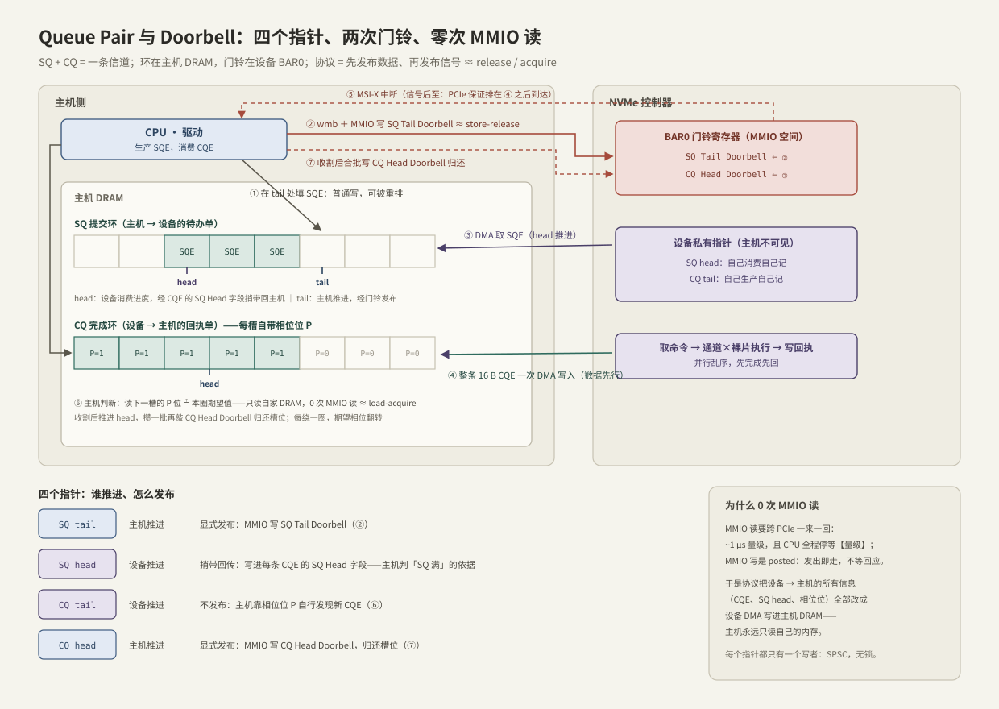

---
tags:
  - 高性能存储/NVMe与SSD
---
# Queue Pair 与 Doorbell

> Queue Pair（QP）= 一条 SQ 配一条 CQ，是主机与设备之间的通信信道。它要解决的问题多线程工程师熟悉到骨子里：**两个并发执行体（CPU 与设备 DMA 引擎）隔着 PCIe 共享内存通信，怎么做到既正确（可见性）又快（不互相等）**。答案是四个指针、两个门铃、一个相位位——每一件都能翻译成 release/acquire 词汇，而且每一件都直接决定 IO 延迟里的软件份额。

前置：[[3.1 NVMe 命令模型]]（SQE/CQE 是什么）、[[1.7 块层与 blk-mq]]（第 4 节初见门铃协议；本篇展开设备侧全貌）。

---

## 1. 角色分配：环在主机内存，门铃在设备

**【事实】** SQ/CQ 环形队列放在**主机 DRAM**（部分设备支持放进设备内存 CMB，属可选优化，一句带过）；门铃（doorbell）是**设备 BAR0 MMIO 空间里的寄存器**，每条队列各一个。

为什么这样分【设计】：大块状态（环、数据）放 DRAM——容量大、主机访问快、设备 DMA 可达；设备只暴露最小的"告知"接口。背后的成本表是全篇的钥匙【量级】：

| 访问方式 | 成本量级 | 特点 |
| --- | --- | --- |
| 主机读写自家 DRAM | ~百 ns，常命中 cache | 最便宜 |
| 设备 DMA 读写 DRAM | ~百 ns 级 | 不占 CPU |
| 主机 MMIO **写**（posted） | 发出即走 | 不等设备回应，不停顿 |
| 主机 MMIO **读** | **~1 μs，CPU 全程停等** | 跨 PCIe 一来一回 |

由此得出协议的红线：**热路径上主机绝不做 MMIO 读**。整套 QP 设计可以理解为围绕这条红线的一组解法。

---

## 2. 四个指针：谁推进、怎么发布



每个环有 head（消费端）和 tail（生产端）；空 = `head == tail`，满 = 再进一个就追上 head（留一空槽区分满与空）【事实】。关键在**每个指针只有一个写者**——这是无锁的根源，与手写 SPSC ring buffer 完全同构：

| 指针 | 谁推进 | 怎么让对方知道 |
| --- | --- | --- |
| SQ tail | 主机 | **显式发布**：MMIO 写 SQ Tail Doorbell |
| SQ head | 设备 | **捎带回传**：写进每条 CQE 的 SQ Head 字段 |
| CQ tail | 设备 | **不发布**：主机靠相位位自行发现新 CQE |
| CQ head | 主机 | **显式发布**：MMIO 写 CQ Head Doorbell（归还槽位） |

三种发布方式对应三种成本：贵的方向（主机→设备）用最少次数的 posted MMIO 写；反方向（设备→主机）全部搭 DMA 的便车，主机零成本读自家内存。

---

## 3. 提交侧：门铃 ≈ store-release

流程：填 SQE（普通内存写）→ **写屏障** → MMIO 写 SQ Tail Doorbell。

- **为什么需要门铃**：设备不监听主机 DRAM 的写流量；没有门铃它只能不停 DMA 轮询 SQ——烧总线带宽换延迟【取舍】。门铃把"有新活"变成一次定向通知，≈ 生产者 push 后的 `notify`；
- **为什么需要屏障**【事实】：填 SQE 的写可能被 CPU 重排到门铃写之后。必须"填完 → 屏障 → 敲铃"，设备看到新 tail 时 SQE 必定完整可见——**≈ `store(memory_order_release)`**。内核用 `wmb()/dma_wmb()`；PCIe 事务排序规则保证同方向 posted 写不超车，两者合起来才构成完整保证；
- **【类比，非等同】** 设备不是 C++ 抽象机里的线程：屏障是内核原语 + PCIe 排序规则，不是 `std::atomic`。但"先发布数据、再发布信号"的问题与解法完全同源——没有屏障，设备可能取到写了一半的命令，这是正确性问题不是性能问题；
- **门铃合批**【实践】：填 N 个 SQE 敲一次铃（tail 一次推 N），MMIO 成本摊薄成 1/N。io_uring 的批量提交落到驱动层，就是靠这一条把"一批 IO 一次陷入"延续成"一批命令一次门铃"。

---

## 4. 完成侧：相位位 ≈ 不读设备的 load-acquire

问题：主机怎么知道 CQ 里有新回执？CQ tail 由设备维护——主机去读它就是 MMIO 读，踩红线。

**协议的解法【事实】**：不传 tail，让**每条 CQE 自带 1 bit 相位位（Phase Tag，P）**：

1. CQ 初始化后，主机期望相位 = 1；
2. 设备每写一条 CQE，其 P 位 = 设备当前圈的相位；写满一圈翻转；
3. 主机检查 head 的下一槽：`P == 期望值` → 是新回执；处理后推进 head；
4. 主机每绕完一圈，期望相位也翻转。

于是"判断有没有新完成"= **读一次自家 DRAM（大概率命中 cache）**。与 seqlock/版本号发布神似：**数据自带新旧标记，读者永远不用问写者"你写到哪了"**。

顺序保证【事实】：设备把 16 B CQE 作为一次 DMA 写整体送达（P 位在最后一个字里）；主机读到 P 翻转后再消费其余字段，驱动侧配 `rmb()`——**≈ `load(memory_order_acquire)`**。

为什么 SQ 不需要相位位：SQ 的生产者是主机自己，tail 自己记在软件里；设备的消费进度（SQ head）经 CQE 捎带回来——两个方向各有各的免读方案。

**中断也是排好序的**【事实】：MSI-X 中断本身是一条 PCIe posted 写，排序规则保证它不会先于 CQE 的 DMA 写到达——**中断处理程序进 CQ 必能看到回执**。C++ 对照：这相当于硬件免费送了"`notify` 不会跑到数据前面"这条在用户代码里要靠 release/acquire 自己维护的性质。中断 ≈ `condition_variable::notify`（省 CPU、有唤醒延迟），轮询 ≈ 自旋 peek（低延迟、烧核），中断合并 ≈ 攒一批再唤醒【取舍】——完成发现方式的工程选择见 [[2.4 polling 与 registered buffers]] 与 [[5.6 SPDK 用户态驱动]]。

---

## 5. 内存序对照表

| NVMe 动作 | C++ 内存模型近似 | 保证来自 |
| --- | --- | --- |
| 填 SQE | 普通写（可重排） | — |
| 屏障 + 写 SQ Tail Doorbell | `store(memory_order_release)` | CPU 屏障 + PCIe posted 写排序 |
| 设备取 SQE | `load(memory_order_acquire)` | 设备实现 + PCIe |
| 设备写 CQE（P 位随整条送达） | `store(memory_order_release)` | PCIe 单次 DMA 写 |
| 主机读 P 位再读 CQE 其余字段 | `load(memory_order_acquire)` | `rmb()` |
| MSI-X 中断 | notify，且保证不早于数据 | PCIe posted 写排序 |

**【类比，非等同】** 这张表说的不是"NVMe 用了 `std::atomic`"，而是：**跨执行体共享内存通信的正确性问题只有一个，C++ 内存模型和 PCIe 排序规则是它在两个层面的解法**。在 1.7 与 2.1 各见过一次的门铃协议，到这里看到最底层的出处。

---

## 6. 背压与流控：深度链的最后两级

- **SQ 满**【事实】：`tail + 1 == head`（head 来自最近 CQE 捎带的 SQ Head 字段）→ 不能再提交。在途命令数的硬上限 = 队列深度；
- **软件为何在前面又加一层 tag 池**（[[1.7 块层与 blk-mq]]）【设计】：blk-mq 的 tag 管的是整个请求生命周期（含内存、超时、统计），NVMe 队列管的只是协议窗口——两层有界并发各管各的资源；
- **CQ 满是主机的责任**【事实】：协议要求主机保证 CQ 永不溢出——收割后及时敲 CQ Head Doorbell 归还槽位。主机收割慢 → 设备无处写回执 → 停止取新命令：**消费者失职，整条流水线憋死**。与 2.1 "收割优先于提交"是同一条纪律的协议出处；
- **整条背压链**：应用在途窗口 → blk-mq tag 池 → NVMe SQ → 设备内部并行度 → CQ → 收割。每级都是有界队列，任何一级满都向上游传导阻塞——与 C++ 里串联有界队列传播背压的方式一模一样（[[2.3 iodepth 与提交完成路径]] 的深度链在设备端收尾）。

**延迟视角**：门铃合批、中断合并都在省 CPU，代价是给单笔延迟加了"攒批等待"【取舍】；队列深度是吞吐杠杆，也是排队延迟的放大器（2.3 的三段曲线）。这一层的每个旋钮都同时拧着吞吐和 p99。

---

## 7. Modern C++：带相位位的完成环

把完成侧协议写成最小模型（**心智模型，非驱动代码**；单生产者单消费者，`atomic` 只标注真正的发布点）：

```cpp
#include <array>
#include <atomic>
#include <cstddef>
#include <cstdint>
#include <optional>

struct Cqe {
    std::uint16_t cid       = 0;         // 对号票据
    std::uint16_t sq_head   = 0;         // 捎带的流控：设备消费 SQ 到哪了
    std::uint16_t status    = 0;
    std::atomic<std::uint16_t> phase{0}; // 相位位：发布信号（真实 CQE 是平坦 16 B，
};                                       // 此处用 atomic 只为把发布点写明白）

template <std::size_t N>                 // N 为 2 的幂
class CompletionRing {
public:
    // 生产者（扮演设备）：先写数据，再 release 发布相位——顺序即协议
    void push(std::uint16_t cid, std::uint16_t status) {
        Cqe& e = ring_[tail_ & (N - 1)];
        e.cid = cid;
        e.status = status;                                  // ① 数据先行
        e.phase.store(dev_phase_, std::memory_order_release); // ② 再发布 P
        ++tail_;
        if ((tail_ & (N - 1)) == 0) dev_phase_ ^= 1u;       // 绕圈翻相位
    }

    // 消费者（主机）：判新只读自家内存——没有任何"问对方写到哪了"
    std::optional<Cqe*> poll() {
        Cqe& e = ring_[head_ & (N - 1)];
        if (e.phase.load(std::memory_order_acquire) != host_phase_)
            return std::nullopt;                            // 无新回执
        ++head_;
        if ((head_ & (N - 1)) == 0) host_phase_ ^= 1u;      // 绕圈翻期望
        ++uncommitted_;                                     // 攒批：稍后合批
        return &e;                                          // 敲 CQ Head Doorbell
    }

private:
    std::array<Cqe, N> ring_{};
    std::size_t head_ = 0, tail_ = 0;
    std::uint16_t host_phase_ = 1, dev_phase_ = 1;
    std::size_t uncommitted_ = 0;   // 已收未归还的槽位数（门铃合批计数）
};
```

三个与真协议一一对应的点：`push` 里"数据先行、相位后发布"的顺序就是设备的 DMA 顺序；`poll` 判新是一次 acquire 读自家内存；`uncommitted_` 体现"归还槽位可以合批，但不能不还"。

---

## 8. 陷阱与误区

> [!warning] 常见错误
> 1. **热路径读设备寄存器查状态**：相位位的存在就是为了避免它——一次 MMIO 读 ~1 μs，高 IOPS 下自毁延迟。SPDK 等用户态驱动里这是真实可犯的错。
> 2. **每个 SQE 敲一次门铃**：MMIO 写虽是 posted，也有不可忽略的发射成本；不合批 = 提交路径 CPU 开销倍增。
> 3. **收割不归还 CQ head**：设备无处写回执后停摆，表现为 IO 无故挂起——收割纪律的协议级后果。
> 4. **以为 `volatile` 等于屏障**：`volatile` 只禁编译器优化，不约束 CPU 重排，更不管 PCIe——发布必须靠真正的屏障/原子序。
> 5. **把门铃当数据通道**：门铃只传"tail 推进到几"这一个索引，命令内容永远走 DRAM。
> 6. **把中断当唯一完成机制**：中断省 CPU 但有唤醒与合并延迟；延迟敏感场景轮询是正解【取舍】（[[2.4 polling 与 registered buffers]]）。

---

## 9. 关键结论

| 结论 | 性质 |
| --- | --- |
| 环在主机 DRAM、门铃在设备 BAR0；四个指针各只有一个写者——SPSC 无锁 | 事实 |
| 热路径红线：主机 0 次 MMIO 读；设备→主机的信息全部 DMA 进 DRAM | 事实 |
| 提交 = 填 SQE → 屏障 → 门铃 ≈ store-release；完成发现 = 读相位位 ≈ load-acquire | 事实 / 类比 |
| MSI-X 排在 CQE 之后送达：中断天然"不早于数据" | 事实 |
| SQ 满由 CQE 捎带的 head 判定；CQ 不溢出是主机的义务——收割优先 | 事实 |
| 门铃合批、中断合并：省 CPU 换单笔延迟；深度换吞吐、放大排队 | 取舍 |
| 这套协议是 1.7 门铃与 2.1 双环的最底层出处——一个协议形状贯穿三层 | 类比 / 实践结论 |

---

## 关联知识

- [[3.1 NVMe 命令模型]] - 在这条信道上跑的消息格式
- [[3.3 Admin Queue 与 IO Queue]] - 信道分两类：谁建的、归谁用
- [[1.7 块层与 blk-mq]] - 内核里这套协议的调用方与 tag 背压
- [[2.1 SQ CQ 模型]] - 同一协议形状的用户态复刻
- [[2.4 polling 与 registered buffers]] - 完成发现方式（中断/轮询）的取舍
- [[5.6 SPDK 用户态驱动]] - 把本篇协议整个搬进用户态、纯轮询驱动
- [[4.3 QP WQE CQ 状态机]] - RDMA 网卡上的同名概念，对照着看
