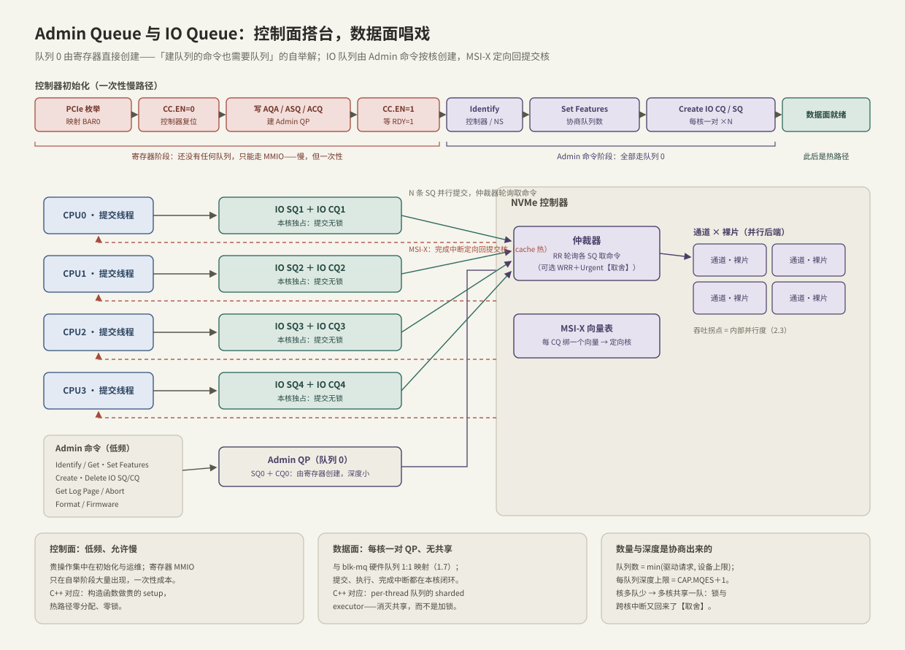

---
tags:
  - 高性能存储/NVMe与SSD
---
# Admin Queue 与 IO Queue

> NVMe 把队列分成两类：Admin Queue（队列 0）走管理命令，IO Queue 走读写。这是**控制面/数据面分工**在单块设备里的缩影：控制面低频、允许慢、集中在初始化与运维；数据面每核一对、无共享、快到不能碰锁。与 C++ 服务的经典结构——构造函数里做贵的 setup、热路径 per-thread 无锁——是同一张图纸。

前置：[[3.1 NVMe 命令模型]]（命令与回执）、[[3.2 Queue Pair 与 Doorbell]]（每对队列内部怎么转）。

---

## 1. 两类队列，两类命令

| 维度 | Admin Queue（队列 0） | IO Queue（队列 1..N） |
| --- | --- | --- |
| 数量 | 有且仅有一对 | 最多 64 Ki − 1 对【事实】 |
| 创建方式 | **MMIO 寄存器直接指定** | **Admin 命令创建** |
| 命令集 | Identify、Get/Set Features、Create/Delete IO SQ·CQ、Get Log Page、Abort、Format、Firmware | Read、Write、Flush、Write Zeroes、Dataset Management（TRIM） |
| 频率 | 低频（初始化 + 运维） | 热路径，每秒可达百万次 |
| 深度 | 小（几十足矣） | 大（每队列可达数千） |

**【事实】** 两类命令的 opcode 空间独立，Admin 命令不能投进 IO 队列，反之亦然——职责隔离是协议强制的，不是驱动的良好习惯。

这就是 [[10.1 数据面与控制面分工]] 的设备内版本：慢而聪明的路径管配置，快而简单的路径管数据。记住这个形状，第 10 章的集群控制面只是它的放大。

---

## 2. 自举：队列 0 从哪来

鸡生蛋问题：创建 IO 队列的命令（Create IO SQ/CQ）本身也要通过队列递交——**第一条队列谁来建？**

**【事实】** Admin QP 不用命令建，用 BAR0 寄存器直接指定：`AQA`（深度）、`ASQ`/`ACQ`（SQ/CQ 基址）。控制器初始化的完整序列：



1. PCIe 枚举，映射 BAR0（[[3.8 PCIe 拓扑与 NUMA]]）；
2. `CC.EN = 0` 复位，等 `CSTS.RDY = 0`；
3. 写 `AQA` / `ASQ` / `ACQ`——Admin QP 就位；
4. `CC.EN = 1`，等 `CSTS.RDY = 1`——设备开始取 Admin 命令；
5. `Identify`：读控制器与 namespace 的能力与几何参数；
6. `Set Features (Number of Queues)`：协商 IO 队列数量；
7. 逐对 `Create IO CQ` → `Create IO SQ`（**CQ 先建**：SQ 创建时要引用完成落点的 CQ，删除时反序）【事实】；
8. 注册进 blk-mq，数据面就绪。

**设计上的一课**：自举阶段大量使用 MMIO 寄存器——慢，但一次性，无所谓；稳态热路径一次都不碰。**"贵的操作滚去初始化"不是优化技巧，而是协议的结构**。C++ 对应：构造函数里 mmap、预分配、建线程池（慢没关系），`submit()` 热路径零分配、零锁、零系统调用。

---

## 3. IO 队列拓扑：每核一对

- **每核一对 QP**【实现】：Linux nvme 驱动按 CPU 数请求队列，与 blk-mq 硬件上下文 1:1 映射（[[1.7 块层与 blk-mq]] 的那张表在设备端的另一半）——提交路径从应用线程到设备 SQ 全程不跨核、不加锁；
- **SQ:CQ 配比灵活**【事实】：协议允许多条 SQ 共享一条 CQ；Linux 默认 1:1，最简单也最利于中断定向；
- **MSI-X 定向**：每条 CQ 绑一个中断向量，亲和到提交核——**提交、执行返回、完成处理都在同一个核**：请求上下文还在本核 cache 里，无跨核同步、无缓存行弹跳。C++ 对应：sharded executor（任务在哪个线程提交就在哪个线程收尾），消灭共享而不是保护共享；
- **NUMA**：队列内存分配在提交核所属节点，避免跨 socket 的 DMA 与访存（细节在 [[3.8 PCIe 拓扑与 NUMA]]）；
- **仲裁**【取舍】：设备从多条 SQ 取命令默认 Round Robin（协议必选）；可选 Weighted RR + Urgent 优先级，实践少用——对称负载下 RR 已足够，软件层调度（cgroup io、调度器）更灵活。

---

## 4. 数量与深度：协商而非无限

- **【事实】** 队列数是协商结果：驱动 `Set Features` 请求 N，设备回它实际支持的数量，取 `min`；每队列深度上限 = `CAP.MQES + 1`；
- **核多队少 → 共享退化**：blk-mq 把多个核映射到同一条队列——锁回来了，完成中断也可能落在别的核。物理机上少见，**虚拟机/云盘上常见**【实践】：hypervisor 常只给少量队列，照搬物理机的调优经验会失效；
- **队列多深 ≠ 快**：总在途数的收益上限还是设备内部并行度（[[2.3 iodepth 与提交完成路径]] 的拐点）；队列是通道不是加速器，超配深度只把排队搬进设备。

观察入口（详见 [[3.7 nvme-cli 实操]]）：

```bash
cat /proc/interrupts | grep nvme       # 每队列一个 MSI-X 向量，看分布与亲和
ls /sys/block/nvme0n1/mq/              # blk-mq 硬件上下文 → 队列映射
nvme get-feature /dev/nvme0 -f 0x07 -H # Number of Queues 的协商结果
```

---

## 5. 延迟账：分工怎么影响 p99

1. **每核队列消灭三样东西**：锁争用、缓存行弹跳、跨核完成中断。对 4 KiB 级小 IO，这些软件开销是微秒级——与设备延迟同量级，直接坐在 p99 上【事实/量级】；
2. **亲和错配的典型故障**【实践】：irqbalance 把 nvme 向量迁走 → 完成处理跨核 → 每笔 IO 多付核间通信与 cache miss——负载没变、p99 缓慢劣化，`/proc/interrupts` 一看便知（定位方法 [[9.5 p99 毛刺定位]]）；
3. **Admin 不免费**【事实/实践】：Format、大块 Get Log Page、固件活动虽走控制面队列，但与 IO 抢的是**同一个控制器与介质**——设备内部没有完美隔离。运维动作放低峰，是"控制面允许慢"的另一面：允许慢 ≠ 不占资源；
4. **队列共享退化**：见第 4 节——云环境 p99 与物理机差一截，队列数常是第一嫌疑。

---

## 6. Modern C++：控制面在构造，数据面在 submit

把本篇结构写成 RAII（**心智模型，非驱动代码**）——注意贵操作全部落在构造/析构，热路径只剩一次数组索引：

```cpp
#include <cstdint>
#include <memory>
#include <vector>

class IoQueuePair;   // 内部为 3.2 的 SQ/CQ 环 + 门铃（略）
struct Bar0 { /* 映射好的 BAR0 寄存器视图（略） */ };

// 控制器生命周期 = RAII：
//   构造   = 自举 + 建队列（慢路径：寄存器 + Admin 命令，秒级也无妨）
//   热路径 = queue_for(cpu).submit(...)（无锁，本核队列）
//   析构   = Delete IO SQ/CQ（反序）→ CC.EN=0（对称收尾）
class NvmeController {
public:
    NvmeController(Bar0 regs, unsigned ncpu) : regs_{regs} {
        reset_and_wait();                        // CC.EN=0 → RDY=0
        setup_admin_queue();                     // AQA/ASQ/ACQ：寄存器直配
        enable_and_wait();                       // CC.EN=1 → RDY=1
        identify();                              // Admin: Identify
        const unsigned n = negotiate_queues(ncpu);  // Admin: Set Features
        qps_.reserve(n);
        for (unsigned i = 0; i < n; ++i)
            qps_.push_back(create_io_qp(i + 1)); // Admin: Create CQ → Create SQ
    }
    ~NvmeController();                           // Delete SQ→CQ 反序，CC.EN=0
    NvmeController(const NvmeController&) = delete;
    NvmeController& operator=(const NvmeController&) = delete;

    // 数据面：本核直取——每次调用都在热路径上，不碰任何共享状态
    IoQueuePair& queue_for(unsigned cpu) noexcept {
        return *qps_[cpu % qps_.size()];  // 核多队少的共享退化就发生在这一行
    }

private:
    void reset_and_wait();
    void setup_admin_queue();
    void enable_and_wait();
    void identify();
    unsigned negotiate_queues(unsigned want);
    std::unique_ptr<IoQueuePair> create_io_qp(unsigned qid);

    Bar0 regs_;
    std::vector<std::unique_ptr<IoQueuePair>> qps_;
};
```

结构即结论：**构造函数读起来就是第 2 节的初始化时间轴**；`queue_for` 的取模是第 4 节"共享退化"的代码位置；析构反序删除对应协议的依赖方向——RAII 不只是不泄漏，还把协议的时序约束固化进了类型。

---

## 7. 陷阱与误区

> [!warning] 常见错误
> 1. **以为队列越多越快**：超过核数与设备并行度后零收益，还占设备资源；深度同理——队列是通道不是加速器。
> 2. **无视中断亲和**：irqbalance 迁走 nvme 向量是 p99 劣化的经典原因；nvme 驱动默认做好了亲和，别让通用工具改坏它。
> 3. **把 Admin 命令当免费**：Format / 大 Get Log Page / 固件升级与 IO 抢设备内部资源——运维窗口避开业务高峰。
> 4. **忽视创建/删除顺序**：CQ 先建后删、SQ 后建先删——顺序错误直接被设备拒绝【事实】。
> 5. **云上照搬物理机经验**：虚拟化环境队列数常被 hypervisor 压到个位数，共享退化是常态；先看协商结果再谈调优。
> 6. **混淆队列深度与设备并行度**：前者是排队容量，后者是吞吐拐点（[[2.3 iodepth 与提交完成路径]]）。

---

## 8. 关键结论

| 结论 | 性质 |
| --- | --- |
| Admin/IO 队列命令集隔离：控制面低频允许慢，数据面热路径无锁 | 事实 |
| Admin QP 由寄存器创建——自举问题的解；此后一切队列由 Admin 命令创建 | 事实 |
| 贵操作滚去初始化是协议结构，不是优化技巧；C++ 对应 = 构造函数做 setup | 事实 / 类比 |
| 每核一对 QP + MSI-X 定向：提交与完成同核闭环，消灭锁、弹跳与跨核中断 | 事实 |
| 队列数与深度是协商结果；核多队少 → 共享退化（虚拟化常态） | 事实 / 实践结论 |
| Admin 操作与 IO 抢设备内部资源：允许慢 ≠ 不占资源 | 实践结论 |
| CQ 先建后删，SQ 反之——依赖顺序由协议强制 | 事实 |

---

## 关联知识

- [[3.2 Queue Pair 与 Doorbell]] - 每对队列内部的运行协议
- [[1.7 块层与 blk-mq]] - 主机侧 1:1 映射的另一半与 tag 背压
- [[3.8 PCIe 拓扑与 NUMA]] - 队列与中断的物理落位
- [[3.7 nvme-cli 实操]] - 本篇观察命令的完整用法
- [[2.3 iodepth 与提交完成路径]] - 深度链与设备并行度拐点
- [[5.1 NVMe-oF 架构]] - QP 概念跨网络的延伸（Admin/IO 分工原样保留）
- [[10.1 数据面与控制面分工]] - 同一分工思想的集群版
