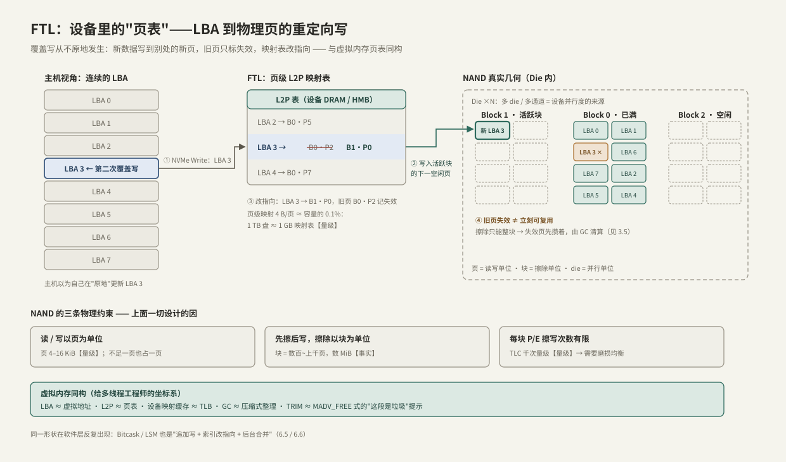

---
tags:
  - 高性能存储
  - NVMe与SSD
---
# SSD FTL 与地址映射

> SSD 固件里跑着一个你早就熟悉的东西：**页表**。主机发的 LBA 是"虚拟地址"，NAND 物理页是"页帧"，FTL（Flash Translation Layer，闪存转换层）就是页表 + 分配器——只不过它做映射不是为了隔离，而是因为 **NAND 物理上不允许原地覆盖写**。读懂 FTL，第 3 章后面两篇（GC/写放大、空盘/稳态）都只是它的推论。

前置：[[3.1 NVMe 命令模型]]（LBA 与读写命令从哪来）、[[1.7 块层与 blk-mq]]（请求怎样到达设备）。

---

## 1. NAND 的三条物理约束

一切从介质的物理特性出发【事实】：

| 约束 | 内容 | 量级 |
| --- | --- | --- |
| 读写单位 = 页 | 读和编程（写）都以页为单位，不足一页也占一页 | 页 4–16 KiB |
| 先擦后写，擦除单位 = 块 | 已写过的页必须先擦除才能再写，而擦除只能对整个块进行 | 块 = 数百~上千页，数 MiB |
| 寿命有限 | 每个块能承受的擦写（P/E，Program/Erase）次数有限 | TLC 千次量级，QLC 更低 |

再加一条结构事实【事实】：NAND 按 **通道（channel）→ die → plane → 块 → 页** 组织，一块盘内部有几十个 die 可以并行工作——这就是 [[1.7 块层与 blk-mq]] 里"浅队列喂不饱 NVMe"的物理来源：设备本身是个几十路并行的执行器。

**关键不对称**：写的粒度（页，KiB 级）和擦的粒度（块，MiB 级）差了两三个数量级，而且擦除比读写慢得多（毫秒级 vs 微秒级【量级】）。整个 FTL 的设计都是在调和这个不对称。

---

## 2. 推论：异地更新，以及为什么必须有一张映射表

如果主机覆盖写 LBA 3，固件想"原地"更新，就得把整个块读出来、擦掉、改一页、写回去——一次 4 KiB 写变成数 MiB 的读改写，慢到不可用，还烧 P/E 寿命。所以所有现代 SSD 都做**异地更新（out-of-place write）**【事实】：

1. 新数据写到当前**活跃块**的下一空闲页（纯追加，像写日志）；
2. 映射表把 LBA 3 改指向新页；
3. 旧物理页只**标记失效**（invalid），先欠着，攒多了由 GC 整块清算（[[3.5 GC 写放大与 Over-Provisioning]]）。

于是"LBA → 物理页"的映射表（L2P，Logical-to-Physical）成为必需品。对多线程/系统方向的工程师，这套结构处处似曾相识：

| SSD 内部 | 你已熟悉的对应物 | 说明 |
| --- | --- | --- |
| LBA | 虚拟地址 | 主机只见连续地址空间 |
| 物理页（PPA） | 物理页帧 | 真实位置由固件决定 |
| L2P 映射表 | 页表 | 覆盖写 = 改指向 |
| 设备端映射缓存 | TLB | miss 时要多一次介质/内存访问 |
| GC | 压缩式内存整理 | 活数据搬走，整块回收 |
| TRIM/Deallocate | `madvise(MADV_FREE)` | 告诉管理者"这段是垃圾" |

同一形状在软件层也反复出现：Bitcask/LSM 的"追加写 + 索引改指向 + 后台合并"（[[6.5 Bitcask 模型]]）就是把 FTL 的思路搬到了存储引擎里。

---

## 3. 一次覆盖写的完整路径



对照上图，主机第二次写 LBA 3 时：

1. **①** NVMe Write 命令到达（经 [[3.2 Queue Pair 与 Doorbell]] 的 SQ）；
2. **②** FTL 在活跃块 Block 1 分配下一空闲页 P0，数据经 DMA 写入；
3. **③** L2P 表中 LBA 3 的条目从 B0·P2 改指向 B1·P0；
4. **④** 旧页 B0·P2 标失效——**不能立刻复用**，因为擦除只能整块进行。

主机全程以为自己在"原地"更新；**LBA 相邻与物理相邻毫无关系**【事实】，物理布局完全由 FTL 决定。

---

## 4. 映射粒度与 DRAM 账【取舍】

映射表越细越灵活，也越占内存：

| 方案 | 粒度 | 表大小 | 代价 | 常见于 |
| --- | --- | --- | --- | --- |
| 页级映射 | 每 4 KiB 一项 | 容量的 ~0.1% | 需要板载 DRAM | 主流 NVMe 盘 |
| 块级映射 | 每块一项 | 极小 | 随机小写退化成块内读改写 | 早期/U 盘 |
| 混合（log-block） | 块级 + 少量页级日志块 | 小 | 日志块合并开销大、性能抖动 | 低端盘 |

**0.1% 规则的推导**【量级】：页级映射下每 4 KiB 逻辑页需要一个约 4 字节的物理页号，4 B / 4 KiB = 1/1024——**1 TB 盘约需 1 GB 映射表**。这就是标称容量越大、板载 DRAM 越大的原因。

省掉 DRAM 的两条路【取舍】：

- **DRAM-less + 映射缓存**：只在设备 SRAM 里缓存热点映射项，miss 时先去 NAND 读映射页再读数据——随机读延迟翻倍量级；
- **HMB（Host Memory Buffer）**：设备通过 PCIe 借一块**主机内存**放映射表。这是个有趣的跨层机制：内核 NVMe 驱动分配这块内存并告知设备，设备经 DMA 访问它。代价是每次查表多一次 PCIe 往返（百 ns 级【量级】），且掉电时表在主机侧。

```bash
# 看设备是否请求 HMB（HMPRE = Host Memory Buffer Preferred Size）
sudo nvme id-ctrl /dev/nvme0 -H | grep -iE 'hmpre|hmmin'
sudo dmesg | grep -i "host memory buffer"   # 驱动实际分配了多少
```

---

## 5. 最小 C++ 心智模型：一张会"说谎"的页表

30 行代码写出异地更新的本质（可直接编译运行）：

```cpp
#include <cstdint>
#include <iostream>
#include <unordered_map>
#include <vector>

// 覆盖写同一个 LBA 三次: 物理上产生三个页, 其中两个成了"失效"垃圾
int main() {
    std::unordered_map<uint32_t, uint32_t> l2p;  // LBA -> 物理页号
    std::vector<uint32_t> nand;                  // 物理页 -> 所存 LBA(简化)
    uint32_t invalid = 0;

    auto write = [&](uint32_t lba) {
        if (l2p.contains(lba)) ++invalid;        // 旧页失效, 但擦不掉
        l2p[lba] = static_cast<uint32_t>(nand.size());
        nand.push_back(lba);                     // 异地追加, 永不原地改
    };

    for (int i = 0; i < 3; ++i) write(7);        // 主机以为在"原地"更新 LBA 7
    std::cout << "映射表项: " << l2p.size()      // 1
              << "  物理页消耗: " << nand.size() // 3
              << "  失效页: " << invalid << '\n';// 2 —— 这是 3.5 的 GC 债务
}
```

实际输出：`映射表项: 1  物理页消耗: 3  失效页: 2`。**主机写了 3 页，介质欠下 2 页垃圾**——失效页怎么还、还的代价多大，就是 [[3.5 GC 写放大与 Over-Provisioning]] 的全部内容。

---

## 6. 在主机侧看见 FTL：可复现命令与实验

### 6.1 看清接口格式

```bash
nvme list                                  # 有哪些盘/命名空间
sudo nvme id-ns /dev/nvme0n1 -H | grep -A1 'LBA Format'
# 输出形如: LBA Format  0 : Metadata Size: 0 ... Data Size: 512 bytes ... (in use)
# 512 = 512e 兼容格式; 4096 = 4Kn。这只是"接口报价", 不是 NAND 页大小【事实】
lsblk --discard /dev/nvme0n1               # DISC-GRAN/DISC-MAX 非零 = 支持 TRIM
```

### 6.2 TRIM 的操作系统链路

删除文件后，只有把"这段 LBA 死了"传到 FTL，映射项才会被清掉【事实】。链路是：

```text
unlink()/删除 → 文件系统释放 extent
    → (a) 挂载了 discard: 立即下发 discard bio
      (b) 定期 fstrim: FITRIM ioctl 批量下发
    → 块层 discard 请求 → NVMe Dataset Management (Deallocate) 命令 → FTL 清映射
```

```bash
findmnt -o TARGET,OPTIONS / | grep -o discard   # 是否 inline discard
systemctl status fstrim.timer                   # 主流发行版: 每周批量 TRIM
sudo fstrim -av                                 # 手动触发, 会打印修剪掉的字节数
```

【取舍】inline discard 把小 TRIM 混进写路径（早年有性能与固件 bug 之虞）；`fstrim.timer` 攒批周期性下发，是目前更常见的默认。

### 6.3 实验一：对齐 vs 错位（可复现，覆写盘上数据）

512e 盘上故意让 4 KiB 写跨越内部 4 KiB 边界，FTL 被迫读改写：

```bash
# ⚠️ 会破坏 $DEV 上的数据, 只在测试盘上跑
DEV=/dev/nvme0n1
sudo fio --name=aligned  --filename=$DEV --direct=1 --rw=randwrite --bs=4k \
         --blockalign=4k  --iodepth=32 --runtime=30 --time_based
sudo fio --name=misalign --filename=$DEV --direct=1 --rw=randwrite --bs=4k \
         --blockalign=512 --offset=512 --iodepth=32 --runtime=30 --time_based
```

**指标读法**：比较两次的 IOPS 与 `clat` 均值/p99。错位组 IOPS 明显更低、延迟更高，就是内部读改写在收税。分区错位是同一个病：`parted /dev/nvme0n1 align-check optimal 1` 检查。

### 6.4 实验二：映射缓存的"TLB miss"（DRAM-less 盘）

```bash
# 前提: 盘已整体写过一遍(见 3.6 预处理), QD1 放大单次延迟
sudo fio --name=span-small --filename=$DEV --direct=1 --rw=randread --bs=4k \
         --iodepth=1 --size=1G   --runtime=60 --time_based
sudo fio --name=span-large --filename=$DEV --direct=1 --rw=randread --bs=4k \
         --iodepth=1 --size=100%  --runtime=60 --time_based
```

**实验设计逻辑**：1 GiB 跨度的映射项能全部驻留设备缓存；全盘跨度则频繁 miss。带 DRAM 的盘两组 `clat` 几乎相同；DRAM-less 盘大跨度组延迟显著上升——你测到的就是"设备端 TLB miss"。

---

## 7. 常见误读

> [!warning] 四个高频误读
> 1. **"SSD 没有寻道，随机写和顺序写一样快"**——空盘上接近成立；稳态下随机写让失效页均匀散布在所有块里，GC 搬运成本远高于顺序写，差距可达数倍（[[3.5 GC 写放大与 Over-Provisioning]]）。
> 2. **"扇区 512 字节，所以介质就是按 512B 管理的"**——512e 只是兼容接口报价；内部页 4–16 KiB。错位写会触发读改写。
> 3. **"LBA 连续 = 物理连续，所以要像 HDD 一样调度"**——物理布局由 FTL 决定，主机侧按扇区排序没有意义；这正是 NVMe 默认 `none` 调度器的理由（[[1.7 块层与 blk-mq]]）。
> 4. **"TRIM 会立刻擦除数据"**——TRIM 只是清映射的提示，擦除由 GC 择机执行。要保证数据不可恢复得用 `nvme format --ses=1`（Secure Erase）。

---

## 8. 故障定位：4K 随机性能异常排查

症状"这块盘 4K 随机写远低于预期"时，按序检查：

1. **接口格式**：`nvme id-ns -H` 看当前 LBA Format；许多盘的 512e 格式标着 `Relative Performance: Better/Degraded`，支持 4Kn 就换（毁灭性）：`sudo nvme format /dev/nvme0n1 --lbaf=<n>`；
2. **分区/文件系统对齐**：`parted align-check`；起始扇区应是 8 的倍数（4 KiB）；
3. **盘的状态**：空盘还是稳态？TRIM 是否长期没跑？（[[3.6 空盘与稳态性能]]）
4. **对照实验**：用 6.3 的两个 fio 任务把"对齐税"量化出来，`iostat -x` 里 `w_await` 同步升高可交叉印证（[[9.2 iostat 指标解读]]）；
5. **DRAM-less 嫌疑**：`nvme id-ctrl -H` 查 HMPRE，结合 6.4 的跨度实验确认。

---

## 9. 关键结论

| 结论 | 性质 |
| --- | --- |
| NAND：页读写、块擦除、先擦后写、P/E 有限——四条物理约束推出一切 | 事实 |
| 覆盖写永远异地更新：新页 + 改映射 + 旧页标失效 | 事实 |
| FTL = 设备里的页表 + 追加分配器；LBA 与物理位置无关 | 事实/类比 |
| 页级映射表 ≈ 容量 0.1%（1 TB → 1 GB），DRAM-less 用映射缓存或 HMB 顶替 | 量级/取舍 |
| TRIM 是"这段是垃圾"的提示，经文件系统→块层→Deallocate 到达 FTL；不等于擦除 | 事实 |
| 对齐错位触发设备内读改写，4K 对齐是免费的性能底线 | 实践结论 |

---

## 关联知识

- [[3.1 NVMe 命令模型]] - LBA 与命令的来源
- [[3.5 GC 写放大与 Over-Provisioning]] - 失效页的清算：本篇欠下的债
- [[3.6 空盘与稳态性能]] - FTL 状态如何决定测试数字
- [[1.7 块层与 blk-mq]] - 主机侧队列与设备并行度的衔接
- [[6.5 Bitcask 模型]] - 软件层的同构设计：追加写 + 索引改指向
- [[3.7 nvme-cli 实操]] - 本篇命令的完整工具面
