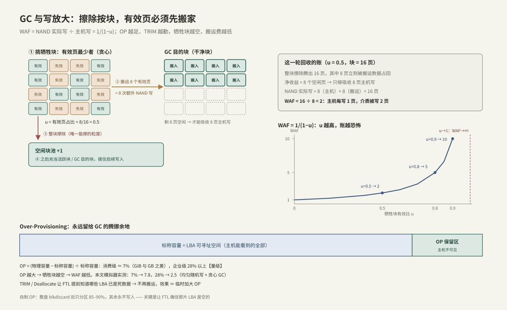

---
tags:
  - 高性能存储
  - NVMe与SSD
---
# GC 写放大与 Over-Provisioning

> [[3.4 SSD FTL 与地址映射]] 里主机每次覆盖写都欠下一个失效页，本篇讲清算：GC（Garbage Collection，垃圾回收）像一个**压缩式内存回收器**——把活数据搬走、整块擦除。搬运产生的额外介质写就是**写放大**（WAF），给回收器预留的腾挪空间就是 **OP（Over-Provisioning，预留空间）**。写路径上突然出现的 p99 毛刺，本质与 GC 语言里的 STW 停顿是同一类现象。

前置：[[3.4 SSD FTL 与地址映射]]（失效页从哪来、为什么擦除只能整块）。

---

## 1. 为什么必须 GC，以及它怎么干活

异地更新只追加、不清理，空闲块总会耗尽。而失效页散在各个块里，**擦除的最小单位是整块**【事实】——所以回收一个块之前，必须先把里面还有效的页搬到别处。



对照上图，一轮 GC 四步：

1. **①** 挑**牺牲块（victim）**：贪心策略选有效页最少的块（搬运费最低）；
2. **②** 把有效页搬到干净块——每一页搬运都是**主机看不见的 NAND 写**；
3. **③** 整块擦除（毫秒级【量级】，且消耗一次 P/E 寿命）；
4. **④** 擦好的块回到空闲池，继续接住主机写。

与内存 GC 的对应关系：牺牲块 ≈ 待压缩的 region，有效页搬运 ≈ 对象复制，失效页 ≈ 垃圾对象，空闲块池 ≈ 分配器的 free list。区别在于代价单位：内存 GC 花 CPU，闪存 GC 花的是**介质带宽和寿命**。

---

## 2. 写放大：一笔逐页的账

**WAF（Write Amplification Factor，写放大系数）**的定义与推导【事实】：

$$
\mathrm{WAF} = \frac{W_{\text{nand}}}{W_{\text{host}}} = \frac{1}{1-u}
$$

其中 u 是牺牲块的有效页占比。推导只需一轮 GC 的账：回收一个 P 页的块，先搬运 u×P 页（额外 NAND 写），净腾出 (1−u)×P 个空闲页，只够吸收同样多的主机写；这期间 NAND 总共被写了 P 页，两者一除就是上式。

| 牺牲块有效比 u | 0 | 0.5 | 0.8 | 0.9 | 0.95 |
| --- | --- | --- | --- | --- | --- |
| WAF | 1 | 2 | 5 | 10 | 20 |

曲线是曲棍球杆形：u 超过 0.8 后每涨一点，代价陡增。WAF 同时吃掉两样东西【事实】：

- **性能**：稳态下主机写与 GC 搬运分抢同一份 NAND 带宽，主机可见吞吐 ≈ 满带宽 ÷ WAF；
- **寿命**：SMART 里 `percentage_used` 的上涨速度 ≈ 主机写入速率 × WAF。

---

## 3. OP：给回收器留的余量

$$
\mathrm{OP} = \frac{C_{\text{phys}} - C_{\text{logical}}}{C_{\text{logical}}}
$$

物理容量永远大于标称容量【事实】。OP 区不可被 LBA 寻址，专职给 GC 当腾挪空间。量级【量级】：

- **消费级 ≈ 7%**：来历是 GiB 与 GB 之差——厂商按 10 进制标容量、按 2 进制装 NAND，2³⁰/10⁹ ≈ 1.074；
- **企业写密集型 28% 以上**：比如 512 GiB 物理只标 400 GB。

OP 为什么能压低 WAF：逻辑空间越小于物理空间，每个块在被选为牺牲块之前有越多时间自然积累失效页，u 越低。这和"线程池留 20% 余量避免排队爆炸"是同一类容量规划直觉——**余量买的是最坏情况下的行为，不是平均吞吐**。

【取舍】OP 是拿容量换稳态性能与寿命：同一颗料，多留 OP = 少卖容量。DWPD（Drive Writes Per Day）高的"企业盘"很多时候就是同硬件 + 更大 OP + 固件调优。

---

## 4. 动手实验：用 120 行 C++ 量出 OP → WAF 曲线

不用拆盘，页级 FTL + 贪心 GC 的模拟器就能复现规律（Modern C++，可直接编译）：

```cpp
// ftl_sim.cpp —— 页级 FTL + 贪心 GC 的写放大模拟器
// 编译: g++ -std=c++20 -O2 ftl_sim.cpp -o ftl_sim && ./ftl_sim
#include <algorithm>
#include <cassert>
#include <cstdint>
#include <iostream>
#include <random>
#include <vector>

namespace {

constexpr uint64_t kNoPpn = ~0ull;          // L2P: 逻辑页未映射
enum class PageState : uint8_t { Free, Valid, Invalid };
enum class BlockState : uint8_t { Free, Active, Full };

struct Config {
    uint32_t pages_per_block = 256;
    uint32_t blocks = 2048;                 // 物理块数
    double op = 0.07;                       // OP = (物理-逻辑)/逻辑
};

class FtlSim {
public:
    explicit FtlSim(const Config& cfg)
        : cfg_(cfg),
          page_lpn_(uint64_t{cfg.blocks} * cfg.pages_per_block, 0),
          page_state_(page_lpn_.size(), PageState::Free),
          block_state_(cfg.blocks, BlockState::Free),
          valid_cnt_(cfg.blocks, 0) {
        logical_pages_ = static_cast<uint64_t>(page_lpn_.size() / (1.0 + cfg.op));
        l2p_.assign(logical_pages_, kNoPpn);
        for (uint32_t b = 0; b < cfg_.blocks; ++b) free_.push_back(b);
        active_ = take_free_block();
    }

    void host_write(uint64_t lpn) {
        place(lpn, /*host=*/true);
        if (free_.size() < kGcWatermark) gc();
    }

    void reset_counters() { host_writes_ = nand_writes_ = 0; }
    double waf() const { return double(nand_writes_) / double(host_writes_); }
    uint64_t logical_pages() const { return logical_pages_; }

private:
    static constexpr size_t kGcWatermark = 4;

    uint32_t take_free_block() {
        assert(!free_.empty() && "自由块耗尽: 提高 OP 或 GC 水位");
        uint32_t b = free_.back();
        free_.pop_back();
        block_state_[b] = BlockState::Active;
        return b;
    }

    // 异地更新: 永远写活跃块的下一空闲页, 旧物理页只标失效
    void place(uint64_t lpn, bool host) {
        if (host) ++host_writes_;
        ++nand_writes_;
        if (uint64_t old = l2p_[lpn]; old != kNoPpn) {   // 覆盖写: 旧页失效
            page_state_[old] = PageState::Invalid;
            --valid_cnt_[old / cfg_.pages_per_block];
        }
        if (next_page_ == cfg_.pages_per_block) {        // 活跃块写满
            block_state_[active_] = BlockState::Full;
            active_ = take_free_block();
            next_page_ = 0;
        }
        uint64_t ppn = uint64_t{active_} * cfg_.pages_per_block + next_page_++;
        page_lpn_[ppn] = lpn;
        page_state_[ppn] = PageState::Valid;
        l2p_[lpn] = ppn;
        ++valid_cnt_[active_];
    }

    // 贪心 GC: 挑有效页最少的整块, 搬走有效页, 整块擦除
    void gc() {
        while (free_.size() < kGcWatermark) {
            uint32_t victim = pick_victim();
            uint64_t base = uint64_t{victim} * cfg_.pages_per_block;
            for (uint32_t i = 0; i < cfg_.pages_per_block; ++i)
                if (page_state_[base + i] == PageState::Valid)
                    place(page_lpn_[base + i], /*host=*/false);  // 搬运 = 纯 NAND 写
            std::fill_n(page_state_.begin() + base, cfg_.pages_per_block,
                        PageState::Free);                        // 整块擦除
            valid_cnt_[victim] = 0;
            block_state_[victim] = BlockState::Free;
            free_.push_back(victim);
        }
    }

    uint32_t pick_victim() const {
        uint32_t best = 0;
        uint32_t best_valid = cfg_.pages_per_block + 1;
        for (uint32_t b = 0; b < cfg_.blocks; ++b)
            if (block_state_[b] == BlockState::Full && valid_cnt_[b] < best_valid) {
                best = b;
                best_valid = valid_cnt_[b];
            }
        assert(best_valid <= cfg_.pages_per_block);
        return best;
    }

    Config cfg_;
    std::vector<uint64_t> page_lpn_;        // 物理页 -> 逻辑页号
    std::vector<PageState> page_state_;
    std::vector<BlockState> block_state_;
    std::vector<uint32_t> valid_cnt_;       // 每块有效页数
    std::vector<uint64_t> l2p_;             // 逻辑页 -> 物理页 (页级映射)
    std::vector<uint32_t> free_;
    uint32_t active_ = 0;
    uint32_t next_page_ = 0;
    uint64_t logical_pages_ = 0;
    uint64_t host_writes_ = 0;
    uint64_t nand_writes_ = 0;
};

}  // namespace

int main() {
    std::cout << "  OP    逻辑页数      稳态 WAF (4K 均匀随机覆盖写)\n";
    for (double op : {0.07, 0.15, 0.28, 0.50}) {
        FtlSim sim({.op = op});
        const uint64_t n = sim.logical_pages();
        std::mt19937_64 rng{42};
        std::uniform_int_distribution<uint64_t> dist(0, n - 1);
        for (uint64_t i = 0; i < n; ++i) sim.host_write(i);       // 顺序填满(模拟盘用旧)
        for (uint64_t i = 0; i < 2 * n; ++i) sim.host_write(dist(rng));  // 预热到稳态
        sim.reset_counters();
        for (uint64_t i = 0; i < 4 * n; ++i) sim.host_write(dist(rng));  // 稳态测量
        std::cout << "  " << op << "   " << n << "     " << sim.waf() << '\n';
    }
}
```

一次实际运行的输出（2048 块 × 256 页，均匀随机覆盖写，耗时约 0.4 s）：

| OP | 稳态 WAF |
| --- | --- |
| 7% | 7.8 |
| 15% | 4.0 |
| 28% | 2.5 |
| 50% | 1.7 |

**读法**：这解释了为什么同一颗主控，7% OP 的消费盘稳态随机写只有企业盘的三分之一。注意结论的边界【前提】：均匀随机是**最坏负载**；真实负载有热点与顺序成分，WAF 更低。模拟器只建模了贪心 GC，真实固件还有冷热分离、磨损均衡等策略——数字用于理解趋势，不用于预测具体盘。

---

## 5. 主机能做的三件事

**（1）勤 TRIM**：已删除的数据在 FTL 眼里还是"有效页"，会被反复搬运。TRIM/Deallocate 把死数据提前告诉 FTL，等效于临时加大 OP【事实】。OS 链路与排查命令见 [[3.4 SSD FTL 与地址映射]] 第 6.2 节。

**（2）顺序化/大块写**：顺序大块写让整块数据"同生共死"——一起写入、一起失效，牺牲块 u≈0，WAF≈1。这正是 WAL、LSM、Kafka 这类追加写系统对 SSD 友好的原因。注意两层放大相乘【事实】：LSM 自身的 compaction 写放大（[[6.6 LSM-tree 三种放大]]）与设备 WAF 是乘法关系，端到端放大 = 引擎放大 × 设备放大（[[6.7 Compaction 策略]]）。

**（3）自制 OP**：整盘 `blkdiscard` 后只分区 85–90%，其余空间永不写入。前提是先 discard——FTL 必须确信那片 LBA 是空的，否则残留映射仍占物理页【陷阱】。

---

## 6. 观测：SMART 指标与 WAF 估算

```bash
sudo nvme smart-log /dev/nvme0
```

| 字段 | 含义 | 读法与陷阱 |
| --- | --- | --- |
| `data_units_written` | 主机写入量，单位 = 512,000 字节 | **只有主机写**，不含 GC 搬运【事实】 |
| `percentage_used` | 寿命消耗估计（可超 100%） | 上涨斜率 ∝ 主机写速率 × WAF |
| `available_spare` | 备用块余量百分比 | 跌破阈值 = 坏块耗尽预警 |
| `media_errors` | 介质不可恢复错误数 | 非零且增长 → 换盘 |

**WAF 怎么测**【事实】：标准 SMART 只报主机写；NAND 侧写入量要靠厂商扩展或 OCP 云盘规范的遥测：

```bash
sudo nvme ocp smart-add-log /dev/nvme0    # OCP 盘: Physical media units written
# WAF ≈ Δ(Physical media units written) / Δ(主机写入量), 取两次采样差值
# 主机侧写入量也可从块层核对(扇区数×512):
awk '$3=="nvme0n1" {print $10*512/2^30 " GiB written"}' /proc/diskstats
```

没有厂商遥测时退而求其次：固定负载长跑，用 `percentage_used` 的上涨斜率反推相对 WAF——只能比较趋势，不能得绝对值【前提】。

---

## 7. 常见误读

> [!warning] 五个高频误读
> 1. **"TRIM 之后盘立刻变快/数据立刻被擦"**——TRIM 只清映射；擦除与性能恢复要等 GC 消化，可能是分钟到小时级【实现】。
> 2. **"DWPD 高说明介质更耐写"**——常常只是 OP 更大 + 固件按稳态负载调优；看拆解或物理容量才知道。
> 3. **"留个空分区就是 OP"**——FTL 不看分区表。没被 discard 过、或曾写过又未 TRIM 的区域，FTL 都当有效数据【陷阱】。
> 4. **"SLC 缓存就是 OP"**——SLC 缓存解决**突发写**的速度（[[3.6 空盘与稳态性能]]），OP 解决**稳态**的 GC 效率，是两个机制。
> 5. **"WAF 是盘的常数"**——WAF 是负载的函数：顺序写 ≈1，均匀随机最坏，热点负载居中。脱离负载谈 WAF 没有意义。

---

## 8. 故障定位

**症状：持续写入时 IOPS 周期性断崖、p99 延迟毛刺。**

```bash
# ⚠️ 覆写盘上数据, 只在测试盘上跑
sudo fio --name=gc-probe --filename=/dev/nvme0n1 --direct=1 --rw=randwrite \
         --bs=4k --iodepth=32 --time_based --runtime=600 \
         --log_avg_msec=1000 --write_iops_log=gc --write_lat_log=gc
```

`gc_iops.1.log` 呈锯齿（写一段、掉一段）→ 前台写在等 GC 腾块，典型 GC 干扰；配合 `gc_clat.1.log` 看毛刺是否与 IOPS 低谷对齐（分析方法见 [[9.5 p99 毛刺定位]]）。缓解顺序：确认 TRIM 生效 → 降低写入压力或加大自制 OP → 换高 OP 盘。

**症状：`fstrim` 好像没用。** 依次查：`lsblk --discard` 输出全 0（设备/虚拟化层不支持）→ `findmnt` 看文件系统与挂载选项 → `systemctl status fstrim.timer` → 手动 `sudo fstrim -v /` 看返回字节数；返回 0 且盘很满时，说明文件系统层没有可释放的 extent，问题在上层。

---

## 9. 关键结论

| 结论 | 性质 |
| --- | --- |
| 擦除按块、写按页的不对称 ⇒ GC 必须搬运有效页 ⇒ 写放大必然存在 | 事实 |
| WAF = 1/(1−u)：牺牲块越满，搬运费越高，曲线是曲棍球杆形 | 事实（简化模型） |
| 稳态主机吞吐 ≈ NAND 满带宽 ÷ WAF；寿命消耗速率 ∝ WAF | 事实 |
| OP 用容量换稳态性能与寿命；消费级 ~7%，企业级 28%+ | 量级/取舍 |
| 模拟实测：OP 7%→WAF 7.8，28%→2.5（均匀随机最坏负载） | 量级（本文实验） |
| TRIM、顺序化、冷热分离是主机侧压 WAF 的三个杠杆 | 实践结论 |
| 标准 SMART 只报主机写，测 WAF 需要 OCP/厂商遥测 | 事实 |

---

## 关联知识

- [[3.4 SSD FTL 与地址映射]] - 失效页的来源与映射机制
- [[3.6 空盘与稳态性能]] - GC 如何决定"越用越慢"的测试曲线
- [[6.6 LSM-tree 三种放大]] - 引擎层写放大：与设备 WAF 相乘
- [[6.7 Compaction 策略]] - 软件层的"GC 策略"同构问题
- [[9.5 p99 毛刺定位]] - GC 毛刺的系统化定位方法
- [[9.1 fio Benchmark Matrix]] - 本篇实验所用工具的完整用法
