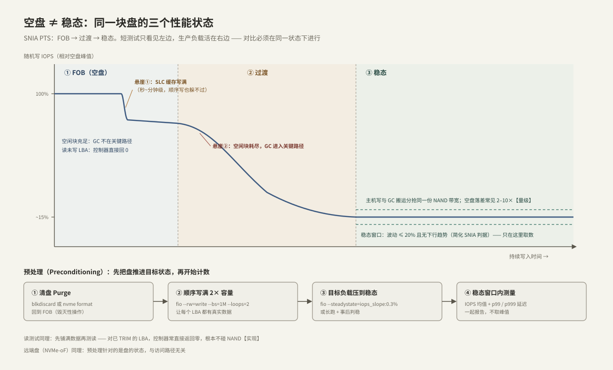

---
tags:
  - 高性能存储/NVMe与SSD
---
# 空盘与稳态性能

> 同一块盘，刚清空时和持续写入两小时后，随机写 IOPS 能差 2–10 倍【量级】——不是盘坏了，而是你在测**两台不同状态的机器**。这和"线程池在队列灌满前后判若两物"、"JIT 预热前后的基准不可比"是同一课：**先定义系统状态，再谈性能数字**。本篇给出状态模型、可复现的预处理方法，以及把"进入稳态"自动判出来的工具。

前置：[[3.5 GC 写放大与 Over-Provisioning]]（稳态为什么慢）、[[9.1 fio Benchmark Matrix]]（测量工具）。

---

## 1. 三个状态：FOB → 过渡 → 稳态

SNIA SSS PTS（Performance Test Specification）把盘的性能生命周期分为三段【事实】：



- **FOB（Fresh Out of Box，出厂态/清空态）**：空闲块充足，GC 完全不在写路径上，主机独享 NAND 带宽；
- **过渡（transition）**：空闲块逐渐耗尽，GC 开始与主机写抢带宽，性能持续下滑；
- **稳态（steady state）**：GC 回收速率与主机消耗速率平衡，性能落在一条低而平的线上。生产环境的盘几乎永远活在这里【事实】。

空盘还有一个容易忽略的加成【实现】：**读一个从未写过（或已 TRIM）的 LBA，控制器直接返回全零，根本不碰 NAND**——和读一段没碰过的匿名 `mmap` 会拿到内核零页、不产生缺页 IO 是同一个形状。所以空盘上的"读性能"测的是控制器查表回零的快路径，不是介质。

---

## 2. 两个悬崖，别混为一谈

持续写入时常能看到两次性能跌落，机制完全不同【实现】：

| | 悬崖①：SLC 缓存写满 | 悬崖②：进入 GC 稳态 |
| --- | --- | --- |
| 机制 | 消费盘把部分 TLC/QLC 当 SLC 用作写缓存，缓存满后直写慢介质并回迁 | 空闲块耗尽，GC 搬运抢占 NAND 带宽 |
| 触发 | 连续写入量超过缓存容量（几十~几百 GB【量级】） | 累计写入 + 覆盖使失效页铺满全盘 |
| 时间尺度 | 秒~分钟级，**顺序写也躲不过** | 十分钟~小时级，随机写最显著 |
| 恢复 | 空闲一会儿，缓存迁移完即恢复 | TRIM/清盘之前不会恢复 |
| 主要受害者 | 消费级 TLC/QLC | 所有盘，低 OP 盘最惨 |

企业盘通常不做动态 SLC 缓存（要的是可预期的稳态），所以标称值低但曲线平【取舍】。

---

## 3. 预处理与稳态判据

要拿到能横向比较的数字，SNIA 的流程简化后是四步（对应图中流水线）：

1. **清盘（purge）**：`blkdiscard` 或 `nvme format`，让 FTL 回到 FOB——两块盘对比时的共同起点；
2. **顺序填满 2× 容量**：让每个 LBA 都携带真实数据，消除"读零"快路径，也让 FTL 进入"满盘"的映射状态;
3. **用目标负载压到稳态**：比如 4K 随机写；
4. **只在稳态窗口内取数**：IOPS 均值和 p99/p999 延迟一起报。

**稳态判据（简化版 SNIA）**【前提】：连续观察窗口（如 5 分钟）内，(最大 − 最小)/均值 ≤ 20%，且线性拟合无明显下行趋势。fio 内置了这套判据，达标自动停：

```bash
# ⚠️ 全盘毁灭性写入, 只在测试盘/备用 namespace 上执行
DEV=/dev/nvme0n1
sudo blkdiscard $DEV                                      # ① 清盘
sudo fio --name=fill --filename=$DEV --direct=1 --rw=write \
         --bs=1M --iodepth=32 --loops=2                   # ② 顺序填 2 遍
sudo fio --name=ss --filename=$DEV --direct=1 --rw=randwrite --bs=4k \
         --iodepth=32 --time_based --runtime=7200 \
         --steadystate=iops_slope:0.3% --steadystate_duration=1800  # ③④ 判稳即停
```

---

## 4. 可复现实验：一条曲线看全三个状态

```bash
# ⚠️ 毁灭性; 约需 1 小时与一块可清空的测试盘
DEV=/dev/nvme0n1
sudo blkdiscard $DEV                                      # 回到 FOB
sudo fio --name=curve --filename=$DEV --direct=1 --rw=randwrite --bs=4k \
         --iodepth=32 --ioengine=io_uring --time_based --runtime=3600 \
         --log_avg_msec=1000 --write_iops_log=curve --lat_percentiles=1
# 产物 curve_iops.1.log: 每秒一行 "time_ms, iops, ..."
```

**指标含义**：日志前段的高原是 FOB（若为消费盘，几十秒内还会先看到 SLC 悬崖），中段下坡是过渡，尾段平线是稳态。`--lat_percentiles=1` 让最终报告带上 p99/p999——稳态的毛刺（GC 停顿）只有分位数才照得见，均值会把它抹平【事实】。

从空盘"读零"到真实读的对照（30 秒即可复现）：

```bash
sudo blkdiscard $DEV
sudo fio --name=zread --filename=$DEV --direct=1 --rw=randread --bs=4k \
         --iodepth=32 --runtime=30 --time_based       # 读已 TRIM 的 LBA
# 顺序写满后再跑一次同样的命令: 延迟/IOPS 差异即"回零快路径"的水分
```

---

## 5. C++ 工具：自动判定稳态进入点

手动盯曲线不可靠，把判据写成程序（Modern C++，可直接编译）：

```cpp
// steady_detect.cpp —— 从 fio 的 IOPS 日志找稳态进入点
// fio 日志每行: time_ms, iops, ddir, bs, offset (--log_avg_msec=1000 时每秒一行)
// 编译: g++ -std=c++20 -O2 steady_detect.cpp -o steady_detect
// 用法: ./steady_detect ss_iops.1.log [窗口秒=300] [容差=0.20]
#include <algorithm>
#include <charconv>
#include <cmath>
#include <fstream>
#include <iostream>
#include <numeric>
#include <span>
#include <string>
#include <string_view>
#include <vector>

namespace {

struct Sample {
    double sec;
    double iops;
};

std::vector<Sample> load_fio_log(const std::string& path) {
    std::ifstream in{path};
    if (!in) throw std::runtime_error("打不开日志: " + path);
    std::vector<Sample> out;
    for (std::string line; std::getline(in, line);) {
        std::string_view sv{line};
        auto comma1 = sv.find(',');
        auto comma2 = sv.find(',', comma1 + 1);
        if (comma1 == sv.npos || comma2 == sv.npos) continue;
        double ms = 0, iops = 0;
        std::from_chars(sv.data(), sv.data() + comma1, ms);
        auto v = sv.substr(comma1 + 1, comma2 - comma1 - 1);
        while (!v.empty() && v.front() == ' ') v.remove_prefix(1);
        std::from_chars(v.data(), v.data() + v.size(), iops);
        out.push_back({ms / 1000.0, iops});
    }
    return out;
}

// 稳态判据(简化版 SNIA PTS): 窗口内 (max-min)/mean <= tol 且线性趋势
// 在整个窗口上的漂移 |slope|*W/mean <= tol/2 —— 排除"波动小但仍在下坡"
bool is_steady(std::span<const Sample> w, double tol) {
    const double mean =
        std::accumulate(w.begin(), w.end(), 0.0,
                        [](double s, const Sample& x) { return s + x.iops; }) /
        double(w.size());
    auto [mn, mx] = std::minmax_element(
        w.begin(), w.end(),
        [](const Sample& a, const Sample& b) { return a.iops < b.iops; });
    if ((mx->iops - mn->iops) / mean > tol) return false;
    double sxx = 0, sxy = 0;                     // 最小二乘斜率
    const double t0 = w.front().sec, tm = (w.back().sec - t0) / 2;
    for (const auto& s : w) {
        const double dt = (s.sec - t0) - tm;
        sxx += dt * dt;
        sxy += dt * (s.iops - mean);
    }
    const double drift = std::abs(sxy / sxx) * (w.back().sec - t0) / mean;
    return drift <= tol / 2;
}

}  // namespace

int main(int argc, char** argv) {
    if (argc < 2) {
        std::cerr << "用法: steady_detect <fio_iops_log> [窗口秒] [容差]\n";
        return 1;
    }
    const auto samples = load_fio_log(argv[1]);
    const size_t window = argc > 2 ? std::stoul(argv[2]) : 300;
    const double tol = argc > 3 ? std::stod(argv[3]) : 0.20;
    if (samples.size() < window) {
        std::cerr << "样本不足 " << window << " 个, 先把 runtime 拉长\n";
        return 1;
    }
    const double burst =
        std::accumulate(samples.begin(), samples.begin() + 60, 0.0,
                        [](double s, const Sample& x) { return s + x.iops; }) /
        60.0;
    for (size_t i = 0; i + window <= samples.size(); ++i) {
        std::span w{samples.data() + i, window};
        if (!is_steady(w, tol)) continue;
        const double ss =
            std::accumulate(w.begin(), w.end(), 0.0,
                            [](double s, const Sample& x) { return s + x.iops; }) /
            double(window);
        std::cout << "进入稳态:  t=" << w.front().sec << " s\n"
                  << "稳态 IOPS: " << ss << " (窗口 " << window << " s, 容差 "
                  << tol * 100 << "%)\n"
                  << "前 60 s 均值: " << burst << "  → 空盘虚高 "
                  << burst / ss << " 倍\n";
        return 0;
    }
    std::cout << "整个日志内未达到稳态判据 —— 继续跑, 或放宽容差\n";
    return 2;
}
```

对一条合成的三段式日志（FOB 约 21 万 IOPS，指数衰减到稳态约 4.6 万）的实际运行输出：

```text
进入稳态:  t=492 s
稳态 IOPS: 48079.8 (窗口 300 s, 容差 20%)
前 60 s 均值: 208908  → 空盘虚高 4.34503 倍
```

**读法**：报告"这块盘 4K 随机写 4.8 万 IOPS（稳态，30 分钟窗口）"，比报"21 万"诚实得多——后者只是前 60 秒的空盘烟花。

---

## 6. 常见误读

> [!warning] 五个高频误读
> 1. **"实测比官方标称低一半，盘有问题"**——消费盘的标称通常是 FOB + SLC 缓存内的突发值【实现】；先确认你测的和它标的是不是同一个状态。
> 2. **"CrystalDiskMark/短跑分数就是盘的性能"**——1 GiB × 几秒的测试大概率整个落在 SLC 缓存 + 空盘区间，离生产负载最远。
> 3. **"空盘读测试很快 = 读性能好"**——已 TRIM 的 LBA 直接回零不碰 NAND；先铺满数据再测读。
> 4. **"跑分前 TRIM 一下更准"**——恰恰相反，这会把盘推回 FOB，制造不可比的高分；对比测试要么都清盘重预处理，要么都在稳态。
> 5. **"远端盘（NVMe-oF）不用管这些"**——预处理针对的是盘的介质状态，与访问路径无关；网络只是在延迟上再叠一层（第 5 章）。

---

## 7. 故障定位："盘怎么变慢了"

按开销从小到大排查：

1. **状态变了？** 最常见。盘更满、TRIM 长期没跑、或上次测试后没重新预处理。查：`sudo fstrim -av` 的返回量、文件系统占用率、距离上次清盘后的累计写入（`nvme smart-log` 的 `data_units_written` 差值）；
2. **温度节流？** 持续高负载下控制器过热会主动降速【实现】：
   ```bash
   sudo nvme smart-log /dev/nvme0 | grep -Ei 'temperature|warning_temp_time|critical_comp_time'
   # warning_temp_time / critical_comp_time 增长 = 发生过节流; 测试时并行 watch 温度
   ```
3. **磨损？** `percentage_used` 接近 100%、`available_spare` 逼近阈值 → 盘接近寿命末期，GC 可用好块变少；
4. **主机侧变量**：队列深度、调度器、对齐、CPU 绑核是否与上次一致（[[1.7 块层与 blk-mq]]、[[9.2 iostat 指标解读]]）。用 [[9.1 fio Benchmark Matrix]] 的固定矩阵重跑，排除测法漂移。

定位原则：**先复现状态，再比较数字**——任何没有注明盘状态的性能结论都不可复核【事实】。

---

## 8. 关键结论

| 结论 | 性质 |
| --- | --- |
| 盘有三个性能状态：FOB → 过渡 → 稳态；生产负载活在稳态 | 事实 |
| 空盘快的两个来源：GC 不在写路径 + 未写 LBA 读直接回零 | 事实/实现 |
| SLC 缓存悬崖（秒级、顺序写也有）与 GC 稳态悬崖（长期、随机写）是两个机制 | 实现 |
| 稳态与空盘差 2–10 倍是常态，不是故障 | 量级 |
| 预处理四步：清盘 → 顺序填 2× → 目标负载压稳 → 稳态窗口取数 | 实践结论 |
| 稳态判据：窗口内波动 ≤20% 且无下行趋势；fio --steadystate 可自动判 | 实践结论 |
| 性能结论必须注明盘状态，否则不可比、不可复核 | 实践结论 |

---

## 关联知识

- [[3.5 GC 写放大与 Over-Provisioning]] - 稳态变慢的机制根源
- [[3.4 SSD FTL 与地址映射]] - TRIM 与映射状态如何影响"读零"路径
- [[9.1 fio Benchmark Matrix]] - 标准化测试矩阵，避免测法漂移
- [[9.5 p99 毛刺定位]] - 稳态窗口内 GC 毛刺的定位
- [[9.2 iostat 指标解读]] - 排查主机侧变量时的指标读法
- [[1.3 Buffered IO 与 O_DIRECT]] - 为什么本篇实验全部用 O_DIRECT 裸盘
