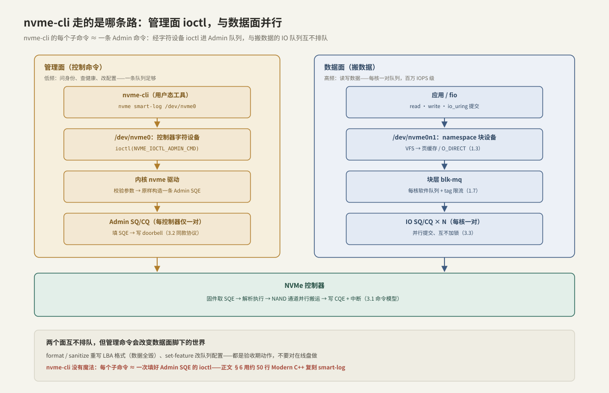

---
tags:
  - 高性能存储
  - NVMe与SSD
---
# nvme-cli 实操

> 前六篇把 NVMe 的命令模型、队列、FTL、GC 讲成了纸面知识，这一篇把它们变成可以敲的命令。载体是一个贯穿 3.7 → [[3.8 PCIe 拓扑与 NUMA]] → [[4.1 RDMA 为什么快]] 的真实案例：**一台为 GPU 训练集群供数的存储节点**，16 块盘要在上线前逐一验收、上线后持续监控。验收单上每一栏对应一条 nvme-cli 命令，每一栏背后都是一种"不查就会变成线上 p99 事故"的隐患。

前置：[[3.1 NVMe 命令模型]]（Admin 命令与 IO 命令的分工）、[[3.3 Admin Queue 与 IO Queue]]（两类队列各走哪条路）。

---

## 1. 贯穿案例：为 GPU 训练集群供数的存储节点

后面三篇共用同一台机器，配置对齐 DeepSeek 3FS 公开的存储节点规格【实例】（[[7.4 3FS 架构]]）：

| 部件 | 配置 | 能力【量级】 |
| --- | --- | --- |
| CPU | 双路服务器 CPU | 每路几十核；内存 8 通道，200+ GB/s |
| 盘 | 16 × NVMe Gen4 ×4 | 每盘顺序读 ~7 GB/s，合计 ~112 GB/s |
| 网络 | 2 × 200 Gbps RDMA 网卡 | 出口合计 50 GB/s |
| 负载 | 训练数据随机读 + checkpoint 顺序写 | 读为主，checkpoint 期有写洪峰 |

设计目标只有两条，也是全案例的两根主线：

1. **吞吐**：把 50 GB/s 的网络出口尽量打满——3FS 公开数据是 180 个存储节点合计读 6.6 TiB/s，折合每节点 ~38 GiB/s，出口利用率约八成【实例】；
2. **尾延迟**：排在 GPU 关键路径上的同步读（KV Cache 换入、prefetch 没盖住的样本读），p99 每多 1 ms，GPU 就白等 1 ms——按整机租金折算比存储节点本身贵得多。

三篇分工：**3.7 守设备地板**（单盘的真实能力与健康）、**3.8 守整机摆放**（带宽预算与 NUMA）、**4.1 守出网的账**（CPU 与内存带宽）。地板不平上面全歪：后面会反复看到，一块有暗伤的盘就足以抬高全节点的 p99（木桶效应）。

---

## 2. nvme-cli 走的是哪条路

先分清两个设备文件【事实】：

```bash
ls -l /dev/nvme0 /dev/nvme0n1
# crw-------  /dev/nvme0     字符设备 = 控制器，Admin 命令入口
# brw-rw----  /dev/nvme0n1   块设备   = 第 1 个 namespace，数据 IO 入口
```

nvme-cli 的每个子命令，本质是**填好一条 Admin 命令，通过 `ioctl(NVME_IOCTL_ADMIN_CMD)` 交给内核 nvme 驱动，驱动校验后原样投递进 Admin 队列**【事实】。它与数据面是两条并行的路：



三个直接推论：

1. 需要 root——ioctl 直通设备，内核只做基本校验；
2. **查询类命令不打扰在线 IO**【事实】：smart-log、id-ctrl 走 Admin 队列（每控制器仅一对，低频专用），与每核一对的 IO 队列互不排队——所以生产环境可以放心周期性采集；
3. 但 **format / sanitize / reset 会改变数据面脚下的世界**（LBA 格式、队列配置、盘上数据），属于验收期动作，不要对在线盘做。

---

## 3. 验收第一步：身份与 LBA 格式

### 3.1 盘点与一致性

```bash
nvme list                                        # 所有盘一览：型号、容量、格式、固件
nvme id-ctrl /dev/nvme0 | grep -E '^mn|^fr|^mdts|^nn'
```

- `mn` / `fr`：型号与固件版本。**16 块盘应完全一致**【实践】——不同固件的性能特征（缓存策略、GC 时机）不同，混固件等于给节点预装了一个长尾来源；
- `mdts`：单条命令最大传输尺寸，单位是 2^mdts × 控制器最小页（通常 4 KiB）【事实】。`mdts=5` → 128 KiB，超过的 IO 会被驱动拆成多条命令；
- `nn`：namespace 数量，本案例每盘 1 个。

### 3.2 LBA 格式：512e 还是 4Kn

```bash
nvme id-ns /dev/nvme0n1 -H | grep 'LBA Format'
# LBA Format 0 : Data Size: 512 bytes  - Relative Performance: 0x2 Better (in use)
# LBA Format 1 : Data Size: 4096 bytes - Relative Performance: 0 Best
```

【事实】NAND 页本身 ≥ 4 KiB，FTL 映射粒度通常也是 4 KiB（[[3.4 SSD FTL 与地址映射]]）；512 字节扇区是为兼容老软件保留的模拟（512e）。厂商自己在 Relative Performance 字段里承认 4096 是 Best。

【实现】512e 允许应用发 512 对齐的 O_DIRECT 小写，落到 4 KiB 映射粒度上就变成设备内部的读改写——随机小写放大的来源之一；4Kn 直接把小于 4 KiB 的错位挡在接口层。切换属于验收期动作，**数据全毁**：

```bash
nvme format /dev/nvme0n1 --lbaf=1        # 切到 4096；对在用盘执行等于清盘
```

对案例的意义：16 块盘统一 4Kn 后，O_DIRECT 的对齐要求（[[1.3 Buffered IO 与 O_DIRECT]]）与 FTL 粒度对齐，少一层静默的放大。

---

## 4. 队列资源：数据面的并行度

```bash
nvme get-feature /dev/nvme0 -f 0x07 -H
# get-feature:0x07 (Number of Queues), Current value:0x7e007e
#     Number of IO Completion Queues Allocated (NCQA): 127
#     Number of IO Submission Queues Allocated (NSQA): 127
```

这是控制器同意分配的 IO 队列数（值 0 基数：0x7e = 126 表示 127 条）。内核 nvme 驱动默认按 CPU 数申请队列、每核一对，与 blk-mq 硬件队列 1:1 映射（[[1.7 块层与 blk-mq]]）【实现】。验证实际建了多少：

```bash
ls /sys/block/nvme0n1/mq/ | wc -l        # blk-mq 硬件队列数
grep -c 'nvme0q' /proc/interrupts        # 每队列一个中断向量（含 Admin 队列）
```

因果关系【实现】：队列数 < 核数时多核共享队列，1.7 讲过的提交侧锁争用会小规模重演。盘与盘的队列上限差异很大【量级】，验收时确认两点即可：16 块盘的值一致；不显著小于要跑 IO 的核数。

---

## 5. 健康基线与在线监控：smart-log

```bash
nvme smart-log /dev/nvme0
```

关键字段与它们在案例里的角色：

| 字段 | 含义 | 对存储节点的意义 |
| --- | --- | --- |
| `critical_warning` | 位图：备用块低 / 温度越限 / 介质降级 / 进只读 | 任何位非零 → 触发摘盘流程 |
| `temperature` | 复合温度（协议按 Kelvin 存，nvme-cli 已转 °C） | 过热触发节流，见下方因果链 |
| `available_spare` / 阈值 | 备用块余量百分比 | 跌向阈值的斜率 = 换盘倒计时 |
| `percentage_used` | 按厂商额定写入量折算的寿命消耗，可超 100 | checkpoint 写洪峰负载要盯它的增速 |
| `data_units_written` | 累计写入，单位 **512,000 字节**【事实】 | ÷ 应用写入量 ≈ 实测写放大（[[3.5 GC 写放大与 Over-Provisioning]]） |
| `media_errors` | 不可恢复的介质错误数 | 非零即预警，结合 `num_err_log_entries` 看趋势 |
| `unsafe_shutdowns` | 异常掉电次数 | 突增 = 供电或运维流程问题 |

**温度的因果链**（案例里最常见的"设备无辜、机房有罪"事故）：

```text
机柜风道被挡 → 盘温爬过节流阈值 → 控制器降速自保【实现】
  → 单盘吞吐掉一截 + 毫秒级延迟尖刺
  → 跨盘条带读被这块盘拖住 → 全节点 p99 上翘
  → 而 CPU、网络、其余 15 块盘的指标全部正常——只有 smart-log 的温度知道答案
```

监控要点【实践】：看斜率不看瞬时值。`percentage_used` 的增速外推出换盘日期；`data_units_written` 对比应用统计得出真实写放大；温度长期贴着阈值说明散热余量为零，任何负载尖峰都会变成延迟尖峰。

错误与固件日志各看一眼：

```bash
nvme error-log /dev/nvme0 | head         # 最近错误：出错 LBA、状态码
nvme fw-log /dev/nvme0                   # 固件槽位：升级失败时回滚的依据
```

---

## 6. Modern C++：nvme-cli 没有魔法

生产监控 agent 不会每 30 秒 fork 一个 nvme-cli，采集器直接发同一个 ioctl【实践】。写一遍就会发现：你是在手工填 [[3.1 NVMe 命令模型]] 里的 SQE 字段。

```cpp
#include <fcntl.h>
#include <linux/nvme_ioctl.h>
#include <sys/ioctl.h>
#include <unistd.h>

#include <array>
#include <cerrno>
#include <cstdint>
#include <cstring>
#include <stdexcept>
#include <string>
#include <system_error>

// RAII 持有控制器字符设备（/dev/nvme0，不是 nvme0n1——Admin 命令发给控制器）
class ControllerFd {
public:
    explicit ControllerFd(const char* path) : fd_{::open(path, O_RDONLY)} {
        if (fd_ < 0)
            throw std::system_error{errno, std::system_category(), path};
    }
    ~ControllerFd() { if (fd_ >= 0) ::close(fd_); }
    ControllerFd(const ControllerFd&) = delete;
    ControllerFd& operator=(const ControllerFd&) = delete;
    int get() const { return fd_; }
private:
    int fd_;
};

struct SmartSnapshot {
    std::uint8_t critical_warning;   // 位图，任何位非零都该告警
    int temperature_c;               // 协议里是 Kelvin，这里已换算
    std::uint8_t percentage_used;    // 寿命消耗，可超过 100
};

SmartSnapshot read_smart(const char* ctrl_path) {
    ControllerFd fd{ctrl_path};
    std::array<std::uint8_t, 512> log{};          // SMART 日志页固定 512 B

    nvme_admin_cmd cmd{};
    cmd.opcode   = 0x02;                          // Get Log Page（Admin opcode）
    cmd.nsid     = 0xFFFFFFFF;                    // 控制器全局，不针对单个 namespace
    cmd.addr     = reinterpret_cast<std::uint64_t>(log.data());
    cmd.data_len = log.size();
    // CDW10：[7:0] 日志页 ID = 0x02（SMART），[31:16] 要读的 dword 数 - 1（512 B = 128 dword）
    cmd.cdw10    = (127u << 16) | 0x02u;

    // 两类错误要分开报【事实】：ioctl 失败（errno）≠ 设备拒绝（NVMe 状态码）
    if (const int status = ::ioctl(fd.get(), NVME_IOCTL_ADMIN_CMD, &cmd); status < 0)
        throw std::system_error{errno, std::system_category(), "NVME_IOCTL_ADMIN_CMD"};
    else if (status > 0)
        throw std::runtime_error{"nvme status 0x" + std::to_string(status)};

    SmartSnapshot s{};
    s.critical_warning = log[0];                  // 字节偏移来自 NVMe 规范的日志页布局
    std::uint16_t kelvin = 0;
    std::memcpy(&kelvin, &log[1], sizeof kelvin); // 字节 1–2，小端
    s.temperature_c   = static_cast<int>(kelvin) - 273;
    s.percentage_used = log[5];
    return s;
}
```

两处与命令行版的对应：`cmd.cdw10` 就是 `nvme get-log --log-id=0x02 --log-len=512` 帮你算的字段；`status > 0` 那条分支，就是 nvme-cli 打印 `NVMe status: xxx` 的来源。

---

## 7. 上线验收单：把命令串成流程

16 块盘逐一过这张表，任何一栏不合格就不进集群【实践】：

| # | 检查项 | 命令 | 合格线 | 不查的线上症状 |
| --- | --- | --- | --- | --- |
| 1 | 身份与固件 | `nvme list` / `id-ctrl` | 16 盘同型号同固件 | 个别盘行为不同，成为固定长尾源 |
| 2 | LBA 格式 | `id-ns -H` | 全部 4096（Best） | 512e 混入 → 设备内读改写，随机写放大 |
| 3 | 队列数 | `get-feature -f 0x07` | 16 盘一致、不小于核数 | 共享队列锁争用，提交侧退化 |
| 4 | PCIe 链路 | `lspci` / sysfs（[[3.8 PCIe 拓扑与 NUMA]]） | 协商结果 = 标称 | 静默降速，单盘上限打折 → 木桶 p99 |
| 5 | 健康基线 | `smart-log` 存档 | spare 100%、used ≈ 0、无告警位 | 没有基线，之后的劣化无从对比 |
| 6 | 稳态成绩 | fio 预写两遍再测（[[3.6 空盘与稳态性能]]） | 稳态 IOPS / 延迟达标 | 拿空盘成绩定容量，上线即"掉速" |

第 4 栏是下一篇的主角：设备本身合格，插槽和拓扑还能再坑一次。

---

## 8. 陷阱与误区

> [!warning] 常见错误
> 1. **`data_units_*` 按 512 B 换算**：单位是 512,000 字节，差三个数量级。
> 2. **对在线盘发 format / sanitize**：数据全毁且不可撤销；这两条命令只属于验收期。
> 3. **自解析日志忘了 Kelvin**：裸日志页存的是开氏度，nvme-cli 帮你转了，自己写采集器要减 273。
> 4. **把 percentage_used=100 当硬上限**：它可以涨到 255；超 100 表示超出厂商额定写入量，盘未必坏，但保修与错误率承诺失效【事实】。
> 5. **拿空盘 / 刚 format 的盘测验收成绩**：SLC 缓存与空盘态给的是"开业价"（[[3.6 空盘与稳态性能]]）。
> 6. **验收通过就删记录**：健康劣化是相对量，没有 T0 基线，T1 的 smart-log 只是一堆数字。

---

## 9. 关键结论

| 结论 | 性质 |
| --- | --- |
| /dev/nvme0 = 控制器（Admin 入口），/dev/nvme0n1 = namespace（IO 入口） | 事实 |
| nvme-cli ≈ 帮你填 Admin SQE 的 ioctl 封装；查询类命令与数据面并行、不打扰在线 IO | 事实 |
| format / sanitize / set-feature 改变数据面脚下的世界，只在验收期做 | 实践结论 |
| LBA 格式选 4Kn：与 NAND 页、FTL 粒度、O_DIRECT 对齐一致，消掉一层读改写 | 取舍 |
| 队列数决定数据面并行度，应不小于核数且 16 盘一致 | 实现 |
| smart-log 看斜率不看瞬时值；温度 → 节流 → 单盘尖刺 → 全节点 p99 是最常见事故链 | 实践结论 |
| 验收单 6 栏各自对应一种线上 p99 事故；没有基线的健康数据没有意义 | 实践结论 |

---

## 关联知识

- [[3.1 NVMe 命令模型]] - Admin/IO 命令与 SQE 字段：§6 的 C++ 在手工填它
- [[3.3 Admin Queue 与 IO Queue]] - 管理面与数据面并行的队列基础
- [[3.4 SSD FTL 与地址映射]] - 4 KiB 映射粒度：LBA 格式选择的依据
- [[3.5 GC 写放大与 Over-Provisioning]] - data_units_written 推算实测写放大
- [[3.6 空盘与稳态性能]] - 验收成绩必须测稳态
- [[3.8 PCIe 拓扑与 NUMA]] - 验收单第 4 栏：设备之外的链路与摆放
- [[7.4 3FS 架构]] - 贯穿案例的原型配置
