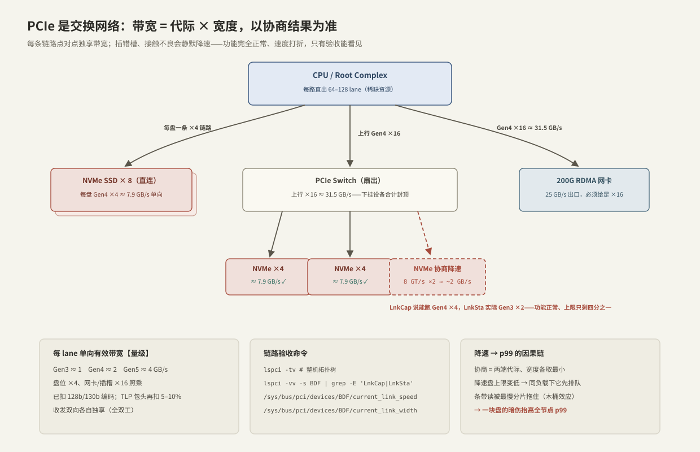
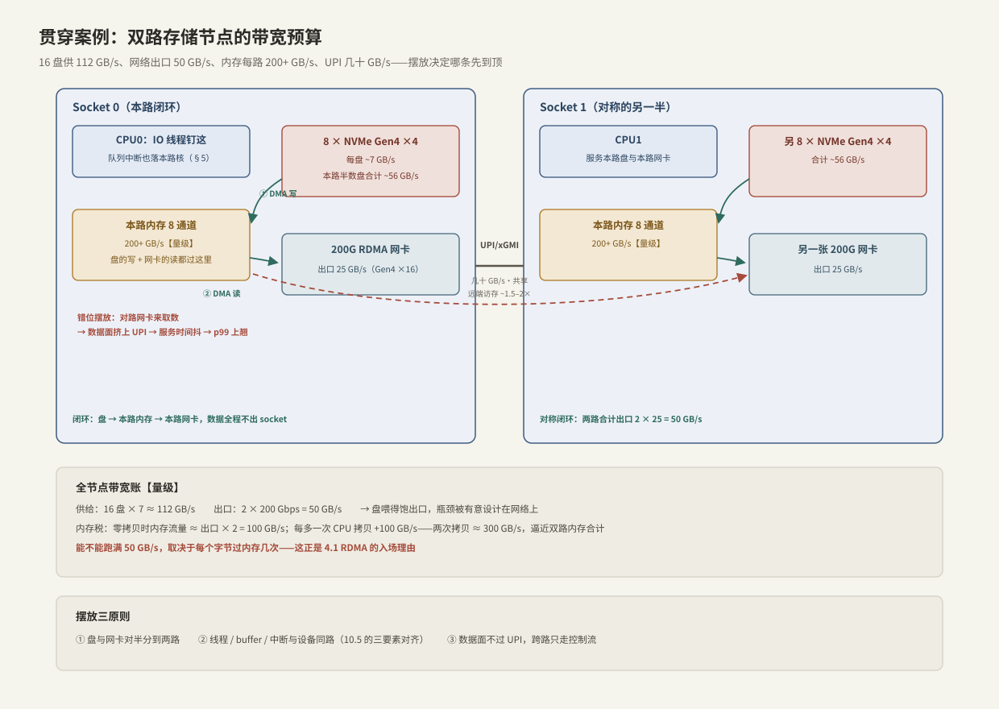

---
tags:
  - 高性能存储
  - NVMe与SSD
---
# PCIe 拓扑与 NUMA

> 单盘验收合格（[[3.7 nvme-cli 实操]]）只保证了零件；整机成不成立，取决于 16 块盘、2 张网卡、2 路 CPU 怎么摆。这一篇解决贯穿案例的第二段：**50 GB/s 的出口预算，要在 PCIe lane、内存带宽、跨路互联三条"总线"上同时成立**。摆错的机器功能完全正常——只是吞吐到不了预算，p99 永远治不好。

前置：[[1.7 块层与 blk-mq]]（IO 怎么走到设备）、[[10.5 拓扑亲和与 NUMA]]（应用侧的三要素对齐与 first-touch；本篇讲设备侧的另一半）。

---

## 1. PCIe 是交换网络，不是总线

名字里的"总线"是历史遗留。今天的 PCIe 在结构上更像机器内部的以太网【事实】：

- **点对点串行链路**：每个设备独占一条链路，由 1/2/4/8/16 条 lane 聚合而成，无共享介质、无仲裁；
- **分层拓扑**：CPU 内置 Root Complex，向下接设备（Endpoint）或交换芯片（Switch），Switch 再扇出——一棵树；
- **包交换**：读写请求被封装成 TLP（Transaction Layer Packet）在链路上传输，用 credit 做流控。

与网络的类比到此为止，有一个关键差异【事实】：链路速率不是配置出来的，是**两端在链路训练时协商出来的**——各取代际与宽度的最小值。Gen4 盘插进 Gen3 槽就是 Gen3；×4 的盘遇上只连了 ×2 的槽位就是 ×2。协商结果不会报错，只会慢。



---

## 2. 带宽账：代际 × 宽度

每 lane 单向有效带宽（已扣 128b/130b 编码；TLP 包头再吃 5–10%）【量级】：

| 代际 | 信号速率 | 每 lane 单向 | ×4（盘位） | ×16（网卡/插槽） |
| --- | --- | --- | --- | --- |
| Gen3 | 8 GT/s | ~1 GB/s | ~3.9 GB/s | ~15.8 GB/s |
| Gen4 | 16 GT/s | ~2 GB/s | ~7.9 GB/s | ~31.5 GB/s |
| Gen5 | 32 GT/s | ~3.9 GB/s | ~15.8 GB/s | ~63 GB/s |

两个立即能读出来的结论：

1. **Gen4 ×4 ≈ 7.9 GB/s，正好卡在 7 GB/s 盘的标称之上**——盘的顺序读能力就是按链路上限设计的，链路降一档，盘的上限跟着断崖；
2. **200 Gbps 网卡（25 GB/s）必须给足 Gen4 ×16**（31.5 GB/s 才兜得住）；400 Gbps 网卡（50 GB/s）非 Gen5 ×16 不可——网卡代际与 PCIe 代际是绑着走的【事实】。

再算 lane 预算：16 盘 × 4 + 2 网卡 × 16 = **96 条 lane 只算数据设备**。服务器 CPU 每路直出 64–128 条【量级】，所以案例里的摆法是唯一合理解：**盘和网卡对半分到两路，每路 8 盘 + 1 卡 = 48 lane，直连不经 Switch**。若非要把 16 盘挂到一路，就得加 Switch——下挂设备共享上行 ×16，聚合读的上限从 56 GB/s 掉到 31.5 GB/s【取舍】。

---

## 3. 链路验收：完成 3.7 验收单的第 4 栏

拓扑与协商结果全部可查，不需要拆机器：

```bash
lspci -tv                                  # 整机拓扑树：谁挂在哪个 root port / switch 下
lspci -vv -s 0000:5e:00.0 | grep -E 'LnkCap|LnkSta'
# LnkCap: Speed 16GT/s, Width x4        ← 设备的能力
# LnkSta: Speed 8GT/s (downgraded), Width x2 (downgraded)   ← 协商的现实

cat /sys/bus/pci/devices/0000:5e:00.0/current_link_speed   # 无需 root
cat /sys/bus/pci/devices/0000:5e:00.0/current_link_width
```

`LnkSta ≠ LnkCap` 的常见原因：插错槽（物理 ×16 电气 ×8 的槽很常见）、转接板/背板接触不良、BIOS 里限了代际【实践】。

**降速 → p99 的因果链**（贯穿案例版）：

```text
一块盘协商成 Gen3 ×2 → 上限 ~2 GB/s（应为 7.9）
  → 同样的负载份额下，这块盘先进入排队区（1.7 利特尔法则）
  → 它的 await 独涨，其余 15 块正常
  → 跨盘条带 / EC 分组的读要等最慢分片 → 全节点 p99 被一块盘的暗伤抬起来
```

识别签名【实践】：`iostat -x` 里**单盘 await 显著高于同型号兄弟盘、而 IOPS 份额相同**——先查链路再怀疑盘（[[9.2 iostat 指标解读]]）。

---

## 4. 内存：数据路径上的隐形总线

存储节点的每个字节都要过内存，这条总线不出现在任何拓扑图里，却经常先到顶【事实】：

- 出网路径最少两次：**盘 DMA 写内存一次，网卡 DMA 读内存一次**——这是零拷贝的下限；
- 每多一次 CPU 拷贝（页缓存到用户态、用户态到内核 socket 缓冲……）就**追加一读一写两次**；
- 内存带宽每路 200+ GB/s【量级】，看起来富裕，但它同时供着：两个方向的 DMA、CPU 拷贝、应用自身访存、校验/EC 计算。

按贯穿案例算总账（细账在 [[4.1 RDMA 为什么快]]）：

```text
出口 50 GB/s：
  零拷贝路径     → 内存流量 ≈ 2 × 50 = 100 GB/s
  每多一次拷贝   → +100 GB/s
  两次拷贝       → ≈ 300 GB/s，逼近双路内存合计的上限区
```

【实现】同一 Switch 下的两个设备还可以 P2P DMA 互传、完全不过内存——这是 GPU Direct Storage 让 NVMe 直供显存的拓扑前提（[[8.2 GDS 与 cuFile]]），也解释了为什么 GPU 服务器把 NVMe 和 GPU 刻意挂在同一个 Switch 下。

---

## 5. NUMA：设备的户口、中断的落点、摆放的原则

[[10.5 拓扑亲和与 NUMA]] 讲了应用侧三要素（线程、内存页、设备）与 first-touch；设备侧还有两件事它没展开：

1. **设备的户口是拓扑决定的**【事实】：`cat /sys/class/nvme/nvme0/device/numa_node`——盘和网卡各自挂在某一路 CPU 的 lane 上，DMA 天然落在该路内存最近；
2. **中断的落点**【实现】：较新内核里 nvme 每队列的 MSI-X 向量带 managed 亲和，钉在服务该队列的核上，irqbalance 挪不动；会游走的通常是网卡中断——10.5 实验里要手动绑的正是后者。

于是贯穿案例的摆放答案：



**摆放三原则**：① 盘与网卡对半分到两路；② 线程 / buffer / 中断与设备同路（10.5 三要素）；③ **数据面不过 UPI**，跨路只走控制流。

违反 ③ 的因果链——注意它的症状是"抖"，不是"恒定慢"【实践】：

```text
对路网卡来取数 → 数据两头挤上 UPI（几十 GB/s、全机共享）
  → UPI 占用随负载相位波动 → 每笔 DMA 的服务时间抖动
  → 吞吐均值只降一点，p99 却明显放大
  → 且 UPI 没有 iostat 可看——perf uncore / Intel PCM 才能观测，
    多数人只看到"莫名的 p99 毛刺"（9.5 的经典来源之一）
```

【取舍】per-socket 自闭环的代价：每路都要独立跑全套数据面（线程池、buffer 池、连接），故障域也按路划分；负载不均时一路忙一路闲，不能互相借带宽。延迟敏感的存储数据面值得付，吞吐型批处理未必。

---

## 6. Modern C++：把拓扑读进程序里

摆放原则要靠程序自己执行：启动时探测设备户口，把 IO 线程钉到同路的核上（钉核函数复用 10.5 的 `pin_this_thread`），顺手完成链路验收。sysfs 全是文本文件，`std::filesystem` + `std::ifstream` 就够：

```cpp
#include <filesystem>
#include <fstream>
#include <stdexcept>
#include <string>

namespace fs = std::filesystem;

// 读 sysfs 单值文件（内容自带换行，getline 恰好丢掉它）
std::string read_attr(const fs::path& p) {
    std::ifstream in{p};
    std::string v;
    if (!in || !std::getline(in, v))
        throw std::runtime_error{"cannot read " + p.string()};
    return v;
}

struct NvmeTopology {
    int numa_node;              // 设备户口；-1 = 单路机器或固件未上报
    std::string cur_speed;      // "16.0 GT/s PCIe"
    std::string max_speed;
    std::string cur_width;      // "4"
    std::string max_width;
    std::string node_cpulist;   // 同路核列表，IO 线程从这里选核
};

NvmeTopology probe(const std::string& ctrl) {          // ctrl = "nvme0"
    const fs::path dev = fs::path{"/sys/class/nvme"} / ctrl / "device";
    NvmeTopology t{};
    t.numa_node = std::stoi(read_attr(dev / "numa_node"));
    t.cur_speed = read_attr(dev / "current_link_speed");
    t.max_speed = read_attr(dev / "max_link_speed");
    t.cur_width = read_attr(dev / "current_link_width");
    t.max_width = read_attr(dev / "max_link_width");
    if (t.numa_node >= 0)
        t.node_cpulist = read_attr(
            fs::path{"/sys/devices/system/node"} /
            ("node" + std::to_string(t.numa_node)) / "cpulist");
    return t;
}

// 验收单第 4 栏的程序化版本：协商结果打折就拒绝上线
bool link_at_full_speed(const NvmeTopology& t) {
    return t.cur_speed == t.max_speed && t.cur_width == t.max_width;
}
```

部署逻辑随之简单：`probe()` 每块盘 → `link_at_full_speed` 不过就报修；过了就按 `numa_node` 把盘分组，每组的 IO 线程只在 `node_cpulist` 里选核、buffer 由这些线程 first-touch（[[10.5 拓扑亲和与 NUMA]] §5）。

---

## 7. 陷阱与误区

> [!warning] 常见错误
> 1. **`numa_node = -1` 当成故障**：单路机器或固件未上报都会是 -1，不是错误，按单节点处理即可。
> 2. **只看槽位物理长度**：物理 ×16 电气 ×8 的槽比比皆是，以 `LnkSta` 为准。
> 3. **吞吐不达标先怪软件**：一条 `cat current_link_speed` 三秒排除硬件，比 profile 半天便宜。
> 4. **把 16 盘全挂一路省事**：lane 不够就得上 Switch，聚合读被上行 ×16 封顶——摆放是容量规划的一部分。
> 5. **跨路抖动当成盘抖动**：UPI 没有 iostat；p99 抖而设备 await 正常时，先查数据面是否过了 UPI。
> 6. **忽略 IOMMU 的代价**：开启 IOMMU（虚拟化/安全需要）后每笔 DMA 多一层地址翻译，高 IOPS 下开销可见【实现】——性能基线要标注 IOMMU 状态。

---

## 8. 关键结论

| 结论 | 性质 |
| --- | --- |
| PCIe 是点对点交换网络；链路带宽 = 代际 × 宽度，以 LnkSta 协商结果为准 | 事实 |
| 每 lane 单向 Gen3 ≈ 1 / Gen4 ≈ 2 / Gen5 ≈ 4 GB/s；盘 ×4、网卡 ×16 照乘 | 量级 |
| 降速是静默的：功能正常、上限打折，只有验收（lspci / sysfs）能发现 | 实践结论 |
| 一块降速盘通过条带/EC 的木桶效应抬高全节点 p99 | 事实 → 实践结论 |
| 出网数据最少过内存 2 次，每次 CPU 拷贝 +2 次——内存是不画在拓扑图上的总线 | 事实 |
| 设备有 NUMA 户口；nvme 队列中断 managed 钉核，网卡中断才需要手动绑 | 实现 |
| 摆放三原则：对半分、同路对齐、数据面不过 UPI | 取舍 → 实践结论 |
| 跨 UPI 的签名是 p99 抖而均值近似正常，且常规工具观测不到 UPI 本身 | 实践结论 |

---

## 关联知识

- [[3.7 nvme-cli 实操]] - 验收单第 1–3、5–6 栏；本篇补第 4 栏
- [[10.5 拓扑亲和与 NUMA]] - 应用侧三要素对齐、first-touch、K8s 落地
- [[1.7 块层与 blk-mq]] - 每核队列如何映射到设备队列
- [[4.1 RDMA 为什么快]] - 内存账的细算：拷贝次数是最大杠杆
- [[8.2 GDS 与 cuFile]] - P2P DMA：同 Switch 拓扑的终极用法
- [[9.2 iostat 指标解读]] / [[9.5 p99 毛刺定位]] - 降速与跨路两种签名的观测
