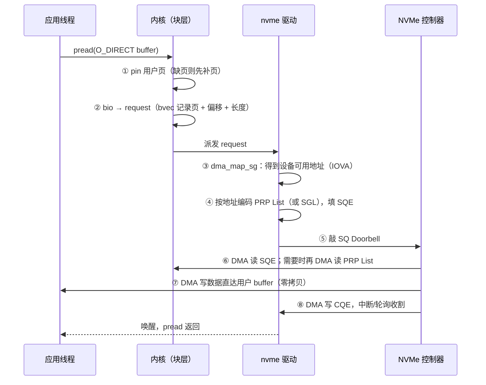

---
tags:
  - 高性能存储/NVMe与SSD
status: 已完成
---

# PRP 与 SGL

> 64 B 的 NVMe 命令装不下数据，只装得下"数据在哪"。PRP 与 SGL 就是"数据在哪"的两种写法：PRP 按内存页填一张整页格子表，SGL 按（地址 + 长度）写一份自由清单。它们解释了三件此前只能记结论的事：O_DIRECT 为什么挑剔对齐、驱动在提交路径上到底做了什么工作、NVMe-oF 为什么必须换一种数据描述方式。

前置：[[3.1 NVMe 命令模型]]（SQE 里的 PRP1/PRP2 字段第一次出场）、[[0.3 DMA IOMMU 与 Pinned Memory]]（VA/PA/IOVA、pin 与 DMA 映射——PRP/SGL 里填的地址正是那条流水线的产物）。

---

## 1. 问题：命令 64 B，缓冲区可能几 MiB

先把问题摆正。3.1 说过，NVMe 命令不带数据、只带指针：SQE 的 Dword 6–9 是一块 16 B 的 **DPTR（Data Pointer）** 区域，二选一地装 **PRP1 + PRP2 两个 8 B 指针**，或 **一条 16 B 的 SGL 描述符**【事实】。

16 B 为什么不够直接描述缓冲区？两个现实叠加：

1. **缓冲区可以很大**：一次 1 MiB 的 IO 覆盖 256 个 4 KiB 页；
2. **虚拟连续 ≠ 物理连续**（[[0.3 DMA IOMMU 与 Pinned Memory]] 第 6 节）：应用眼里连续的 buffer，物理页可以散落在 DRAM 各处，而设备 DMA 引擎只认总线地址。

256 个离散地址塞不进 16 B，于是协议用了工程里最常见的解法——**间接**：命令里只放一个指针，指向一张"放地址的表"；表本身也在主机内存里，设备用 DMA 自己去取。C++ 对照：函数传大数组不传值，传 `std::span`；这里更进一步，连"指针数组"本身都放在对方可 DMA 的内存里，按需取用。

PRP 与 SGL 就是这张表的两种格式：

| | PRP（Physical Region Page） | SGL（Scatter Gather List） |
| --- | --- | --- |
| 表项内容 | 8 B：一个页对齐的地址 | 16 B：类型 + 地址 + **长度** |
| 描述粒度 | 整页（长度隐含，由 NLB 推出） | 任意字节长度、任意地址 |
| 一句话 | 按页填格子 | 按段写清单 |

---

## 2. PRP：按整页填格子

![[图片/SVG/8_3_9_1.svg|900]]

### 2.1 三条取表规则

**【事实】** PRP 的全部规则可以背下来，因为只有三条：

1. **len ≤ 1 页**：PRP1 直接指向数据页（允许页内偏移），PRP2 不用；
2. **len ≤ 2 页**：PRP1 指第一页，PRP2 指第二页；
3. **len > 2 页**：PRP1 指第一页，PRP2 指向一张 **PRP List**——一页装满 8 B 表项的内存（4 KiB 页可容 512 项）；List 装不下时，末项填下一张 List 的地址，成链。

配套的两条硬限制【事实】：

- **只有 PRP1 允许页内偏移**，其余所有表项（PRP2 与 List 里的每一项）必须页对齐、整页粒度；
- **表项没有长度字段**——总长度由命令的 NLB（块数）推出，每项固定"从这个地址起的一整页"。

为什么中间页必须页对齐还能工作【推导】：buffer 在虚拟地址上连续，第一页之后的每一页天然从页边界开始——PRP1 的偏移吃掉开头的错位，后面自动对齐。这不是巧合，是 PRP 格式赌定了"缓冲区虚拟连续"这个常见情形，用最省的每项 8 B 换来的。

### 2.2 页大小是谁定的

这里的"页"是**控制器内存页**，由主机初始化时写入 `CC.MPS` 寄存器指定（常见 4 KiB），与 OS 页大小无必然关系【事实】。Linux 把两者配成一致（x86 上都是 4 KiB），所以平时感受不到差别；但概念上要分开——用 HugePage 的 SPDK 程序里，OS 页 2 MiB、PRP 粒度仍是 4 KiB（[[5.9 SPDK 环境与 HugePage]]）。

### 2.3 算一笔表项账【量级】

| IO 大小（首地址页对齐） | 形态 | 表项数 |
| --- | --- | --- |
| 4 KiB | 只用 PRP1 | 0（不需要 List） |
| 8 KiB | PRP1 + PRP2 | 0 |
| 16 KiB | PRP1 + List（3 项） | 3 |
| 128 KiB | PRP1 + List（31 项） | 31 |
| 2 MiB | PRP1 + List（511 项，恰好一页装下） | 511 |

两个直接推论：

- **4 KiB 随机 IO 是 PRP 的最优情形**：零表项、零额外内存、设备取完 SQE 就能开工——NVMe 生态把 4 KiB 当"黄金块大小"，这是原因之一；
- **大 IO 要付"取表税"**：PRP List 本身在主机内存里，设备执行前要**多一次 DMA 读**把表取回来【事实】。单笔几 μs 级的路径里多一次 ~百 ns 级的 DMA 读不算大，但它解释了为什么协议允许小 IO 完全绕开 List。

---

## 3. SGL：按（地址, 长度）写清单

PRP 的省是拿约束换的：整页粒度 + 页对齐。当缓冲区本身就离散、长度不齐页时（`readv`/`writev` 的 iovec、网络栈的分段缓冲），PRP 描述不了，或者要靠拷贝凑齐。SGL 去掉这两条约束：

**【事实】** SGL 描述符固定 16 B：类型字段 + 地址 + 长度。常用类型：

| 类型 | 作用 |
| --- | --- |
| Data Block | 一段数据：任意字节地址 + 任意字节长度 |
| Segment / Last Segment | 指向下一个描述符数组（段与段成链，Last 表示倒数第二跳） |
| Bit Bucket | 读时丢弃这一段（跳读场景，主机不想要的部分不落内存） |
| Keyed Data Block | NVMe-oF 专用：地址 + 长度 + **key**（RDMA 的 rkey） |

组织方式：SQE 里的 SGL1 要么直接内嵌一条 Data Block（单段小 IO，一跳都不用取），要么是 Segment 描述符指向一个"描述符数组"（段），段内最后一项可以再指向下一段——与 PRP List 的链同构，但每项自带长度。

**协议地位【事实】**：

- **PCIe NVMe：PRP 必选，SGL 可选**——控制器是否支持看 Identify Controller 的 `SGLS` 字段；
- **NVMe-oF：SGL 强制，PRP 不存在**。原因值得想一层：PRP 填的是主机物理/总线地址，跨网络毫无意义；而 Keyed SGL 携带 rkey，恰好接上 RDMA 的远程访问授权模型——Target 拿着 `(addr, len, rkey)` 就能让网卡直接读写 Host 内存（[[4.12 rkey lkey 生命周期]]、[[5.19 RDMA Transport 数据路径]]）。**同一个"命令带数据指针"的形状，本地用物理地址实现，跨网用 rkey 实现**。

---

## 4. 这张表是谁在什么时候填的：一次 O_DIRECT 读的全路径

把 PRP/SGL 放回端到端路径。以 `pread(fd, buf, 128KiB, off)` + O_DIRECT 为例，上游见 [[1.7 块层与 blk-mq]]，这里聚焦"从用户指针到设备可用的表"：



**每一步的等待点与拷贝对账**：

| 步骤 | 谁做 | 等待点 | 数据拷贝 |
| --- | --- | --- | --- |
| ① pin（`pin_user_pages`） | 内核，CPU | 页未驻留时触发缺页补页（可能等换入/分配） | 0 |
| ③ DMA 映射 | 内核，CPU | IOMMU 建表/失效操作（热路径靠 IOTLB 与映射复用摊薄，[[0.3 DMA IOMMU 与 Pinned Memory]]） | 0 |
| ④ 编码 PRP/SGL | 驱动，CPU | 无（纯内存写，List 页来自驱动的内存池） | 0 |
| ⑥ 设备取 SQE + List | 设备 DMA | 大 IO 多一次取表 DMA 读【量级：~百 ns】 | 0 |
| ⑦ 数据 DMA | 设备 DMA | 介质读 ~几十 μs（真正的大头，[[3.1 NVMe 命令模型]]） | **0——直达用户 buffer** |

**Buffered IO 对照**：走 page cache 时，数据先由 CPU 拷贝进内核页（读方向则相反），PRP 填的是 **page cache 页**的地址——内核页天然页对齐，PRP 的约束被完美满足，应用完全感知不到。**O_DIRECT 撤掉了这层中介，把 PRP 的对齐要求直接暴露给用户 buffer**——这就是 [[1.3 Buffered IO 与 O_DIRECT]] 里 `EINVAL` 的最终出处：一次拷贝换来的"对齐自由"，不要了就得自己守规矩。

---

## 5. PRP 还是 SGL：取舍与 Linux 策略

| 维度 | PRP | SGL | 性质 |
| --- | --- | --- | --- |
| 每项开销 | 8 B/页：128 KiB ≈ 32 项 | 16 B/段：连续 128 KiB 只需 1 项 | 事实 |
| 离散缓冲 | 描述不了非页对齐的中间段 | 天生为此设计 | 事实 |
| 设备实现 | 解析简单（定长、定粒度） | 要处理任意长度、类型分支 | 取舍 |
| 小 IO | 4 KiB 零表项，最优 | 内嵌单项也行，但无优势 | 量级 |

**【实现】** Linux nvme 驱动在设备两者都支持时按 IO 特征动态选：平均段长超过模块参数 `nvme.sgl_threshold`（默认 32 KiB）才用 SGL，否则用 PRP；把它设成 0 可整体禁用 SGL。逻辑与上表一致——小而齐的 IO PRP 便宜，大而散的 IO SGL 表项少。这是驱动实现细节，阈值与判断条件可能随内核版本变，结论记"**驱动会替你选，且偏向小 IO 用 PRP**"即可。

---

## 6. 对齐与上限：应用能感知到的边界

三层限制从下往上传导，最终都变成应用侧的现象：

1. **内存对齐**【事实】：O_DIRECT 要求 buffer 地址与长度按设备逻辑块（512 B / 4 KiB）对齐（块层的 `dma_alignment`），否则 `EINVAL`。注意要求不是"页对齐"——PRP1 的页内偏移合法地接住了 512 对齐的 buffer；但实践上**直接按页对齐分配**最稳妥【实践】：跨内核版本、跨设备（尤其虚拟化栈）的行为差异最小；
2. **单命令上限 MDTS**【事实】：Identify Controller 的 `mdts` 字段限定单条命令最大传输量（[[3.7 nvme-cli 实操]] 的验收项）；超过的 IO 由块层拆成多条命令——应用发一次 2 MiB 读，`iostat` 可能看到多条请求，延迟是"多条命令的完成时间"而非一条；
3. **段数上限**：`/sys/block/nvme0n1/queue/max_segments` 限制一个请求的离散段数；`readv` 的 iovec 太碎会被拆分或合并。

调试入口：

```bash
cat /sys/block/nvme0n1/queue/max_segments        # 单请求最大离散段数
cat /sys/block/nvme0n1/queue/max_hw_sectors_kb   # MDTS 折算的单命令上限
cat /sys/module/nvme/parameters/sgl_threshold    # SGL 启用阈值（字节）
nvme id-ctrl /dev/nvme0 -H | grep -i sgl         # 设备 SGL 支持情况
```

---

## 7. Modern C++：对齐分配与 PRP 计数的心智模型

两段代码把本篇的两个硬规则写成能跑的形状（**心智模型，非驱动代码**）。

### 7.1 O_DIRECT 缓冲区的 RAII 分配

对齐是 PRP 层的要求，分配时就要满足；释放必须配对 `std::free`——用 `unique_ptr` 定制删除器，所有权和对齐约束都写进类型：

```cpp
#include <cstddef>
#include <cstdlib>
#include <memory>
#include <new>
#include <span>

struct FreeDeleter {
    void operator()(std::byte* p) const noexcept { std::free(p); }
};
using AlignedBuffer = std::unique_ptr<std::byte[], FreeDeleter>;

// O_DIRECT 缓冲区：按页对齐分配，长度补齐到对齐粒度
AlignedBuffer make_dio_buffer(std::size_t len, std::size_t align = 4096) {
    // aligned_alloc 要求 size 是 align 的整数倍
    const std::size_t padded = (len + align - 1) / align * align;
    auto* p = static_cast<std::byte*>(std::aligned_alloc(align, padded));
    if (p == nullptr) throw std::bad_alloc{};
    return AlignedBuffer{p};
}
```

**关键点**：`std::aligned_alloc` 要求长度是对齐值的整数倍——补齐这一步漏掉就是未定义行为；按页（4096）而非逻辑块（512）对齐是上一节说的稳妥选择。

### 7.2 一个 buffer 需要几个 PRP 表项

把 2.1 节的规则翻译成函数——它同时是驱动 `nvme_pci_setup_prps` 做的第一件事：

```cpp
#include <cstdint>

constexpr std::size_t kPage = 4096;   // 控制器内存页（CC.MPS）

// 返回 PRP List 需要的表项数（0 表示 PRP1/PRP2 已够用）
constexpr std::size_t prp_list_entries(std::uint64_t addr, std::size_t len) {
    const std::size_t offset = addr % kPage;         // 只有第一页允许的偏移
    const std::size_t pages =
        (offset + len + kPage - 1) / kPage;          // 覆盖的页数
    return pages <= 2 ? 0 : pages - 1;               // 首页归 PRP1，其余进 List
}

static_assert(prp_list_entries(0x1000, 4096) == 0);      // 4 KiB：仅 PRP1
static_assert(prp_list_entries(0x1000, 8192) == 0);      // 8 KiB：PRP1+PRP2
static_assert(prp_list_entries(0x1000, 16384) == 3);     // 16 KiB：List 3 项
static_assert(prp_list_entries(0x1200, 4096) == 0);      // 偏移 0x200：跨 2 页，仍免 List
static_assert(prp_list_entries(0x1200, 8192) == 2);      // 偏移让 8 KiB 变 3 页
```

**关键点**：最后两条 `static_assert` 是本篇最容易踩的坑——**首地址偏移会让同样长度多覆盖一页**，表项数随之 +1。驱动、SPDK、自研用户态驱动里的 off-by-one 大多死在这一行算术上。

---

## 8. 实验与故障排查思路

**对照实验（变量：块大小）**：固定设备与 `iodepth`，fio 扫 `bs=4k/128k/2m`，对照 `iostat -x` 的 `areq-sz`（平均请求大小）与 IOPS。预期：`bs` 超过 `max_hw_sectors_kb` 后 `areq-sz` 不再增长——块层按 MDTS 拆分的直接证据；4 KiB 档的每 IO CPU 开销最低（零表项路径）。

**故障案例（对号入座）**：

| 症状 | 根因所在层 | 检查 |
| --- | --- | --- |
| O_DIRECT 读写返回 `EINVAL` | buffer 或长度未按逻辑块对齐 | 分配是否走 7.1 的对齐路径；`bs` 是否为逻辑块整数倍 |
| 设备回 `Invalid Field` / `PRP Offset Invalid` 状态 | 自研驱动/SPDK 填表时中间项带了偏移 | 7.2 的偏移算术；List 项是否页对齐 |
| 大 IO 延迟高于预期 | 被 MDTS/max_segments 拆成多条命令 | `blktrace` 看单请求是否分裂（[[9.3 blktrace 与块层生命周期]]） |
| iovec 很碎时吞吐骤降 | 段数超限触发拆分/伙伴拷贝 | `max_segments`；考虑聚合成大段或用注册缓冲 |

---

## 9. 陷阱与误区

> [!warning] 常见错误
> 1. **以为 PRP/SGL 负责 pin 和映射**：它们只是"把已经可 DMA 的地址编码进命令"的格式；pin、IOMMU 映射是上游另一条流水线的事（[[0.3 DMA IOMMU 与 Pinned Memory]] 的核心结论）。
> 2. **把 OS 页大小当 PRP 页大小**：PRP 粒度由 `CC.MPS` 定；HugePage 环境下两者差 512 倍，算表项用错粒度全盘皆错。
> 3. **以为 SGL 一定比 PRP 先进**：4 KiB 对齐小 IO 上 PRP 零表项、解析更简单；SGL 赢在离散与不对齐，不赢在"新"。
> 4. **以为 PRP 表项带长度**：只有地址；长度全靠 NLB 推出——这正是它便宜（8 B）又死板（整页）的原因。
> 5. **把 O_DIRECT 对齐要求记成"必须页对齐"**：协议上 PRP1 的偏移接住了逻辑块对齐的 buffer；但工程上主动页对齐，兼容性最好——记规则，也记实践。
> 6. **忘了 PRP List 自己也要被 DMA 取一次**：命令的"数据指针"是两跳间接——设备先取表、再取数据；小 IO 免表是真实的延迟优化，不是格式巧合。

---

## 10. 关键结论

| 结论 | 性质 |
| --- | --- |
| SQE 的 16 B DPTR 装不下大缓冲区的地址列表，PRP/SGL 用"指针指向表、表也可 DMA"的间接解决 | 事实 |
| PRP：8 B/项、整页粒度、仅 PRP1 可带偏移；>2 页用 PRP List，装满成链；长度由 NLB 推出 | 事实 |
| SGL：16 B/项、任意地址 + 任意长度；段间成链；PCIe 上可选，NVMe-oF 强制（Keyed SGL 携带 rkey） | 事实 |
| 4 KiB 对齐 IO 走零表项路径；大 IO 付一次"取表 DMA"；Linux 按 sgl_threshold 在两者间选 | 量级 / 实现 |
| O_DIRECT 的 EINVAL、MDTS 拆分、max_segments 上限，都是 PRP/SGL 层约束向上的投影 | 事实 |
| Buffered IO 用一次 CPU 拷贝换来对齐自由；O_DIRECT 把协议约束直接交给应用 | 取舍 |
| 首地址偏移会改变覆盖页数与表项数——填表算术的第一坑 | 事实 / 实践 |

---

## 关联知识

- [[3.1 NVMe 命令模型]] - DPTR 字段的宿主：命令三要素里的"数据放哪"
- [[3.2 Queue Pair 与 Doorbell]] - 表填好之后，命令怎么递出去、回执怎么收回来
- [[0.3 DMA IOMMU 与 Pinned Memory]] - 表里地址的来历：pin → DMA 映射 → 编码
- [[1.3 Buffered IO 与 O_DIRECT]] - 对齐要求在用户态的表现与取舍
- [[5.13 SPDK NVMe Driver]] - 用户态驱动亲手填 PRP/SGL 的地方
- [[5.19 RDMA Transport 数据路径]] - Keyed SGL 在 NVMe-oF RDMA 上的用法
- [[4.12 rkey lkey 生命周期]] - Keyed SGL 里那把 key 的授权模型

## 参考

- NVM Express Base Specification：Data Pointer（DPTR）、PRP Entry / PRP List、SGL Descriptor 类型、MDTS、Identify Controller SGLS
- Linux 内核源码：`drivers/nvme/host/pci.c`（`nvme_pci_setup_prps` / `nvme_pci_setup_sgls`）
