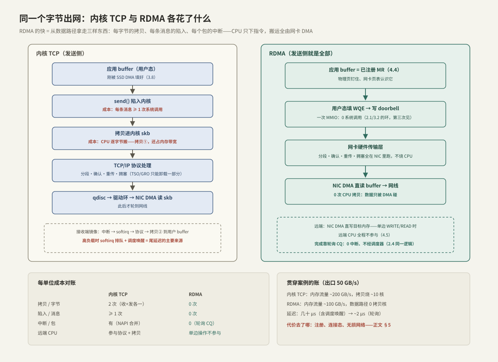

---
tags:
  - 高性能存储
  - RDMA与RoCE
---
# RDMA 为什么快

> 贯穿案例走到最后一段：盘验收过了（[[3.7 nvme-cli 实操]]）、摆放对了（[[3.8 PCIe 拓扑与 NUMA]]），数据已经躺在内存里，现在要以 50 GB/s 交给网络另一端的 GPU 客户端。这一篇先老老实实给内核 TCP 记账——每字节的拷贝、每条消息的陷入、每个包的中断——再看 RDMA 分别拿走了哪几项。结论先行：**RDMA 的快不是魔法，是把传输层从"每字节都过 CPU"改成"CPU 只下指令、搬运全由网卡"**；省下的成本没有消失，挪到了连接建立期和网络运维上。

前置：[[1.8 一次 read write 全路径图]]（"数路径"的方法，本篇对网络栈再用一次）、[[2.1 SQ CQ 模型]]（环 + doorbell，这是第三次见它）、[[3.8 PCIe 拓扑与 NUMA]]（内存这条隐形总线）。

---

## 1. 基线：内核 TCP 怎么送出一个字节

发送端逐层走一遍（接收端是镜像），每一步标出它的成本类型【事实】：

1. **`send()` 陷入内核**——固定成本，按消息条数计；
2. **拷贝进内核 skb**——CPU 逐字节搬运，按字节计；从此内核拥有数据副本，`send()` 得以立即返回；
3. **TCP/IP 协议处理**——分段、序号、确认、重传定时器、拥塞窗口，按包计。现代网卡能卸载分段与校验（TSO/GRO/checksum offload）【实现】，但状态机本体仍在内核；
4. **qdisc 排队 → 驱动环 → NIC DMA 读出 skb**——数据第二次过内存总线；
5. 接收端：**中断 → softirq（NAPI 轮询）→ 协议处理 → 拷贝到用户 buffer**——第二次 CPU 拷贝，外加一次调度唤醒才能叫醒 `recv()` 里睡着的线程。

计数结果：**每字节 2 次 CPU 拷贝（收发各一）、每条消息至少 1 次系统调用、每个包一份协议处理、外加中断与唤醒**。小消息时固定成本占大头，大吞吐时按字节的拷贝占大头——两头都不便宜。



---

## 2. 把账算在案例上：50 GB/s 出口

### 2.1 内存账

[[3.8 PCIe 拓扑与 NUMA]] §4 说过：出网数据最少过内存 2 次，每次 CPU 拷贝追加 2 次。按发送路径逐个方案算：

| 发送路径 | 过内存次数/字节 | 内存流量 @ 50 GB/s |
| --- | --- | --- |
| buffered 读盘 + `send()`（页缓存→用户→skb，2 次拷贝） | 6 | ~300 GB/s |
| O_DIRECT 读盘 + `send()`（用户→skb，1 次拷贝） | 4 | ~200 GB/s |
| O_DIRECT 读盘 + RDMA（0 次拷贝） | 2 | ~100 GB/s |

300 GB/s 已经逼近双路内存合计的上限区，而这条总线还要供应用访存、校验、EC 计算【量级】。**内存带宽先于网卡到顶**——这是拷贝最隐蔽的代价：它不出现在任何"网络"指标里。

### 2.2 CPU 账

单核 memcpy 大约十几 GB/s【量级】：仅发送侧 1 次拷贝，50 GB/s 就吃掉约 4–6 个核；再加协议处理、中断、软中断、唤醒，几十个核进了搬运业。这些核在存储节点上本来有正经工作：校验、EC 编码、元数据、compaction。

### 2.3 尾延迟账

均值靠堆核还能压住，尾巴压不住【实践】：每条消息的完成要经过**中断 → softirq 排队 → 调度器唤醒**，三处都会在高负载时排队。p50 也许 30 μs，p99 就到几百 μs，且随负载相位波动——对照 [[2.4 polling 与 registered buffers]] 的结论：**只要完成路径经过调度器，尾延迟就不属于你**。

三条账合起来的因果链：

```text
拷贝吃内存带宽 → 盘 DMA、网卡 DMA、CPU 拷贝挤同一条总线 → 每笔服务时间变长且抖
协议+中断吃 CPU → 提交/完成线程抢不到核 → 队列加深（利特尔法则）
完成路径过调度器 → 唤醒延迟叠进每笔 IO → p99 放大数倍
```

---

## 3. RDMA 拿走了什么

RDMA（Remote Direct Memory Access）把上面的成本逐项摘除，靠三根柱子和一个特权【事实】：

1. **内核旁路（kernel bypass）**：QP（Queue Pair）的发送/接收环与完成队列 CQ 直接映射进用户态，提交 = 填 WQE + 写一次 doorbell（MMIO），数据路径 0 系统调用——与 io_uring 的 SQ/CQ、NVMe 的 SQ/CQ 是同一张图（[[2.1 SQ CQ 模型]]、[[3.2 Queue Pair 与 Doorbell]]），编程模型细节在 [[4.2 Verbs 编程模型]]、[[4.3 QP WQE CQ 状态机]]；
2. **零拷贝**：应用内存先注册成 MR（Memory Region）——物理页钉住、地址翻译表下发给网卡（[[4.4 内存注册与零拷贝]]），此后网卡直接 DMA 读写用户 buffer，数据路径 0 次 CPU 拷贝；
3. **传输层卸载**：分段、确认、重传、拥塞控制在网卡硬件里执行，CPU 不再按包付费；完成通知可以轮询 CQ，0 中断、不经调度器；
4. **单边操作（one-sided）**：RDMA READ/WRITE 直接读写远端注册过的内存，**远端 CPU 全程不参与**【事实】（[[4.5 Send Recv 与 RDMA Read Write]]）。对存储节点这是质变：客户端读数据不消耗服务端 CPU——服务端的核全部留给校验与元数据。

对账（贯穿案例）：内存流量 200 → 100 GB/s，数据路径拷贝核 ~10 → 0，每消息陷入 1 → 0，每包中断若干 → 0。**50 GB/s 出口从"CPU 与内存的极限工程"变成"网卡的日常"**。

---

## 4. 延迟：均值降一个量级，尾巴更值钱

- 同机房内核 TCP 往返常见几十 μs（含两端协议栈与唤醒）；RDMA 小消息写延迟 ~1–2 μs【量级】——自己的机器自己测：[[4.9 ibv_perftest 基准实验]]、[[4.10 rc_pingpong 最小程序]]；
- 更重要的是**分布形状**【实践】：轮询 CQ 时完成路径不经中断、不经调度器，p99 紧贴 p50；代价是烧一个轮询核——与 [[2.4 polling 与 registered buffers]] 同一笔交易：**用一个核的确定性支出，换走整条尾巴的不确定性**。

回到案例的两条主线：吞吐由 §3 的账保住；p99 从"被拷贝、软中断、唤醒随机拉长"变成"由设备与网络的真实服务时间决定"——这正是 GPU 关键路径读想要的性质。

---

## 5. 前提与代价【取舍】——诚实的账

省掉的复杂度没有消失，只是搬家了：

| 代价 | 内容 | 工程后果 |
| --- | --- | --- |
| 内存注册贵 | pin 页 + 下发网卡页表，大区域毫秒级【量级】 | 必须预注册 + 内存池，杜绝"临时 malloc 临时注册"；被 pin 的内存不能 swap、不参与内核回收（[[4.4 内存注册与零拷贝]]） |
| 连接状态在网卡 | QP 上下文存在网卡缓存，容量有限 | 连接数上万后缓存抖动、性能回落【实现】——大规模集群要控制 QP 数量 |
| 网络要近无损 | RoCE 的硬件重传粗糙（传统实现丢包即大步回退）【实现】 | 需要 PFC/ECN/DCQCN 把丢包率压到近零（[[4.6 RoCE 与 InfiniBand]]、[[4.7 PFC ECN 与 DCQCN]]）——运维复杂度整体上移 |
| 编程模型陡峭 | Verbs 是"汇编级"网络 API，错误处理粗糙 | 学习成本 + 出错后 QP 直接进错误态需重建（[[4.3 QP WQE CQ 状态机]]） |
| 硬件绑定 | 需要 RDMA 网卡；软件实现不给性能 | soft-RoCE 只用于开发验证（[[4.8 soft-RoCE 边界]]） |

反方向，内核 TCP 的优势正是这些代价的镜像：任意网卡任意网络都能跑、丢包退化平缓、运维体系成熟。**选型判断**：机房内、延迟敏感、吞吐密集、连接数可控——RDMA 值得；跨广域、连接数爆炸、环境不可控——留在 TCP。NVMe-oF 把两条路都标准化了，对比见 [[5.2 Transport TCP vs RDMA]]。

---

## 6. Modern C++：两种形状

心智模型对比（非可运行代码；真实 API 在 [[4.2 Verbs 编程模型]] 与 [[4.10 rc_pingpong 最小程序]]）：

```cpp
#include <cerrno>
#include <span>
#include <system_error>

// 内核 TCP：每条消息一次陷入；数据在 send 内部被拷进内核
void send_all_tcp(int sock, std::span<const Message> msgs) {
    for (const Message& m : msgs) {
        if (::send(sock, m.data(), m.size(), 0) < 0)     // 陷入 + 拷贝 + 协议处理
            throw std::system_error{errno, std::system_category(), "send"};
    }
}

// RDMA：填 WQE + 一次 doorbell，全程用户态；数据原地等网卡来取
void send_all_rdma(SendQueue& sq, CompletionQueue& cq, std::span<const Message> msgs) {
    for (const Message& m : msgs)
        sq.post_write(m.remote_addr, m.local_mr);   // 普通内存写：填 WQE，不陷入
    sq.ring_doorbell();      // 一次 MMIO ≈ release 发布（1.7 的门铃协议，第三次出场）
    cq.poll(msgs.size());    // 轮询 CQE ≈ acquire 确认：0 陷入、0 中断、0 拷贝
}
```

注意形状差异的来源：TCP 的循环里每一轮都付固定成本；RDMA 把 N 条消息的发布合并成一次 doorbell，完成靠轮询收割——**与 [[2.3 iodepth 与提交完成路径]] 的批量摊薄是同一个思想在网络侧的版本**。

---

## 7. 陷阱与误区

> [!warning] 常见错误
> 1. **"RDMA 一定更快"**：单次传输前先注册 MR 的话，毫秒级注册开销要传很多数据才摊得平；小消息、短连接、低频场景 TCP 反而干净利落。
> 2. **零拷贝概念混用**：TCP 也有零拷贝工具箱——sendfile 省的是"文件→socket"的拷贝、MSG_ZEROCOPY 省发送侧拷贝但要 pin 页 + 异步完成【事实】。它们省拷贝，省不掉协议处理、中断与唤醒；RDMA 是整条路径一起省。
> 3. **拿 soft-RoCE 的数字评估 RDMA**：rxe 是软件模拟，性能与内核 TCP 同量级，只配用来验证代码正确性（[[4.8 soft-RoCE 边界]]）。
> 4. **把 RDMA 当可靠性魔法**：它的硬件重传是为"几乎不丢包"的网络设计的，丢包环境下退化比 TCP 剧烈得多——先建无损网络，再上 RoCE（[[4.7 PFC ECN 与 DCQCN]]）。
> 5. **perftest 裸带宽当业务预期**：ibv_perftest 测的是纯网卡能力；业务还有 MR 管理、CQ 轮询策略、与盘路径的耦合（[[4.9 ibv_perftest 基准实验]]）。

---

## 8. 案例收口：三篇的因果链合订

```text
3.7 设备地板：16 盘验收一致、健康有基线
  → 供给 112 GB/s 成立，无暗伤盘制造固定长尾
3.8 整机摆放：链路满速、盘卡对半分、数据面不过 UPI
  → PCIe、内存、互联三条总线全部有余量，抖动源被拆除
4.1 出网协议：零拷贝 + 传输卸载 + 单边操作
  → CPU 与内存退出每字节路径，出口 50 GB/s 由网卡直接兑现
合订结论：吞吐被"最小的那条总线"决定，尾延迟被"最抖的那个环节"决定；
三篇各拆掉一批瓶颈与抖动源，50 GB/s @ 稳定 p99 才同时成立。
```

下一步自然延伸：把这台节点的盘"搬"到远端还保持低延迟，就是 NVMe-oF（[[5.1 NVMe-oF 架构]]）；数据绕过 CPU 内存直达 GPU 显存，是第 8 章（[[8.1 GPU 内存层次与数据搬运]]）。

---

## 9. 关键结论

| 结论 | 性质 |
| --- | --- |
| 内核 TCP 的成本结构：每字节 2 次拷贝、每消息 1 次陷入、每包协议+中断 | 事实 |
| 50 GB/s 出口下，拷贝路径的内存流量 200–300 GB/s，先于网卡撞上内存带宽 | 量级 → 因果 |
| RDMA 三根柱子：内核旁路、零拷贝（MR）、传输层卸载；外加单边操作免远端 CPU | 事实 |
| 环 + doorbell 第三次出现（NVMe、io_uring、RDMA）：发布/获取协议是所有高性能提交路径的公共骨架 | 类比 / 事实 |
| 轮询 CQ 用一个核换整条尾巴：p99 贴 p50，与 2.4 同一笔交易 | 取舍 |
| 代价守恒：省下的每字节成本挪到注册期（pin + 页表）、连接态（网卡缓存）与网络运维（无损）上 | 取舍 |
| 机房内、延迟敏感、连接数可控选 RDMA；环境不可控、连接数爆炸留在 TCP | 实践结论 |

---

## 关联知识

- [[4.2 Verbs 编程模型]] / [[4.3 QP WQE CQ 状态机]] - 本篇"三根柱子"的编程展开
- [[4.4 内存注册与零拷贝]] - MR：零拷贝的前提与注册成本
- [[4.5 Send Recv 与 RDMA Read Write]] - 双边与单边操作的语义差异
- [[4.6 RoCE 与 InfiniBand]] / [[4.7 PFC ECN 与 DCQCN]] - "近无损网络"这个前提怎么建
- [[4.8 soft-RoCE 边界]] - 没有硬件时能验证什么、不能验证什么
- [[4.9 ibv_perftest 基准实验]] / [[4.10 rc_pingpong 最小程序]] - 亲手量出本篇的量级
- [[2.4 polling 与 registered buffers]] - 轮询换尾巴：同一笔交易的 io_uring 版
- [[5.2 Transport TCP vs RDMA]] - NVMe-oF 场景下两条传输的正面对比
- [[7.4 3FS 架构]] - 贯穿案例原型：RDMA 存储集群的真实形态
