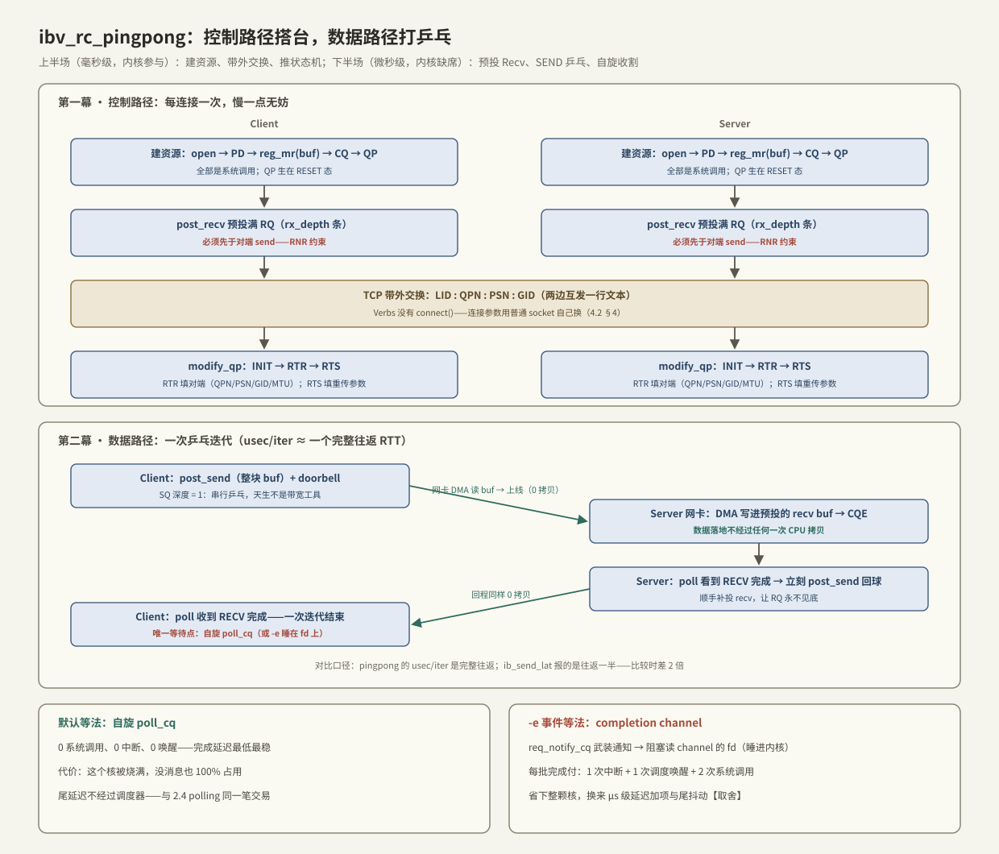

---
tags:
  - 高性能存储
  - RDMA与RoCE
---
# rc_pingpong 最小程序

> [[4.2 Verbs 编程模型]] §5 列了十步流程，本篇是它的可运行版本：`ibv_rc_pingpong`（rdma-core 自带，源码在 `examples/rc_pingpong.c`，约 700 行 C）。它只做一件事——两台机器用 SEND/RECV 打乒乓——但把 Verbs 的所有仪式走了一遍：建资源、带外交换、状态机、预投 Recv、收割完成。更重要的是，它把「**程序到底在哪里等**」暴露得清清楚楚：默认自旋，`-e` 换成睡在 fd 上，两种等法一开关切换，是观察 [[2.4 polling 与 registered buffers]] 那笔交易的最小实验装置。读懂它 + 用 Modern C++ 重写一遍骨架，Verbs 就算入门了。

前置：[[4.2 Verbs 编程模型]]（对象模型与十步流程）、[[4.3 QP WQE CQ 状态机]]（INIT/RTR/RTS 的完整参数）、[[4.9 ibv_perftest 基准实验]]（分工：那边是仪器，这边是教材）。

---

## 1. 程序做什么：一眼看懂输入输出

服务端 `ibv_rc_pingpong`，客户端 `ibv_rc_pingpong <server>`。双方各把一块 buffer（`-s`，默认 4096 字节）来回 SEND `-n` 次（默认 1000），结束时打印两行：

```text
8192000 bytes in 0.01 seconds = 6553.60 Mbit/sec
1000 iters in 0.01 seconds = 12.34 usec/iter
```

读法【事实】：字节数 = size × iters × 2（双向都算）；**usec/iter ≈ 一次完整往返 RTT**——注意口径，perftest 的 lat 报的是往返一半，直接对比会差 2 倍（[[4.9 ibv_perftest 基准实验]] §3）。它也天生不是带宽工具：SQ 深度为 1，串行乒乓没有流水，带宽数字只是副产品。

常用开关：`-d` 设备、`-g` GID index（RoCE 必填）、`-s` 大小、`-n` 次数、`-r` RQ 预投深度、`-e` 事件模式、`-p` 带外 TCP 端口。

---

## 2. 全流程地图：两幕戏



**第一幕（控制路径，毫秒级，内核参与）**：两边各自建资源 → 各自把 RQ 预投满 → 用普通 TCP 互发一行文本 `LID:QPN:PSN:GID` → 各自 `modify_qp` 推到 RTS。每一步都是系统调用，慢没关系——每连接只做一次。

**第二幕（数据路径，微秒级，内核缺席）**：client 发球，server 的网卡把数据 DMA 进**预先投好的** recv buffer 并落一条 CQE；server 自旋看到 RECV 完成，立刻回球并补投 recv；client 收到回球，一次迭代结束。等待点与拷贝的账【事实】：

| 环节 | 等待点 | 拷贝 |
| --- | --- | --- |
| post_send + doorbell | 无（填环 + MMIO posted 写） | 无 |
| 网卡取数据、上线、对端落地 | 全在硬件（PCIe 往返、串行化、线延） | 每方向 2 次 DMA（发端读 + 收端写），**0 次 CPU 拷贝** |
| 发现完成 | **唯一软件等待点**：自旋 poll_cq，或 `-e` 睡在 fd 上 | 无 |

时序上只有一条军规【事实】：**Recv 必须先于对端的 Send 存在**。RC 收到消息但 RQ 无 WQE 可消耗时回 RNR NAK，发端网卡按 `min_rnr_timer` 静默等待重试——程序没死，延迟却多出毫秒级的洞；重试耗尽则 QP 直接进错误态（[[4.3 QP WQE CQ 状态机]]）。rc_pingpong 的对策就是「开场投满 `-r` 条 + 消耗后成批补投」。

---

## 3. 逐段读源码：六个关键决定

对照 `rc_pingpong.c`，值得记住的不是行号，而是它做的六个决定：

1. **资源链**（`pp_init_ctx`）：open device → alloc PD → `reg_mr(buf, IBV_ACCESS_LOCAL_WRITE)` → create CQ → create QP。注册只要 `LOCAL_WRITE` 权限——SEND/RECV 是双边操作，远端不直接碰我的内存，无需 REMOTE 权限（[[4.5 Send Recv 与 RDMA Read Write]]）；
2. **QP 形状**：`max_send_wr = 1`、`max_recv_wr = rx_depth`、收发共用一个 CQ。发送深度 1 是刻意的：乒乓语义下同一时刻最多一发在途，程序逻辑因此极简；
3. **单 buffer 复用**：同一块 `buf` 既当发送源又当接收落点，所有 recv WQE 都指向它【实现】——验证的是**路径与时序**，不是数据完整性；想校验内容得自己改成双 buffer；
4. **带外交换格式**：一行定长文本 `LID:QPN:PSN:GID`（GID 展开成 32 个十六进制字符）。PSN 各自随机生成——防止旧连接的残留包被新连接误收【事实】；
5. **状态机三步**（`pp_connect_ctx`）：INIT 填端口与权限，RTR 填对端（路径 MTU、dest QPN、rq_psn、地址向量），RTS 填自己的重传参数——完整参数表见 §4 代码与 [[4.3 QP WQE CQ 状态机]]；
6. **两种等法**：默认循环 `ibv_poll_cq`；`-e` 时先 `ibv_req_notify_cq` 武装通知，再阻塞读 completion channel 的 fd，醒来后 ack、重新武装、把 CQ 里攒的完成**排空**再睡——「先武装再睡、醒来排空」是事件模式的固定纪律，漏一步就丢通知或空转【实现】。

两种等法的对账（同 [[2.4 polling 与 registered buffers]] 的交易，此处是 Verbs 版）【取舍】：

| | 自旋 poll_cq | `-e` completion channel |
| --- | --- | --- |
| 系统调用 / 批完成 | 0 | 2（read + 重新武装） |
| 中断 / 唤醒 | 0 / 0 | 1 / 1 |
| 完成延迟 | 最低最稳，p99 贴均值 | 加 μs 级，且经过调度器 |
| CPU | 烧满一核（空转也 100%） | 空闲时归零 |
| 适用 | 延迟敏感热路径 | 连接多、消息稀、省核优先 |

---

## 4. Modern C++ 重写：骨架与状态机

RAII 句柄（`VerbsHandle`、声明序 = 依赖序）已在 [[4.2 Verbs 编程模型]] §6 建好，这里补上它没展开的两块：**状态机三步的真实参数**与**乒乓主循环**。

### 4.1 连接参数与三步推进

先把要带外交换的东西定义成一个纯数据结构——它就是 TCP 上那行文本的结构化版本：

```cpp
#include <infiniband/verbs.h>

#include <cstdint>
#include <system_error>

struct PeerInfo {
    std::uint16_t lid;    // IB 用；RoCE 下为 0，走 GID
    std::uint32_t qpn;    // 对端 QP 号
    std::uint32_t psn;    // 对端起始包序号（各自随机生成后互换）
    ibv_gid gid;          // RoCE 的网络地址
};

// ibv_modify_qp 直接返回 errno 值（4.2 §6 的 API 风格陷阱），统一翻译
inline void check(int rc, const char* what) {
    if (rc != 0) throw std::system_error{rc, std::system_category(), what};
}
```

三步推进。每一步的 `attr_mask` 必须与该状态要求的字段**精确匹配**——多一位少一位都是 `EINVAL`，这是 Verbs 排障的高发区（[[4.2 Verbs 编程模型]] §7）：

```cpp
// INIT：这个 QP 在哪个口、允许什么访问。SEND/RECV 不需要远端权限，access_flags 为 0
void to_init(ibv_qp* qp, std::uint8_t port) {
    ibv_qp_attr a{};
    a.qp_state = IBV_QPS_INIT;
    a.pkey_index = 0;
    a.port_num = port;
    a.qp_access_flags = 0;
    check(ibv_modify_qp(qp, &a,
        IBV_QP_STATE | IBV_QP_PKEY_INDEX | IBV_QP_PORT | IBV_QP_ACCESS_FLAGS), "INIT");
}

// RTR（Ready to Receive）：全是「对端是谁、怎么到它」——收方向就绪
void to_rtr(ibv_qp* qp, const PeerInfo& peer, std::uint8_t port, std::uint8_t gid_index) {
    ibv_qp_attr a{};
    a.qp_state = IBV_QPS_RTR;
    a.path_mtu = IBV_MTU_1024;          // 两端必须一致，否则 EINVAL 或静默低速
    a.dest_qp_num = peer.qpn;
    a.rq_psn = peer.psn;                // 期望收到的第一个序号 = 对端的起始 PSN
    a.max_dest_rd_atomic = 1;           // 乒乓用不到 RDMA READ，给最小值
    a.min_rnr_timer = 12;               // 对端 RQ 空时，等多久再重试
    a.ah_attr.is_global = 1;            // RoCE 必须走 GRH（IP 路由头）
    a.ah_attr.grh.dgid = peer.gid;
    a.ah_attr.grh.sgid_index = gid_index;
    a.ah_attr.grh.hop_limit = 1;
    a.ah_attr.dlid = peer.lid;          // IB 下有效；RoCE 忽略
    a.ah_attr.port_num = port;
    check(ibv_modify_qp(qp, &a,
        IBV_QP_STATE | IBV_QP_AV | IBV_QP_PATH_MTU | IBV_QP_DEST_QPN |
        IBV_QP_RQ_PSN | IBV_QP_MAX_DEST_RD_ATOMIC | IBV_QP_MIN_RNR_TIMER), "RTR");
}

// RTS（Ready to Send）：全是「发丢了怎么办」——发方向就绪
void to_rts(ibv_qp* qp, std::uint32_t my_psn) {
    ibv_qp_attr a{};
    a.qp_state = IBV_QPS_RTS;
    a.timeout = 14;                     // ACK 超时 ~67 ms 档：4.096us × 2^14
    a.retry_cnt = 7;                    // 传输错误重试次数
    a.rnr_retry = 7;                    // 7 = 无限重试 RNR——学习程序图省事【取舍】
    a.sq_psn = my_psn;
    a.max_rd_atomic = 1;
    check(ibv_modify_qp(qp, &a,
        IBV_QP_STATE | IBV_QP_TIMEOUT | IBV_QP_RETRY_CNT | IBV_QP_RNR_RETRY |
        IBV_QP_SQ_PSN | IBV_QP_MAX_QP_RD_ATOMIC), "RTS");
}
```

**设计要点**：RTR 与 RTS 的分工不是随意的——RTR 配齐「怎么收」，RTS 配齐「怎么发」。所以必须**两端都到 RTR 之后才有人发第一条消息**；rc_pingpong 用「先投 recv、交换参数时天然同步」保证了这个顺序。`rnr_retry = 7`（无限）在生产代码里要三思：它会把「对端忘了补投 recv」这种 bug 变成无限静默等待，宁可有限重试让 QP 报错进 ERR，把问题暴露出来【取舍】。

### 4.2 乒乓主循环（自旋版）

```cpp
#include <span>

// buf 已注册为 mr；qp/cq 由 4.2 §6 的 RcConnection 持有
class Pingpong {
public:
    Pingpong(ibv_qp* qp, ibv_cq* cq, ibv_mr* mr, std::span<std::byte> buf, unsigned rx_depth)
        : qp_{qp}, cq_{cq}, mr_{mr}, buf_{buf}, rx_depth_{rx_depth} {}

    void run(bool is_client, int iters) {
        post_recv(rx_depth_);                       // 军规：上线前 RQ 必须是满的
        if (is_client) post_send();                 // 客户端开球
        int sent = is_client ? 1 : 0, rcvd = 0;
        while (rcvd < iters || sent < iters) {
            ibv_wc wc[2];
            const int n = ibv_poll_cq(cq_, 2, wc);  // 唯一等待点：用户态自旋
            check(n < 0 ? EIO : 0, "poll_cq");
            for (int i = 0; i < n; ++i) {
                if (wc[i].status != IBV_WC_SUCCESS)  // 真正的错误通道在 CQE，不在返回值
                    throw std::system_error{EIO, std::system_category(), "wc status"};
                if (wc[i].opcode == IBV_WC_RECV) {   // 共用 CQ，靠 opcode 分流
                    ++rcvd;
                    if (--outstanding_recv_ <= 1) post_recv(rx_depth_ - outstanding_recv_);
                    if (sent < iters) { post_send(); ++sent; }   // 收到即回球
                }
            }
        }
    }

private:
    void post_recv(unsigned n) {
        ibv_sge sge{reinterpret_cast<std::uintptr_t>(buf_.data()),
                    static_cast<std::uint32_t>(buf_.size()), mr_->lkey};
        ibv_recv_wr wr{}, *bad = nullptr;
        wr.sg_list = &sge; wr.num_sge = 1;
        for (unsigned i = 0; i < n; ++i) { check(ibv_post_recv(qp_, &wr, &bad), "post_recv"); }
        outstanding_recv_ += n;
    }
    void post_send() {
        ibv_sge sge{reinterpret_cast<std::uintptr_t>(buf_.data()),
                    static_cast<std::uint32_t>(buf_.size()), mr_->lkey};
        ibv_send_wr wr{}, *bad = nullptr;
        wr.opcode = IBV_WR_SEND;
        wr.send_flags = IBV_SEND_SIGNALED;          // 每发必产生 CQE：记账最简单的选择
        wr.sg_list = &sge; wr.num_sge = 1;
        check(ibv_post_send(qp_, &wr, &bad), "post_send");
    }

    ibv_qp* qp_; ibv_cq* cq_; ibv_mr* mr_;
    std::span<std::byte> buf_;
    unsigned rx_depth_, outstanding_recv_ = 0;
};
```

**关键点**：

- **错误看 `wc.status` 不看返回值**——post 成功只说明「请求进环了」，传输结果在 CQE 里，与 io_uring 必查 `res` 同源（[[4.2 Verbs 编程模型]] §8）；
- **补投时机**：`outstanding_recv_` 快见底就成批补——比每收一条补一条省 doorbell，又不给 RNR 留窗口；
- `IBV_SEND_SIGNALED` 让每个 send 都产生 CQE，账好记；高性能代码会隔 N 个才 signal 一次来省 CQE，代价是自己记账（[[4.3 QP WQE CQ 状态机]]）。

---

## 5. 跑起来：命令与观察

```bash
# 服务端（RoCE：-g 选 v2 的 GID index，show_gids 查）
ibv_rc_pingpong -d mlx5_0 -g 3 -s 4096 -n 1000

# 客户端
ibv_rc_pingpong -d mlx5_0 -g 3 -s 4096 -n 1000 <server-ip>

# 对照实验：-e 换成事件等待，看 usec/iter 的变化
ibv_rc_pingpong -d mlx5_0 -g 3 -e <server-ip>
```

值得做的三个观察【实践】：

1. **自旋 vs `-e`**：usec/iter 的差 ≈ 中断 + 唤醒 + 两次系统调用的代价，亲手量出 §3 那张对账表；
2. **`-s` 扫大小**：小尺寸区平坦（固定成本地板）、大尺寸线性（串行化）——与 [[4.9 ibv_perftest 基准实验]] §5 的延迟曲线同形状，但数值是它的 ~2 倍（口径：整往返）；
3. **没有硬件**：soft-RoCE 上照样能跑通并观察全流程——但数字一律无效（[[4.8 soft-RoCE 边界]]）。

---

## 6. 陷阱与误区

> [!warning] 常见错误
> 1. **拿 pingpong 当带宽基准**：SQ 深度 1、无流水，带宽数字只是副产品；测能力用 [[4.9 ibv_perftest 基准实验]]。
> 2. **RoCE 下忘了 `-g`**：默认 GID 常是 v1 或 link-local——现象是卡在建连或流量走错网络。
> 3. **usec/iter 直接对比 perftest 的 lat**：一个是整往返、一个是半程，差 2 倍不是性能差异。
> 4. **改代码时打破 Recv 先行**：任何「先 send 后补 recv」的重构都在给 RNR 挖坑；预投深度与补投时机是协议约束，不是优化项。
> 5. **单 buffer 当真**：原程序收发共用一块 buffer，不校验数据；以它为模板写业务代码前先换成独立收发 buffer。
> 6. **事件模式漏了重新武装**：`ibv_get_cq_event` 醒来后必须 ack + `req_notify` + 排空 CQ；漏武装 = 永久沉睡，漏排空 = 丢完成。

---

## 7. 关键结论

| 结论 | 性质 |
| --- | --- |
| rc_pingpong = 4.2 十步流程的最小可运行实现：控制路径搭台（毫秒级），数据路径打乒乓（微秒级） | 事实 |
| 数据路径 0 CPU 拷贝、0 系统调用；唯一软件等待点是发现完成——自旋或睡 fd 二选一 | 事实 |
| Recv 必须先于对端 Send：RNR 的等待藏在网卡里，表现为毫秒级延迟洞或 QP 进 ERR | 事实（协议约束） |
| RTR 配「怎么收」、RTS 配「怎么发」；attr_mask 与状态要求精确匹配，否则 EINVAL | 事实 |
| PSN 随机后互换，防旧连接残包串场 | 事实 |
| usec/iter ≈ 整往返；perftest 报半程——对比先统一口径 | 事实 |
| 自旋换 -e：省一颗核，付中断 + 唤醒 + 2 次系统调用与尾抖动——2.4 交易的 Verbs 版 | 取舍 |
| 错误通道在 wc.status；rnr_retry 无限重试会把对端 bug 变成静默等待 | 实践结论 |

---

## 关联知识

- [[4.2 Verbs 编程模型]] - 对象模型、十步流程与 RAII 句柄的出处
- [[4.3 QP WQE CQ 状态机]] - 三步状态机与 WC 错误码的完整参考
- [[4.5 Send Recv 与 RDMA Read Write]] - 为什么 SEND/RECV 只需 LOCAL_WRITE 权限
- [[4.9 ibv_perftest 基准实验]] - 仪器与教材的分工；延迟口径差 2 倍的另一半
- [[4.8 soft-RoCE 边界]] - 没硬件时怎么跑通本篇
- [[2.4 polling 与 registered buffers]] - 自旋 vs 事件：同一笔交易的 io_uring 版
