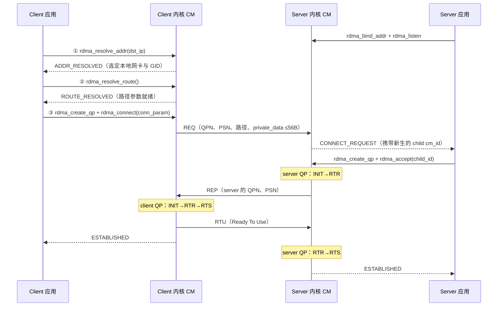

---
tags:
  - 高性能存储
  - RDMA与RoCE
status: 已完成
---

# RDMA CM 与连接建立

> [[4.10 rc_pingpong 最小程序]] 里建连是纯手工的：自己开 TCP 交换 `LID:QPN:PSN:GID`，自己按 [[4.3 QP WQE CQ 状态机]] 的三张参数表推 QP。**RDMA CM（Connection Manager，librdmacm）把这套手工流程标准化**：用 IP:端口 定位对端（不用预先知道 GID/QPN），参数交换走 RDMA 网络自己的连接管理报文，QP 状态机由内核代推——对外呈现一套长得很像 socket 的异步 API。数据面不变：建连完成后照旧用 Verbs 收发。生产 RDMA 程序（NVMe-oF、MPI、各类 RPC 框架）建连几乎都走它，本篇补上从"两台机器互不相识"到"QP 进 RTS"的完整控制面。

前置：[[4.2 Verbs 编程模型]]（五对象与十步流程）、[[4.3 QP WQE CQ 状态机]]（INIT/RTR/RTS 三跳的参数——CM 替你填的正是它们）。

---

## 1. 名词与背景：建连到底要解决哪三件事

回看手工建连，缺的从来不是"发几条消息"，而是三件结构性的事【事实】：

1. **寻址**：应用只有对端 IP，但 Verbs 需要的是 GID（RoCE 的网络身份，[[4.6 RoCE 与 InfiniBand]]）、对端 QPN、路径参数——谁来做"IP → RDMA 世界坐标"的翻译？
2. **参数交换**：QPN、起始 PSN 这些值双方各自生成，必须有一条**带外通道**互换——rc_pingpong 临时开 TCP 是玩具做法，生产需要标准协议；
3. **状态机推进**：三次 `ibv_modify_qp` 的十几个参数（[[4.3 QP WQE CQ 状态机]] §2）填错一位就是 EINVAL 或静默不通——谁来保证两端按正确顺序、用对方的参数各自推进？

RDMA CM 的回答是一个**控制面中间件**：用户态 `librdmacm` + 内核 CM 模块，参数交换用 IB 定义的 CM 报文（REQ/REP/RTU 等管理数据报，走 RDMA 网络自身；RoCEv2 下与数据同样封装在 UDP/4791 里【实现】）。类比一句话：**Verbs 是数据面的 read/write，RDMA CM 是控制面的 connect/accept/listen**——但要立刻记住差异：它是纯异步、事件驱动的，没有一个调用会直接"返回连接"。

对象模型两件套【事实】：

| 对象 | 类比 | 说明 |
| --- | --- | --- |
| `rdma_cm_id` | socket fd | 一条连接（或一个 listen 端点）的句柄；建连后其 `->qp`、`->verbs` 字段挂着数据面对象 |
| `rdma_event_channel` | 一个专发连接事件的 fd | 所有异步结果（解析完成、连接请求、建立、断开、出错）都以事件形式从这里读出 |

`rdma_get_cm_event()` 默认阻塞读；channel 底层是个真 fd，可以丢进 epoll 与其他 IO 统一多路复用——控制面事件循环与 [[13.6.2 Reactor 模式]] 的套路完全同构【实践】。

---

## 2. 建连全流程：每一步 API 对应一个事件

客户端四步、服务端三步，每个异步 API 的结果都是 channel 里的一个事件：



逐步拆解【事实】：

1. **`rdma_resolve_addr`（IP → 设备/GID）**：查路由表决定从哪张 RDMA 网卡出去，把 `cm_id` **绑定到该设备与源 GID**。这一步定音之后 PD、QP 都必须建在这个设备上——多网卡机器上"连哪个 IP"就隐式选了物理口【实现】；
2. **`rdma_resolve_route`（拿路径）**：RoCE 下做邻居解析（下一跳 MAC），IB 下向子网管理器查 path record（MTU、SL 等）。结果填进 `cm_id` 内部，将来直接变成 RTR 那一跳的地址向量；
3. **`rdma_connect` → REQ**：内核 CM 把本端 QPN、随机 PSN、路径信息、最多 **56 字节 private_data**（RDMA_PS_TCP 下【事实】）打包成 REQ 发给对端；
4. **服务端 `CONNECT_REQUEST`**：注意事件里携带一个**新生的 child `cm_id`**（对应 accept 返回新 fd 的语义）——listen id 继续收后续请求，child id 代表这条连接。服务端在 child 上建 QP、`rdma_accept`；
5. **REP / RTU 收尾**：accept 时内核把 server QP 推到 RTR 并回 REP；client 收到 REP 后一口气推 RTR→RTS、回 RTU 并向应用抛 `ESTABLISHED`；server 收 RTU 后推 RTS、也抛 `ESTABLISHED`。至此两端 QP 都在 RTS，数据面开张。

**CM 消息与 QP 状态机的对应**——这张表就是"CM 替你干了 [[4.3 QP WQE CQ 状态机]] §2 哪些活"的答案【事实】：

| CM 动作/消息 | 替你做的 modify_qp | 参数从哪来 |
| --- | --- | --- |
| resolve_addr/route | （还没动 QP）收集 RTR 要的地址向量、MTU | 路由表 + 邻居解析 / SA |
| accept（服务端）/ 收 REP（客户端） | RESET→INIT→RTR | 对端 QPN/PSN 来自 REQ/REP，路径来自第 2 步 |
| 收 REP 后（客户端）/ 收 RTU 后（服务端） | RTR→RTS | timeout/retry 来自 conn_param（§4） |
| rdma_disconnect（DREQ/DREP） | QP → ERR，冲刷在途 WR | — |

---

## 3. 与 TCP 建连对比：形似，五处神不似

| 维度 | TCP connect/accept | RDMA CM | 性质 |
| --- | --- | --- | --- |
| 报文轮次 | SYN / SYN-ACK / ACK | REQ / REP / RTU，同样三程 | 事实 |
| 端口空间 | 内核 TCP 栈全局唯一 | **RDMA_PS_TCP 是独立端口空间**：与内核 TCP 互不冲突、互不可见——`ss` 看不到 RDMA listener | 事实 |
| 建连时能带数据 | 不能（应用数据握手后才走） | REQ/REP 可捎带 private_data（≤56 B），常用于交换协议版本、初始 credit、rkey | 事实 |
| 建连后的语义 | 可靠字节流即刻可用 | 只是 QP 到了 RTS；**RQ 没预投照样 RNR**（[[4.10 rc_pingpong 最小程序]] 的军规原封不动） | 事实 |
| 状态从哪查 | `ss -t` 一目了然 | 无全局工具；状态散在两端 cm_id/QP 里，排障靠事件日志与计数器（§7） | 实践 |

第二行值得停一秒：RDMA CM 的"端口"只是 CM 报文里的服务标识，不经过内核 TCP 栈。所以同一台机器 TCP 服务和 RDMA 服务可以同时 listen 同一个端口号不冲突；反过来，防火墙放行了 TCP 端口不代表放行了 RDMA——RoCEv2 真正要通的是 **UDP 4791**【实践】。

---

## 4. conn_param：五个字段，四个映射到 4.3 的状态机

`rdma_connect`/`rdma_accept` 共用的 `rdma_conn_param` 是两端讨价还价的合同【事实】：

| 字段 | 语义 | 落到 QP 的哪里 |
| --- | --- | --- |
| `responder_resources` | 允许**对端**打到我这的在途 RDMA READ/ATOMIC 数 | 本端 `max_dest_rd_atomic`（RTR 跳） |
| `initiator_depth` | 本端发起的在途 READ/ATOMIC 上限 | 本端 `max_qp_rd_atomic`（RTS 跳），实际取双方协商最小值 |
| `retry_count` | 传输超时重试上限（0–7） | `retry_cnt`（RTS 跳） |
| `rnr_retry_count` | RNR 重试上限，7 = 无限 | `rnr_retry`（RTS 跳，[[4.17 Retry RNR 与 Timeout]]） |
| `private_data` / `_len` | 捎带给对端的应用数据 | 不进 QP，交给对端的 CONNECT_REQUEST/ESTABLISHED 事件 |

【实践】READ 密集的负载（如 NVMe-oF target 端拉数据）记得把 `responder_resources` 从默认拉起来，否则 READ 吞吐被在途数 1 卡死——症状与定位在 [[4.5 Send Recv 与 RDMA Read Write]] §4。

---

## 5. Modern C++：一个能跑的最小客户端

RAII 三件套（channel、id、event）+ 一个"期待某事件"的辅助函数，整个建连流程就能写成直线代码。服务端骨架同构（bind/listen 后循环收 CONNECT_REQUEST），此处省略；现成对端用 `rping -s` 即可（§6）。

```cpp
// cm_client.cpp —— rdma_cm 客户端骨架: 解析 → 建 QP → 连接 → 断开
// 编译: g++ -std=c++23 -Wall -Wextra -o cm_client cm_client.cpp -lrdmacm -libverbs
// 运行: ./cm_client <server_ip> <port>（对端可用 rping -s -p <port> 充当）
#include <arpa/inet.h>
#include <rdma/rdma_cma.h>

#include <cerrno>
#include <cstdint>
#include <memory>
#include <print>
#include <stdexcept>
#include <string>
#include <system_error>

struct ChannelDeleter {
    void operator()(rdma_event_channel* c) const noexcept { rdma_destroy_event_channel(c); }
};
struct IdDeleter {
    void operator()(rdma_cm_id* id) const noexcept { rdma_destroy_id(id); }
};
struct EventDeleter {
    void operator()(rdma_cm_event* e) const noexcept { rdma_ack_cm_event(e); }
};
using Channel = std::unique_ptr<rdma_event_channel, ChannelDeleter>;
using CmId    = std::unique_ptr<rdma_cm_id, IdDeleter>;
using CmEvent = std::unique_ptr<rdma_cm_event, EventDeleter>;

// 阻塞取一个事件并校验类型；RAII 保证离开作用域必 ack（§8 陷阱 1 的解法）
CmEvent expect(rdma_event_channel* ch, rdma_cm_event_type want) {
    rdma_cm_event* raw{};
    if (rdma_get_cm_event(ch, &raw) != 0) {
        throw std::system_error{errno, std::generic_category(), "rdma_get_cm_event"};
    }
    CmEvent ev{raw};
    if (ev->event != want) {
        throw std::runtime_error{std::string{"期待 "} + rdma_event_str(want) +
                                 ", 收到 " + rdma_event_str(ev->event) +
                                 ", status=" + std::to_string(ev->status)};
    }
    return ev;
}

int main(int argc, char** argv) {
    if (argc != 3) { std::println(stderr, "用法: cm_client <server_ip> <port>"); return 1; }

    Channel ch{rdma_create_event_channel()};
    if (!ch) throw std::system_error{errno, std::generic_category(), "create_event_channel"};

    rdma_cm_id* raw{};
    if (rdma_create_id(ch.get(), &raw, nullptr, RDMA_PS_TCP) != 0) {
        throw std::system_error{errno, std::generic_category(), "rdma_create_id"};
    }
    CmId id{raw};

    sockaddr_in dst{};
    dst.sin_family = AF_INET;
    dst.sin_port   = htons(static_cast<std::uint16_t>(std::stoi(argv[2])));
    if (inet_pton(AF_INET, argv[1], &dst.sin_addr) != 1) throw std::runtime_error{"IP 格式错误"};

    // ① IP → 本地设备 + 源 GID（cm_id 从此绑定这张网卡）
    if (rdma_resolve_addr(id.get(), nullptr, reinterpret_cast<sockaddr*>(&dst), 2000) != 0) {
        throw std::system_error{errno, std::generic_category(), "rdma_resolve_addr"};
    }
    expect(ch.get(), RDMA_CM_EVENT_ADDR_RESOLVED);

    // ② 路径参数（RoCE: 邻居解析；IB: SA path record）
    if (rdma_resolve_route(id.get(), 2000) != 0) {
        throw std::system_error{errno, std::generic_category(), "rdma_resolve_route"};
    }
    expect(ch.get(), RDMA_CM_EVENT_ROUTE_RESOLVED);

    // ③ 建 QP：pd 传 nullptr = 用该设备的默认 PD；此后 QP 状态机归 CM 代管
    ibv_qp_init_attr qia{};
    qia.qp_type = IBV_QPT_RC;
    qia.cap = {.max_send_wr = 16, .max_recv_wr = 16,
               .max_send_sge = 1, .max_recv_sge = 1, .max_inline_data = 0};
    if (rdma_create_qp(id.get(), nullptr, &qia) != 0) {
        throw std::system_error{errno, std::generic_category(), "rdma_create_qp"};
    }

    // ★ 军规不变: 真实程序在此处先把 RQ 预投满（4.10 §2）, 再发起 connect

    rdma_conn_param param{};
    param.responder_resources = 1;   // 允许对端在途 READ 数（§4）
    param.initiator_depth     = 1;
    param.retry_count         = 7;   // 传输重试上限（4.3 retry_cnt）
    param.rnr_retry_count     = 7;   // 7 = RNR 无限重试（4.17）
    if (rdma_connect(id.get(), &param) != 0) {
        throw std::system_error{errno, std::generic_category(), "rdma_connect"};
    }
    expect(ch.get(), RDMA_CM_EVENT_ESTABLISHED);
    std::println("已建连: 从这里开始用 id->qp 走 Verbs 数据面（与 4.10 完全相同）");

    rdma_disconnect(id.get());
    expect(ch.get(), RDMA_CM_EVENT_DISCONNECTED);
    rdma_destroy_qp(id.get());       // 先 QP、后 id（IdDeleter）、最后 channel——声明序的反向
    return 0;
}
```

**关键点**：`expect()` 把异步事件流"拉直"成同步代码，教学清晰；生产程序改成 epoll 监听 channel fd 的真事件循环，同时服务成百上千条 cm_id。`EventDeleter` 里那句 `rdma_ack_cm_event` 是全程最重要的一行——见 §8 陷阱 1。

---

## 6. 可复现实验：三条命令看清控制面

环境：两台带 RoCE 网卡的机器，或单机 soft-RoCE（`rdma link add` 一分钟搭好，[[4.8 soft-RoCE 边界]]）。工具来自 `librdmacm-utils` 包【实践】。

```bash
# 实验一: rping —— librdmacm 的 hello world（server 端）
rping -s -v -C 5                    # 监听所有地址; -C 5 打 5 轮
# client 端:
rping -c -a <server_ip> -v -C 5     # 每轮打印收发内容, 底层就是 §2 的完整流程

# 实验二: 抓包看 REQ/REP/RTU（soft-RoCE 下 CM 报文走内核 UDP 栈, tcpdump 可见）
sudo tcpdump -i <netdev> -w cm.pcap 'udp port 4791' &
rping -c -a <server_ip> -C 1
# Wireshark 打开 cm.pcap: 能按序看到 MAD ConnectRequest/ConnectReply/ReadyToUse,
# REQ 里的 Local QPN / Starting PSN 字段就是 4.10 里手工用 TCP 传的那串数

# 实验三: 故障注入——对端无人 listen
rping -c -a <server_ip> -p 9999 -v  # 没有 server: 收到 REJECTED 事件而非 TCP 式 RST
```

**实验二的解读**是本篇的点睛【实践】：抓到的 CM 报文里能逐字段找到 QPN、PSN、responder_resources——亲眼确认"rc_pingpong 手工交换的参数，CM 用标准报文替你交换了"。注意硬件 RoCE 网卡上数据路径绕过内核，tcpdump 通常什么都看不到；soft-RoCE 恰好因为"慢"（全软件走内核栈）成了最好的观察窗口——这正是 [[4.8 soft-RoCE 边界]] 说的"开发调试价值"。

---

## 7. 失败事件与故障定位

CM 把失败也事件化了——**每个失败事件指向一段明确的路径**，比 TCP 的 ETIMEDOUT 精确得多【实践】：

| 事件 | 卡在哪 | 第一排查动作 |
| --- | --- | --- |
| `ADDR_ERROR` | IP→设备翻译失败 | `ip route get <dst>` 出口是否 RDMA 网卡；`rdma link` 设备状态是否 ACTIVE |
| `ROUTE_ERROR` | 邻居/路径解析失败 | 先 `ping` 通再说（RoCE 依赖以太网可达）；IB 查 SA/子网管理器是否在跑 |
| `REJECTED` | 对端明确拒绝 | 对端没 listen、端口不对，或 accept 参数不兼容；看 `event->status` 拒绝码 |
| `UNREACHABLE` / `CONNECT_ERROR` | REQ 发出无响应 / 握手中途失败 | 防火墙是否放行 UDP 4791；两端 MTU 是否一致（[[4.6 RoCE 与 InfiniBand]]） |
| 建连成功但首个操作卡住 | 不是 CM 的锅 | 对端 RQ 没预投（RNR）或 lkey/rkey 权限问题：[[4.17 Retry RNR 与 Timeout]]、[[4.12 rkey lkey 生命周期]] |
| `DISCONNECTED` | 对端主动断或 QP 出错牵连 | 走重建流程：[[4.19 RDMA 故障恢复与连接重建]] |

断开还有一个冷知识【实现】：`DISCONNECTED` 之后 QP 进入 timewait（防旧包串线，与 TCP TIME_WAIT 动机相同——PSN 各自随机生成也是为这个），CM 随后补一个 `TIMEWAIT_EXIT` 事件；急着复用资源的程序要等它或换新 QP。

---

## 8. 陷阱与误区

> [!warning] 常见错误
> 1. **取了事件不 ack**：每个 `rdma_get_cm_event` 必须配对 `rdma_ack_cm_event`；而 `rdma_destroy_id` 会**阻塞等待**该 id 所有未 ack 的事件——先 destroy 后 ack 的顺序直接死锁。§5 用 RAII deleter 把配对固化。
> 2. **在事件处理线程里同步 destroy 当前 id**：同一个死锁的变体（handler 正拿着未 ack 的事件）。销毁动作扔给另一个线程或 ack 之后再做。
> 3. **对 listen id 建 QP / accept**：CONNECT_REQUEST 事件里的 child id 才代表连接；listen id 只管迎客。忘了这点的症状是第二条连接永远建不上。
> 4. **把 ESTABLISHED 当"可以收了"**：QP 到 RTS ≠ RQ 有 buffer；预投军规先于 connect/accept 执行，否则对端第一发就 RNR。
> 5. **private_data 塞超**：RDMA_PS_TCP 下上限 56 字节，超出静默截断没有报错；大对象（如一组 rkey）建连后用 SEND 传。
> 6. **多网卡机器连错口**：设备绑定由 `resolve_addr` 的路由决定——想走哪张卡，用那张卡的 IP 做目的/源地址，而不是事后指定设备。
> 7. **拿 TCP 防火墙经验放行 RDMA**：RoCEv2 通不通看 UDP 4791；`telnet <ip> <port>` 通了不代表任何事（§3 独立端口空间）。

---

## 9. 关键结论

| 结论 | 性质 |
| --- | --- |
| RDMA CM = 控制面标准件：IP 寻址、CM 报文交换参数、内核代推 QP 状态机；数据面仍是 Verbs | 事实 |
| 一切皆异步事件：API 发起动作，结果从 event channel 读；channel 是 fd，可进 epoll 做 Reactor | 事实 |
| REQ/REP/RTU 三程握手把 rc_pingpong 手工交换的 QPN/PSN/路径标准化；accept/REP/RTU 各触发一段状态机推进 | 事实 |
| RDMA_PS_TCP 端口空间与内核 TCP 完全独立；RoCEv2 的网络前提是 UDP 4791 可达 | 事实 |
| conn_param 五字段中四个直接映射 4.3 的 RTR/RTS 参数，READ 吞吐的闸门 responder_resources 在这谈定 | 事实 |
| ESTABLISHED ≠ 可用：RQ 预投军规不因 CM 而改变 | 事实 |
| 事件必配对 ack，destroy 会等未 ack 事件——这是 librdmacm 排名第一的死锁源 | 实践 |

---

## 关联知识

- [[4.2 Verbs 编程模型]] - CM 建完连后，数据面十步流程原样接管
- [[4.3 QP WQE CQ 状态机]] - CM 代填的三张参数表的原始定义
- [[4.10 rc_pingpong 最小程序]] - 手工建连对照组：CM 自动化的正是它的第一幕
- [[4.6 RoCE 与 InfiniBand]] - GID、UDP 4791 封装与 MTU 一致性
- [[4.8 soft-RoCE 边界]] - 抓包观察 CM 报文的实验环境
- [[4.17 Retry RNR 与 Timeout]] - rnr_retry/retry_count 在数据面的兑现
- [[4.19 RDMA 故障恢复与连接重建]] - DISCONNECTED 之后的下半场

## 参考

- `man 7 rdma_cm` 及各 API 手册页（`rdma_connect`、`rdma_accept`、`rdma_get_cm_event`）
- rdma-core 源码：`librdmacm/examples/`（`rping.c`、`cmatose.c`——本篇 C++ 骨架的 C 原型）
- InfiniBand Architecture Specification：Communication Management（REQ/REP/RTU/DREQ 报文定义）
