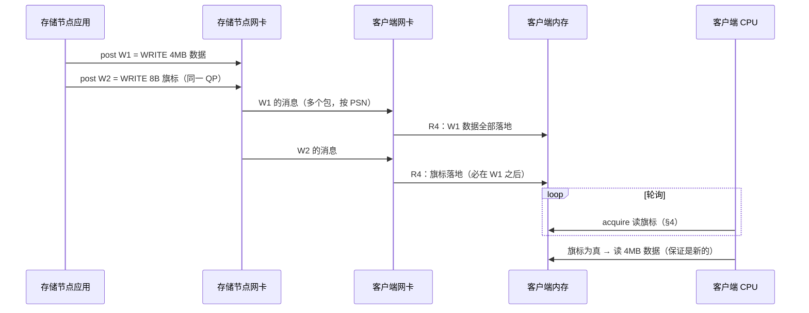

---
tags:
  - 高性能存储
  - RDMA与RoCE
status: 已完成
---

# RDMA 操作的顺序性

> TCP 给你一根字节流：先写的先到，`read()` 返回即可见——顺序与可见性被内核一手包办，你从来不用想。RDMA 把这份保证拆开了：**"提交"有提交的顺序，"完成"有完成的顺序，"落地到远端内存"是第三种顺序，"远端 CPU 读到"又是第四回事**。四种顺序在同一 QP 上有一张精确的规则表，跨 QP 则什么都不保证；而规则表的最后一环——CPU 读内存——已经出了网卡的管辖，归 C++ 内存模型管。所有"写完数据发通知"类协议的正确性，都踩在这张表上；踩错的形态不是崩溃，是偶发的脏数据。

前置：[[4.3 QP WQE CQ 状态机]]（WQE 一生、"同 QP 按序"的初次登场）、[[4.5 Send Recv 与 RDMA Read Write]]（五类 opcode——本篇讲它们混排时的规则）。

---

## 1. 为什么"顺序"要拆成四个词

先用贯穿案例把问题问具体。存储节点给 GPU 客户端回数据（[[4.5 Send Recv 与 RDMA Read Write]] §6）：先 RDMA WRITE 推 4 MB 数据，再用第二条 WRITE 写一个 8 字节旗标；客户端 CPU 轮询旗标，看到旗标置位就去读数据。**问：旗标为真时，4 MB 数据一定已经完整可读吗？**

要回答它，"顺序"必须拆成四个独立的概念：

| 顺序 | 定义 | 谁保证 |
| --- | --- | --- |
| 提交序 | WQE 进入 SQ 的先后（post_send 的调用序） | 你 |
| 执行/完成序 | 本端网卡开始处理各 WQE 的先后；CQE 返回的先后 | 本端网卡（规则见 §2） |
| 落地序 | 数据被置入**远端内存**的先后 | 远端网卡 + PCIe（规则见 §2） |
| 可见序 | 远端 **CPU 程序**读到新值的先后 | 缓存一致性硬件 + 远端程序自己（§4） |

TCP 里四者被内核折叠成一件事：字节流按序、`read()` 拷贝返回即可见。RDMA 里它们真的是四件事——本端 CQE 出来了不代表远端落地顺序符合直觉，落地了也不代表远端那行轮询代码读得到（编译器可能把读缓存在寄存器里）。上面那个问题的答案是"**是——当且仅当两条 WRITE 走同一条 RC QP，且客户端用 acquire 语义读旗标**"；本篇把每个条件的出处讲清。

---

## 2. 同一条 RC QP：规则表

以下是 RC（Reliable Connection）在**同一 QP** 上的全部顺序保证【事实】（IB 规范 Transaction Ordering 一节的工程化转述）：

| # | 规则 | 一句话 |
| --- | --- | --- |
| R1 | SQ 上 WQE 按提交序**开始执行** | 先 post 的先动手 |
| R2 | CQE 按 WQE 提交序返回 | 完成不插队（即使执行有重叠） |
| R3 | **例外**：RDMA READ / ATOMIC 是拆开的事务——后续 WQE 可以在其响应回来**之前**开始执行 | 需要严格先后时给后续 WQE 加 `IBV_SEND_FENCE`（[[4.14 Fence 与内存可见性]]） |
| R4 | 远端（responder）按 PSN 序**逐条消息**执行请求：后一条消息的数据落地不早于前一条消息落地完成 | **消息之间**有序——"数据 WRITE + 旗标 WRITE"的正确性根基 |
| R5 | **单条消息内部**的字节落地顺序无保证 | 厂商行为，不是规范（[[4.5 Send Recv 与 RDMA Read Write]] §3 的警告框） |
| R6 | Recv WQE 按 RQ 的 FIFO 序被消费 | 第 N 条 SEND 落在第 N 个 recv buffer |
| R7 | 远端出 Recv CQE（SEND 或 WRITE_WITH_IMM 触发）时，**此前同 QP 所有消息的数据保证已置入内存、对 CPU 可见** | **CQE 是可见性锚点**——"WRITE + SEND 通知"协议的根基 |

三条规则值得多看一眼：

- **R4 与 R5 的分界线是"消息"**：一条 WQE 产生一条消息（可能拆成多个网络包）。消息之间像串行执行的语句，消息内部像乱序的字节喷洒。所以旗标必须放在**独立的第二条 WRITE** 里——它构成第二条消息，R4 保证它落地时数据消息已落定；把旗标放在数据末尾轮询"尾字节"，赌的是 R5 没保证的厂商行为，换一代网卡就翻车；
- **R7 是最强的锚点**：Recv CQE 不只确认"这条 SEND 到了"，还背书"它之前的一切都到了且可见"。这让"数据 WRITE（不通知）+ SEND 通知"成为最省心的协议——通知到手，前面的一切闭眼可读，连 acquire 轮询都不需要（CQE 收割路径已含必要屏障【实现】）；
- **R3 是规则表上唯一的洞**：READ/ATOMIC 响应在途时后面的 WQE 可以先跑。它的修补（fence）与代价单独成篇（[[4.14 Fence 与内存可见性]]）。

用 Mermaid 把开头那个问题的正确版本画出来：



---

## 3. 跨 QP：什么都不保证

【事实】不同 QP 之间——哪怕同一块网卡、同一个对端、同一个 PD、目标是同一块远端内存——执行、完成、落地**全部无序**。每条 QP 是一台独立的硬件状态机（[[4.3 QP WQE CQ 状态机]] §1），彼此没有任何同步。

这不是学究条款，它直接约束扩展性设计【实践】：

- **多 QP 提升并行度的代价就是失去顺序**（[[4.18 多线程下 QP 使用模型]]）：数据走 QP1、通知走 QP2 的设计，通知可以先于数据到达——这是真实事故形态，且只在负载高时偶发；
- **有序依赖必须收敛**：要么把有依赖的操作放进同一条 QP（用 R4/R7 白拿顺序），要么应用层自己同步——等到前一操作的 CQE 再 post 后一操作（拿完成事件当屏障，代价是一次收割延迟）;
- **分片（shard）设计的顺序边界**：按 key 分 QP 时，同 key 的操作天然同 QP 有序，跨 key 本就无序无妨——让数据分布方案与顺序需求对齐，是免费拿到两者的唯一办法。

---

## 4. 最后一环：网卡把数据放进内存 ≠ 你的程序读得到

R4/R7 管到"数据置入远端内存"为止。从内存到那行 C++ 轮询代码，中间还有两层，各有各的规矩：

**缓存一致性层——硬件兜底**【事实/实现】：现代服务器平台（x86、ARM 服务器规范）上，网卡 DMA 与 CPU 缓存是一致的：DMA 写会使对应缓存行失效或更新，CPU 不需要手动刷缓存就能读到 DMA 新写的数据。这是平台保证，不是你的负担（嵌入式/非一致平台除外——那是另一个世界）。

**编译器与 CPU 乱序层——归你管**【事实】：一致性只保证"读内存时拿到新值"，不保证"你的读真的发生"以及"读的先后"：

- 编译器可以把普通变量的循环读提升成寄存器缓存——`while (!flag) {}` 对普通 `bool` 是死循环经典款；
- 编译器与 CPU 都可能把"读数据"重排到"读旗标"之前——旗标为真、数据却读到旧值（x86 不会做这种读-读重排，ARM 会【实现】——所以这类 bug 常在换 ARM 服务器时爆发）。

解法与多线程共享内存完全同构【类比】：把网卡当成"另一个线程"，旗标就是两个线程间的同步变量——**写侧靠 R4 保证先数据后旗标（网卡替你做了 release 的事），读侧用 acquire 读旗标**：

```cpp
#include <atomic>
#include <cstdint>
#include <span>

// 旗标约定：8 字节对齐单字，0 = 空，非 0 = 数据就绪（值可捎带序号）
// 由对端用独立的一条 RDMA WRITE 写入（R4 保证它落在数据之后）
bool try_consume(std::uint64_t& flag_word, std::span<const std::byte> data) {
    // acquire：旗标读为真之后的所有数据读，不会被重排到它之前
    std::atomic_ref<std::uint64_t> flag{flag_word};
    if (flag.load(std::memory_order_acquire) == 0)
        return false;
    process(data);                            // 此处读到的必是新数据
    flag.store(0, std::memory_order_relaxed); // 归零复用，等下一轮
    return true;
}
```

`std::atomic_ref`（C++20）允许对普通内存做原子访问——正合适：这块内存是注册过的 MR，由网卡 DMA 写、CPU 原子读，不能声明成 `std::atomic` 成员（它要保持平凡布局给网卡写）。旗标用对齐的 8 字节单字还有一个原因【事实】：保证 CPU 读不到"半个旗标"（撕裂读）。

发起端一侧的对称问题：填 buffer 与 post_send 若在**同一线程**，程序序足够（post 是函数调用，之后驱动的 doorbell 屏障接管，[[4.3 QP WQE CQ 状态机]] §3）；若填 buffer 的是**另一个线程**，`ibv_post_send` 不是同步原语——填写线程与提交线程之间要有正常的 happens-before（mutex、atomic 交接），这与把指针递给另一个线程用没有任何区别。

---

## 5. 通知锚点选型：吞吐、尾延迟、CPU 的三方账

规则表给了三种"对端何时能读"的锚点，贯穿案例（存储节点 → GPU 客户端回数据）里三种都用得上，账各不相同【取舍】：

| 锚点 | 依据 | 通知延迟 | 对端 CPU 成本 | 扩展性 |
| --- | --- | --- | --- | --- |
| 独立旗标 WRITE + 轮询 | R4 + acquire | 最低（亚微秒级，无 CQ 机制参与）【量级】 | 烧一个轮询核；每连接一个轮询点 | 差：连接数 × 轮询点，内存带宽与核数线性涨 |
| WRITE_WITH_IMM | R7（出 Recv CQE） | CQE 机制 + 收割路径，微秒级；可事件化 | 轮询 CQ 或 epoll 等事件，可多连接共享一个 CQ | 好：一个收割循环服务全部连接 |
| 数据 WRITE + 补一条 SEND | R7，同上 | 同上，多一条消息的线上成本 | 同上，另占一个 Recv WQE 但可捎带任意元数据 | 好 |

因果链读一遍【实践】：**单条热连接、p99 极端敏感**（如 KV 缓存的读路径）→ 旗标轮询，用一个核买走 CQ 机制与调度的全部抖动；**连接多**（存储节点服务几百客户端）→ 轮询模式的内存带宽（每核每连接反复拉旗标缓存行)与核数不可扩，收敛到 IMM + 共享 CQ，一个收割循环吃掉全部通知，代价是每次通知多几微秒且尾部随 CQ 深度抖。中间态（少量连接、延迟敏感）可以混合：热连接旗标、其余 IMM——锚点是每连接的协议约定，不必全局一致。

---

## 6. 反例集：每条规则各有一种翻车方式

四个真实形态的故障，各踩规则表一条【实践】：

1. **踩 R5——尾字节轮询**：数据与"完成标志"在同一条 WRITE 里，客户端轮询消息最后一个字节。旧网卡按地址递增落地、碰巧一直对；换新网卡/启用新特性后字节喷洒顺序变化，偶发读到"旗标真、中段旧"的脏块。症状随硬件换代出现，极难归因；
2. **踩 §3——双 QP 分家**：数据 QP 与通知 QP 分开以"隔离大小流量"，低负载时通知总是后到（碰巧），高峰期数据 QP 拥塞、通知先到，客户端读到旧数据。压测不到位就上线的经典；
3. **踩 R3——READ 后立即转发**：READ 拉回远端数据，紧接着（同 QP）SEND 把它转给对端，未加 fence——SEND 的 gather 可能读到 READ 落地前的旧 buffer。细节与修法在 [[4.14 Fence 与内存可见性]]；
4. **踩 §4——普通变量轮询**：旗标是普通 `uint64_t`，`-O2` 下编译器把读提出循环，永远看不到置位；或 ARM 上数据读被重排到旗标读之前。加 `std::atomic_ref` + acquire 后消失。曾经靠 `volatile` 碰巧能跑的代码也属此类——`volatile` 挡编译器不挡 CPU 重排【事实】。

---

## 7. 排障清单：症状 → 原因 → 检查

| 症状 | 常见原因 | 检查动作 |
| --- | --- | --- |
| 旗标为真、数据偶发是旧的 | 旗标与数据同一条 WRITE（R5）；旗标走了另一条 QP（§3）；读侧缺 acquire（§4） | 确认旗标是独立 WRITE 且与数据同 QP；读侧上 `atomic_ref` acquire；ARM 上重点怀疑重排 |
| 轮询循环永不退出 | 编译器缓存了普通变量的读 | 反汇编看循环体有没有真 load；换 atomic |
| 通知先于数据到达 | 数据与通知不同 QP | 收敛到同一 QP，或应用层等数据侧 CQE 再发通知 |
| READ 后转发的内容偶发陈旧 | R3：后续 WQE 旁路了在途 READ | 给后续 WQE 加 `IBV_SEND_FENCE`（[[4.14 Fence 与内存可见性]]） |
| 换网卡/驱动后才出现的脏数据 | 之前依赖 R5 未保证的厂商落地顺序 | 全面排查"单消息内轮询"模式 |
| IMM 通知延迟远大于旗标轮询 | CQE + 收割/事件路径的固有成本 | 属预期（§5 的账）；p99 敏感的热连接换旗标轮询 |
| 多线程 post 后对端读到半旧数据 | 填 buffer 线程与 post 线程之间无 happens-before | 检查跨线程交接的同步（§4 末段） |

---

## 8. 陷阱与误区

> [!warning] 常见错误
> 1. **把本端 WRITE 的 CQE 当成"对端已能读"**：CQE 是发起端的记账（可靠送达），对端 CPU 的可见锚点只能是对端自己的东西——它的 Recv CQE（R7）或它 acquire 读到的旗标（R4）。
> 2. **单条消息内轮询任何位置**：R5 没有字节序保证。"一直没出过错"只说明当前网卡的落地习惯，不是协议正确性。
> 3. **默认跨 QP 有序**："同一块网卡发出的总该有序吧"——没有。多 QP 就是多台互不相识的状态机。
> 4. **拿 `volatile` 当同步**：它只拦编译器优化，拦不住 CPU 乱序，x86 上碰巧能跑、ARM 上翻车。同步语义只能来自 atomic + memory_order。
> 5. **忘了网卡是"另一个线程"**：DMA 写入的内存与另一个线程写的内存，在 C++ 内存模型面前地位相同——凡是多线程要同步的地方，网卡参与时同样要同步。
> 6. **把顺序问题留给压测**：§6 的四个反例全部是"低负载碰巧正确、高峰或换硬件才发作"——顺序正确性只能来自规则表推导，压测只能提高侥幸的成本。

---

## 9. 关键结论

| 结论 | 性质 |
| --- | --- |
| 顺序拆四层：提交序、完成序、落地序、可见序——TCP 把四者折叠，RDMA 要求分开推理 | 事实 |
| 同 RC QP：提交序 = 执行开始序 = 完成序；远端按消息序落地；READ/ATOMIC 可被旁路（fence 治之） | 事实 |
| 消息之间有序、消息之内无序——旗标必须是独立的一条 WRITE | 事实（约束） |
| Recv CQE 是最强可见性锚点：它背书此前同 QP 全部消息已落地可见 | 事实 |
| 跨 QP 一切无序；有序依赖要么收敛同 QP，要么等 CQE 软件串接 | 事实 / 实践结论 |
| 网卡数据落进内存后，缓存一致性归硬件，编译器/CPU 重排归你：旗标读必须 acquire，网卡即"另一个线程" | 事实 / 类比 |
| 通知锚点三选一：旗标轮询买最低延迟烧核不可扩，IMM/SEND 走 CQE 可扩但多几微秒——按连接数与 p99 需求选 | 取舍 / 实践结论 |

---

## 关联知识

- [[4.3 QP WQE CQ 状态机]] - "同 QP 按序、READ 要 FENCE"的初次登场与 WQE 力学
- [[4.5 Send Recv 与 RDMA Read Write]] - 五类操作的语义与通知三方案的原始对比
- [[4.14 Fence 与内存可见性]] - R3 这个洞的修补、代价与端到端可见性链
- [[4.15 Signaled Unsignaled WR]] - 完成序在收割侧的省略技巧
- [[4.18 多线程下 QP 使用模型]] - 多 QP 扩展与顺序边界的设计矛盾
- [[0.1 CPU Cache Cache Line 与内存屏障]] - acquire/release 与缓存一致性的地基
- [[5.3 Host 与 Target]] - 工业协议对这些规则的运用

## 参考

- InfiniBand Architecture Specification：Transaction Ordering（同 QP 顺序规则的原文）
- RDMA Aware Networks Programming User Manual（NVIDIA/Mellanox）：ordering 与 completion 语义
- C++ 标准 `[atomics.ref.generic]`：`std::atomic_ref` 与 memory_order
