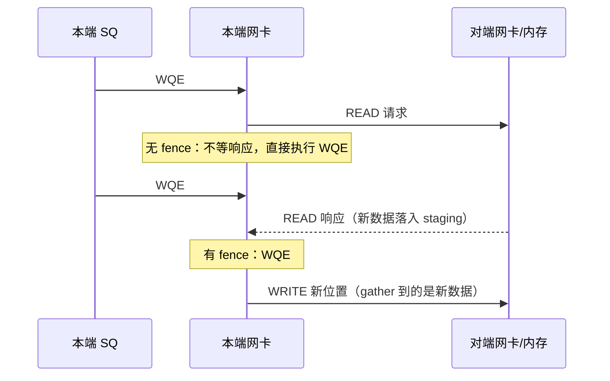

---
tags:
  - 高性能存储
  - RDMA与RoCE
status: 已完成
---

# Fence 与内存可见性

> [[4.13 RDMA 操作顺序性]] 的规则表留了一个洞（R3）：RDMA READ / ATOMIC 是拆开的事务，后续 WQE 可以在响应回来之前开始执行。`IBV_SEND_FENCE` 就是堵这个洞的闸——**让打了标记的 WQE 等到此前所有 READ/ATOMIC 的响应全部到齐才开始执行，仅此而已**。它名字里带 fence，却与 CPU 内存屏障不在同一层：不发布任何可见性、不管远端、不跨 QP。本篇讲清它的精确语义与真实代价（一次 fence ≈ 白付一个 RTT 的流水线排空），再把"写数据→写旗标"协议从发起端 CPU 到对端 CPU 的**七环可见性链**摊开——每一环有一个负责机制，错把归自己的环当成别人兜底，就是一个只在高峰期发作的静默 bug。

前置：[[4.13 RDMA 操作顺序性]]（四种顺序与规则表——本篇直接引用 R3/R4/R7）、[[0.1 CPU Cache Cache Line 与内存屏障]]（release/acquire——对照与交接的对象）。

---

## 1. Fence 治什么病：一个具体的 gather 竞态

先看没有 fence 会坏在哪。贯穿案例的存储节点做**服务端内数据搬运**（副本整理：把客户端内存里旧位置的数据搬到新位置，数据不过节点 CPU）：

1. WQE#1：RDMA READ——把对端旧位置的 1 MB 读进本地 staging buffer；
2. WQE#2：RDMA WRITE——把 staging buffer 写到对端新位置。

同一条 QP、按序提交。按 [[4.13 RDMA 操作顺序性]] R1，WQE#2 确实在 WQE#1 之后**开始执行**——但 R3 说 READ 是拆开的事务：网卡发出 READ 请求后不必等响应，立刻可以执行 WQE#2 的第一步——**gather：按 lkey 把 staging buffer 的内容 DMA 读出来准备发送**。此时 READ 的响应数据可能还在网络上，staging 里躺着上一轮的旧内容。结果：把旧数据原样写到新位置，零错误码【事实】。

修法一行：给 WQE#2 的 `send_flags` 加 `IBV_SEND_FENCE`。语义【事实】：**该 WQE 挂起，直到本 SQ 上所有在途 READ/ATOMIC 的响应全部返回，才开始执行**。staging 必然已装着新数据，gather 读到的就是对的。



---

## 2. 精确语义：是什么、不是什么

| 问题 | 答案 | 性质 |
| --- | --- | --- |
| 作用对象 | 打标记的那一个 WQE，相对**同一 SQ** 上在途的 READ/ATOMIC | 事实 |
| 对 SEND/WRITE 之间的顺序有影响吗 | 没有——它们本来就按提交序开始执行（R1），fence 不增加任何东西 | 事实 |
| 是远端可见性屏障吗 | **不是**。远端落地与可见由 R4/R7 管，fence 全程只在发起端 SQ 里起作用 | 事实 |
| 跨 QP 有效吗 | 无效。别的 QP 的 READ 与它无关 | 事实 |
| 会刷新 CPU 缓存 / 影响 C++ 内存序吗 | 完全不会。它是网卡指令流水线的 stall，不触碰 CPU 内存模型 | 事实 |
| 与 signaled 有关系吗 | 正交。fence 管"何时开始执行"，signaled 管"完成后要不要 CQE"（[[4.15 Signaled Unsignaled WR]]） | 事实 |
| 什么时候免费 | SQ 上没有在途 READ/ATOMIC 时，fence 不等任何东西 | 实现 |

一句对照收尾【类比】：CPU 的 `mfence`/release-acquire 管的是**可见性发布**（我的写别人何时看得到）；`IBV_SEND_FENCE` 管的是**执行依赖**（后一条指令等前一条的"响应"回来）——更像在乱序 CPU 里等一条 load 的数据返回再发射依赖它的指令，而不是一个内存屏障。名字撞了，层级和语义都不同。

---

## 3. 代价：fence = 主动排空流水线

RC QP 允许多条 READ 并行在途（窗口由 `max_qp_rd_atomic` 协商，[[4.5 Send Recv 与 RDMA Read Write]] §4）——吞吐靠"窗口 ÷ RTT"撑起来。fence 的执行方式是把这条流水线**抽干**【事实】：打标记的 WQE 以及它之后的所有 WQE（R1 按序开始）都停住，等在途 READ 全部归来。

算一笔量级账【量级】：设网络 RTT + 远端 PCIe ≈ 5 µs。

- 无 fence、窗口 16 的 READ 流：约 16 ÷ 5 µs ≈ 320 万次/秒的 READ 完成率；
- 每对 READ→WRITE 都加 fence 的依赖链：每对操作至少付一个完整 RTT 的串行等待，单 QP 上限 ≈ 1 ÷ 5 µs = 20 万对/秒——**与链路带宽无关**，带宽再翻十倍也是这个数；
- 且 fence 是队头阻塞：同一条 SQ 上毫不相干的其他 WQE（别的请求的 WRITE、心跳 SEND）一并陪等——**尾延迟被传染**：一次远端 PCIe 抖动（比如对端在跑 MTT miss，[[4.4 内存注册与零拷贝]] §2）拉长一条 READ，整条 SQ 后面的所有操作的 p99 一起隆起。

替代方案与取舍【取舍】：

| 方案 | 机制 | 吞吐 | CPU | 适用 |
| --- | --- | --- | --- | --- |
| fence | 硬件自动等，零软件参与 | 依赖链串行化（1/RTT） | 零 | 依赖链稀疏；或专用 QP 上纯跑依赖链、无无辜流量 |
| 软件串接 | 等 READ 的 CQE 再 post 后续 WQE | 同样串行，但**只串这条链**——SQ 其他流量不受阻 | 收割 + 状态机成本；多一次收割延迟 | 共享 QP 上有无关流量；链上要做 CPU 计算时本来就得等 |
| 消除依赖 | 协议改形：让数据端直接 WRITE 到最终位置，根本不产生 READ→用结果的链 | 恢复全流水线 | 协议改造成本 | 能改就改——最好的 fence 是不需要 fence（[[4.5 Send Recv 与 RDMA Read Write]] §4 "数据端发起 WRITE"同一结论） |
| 多链交错 | 依赖链拆到多条 QP / 多条链轮转，各链内部 fence，链间并行 | 链数 × (1/RTT)，可逼近带宽 | 调度与连接数成本（QP 上下文压力，[[4.3 QP WQE CQ 状态机]] §1） | 副本迁移这类批量搬运 |

注意一个隐藏差别【实践】：软件串接方案里"等 CQE 再 post"，除了解依赖，还顺手拿到了错误处理点（READ 失败可以不发 WRITE）；fence 方案里 READ 失败 → QP 进 ERR、后续 WQE 全部 FLUSH（[[4.3 QP WQE CQ 状态机]] §6），链的"半途失败"要靠收割侧统一兜底。依赖链带业务分支时，软件串接往往是更诚实的写法。

---

## 4. "写数据→写旗标"的七环可见性链

fence 只是链条中的一环。把贯穿案例的旗标协议（[[4.13 RDMA 操作顺序性]] §1 的问题）从发起端 CPU 一路走到对端 CPU，共七环——每环一个负责机制，任何一环靠"假设"而不是"保证"，就是一个潜伏 bug：

![[图片/SVG/8_4_14_1.svg|900]]

| 环 | 内容 | 负责机制 | 归谁 |
| --- | --- | --- | --- |
| ① | 填 buffer 先于 post | 同线程：程序序；跨线程：mutex/atomic 的 happens-before | **你（应用）** |
| ② | WQE 内容先于门铃对网卡可见 | 驱动的写屏障 + doorbell ≈ release（[[4.3 QP WQE CQ 状态机]] §3） | 驱动 |
| ③ | 网卡 gather 读到的 buffer 是新内容 | 缓存一致性互连（DMA 一致）；**若 gather 依赖在途 READ 的结果 → 本篇 fence（R3 的洞）** | 硬件（+你补 fence） |
| ④ | 数据消息先于旗标消息到达并被执行 | RC 按 PSN 有序交付 + responder 按消息序执行（R4）——前提：**同一条 QP** | 协议（+你保证同 QP） |
| ⑤ | 消息数据有序落入对端内存 | 对端网卡按消息序发起 PCIe 写；PCIe posted write 同通道有序 | 硬件 |
| ⑥ | 对端 CPU 缓存观察到 DMA 写 | 服务器平台的 DMA 缓存一致性 | 硬件 |
| ⑦ | 对端程序按"先旗标后数据"的顺序真正执行读 | `std::atomic_ref` acquire 读旗标（[[4.13 RDMA 操作顺序性]] §4） | **你（应用）** |

读这张表的方法【实践】：②⑤⑥ 是驱动与硬件的合同，写对代码就自动成立，出问题概率约等于平台 bug；④ 是协议给的，但**前提（同 QP、独立旗标消息）由你满足**；①③⑦ 是应用的正身责任——三个真实事故形态恰好各占一环：跨线程填 buffer 无同步（①）、READ 结果直接转发无 fence（③）、普通变量轮询（⑦）。所谓"RDMA 程序难写"，具体到可见性上就是这三环。

与 CPU 内存模型的完整对照【类比】：

| RDMA 世界 | CPU/C++ 世界 | 相似点 | 差异 |
| --- | --- | --- | --- |
| doorbell 写（②） | release store | 之前的写全部先可见 | 发布对象是设备，不是别的线程 |
| 收割 CQE（R7） | acquire load | 之后的读看到之前的一切 | 锚点是完成事件，不是变量 |
| `IBV_SEND_FENCE`（③） | 等待 in-flight load 完成再发射依赖指令 | 执行依赖，不是可见性 | 只管 READ/ATOMIC，粒度是 WQE |
| 独立旗标 WRITE（④） | 另一个线程的 release store | 配对 acquire 才闭环 | "线程"是对端网卡 |

---

## 5. Modern C++：fence 链与旗标协议的最小实现

READ→fenced WRITE 用 WR 链一次提交（`next` 串起来，一次 doorbell，[[4.16 Inline Batching 与 Doorbell 优化]] 的省法）；旗标读侧代码在 [[4.13 RDMA 操作顺序性]] §4，此处是写侧与依赖链：

```cpp
#include <infiniband/verbs.h>

#include <cstdint>
#include <span>
#include <system_error>

struct RemoteRegion {          // 对端授权（rkey 的来历见 4.12）
    std::uint64_t addr;
    std::uint32_t rkey;
};

// 服务端内搬运：READ 旧位置 → (FENCE) → WRITE 新位置，数据不过 CPU
// staging 必须是本 QP 同 PD 下注册过的内存（lkey）
void post_copy_chain(ibv_qp* qp, std::span<std::byte> staging,
                     std::uint32_t lkey, RemoteRegion src, RemoteRegion dst,
                     std::uint64_t wr_id) {
    ibv_sge sge{.addr = reinterpret_cast<std::uintptr_t>(staging.data()),
                .length = static_cast<std::uint32_t>(staging.size()),
                .lkey = lkey};

    ibv_send_wr read_wr{};
    read_wr.wr_id               = wr_id;
    read_wr.opcode              = IBV_WR_RDMA_READ;
    read_wr.sg_list             = &sge;
    read_wr.num_sge             = 1;
    read_wr.send_flags          = 0;            // 中间步不必 signaled（4.15）
    read_wr.wr.rdma.remote_addr = src.addr;
    read_wr.wr.rdma.rkey        = src.rkey;

    ibv_send_wr write_wr{};
    write_wr.wr_id      = wr_id + 1;
    write_wr.opcode     = IBV_WR_RDMA_WRITE;
    write_wr.sg_list    = &sge;
    write_wr.num_sge    = 1;
    // FENCE：等本 SQ 在途 READ 全部返回，gather 才开始——没有它，
    // 这条 WRITE 可能把 staging 的旧内容发出去（§1 的竞态）
    write_wr.send_flags = IBV_SEND_FENCE | IBV_SEND_SIGNALED;
    write_wr.wr.rdma.remote_addr = dst.addr;
    write_wr.wr.rdma.rkey        = dst.rkey;

    read_wr.next = &write_wr;   // WR 链：一次 post、一次 doorbell
    ibv_send_wr* bad = nullptr;
    if (int rc = ibv_post_send(qp, &read_wr, &bad); rc != 0)
        throw std::system_error{rc, std::system_category(), "post copy chain"};
}
```

写侧旗标协议只需记住一件事：**数据与旗标是两条独立 WRITE、同一条 QP、按"先数据后旗标"提交**——网卡与协议（环 ②–⑥）替你完成 release 的全部工作，对端 acquire 一读即闭环。

---

## 6. 排障清单：症状 → 原因 → 检查

| 症状 | 常见原因 | 检查动作 |
| --- | --- | --- |
| READ 结果转发/回写出去的内容偶发陈旧 | 缺 fence：后续 WQE 的 gather 旁路了在途 READ（§1） | 依赖 READ 结果的同 QP 后续 WQE 加 `IBV_SEND_FENCE`；或改软件串接 |
| 加了 fence 后吞吐暴跌、p99 隆起 | 流水线排空 + 队头阻塞（§3） | 拆多链交错 / 依赖链挪到专用 QP / 协议改形消除 READ 依赖 |
| 给 WRITE→WRITE 加 fence 想"保序" | 无效动作——它们本来就按序，fence 不解决落地/可见问题 | 落地顺序看 R4（同 QP 独立消息），可见看 acquire（环 ⑦） |
| fence 了但对端还是读到旧数据 | fence 只管本端 SQ；对端可见性是环 ④–⑦ 的事 | 按 §4 的表逐环核对：同 QP？独立旗标消息？acquire？ |
| 依赖链中途失败后行为混乱 | fence 链上 READ 失败 → QP ERR、后续全 FLUSH，没有分支机会 | 带业务分支的链改软件串接（§3 的隐藏差别） |
| 仅 ARM 平台偶发脏读 | 环 ⑦ 缺 acquire——x86 读不重排掩盖了它 | 旗标读上 `std::atomic_ref` + `memory_order_acquire` |
| 跨线程准备数据后对端收到半旧内容 | 环 ①：填 buffer 线程与 post 线程无 happens-before | 交接处补 mutex/atomic（与普通多线程共享数据同规） |

---

## 7. 陷阱与误区

> [!warning] 常见错误
> 1. **把 fence 当内存屏障**：它是网卡 SQ 的执行 stall，不发布可见性、不触碰 CPU 缓存与 C++ 内存序。"加了 fence 所以对端能看到"是层级张冠李戴。
> 2. **该加的地方漏、不该加的地方滥**：只有"同 QP 后续 WQE 消费在途 READ/ATOMIC 结果"这一种场景需要它；WRITE/SEND 之间加 fence 是给自己安慰，READ 流上滥加则每次白付一个 RTT。
> 3. **忘了 fence 的队头阻塞会传染无辜流量**：共享 QP 上一条 fence 让所有后续 WQE 陪等。依赖链要么独占 QP，要么软件串接。
> 4. **地址依赖幻想**：FAA/CAS 返回值决定下一条操作的目标地址时，fence 帮不了你——地址要 CPU 算，必须等 CQE 软件串接。fence 只解决"数据就位"，不解决"参数计算"。
> 5. **七环链只检查了网卡那几环**：①（跨线程填写）与 ⑦（acquire 读）是纯 CPU 问题，却是事故率最高的两环——网卡"另一个线程"的身份最容易被忘记。
> 6. **在 soft-RoCE 上验证顺序性然后上硬件**：软件实现的落地与执行时序远比硬件"温顺"（[[4.8 soft-RoCE 边界]]），§1 的 gather 竞态在 soft-RoCE 上可能永远复现不出来——顺序正确性靠规则推导，不靠单一环境的实验。

---

## 8. 关键结论

| 结论 | 性质 |
| --- | --- |
| `IBV_SEND_FENCE` = 本 SQ 执行屏障：标记的 WQE 等在途 READ/ATOMIC 响应到齐才开始；对 SEND/WRITE 顺序无影响 | 事实 |
| fence 不是内存屏障：不管远端、不跨 QP、不触碰 CPU 内存模型 | 事实 |
| 代价 = 流水线排空 + 队头阻塞：fenced 依赖链吞吐 ≤ 1/RTT，与带宽无关；SQ 上无辜流量的 p99 被传染 | 量级 / 事实 |
| 依赖链四条路：fence（零 CPU）、软件串接（不阻塞无关流量 + 有分支点）、协议改形消依赖（最优）、多链交错（恢复并行） | 取舍 |
| "写数据→写旗标"是七环链：②⑤⑥ 驱动硬件兜底，④ 协议给但前提你保证，①③⑦ 归应用——事故全出在归你的三环 | 事实 / 实践结论 |
| doorbell ≈ release、CQE ≈ acquire、fence ≈ 等 load 返回、旗标 WRITE ≈ 对端线程的 release store——对照成立但层级各异 | 类比 |
| 带业务分支或地址依赖的链只能软件串接；fence 只解决"数据就位" | 实践结论 |

---

## 关联知识

- [[4.13 RDMA 操作顺序性]] - 规则表 R1–R7：fence 堵的洞（R3）与旗标协议依据（R4/R7）
- [[4.5 Send Recv 与 RDMA Read Write]] - READ 的拆开事务本质与"数据端发起 WRITE"的消依赖思路
- [[4.3 QP WQE CQ 状态机]] - doorbell ≈ release、CQE ≈ acquire、错误后的 FLUSH 语义
- [[4.15 Signaled Unsignaled WR]] - 依赖链中间步的 CQE 省略
- [[4.16 Inline Batching 与 Doorbell 优化]] - WR 链与 doorbell 合并
- [[4.12 rkey lkey 生命周期]] - 链上 rkey 的来历与撤销时机
- [[0.1 CPU Cache Cache Line 与内存屏障]] - release/acquire：七环链两端的地基
- [[4.8 soft-RoCE 边界]] - 为什么顺序类 bug 不能靠 soft-RoCE 实验排除

## 参考

- InfiniBand Architecture Specification：Fence 位与 Transaction Ordering
- `man ibv_post_send`：`IBV_SEND_FENCE` 语义
- Kalia et al., *Design Guidelines for High Performance RDMA Systems*（USENIX ATC '16）：fence 与依赖链的性能实测
