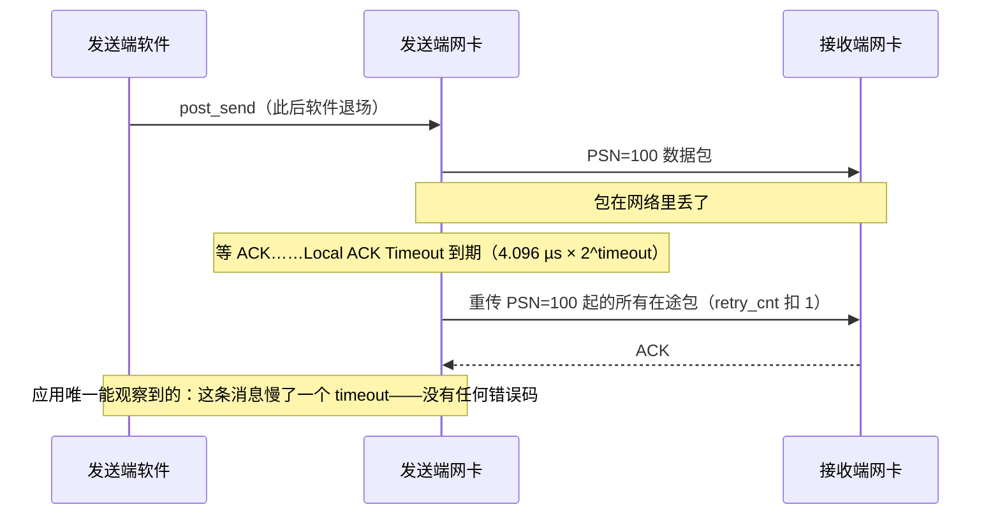
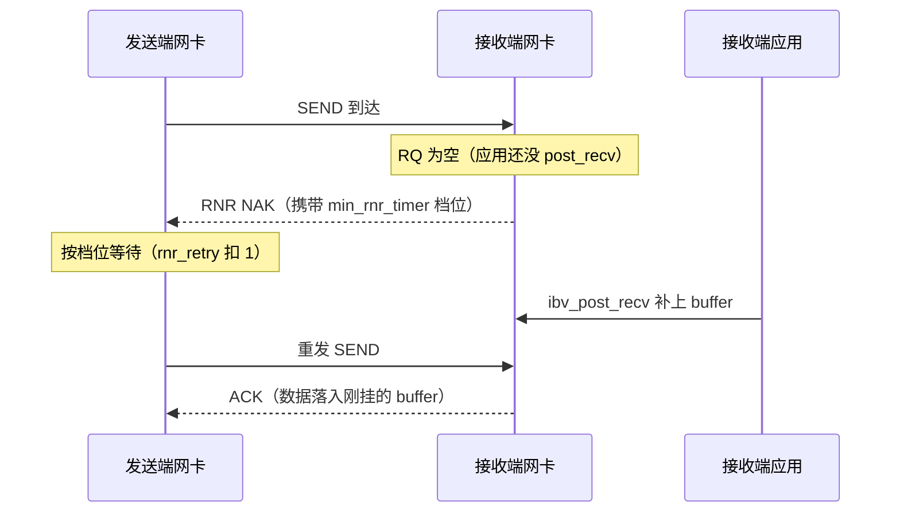

---
tags:
  - 高性能存储
status: 已完成
---

# Retry、RNR 与 Timeout

> RC 的可靠传输住在网卡里（[[4.1 RDMA 为什么快]]），于是重试也住在网卡里：**丢包走 timeout/retry_cnt 这套计数器，对端没准备好走 RNR/rnr_retry 那套，两套完全独立；所有重试对软件全程静默——应用看不到任何错误码，只看到某条消息突然慢了几十毫秒**。这正是 RDMA 集群两类经典疑难的根源：偶发长尾（硬件在替你重传，没人告诉你）与连接假死（无限重试把一个响亮的故障变成安静的挂起）。本篇把每个参数的精确语义、时间公式、触发场景、调优边界和可观测计数器摊开——参数本身在 [[4.3 QP WQE CQ 状态机]] §2 的 modify_qp 三步里喂进去，这里讲每个值意味着什么。

前置：[[4.3 QP WQE CQ 状态机]]（参数在哪一跳喂、耗尽后 QP 进 ERR 的后果）、[[4.6 RoCE 与 InfiniBand]]（这套机制跑在什么网上）、[[4.7 PFC ECN 与 DCQCN]]（网络侧的拥塞机制——与重试互相纠缠）。

---

## 1. 先把名词说直白：两种"没收到回音"

RC（Reliable Connection）里每个包带序号 **PSN**（Packet Sequence Number），接收方网卡用两种应答回话：**ACK**（"收到了"）与 **NAK**（"有问题"，并说明是什么问题）。发送方网卡据此维护两套完全独立的重试计数：

| | 传输重试（transport retry） | RNR 重试（Receiver Not Ready） |
| --- | --- | --- |
| 触发 | 等 ACK 超时（包或 ACK 丢了）、或收到序号错 NAK | 收到 **RNR NAK**：包到了，但对端 RQ 里没有 Recv WQE 可放数据 |
| 直白类比 | 快递在路上丢了 | 快递到了门口，家里没人签收 |
| 计数器 | `retry_cnt`（0–7） | `rnr_retry`（0–7，7 = 无限） |
| 每轮等多久 | Local ACK Timeout（本端 `timeout` 参数） | 对端在 RNR NAK 里通告的档位（对端的 `min_rnr_timer`） |
| 耗尽后的错误 | `IBV_WC_RETRY_EXC_ERR` | `IBV_WC_RNR_RETRY_EXC_ERR` |

关键区分【事实】：**RNR 不是丢包**——它是接收网卡发出的明确否定应答，在完全无损的网络上照样发生（只要对端应用 `post_recv` 跟不上）。看到哪个错误码，排查方向完全不同（§9）。RNR 只涉及双边操作（SEND 需要对端 Recv WQE 接住，[[4.5 Send Recv 与 RDMA Read Write]]）；RDMA WRITE/READ 不消费对端 RQ，不会触发 RNR。

两套计数耗尽的结局相同：错误 CQE 浮出、QP 进 ERR、连接作废，走 [[4.19 RDMA 故障恢复与连接重建]] 的重建流程。

---

## 2. 四个参数：语义、公式与编码陷阱

四个参数都在 [[4.3 QP WQE CQ 状态机]] §2 的 modify_qp 中设置，注意**谁的属性管谁**：`timeout/retry_cnt/rnr_retry` 是发送侧行为（RTR→RTS 时设本端）；`min_rnr_timer` 是接收侧通告（INIT→RTR 时设本端，效果作用在**对端**的重发节奏上）。

| 参数 | 位宽/范围 | 语义 | 时间公式与陷阱 |
| --- | --- | --- | --- |
| `timeout` | 5 bit，0–31 | 本端等 ACK 的超时（Local ACK Timeout） | ≈ 4.096 µs × 2^timeout【事实】；14 ≈ 67 ms。**陷阱：0 = 永不超时**，不是"最快档" |
| `retry_cnt` | 3 bit，0–7 | 传输重试上限 | 放弃前最坏挂起 ≈ (retry_cnt + 1) × timeout【量级】：timeout=14、retry_cnt=7 ⇒ ≈ 0.54 s |
| `rnr_retry` | 3 bit，0–7 | RNR 重试上限 | **陷阱：7 = 无限重试**，不是"7 次" |
| `min_rnr_timer` | 5 bit，0–31 | 本端回 RNR NAK 时叫对方等多久 | 非线性编码【事实】：1 ≈ 0.01 ms 起步递增，12 ≈ 0.64 ms，31 ≈ 491.52 ms；**陷阱：0 是最大档 ≈ 655.36 ms**，不是"不等" |

两个"0 不是你以为的 0"加一个"7 不是 7"，是这组参数最坑人的地方——modify_qp 不会对语义陷阱报错，EINVAL 只管掩码与范围（[[4.3 QP WQE CQ 状态机]] §9）。

---

## 3. 两条时序：硬件在替你做什么

传输重试——软件全程不在场：



RNR 重试——对端应用迟到，网卡替它兜住：



第一张图里"重传 PSN=100 起的所有在途包"值得停一下【事实】：RC 的重传是 **go-back-N 风格**——从丢失的 PSN 起整段重发，而不是只补那一个包。一次丢包的代价是"重传一串"，丢包率稍高，有效吞吐就崩塌式下降。这是 [[4.6 RoCE 与 InfiniBand]] "RoCE 要一张几乎不丢包的网"的传输层根源，也是 [[4.7 PFC ECN 与 DCQCN]] 整篇存在的理由。

---

## 4. 静默性：长尾与假死的制造机

把上面两条时序的工程后果说透【事实/量级】：

- **重试期间没有任何软件可见的事件**。没有错误码、没有 CQE、没有日志——只有那条消息的完成时间变成了"正常时间 + n × timeout"。timeout=14 时，一轮重传就是 +67 ms：p99 突然冒出几十毫秒的毛刺、错误率却是零，第一嫌疑人就是硬件重传（§9 第一行）；
- **耗尽才报错，而耗尽可以被配置成"永不"**。`rnr_retry=7`（无限）+ 对端不再 `post_recv` = 这条 QP 上的发送**永远静默地等下去**——不报错、不超时、不恢复，就是"连接假死"。`timeout=0` 同理；
- **上层超时必须罩住底层重试【实践】**。应用/RPC 层的超时如果小于 (retry_cnt+1)×timeout，会出现"上层已放弃并重建连接，旧 QP 还在底下重传"的双层错配——重建后 PSN 重新协商能挡住旧包（[[4.19 RDMA 故障恢复与连接重建]]），但资源与排查噪音已经付出。规则：**上层超时 > 底层最坏挂起时间，或者把底层参数调小让它先报错**。

---

## 5. 触发场景：什么时候会走到这两条路径

| 路径 | 典型触发 | 备注 |
| --- | --- | --- |
| 传输重试 | 网络真丢包（无损配置失效、PFC/ECN 没配好，[[4.7 PFC ECN 与 DCQCN]]） | 最常见 |
| 传输重试 | 对端 QP 没到 RTR、对端宕机、路径中断 | 重试必然耗尽 → `RETRY_EXC_ERR`（[[4.3 QP WQE CQ 状态机]] §8） |
| 传输重试 | 拥塞把 ACK 拖过 timeout（假超时） | 包没丢也重传，进一步加剧拥塞——恶性循环 |
| RNR | 对端 `post_recv` 速度跟不上进包速度 | 消费慢：加深 RQ、上 SRQ、查对端收割线程 |
| RNR | 启动竞态：连接刚建好，对端还没灌 RQ 就收到第一条 SEND | "先灌满 RQ 再放对端发"的纪律（[[4.3 QP WQE CQ 状态机]] §2、[[4.11 RDMA CM 与连接建立]]） |
| RNR | 对端收割线程卡死 / 死锁，RQ 消费停止 | 假死的常见根因，配 `rnr_retry=7` 就是无限等 |

---

## 6. 调优边界：每个方向的代价

**【取舍】** 这组参数没有"最优值"，只有"你想让故障以什么方式浮出"：

| 调法 | 买到什么 | 付出什么 |
| --- | --- | --- |
| `timeout` 调小 | 真丢包时更快重传、更快报错 | 拥塞/PFC 暂停拉长 RTT 时**假超时**：无谓重传加剧拥塞（对端 `duplicate_request` 计数上涨是它的指纹） |
| `timeout` 调大 | 不误伤慢 ACK | 每轮重传等更久，长尾更长、故障发现更慢 |
| `retry_cnt` 调小 | 故障快速浮出为错误 | 瞬时抖动（交换机切换、短暂拥塞）也会打死连接，重建有成本（[[4.19 RDMA 故障恢复与连接重建]]） |
| `rnr_retry=7`（无限） | 对端慢启动/抖动全兜住，不误杀 | 对端真死时连接假死，靠上层心跳才能发现 |
| `rnr_retry` 有限 | 对端异常快速报错 | 正常的消费抖动也可能触发 `RNR_RETRY_EXC_ERR` |
| `min_rnr_timer` 调小 | RNR 后恢复快 | 对端重发更频繁，RQ 持续紧张时是无效流量 |

实践共识【实践】：**开发期用有限、偏小的值让 bug 当场爆炸；生产期兜底放宽，但必须配独立的应用层心跳/探活**——传输层的无限重试不是探活机制，恰恰是掩盖故障的机制（[[4.3 QP WQE CQ 状态机]] §9 同一结论的展开）。timeout 的下界则由网络定：必须罩住"最坏拥塞下的 RTT"，包括 PFC 暂停可能贡献的时间（[[4.7 PFC ECN 与 DCQCN]]）。

---

## 7. 可观测计数器：静默重试的显影液

重试对应用静默，但网卡在数（以下为 mlx5 的命名与路径【实现】，其他厂商名字不同、语义类似）：

`/sys/class/infiniband/<dev>/ports/<port>/hw_counters/` 下：

| 计数器 | 涨了说明什么 | 视角 |
| --- | --- | --- |
| `local_ack_timeout_err` | 本端等 ACK 超时、发生了重传——长尾毛刺的直接指纹 | 本端=发送方 |
| `packet_seq_err` / `out_of_sequence` | 收到的 PSN 不连续——路上有丢包或乱序 | 本端=接收方 |
| `rnr_nak_retry_err` | 本端收到了 RNR NAK——对端 RQ 在空转 | 本端=发送方 |
| `out_of_buffer` | 本端 RQ 空时来了包——自己就是那个"没人签收"的一方 | 本端=接收方 |
| `duplicate_request` | 收到重复包——自己的 ACK 丢了或对端假超时 | 本端=接收方 |

配套工具【实现】：`rdma statistic qp show`（iproute2 的 rdma 工具，可看到 per-QP 统计）；网络侧的 PFC pause 帧计数走 `ethtool -S`（哪些口在暂停，[[4.7 PFC ECN 与 DCQCN]]）。排障时把两侧机器的这几个计数器**先抄一遍基线，复现问题后再抄一遍**，差值就是答案的一半。

---

## 8. 实验：亲手制造一次重试

两个都能在便宜环境里复现（变量控制原则同 [[4.9 ibv_perftest 基准实验]]）：

1. **RNR 复现**：拿 [[4.10 rc_pingpong 最小程序]] 改造接收端——在 `post_recv` 前故意 `sleep`。预期：发送端不报错但延迟出现对端 `min_rnr_timer` 档位的整数倍台阶；发送端 `rnr_nak_retry_err`、接收端 `out_of_buffer` 同步上涨。再把发送端 `rnr_retry` 改小，同一场景变成 `IBV_WC_RNR_RETRY_EXC_ERR`——体会"同一故障、两种浮出方式"；
2. **传输重试复现**：在 soft-RoCE（[[4.8 soft-RoCE 边界]]）环境用 `tc netem loss` 给链路注入百分之几的丢包。预期：吞吐崩塌式下降（go-back-N 的放大效应，§3），延迟出现 timeout 台阶；把丢包率再调高或把 `retry_cnt` 调小，看到 `IBV_WC_RETRY_EXC_ERR`。注意 rxe 环境计数器路径与硬件不同，观察行为与错误码即可，别拿它的性能数字外推（[[4.8 soft-RoCE 边界]]）。

---

## 9. 参数计算小工具（Modern C++）

把"这组参数意味着最坏挂多久"变成编译期可断言的数字，配置评审时直接算账：

```cpp
#include <chrono>
#include <cstdint>

struct RcRetryPolicy {
    std::uint8_t timeout;    // 0 = 永不超时；否则 4.096 µs × 2^timeout
    std::uint8_t retry_cnt;  // 0–7
    std::uint8_t rnr_retry;  // 0–7，7 = 无限

    static constexpr std::chrono::nanoseconds ack_timeout(std::uint8_t t) {
        // 调用方保证 t != 0：0 的语义是"无限"，没有对应的有限时长
        return std::chrono::nanoseconds{4096} * (1ULL << t);
    }

    // 传输层放弃并报 RETRY_EXC_ERR 前的最坏挂起（近似：每轮等满一个 timeout）
    constexpr std::chrono::nanoseconds worst_transport_hang() const {
        return ack_timeout(timeout) * (retry_cnt + 1);
    }
};

// timeout=14（≈67 ms）、retry_cnt=7：报错前最坏挂 ≈ 0.54 s——
// 上层 RPC 超时必须大于它，否则出现双层超时错配（§4）
static_assert(RcRetryPolicy{.timeout = 14, .retry_cnt = 7, .rnr_retry = 0}
                  .worst_transport_hang() > std::chrono::milliseconds{500});
```

---

## 10. 排障清单：症状 → 原因 → 检查

| 症状 | 常见原因 | 检查动作 |
| --- | --- | --- |
| p99 偶发几十毫秒毛刺，错误率为零 | 硬件静默重传（一轮 ≈ 一个 timeout） | 两端抄 `local_ack_timeout_err` / `packet_seq_err` 基线与差值；同步查 `ethtool -S` 的 pause 计数（[[4.7 PFC ECN 与 DCQCN]]） |
| `IBV_WC_RETRY_EXC_ERR` | 对端未到 RTR / 宕机 / 路径断 / MTU 不一致 / 持续丢包 | 按 [[4.3 QP WQE CQ 状态机]] §8 对应行逐项排；计数器区分"从没通过"与"通着通着断了" |
| `IBV_WC_RNR_RETRY_EXC_ERR` | 对端 RQ 空：消费慢、忘投递、收割线程卡死 | 对端 `out_of_buffer` 是否上涨；RQ 深度与 `post_recv` 时序；考虑 SRQ |
| 连接假死：不报错、不前进 | `rnr_retry=7` + 对端不灌 RQ；或 `timeout=0` | `ibv_query_qp` 核对实际生效的参数；开发环境一律用有限值 |
| 建连后第一条消息就 RNR | 启动竞态：对端 RTR 后还没灌 RQ | 协议里加"RQ 已就绪"的带外确认，或依赖 [[4.11 RDMA CM 与连接建立]] 的建立时序先灌再通 |
| 上层已超时重建，底层还在重传 | 双层超时错配 | 上层超时 > `worst_transport_hang()`（§9）；或调小底层参数让硬件先报错 |
| 对端 `duplicate_request` 持续上涨 | 本端假超时重传（timeout 太小或反向路径拥塞丢 ACK） | 加大 timeout 重测；查反向路径拥塞与 ECN 配置 |
| 调大 timeout 后故障发现明显变慢 | 取舍本身，不是 bug | 探活交给应用层心跳，别指望传输层超时兼职（§6） |

---

## 11. 陷阱与误区

> [!warning] 常见错误
> 1. **三个编码陷阱**：`timeout=0` 是永不超时；`rnr_retry=7` 是无限重试；`min_rnr_timer=0` 是最大档 655.36 ms。三个"边界值"的语义都与直觉相反，modify_qp 不会替你报错。
> 2. **把 RNR 当丢包排查**：RNR 是明确的 NAK，无损网络照样发生；方向在对端应用的 `post_recv` 节奏，不在交换机。
> 3. **以为重试会留下日志**：重试只在硬件计数器里留痕。监控体系必须采集 hw_counters，只盯错误码等于闭着眼睛。
> 4. **无限重试当高可用**：`rnr_retry=7` 不是容错，是把故障从"报错"改写成"假死"；没有配套心跳就是定时炸弹。
> 5. **忽略 go-back-N 的放大**：按"丢包率 × 消息数"估算重传成本会严重低估——丢一个包重传一串，吞吐对丢包率极度敏感，这正是 RoCE 网络必须近无损的原因（[[4.6 RoCE 与 InfiniBand]]、[[4.7 PFC ECN 与 DCQCN]]）。
> 6. **拿单一参数救系统性问题**：持续 RNR 说明消费能力不足（该加深 RQ/SRQ、查对端线程模型 [[4.18 多线程下 QP 使用模型]]）；持续传输重试说明网不无损（该修 [[4.7 PFC ECN 与 DCQCN]] 的配置）——调重试参数只改变故障的表现形式。

---

## 12. 关键结论

| 结论 | 性质 |
| --- | --- |
| 两套独立重试：丢包 → timeout/retry_cnt；对端 RQ 空 → RNR NAK/rnr_retry；耗尽各报各的错误码，QP 进 ERR | 事实 |
| Local ACK Timeout ≈ 4.096 µs × 2^timeout；最坏挂起 ≈ (retry_cnt+1) × timeout | 事实 / 量级 |
| 三个反直觉编码：timeout 0=无限、rnr_retry 7=无限、min_rnr_timer 0=最大档 | 事实（陷阱） |
| 重试对软件全程静默：长尾毛刺 + 零错误率 = 先查 hw_counters | 事实 / 实践结论 |
| RC 重传是 go-back-N 风格：吞吐对丢包率极敏感——"RoCE 要无损"的传输层根源 | 事实 |
| 上层超时必须罩住底层最坏挂起；探活靠应用层心跳，不靠传输层参数 | 实践结论 |
| 开发期有限小值让 bug 爆炸，生产期放宽 + 心跳兜底；RNR/丢包的根治都在参数之外 | 取舍 |

---

## 关联知识

- [[4.3 QP WQE CQ 状态机]] - 参数在 modify_qp 哪一跳喂入；耗尽后 ERR 与冲刷语义
- [[4.19 RDMA 故障恢复与连接重建]] - 重试耗尽之后的唯一出路
- [[4.7 PFC ECN 与 DCQCN]] - 网络侧拥塞机制：假超时的来源、重传风暴的解药
- [[4.6 RoCE 与 InfiniBand]] - go-back-N 之下"近无损网络"为什么是前提
- [[4.11 RDMA CM 与连接建立]] - 建连时序与"第一条消息就 RNR"的启动竞态
- [[4.5 Send Recv 与 RDMA Read Write]] - 为什么只有双边操作会 RNR
- [[4.8 soft-RoCE 边界]] - 用 rxe + tc netem 便宜复现重试路径
- [[4.10 rc_pingpong 最小程序]] - RNR 复现实验的改造底座
