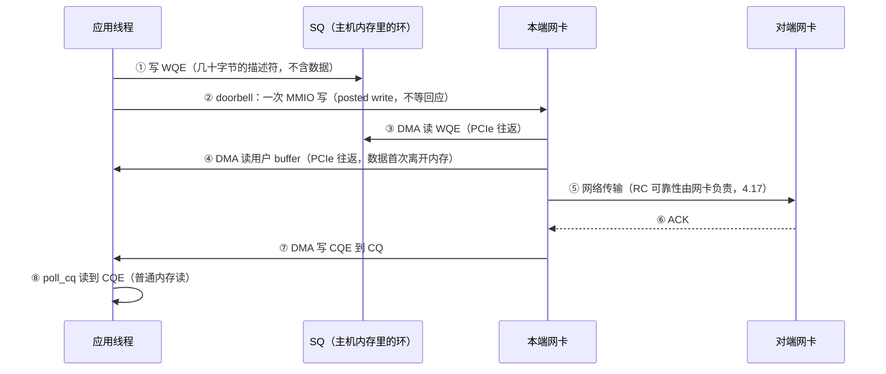

---
tags:
  - 高性能存储
  - RDMA与RoCE
status: 已完成
---

# 多线程下 QP 的使用模型

> 单线程的 RDMA 程序（[[4.10 rc_pingpong 最小程序]]）里，QP 和 CQ 归谁用从来不是问题。一旦上多线程，第一个要回答的问题就变成：**这些对象是"线程安全的公共黑板"，还是"必须指定归属的私有信箱"？** 答案是后者——verbs 库确实保证并发调用不崩溃【事实】，但那是靠驱动内部一把 per-QP 锁换来的，锁就是等待点。本篇把三种归属模型（共享 QP 加锁、每线程 QP 共享 CQ、每线程 QP 每线程 CQ）逐一摊开：每种模型下一次发送要在哪里等、数据在哪里拷贝（剧透：正常路径上一次都不拷），以及为什么现代 RDMA 服务几乎都收敛到 thread-per-core。

前置：[[4.2 Verbs 编程模型]]（QP/CQ/MR 五个对象是什么）、[[4.3 QP WQE CQ 状态机]]（WQE 的一生、完成怎么收）、[[0.5 NUMA CPU 亲和性与内存亲和性]]（线程和内存"住在哪"为什么影响 p99）。

---

## 1. 先把名词说直白：信箱、投递员与收件人

把对象换成邮局类比，归属问题立刻清晰：

| 对象 | 直白类比 | 多线程下的关键问题 |
| --- | --- | --- |
| QP 的 SQ（发送队列） | 寄件信箱：把"发送委托单"（WQE）塞进去 | 几个线程往同一个信箱塞单子？ |
| QP 的 RQ（接收队列） | 收件货架：预先摆好空篮子等包裹 | 谁负责补篮子（post_recv）？ |
| CQ（完成队列） | 回执箱：网卡把"办完了"的回执（CQE）丢进来 | 谁来取回执？取到别人的回执怎么办？ |
| doorbell | 门铃：塞完单子按一下，通知网卡来取 | 按门铃是一次 MMIO 写，同一 QP 只有一个门铃 |

"线程安全"在这里有两层含义，必须拆开【事实】：

1. **正确性层面**：libibverbs 规范要求库是线程安全的——多个线程并发对同一个 QP 调 `ibv_post_send`、对同一个 CQ 调 `ibv_poll_cq`，不是数据竞争，不会崩。
2. **性能层面**：这个保证是驱动在每个 QP/CQ 里内置一把自旋锁实现的【实现】。你没写锁，不代表没有锁——只代表锁的位置从你的代码搬进了驱动。

所以多线程模型的选择，本质不是"怎么加锁"，而是**怎么摆放对象，让锁根本没有存在的必要**。

---

## 2. 一次发送的完整流转：等待点与拷贝点盘点

先建立基线：单线程下，一次 RDMA WRITE 从应用到对端内存，每一站在等什么、拷了几次数据。多线程模型的差异全部叠加在这条基线上。



逐站对账【事实】：

| 站点 | 等待点 | 数据拷贝 |
| --- | --- | --- |
| ① 写 WQE | 无（普通内存写）；**多线程共享 QP 时这里出现锁等待** | 0 次——WQE 是描述符（地址 + 长度 + lkey），不是数据本身 |
| ② doorbell | PCIe posted write，CPU 不等完成就继续【事实】；但写 MMIO 前的排序开销（内存屏障）真实存在 | 0 次 |
| ③④ NIC 取 WQE 和数据 | 网卡的 QP 调度队列；PCIe 往返 ~1 µs 量级 | **0 次拷贝**——DMA 直读用户 buffer，这正是内存注册换来的（[[4.4 内存注册与零拷贝]]） |
| ⑤⑥ 网络 | 传播 + 交换 + 可能的重试（[[4.17 Retry RNR 与 Timeout]]） | 0 次（网卡内部 SRAM 流转不算主机拷贝） |
| ⑦⑧ 完成 | busy-poll 则无睡眠等待；event 模式则睡在 completion channel 上（一次内核唤醒） | 0 次——CQE 本身就是结果 |

两个刻意的"不在场"值得强调：

- **内核不在场**：整条数据路径没有一次系统调用、没有一次内核态拷贝——内核只在建连（[[4.11 RDMA CM 与连接建立]]）和注册内存时出场。对比一次 TCP `send()`：陷入内核 + 至少一次"用户 buffer → 内核 sk_buff"的拷贝。
- **数据拷贝不在场**：唯一的例外是 `IBV_SEND_INLINE`——小消息把数据直接抄进 WQE，主动多拷一次几十字节换省一次 DMA 读（[[4.16 Inline Batching 与 Doorbell 优化]]），那是笔划算的买卖。

基线结论：单线程下，软件侧唯一可优化的等待点就是 ①② 附近的提交开销和 ⑧ 的收割方式。**多线程模型的好坏，就看它往这条基线上新增了几个等待点。**

---

## 3. 三种归属模型

![[图片/SVG/8_4_18_1.svg|900]]

### 3.1 模型 A：共享 QP + 锁——三个新增等待点

最直觉的写法：全体线程共享一个 QP，`post_send` 外面包一把 `std::mutex`（或者干脆不包，让驱动内锁兜底——效果相同，位置不同）。新增的等待点：

1. **锁竞争**：N 个线程抢一把锁，热路径上每次提交都要排队。RDMA 一次提交本身只有百纳秒量级【量级】，锁的获取/释放与排队开销和它同数量级——**锁不是小额税，是翻倍税**；
2. **cache line 弹跳**：SQ 尾指针、doorbell 记录这些变量在多个 core 的 L1 之间来回迁移（[[0.1 CPU Cache Cache Line 与内存屏障]] 的 false sharing 同族问题），每次迁移几十纳秒；
3. **完成归属错乱**：CQE 从这个共享 QP 的 CQ 里混流浮出，poll 到的线程未必是当初提交的线程——还得按 `wr_id` 二次分发、跨线程唤醒。

【实践】共享 QP 只适合两类场景：QP 数量被硬性限制（对端只给一条连接）、或低频控制面消息（每秒几百次，锁开销无感）。

### 3.2 模型 B：每线程 QP + 共享 CQ——提交无锁，收割多一跳

每个线程建自己的 QP，提交路径彻底无锁；但多个 QP 把完成挂到同一个 CQ（verbs 允许多 QP 绑一个 CQ【事实】）。

- 买到什么：热路径的大头（提交）已经无锁；CQ 数量少，适合"QP 极多、完成事件稀疏"的形态，也方便一个线程集中睡在一个 completion channel 上等所有连接的事件；
- 付出什么：`poll_cq` 要么加锁要么专职线程收割，poll 到别人的完成还得转发——**完成路径多一次跨核搬运**（队列 + 唤醒 + cache miss），p99 为此买单。

### 3.3 模型 C：每线程 QP + 每线程 CQ——把扇入外包给网卡

thread-per-core 形态：每个数据面线程拥有自己的 QP、自己的 CQ、自己的内存池，pin 在固定 core 上；提交和收割都发生在同一个核，全路径零锁零共享。多个 QP 的并发调度谁做？**网卡做**——多队列并发本来就是 RDMA 网卡的本职【事实】，软件把"合并"这道工序整个外包给了硬件。

这与 SPDK 的 reactor 模型（[[5.12 无锁 thread-per-core 模型]]）、每核一个 io_uring 实例的做法是同一个思想在不同层的重演：**并发不靠共享 + 锁，靠分区 + 归属**。

代价也要记账【取舍】：

- **QP 数量膨胀**：全互联下 QP 数 = 线程数 × 对端数。QP 上下文存在网卡的片上缓存（mlx5 叫 ICM cache【实现】），放不下就去主机内存取——多一次 PCIe 往返直接写进长尾。量级上几千 QP 后 per-QP 性能开始滑坡（具体拐点随网卡型号变化，需实测【量级】）；
- **跨线程发送要走消息**：T0 想在 T1 的连接上发数据，不能直接碰 T1 的 QP——把请求塞进 T0→T1 的无锁队列，由 T1 代发。多一跳核间通信，但把"偶尔跨线程"的成本从"每次提交都加锁"里剥离了出来。

---

## 4. CQ 收割方式与归属的组合

收割方式（[[4.3 QP WQE CQ 状态机]] §4 的两条路）与归属模型正交，但有天然搭配【实践】：

| 组合 | 说明 |
| --- | --- |
| 模型 C + busy-poll | 数据面标配：每核循环 `poll_cq`，完成延迟最低（无唤醒），代价是核 100% 占用 |
| 模型 B + completion channel | 连接多、流量稀疏时省电省核：一个线程睡在 channel 上等所有 QP 的事件，醒来后按 `wr_id` 分发 |
| 模型 C + 自适应 | 忙时 poll、闲时 arm CQ 后睡眠——注意 `ibv_req_notify_cq` 后要再 poll 一次防止事件窗口漏检（[[4.3 QP WQE CQ 状态机]]） |

RQ 侧同理：谁拥有 QP，谁负责 `post_recv` 补货。共享接收缓冲的需求（很多 QP 共用一池接收 buffer）由 SRQ（Shared Receive Queue）解决【事实】——那是 verbs 提供的专用共享机制，内部由驱动管理并发，不需要应用加锁。

---

## 5. 锁消除的正式接口：Thread Domain

"我保证这个 QP 只有一个线程用，请把内锁去掉"——这句话有正式的 API 说法【实现】：

```cpp
ibv_td_init_attr td_attr{};
ibv_td* td = ibv_alloc_td(ctx, &td_attr);          // 声明：单线程域

ibv_parent_domain_init_attr pd_attr{};
pd_attr.pd = pd;
pd_attr.td = td;                                    // 把 PD 和 TD 绑成 parent domain
ibv_pd* ppd = ibv_alloc_parent_domain(ctx, &pd_attr);
// 用 ppd 建出来的 QP/CQ，驱动跳过内部自旋锁，并放宽部分内存屏障
```

**关键点**：

- 这是一份**单向承诺**：换来 mlx5 等驱动跳过 per-QP 自旋锁、使用更宽松的屏障——省下的正是模型 A 里那笔"翻倍税"；
- 承诺之后再并发 post 同一 QP，就是真正的数据竞争（UB）——安全网已按你的要求拆除；
- 模型 C 是 Thread Domain 的天然搭档：归属本来就是每线程私有，声明只是把事实告诉驱动。

---

## 6. 与 NUMA 绑定：归属还要落到正确的插槽

模型 C 解决了"线程之间"的干扰，[[0.5 NUMA CPU 亲和性与内存亲和性]] 的结论还要求解决"线程与硬件之间"的距离【实践】：

1. **查网卡的家**：`cat /sys/class/infiniband/mlx5_0/device/numa_node`；
2. **线程 pin 在同 node 的 core 上**：跨 node 时每次 doorbell MMIO、每次网卡 DMA 读 WQE/数据都多走一跳 socket 互连；
3. **QP/CQ 环与注册内存分配在同 node**：QP/CQ 环由驱动分配，跟随创建线程的 NUMA 策略——所以"先 pin 线程、再建资源"，顺序反了绑定就落空；
4. **效果形态**：平均吞吐往往看不出差别，p99 看得出——与 0.5 §6 的结论同型。

---

## 7. 实践模板（Modern C++）

模型 C 的骨架：每线程一个自持资源的 endpoint，跨线程发送走 SPSC 邮箱，全程无锁。

### 7.1 资源归属：RAII 固化"谁拥有"

```cpp
// verbs C 句柄统一用 unique_ptr + 自定义删除器管住（同 4.2 §6 的做法）
template <typename T, int (*Destroy)(T*)>
struct VerbsDeleter {
    void operator()(T* p) const noexcept { if (p) Destroy(p); }
};
using QpPtr = std::unique_ptr<ibv_qp, VerbsDeleter<ibv_qp, ibv_destroy_qp>>;
using CqPtr = std::unique_ptr<ibv_cq, VerbsDeleter<ibv_cq, ibv_destroy_cq>>;

// 每个数据面线程独占一个 Endpoint——不加锁，因为根本不共享
class Endpoint {
public:
    Endpoint(ibv_context& ctx, ibv_pd& pd, int cpu_core);  // 内部先 pin 核再建 CQ/QP

    // 只允许拥有者线程调用；debug 版用线程 id 断言归属
    void post_write(const WriteReq& req) {
        assert(std::this_thread::get_id() == owner_);
        // 填 WQE → ibv_post_send，无任何锁
    }
    int poll(std::span<ibv_wc> out) {
        assert(std::this_thread::get_id() == owner_);
        return ibv_poll_cq(cq_.get(), static_cast<int>(out.size()), out.data());
    }

    Endpoint(const Endpoint&) = delete;             // 归属不可复制
    Endpoint& operator=(const Endpoint&) = delete;

private:
    CqPtr cq_;      // 声明顺序即销毁的逆序：QP 先于 CQ 销毁
    QpPtr qp_;
    std::thread::id owner_;
};
```

**设计要点**：

- 删除 copy 语义：**归属**这个概念直接编码进类型——Endpoint 不可能被两个线程"都拥有"；
- 成员声明顺序承载依赖：QP 依赖 CQ，析构自动按 QP→CQ 逆序进行（verbs 要求销毁顺序与创建相反，[[4.2 Verbs 编程模型]] §6）；
- `assert` 归属线程：把"跨线程误用"从偶发线上事故变成 debug 版必现崩溃。

### 7.2 跨线程发送：消息传递代替共享

```cpp
// T0 想在 T1 的连接上发数据：投递到 T1 的邮箱，绝不直接碰 T1 的 QP
class DataPlaneThread {
public:
    bool submit(WriteReq req) {                     // 任意线程可调
        return inbox_.try_push(std::move(req));     // SPSC/MPSC 无锁队列
    }

    void run_loop() {                               // 仅拥有者线程
        for (;;) {
            WriteReq req;
            while (inbox_.try_pop(req)) ep_->post_write(req);   // ① 代发邮箱请求
            std::array<ibv_wc, 16> wc;
            const int n = ep_->poll(wc);                        // ② 收割自己的 CQ
            for (int i = 0; i < n; ++i) on_complete(wc[i]);
            // ③ 可插入：闲时 arm CQ 转 event 模式省核
        }
    }

private:
    Endpoint* ep_;              // 归属本线程
    MpscQueue<WriteReq> inbox_; // 唯一的跨线程通道
};
```

**说明**：队列是整个设计里唯一被多线程触碰的结构——把并发面积压缩到一个点上，其余全部单线程推理。这正是 SPDK message passing 的形状（[[5.12 无锁 thread-per-core 模型]]）。

---

## 8. 实验思路：把三种模型的差距量出来

变量控制原则同 [[4.9 ibv_perftest 基准实验]]：

1. **锁税测量**：`ib_write_bw` 单 QP 基线 → 自写多线程程序共享 QP（外置 mutex）→ 每线程 QP。观察小消息（64 B）message rate：共享 QP 随线程数**不升反降**是预期现象；每线程 QP 应接近线性直到打满网卡 message rate 上限；
2. **Thread Domain 收益**：同一单线程程序，用/不用 parent domain 各跑一遍小消息延迟——差值就是驱动内锁 + 屏障的价格（预期百纳秒量级【量级】，大消息下被传输时间淹没）;
3. **QP 规模拐点**：`ib_write_bw -q N` 递增 QP 数（几十 → 几千），观察聚合吞吐与 per-QP 延迟何时开始滑坡——那就是你这块网卡的 QP 上下文缓存边界;
4. **NUMA 对照**：同一程序分别 pin 在网卡本地/远端 node（`numactl --cpunodebind`），对比 p99——平均值几乎不动、尾部拉开是预期形态（[[0.5 NUMA CPU 亲和性与内存亲和性]] §6）。

---

## 9. 排障清单：症状 → 原因 → 检查

| 症状 | 常见原因 | 检查动作 |
| --- | --- | --- |
| 加线程后吞吐不升反降 | 模型 A：锁竞争 + cache 弹跳 | `perf top` 看 spinlock/futex 占比；`perf c2c` 抓 cache line 弹跳 |
| 平均延迟正常，p99 偶发尖刺 | 收割跨核转发（模型 B）；或 NUMA 跨节点 | 核对提交线程与收割线程的 core/node 归属 |
| 小消息 message rate 远低于网卡标称 | 每次提交都按门铃、无 batching，叠加锁开销 | 先按 [[4.16 Inline Batching 与 Doorbell 优化]] 补 postlist，再查锁 |
| QP 数量上到几千后整体变慢 | QP 上下文超出网卡缓存 | 递增 QP 数复测找拐点；合并连接或改共享出口 |
| 开 Thread Domain 后偶发数据损坏/崩溃 | 违约：仍有多线程碰同一 QP | 加归属断言（§7.1）复现；违约点必现 |
| 某线程的连接"发不出去" | 跨线程直接 post 被改成邮箱后，run_loop 没消费 inbox | 检查数据面循环是否被慢回调卡住 |
| event 模式下完成事件偶发丢失 | arm CQ 后没有补一次 poll，事件窗口漏检 | 按 [[4.3 QP WQE CQ 状态机]] 的 arm→poll 顺序修正 |

---

## 10. 陷阱与误区

> [!warning] 常见错误
> 1. **把"库是线程安全的"当成"共享是免费的"**：verbs 保证的是不崩溃，不是不排队——驱动内锁的价格和你自己写 mutex 同量级。
> 2. **每连接一线程**：千级连接 = 千级线程 + 千级 QP，线程调度和 QP 上下文双重爆炸。连接数与线程数必须解耦：N 个数据面线程分摊 M 条连接（M >> N）。
> 3. **提交无锁了，收割还共享**：模型 B 用一半——热路径省了锁，完成路径又把跨核搬运加了回来。归属要贯穿提交与收割两端。
> 4. **先建资源后 pin 线程**：QP/CQ 环已经分配在错误的 NUMA node 上，之后再 `pthread_setaffinity_np` 也搬不动它们。顺序：pin → 建资源。
> 5. **跨线程"顺手"直接 post 别人的 QP**：没开 Thread Domain 时是性能违章（撞驱动内锁），开了之后是正确性违章（UB）。统一走邮箱。
> 6. **拿模型 C 当万能药**：QP 数 = 线程数 × 对端数这笔账不算就上线，规模一涨撞上 QP 上下文缓存墙。设计时就要给"退回模型 B / 共享出口"留后路。

---

## 11. 关键结论

| 结论 | 性质 |
| --- | --- |
| verbs 库线程安全靠驱动 per-QP 内锁实现：共享 QP 不是 UB，但每次提交都在排队 | 事实 |
| RDMA 正常数据路径零内核参与、零数据拷贝；唯一软件等待点在提交（锁）与收割（归属） | 事实 |
| 模型 A 新增三个等待点：锁竞争、cache line 弹跳、CQE 二次分发 | 事实 |
| 模型 C（每线程 QP+CQ）全路径无锁，多 QP 扇入由网卡硬件完成 | 事实 |
| Thread Domain 是"单线程使用"的正式承诺：驱动跳过内锁；违约即 UB | 事实（实现） |
| QP 数 = 线程数 × 对端数；几千 QP 后撞网卡上下文缓存，长尾滑坡（拐点需实测） | 量级 |
| 归属链条：线程模型 → QP 归属 → CQ 归属 → NUMA 绑定，顺序不可倒置 | 实践结论 |
| 提交无锁 + 收割集中（B） vs 全私有 + QP 膨胀（C）：按连接规模与流量密度选边 | 取舍 |

---

## 关联知识

- [[4.2 Verbs 编程模型]] - 五个对象与 RAII 资源依赖：归属模型摆放的就是这些对象
- [[4.3 QP WQE CQ 状态机]] - WQE 的一生与收割方式：本篇等待点分析的底座
- [[4.4 内存注册与零拷贝]] - "数据路径零拷贝"的来源
- [[4.16 Inline Batching 与 Doorbell 优化]] - 提交路径的另一半优化：先减少提交次数，再谈无锁
- [[4.17 Retry RNR 与 Timeout]] - 网络侧等待点：硬件静默重试
- [[0.5 NUMA CPU 亲和性与内存亲和性]] - 归属落到插槽：p99 敏感而平均值迟钝的原因
- [[0.1 CPU Cache Cache Line 与内存屏障]] - cache line 弹跳与屏障成本的微观机制
- [[5.12 无锁 thread-per-core 模型]] - 同一思想在 SPDK 层的完整形态
- [[4.9 ibv_perftest 基准实验]] - 实验的变量控制方法
