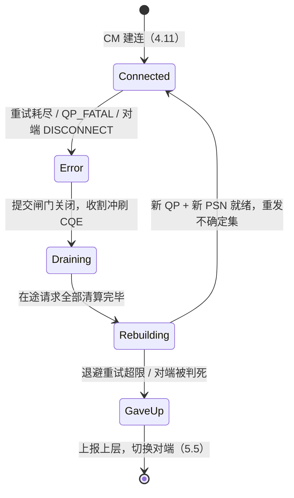
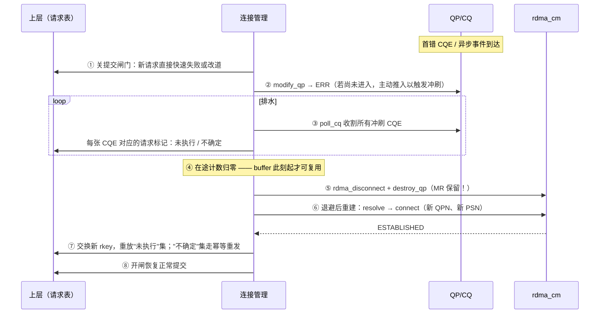

---
tags:
  - 高性能存储
  - RDMA与RoCE
status: 已完成
---

# RDMA 故障恢复与连接重建

> TCP 时代内核替你养连接：丢包它重传、对端死了它超时、进程退了它挥手。RDMA 把可靠性搬进网卡之后（[[4.1 RDMA 为什么快]]），也把**善后责任搬给了应用**——重试耗尽（[[4.17 Retry RNR 与 Timeout]]）之后 QP 进 ERR，**没有任何组件会替你恢复它**：不排水、不重建、不重发，连接就永远停在尸体状态。本篇讲清故障之后的完整闭环：错误从哪三个通道浮出、ERR 状态的精确语义、排水与重建的正确顺序，以及最要命的一问——**故障瞬间在途的那些读写请求，到底执行了没有？**（答案：不知道，而且 RDMA WRITE 可能已经写进了对端内存，这决定了上层必须幂等。）

前置：[[4.3 QP WQE CQ 状态机]]（ERR 状态与冲刷语义的底座）、[[4.11 RDMA CM 与连接建立]]（重建走的就是这条路）、[[4.17 Retry RNR 与 Timeout]]（什么情况会走到本篇）。

---

## 1. 先把名词说直白：RDMA 里的"连接"是什么、坏了指什么

**"连接"= 一对 QP + 一堆双方约好的数字**：本端 QPN、对端 QPN、起始 PSN、路径信息、对端的 rkey（[[4.12 rkey lkey 生命周期]]）。这些状态一半住在两端网卡里，一半住在两端进程里——**内核里没有一份"连接表"替你兜底**（CM 只管建连事件，不管数据面存活）。

"坏了"有三种典型形态，恢复动作不同：

| 故障形态 | 直白描述 | 网卡视角 | 典型结局 |
| --- | --- | --- | --- |
| 链路抖动 | 网线闪断、交换机重启、丢包窗口 | 包丢了但对端 QP 还在 | 轻则硬件重试兜住（应用只见长尾）；重则重试耗尽 → ERR |
| 对端进程崩溃/重启 | 对端 QP、MR、rkey 全部蒸发 | 发过去的包无人应答或收到否定应答 | 重试耗尽 → `RETRY_EXC_ERR`；或 CM 报 DISCONNECTED |
| 对端整机宕机 | 连网卡一起消失 | 与进程崩溃难以区分（都是"没回音"） | 同上，但恢复要等对端重生或切换到别的对端（[[5.5 Multipath 与故障切换]]） |

关键心态【事实】：**从本端看，"对端慢"“对端死"“路断了"在耗尽重试之前不可区分**——这就是为什么恢复逻辑必须统一收口到"QP 进 ERR / CM 报事件"之后，而不是试图提前猜测原因。

---

## 2. 错误从哪浮出：三个通道，一个都不能不监听

故障信号不会主动打断你的线程，它们分散在三个必须主动监听的通道里【事实】：

| 通道 | API | 报什么 | 典型事件/错误码 |
| --- | --- | --- | --- |
| ① 完成通道（CQ） | `ibv_poll_cq` | **某个具体请求**出了什么事 | `IBV_WC_RETRY_EXC_ERR`、`IBV_WC_RNR_RETRY_EXC_ERR`、`IBV_WC_WR_FLUSH_ERR` |
| ② 异步事件通道 | `ibv_get_async_event` | **QP/端口/设备级**的大事 | `IBV_EVENT_QP_FATAL`、`IBV_EVENT_PORT_ERR`、`IBV_EVENT_DEVICE_FATAL` |
| ③ CM 事件通道 | `rdma_get_cm_event` | **连接关系**的变化 | `RDMA_CM_EVENT_DISCONNECTED`、`ADDR_CHANGE`、`TIMEWAIT_EXIT` |

通道 ① 里要分清两种错误 CQE【事实】：

- **第一个真实错误**（如 `RETRY_EXC_ERR`）：只有一个，携带真正的死因；
- **后续的 `WR_FLUSH_ERR`**：QP 进 ERR 后，所有还在队里的 WQE 被逐个"冲刷"出来——它们不是新故障，是同一次故障的清算单。只看到 FLUSH 而找不到首错时，首错往往在别的线程 poll 走了，或死因在通道 ②（比如 QP_FATAL）。

一个容易漏的记账事实【事实】：unsignaled WR（[[4.15 Signaled Unsignaled WR]]）只抑制**成功**完成——**错误与冲刷完成一律浮出 CQE**。排水时按"每个在途 WR 一张清算单"对账，别按"signaled 数量"对账。

---

## 3. ERR 状态的精确语义：死透了，但死得有秩序

QP 进 ERR 后的行为边界（[[4.3 QP WQE CQ 状态机]] §6 的展开）【事实】：

1. **不再收发任何数据包**——网卡对这个 QP 罢工；
2. **继续接受 post**：`ibv_post_send/post_recv` 不报错，但新 WQE 立即以 `WR_FLUSH_ERR` 完成——这是特性不是 bug：它保证"错误之后提交的请求也有交代"，排水逻辑不必与提交路径抢锁；
3. **绝不自愈**：没有任何超时、任何事件能让它离开 ERR；
4. **离开 ERR 只有一条合法路径**：`modify_qp` 到 RESET，再重走 INIT→RTR→RTS——PSN、对端 QPN 全部重新协商，等价于新连接。实践中通常直接销毁重建（配合 CM 时资源生命周期更清晰【实践】）。

连接生命周期全景：



---

## 4. 故障瞬间，一个请求可能停在哪：不确定性分类

这是恢复逻辑真正的难点。以 [[4.18 多线程下 QP 使用模型]] §2 的八站流转为坐标，故障时每个在途请求停在某一站，**本端只能把它们分成三类，无法更细**【事实】：

| 请求所处位置 | 本端看到什么 | 它执行了吗 |
| --- | --- | --- |
| 还在应用队列，没 post | 无 CQE | 肯定没执行——可安全重发 |
| 已 post，在 SQ/网络/对端途中 | `WR_FLUSH_ERR` 或首错 CQE | **不确定**——见下 |
| 已收到成功 CQE | 成功 CQE | RC 语义保证对端网卡已 ACK【事实】 |

中间那类是危险集，必须掰开【事实】：

- **RDMA WRITE**：错误 CQE 只说明"本端没收到最终确认"——数据可能一个字节都没出门，也可能**已经完整写进对端内存**（对端网卡 DMA 完成后 ACK 丢了）。"报错 = 没写"是错误假设；
- **RDMA READ**：对端内存没被改动，但本端 buffer 可能被写了一半——报错后**本端 buffer 内容不可信**，不能当有效数据用；
- **SEND**：对端可能已收到并处理（应用回执还没回来）——重发就是重复投递。

结论一句话【实践】：**错误后的重发必须建立在上层幂等或版本机制之上**（[[7.13 幂等 重试 与请求去重]]）——传输层给不出"恰好一次"，只能给"至少零次，至多一次半"。这也是 [[5.22 网络故障与 Target 故障差异]] 里存储协议层要自己管请求重试的根源。

---

## 5. 排水与重建：顺序错一步就是资源泄漏或数据踩踏

完整恢复时序（本端主动恢复视角）：



每一步的"为什么"：

1. **先关闸门**：否则排水期间新请求源源不断变成新的冲刷 CQE，排水永远排不完；
2. **主动推 ERR**：有些故障（如只收到 CM DISCONNECTED，QP 还没报错）下 QP 仍在 RTS——主动 `modify_qp(ERR)` 强制冲刷，让所有在途 WR 限时给出清算单【实践】;
3. **排空才能动 buffer**【事实】：WQE 里记的是用户 buffer 地址，冲刷 CQE 浮出之前，网卡理论上仍可能 DMA 触碰它——**提前释放/复用 buffer 是 use-after-free 的硬件版**；
4. **MR 不销毁**【实践】：MR 挂在 PD 上，与 QP 生命周期无关（[[4.2 Verbs 编程模型]]）。注册是恢复路径上最贵的一步——GB 级内存注册要上百毫秒量级（pin 页 + 建网卡页表，[[4.4 内存注册与零拷贝]]）【量级】，而 QP 重建只是毫秒量级的 CM 往返 + 三次 modify_qp。**MR 常驻复用、QP 轻量重建**是恢复时间的关键取舍；但如果是**对端**重启，对端的 MR/rkey 已蒸发——本端缓存的旧 rkey 必须作废重换（[[4.12 rkey lkey 生命周期]]）；
5. **新 PSN 挡旧包**【事实】：重建协商出新起始 PSN，旧连接残留在网络里的包因序号对不上被直接丢弃——这是"重建而不是复活"的安全价值;
6. **退避加抖动**【实践】：大规模故障（交换机重启）时全体客户端同时重连，CM 与对端 listen 队列被打爆——指数退避 + 随机抖动是重连风暴的标准解药（形态同 [[7.15 Membership 与故障检测]] 的教训）。

---

## 6. 实践模板（Modern C++）：把状态机编码成类型

核心思路：连接状态显式化，提交闸门在最外层快速失败，排水用"在途计数归零"作为唯一放行条件。

```cpp
class RdmaConnection {
public:
    enum class State { Connected, Draining, Rebuilding, GaveUp };

    // 提交入口：闸门在锁外的原子读上，热路径零开销
    std::expected<void, Errc> post_write(WriteReq& req) {
        if (state_.load(std::memory_order_acquire) != State::Connected)
            return std::unexpected(Errc::kNotConnected);   // 快速失败，上层决定改道还是排队
        ++inflight_;
        req.seq = next_seq_++;                             // 恢复后按 seq 对账
        return do_post(req);
    }

    // 错误处理入口：三个监听通道（CQ 首错 / async event / CM event）统一收口到这里
    void on_fatal(FirstError err) {
        state_.store(State::Draining, std::memory_order_release);
        force_error_state();                               // modify_qp → ERR，强制冲刷
    }

    // 数据面循环里持续调用：收割冲刷 CQE，给每个在途请求发清算单
    void drain_step() {
        std::array<ibv_wc, 32> wc;
        const int n = ibv_poll_cq(cq(), wc.size(), wc.data());
        for (int i = 0; i < n; ++i) {
            reconciler_.settle(wc[i].wr_id,                // 未执行 or 不确定，登记进请求表
                               wc[i].status == IBV_WC_WR_FLUSH_ERR);
            --inflight_;
        }
        if (inflight_ == 0) begin_rebuild();               // 在途归零是唯一放行条件
    }

private:
    void begin_rebuild() {
        state_.store(State::Rebuilding, std::memory_order_release);
        qp_.reset();                                       // RAII 销毁 QP —— MR 成员保留不动
        backoff_.schedule([this] { reconnect_via_cm(); }); // 指数退避 + 抖动
    }

    std::atomic<State> state_{State::Connected};
    std::atomic<int>   inflight_{0};
    std::uint64_t      next_seq_{0};
    QpPtr              qp_;          // unique_ptr + ibv_destroy_qp 删除器（4.18 §7.1）
    MrPool&            mrs_;         // 引用常驻 MR 池：重建不重注册
    Reconciler         reconciler_;  // seq → {未提交 | 不确定 | 已确认} 请求表
    Backoff            backoff_;
};
```

**关键点**：

- `inflight_` 计数是排水的安全带：它归零之前，任何 buffer 都不许回池——把"硬件可能还在 DMA"这个物理事实翻译成了一条程序不变量；
- `seq` 请求表是与上层幂等机制（[[7.13 幂等 重试 与请求去重]]）的接口：恢复后"未执行"集直接重放，"不确定"集必须走带去重语义的重发；
- MR 池以引用传入、不随连接销毁——恢复时间从"百毫秒级重注册"降到"毫秒级重建连"的来源。

---

## 7. 演练清单：不演练的恢复逻辑等于没有

每条都在便宜环境可做（soft-RoCE 即可，[[4.8 soft-RoCE 边界]]），验收标准统一四问：**首错多久浮出？排水是否收齐？重建是否成功？不确定集重发有无造成重复写？**

| # | 注入方法 | 模拟什么 | 预期观察 |
| --- | --- | --- | --- |
| 1 | `tc netem loss 100%` 持续超过 (retry_cnt+1)×timeout | 链路彻底中断 | 首错 `RETRY_EXC_ERR`，随后一串 `WR_FLUSH_ERR`，数量 = 在途 WR 数 |
| 2 | `kill -9` 对端进程 | 对端崩溃 | 本端先收 CM `DISCONNECTED`（对端内核清理时发的）或直接重试耗尽——两条路径都要能进排水 |
| 3 | 对端进程重启后用**旧 rkey** 发 WRITE | rkey 生命周期错误 | 对端回 NAK，本端 `IBV_WC_REM_ACCESS_ERR`——验证 rkey 换新逻辑 |
| 4 | `ip link set <rdma口> down` 再 up | 端口闪断 | 通道 ② 收到 `PORT_ERR`/`PORT_ACTIVE`；短抖动应被 4.17 的重试兜住不进 ERR |
| 5 | 100 个连接同时注入故障 | 重连风暴 | 无退避版本对端 CM 过载可复现；加抖动退避后错峰恢复 |
| 6 | 排水期间故意立即复用 buffer（对照组） | 违反排水纪律 | 偶发数据损坏——亲眼看一次，纪律才会长在记忆里 |

---

## 8. 排障清单：症状 → 原因 → 检查

| 症状 | 常见原因 | 检查动作 |
| --- | --- | --- |
| 只看到一串 FLUSH_ERR，找不到死因 | 首错被别的线程 poll 走；或死因在异步事件通道 | 集中记录首个非 FLUSH 错误；确认有线程在收 `ibv_get_async_event` |
| 连接死了但程序毫无反应 | 三个通道有的没监听；或 `rnr_retry=7`+`timeout` 大导致还没耗尽 | 对照 §2 检查监听覆盖；用 `ibv_query_qp` 看 QP 是否真进了 ERR |
| 重建后偶发数据错乱/重复 | 不确定集直接重发且上层无幂等 | 引入 seq 去重或版本写（[[7.13 幂等 重试 与请求去重]]） |
| 恢复期间偶发内存损坏 | 排水未完成就复用了 buffer | 核对 inflight 计数逻辑；unsignaled WR 是否也被计入 |
| 重建太慢（百 ms～秒级） | 恢复路径里在重注册 MR | MR 改常驻池；重建只动 QP 与 CM |
| 对端重启后第一批请求全失败 | 用了缓存的旧 rkey | 重建握手时强制交换新 rkey（[[4.12 rkey lkey 生命周期]]） |
| 大规模故障后恢复雪崩 | 重连无退避、无抖动 | 加指数退避；观察对端 CM 事件队列深度 |
| 排水卡住：inflight 不归零 | QP 没真进 ERR（只收到 CM 事件）；冲刷没被触发 | 主动 `modify_qp(ERR)`；确认所有 WR 的 CQE 都在被收割 |

---

## 9. 陷阱与误区

> [!warning] 常见错误
> 1. **把错误 CQE 当"没执行"**：RDMA WRITE 报错时数据可能已写进对端内存；READ 报错时本端 buffer 可能已被写脏。错误只意味着"结果未知"，不意味着"什么都没发生"。
> 2. **排水没完就复用 buffer**：冲刷 CQE 浮出前，网卡对该 buffer 的 DMA 权利还没交还——这是 use-after-free 的硬件版，且只在高压下偶现，最难排查的一类损坏。
> 3. **恢复路径重注册 MR**：把毫秒级的重建拖成百毫秒级，还在恢复高峰期给 CPU 添 pin 页负担。MR 与 QP 生命周期本就无关，分开管理。
> 4. **只监听 CQ 一个通道**：QP_FATAL、PORT_ERR、DISCONNECTED 都不走 CQ——只 poll CQ 的程序对一半故障失明。
> 5. **期待 QP 自愈或复用**：ERR 是终点站；即便走 RESET 重推状态机，PSN/对端参数也全要重新协商——语义上就是新连接，别在"修旧连接"上省错了功夫。
> 6. **恢复逻辑只写不练**：恢复代码平时零流量，第一次真正执行就是生产事故现场。§7 的演练清单每条都该进 CI 或例行演练。
> 7. **无退避重连**：单机视角"尽快恢复"是美德，集群视角就是参与了一场对幸存节点的 DDoS。

---

## 10. 关键结论

| 结论 | 性质 |
| --- | --- |
| RDMA 无内核兜底：故障检测、排水、重建、重发全部是应用责任 | 事实 |
| 错误从三个通道浮出（CQ / 异步事件 / CM 事件），只监听其一必然失明 | 事实 |
| ERR 语义：不收不发、post 即冲刷、绝不自愈；错误与冲刷 CQE 不受 unsignaled 抑制 | 事实 |
| 在途请求故障后分三类：未执行 / 不确定 / 已确认；WRITE 的"不确定"包含"已写进对端" | 事实 |
| 排水放行条件 = 在途计数归零；之前复用 buffer 是硬件版 use-after-free | 事实 / 实践结论 |
| MR 常驻复用（注册百 ms 量级）+ QP 轻量重建（ms 量级）：恢复时间的主要取舍 | 量级 / 取舍 |
| 新 PSN/QPN 天然屏蔽旧连接残包：重建即隔离 | 事实 |
| 传输层最多给"至多一次半"：恰好一次语义必须由上层幂等/去重补齐 | 事实 / 实践结论 |
| 重连必须指数退避 + 抖动，否则恢复本身成为二次故障 | 实践结论 |

---

## 关联知识

- [[4.17 Retry RNR 与 Timeout]] - 走到本篇之前的最后一道防线：重试耗尽才进 ERR
- [[4.3 QP WQE CQ 状态机]] - ERR 状态与冲刷语义的机制底座
- [[4.11 RDMA CM 与连接建立]] - 重建复用的建连流程与事件模型
- [[4.12 rkey lkey 生命周期]] - 对端重启后旧 rkey 为什么必须作废
- [[4.15 Signaled Unsignaled WR]] - 排水对账时 unsignaled 的记账规则
- [[4.18 多线程下 QP 使用模型]] - 恢复状态机要嵌入的线程归属框架
- [[7.13 幂等 重试 与请求去重]] - "不确定集"重发的上层配套
- [[5.22 网络故障与 Target 故障差异]] - 同一问题在 NVMe-oF 层的版本
- [[5.5 Multipath 与故障切换]] - 放弃重建、切换对端的下一步
- [[4.8 soft-RoCE 边界]] - 演练清单的便宜复现环境
