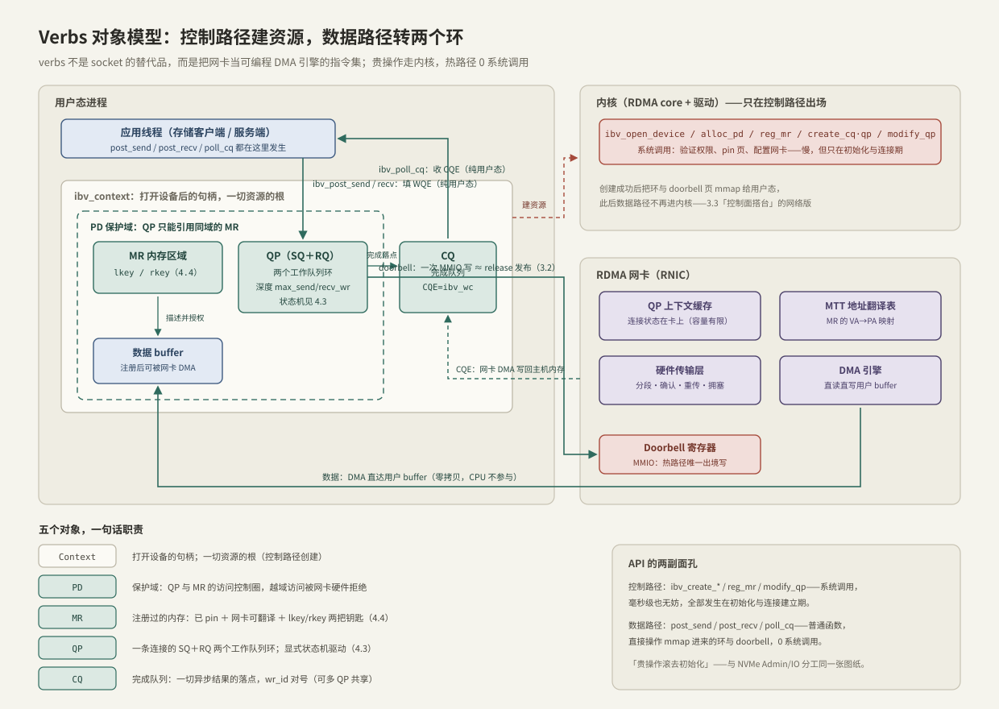

---
tags:
  - 高性能存储
  - RDMA与RoCE
---
# Verbs 编程模型

> Verbs 不是"更好用的 socket"，而是**把 RDMA 网卡当一台可编程 DMA 引擎的指令集**。它把 API 劈成两半：控制路径走内核建资源（慢，允许），数据路径纯用户态转两个环（0 系统调用）。4.1 的三根柱子——内核旁路、零拷贝、传输卸载——落到代码上，就是本篇的五个对象加两类函数；这也是 [[3.3 Admin Queue 与 IO Queue]]「控制面搭台、数据面唱戏」在网络侧的重演。

前置：[[4.1 RDMA 为什么快]]（为什么值得学这套陡峭的 API）、[[3.2 Queue Pair 与 Doorbell]]（环 + 门铃的力学，Verbs 的 QP/CQ 是同一形状）。

---

## 1. Verbs 在哪一层：两副面孔的 API

**【事实】** 技术栈三层分工：`libibverbs`（用户态库）+ 内核 RDMA core 与厂商驱动 + 网卡固件。与 socket 的本质区别：socket 的每个操作都由内核实现语义；Verbs 的多数"函数"只是**读写 mmap 进用户态的队列与 doorbell 页**，内核只在建资源时出场。

| | 控制路径 | 数据路径 |
| --- | --- | --- |
| 函数 | `ibv_open_device` / `ibv_alloc_pd` / `ibv_reg_mr` / `ibv_create_cq` / `ibv_create_qp` / `ibv_modify_qp` | `ibv_post_send` / `ibv_post_recv` / `ibv_poll_cq` |
| 实现 | 系统调用进内核：验证权限、pin 页、配置网卡 | 普通函数：填环 + 写 doorbell / 读 CQE |
| 成本 | 微秒到毫秒级【量级】 | 纳秒级，0 陷入 0 拷贝 |
| 何时用 | 初始化与连接建立期 | 热路径，每秒百万次 |

**纪律与 NVMe 一致**：贵操作滚去初始化——热路径出现任何 `ibv_create_*` / `ibv_reg_mr` 都是设计错误（注册成本详见 [[4.4 内存注册与零拷贝]]）。

---

## 2. 对象模型：五个对象一张图



| 对象 | 一句话职责 | 创建 | C++ 类比 |
| --- | --- | --- | --- |
| `ibv_context` | 打开设备的句柄，一切资源的根 | `ibv_open_device` | 进程级单例句柄 |
| `ibv_pd` | 保护域：QP 与 MR 的访问控制圈 | `ibv_alloc_pd` | 每租户一个 allocator/namespace |
| `ibv_mr` | 注册过的内存 + lkey/rkey | `ibv_reg_mr` | 借给设备的 `span` + 权限票据 |
| `ibv_qp` | 一条连接的 SQ+RQ 两个环 | `ibv_create_qp` | 带状态机的连接对象 |
| `ibv_cq` | 完成队列，异步结果的落点 | `ibv_create_cq` | future 的兑现队列 |

三条结构性约束【事实】：

1. **QP 只能引用同一 PD 下的 MR**——越域访问在网卡硬件层被拒（表现为 WC 错误，[[4.3 QP WQE CQ 状态机]] 排障表）；
2. **QP 创建时绑定 CQ**（发送/接收可绑不同 CQ；多个 QP 可共享一个 CQ，靠 `wc.qp_num` 区分）；
3. 可选对象一句话：**SRQ**（多 QP 共享接收队列，省 Recv buffer）；**completion channel**（把"CQ 有事"变成可 epoll 的 fd——愿意付中断与唤醒代价时用【取舍】）。

**术语精确化**（本章后面都按此使用）：应用填的结构叫 **WR**（Work Request，`ibv_send_wr`），驱动把它写成队列里的 **WQE**（Work Queue Entry）；WR 里的数据段列表是 **SGE**（Scatter/Gather Entry，含 addr/length/**lkey**）；完成的载体是 `ibv_wc`（Work Completion，即 CQE）。

---

## 3. 家族对账：第四次见到同一形状

| | io_uring（[[2.1 SQ CQ 模型]]） | NVMe（[[3.2 Queue Pair 与 Doorbell]]） | RDMA Verbs |
| --- | --- | --- | --- |
| 提交队列 | SQ + SQE | SQ + SQE | SQ/RQ + WQE |
| 完成队列 | CQ + CQE | CQ + CQE（phase 位） | CQ + `ibv_wc` |
| 对号票据 | `user_data` | CID | `wr_id` |
| 门铃 | `io_uring_enter`（或 SQPOLL） | SQ Tail Doorbell（MMIO） | doorbell 页（MMIO） |
| 消费者 | 内核 | SSD 控制器 | RDMA 网卡 |
| 背压点 | SQ/CQ 容量 + 自记账 | 队列深度 + tag 池 | `max_send_wr` + ENOMEM |

**结论**：环 + 门铃 + 票据 + 有界深度，是所有高性能提交路径的公共骨架。学会一个，其余是参数差异。

---

## 4. Verbs 没有 connect()：连接参数靠带外交换

**【事实】** RC（Reliable Connection）QP 互联前，双方必须交换下面这些参数，而 Verbs 本身不提供任何交换机制：

| 要交换的 | 作用 |
| --- | --- |
| QPN | 对端队列号（QP 的"端口号"） |
| GID（RoCE）/ LID（IB） | 对端网络地址（GID 与 RoCE v2 的关系见 [[4.6 RoCE 与 InfiniBand]]） |
| PSN | 起始包序号，两端必须对上 |
| MTU | 路径 MTU，两端取一致值 |
| rkey + 远端地址 | 仅单边操作需要（[[4.5 Send Recv 与 RDMA Read Write]]） |

两种工程做法【取舍】：

- **自带 TCP socket 交换**：几十行代码，参数全裸可见——学习与调试首选（[[4.10 rc_pingpong 最小程序]] 就这么做）；
- **rdma_cm（librdmacm）**：类 socket 的 connect/accept 语义，自动解析地址、代跑 QP 状态机——生产常用，但把 [[4.3 QP WQE CQ 状态机]] 的细节藏起来了；先懂裸流程，再用封装。

交换完成后，两端各自把 QP 沿 `INIT → RTR → RTS` 推到就绪态——状态机是 4.3 的主角。

---

## 5. 端到端：最小完整流程

以双边 Send/Recv 收发一条消息为例（★ = 数据路径，其余为控制路径）：

1. `ibv_get_device_list` → `ibv_open_device`：拿 context；
2. `ibv_alloc_pd`：建保护域；
3. `ibv_reg_mr`：注册收发 buffer（pin + 页表 + 钥匙，[[4.4 内存注册与零拷贝]]）；
4. `ibv_create_cq`：建完成队列（容量 ≥ 最大在途 signaled 完成数）；
5. `ibv_create_qp`：建 QP（定 SQ/RQ 深度、绑定 CQ）；
6. 带外交换连接参数（§4）；
7. `ibv_modify_qp` × 3：`INIT → RTR → RTS`；
8. ★ `ibv_post_recv`：**先**灌满 RQ（必须先于对端发送——RNR 约束，4.3）；
9. ★ `ibv_post_send`：填 WR（opcode、SGE、`wr_id`）→ doorbell；
10. ★ `ibv_poll_cq`：收 `ibv_wc`，查 `status` 与 `wr_id`，归还 buffer 与槽位。

1–7 每连接一次，毫秒级都无妨；8–10 是稳态循环，0 系统调用。

---

## 6. Modern C++：用 RAII 固化资源依赖

Verbs 资源全是 `create/destroy` 配对，且有严格依赖序（PD 先于 MR/QP，CQ 先于 QP；销毁反序）。C++ 的语言事实正好接住它：**成员按声明序构造、按逆序析构**——把依赖写成声明顺序，析构顺序自动正确：

```cpp
#include <infiniband/verbs.h>

#include <system_error>

// 通用 RAII 句柄：destroy 函数绑定进类型
template <typename T, int (*DestroyFn)(T*)>
class VerbsHandle {
public:
    explicit VerbsHandle(T* p) : ptr_{p} {
        if (ptr_ == nullptr)
            throw std::system_error{errno, std::system_category(), "verbs create"};
    }
    ~VerbsHandle() { if (ptr_ != nullptr) DestroyFn(ptr_); }
    VerbsHandle(const VerbsHandle&) = delete;
    VerbsHandle& operator=(const VerbsHandle&) = delete;
    T* get() const noexcept { return ptr_; }
private:
    T* ptr_;
};

using Pd = VerbsHandle<ibv_pd, ibv_dealloc_pd>;
using Cq = VerbsHandle<ibv_cq, ibv_destroy_cq>;
using Qp = VerbsHandle<ibv_qp, ibv_destroy_qp>;
using Mr = VerbsHandle<ibv_mr, ibv_dereg_mr>;

// 一条 RC 连接的资源包：声明顺序 = 依赖顺序，析构自动反序
class RcConnection {
public:
    RcConnection(ibv_context* ctx, unsigned depth)
        : pd_{ibv_alloc_pd(ctx)},
          cq_{ibv_create_cq(ctx, static_cast<int>(2 * depth), nullptr, nullptr, 0)},
          qp_{make_qp(depth)} {}
    // 状态机推进与收发接口见 4.3 / 4.10

private:
    ibv_qp* make_qp(unsigned depth) {
        ibv_qp_init_attr attr{};
        attr.send_cq = cq_.get();
        attr.recv_cq = cq_.get();          // 收发共用一个 CQ：wc.opcode 区分
        attr.qp_type = IBV_QPT_RC;
        attr.cap.max_send_wr = depth;      // SQ 深度：背压的第一级
        attr.cap.max_recv_wr = depth;      // RQ 深度：RNR 的第一道防线
        attr.cap.max_send_sge = 1;
        attr.cap.max_recv_sge = 1;
        return ibv_create_qp(pd_.get(), &attr);
    }

    Pd pd_;   // ① 最先建、最后毁
    Cq cq_;   // ② QP 依赖它
    Qp qp_;   // ③ 最先析构——没有谁依赖它
};
```

**API 风格陷阱**【实现】：Verbs 错误约定不统一——`ibv_post_send` / `ibv_modify_qp` **直接返回 errno 值**，而 `ibv_reg_mr` / `ibv_create_*` 返回空指针并置 errno。在封装层统一翻译成 `std::system_error`，别让业务代码逐个记。

---

## 7. 排障清单：症状 → 原因 → 检查

| 症状 | 常见原因 | 检查动作 |
| --- | --- | --- |
| `ibv_get_device_list` 返回空 | rdma-core 未装 / 驱动模块未载 | `rdma link`；`ibv_devices`；`lsmod \| grep -e mlx -e rdma` |
| `ibv_reg_mr` 失败（EPERM/ENOMEM） | 锁页配额不足 | `ulimit -l`；systemd 加 `LimitMEMLOCK=infinity`；容器加 `--ulimit memlock=-1`（[[4.4 内存注册与零拷贝]]） |
| `ibv_modify_qp` 返回 EINVAL | 状态序跳步 / 参数缺字段 / 两端 MTU、GID index 不一致 | 对照 [[4.3 QP WQE CQ 状态机]] 的分步参数表逐字段核对 |
| `ibv_post_send` 返回 ENOMEM | SQ 满（在途没收割） | 先 `poll_cq` 再补位；核对自记的在途账（4.3） |
| 建链成功但不通，ping 正常 | RoCE v1/v2 选错、GID index 错、交换机丢 UDP 4791 | `show_gids` 选 v2 的 GID；核对两端 `gid_index`；抓包看 4791（[[4.6 RoCE 与 InfiniBand]]） |
| 一切正常但 `wc.status != IBV_WC_SUCCESS` | 运行期错误，另一个层面 | 转 [[4.3 QP WQE CQ 状态机]] 的 WC 状态排障表 |
| 没有 RDMA 网卡想先跑通 | — | soft-RoCE 只验证正确性，性能数字无意义（[[4.8 soft-RoCE 边界]]） |

---

## 8. 陷阱与误区

> [!warning] 常见错误
> 1. **拿 socket 心智用 Verbs**：没有字节流（消息语义、定长边界）、没有自动重连（QP 进 ERR 只能重建）、没有内置连接协商（参数自己换）。
> 2. **热路径创建/注册资源**：毫秒级控制路径操作混进微秒级数据路径 = p99 尖刺；资源全部预建。
> 3. **忘记先 post_recv**：对端 Send 先到 → RNR NAK → 重试耗尽连接崩——时序约束是协议级的（4.3）。
> 4. **跨 PD 引用 MR**：编译运行都不拦，网卡硬件拒绝——报错却出现在千里之外的 WC status 里。
> 5. **错误处理只看返回值**：post 成功 ≠ 传输成功；真正的错误通道是 CQE 的 status——与 io_uring 的 `res` 必查同源。

---

## 9. 关键结论

| 结论 | 性质 |
| --- | --- |
| Verbs = 控制路径（syscall 建资源）+ 数据路径（用户态转环）；热路径 0 系统调用 | 事实 |
| 五对象各司其职：Context 根、PD 权限圈、MR 内存+钥匙、QP 双环、CQ 落点 | 事实 |
| QP 只能用同 PD 的 MR；QP 绑定 CQ；销毁必须反依赖序 | 事实（约束） |
| 环+门铃+票据第四次出场：io_uring / NVMe / RDMA 是同一骨架的三个实例 | 类比 |
| 连接参数（QPN/GID/PSN/MTU/rkey）带外交换，Verbs 不管 | 事实 |
| RAII 声明序 = 资源依赖序，析构自动反序——语言机制接住协议约束 | 实践结论 |
| 排障先分层：设备可见 → 锁页配额 → 状态机参数 → WC status | 实践结论 |

---

## 关联知识

- [[4.1 RDMA 为什么快]] - 这套 API 换来的三根柱子
- [[4.3 QP WQE CQ 状态机]] - modify_qp 三步与 WQE 生命周期的全部细节
- [[4.4 内存注册与零拷贝]] - `ibv_reg_mr` 那一行背后的整篇故事
- [[4.5 Send Recv 与 RDMA Read Write]] - post_send 里 opcode 的语义分野
- [[4.10 rc_pingpong 最小程序]] - 本篇十步流程的可运行版本
- [[3.3 Admin Queue 与 IO Queue]] - 控制面/数据面分工的 NVMe 版
- [[4.6 RoCE 与 InfiniBand]] - GID、RoCE v2 与排障表中网络层问题的出处
