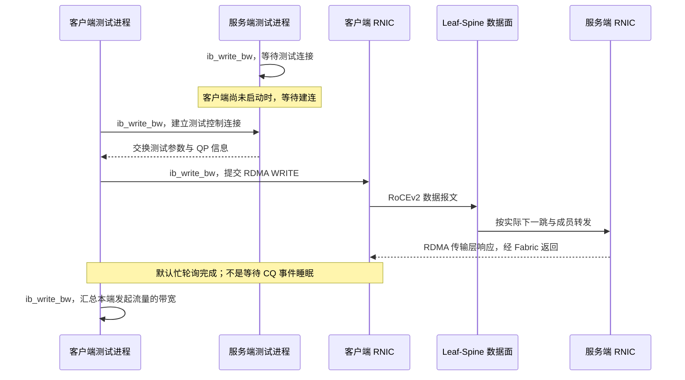

---
tags:
  - 高性能存储
  - RDMA与RoCE
  - 数据中心网络
  - Fabric
aliases:
  - RoCE Fabric 组网
  - Leaf-Spine 与 RoCE 多路径
status: 草稿
reviewed: 2026-09-11
---

# RoCE Fabric 组网：Clos、Leaf-Spine、ECMP、LAG 与 Oversubscription

> 会创建 QP，只说明应用能使用一条 RDMA 连接。会设计 Fabric，还要回答：报文经过哪些端口，多个流如何分路，哪里会汇聚，以及少一条链路后还剩多少容量。

本文从 [[4.6 RoCE 与 InfiniBand]] 的封装区别出发，把主机侧 RDMA 放进一张可路由的以太网。[[4.7 PFC ECN 与 DCQCN]] 解释拥塞反馈；本篇先确定反馈发生在哪条路径上。交换机内部的 PG、Queue 与缓冲记账，在 [[4.23 交换机数据面与 RoCE 队列：Ingress、Egress、Shared Buffer、PFC、ECN 与 HOL Blocking]] 展开。

**范围**：以 RoCEv2、三层 Leaf-Spine、传统按流哈希的 ECMP/LAG 为基线。示例不绑定某款交换机，也不把特定 RNIC 的乱序处理、RoCE LAG 或自适应路由能力当作通用能力。所有容量数字均为教学计算；未在本次环境运行真实 RNIC、交换机或链路故障实验。

## 1. 先把问题从 QP 扩展到端口

设同一个 `ib_write_bw` 程序，在同机架表现正常，跨机架时吞吐下降。此时反复修改 CQ polling，未必接近问题。

| 要回答的问题 | 对应证据 | 不能拿什么代替 |
| --- | --- | --- |
| 主机实际使用哪块 RNIC、哪个端口？ | RDMA 设备、端口、GID 与 netdev 的对应关系 | 仅看管理网 IP |
| 数据经过哪些交换机？ | LLDP/布线记录、FIB、ECMP 成员 | 仅看逻辑拓扑图 |
| 流量落在哪些物理链路？ | 各成员端口的字节增量、采样或镜像 | ECMP 组里“有四个成员” |
| 发送需求是否超过割集容量？ | 流量矩阵、上下联速率、故障状态 | 单端口的标称速率 |
| 限速发生于链路、队列还是主机？ | 端口负载、Queue/PG、ECN/PFC、RNIC/CPU/PCIe 证据 | 单独一个总吞吐数字 |

这里有一个教材层面的分工：路由协议维护可达性与转发表，数据面逐包执行解析、查表和转发。**三层转发不意味着每个 RoCE 包都经过交换机管理 CPU。** 作者公开教材 *Computer Networks: A Systems Approach* §3.5.1–3.5.2 对这一分工和硬件流水线有直接说明。[^book]

## 2. Clos 与 Leaf-Spine：两层设备，三段交换路径

### 2.1 “折叠”折叠了什么

三阶段 Clos 可以按输入级、中间级、输出级理解。数据中心常见的 folded Clos 把输入和输出角色放在同一组 Leaf 上，中间级由 Spine 承担。因此，图上通常只有两层物理设备；跨 Leaf 的单个报文仍经过 `源 Leaf → Spine → 目的 Leaf` 三个交换阶段。RFC 7938 §3.2 描述了这种组织。[^clos]

![[图片/SVG/8_4_20_1.svg|900]]

**图的读法**：灰线给出全部可用连接，蓝线只标一条被选中的路径。看到四条候选路径，不代表同一报文被复制四份，也不代表一个流会同时占满四条路径。

本篇基础拓扑有四台 Leaf、四台 Spine；每台 Leaf 各用一条链路连接每台 Spine。服务器只接 Leaf。这个最小模型没有 Leaf–Leaf 和 Spine–Spine 的横向数据链路；实际部署中的管理链路、MLAG peer-link 或更高层 Super-Spine，需要另外画出，不能悄悄混入容量计算。

源主机 A 与目的主机 D 在不同 Leaf 时，候选路径可以写为：

```text
A → Leaf-A → Spine-1 → Leaf-D → D
A → Leaf-A → Spine-2 → Leaf-D → D
A → Leaf-A → Spine-3 → Leaf-D → D
A → Leaf-A → Spine-4 → Leaf-D → D
```

这是图中连接关系的枚举，不是转发程序。每条路径最终仍汇聚到 Leaf-D 的同一个服务器出口。

### 2.2 先区分三种流量范围

| 流量范围 | 基础拓扑中的交换路径 | 优先检查的资源 |
| --- | --- | --- |
| 同一 Leaf 下的两台服务器 | Leaf 内部转发 | 服务器端口、交换机内部资源 |
| 不同 Leaf 下的服务器 | Leaf–Spine–Leaf | 两端 Leaf 上联、被选 Spine 的端口、目的端口 |
| 到外部存储或其他网络 | 可能增加 Border Leaf 等节点 | 实际出口割集、边界 QoS 与路由 |

“同机架”与“同 Leaf”也不完全等价：一个机架可能有两台 ToR，一台 Leaf 也可能连接多个物理机架。实验标签最好记录实际 Leaf，而不只写机架编号。

## 3. RoCEv2 能路由，但控制连接不等于 RDMA 数据路径

RoCEv2 使用 IP/UDP 封装；IANA 为 IP-routable RoCE 登记的 UDP 目的端口是 **4791**。UDP 头还为多路径哈希提供可用字段。这里的 UDP 不是“应用改用普通 UDP socket 收发 RDMA 数据”。[^iana][^dcqcn]

| 层次 | Fabric 关心什么 | 主机工程容易混淆的点 |
| --- | --- | --- |
| Ethernet | 下一跳、VLAN、链路状态、链路级流控 | 每一跳的二层头可能变化 |
| IP | 目的地址、路由、DSCP、ECN、可承载的包长 | IP 可达不等于 QoS 映射正确 |
| UDP | 多路径哈希可用字段、RoCE 目的端口 | 目的端口固定不代表所有包的哈希键都相同 |
| RDMA transport | QP、操作、序号及可靠性状态 | 交换机通常不靠完整 QP 状态完成普通 IP 转发 |

在 perftest 默认的非 `-R` 用法中，测试双方还需要交换连接参数。命令行 `-p` 所控制的测试连接端口，与线上的 RoCE UDP 4791，不是同一项配置。`-R` 则选择通过 `rdma_cm` 建立测试 QP；两种运行方式不能混着解释。[^perftest]

所以一次“连接成功”最多先确认了相应建立流程成功。随后仍要确认：选中的 GID 类型是 RoCEv2、绑定了正确接口、数据路径能承载 QP 的包长，且数据确实进入预期业务类。GID、地址解析与建连细节接在 [[4.11 RDMA CM 与连接建立]] 后理解。

## 4. ECMP：先得到候选下一跳，再选择其中一个

### 4.1 路由与哈希不是同一个动作

可以把传统 ECMP 的逐包决策抽象为以下依赖关系：

```text
目的 IP → 最长前缀匹配 → 下一跳组
报文中参与哈希的字段 + 本机策略 → 组内成员
选中成员 → 出接口 / 下一跳邻接
```

这不是对 ASIC 流水线时钟顺序的规定，而是需要核查的决策关系。控制面必须把允许使用的多条路径安装进转发表；“BGP 收到了多条路由”和“ASIC 已安装同样多的等价下一跳”，并不能直接画等号。[^clos][^book]

传统按流哈希会尽量让同一哈希键持续选择同一成员，以降低乱序风险。哈希输入可能包含源/目的 IP、协议、UDP 端口，具体取决于平台、封装和配置。**ECMP 的 equal cost 指路由代价，不是各链路实时负载相等。**

![[图片/SVG/8_4_20_2.svg|900]]

图中上半是两个不同的选择范围，下半是人为构造的哈希结果。桶内流的数量与字节数是两个指标：即使每个成员都分到两个流，只要流大小不同，端口负载仍可能差很多。

### 4.2 多 QP 为什么可能改善分散，又为什么不保证改善

RoCEv2 的 UDP 封装提供了可供 ECMP 使用的区分字段，但 **QP 与交换机哈希键并不是同一对象**。不同 RNIC、驱动和传输模式怎样产生源端口或其他熵字段，应从对应实现或线上的报文确认；不要在通用笔记里写死某个 `QP number → UDP source port` 公式。[^dcqcn]

据此可以做出两个工程推论。

第一，增加 QP 数，只有在它增加了交换机实际看到的有效哈希键时，才可能增加路径分散。第二，就算产生了不同的键，也可能碰撞到同一成员。因而“4 个 QP + 4 台 Spine = 每台 Spine 一个 QP”不是可依赖的保证。

可以用一个独立的玩具模型量化这种不保证：假设 4 个流独立、均匀地选择 4 条路径，则所有路径恰好各收到一个流的概率为：

```text
P(恰好一流一路) = 4! / 4^4 = 24 / 256 = 9.375%
```

这只是随机分桶模型，不是任何交换机的实测概率，也未考虑哈希相关性、权重和业务流大小。它说明：**候选数相等，本身不足以推出均匀分布。**

### 4.3 三个必须分开的现象

| 现象 | 意味着什么 | 合适的验证方式 |
| --- | --- | --- |
| 哈希碰撞 | 多个有效流落到同一成员 | 记录每流或采样路径，比较端口字节增量 |
| 多级哈希相关 / polarization | 前一级分桶结果与后一级再次相关 | 检查每一层实际分布，而不只看源 Leaf |
| 逐包分散 / 动态换路 | 一个流可能改变路径，带来乱序与反馈变化 | 先验证 RNIC、交换机与应用栈的对应支持 |

默认设计不要用“直接打开 packet spraying”替代对拥塞和路径分布的分析。是否支持乱序接收、选择性重传、流粒度自适应或其他传输机制，属于指定设备与软件组合的能力边界。传统按流基线和新机制应分开建立实验记录，不能混用结论。

## 5. LAG 与 LACP：把多根线组织成一条逻辑链路

LAG 的选择范围是一个链路聚合组中的成员；ECMP 的选择范围是路由下一跳组。二者可以串接：ECMP 先选到一个下一跳，而该下一跳的出接口恰好是 LAG，再由成员选择策略决定发到哪根线。某些 ASIC 会合并实现这些选择，但配置对象仍应分别核对。

| 比较项 | ECMP | LAG |
| --- | --- | --- |
| 逻辑对象 | 多个路由下一跳 | 一条逻辑链路的多个物理成员 |
| 典型用途 | 在多台 Spine 之间选择路径 | 增加两个逻辑节点之间的总容量与冗余 |
| 传统分担方式 | 按流或会话相关字段哈希 | 依发送端成员选择策略分担 |
| 控制协议 | 由路由和下一跳管理提供成员 | 可由 LACP 协商聚合状态，也可静态配置 |
| 单流限制 | 不自动获得所有路径容量之和 | 不自动获得所有成员容量之和 |
| 故障后需观察 | 成员移除、路由收敛、重新哈希 | 成员状态、可用聚合容量、重新分布 |

Linux bonding 文档把聚合模式、LACP 与 `xmit_hash_policy` 分别描述，也明确指出常见按连接分担模式下，单连接不能利用多个成员的总带宽。**这只是 Linux Ethernet bonding 的语义依据，不能据此宣布任意 RNIC 都支持相同的 RoCE LAG 行为。**[^bonding]

主机双口、交换机双归属还涉及一个边界：普通单系统 LAG、由多机协作呈现的聚合系统、应用显式使用两个 RNIC/两条 rail，不是同一方案。接线之前先确定 NIC、驱动和交换机采用哪一种支持模式，以及单个 QP 在其中能否迁移。不能因为操作系统里出现了 `bond0`，就假定已有 RDMA QP 被自动合并或保护。

## 6. Oversubscription：按一个明确的割面算账

### 6.1 本文采用的定义

定义一台 Leaf 的下联接入容量为 `D`、可用上联容量为 `U`，均按**同一方向、同一速率口径**计算：

```text
D = Σ 服务器下联端口速率
U = Σ 当前可用上联端口速率
超售比 O = D / U
```

这里采用“下联 : 上联”的约定。有人用其倒数，比较方案时必须先统一定义。`O=2` 写成 `2:1`，表示所有服务器同时全速向该 Leaf 外发送时，接入侧需求可以达到上联容量的两倍；它不是“每条流都会变成原来一半”。

![[图片/SVG/8_4_20_3.svg|900]]

### 6.2 一组可复算的端口预算

以下为假设能提供对应端口组合的设备配置，不是指定型号的端口规格。每台 Leaf 到四台 Spine 各连一个 400 Gb/s 端口。

| 状态 | 下联容量 D | 可用上联容量 U | 超售比 D/U |
| --- | ---: | ---: | ---: |
| 32 × 100G 下联，4 × 400G 上联 | 3.2 Tb/s | 1.6 Tb/s | 2:1 |
| 上述 Leaf 损失一个 400G 上联 | 3.2 Tb/s | 1.2 Tb/s | 8/3:1，约 2.67:1 |
| 16 × 100G 下联，4 × 400G 上联 | 1.6 Tb/s | 1.6 Tb/s | 1:1 |
| 上述 1:1 Leaf 损失一个上联 | 1.6 Tb/s | 1.2 Tb/s | 4/3:1，约 1.33:1 |

最后一行尤其有用：**正常状态不超售，不代表故障状态仍不超售。** “N−1 仍达到业务 SLO”应单独算需求，而不能只写“有冗余链路”。

这些是线速容量的理论上界，未扣以太网/IP/RDMA 开销、控制流量和设备内部限制。双向链路的两个方向分别拥有容量；不能把收、发相加得到一个更大的单向分母。

### 6.3 端口数量也限制规模

设共有 `L` 台 Leaf、`S` 台 Spine；每对 Leaf–Spine 之间使用 `q` 个物理端口；每台 Leaf 有 `d` 个服务器端口。则这个单归属模型需要：

```text
每台 Leaf 的 Fabric 端口数 = S × q
每台 Spine 的 Leaf 侧端口数 = L × q
接入服务器数 = L × d
L × q ≤ 每台 Spine 实际可分配给 Leaf 的端口数
```

增加 `q` 可以增加相邻节点之间的物理容量，却不会增加 Spine 故障域的数量。若增加的是同一台 Spine 上的两个成员，整台 Spine 失效时两条都消失。提高速率、增加成员、增加 Spine，是三种不同的资源决策。

### 6.4 “无阻塞”一词要附带条件

对给定流量，从源集合到目的集合的可达吞吐，不可能超过任何必经割集在该方向上的容量。这是容量上界，不是 ECMP 实际性能保证。

即便所有 Leaf 都配置成 1:1，仍可能因哈希碰撞、目的服务器端口热点、短时突发或调度策略形成排队。讨论 bisection bandwidth 时，应标出将哪些端点分成两组、是否计双向、哪些边跨过割面；把全网所有端口速率相加，不是对分带宽。

## 7. 流量矩阵比“网卡有多少 G”更有解释力

### 7.1 三种负载，三个不同的瓶颈

| 负载 | 教学模型 | 更可能暴露什么 |
| --- | --- | --- |
| Permutation | 多个发送端分别发送到不同接收端 | 跨 Leaf 总容量与哈希分布 |
| Incast | 多个发送端同时发往同一接收端 | 最后一个出口、接收端与反馈时延 |
| All-to-all / 多目的流 | 同时存在大量源–目的组合 | 不同割面、共享缓冲、业务同步突发 |

在 [[4.21 One-Sided RDMA KV：READ、WRITE、Atomic、内存布局与一致性]] 的实验中，均匀 key、热点 key、请求 mailbox 集中到少量 worker，会形成不同的流量矩阵。网络上看到的热点，并不一定来自“交换机选路不均”。先把应用的目的地分布画出来。

### 7.2 一个 1:1 Fabric 也无法消除的 Incast

假设八个独立输入，各以 100 Gb/s 把数据送向同一个 100 Gb/s 出口。在反馈尚未让输入减速、出口持续服务的短区间内：

```text
净积压速率 = (8 × 100 − 100) Gb/s = 700 Gb/s
2 μs 内新增积压 = 700 × 10^9 × 2 × 10^-6 / 8
                 = 175000 bytes ≈ 170.90 KiB
```

这是忽略协议开销、用恒定有效输入/输出速率做的流体近似，不是实际设备所需的 headroom。它说明的是**出口服务能力不足时，缓冲只购买时间，不创造持续带宽**。到底记到哪些 Ingress PG，在哪个 Egress Queue 上标记 ECN，需要进入 4.23 的模型。

### 7.3 学会区分平均量与瞬时量

假设 1 ms 内只有前 10 μs 出现强烈突发，1 ms 的平均端口利用率可能不高，却已经足以在微秒区间造成排队。因而“平均带宽只有 30%”不能排除 microburst。实验至少同时保存计数器增量、Queue/PG watermark、采样窗口和清零规则；只记录结束时的队列深度可能错过峰值。SONiC 的 watermark 设计明确区分了这些统计对象与记录窗口。[^watermark]

## 8. 三层路由之外，还需要一份端到端一致性表

RoCEv2 解决可路由封装，不会自动替你配置每一跳的业务分类。下面是一张部署检查表，不是某厂商配置命令。

| 维度 | 主机 / RNIC 侧 | 每一跳交换机侧 | 接收端 / 返回路径 |
| --- | --- | --- | --- |
| 路由 | 正确 GID、接口、目标可达性 | FIB、邻接、ECMP 实际成员 | 返回可达，必要时单独检查非对称路径 |
| 包长 | netdev MTU、QP path MTU 分别核查 | 路径各段能承载完整封装后的帧 | 不依赖未验证的分片行为 |
| 分类 | 实际线上 DSCP/PCP 与 ECT 位 | trust、重标记、TC/PG/Queue 映射 | 数据与反馈都进入设计中的类 |
| PFC | 对应优先级的收发行为 | 逐链路优先级匹配、PG/headroom | 不能漏掉服务器接入链路 |
| ECN/CNP | 发送端能响应反馈 | 正确业务队列应用标记配置 | 接收端产生反馈，返回路径不会长期堵住 |
| 物理链路 | 速率、链路状态、错误计数 | 对应光模块/线缆、FEC、错误与丢弃 | 同样核查对端，不只看本端 link up |

映射的概念依据可以在 SAI 的 `DSCP_TO_TC`、`TC_TO_QUEUE`、`TC_TO_PRIORITY_GROUP`、`PFC_PRIORITY_TO_QUEUE` 等类型里直接看到。**DSCP、TC、PG、Queue、PFC priority 是不同命名空间，即使示例恰好都使用数字 3，也不是同一个对象。**[^qosmap]

CNP 是端到端反馈的一部分，应避免被持续的数据拥塞长期拖住。具体采用哪个优先级、是否独立队列、何种调度保证，由部署决定；不要把某个默认 DSCP 或“必须用第 6 队列”写成协议定律。

## 9. 组网交付物：不只是一张接线图

本篇建议把可交付的工程证据组织成三份相互可核对的记录。

**拓扑与容量记录**写清设备、端口、速率、线缆、服务器归属、ECMP/LAG 关系，以及正常和失效状态的割集容量。链路采用什么编号不重要，重要的是计数器能回到图中的那一条线。

**策略记录**写清前缀发布、下一跳成员、哈希所用字段、QoS trust 与映射、缓冲配置的适用对象。涉及阈值时同时记录单位和语义：字节、cell、已用空间、剩余空间，不能只抄一个整数。

**验证记录**写清具体业务矩阵、端点和 QP 数、消息大小、方向、预热、时长、重复次数、软件/固件版本、测量口径、失败标准和回滚方式。性能测试的版本与统计组织可以复用 [[4.22 RDMA 论文复现实验：rdma_bench、HERD 与 Benchmark 方法]]，但这里要多一层交换机端口与路径证据。

对于小型实验网，可以从静态路由与少量明确的等价下一跳理解数据面，再阅读 RFC 7938 的 eBGP 方案。静态方案适合揭示机制，不意味着它自然扩展成生产 Fabric；生产控制面还要解决收敛、策略与运维规模。[^clos]

## 10. 实验：让每个结论都有一个对照组

### 10.1 基线与变量

先按 [[4.9 ibv_perftest 基准实验]] 确认两端正常，再做以下递进实验。所有实验都应保存两端和中间交换机在同一窗口内的数据。

| 阶段 | 保持不变 | 改变的因素 | 应得到的证据，而非预设的结果 |
| --- | --- | --- | --- |
| A：同 Leaf | 消息大小、RNIC、QP 数 | 端点处于同 Leaf | 排除上联和 Spine 后的基线 |
| B：跨 Leaf，单 QP | 相同测试参数 | 加入 Fabric 路径 | 单流实际使用的成员与新增瓶颈 |
| C：跨 Leaf，多 QP | 消息大小、时长、主机配置 | QP 数 1 / 4 / 16 | 成员分布是否变化，主机负担是否上升 |
| D：多对一对照 | 发送端数量 | 一对一排列 vs 多对一 | 总容量瓶颈与目的端口热点的区别 |
| E：隔离网链路失效 | 相同负载与停止条件 | 一条上联不可用 | 重分布、短暂丢包/停顿、降级容量 |

不要在生产业务上临时关闭 PFC、修改无损缓冲或拔上联来完成 E 阶段。故障注入只在有权限、具备带外管理和回滚记录的隔离环境进行。这里给的是测试设计，不是建议绕过现网变更流程。

### 10.2 一个单机角色可选的 perftest 启动模板

下面的 Bash 片段在两台主机分别执行。先在各自主机设置 `ROLE`（`server` 或 `client`）、`DEV`、`PORT`、`GID_INDEX`、`QP_COUNT`；客户端另设 `PEER_IP`。设备和 GID 索引可以不同，但必须对应正确的 RoCEv2 接口；消息大小、QP 数等成对测试参数保持一致。

脚本用必填变量检查避免误用默认 RNIC；使用数组是为了保留参数边界，不靠拼接后再执行。它只提供测试入口，**不会配置 DSCP、PFC、ECN 或交换机**。先通过本机 `ib_write_bw --help` 和实际报文确认版本、业务分类及选项支持。[^perftest]

```bash
: "${ROLE:?set ROLE}" "${DEV:?set DEV}" "${PORT:?set PORT}"
: "${GID_INDEX:?set GID_INDEX}" "${QP_COUNT:?set QP_COUNT}"
args=(-d "$DEV" -i "$PORT" -x "$GID_INDEX"
      -q "$QP_COUNT" -s 65536 -D 20)
case "$ROLE" in
  server) ib_write_bw "${args[@]}" ;;
  client)
    : "${PEER_IP:?set PEER_IP}"
    ib_write_bw "${args[@]}" "$PEER_IP"
    ;;
  *) printf '%s\n' 'ROLE must be server or client' >&2; exit 2 ;;
esac
```



这张时序图把等待建连、RNIC 数据传输和测试进程的完成轮询分开：测试进程之间能交换参数，并不证明中间 Fabric 没有拥塞。

每轮都重新记录实际 QP 与成员分布，不把某次哈希结果视为永久绑定。带宽输出按工具显示的单位解释；若测时延，perftest 的某些 latency 测试采用 RTT/2 口径，不要自动称为严格的单向链路时延。[^perftest]

### 10.3 没有真实 RNIC 和交换机时能做什么

Linux network namespace、软件路由或 Soft-RoCE 可以验证地址、可达性、建连和部分故障流程。它们不能验证 ASIC 的 shared buffer、PFC headroom、真实线速 microburst 或硬件哈希能力。这个边界与 [[4.8 soft-RoCE 边界]] 一致。

本次附带的数字只经过算术复核，Bash 片段只经过语法检查；没有把模拟结果包装为硬件实验结果。

## 11. 故障时先定位范围，再选择动作

| 现象 | 优先检验的假设 | 不应立即推出的结论 |
| --- | --- | --- |
| 同 Leaf 正常，跨 Leaf 慢 | 上联容量、哈希分布、Spine/目的 Leaf 出口 | “RDMA 比 TCP 不稳定” |
| 一条成员满，其他成员很空 | 流数少、哈希键不足、碰撞、成员未真正安装 | “总带宽还有剩余，因此不是网络瓶颈” |
| 所有上联都忙且持续排队 | 该割集的输入需求超过服务能力 | “加大 buffer 就能恢复持续线速” |
| 单接收端慢，其他目的端正常 | Incast、目的端口、接收 RNIC/PCIe/内存 | “所有 Spine 都应扩容” |
| 链路失效后短暂停顿，再降速 | 收敛/重哈希与新的容量边界 | “有冗余就不该有任何性能变化” |
| 路由恢复后 QP 仍不可用 | RNIC/QP 错误状态和应用恢复流程 | “网络恢复等于所有 QP 自动恢复” |

最后一种情况接到 [[4.19 RDMA 故障恢复与连接重建]]：Fabric 收敛解决后续包走哪里，应用恢复解决现有操作、连接状态与重试语义。二者相关，但不是同一层的“恢复完成”。

## 12. 自测：把概念说成可验证的判断

**问：四条 400G ECMP 路径，单个传统哈希流能否得到 1.6T？** 不能这样推导。该流通常选择一条成员路径，还受 RNIC、路径中其他链路及目的端口限制。只有路径总量，无法推出单流容量。

**问：32×100G 下联、4×400G 上联，掉一条上联后是多少超售？** 按本文口径为 `3200/1200=8/3`，约 2.67:1。这只是该 Leaf 割面的容量比，不能直接当作每个业务流的降速比例。

**问：每个 Leaf 都是 1:1，为何仍有 PFC？** 1:1 只描述指定割面总容量。目的端口汇聚、瞬时突发、分流不均、下游暂停或错误映射，都不由这个比值排除。具体原因需要 Queue/PG 与方向性计数器证据。

**问：LACP 会不会把最忙成员上的流自动移到最闲成员？** 不能仅凭启用 LACP 得出这个结论。聚合协商、成员选择策略与动态负载感知是不同机制；检查设备实际支持和配置。

**问：多 QP 测试快了，能否证明 ECMP 优化成功？** 还不够。多 QP 同时改变了 RNIC 并发度与 CPU/PCIe 行为；只有结合成员流量分布以及同 Leaf 对照，才能把改善归因到 Fabric。

**问：这篇学完应提交什么？** 一份可复算的拓扑/容量表、一张含正常与故障状态的流量矩阵、一次带端口/Queue/PG 证据的对照实验记录。三者比单独一个“跑满了”的截图更能说明会不会组网。

## References 与资料边界

本文实际读取了下列公开资料的相关内容。项目 Sources 检索在本轮没有返回教材，因此教材层使用作者公开版本；未声称读取项目中未取到的商业教材，也未把旧资料的硬件性能数字当作当前规格。

[^book]: Larry Peterson、Bruce Davie，*Computer Networks: A Systems Approach*，作者公开教材 §3.5.1–3.5.2，Software Switch / Hardware Switch。用于控制面、数据面与硬件转发分工；不采用该章历史带宽数字作当前硬件依据。[作者仓库章节](https://github.com/SystemsApproach/book/blob/master/internetworking/impl.rst)。
[^clos]: RFC 7938，*Use of BGP for Routing in Large-Scale Data Centers*，§3.2、§4、§6、§7；2016 年的信息性设计文档，而非某型号的现行配置手册。[RFC Editor](https://www.rfc-editor.org/rfc/rfc7938.html)。本文端口预算与故障容量为独立教学推导。
[^iana]: IANA，Service Name and Transport Protocol Port Number Registry，`roce / UDP / 4791` 条目。[登记表](https://www.iana.org/assignments/service-names-port-numbers/service-names-port-numbers.xhtml?search=4791)。
[^dcqcn]: Yibo Zhu 等，*Congestion Control for Large-Scale RDMA Deployments*，SIGCOMM 2015，§1、§3–§4。用于确认 RoCEv2 封装、多路径字段与反馈角色；不推广论文所用硬件的具体阈值和依赖条件。[作者页面](https://www.microsoft.com/en-us/research/publication/congestion-control-for-large-scale-rdma-deployments/)。
[^bonding]: Linux Kernel Documentation，*Linux Ethernet Bonding Driver HOWTO*，`mode=802.3ad`、`xmit_hash_policy` 与 §12 的配置讨论。用于区分聚合、哈希与单连接带宽；不据此证明 RoCE LAG 兼容性。[内核文档](https://docs.kernel.org/networking/bonding.html)。
[^qosmap]: Open Compute Project，SAI，`inc/saiqosmap.h`，`sai_qos_map_type_t`。用于区分 DSCP、TC、PG、Queue 和 PFC priority 的映射对象。[官方头文件](https://github.com/opencomputeproject/SAI/blob/master/inc/saiqosmap.h)。
[^watermark]: SONiC，*Watermark counters in SONiC*，§2.1、§3.1。用于说明 PG、Queue 的 watermark 口径与记录窗口。[官方设计文档](https://github.com/sonic-net/SONiC/blob/master/doc/buffer-watermark/watermarks_HLD.md)。
[^perftest]: linux-rdma/perftest，`README` 的测试口径、Running Tests 和参数说明。用于核对 `-d/-i/-x/-q/-s/-D`、默认轮询、控制端口及 RTT/2 等边界；设备参数仍需按实验主机填写。[官方 README](https://github.com/linux-rdma/perftest/blob/master/README)。
