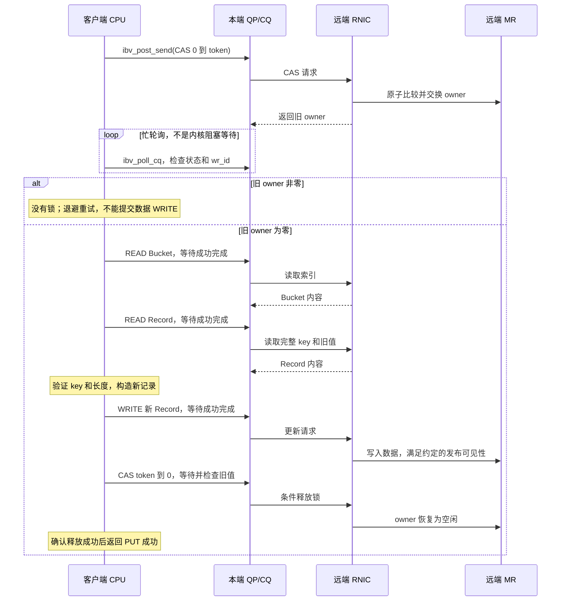

---
tags:
  - 高性能存储
  - RDMA与RoCE
  - KV存储
status: 草稿
---

# One-Sided RDMA KV：READ、WRITE、Atomic、内存布局与一致性

> `RDMA READ(remote_addr)` 解决“取回哪些字节”；`GET(key)` 还必须解决“地址在哪里、字节属于哪个版本、谁正在修改、何时允许回收”。从 verbs 到 KV，缺少的不是另一套网络 API，而是**远端数据结构与并发协议**。

本篇假定已经理解 [[4.2 Verbs 编程模型]]、[[4.4 内存注册与零拷贝]] 和 [[4.5 Send Recv 与 RDMA Read Write]]，不重复创建 QP/MR 的入门代码。正文先建立一个可以逐步验证的单边 KV 模型，再解释为什么 HERD 选择另一条路径。实验入口见 [[4.22 RDMA 论文复现实验：rdma_bench、HERD 与 Benchmark 方法]]。

**资料边界**：单对象并发、一致性与故障模型取自 DDIA 第 1 版；verbs 能力与限制由 rdma-core 文档补充；下面的 64 B 数据布局和保守锁协议是教学设计，**不是 HERD 的实际布局或完整实现**。[^ddia-cas][^ddia-linear][^verbs-atomic]

---

## 1. 先分清：单边操作不等于整套系统完全没有服务端 CPU

判断 one-sided KV，应该看“一次 GET/PUT 的关键路径是谁执行”，不能只看程序调用过 `RDMA WRITE`。

| 架构类别 | 客户端做什么 | 服务端 CPU 做什么 | 并发责任主要在哪里 |
| --- | --- | --- | --- |
| 纯单边数据路径 | 定位 bucket，READ/WRITE 记录，执行 CAS 协议 | 初始化、注册内存、管理成员、回收与恢复等控制工作 | 客户端协议 + RNIC 提供的原子能力 |
| 单边读、服务端更新 | READ 数据结构；把更新请求交给服务端 | 处理更新，并与单边读建立一致性协议 | 服务端写入协议 + 客户端验证协议 |
| 服务端执行的 RDMA RPC | 把 GET/PUT 请求投递给服务器，等待结果 | 查表、修改 KV、生成响应 | 服务端数据结构与线程所有权 |

**HERD 属于第三类，而不是第一类。** SIGCOMM 2014 的 HERD 使用 UC RDMA WRITE 投递请求，服务端 CPU 轮询请求区并执行 KV 操作，再通过 UD SEND 返回结果。请求使用单边原语，但一次 KV 操作仍然依赖服务器执行。它的设计目标之一，是用本地查表替代跨网络的依赖性 READ。[^herd]

因此，本篇的学习顺序是：先明白纯单边 KV 必须承担什么，再理解 HERD 把哪些工作交回了 CPU，而不是把 HERD 当成“客户端直接 READ 远端哈希表”的例子。

## 2. 从 key 到远端地址：客户端必须掌握一份布局协议

本地哈希表可以跟随进程内指针。远端 MR 中的数据结构必须能由另一台机器解释。

假设控制面已经交换并验证以下描述符：

| 字段 | 用途 | 不能替代什么 |
| --- | --- | --- |
| `remote_base`、`region_length` | 计算并检查远端地址范围 | 不能直接作为客户端的本地指针解引用 |
| `rkey` | 使用获准的远端访问权限 | 不代表某个 key 的锁，也不代表应用级事务权限 |
| `region_epoch` | 区分重启、重建后的内存实例 | 只在请求中携带 epoch，不会自动阻止旧 DMA |
| `layout_version` | 约定结构版本、字段宽度与字节序 | 不等于记录更新版本 |
| `bucket_offset`、`bucket_count`、`record_offset` | 定位索引区与记录区 | 不能省略越界、溢出、对齐检查 |
| 哈希算法及种子 | 两端计算同一个 bucket | fingerprint 相同不等于完整 key 相同 |

普通 MR 模式下，可以把远端位置组织成 `remote_base + offset`。这只是地址协议，不要求使用 zero-based MR；使用 `ibv_reg_mr_iova` 等接口时，应以实际协商的 IOVA 为准。权限和地址模式的具体含义见 `ibv_reg_mr(3)`。[^mr]

**不要直接把 `std::unordered_map` 注册给远端客户端遍历。** 它的实现布局、内部指针、分配器状态、扩容与对象生命周期都不是远端线协议。类似地，`std::string` 对象的字节不等于字符串正文；`std::vector` 对象也不是一个可以直接远端跟随的数组。

内存注册解决的是访问映射；远端可解释的数据结构解决的是语义。两者需要分开设计，MR/rkey 的有效期继续参照 [[4.12 rkey lkey 生命周期]]。

## 3. 一个足够具体的内存布局

为了专注协议，先限制问题：固定 16 B key、最大 32 B value；启动前预填充；运行期只 GET 和更新已有 key，不插入、不删除、不扩容、不复用记录。每个 bucket 最多 3 个 slot，初始化时必须处理超出容量的冲突，不能静默丢 key。

下面的布局采用“索引与 value 分离”。它不是最省网络往返的布局，但能明确呈现 Hash Table → Bucket → Slot → Record 的依赖。

![[图片/SVG/8_4_21_1.svg|1000]]

图中需要读出三件事：**CAS 只操作 owner 字；slot 保存偏移而不是本地指针；version/key/value 的一致性仍由协议负责。** 蓝色索引区指向绿色记录区。每个块是 64 B 的教学布局，不表示一次 64 B RDMA 传输具有硬件原子性。

### 3.1 C++17 布局检查：先验证字节，再讨论协议

以下四段顺序拼接为 `layout_check.cpp`。它是可以编译运行的**布局与地址边界检查程序**，不创建 MR/QP，也不模拟 RNIC 的内存一致性。

第一段定义记录。`version` 记录内容代际；`value_len` 明确有效负载长度；保守协议中这些字段都在 bucket 锁内访问。

```cpp
#include <array>
#include <cassert>
#include <cstddef>
#include <cstdint>
#include <iostream>
#include <limits>
#include <optional>
#include <type_traits>

struct alignas(64) Record {
    std::uint64_t version{};              // +0：记录版本，不是 MR epoch
    std::array<std::byte, 16> key{};       // +8：完整 key，必须核对
    std::uint32_t value_len{};            // +24：范围为 0..32
    std::uint32_t flags{};                // +28：教学例保留，初始化为 0
    std::array<std::byte, 32> value{};     // +32：内联保存 value 正文
};

static_assert(std::is_trivially_copyable_v<Record>);
static_assert(std::is_standard_layout_v<Record>);
static_assert(sizeof(Record) == 64 && alignof(Record) == 64);
static_assert(offsetof(Record, key) == 8);
static_assert(offsetof(Record, value_len) == 24);
static_assert(offsetof(Record, value) == 32);
```

第二段定义索引。fingerprint 只用于筛选候选；真正命中必须读取记录并比较完整 key。锁字与 slot 分离，禁止把“CAS 成功”解释成整桶原子更新。

```cpp
struct Slot {
    std::uint64_t fingerprint{};          // 哈希摘要；不是完整 key
    std::uint64_t record_offset{};        // 相对协商地址基准的字节偏移
};

struct alignas(64) Bucket {
    std::uint64_t owner{};                // +0：0 表示空闲；只由 RNIC CAS 改
    std::uint32_t used{};                 // +8：有效 slot 数，最大为 3
    std::uint32_t flags{};                // +12：保留字段
    std::array<Slot, 3> slots{};           // +16：3 个 16 B slot
};

static_assert(sizeof(Slot) == 16);
static_assert(std::is_trivially_copyable_v<Bucket>);
static_assert(std::is_standard_layout_v<Bucket>);
static_assert(sizeof(Bucket) == 64 && alignof(Bucket) == 64);
static_assert(offsetof(Bucket, slots) == 16);
```

第三段检查远端地址。使用减法检查长度，避免 `offset + bytes` 先溢出；还要防止描述符本身形成回绕地址区间。

```cpp
struct RemoteRegion {
    std::uint64_t base{};
    std::uint64_t length{};
};

std::optional<std::uint64_t> checked_remote_addr(
    const RemoteRegion& region, std::uint64_t offset,
    std::uint64_t bytes) noexcept {
    const auto max = std::numeric_limits<std::uint64_t>::max();
    if (bytes == 0 || region.length > max - region.base)
        return std::nullopt;              // 拒绝空操作或回绕的地址描述符
    if (offset > region.length || bytes > region.length - offset)
        return std::nullopt;              // 请求不完全位于 MR 范围内
    return region.base + offset;
}
```

最后一段只验证布局和边界。真实提交前还要检查 rkey/epoch、记录区范围、`value_len`、slot 数量，以及 CAS 目标的 8 B 对齐。

```cpp
int main() {
    const RemoteRegion region{0x100000, 4096};
    assert(checked_remote_addr(region, 64, 64).value() == 0x100040);
    assert(!checked_remote_addr(region, 4090, 64));
    assert(!checked_remote_addr(region, 0, 0));
    assert(!checked_remote_addr({UINT64_MAX - 4, 16}, 0, 8));
    std::cout << "Bucket=" << sizeof(Bucket)
              << ", Record=" << sizeof(Record) << '\n';
}
```

用 `g++ -std=c++17 -Wall -Wextra -Wpedantic -Werror layout_check.cpp -o layout_check` 构建，然后执行 `./layout_check`。本例在同构 ABI 下检查 native layout；正式跨架构协议应明确端序、编码与 ABI 版本，不能把 `static_assert` 当作网络互操作保证。

## 4. GET 为什么可能需要多次网络访问

索引与记录分离时，客户端先计算 bucket 地址，READ bucket，得到候选 slot 的 offset，再 READ 对应 Record。第二次 READ 的地址依赖第一次 READ 的结果，不能靠一次 `post_list` 自动消除依赖。

完整查询必须处理：没有匹配摘要、多个摘要候选、完整 key 不同、无效偏移和异常长度。索引快照不一致时，也不能把“暂时没看见”直接当成 NOT_FOUND。

把 value 内联在 bucket 中，可以减少一次间接读取，但会增大 bucket，降低单位容量内的 slot 数；把 value 放入独立 arena，有利于可变长对象与紧凑索引，却会引入间接读取、发布和回收问题。这里的取舍是**网络依赖深度、传输字节数与数据结构密度**，不能只用一次 READ 的带宽决定。

> [!note] 两种“inline”不要混淆
> “value 内联在 bucket”是数据布局；`IBV_SEND_INLINE` 是提交 SEND/WRITE 时把源数据复制进 WQE 的发送优化。后者不适用于把 RDMA READ 的返回数据“内联回来”。参照 [[4.16 Inline Batching 与 Doorbell 优化]]。[^post]

## 5. 谁拥有并发控制：机制、策略与所有权不是同一层

假设两个客户端同时更新同一个记录。如果它们各自 WRITE 64 B，RNIC 不会替应用判断哪个版本应获胜；另一个 READ 也不能默认获得“全部旧值或全部新值”的原子快照。

| 名称 | 真正提供的能力 | 仍然缺少的条件 |
| --- | --- | --- |
| 服务端 CPU / 单 worker | 在软件中选择执行顺序 | 所有冲突访问必须确实进入同一个所有者 |
| NIC Atomic | 在支持的原子域内对一个控制字执行原子操作 | 多字段协议、错误处理、对象回收 |
| CAS | 比较旧控制字并有条件替换 | 失败分支、重试策略、ABA 防护 |
| Version | 标记或检测更新代际 | 写者互斥、读写顺序、回绕与复用规则 |
| Lock | 一个所有者暂时独占资源的协议 | 加锁原语、释放规则、崩溃恢复和所有访问方的配合 |

所以答案不是“选 CPU、CAS、Version 三者之一”，而是：**应用协议定义所有权；CPU 或客户端执行协议；RNIC 的 CAS 只提供其中一个不可分割步骤。** DDIA 对 compare-and-set 的讨论也是围绕条件更新与失败重试展开，而不是把原子指令等同于完整事务。[^ddia-cas]

### 5.1 先明确原子域

本篇使用常见的 64 位 CAS/FAA 模型：目标满足设备要求的对齐，MR/QP 开启相应权限，设备支持该操作。`ibv_query_device[_ex]` 的能力检查不能跳过。[^verbs-atomic]

默认工程边界是：所有争用同一锁字的原子操作通过**同一目标 RDMA 硬件所保证的原子域**执行。不能默认它们与远端 CPU 的 `std::atomic`/CAS、另一块 RNIC 或普通覆盖 WRITE 组成统一原子顺序。存在扩展保证时，应单独记录硬件能力，而不是把扩展当成通用 verbs 语义。[^verbs-atomic][^atomic-cap]

本例中，服务端 CPU 只在所有客户端开始前初始化 owner；运行期不读改这批控制字和记录。持有者释放锁也使用 CAS，不与 CPU store 混用。

## 6. 先做保守版本：所有 GET/PUT 都拿 bucket 锁

这是用于建立正确性基线的**教学协议**，不是推荐追求峰值的最终设计。它刻意牺牲并行度，以便把每一个依赖和错误分支暴露出来。

### 6.1 适用前提

所有参与者合作遵守同一锁协议；记录不迁移、不复用；锁的原子域已确认。一个操作内的依赖步骤使用同一条 RC QP，并逐步等待匹配 `wr_id` 的成功完成。MR 不开启 relaxed ordering。尤其要确认目标平台保证“发布解锁后，新持有者能够读取此前写入的完整数据”；仅凭本地 post 成功或网卡宣传页，不能满足这个前提。

这是一份需要实现时核对的协议契约。下面的互斥与线性化分析建立在契约成立之上，不是声称已在任意 RNIC 上验证。提交顺序、数据落地和 CPU 观察属于不同问题，参照 [[4.13 RDMA 操作顺序性]] 和第 8 节。

### 6.2 GET 的执行路径

先为本操作选择会话内唯一、非零的 owner token，然后 CAS `0 → token`。等待 CAS 完成并读取返回的旧值；旧值不为 0 时，本次没有获得锁，不能继续读受保护对象。

获得锁后，READ Bucket；检查 `used <= 3` 和候选 offset；逐个读取候选 Record，比较完整 key，验证长度，把结果复制到本地拥有的返回对象。最后 CAS `token → 0` 并检查返回值。只有锁内获得的一致结果才允许返回。

没有碰撞候选的 MISS 同样在锁内判定。这里的“正常未命中”和“坏 offset、坏长度、WC 错误”必须是不同结果，不能把错误伪装成 key 不存在。

### 6.3 PUT 的执行路径

PUT 同样先拿 bucket 锁，再查找并验证已有 key。客户端在自己的稳定缓冲区构造新 Record，包括递增后的 version、长度和完整 value。WRITE 新 Record，确认该步骤成功并满足上述发布契约，再 CAS `token → 0`。缺失 key 在本教学模型中返回明确的 NOT_FOUND，不偷偷扩展成 INSERT。

下面省略了 WC 字段细节，但保留“CAS 结果必须由客户端判断”和“失败不能继续 WRITE”两个关键依赖。



**给 WRITE 加 `IBV_SEND_FENCE`，不能替代检查 CAS 是否成功。** fence 可以约束执行依赖，但不会根据返回的旧值帮应用执行 `if` 分支。具体依赖语义见 [[4.14 Fence 与内存可见性]]。

### 6.4 这个版本如何获得单 key 线性一致性

在前提成立、没有故障的运行中，同一 bucket 同时只有一个持有者，其他读写者不能观察中间状态。PUT 可选择成功释放锁时作为线性化点；GET 可选择锁内完成读取的时刻作为线性化点。读写结果因而可以排列成一个遵守实时先后关系的串行历史。[^ddia-linear]

这里保护粒度是 bucket，不是整个 KV；不同 bucket 可以并行。它不提供多 key 事务，也不意味着数据已经持久化。

若一次命中 GET 需要锁 CAS、Bucket READ、Record READ、解锁 CAS，则是 4 次远端操作；更新已有记录的 PUT 还要增加一次 WRITE。碰撞、争锁重试会继续增加开销。这个数字是**本教学布局与协议的操作计数**，不是所有单边 KV 的下界。

## 7. 再讨论优化：Version 与 CAS 发布究竟解决什么

### 7.1 Version 重读是一种验证协议，不是自动获得的快照

常见想法是：读取版本 `v1`，读取 payload，再读取版本 `v2`；版本相同且表示稳定状态才接受，否则重试。

这个想法还需要证明：写者如何互斥；版本标记如何先于修改被观察；最终版本如何晚于完整 payload 发布；读者三次观察的顺序是否成立；版本观察是否原子；在整个读取窗口内版本是否可能回绕或记录被复用。

任何一项没有依据，“前后版本相等”都不能独立证明中间 payload 一致。尤其不能把一次大 RDMA READ 的头尾两个版本相等直接当成通用证明：同一 WQE 内各字节的放置/采样顺序不是一个 C++ seqlock 的执行顺序。

本篇因此不提供一段冒充跨 RNIC 通用实现的 `remote_seqlock_read()`。在具体平台上优化时，应先列出所依赖的保证，再建立对抗性交错测试。版本验证失败率本身也需要进入 benchmark，而不能只统计最终成功。

### 7.2 不可变记录 + 原子发布描述符

另一条思路是避免就地改 value：先在自己独占的新位置构造不可变记录，确认记录已按所需语义发布，再 CAS 一个较小的描述符，使 slot 从旧记录指向新记录。CAS 成功者完成发布；失败者必须重新判断，而不是覆盖赢家。

这个设计把“多字节 value 的更新”变成“发布哪个不可变版本”，但没有消除以下责任：

| 问题 | 必须明确的答案 |
| --- | --- |
| 描述符宽度 | 指针/偏移、代际、状态是否真的能放入设备支持的原子宽度？ |
| 描述符读取 | 读取是否具有所需原子性？不能因其恰为 8 B 就默认普通 RDMA READ 与 CAS 构成统一原子观察 |
| 发布顺序 | 其他客户端看到新描述符时，记录是否已经完整可读？ |
| CAS 失败的新记录 | 由谁回收，何时可以回收？ |
| 老记录 | 是否仍有客户端沿旧描述符发起 READ？ |

最容易检查的起点，是在有限实验中**不回收旧记录，全部客户端静默后统一回收**。这是用容量换简单性的教学限制，不是长期运行的存储设计。

### 7.3 ABA 与回收必须一起讨论

假设描述符从位置 A 变成 B，随后 A 被复用。一个慢客户端只比较地址，可能把新 A 当成原先的 A。增加 generation 可以帮助识别复用，但 generation 会回绕，而且“拒绝旧版本”不等于“旧 DMA 不会覆盖新对象”。

读者保护、epoch/grace period 或其他回收机制必须覆盖**已经发出但尚未完成的远端访问**。仅等待本地线程退出临界区，无法自动证明远端 RNIC 没有在途操作。

## 8. 四种保证分开核对，不靠一个“原子”统包

| 保证层 | 能回答的问题 | 不能据此推出 |
| --- | --- | --- |
| verbs 提交与完成 | WR 是否提交；对应操作是否成功完成；本地缓冲区何时可重用 | 服务端应用已执行 GET/PUT |
| 数据放置与观察 | 数据如何到达内存，消费者何时能够安全读取 | 一个多字段对象天然原子 |
| 并发协议 | 哪个写者获胜；读者获得哪个一致版本 | 崩溃后还能找到该版本 |
| 持久化与复制协议 | 数据进入哪个持久化域，副本如何确认 | 任意 RDMA WRITE 已经达成复制提交 |

`IBV_ACCESS_RELAXED_ORDERING` 可能放宽网络写入目标 MR 的顺序，不能作为“免费优化”开启。其文档对 completion 的说明，也不能被转述为“任意时刻轮询一个字段都等价于获得 completion”。[^mr]

较新的 rdma-core 文档提供 `ibv_query_qp_data_in_order()`，可查询指定操作的数据放置顺序能力。它区分 **WQE 内部**顺序与 **WQE 之间**顺序，而且对 CPU 读取、非 relaxed-ordering 目标 MR 等条件有明确限制；不能把查询结果直接拿来证明另一个客户端的多次 RDMA READ 得到了原子快照。是否具备此 API 与能力，以安装版本和 provider 为准。[^in-order]

同样，给本地变量套上 `std::atomic_ref` 或加一个 acquire load，不会自动把 RNIC DMA 写变成 ISO C++ 中与它配对的 release store。它可以参与平台特定的设备同步实现，但**不能单独提供跨 CPU/RNIC 的可移植证明**。既有顺序性笔记应在这个设备契约边界内使用。

## 9. 故障路径比正常释放锁更重要

### 9.1 超时之后，操作结果可能未知

需要区分至少三种结果：明确未提交、明确成功完成、已经提交但无法确定最终效果。网络故障时，最后一种不能简单变成“远端没有修改”。[^ddia-fault]

| 出错位置 | 可能状态 | 保守处理 |
| --- | --- | --- |
| 加锁 CAS 已发出，结果丢失 | 可能已持锁 | 标记结果未知，不能当作未持锁继续复用 token |
| Record WRITE 中途失败 | 可能存在部分写入 | 不向读者发布成功；进入修复或重建路径 |
| 解锁 CAS 结果未知 | 可能仍锁住，也可能已释放 | 不盲目补发覆盖写，不假装操作确定失败 |
| 持锁客户端崩溃 | bucket 无法继续服务 | 由控制面恢复，不能靠普通客户端随意清零 |

故障检测、QP 错误和连接重建分别衔接 [[4.17 Retry RNR 与 Timeout]] 与 [[4.19 RDMA 故障恢复与连接重建]]。

### 9.2 为什么“超过 1 秒就抢锁”不安全

旧客户端可能只是暂停，恢复后仍继续执行 WRITE。即使新客户端已拿到新锁，旧 WRITE 仍可能损坏数据。DDIA 的 fencing 要求是：**受保护资源必须拒绝过期所有者的操作**，而不只是客户端自觉检查租约。[^ddia-fence]

对 one-sided RDMA，单纯把 epoch 放进消息或本地结构，并不会让 RNIC 检查这个应用字段。恢复方案必须落实为真正的访问撤销、旧连接/在途访问处理、隔离的新内存代际，或可验证的原子发布协议。rkey 更换也不能被当成已经发出操作的自动回滚。

### 9.3 资源生命周期与 RAII 边界

客户端本地 READ 目标、非 inline WRITE 源缓冲区及其 MR，必须活到相关操作完成或经过可靠的错误清理；不能让栈上的对象提前退出。共享 QP/CQ 还必须有清晰的完成分发与缓冲区所有权，见 [[4.18 多线程下 QP 使用模型]]。[^post]

正常关闭应先停止新提交，协调远端不再访问并排空/终止相关在途操作，再解除 QP 对缓冲区的使用，注销 MR，最后释放内存及其余依赖资源。具体失败清理必须遵循 provider 的生命周期约束。

RAII 适合管理本地资源，却不应让一个析构函数无条件发送“解锁 WRITE”。远端锁的释放需要完成、错误处理以及结果确认；**本地对象被析构，不代表远端临界区已经安全结束**。

此外，持有整个 MR 的写权限通常意味着能够绕过应用锁协议。本文假定可信、合作的客户端，不把 rkey 宣称为逐 key 的多租户授权系统。

## 10. 用什么指标判断 one-sided 是否值得

不要只比较 `ib_read_bw` 和 `ib_write_bw`。一次逻辑操作的成本至少包括远端操作数、必须串行的依赖阶段、读写字节量、争用重试、CPU 时间和对象回收开销。

| 场景 | 纯单边路径需要重点观察 | 服务端执行路径需要重点观察 |
| --- | --- | --- |
| 紧凑只读、少间接访问 | READ 字节量与并行度 | RPC 和服务端调度的额外工作 |
| 多层间接寻址 | 网络依赖深度 | CPU 本地缓存命中与查表批处理 |
| 热 key 高频写 | CAS 冲突、锁等待、重试尾延迟 | 单所有者排队与热点分片 |
| 大 value | value 传输与内存生命周期 | CPU 是否参与拷贝、控制与数据能否分离 |

这些是需要验证的工程假设，不是固定胜负结论。服务端 CPU 少做工作，可能意味着客户端做了更多网络往返；把冲突交给 CPU，也可能只是把远端锁竞争变成了单 worker 排队。

下一篇通过作者的 `rdma_bench/herd` 把这些问题落到真实源码与实验中。要带着的核心问题是：**测到的性能改善，来自少传字节、少发 WR、减少依赖往返，还是把工作转移到了别处？**

## 11. 自测：实现前必须能够回答的三个问题

> [!question] CAS 返回旧值为非零，但是后续 WRITE 已经排进 SQ，哪里出了问题？
> 把执行顺序误当成条件执行。必须先知道是否成功获得所有权；fence 不负责执行成功/失败分支。

> [!question] Version 前后相等，为什么还不能立即宣布读取正确？
> 还缺少写者互斥、版本观察原子性、数据与版本的发布/读取顺序、回绕和对象复用的证明。

> [!question] 重启服务器并发布新 rkey，为什么不等于恢复已经完成？
> 还需要处理旧客户端、旧 QP、在途访问和旧内存代际，恢复应用的布局与一致性状态；权限变更不是业务回滚。

## 参考资料

[^ddia-cas]: Martin Kleppmann, *Designing Data-Intensive Applications*, 1st ed., O’Reilly, 2017，第 7 章 “Preventing Lost Updates / Compare-and-set”，印刷页 242–245。本篇使用条件更新与并发控制原则，不把教材当作 RDMA API 文档。
[^ddia-linear]: 同上，第 9 章 “Linearizability / What Makes a System Linearizable?”，印刷页 324–330。
[^ddia-fault]: 同上，第 8 章 “Unreliable Networks / Detecting Faults”，印刷页 277–282。
[^ddia-fence]: 同上，第 8 章 “Fencing tokens”，印刷页 302–304，尤其图 8-5 中资源端拒绝过期 token 的要求。
[^herd]: Anuj Kalia, Michael Kaminsky, David G. Andersen, *Using RDMA Efficiently for Key-Value Services*, ACM SIGCOMM 2014, pp. 295–306，§3–4。[DOI](https://doi.org/10.1145/2619239.2626299)。只用来说明 HERD 的设计选择，不把其历史硬件测量推广成当前所有 RNIC 的结论。
[^verbs-atomic]: rdma-core, [ibv_wr_atomic_fetch_add(3)](https://man7.org/linux/man-pages/man3/ibv_wr_atomic_fetch_add.3.html)，尤其 “Atomic operations”；以及 [ibv_query_device_ex(3)](https://man7.org/linux/man-pages/man3/ibv_query_device_ex.3.html)。访问日期：2026-09-07。
[^atomic-cap]: NVIDIA, [Atomic Operations](https://networking-docs.nvidia.com/doca/archive/3-5-0/atomic-operations)，64-bit 原子操作与原子域说明。文档归档版本 3.5.0；访问日期：2026-09-07。此处引用能力语义，不要求安装 DOCA 才能使用 libibverbs。
[^mr]: rdma-core, [ibv_reg_mr(3)](https://man7.org/linux/man-pages/man3/ibv_reg_mr.3.html)，权限、地址模式、`IBV_ACCESS_RELAXED_ORDERING`。访问日期：2026-09-07。
[^post]: rdma-core, [ibv_post_send(3)](https://man7.org/linux/man-pages/man3/ibv_post_send.3.html)，提交、缓冲区生命周期、inline 与 WR 标志。访问日期：2026-09-07。
[^in-order]: rdma-core, [ibv_query_qp_data_in_order(3)](https://man7.org/linux/man-pages/man3/ibv_query_qp_data_in_order.3.html)，查询范围与 NOTES 中的限制。访问日期：2026-09-07。
