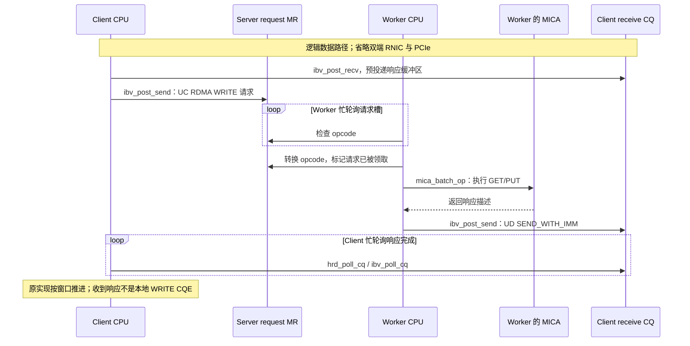

---
tags:
  - 高性能存储
  - RDMA与RoCE
  - 论文复现
  - 性能测试
status: 草稿
---

# RDMA 论文复现实验：rdma_bench、HERD 与 Benchmark 方法

> 跑出一个 Mops 数字，只证明某个程序在某组条件下输出了这个数字。真正的复现实验还要说明：运行的是哪份代码、完成了什么操作、为什么快、瓶颈在哪里，以及结果在哪些条件下不成立。

本篇以作者开源的 `efficient/rdma_bench` 为实验主体，而不是另造一个声称等价的 KV 项目。[[4.21 One-Sided RDMA KV：READ、WRITE、Atomic、内存布局与一致性]] 解释协议责任；[[4.9 ibv_perftest 基准实验]] 提供网络基线。本篇补齐二者之间的源码阅读、启动约束、正确性检查和测量方法。

**适用范围**：Linux、用户态 verbs、固定版本的历史研究代码。下面提供可核查的构建与启动步骤，但没有声称已在当前环境运行真实 RNIC 实验，也没有提供虚构的吞吐或延迟结果。

---

## 1. 固定复现对象：HERD 2014 与 rdma_bench 不是同一个版本

| 对象 | 本篇如何使用 | 版本边界 |
| --- | --- | --- |
| *Using RDMA Efficiently for Key-Value Services*，SIGCOMM 2014 | 理解 HERD 的通信架构与设计目标 | 论文的硬件、工作负载和测量结果属于当时实验 |
| `efficient/HERD` | 核对原始实现的历史环境与维护说明 | README 明确说明不再维护，指向改进版本 |
| *Design Guidelines for High Performance RDMA Systems*，USENIX ATC 2016 | 理解 NIC/PCIe、连接状态、batching 等因素 | 不把该代硬件的参数直接套到新网卡 |
| `efficient/rdma_bench/herd` | 本篇实际跟踪的源码和实验入口 | 改进后的 HERD benchmark，不是原论文代码逐字复刻 |

本次核对的 `rdma_bench` 基线为：

```text
repository: efficient/rdma_bench
branch: master
commit: a038ec5e2b9f1ac9d4da2fc0044786c82c9ee575
commit date: 2019-12-28
commit message: Sync minor improvements from pmem-bench
review date: 2026-09-07
```

这份版本记录用于重建相同源码状态。`master` 只是核查时所在分支，实验应固定完整 SHA。2019 年的提交日期也说明：“作者推荐的改进版”不等于“2026 年持续维护的新代码”。[^bench-version][^original]

原始 `efficient/HERD` README 记录的测试环境包括 Ubuntu 12.04、Linux 3.2.0、MLNX OFED 2.2 和 ConnectX-3。它是历史兼容性记录，不是要求今天的实验机器全部降级到该环境。[^original]

## 2. 第一遍读源码：先画出责任边界

### 2.1 文件导航

以下路径均相对固定版本的 `rdma_bench` 仓库；不要把它们误当作 vault 的内部链接。

| 路径 | 先找什么 | 要回答的问题 |
| --- | --- | --- |
| `README.md` | 硬件要求、libhrd、QP registry | 哪些属于控制面？哪些 benchmark 支持 RoCE？ |
| `herd/README.md` | 参数解释与示例 | 示例是否与源码的客户端计数一致？ |
| `herd/main.h` | 数量、布局、窗口和信号批次宏 | 编译后固定了哪些实验维度？ |
| `herd/main.c` | 参数解析与启动断言 | master、worker、client 各需要什么参数？ |
| `herd/master.c` | 请求区、UC QP、注册信息发布 | 谁拥有请求 MR？为什么会一直等某个 client？ |
| `herd/client.c` | 请求构造、WRITE、RECV/CQ 等待 | 是否真的验证了 GET 返回的 value？ |
| `herd/worker.c` | 请求区轮询、MICA、响应 postlist | CPU 在哪里执行 KV？批量边界是什么？ |
| `mica/mica.h` | key、slot、bucket、record | 实际 KV 布局是什么？value 最大是多少？ |
| `herd/Makefile` | 编译器、目标文件、链接库 | 这个子目录究竟用 make 还是 CMake？ |

这条阅读路线来自实际代码，不是把 README 中的项目名称重新排列。下文把其中几个会直接影响实验结论的地方展开。[^bench-root][^herd-readme][^main][^client][^worker][^master][^mica]

### 2.2 HERD 请求写入的是 mailbox，不是直接覆盖 KV value

固定版本的 `client.c` 为客户端建立 UC 连接 QP，使用 `IBV_WR_RDMA_WRITE`，把请求写入 master 的注册请求区。地址按下面的维度计算：

```text
request_slot = OFFSET(worker_id, client_global_id, window_slot)
             = worker_id * NUM_CLIENTS * WINDOW_SIZE
             + client_global_id * WINDOW_SIZE
             + window_slot

remote_addr  = request_region_base
             + request_slot * sizeof(struct mica_op)
```

这是源码中的地址计算关系。它把每个 worker、client、窗口槽隔离开，避免客户端争抢同一个请求槽；**这不是用户 key 对应的哈希桶地址**。真正的哈希查找随后由 worker 在其 MICA 实例中执行。[^client][^master]

worker 通过请求的 `opcode` 判断是否有新工作，把 HERD opcode 转换为 MICA opcode，批量调用 `mica_batch_op()`，再使用 UD QP 的 `IBV_WR_SEND_WITH_IMM` 回包。immediate data 中放的是 worker ID，不是完整的逐请求唯一序号。[^worker]



图中要区分三件事：请求 WRITE 的发送完成、worker 执行完成、客户端收到应用响应。它们不是同一个事件。普通请求 WRITE 不依靠 server receive CQ 通知 worker；worker 在轮询自己的内存。

### 2.3 “单 worker 所有权”的范围不能想当然扩大

固定版本中，每个 worker 创建自己的 MICA 实例并填充 key；客户端选择 worker 的随机数与选择 key 的随机数是分开的。因此，验证这份 benchmark 时，应把逻辑对象标识为 **`(worker_id, key)`**，或者把正确性实验限制为一个 worker。

不能直接假设它已经实现了“所有 worker 共享的单一 key 命名空间，按 key 唯一路由”。要验证这样的系统，必须增加确定性路由，并把改动单独记入 patch。`herd/README.md` 的 TODO 也说明了各 worker 都预填充整个 key 集合的情况。[^client][^worker][^herd-readme]

### 2.4 请求标记的可见性需要重新验证

`worker.c` 使用 `volatile` 请求指针并轮询 opcode。`volatile` 本身不是 DMA 顺序证明，也不是 C++ 原子同步协议。换 RNIC、CPU、provider 或开启 relaxed ordering 后，都不能只因为历史版本使用了这种写法就宣布安全。

请求字段的放置顺序、标记位置、槽复用规则和 CPU 观察行为，需要结合实际平台验证。相关边界见 [[4.21 One-Sided RDMA KV：READ、WRITE、Atomic、内存布局与一致性]] 第 8 节。`rdma_bench` 本身还包含 `write-incomplete`、`write-reordering` 等用于检查相关现象的程序；它们的存在不是某一种结论对所有设备成立的保证。[^bench-root][^worker]

## 3. 实验环境：最少两台机器，但不能只问“有没有 RDMA”

先建立硬件路径清单，再决定是否执行未修改的代码。

| 项目 | 必须记录或核实的内容 |
| --- | --- |
| 网络 | InfiniBand 或 RoCE、网卡型号、固件、端口模式、实际协商速率、MTU、交换路径 |
| 主机 | CPU 型号、NUMA 拓扑、RNIC 的 PCIe 插槽和链路、可用内存 |
| 软件 | Linux 内核、rdma-core/OFED、provider、编译器、编译参数 |
| 资源 | memlock 限额、hugepages、System V SHM 容量和权限、QP/CQ/inline 能力 |
| 放置 | 客户端和 worker 绑核、MR/数据所在 NUMA node、是否跨 socket |
| 干扰 | 其他流量、后台作业、CPU 频率策略、是否运行额外观测工具 |

**默认优先选择 InfiniBand 实机复现这份 C 版本。** 顶层 README 只说“部分 C++ benchmark 支持 RoCE”；`herd/worker.c` 的 AH 构造使用 LID 和 `is_global = 0`。不能据此宣称这个 `herd/` 目录在 RoCE 上无须修改即可工作。GID、GRH 和寻址适配应作为移植任务独立记录。[^bench-root][^worker]

有 Soft-RoCE 时，可做接口学习与部分功能验证，参照 [[4.8 soft-RoCE 边界]]；不能用软件实现的带宽、延迟或数据观察顺序替代真实 RNIC 的性能与一致性结论。

本仓库用 memcached 做 **QP 元数据 registry**。它不执行被测的 KV GET/PUT，也不应把 memcached 自身吞吐算作 HERD 结果。使用实验专用实例，绑定受控私网地址，限制只允许实验节点访问，禁止公开暴露。[^bench-root]

## 4. 冻结源码与环境，不从 root 脚本开始

### 4.1 获取固定版本

下列命令只克隆和构建实验源码，不向任何仓库推送。

```bash
git clone https://github.com/efficient/rdma_bench.git
cd rdma_bench
git checkout --detach a038ec5e2b9f1ac9d4da2fc0044786c82c9ee575
mkdir -p evidence
git rev-parse HEAD > evidence/base-commit.txt
git status --short > evidence/status-before.txt
```

目的不是“追最新”，而是保证所有机器使用同一基线。随后发生的兼容性修复、规模缩减和测量改动，都应该能由 `git diff` 重建。

`herd/Makefile` 使用 GCC/make，链接 `libibverbs`、`libmemcached`、`libnuma`、pthread 等，并编译相邻的 libhrd/MICA 源码。安装对应发行版的开发依赖后，在源码根目录构建：

```bash
set -o pipefail
make -C herd 2>&1 | tee evidence/build.log
```

它不是统一的 `rdma_bench --mode herd`，也不能因为顶层提到部分目录向 CMake 迁移，就改用一个不存在的 HERD CMake 入口。现代编译器触发旧代码 `-Werror` 时，应保存错误并做最小兼容性修改，不要先全局删除错误检查。[^make]

### 4.2 留下主机指纹

以下采集命令面向 Linux；所需工具应事先安装。各节点分别保存结果。它们不是性能测试，也不调整系统配置。

```bash
mkdir -p evidence
uname -a > evidence/uname.txt
lscpu > evidence/lscpu.txt
numactl --hardware > evidence/numa.txt
lspci -nn > evidence/pci.txt
ibv_devinfo -v > evidence/ibv-devinfo.txt
rdma link show > evidence/rdma-link.txt
ulimit -l > evidence/memlock.txt
ipcs -m > evidence/shm-before.txt
grep -E 'Huge|MemAvailable' /proc/meminfo > evidence/memory.txt
gcc --version > evidence/compiler.txt
git diff --binary > evidence/local.patch
```

另外保存实际启动命令、设备固件版本、NIC 对应 NUMA node、配置过的交换机拥塞参数和 perftest 版本。上面的通用命令不保证已经包含所有厂商信息。

### 4.3 审计原启动脚本，而不是直接 sudo 执行

固定版本的 `run-servers.sh` 会删除固定 SHM key、`pkill memcached`、启动监听所有接口的 memcached；`run-machine.sh` 还会调用外部 `shm-rm.sh`。这些脚本针对作者的专用集群，不能在共享服务器上照抄。[^scripts]

本篇改用第 6 节的前台启动方式。旧 SHM 段只能在确认属于本实验、全部访问方已经停止后清理；不能使用泛化的“删除所有共享内存”命令。hugepage 和 memlock 调整应按实际内存预算完成，不把 README 中的极大 SHM 上限永久写入系统配置。

## 5. 先做一个能解释清楚的双机 smoke test

### 5.1 修正 README 的客户端数量歧义

源码为 client 分配全局 ID：

```text
client_global_id = machine_id * num_threads + thread_index
```

master 和每个 worker 都会等待 `0 .. NUM_CLIENTS-1` 的客户端注册信息。因此，各客户端机器线程数相同时，应满足：

**客户端机器数 × 每机器 num_threads = NUM_CLIENTS。**

固定版本的 HERD README 把一处机器数写成 `NUM_WORKERS / num_threads`；另一个例子写“20 个客户端线程”，却设置 `NUM_CLIENTS = 30` 并只启动两台各 10 线程的客户端。照抄会缺少 client 20–29。应以 `main.c` 的 ID 公式以及 master/worker 的等待循环为准。[^herd-readme][^main][^master][^worker]

默认 `NUM_CLIENTS = 70`、脚本 `num_threads = 14` 对应 5 台客户端机器，而不是 README 中矛盾的示例。缩到两台物理机器之前，必须同步修改数量和参数，不能只少启动几台机器。

### 5.2 建议的缩小配置

下表是**为 smoke test 提议的实验配置，不是作者原始配置**。服务端一台、客户端一台；两端使用一致的 `main.h` 重新构建。运行时保留一个 worker，有助于先检查单命名空间行为。

| 位置 / 参数 | 固定版本默认值 | smoke test 建议值 |
| --- | --- | --- |
| `herd/main.h: NUM_WORKERS` | 12 | 1 |
| `NUM_CLIENTS` | 70 | 2 |
| `WINDOW_SIZE` | 32 | 4 |
| `HERD_NUM_KEYS` | 8 × 1024 × 1024 | 64 × 1024 |
| `HERD_NUM_BKTS` | 2 × 1024 × 1024 | 32 × 1024 |
| `HERD_LOG_CAP` | 1024 × 1024 × 1024 | 16 × 1024 × 1024 |
| `HERD_VALUE_SIZE` | 32 B | 保持 32 B |
| `UNSIG_BATCH` / `NUM_UD_QPS` / `USE_POSTLIST` | 64 / 1 / 1 | 保持不变 |
| 运行参数：端口数量 | 原脚本使用 2 | 双端均使用 1 |
| client：`num-threads / machine-id` | 14 / 按机器递增 | 2 / 0 |
| worker：`postlist` | 32 | 1 |
| client：`update-percentage` | 0 | 先 0，之后分别测试 5、50 |

修改宏后再构建，不要以为它们都支持运行时 CLI。为了避免修改头文件后复用旧对象，执行：

```bash
make -C herd clean
set -o pipefail
make -C herd 2>&1 | tee evidence/build-smoke.log
git diff --binary > evidence/smoke.patch
sha256sum herd/main > evidence/binary.sha256
```

`clean` 会清理该实验工程中相关对象文件，不涉及笔记仓库。跨主机应核对基线 SHA、patch 和构建选项；二进制是否完全同一哈希还受编译环境影响。

这些缩小值仍须在目标机器上验证。它们降低数据规模，可能显著改变缓存命中率，所以**只能证明小规模路径跑通，不能拿来声称复现了论文的绝对性能**。

### 5.3 启动前检查源码不变量

`main.c` 与 `worker.c` 有如下关键断言；保留它们，不通过加 `NDEBUG` 绕开：[^main][^worker]

```text
HRD_Q_DEPTH == 128
UNSIG_BATCH >= WINDOW_SIZE
HRD_Q_DEPTH >= 2 * UNSIG_BATCH
postlist <= UNSIG_BATCH
postlist <= NUM_CLIENTS
postlist <= MICA_MAX_BATCH_SIZE
NUM_CLIENTS % num_server_ports == 0
sizeof(mica_op) * NUM_CLIENTS * NUM_WORKERS * WINDOW_SIZE < RR_SIZE
```

这段不是可执行代码，而是启动条件检查表。另有 worker 的端口数组边界、value 大小等限制，应一起核对。`UNSIG_BATCH` 的信号判断使用位掩码，不能任意改成非 2 的幂。

内存预算至少覆盖请求区、各 worker 的索引与日志、初始化临时内存和客户端工作集。默认配置仅每个 worker 的日志容量就设为 1 GiB，12 个 worker 不能按“一份 1 GiB KV”估算。

这个版本 `master.c`、`worker.c` 中有 NUMA node 0 的硬编码。下面的命令按此条件书写；RNIC 不靠近 node 0 时，要么接受并记录跨 NUMA 基线，要么同步修改分配和绑核逻辑。只把 `numactl` 改到另一个 node，不能保证 MICA 分配也跟着改变。[^master][^worker]

## 6. 启动顺序：registry → master → workers → clients

前提是：依赖已构建成功；IB 端口与访问权限正确；hugepages/SHM/memlock 足够；不存在会与本实验冲突的旧 registry 条目和 SHM 段。以下使用专用实验环境和普通用户权限；资源授权不足时应按管理员约定授予，而不是默认全部以 root 运行。

### 6.1 服务端终端 A：运行专用 registry

先把环境变量 `REGISTRY_IP` 设置为服务端实际私网 IP。此变量没有默认地址，避免误连接另一套实验。

```bash
: "${REGISTRY_IP:?请先设置服务端实际私网 IP}"
memcached -l "$REGISTRY_IP" -p 11211 -U 0
```

这个进程在前台运行，保留日志和明确的进程归属。端口、访问控制与其他实例冲突要在启动前排除。它不在被测 KV 数据路径中。

### 6.2 服务端终端 B：启动 master

在固定版本仓库根目录执行；每个新终端都需要正确设置 `REGISTRY_IP`。

```bash
: "${REGISTRY_IP:?请先设置服务端实际私网 IP}"
export HRD_REGISTRY_IP="$REGISTRY_IP"
numactl --cpunodebind=0 --membind=0 ./herd/main \
  --master 1 --base-port-index 0 --num-server-ports 1
```

等待 master 已创建请求区并发布 QP 的实际日志，再进入下一步，不能用任意的 `sleep 1` 当作可靠就绪条件。master 此后等待 client 注册属于预期行为。

### 6.3 服务端终端 C：启动 workers

```bash
: "${REGISTRY_IP:?请先设置服务端实际私网 IP}"
export HRD_REGISTRY_IP="$REGISTRY_IP"
numactl --cpunodebind=0 --membind=0 ./herd/main \
  --is-client 0 --base-port-index 0 \
  --num-server-ports 1 --postlist 1
```

worker 数量来自编译期 `NUM_WORKERS`，不是这里的 `--num-threads`。初始化 MICA 后，worker 还会等待所有 client 的 UD QP 信息。使用源码支持的长参数，不把其他子目录的参数混进来。

### 6.4 客户端终端 D：启动两个线程

```bash
: "${REGISTRY_IP:?请先设置服务端实际私网 IP}"
export HRD_REGISTRY_IP="$REGISTRY_IP"
numactl --cpunodebind=0 --membind=0 ./herd/main \
  --is-client 1 --num-threads 2 --machine-id 0 \
  --base-port-index 0 --num-server-ports 1 --num-client-ports 1 \
  --update-percentage 0
```

这里的端口索引遵循该版本 libhrd 的 0 起始配置约定，必须与设备枚举对应；不能机械等同于任意工具中的端口参数。

四组命令使用的参数来自 `main.c`，但本篇没有在双机 IB 环境执行它们。能看到所有预期 client 被找到、worker 进入循环、双方持续输出计数且没有 WC 错误，只能验收为**路径与负载发生器初步跑通**。原程序持续运行，不能误等一个并不存在的“实验正常结束”提示。[^main][^client][^worker]

结束时先停止客户端产生新请求，再停止 worker，最后停止持有请求 MR 的 master 和 registry。原程序没有完整的生产级排空与关闭协议；按进程停止不等于已经验证了安全故障恢复。确认所有相关进程和旧访问都结束后，才清理属于本次实验的 SHM 段。

## 7. 从 perftest 到应用：分三层验收

### 7.1 层 A：先建立同硬件网络基线

在相同端口、CPU/NUMA 放置和软件栈上完成 [[4.9 ibv_perftest 基准实验]]。常见可执行文件是 `ib_write_bw`、`ib_read_bw`、`ib_send_bw` 等，**不是 `ibv_write_bw`**；`ibv_` 通常出现在 verbs API 函数名中。[^perftest]

至少保留小消息操作率、大消息带宽、低并发延迟，以及 READ/WRITE/SEND 各自的配置。真实应用掉速时，先判断是网络基线也下降，还是 KV 层新增的工作。

不要把不同工具的“latency”直接放在一列比较。某些测试输出半往返估计，RDMA READ 完成时间和 KV 完整请求响应又是不同端点定义。按所用 perftest 版本核对口径；KV 延迟不能不加解释地除以 2。

### 7.2 层 B：用作者的微基准解释机制

| 子目录 | 与本次学习目标的关系 | 不应宣称它证明了什么 |
| --- | --- | --- |
| `rw-tput-sender` / `rw-tput-receiver` | READ/WRITE 出站与入站能力 | 任意 KV 的 GET/PUT 吞吐 |
| `atomics-sequencer` | 观察一侧 FAA 序列器及共享原子位置的成本 | 多字段 KV 更新的完整一致性 |
| `ws-sequencer` | WRITE 请求 + SEND 响应的服务端执行路径 | 完整 HERD 查表成本 |
| `ss-sequencer` | UD 消息型序列器路径 | 与 one-sided KV 完全相同的工作量 |
| `herd` | 网络协议 + CPU 查表 + 工作负载发生器 | 开箱即用的通用、持久化 KV 服务 |

具体二进制、机器数量和 flags 以各目录 README/源码为准。仓库不是统一 CLI，不能把 HERD 的 `--master` 参数用于所有子项目。上述角色是顶层 README 给出的用途。[^bench-root]

### 7.3 层 C：增加完整 KV 语义后的测量

逐项加入真实 key/value、并发更新、未命中、错误处理和一致性验证，再看网络基线的性能预算被消耗在哪里。小 KV 的瓶颈可能不是链路线速；需要同时观察客户端、服务端 CPU、NIC/PCIe 和内存访问，而不是只盯一个带宽数字。ATC 2016 论文提供的是这种硬件分解思路，不是一个适用于所有代际的固定最佳参数。[^atc]

## 8. 正确性门禁：原 benchmark 输出 IOPS 还不够

### 8.1 实际源码没有提供哪些验证

固定版本的 `client.c` 会等待响应 CQE，但没有逐请求检查返回 value 是否等于期望结果。它还把多个 RECV 指向同一块接收缓冲区；这适合其计数型测量方式，却不能直接用来保存并校验每个在途响应。PUT 请求构造中设置了 key/opcode/length，没有在该路径明确构造可供验证的 value 模式。[^client]

因此应把两种运行方式分开：

| 方式 | 可以用来做什么 | 结果标签 |
| --- | --- | --- |
| 固定基线的原始快路径 | 对照历史代码的计数型吞吐，研究 postlist 等机制 | baseline throughput；不是逐值正确性证明 |
| 带验证的实验 patch | 验证响应归属、value、重试与应用语义 | validated mode；必须保存 patch 和额外开销 |

不要静默给原实现补校验，再把新数字标成“原版 HERD”；也不要为了保留高数字而省略正确性边界。

### 8.2 建议增加的验证模式

这部分是**实验扩展方案，不是原项目现成的开关**。首先使用一个 worker，或显式把 `(worker_id, key)` 作为对象身份。每个在途响应使用独立、足够长的接收缓冲区，并建立 `wr_id`/请求上下文映射。UD 接收缓冲区中应用正文从 40 B 偏移处开始，校验代码必须遵守这一布局。[^recv]

为请求加入唯一标识，并在 value 中使用能够检查的结构，例如记录代际、写者标识和确定性填充模式。服务端返回足够的信息让客户端关联请求、核对 key/版本和长度。仅有 worker ID 的 immediate data 不足以支持任意乱序、重试和逐请求归属。

先验证单客户端 PUT 后 GET，再验证多个客户端更新同一对象。并发读取允许返回符合协议的旧版本或新版本，不要求无条件返回“最高版本”；但不能接受混合字段、错误对象或不符合实时顺序的结果。记录操作的 invocation/response 历史，再做单对象线性化检查。少量压力测试通过是证据，不是对所有硬件交错的形式化证明。[^ddia]

还应明确缓存语义：HERD/MICA 的研究场景包含 cache 行为，不能默认是永不淘汰的持久 KV。未命中率必须保留；若要把某个 MISS 视为错误，应先确认该配置和测试阶段承诺了键仍然驻留。[^herd-readme][^worker][^mica]

### 8.3 UC/UD 的丢失不能被 RC 的直觉覆盖

本版本的关键路径是 UC 请求、UD 响应。客户端在窗口边界等待一定数量的响应；丢失响应可能使该批等待无法结束。没有 WC 错误，并不意味着应用请求已经有确定结果。

增加超时、request ID、重试或去重时，必须定义重复 PUT 的语义、旧响应处理、请求槽复用和在途缓冲区所有权。不能把“看起来幂等的 PUT”推广成任意更新操作 exactly-once，也不能把超时直接当作操作未执行。故障模型参照 [[4.19 RDMA 故障恢复与连接重建]] 与 DDIA 第 8 章。[^ddia]

## 9. 设计实验矩阵：一次只改变一个可解释的因素

先固定一组能够持续运行、满足断言且没有正确性异常的配置，再分别开展以下实验。表中的取值是建议，不是论文的原始数据。

| 变量 | 建议起点 | 要解释的现象 |
| --- | --- | --- |
| GET/PUT 比例 | `update-percentage = 0 / 5 / 50` | 查表、更新和回包成本如何变化 |
| client 总数 | 从小规模增加，保持其他参数不变 | 何时不再被发生器供给限制 |
| `WINDOW_SIZE` | 4 / 8 / 16 / 32 | 依赖延迟是否被覆盖，排队是否增加 |
| worker 数 | 1 起步，逐步增加 | CPU 扩展与每 worker 数据复制的代价 |
| `postlist` | 1 / 4 / 8 / 16 / 32，在数量约束允许时 | 门铃摊销与等待、批量大小之间的关系 |
| `NUM_UD_QPS` | 1 起步，按设备容量增加 | 单 QP、NIC 调度与状态占用的影响 |
| value 大小 | 8 / 16 / 32 B | 数据长度与固定协议开销的关系 |
| NUMA 放置 | 本地基线与受控跨 node 对照 | 远端内存路径、PCIe 与 CPU 的影响 |

**两个不能随便扩大参数的地方：**

第一，双机 smoke 配置只有 2 个 client，不能同时把 `postlist` 调到 32。先固定一组足够多 client 的配置，再在其中比较 postlist，避免把增加 client 和增大 batch 混为一个优化。

第二，`mica.h` 把 `mica_op` 限制为一个 64 B 布局：16 B key、1 B opcode、1 B length，加上最大 46 B value。不能仅把 `HERD_VALUE_SIZE` 改成 256 或 4096 就宣称支持大 value。那需要改变布局、接收容量、inline 策略和可能的通知协议，是新的实验版本。[^mica][^worker]

默认 key 访问发生器不是一个可任意选择 Zipf 参数的统一 YCSB 前端。热点分布、固定 hash 分片和真实 trace 回放需要额外实现并记录；不要在报告中写一个源码从未生成的工作负载名称。[^client]

每个配置建议独立重复若干次，例如先做 5 次作为起点，并交错测试顺序，以减少环境随时间漂移的影响。每次分别进行初始化、预热、测量和停止，保留所有结果，而不是挑最好的一次。次数是否足够，要看方差、样本数和研究问题；“重复 5 次”不是统计充分性的保证。[^stats]

## 10. 测量方法：先定义事件，再计算指标

这一节将 *Systems Performance* 第 2 版的 active benchmarking、ramping load、sanity check 与统计分析原则应用到 RDMA：一边施加负载，一边确认实际执行路径和瓶颈，而不是只收集程序的最终数字。[^method]

### 10.1 逻辑操作数、WR 数与 CQE 数分开

建议至少维护三套计数：应用完成的唯一操作、提交的各类 WR、收割的各类 CQE。一个 KV 操作可能产生多条 WR；选择性信号又会使成功发送 CQE 数少于 WR 数。三者不可互相代替，参照 [[4.15 Signaled Unsignaled WR]]。

| 指标 | 明确定义 |
| --- | --- |
| 逻辑 goodput | 测量窗口内完成且语义有效的唯一 KV 操作数 ÷ 窗口时长 |
| 命中率 | GET 命中数 ÷ 已完成 GET 数；与合法 NOT_FOUND 分开报告 |
| 重试放大 | 包括失败尝试的总请求或总 WR ÷ 唯一逻辑操作数 |
| 端到端延迟 | 客户端一次逻辑操作开始至收到并验证最终结果的时间 |
| 资源成本 | 同期客户端/服务端 CPU、网络与 NIC 计数、内存/NUMA 指标 |
| 错误与未知结果 | WC 错误、超时、丢失、校验失败、不能判定结果的操作分别计数 |

“语义有效”不只等于 GET 命中：符合接口合同的 NOT_FOUND 可以是有效完成。超时和未知结果不能悄悄从分母和报告中删除。

原客户端按生成/排队的请求推进吞吐计数，并按窗口等待响应；worker 也有自己的滚动计数窗口。这些计数可以研究稳定阶段的处理率，但不是自带去重与校验的 goodput。对完整请求必须补清晰的计数边界。[^client][^worker]

### 10.2 使用同一客户端的单调时钟

完整请求的起止时间放在同一客户端，用单调时钟测量，不拿两台未同步机器的时间戳直接相减。固定版本使用 `CLOCK_REALTIME` 测量滚动吞吐；若改为 `CLOCK_MONOTONIC`、增加 request ID 或时间戳，都应保存为测量 patch。

batch 全部完成的耗时不能直接分摊成每个请求的延迟，更不能据此生成 p99。每个请求的起止事件必须可关联；时间戳、直方图和校验本身的开销也需要通过对照实验量化。

### 10.3 Closed-loop 与 open-loop 回答不同问题

原客户端受 `WINDOW_SIZE` 约束，在批边界等待响应，是窗口/批次驱动的闭环负载。它适合研究饱和吞吐、窗口和资源成本；服务端变慢时，客户端也会减慢继续发请求的速度。

当研究“外部到达率不因服务变慢而降低”的服务质量问题时，应另做 open-loop 实验：按预定时间安排到达，并记录实际投递延迟、队列积压和丢弃。发生器跟不上时也必须报告，不能把未准时生成的请求隐去。

DDIA 第 1 章特别提醒，等待前一响应后再发下一请求会人为缩短测试队列、扭曲这类负载下的延迟。这里不是说 closed-loop 一律错误，而是**不能用闭环曲线回答独立到达负载的问题**。[^ddia-latency]

### 10.4 Little 定律使用平均在途数，不使用窗口上限冒充

稳定系统中，同一边界内有 `L = λ × W`：平均在途请求数等于完成率乘以平均停留时间。比如假设平均在途数为 32、平均请求时间为 8 μs，则对应的完成率为 4 Mops/s。这只是算术示例，不是 HERD 测量结果。

配置 `WINDOW_SIZE = 32` 不代表平均在途数就是 32。批次发送和整批等待会使占用变化；多 client 的全局在途数也不等于单 client 的窗口。应测量实际占用，再用此关系做 sanity check。

### 10.5 分位数必须合并分布，不能平均 p99

保存客户端延迟原始样本或可合并直方图，在相同测量窗口内合并后计算整体 p50/p95/p99。不能对各客户端的 p99 求平均，并把它命名为整体 p99。DDIA 对这一错误有明确提醒。[^ddia-latency]

报告样本数、测量时间、跨次运行的波动和超时比例。若只统计成功完成的请求，应明确写成“成功请求延迟分布”，并并列报告没有完成的请求，不能制造没有长尾的假象。

### 10.6 把观测工具用在正确的路径上

同时观察两端 CPU，尤其是逐核使用率、cycles/op、LLC miss、上下文切换和 NUMA 放置；再结合 NIC/交换机的丢弃、重传、拥塞与链路计数定位瓶颈。具体计数器名称与单位依设备而异，应保存名称、单位以及测量前后差值。

原生 RDMA 数据路径不能只用 TCP socket 统计来判定。对 RoCE 的拥塞实验还要记录 PFC/ECN/DCQCN 等配置与计数，参照 [[4.7 PFC ECN 与 DCQCN]]。重型逐事件跟踪可能扰动微秒级测量，应该另做带观测与不带观测的对照。

## 11. 验收产物与常见故障

### 11.1 一次可追溯运行应该留下什么

下面是实验工作目录的建议，不是要在笔记仓库新增这些数据文件：

```text
run-<id>/
  manifest.txt       # 硬件、软件、源码 SHA、patch、CLI、绑核和时间口径
  local.patch        # 构建/规模/正确性/测量改动
  build.log          # 实际构建输出
  server.log         # master/worker 就绪、计数与异常
  client-*.log       # 每台客户端的原始输出
  counters-before/   # 观测计数器与单位
  counters-after/
  latency.*          # 原始样本或可合并直方图；未采集时标记缺失
  summary.csv        # 共同窗口内统计，不是随意拼接异步打印行
  conclusion.md      # 结论、证据、替代解释、局限
```

需要一张实际的延迟—吞吐曲线、一组能够定位瓶颈的对照，以及配置/源码差异。没有采集到延迟，就写“未采集”，不能从 IOPS 的倒数填入 p99。测量图只使用真实数据；本篇不预填任何结果。

### 11.2 快速排查表

| 现象 | 首先检查 |
| --- | --- |
| 一直等待某个 client | 全局 ID 是否完整覆盖；NUM_CLIENTS 是否与实际线程数一致；registry 是否有旧条目 |
| 请求区尚不存在 | master 是否完成创建 MR/SHM；不是只等待了固定一秒 |
| `shmget` / 注册内存失败 | hugepage、SHM 权限/容量、memlock、硬编码 NUMA node、旧 SHM 冲突 |
| RoCE 上 QP/AH 失败 | 是否运行了未移植的 LID/`is_global=0` 路径；GID/GRH 配置是否真实实现 |
| 第一个窗口就卡住 | worker 是否就绪；client RECV 是否投递；UC/UD 响应是否丢失；路由是否正确 |
| 改 batch 后卡住 | postlist、WINDOW_SIZE、UNSIG_BATCH、QP 深度及对应断言 |
| 有 IOPS 但值校验失败 | 共享接收缓冲区、请求 ID、value 初始化、opcode 发布顺序、槽过早复用 |
| 增加客户端不再提速 | 先检查客户端是否已经供给足够，再检查 server CPU、NIC/PCIe 和队列 |
| p99 突然很低 | 是否改变计时边界、改成批次均摊、遗漏超时，或从 open-loop 变成 closed-loop |
| 换 NUMA 放置结果反常 | 实际 MR/索引/log 是否仍分配在源码硬编码的 node 0 |

### 11.3 分级验收，不把所有“成功”混成一个标签

**功能跑通**：构建成功、连接完成、请求响应持续推进，无未解释的错误。

**机制复现**：在固定条件下，对窗口、batching、客户端供给和 worker 扩展做出可解释的对照，能说明结果为什么变化。

**语义验证**：使用明确的对象命名空间与验证模式，保留内容校验和并发历史，说明故障、重试、回收仍有哪些不支持。

**论文数值复现**：只有硬件、版本、工作负载、优化与测量口径足够匹配时才这样命名。现代硬件上的重测可能更有工程价值，但应报告为“相同设计在新环境中的再评估”，不是隐去环境差异后的原样复现。

完成这些工作后，应能回答：为什么 HERD 没有把服务端 CPU 完全移出路径；为什么更少依赖性网络访问可能胜过更多 one-sided READ；为什么 CAS、batching 或多 QP 单独更快，仍不能直接证明 KV 服务更好。

## 参考资料

[^bench-version]: `efficient/rdma_bench`，固定提交 [a038ec5e2b9f1ac9d4da2fc0044786c82c9ee575](https://github.com/efficient/rdma_bench/commit/a038ec5e2b9f1ac9d4da2fc0044786c82c9ee575)。下列源码均按此提交核对，核查日期：2026-09-07。
[^bench-root]: 同版本 [顶层 README](https://github.com/efficient/rdma_bench/blob/a038ec5e2b9f1ac9d4da2fc0044786c82c9ee575/README.md)，硬件要求、benchmark 分类、libhrd 与 registry。
[^original]: [efficient/HERD README](https://github.com/efficient/HERD/blob/master/README.md)，历史环境与停止维护说明，核查日期：2026-09-07。原论文：Anuj Kalia, Michael Kaminsky, David G. Andersen, *Using RDMA Efficiently for Key-Value Services*, SIGCOMM 2014, pp. 295–306，[DOI](https://doi.org/10.1145/2619239.2626299)。
[^atc]: Anuj Kalia, Michael Kaminsky, David G. Andersen, *Design Guidelines for High Performance RDMA Systems*, USENIX ATC 2016, pp. 437–450，尤其 NIC/PCIe 与 batching 的分析。[会议页与原文](https://www.usenix.org/conference/atc16/technical-sessions/presentation/kalia)。
[^herd-readme]: 同固定版本 [herd/README.md](https://github.com/efficient/rdma_bench/blob/a038ec5e2b9f1ac9d4da2fc0044786c82c9ee575/herd/README.md)。客户端计数示例存在矛盾，本篇按源码解释，没有将错误示例当作启动依据。
[^main]: 同固定版本 [herd/main.c](https://github.com/efficient/rdma_bench/blob/a038ec5e2b9f1ac9d4da2fc0044786c82c9ee575/herd/main.c) 与 [herd/main.h](https://github.com/efficient/rdma_bench/blob/a038ec5e2b9f1ac9d4da2fc0044786c82c9ee575/herd/main.h)。
[^client]: 同固定版本 [herd/client.c](https://github.com/efficient/rdma_bench/blob/a038ec5e2b9f1ac9d4da2fc0044786c82c9ee575/herd/client.c)，UC 请求、窗口、工作负载生成、接收缓冲区及计数。
[^worker]: 同固定版本 [herd/worker.c](https://github.com/efficient/rdma_bench/blob/a038ec5e2b9f1ac9d4da2fc0044786c82c9ee575/herd/worker.c)，opcode 轮询、MICA、UD 响应、AH 和 postlist。
[^master]: 同固定版本 [herd/master.c](https://github.com/efficient/rdma_bench/blob/a038ec5e2b9f1ac9d4da2fc0044786c82c9ee575/herd/master.c)，请求 MR 与客户端注册等待。
[^mica]: 同固定版本 [mica/mica.h](https://github.com/efficient/rdma_bench/blob/a038ec5e2b9f1ac9d4da2fc0044786c82c9ee575/mica/mica.h)，布局、value 上限与批量接口。
[^make]: 同固定版本 [herd/Makefile](https://github.com/efficient/rdma_bench/blob/a038ec5e2b9f1ac9d4da2fc0044786c82c9ee575/herd/Makefile)。
[^scripts]: 同固定版本 [herd/run-servers.sh](https://github.com/efficient/rdma_bench/blob/a038ec5e2b9f1ac9d4da2fc0044786c82c9ee575/herd/run-servers.sh) 与 [herd/run-machine.sh](https://github.com/efficient/rdma_bench/blob/a038ec5e2b9f1ac9d4da2fc0044786c82c9ee575/herd/run-machine.sh)。
[^perftest]: linux-rdma, [perftest](https://github.com/linux-rdma/perftest)，程序名称与各测试参数。运行实验时应另记录实际安装版本；不要假定所有版本输出具有同一种延迟口径。
[^recv]: rdma-core, [ibv_post_recv(3)](https://man7.org/linux/man-pages/man3/ibv_post_recv.3.html)，UD 接收缓冲区的 40 B GRH 保留空间。访问日期：2026-09-07。
[^method]: Brendan Gregg, *Systems Performance: Enterprise and the Cloud*, 2nd ed.，第 12 章，§12.3.2 Active Benchmarking、§12.3.7 Ramping Load、§12.3.8 Sanity Check；同时参照 §10.5.10 Network Micro-Benchmarking。本项目上传版本为第 2 版。
[^stats]: 同上，§12.3.9 Statistical Analysis：测试条件、结果变化、统计描述与测量干扰。具体重复次数和本篇实验矩阵属于工程建议，不是教材规定。
[^ddia-latency]: Martin Kleppmann, *Designing Data-Intensive Applications*, 1st ed., O’Reilly, 2017，第 1 章 “Describing Performance / Percentiles in Practice”，印刷页 13–16，尤其第 16 页关于负载生成与合并延迟分布的说明。
[^ddia]: 同上，第 8 章 “Unreliable Networks / Timeouts and Unbounded Delays”，印刷页 277–284；第 9 章 “Linearizability”，印刷页 324–330。教材用于测量与一致性原则，不作为 HERD 具体代码行为的依据。
